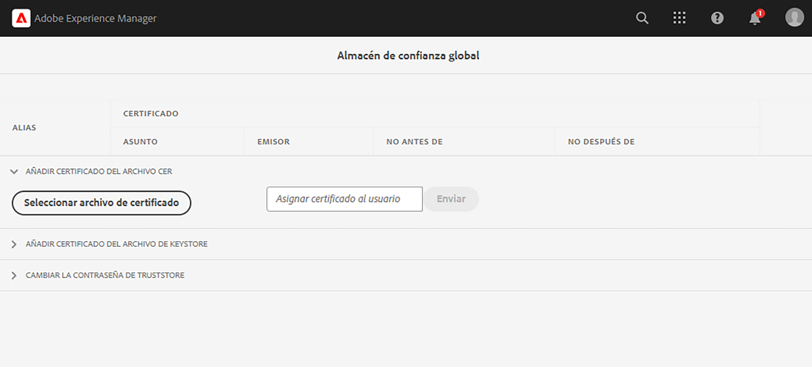

# Llamar a API internas que tienen certificados privados

AEM Obtenga información sobre cómo realizar llamadas HTTPS desde la a las API web mediante certificados privados o autofirmados.

>[!VIDEO](https://video.tv.adobe.com/v/3424853?quality=12&learn=on)

De forma predeterminada, al intentar establecer una conexión HTTPS con una API web que utiliza un certificado firmado automáticamente, la conexión falla con el siguiente error:

```
PKIX path building failed: sun.security.provider.certpath.SunCertPathBuilderException: unable to find valid certification path to requested target
```

Este problema suele ocurrir cuando la variable **El certificado SSL de la API no lo emite una entidad de certificación (CA) reconocida** y la aplicación Java™ no puede validar el certificado SSL/TLS.

Vamos a aprender a llamar correctamente a las API que tienen certificados privados o autofirmados mediante [Apache HttpClient](https://hc.apache.org/httpcomponents-client-4.5.x/index.html) y **AEM Almacén de confianza global de**.


## Código de invocación de API prototípico mediante HttpClient

El siguiente código establece una conexión HTTPS con una API web:

```java
...
String API_ENDPOINT = "https://example.com";

// Create HttpClientBuilder
HttpClientBuilder httpClientBuilder = HttpClientBuilder.create();

// Create HttpClient
CloseableHttpClient httpClient = httpClientBuilder.build();

// Invoke API
CloseableHttpResponse closeableHttpResponse = httpClient.execute(new HttpGet(API_ENDPOINT));

// Code that reads response code and body from the 'closeableHttpResponse' object
...
```

El código utiliza el [Apache HttpComponent](https://hc.apache.org/)de [HttpClient](https://hc.apache.org/httpcomponents-client-4.5.x/index.html) clases de biblioteca y sus métodos.


## AEM HttpClient y cargar material de TrustStore de la

Para llamar a un extremo de API que tiene _certificado privado o autofirmado_, el [HttpClient](https://hc.apache.org/httpcomponents-client-4.5.x/index.html)de `SSLContextBuilder` AEM debe cargarse con el almacén de confianza de la y utilizarse para facilitar la conexión.

Siga estos pasos:

1. Inicie sesión en **AEM Autor de** como un **administrador**.
1. Vaya a **AEM Autor de la > Herramientas > Seguridad > Almacén de confianza** y abra el **Almacén de confianza global**. Si accede a la primera vez, establezca una contraseña para el Almacén de confianza global.

   

1. Para importar un certificado privado, haga clic en **Seleccionar archivo de certificado** y seleccione el archivo de certificado deseado con `.cer` extensión. Importe haciendo clic en **Enviar** botón.

1. Actualice el código Java™ como se muestra a continuación. Tenga en cuenta que para utilizar `@Reference` AEM para obtener la `KeyStoreService` el código de llamada debe ser un componente o servicio OSGi o un modelo Sling (y `@OsgiService` se utiliza allí).

   ```java
   ...
   
   // Get AEM's KeyStoreService reference
   @Reference
   private com.adobe.granite.keystore.KeyStoreService keyStoreService;
   
   ...
   
   // Get AEM TrustStore using KeyStoreService
   KeyStore aemTrustStore = getAEMTrustStore(keyStoreService, resourceResolver);
   
   if (aemTrustStore != null) {
   
       // Create SSL Context
       SSLContextBuilder sslbuilder = new SSLContextBuilder();
   
       // Load AEM TrustStore material into above SSL Context
       sslbuilder.loadTrustMaterial(aemTrustStore, null);
   
       // Create SSL Connection Socket using above SSL Context
       SSLConnectionSocketFactory sslsf = new SSLConnectionSocketFactory(
               sslbuilder.build(), NoopHostnameVerifier.INSTANCE);
   
       // Create HttpClientBuilder
       HttpClientBuilder httpClientBuilder = HttpClientBuilder.create();
       httpClientBuilder.setSSLSocketFactory(sslsf);
   
       // Create HttpClient
       CloseableHttpClient httpClient = httpClientBuilder.build();
   
       // Invoke API
       closeableHttpResponse = httpClient.execute(new HttpGet(API_ENDPOINT));
   
       // Code that reads response code and body from the 'closeableHttpResponse' object
       ...
   } 
   
   /**
    * 
    * Returns the global AEM TrustStore
    * 
    * @param keyStoreService OOTB OSGi service that makes AEM based KeyStore
    *                         operations easy.
    * @param resourceResolver
    * @return
    */
   private KeyStore getAEMTrustStore(KeyStoreService keyStoreService, ResourceResolver resourceResolver) {
   
       // get AEM TrustStore from the KeyStoreService and ResourceResolver
       KeyStore aemTrustStore = keyStoreService.getTrustStore(resourceResolver);
   
       return aemTrustStore;
   }
   
   ...
   ```

   * Inyectar el OOTB `com.adobe.granite.keystore.KeyStoreService` Servicio OSGi en el componente OSGi.
   * AEM Obtener el almacén global de confianza de mediante `KeyStoreService` y `ResourceResolver`, el `getAEMTrustStore(...)` El método hace eso.
   * Crear un objeto de `SSLContextBuilder`, consulte Java™ [Detalles de API](https://javadoc.io/static/org.apache.httpcomponents/httpcore/4.4.8/index.html?org/apache/http/ssl/SSLContextBuilder.html).
   * AEM Cargar el almacén global de confianza de la en `SSLContextBuilder` usando `loadTrustMaterial(KeyStore truststore,TrustStrategy trustStrategy)` método.
   * Aprobado `null` para `TrustStrategy` AEM en el método anterior, se garantiza que solo los certificados de confianza de los clientes se ejecuten correctamente durante la ejecución de la API.


>[!CAUTION]
>
>Las llamadas a la API con certificados emitidos por la CA válidos fallan cuando se ejecutan con el método mencionado. AEM Solo las llamadas de API con certificados de confianza de la pueden realizarse correctamente al seguir este método.
>
>Utilice el [enfoque estándar](#prototypical-api-invocation-code-using-httpclient) para ejecutar llamadas de API de certificados emitidos por la CA válidos, lo que significa que solo las API asociadas con certificados privados deben ejecutarse con el método mencionado anteriormente.

## Evitar cambios en el almacén de claves JVM

Un enfoque convencional para invocar de forma eficaz las API internas con certificados privados implica la modificación del repositorio de claves JVM. Se logra importando los certificados privados mediante Java™ [keytool](https://docs.oracle.com/en/java/javase/11/tools/keytool.html#GUID-5990A2E4-78E3-47B7-AE75-6D1826259549) comando.

AEM Sin embargo, este método no está alineado con las prácticas recomendadas de seguridad y ofrece una opción superior a través de la utilización del **Almacén de confianza global** y [KeyStoreService](https://javadoc.io/doc/com.adobe.aem/aem-sdk-api/latest/com/adobe/granite/keystore/KeyStoreService.html).


## Paquete de soluciones

El proyecto Node.js de muestra degradado en el vídeo se puede descargar desde [aquí](assets/internal-api-call/REST-APIs.zip).

AEM El código de servlet de la está disponible en el sitio web del proyecto WKND Sites `tutorial/web-api-invocation` rama, [consulte](https://github.com/adobe/aem-guides-wknd/tree/tutorial/web-api-invocation/core/src/main/java/com/adobe/aem/guides/wknd/core/servlets).
