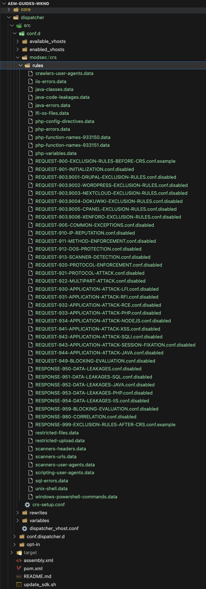

# Utilice ModSecurity para proteger el sitio de AEM de ataques DoS

Aprenda a habilitar ModSecurity para proteger el sitio de ataques de denegación de servicio (DoS) mediante el **conjunto de reglas principales (CRS) de OWASP ModSecurity** en Publish Dispatcher de Adobe Experience Manager (AEM).


>[!VIDEO](https://video.tv.adobe.com/v/3452127?quality=12&learn=on&captions=spa)

## Información general

La base de [Open Web Application Security Project® (OWASP)](https://owasp.org/) entrega el informe [**Top 10 de OWASP**](https://owasp.org/www-project-top-ten/) con los diez riesgos de seguridad más importantes en aplicaciones web.

ModSecurity es una solución de código abierto en plataformas múltiples que ofrece protección contra una amplia gama de ataques en aplicaciones web. También permite la monitorización del tráfico HTTP, el registro y el análisis en tiempo real.

OWSAP® también proporciona el conjunto de reglas [OWASP® ModSecurity Core Rule Set (CRS)](https://github.com/coreruleset/coreruleset). El CRS es un conjunto de reglas de **detección de ataques** genéricas para usar con ModSecurity. Por lo tanto, el CRS tiene como objetivo proteger las aplicaciones web de una amplia gama de ataques, incluido el Top 10 de OWASP, con un mínimo de alertas falsas.

Este tutorial muestra cómo habilitar y configurar la regla CRS **DOS-PROTECTION** para proteger su sitio de un posible ataque DoS.

>[!TIP]
>
>Es importante tener en cuenta que la [CDN administrada](https://experienceleague.adobe.com/docs/experience-manager-cloud-service/content/implementing/content-delivery/cdn.html?lang=es) de AEM as a Cloud Service satisface la mayoría de los requisitos de seguridad y rendimiento para los clientes. Asimismo, ModSecurity proporciona una capa adicional de seguridad y permite las reglas y configuraciones específicas del cliente.

## Adición del CRS al módulo de proyecto de Dispatcher

1. Descargue y extraiga el [último Conjunto de reglas principales de ModSecurity de OWASP](https://github.com/coreruleset/coreruleset/releases).

   ```shell
   # Replace the X.Y.Z with relevent version numbers.
   $ wget https://github.com/coreruleset/coreruleset/archive/refs/tags/vX.Y.Z.tar.gz
   
   # For version v3.3.5 when this tutorial is published
   $ wget https://github.com/coreruleset/coreruleset/archive/refs/tags/v3.3.5.tar.gz
   
   # Extract the downloaded file
   $ tar -xvzf coreruleset-3.3.5.tar.gz
   ```

1. Cree las carpetas `modsec/crs` dentro de `dispatcher/src/conf.d/` en el código de su proyecto de AEM. Por ejemplo, en la copia local del [proyecto del sitio WKND de AEM]( https://github.com/adobe/aem-guides-wknd).

   {width="200" zoomable="yes"}

1. Copie la carpeta `coreruleset-X.Y.Z/rules` del paquete descargado de la versión de CRS en la carpeta `dispatcher/src/conf.d/modsec/crs`.
1. Copie el archivo `coreruleset-X.Y.Z/crs-setup.conf.example` del paquete de la versión de CRS descargado en la carpeta `dispatcher/src/conf.d/modsec/crs` y renómbrelo a `crs-setup.conf`.
1. Deshabilite todas las reglas de CRS copiadas de `dispatcher/src/conf.d/modsec/crs/rules` y cambie su nombre a `XXXX-XXX-XXX.conf.disabled`. Puede utilizar los siguientes comandos para cambiar el nombre de todos los archivos a la vez.

   ```shell
   # Go inside the newly created rules directory within the dispathcher module
   $ cd dispatcher/src/conf.d/modsec/crs/rules
   
   # Rename all '.conf' extension files to '.conf.disabled'
   $ for i in *.conf; do mv -- "$i" "$i.disabled"; done
   ```

   Consulte las reglas de CRS renombradas y el archivo de configuración en el código del proyecto WKND.

   {width="200" zoomable="yes"}

## Habilitación y configuración de la regla de protección de denegación de servicio (DoS)

Siga estos pasos para habilitar y configurar la regla de protección de denegación de servicio (DoS):

1. Habilite la regla de protección de DoS cambiando el nombre de `REQUEST-912-DOS-PROTECTION.conf.disabled` a `REQUEST-912-DOS-PROTECTION.conf` (o quite `.disabled` de la extensión rulename) en la carpeta `dispatcher/src/conf.d/modsec/crs/rules`.
1. Configure la regla definiendo las variables **DOS_COUNTER_THRESHOLD, DOS_BURST_TIME_SLICE, DOS_BLOCK_TIMEOUT**.
   1. Cree el archivo `crs-setup.custom.conf` dentro de la carpeta `dispatcher/src/conf.d/modsec/crs`.
   1. Añada el siguiente fragmento de regla al archivo recién creado.

   ```
   # The Denial of Service (DoS) protection against clients making requests too quickly.
   # When a client is making more than 25 requests (excluding static files) within
   # 60 seconds, this is considered a 'burst'. After two bursts, the client is
   # blocked for 600 seconds.
   SecAction \
       "id:900700,\
       phase:1,\
       nolog,\
       pass,\
       t:none,\
       setvar:'tx.dos_burst_time_slice=60',\
       setvar:'tx.dos_counter_threshold=25',\
       setvar:'tx.dos_block_timeout=600'"    
   ```

En esta configuración de regla de ejemplo, el tiempo de espera de **DOS_COUNTER_THRESHOLD** es de 25 segundos, el de **DOS_BURST_TIME_SLICE** de 60 y **DOS_BLOCK_TIMEOUT** de 600 segundos. Esta configuración identifica más de dos incidencias de 25 solicitudes, excluidos los archivos estáticos, en un plazo de 60 segundos que cumplen los requisitos de ataque DoS, lo que provoca que el cliente solicitante se bloquee durante 600 segundos (o 10 minutos).

>[!WARNING]
>
>Para definir los valores adecuados para sus necesidades, colabore con su equipo de seguridad web.

## Inicializar el CRS

Para inicializar el CRS, quitar los falsos positivos comunes y añadir excepciones locales para el sitio, siga los siguientes pasos:

1. Para inicializar el CRS, quite `.disabled` del archivo **REQUEST-901-INITIALIZATION**. En otras palabras, cambie el nombre del archivo `REQUEST-901-INITIALIZATION.conf.disabled` a `REQUEST-901-INITIALIZATION.conf`.
1. Para quitar los falsos positivos comunes como el ping de IP local (127.0.0.1), quite `.disabled` del archivo **REQUEST-905-COMMON-EXCEPTIONS**.
1. Para añadir excepciones locales como la plataforma AEM o las rutas específicas del sitio, cambie el nombre de `REQUEST-900-EXCLUSION-RULES-BEFORE-CRS.conf.example` a `REQUEST-900-EXCLUSION-RULES-BEFORE-CRS.conf`
   1. Añada excepciones de ruta específicas de la plataforma AEM al archivo con el nuevo nombre.

   ```
   ########################################################
   # AEM as a Cloud Service exclusions                    #
   ########################################################
   # Ignoring AEM-CS Specific internal and reserved paths
   
   SecRule REQUEST_URI "@beginsWith /systemready" \
       "id:1010,\
       phase:1,\
       pass,\
       nolog,\
       ctl:ruleEngine=Off"    
   
   SecRule REQUEST_URI "@beginsWith /system/probes" \
       "id:1011,\
       phase:1,\
       pass,\
       nolog,\
       ctl:ruleEngine=Off"
   
   SecRule REQUEST_URI "@beginsWith /gitinit-status" \
       "id:1012,\
       phase:1,\
       pass,\
       nolog,\
       ctl:ruleEngine=Off"
   
   ########################################################
   # ADD YOUR SITE related exclusions                     #
   ########################################################
   ...
   ```

1. Además, quite `.disabled` de **REQUEST-910-IP-REPUTATION.conf.disabled** para la comprobación de bloques de reputación de IP y `REQUEST-949-BLOCKING-EVALUATION.conf.disabled` para la comprobación de puntuación de anomalías.

>[!TIP]
>
>Al configurar en AEM 6.5, asegúrese de reemplazar las rutas anteriores por rutas AMS o locales respectivas que comprueben el estado de AEM (es decir, rutas de latido).

## Añadir una configuración de ModSecurity Apache

Para habilitar ModSecurity (también conocido como módulo Apache `mod_security`), siga los siguientes pasos:

1. Cree `modsecurity.conf` en `dispatcher/src/conf.d/modsec/modsecurity.conf` con las siguientes configuraciones clave.

   ```
   # Include the baseline crs setup
   Include conf.d/modsec/crs/crs-setup.conf
   
   # Include your customizations to crs setup if exist
   IncludeOptional conf.d/modsec/crs/crs-setup.custom.conf
   
   # Select all available CRS rules:
   #Include conf.d/modsec/crs/rules/*.conf
   
   # Or alternatively list only specific ones you want to enable e.g.
   Include conf.d/modsec/crs/rules/REQUEST-900-EXCLUSION-RULES-BEFORE-CRS.conf
   Include conf.d/modsec/crs/rules/REQUEST-901-INITIALIZATION.conf
   Include conf.d/modsec/crs/rules/REQUEST-905-COMMON-EXCEPTIONS.conf
   Include conf.d/modsec/crs/rules/REQUEST-910-IP-REPUTATION.conf
   Include conf.d/modsec/crs/rules/REQUEST-912-DOS-PROTECTION.conf
   Include conf.d/modsec/crs/rules/REQUEST-949-BLOCKING-EVALUATION.conf
   
   # Start initially with engine off, then switch to detection and observe, and when sure enable engine actions
   #SecRuleEngine Off
   #SecRuleEngine DetectionOnly
   SecRuleEngine On
   
   # Remember to use relative path for logs:
   SecDebugLog logs/httpd_mod_security_debug.log
   
   # Start with low debug level
   SecDebugLogLevel 0
   #SecDebugLogLevel 1
   
   # Start without auditing
   SecAuditEngine Off
   #SecAuditEngine RelevantOnly
   #SecAuditEngine On
   
   # Tune audit accordingly:
   SecAuditLogRelevantStatus "^(?:5|4(?!04))"
   SecAuditLogParts ABIJDEFHZ
   SecAuditLogType Serial
   
   # Remember to use relative path for logs:
   SecAuditLog logs/httpd_mod_security_audit.log
   
   # You might still use /tmp for temporary/work files:
   SecTmpDir /tmp
   SecDataDir /tmp
   ```

1. Seleccione el(la) `.vhost` deseado(a) del módulo de Dispatcher del proyecto AEM `dispatcher/src/conf.d/available_vhosts`, por ejemplo, `wknd.vhost`, y añada la siguiente entrada fuera del bloque `<VirtualHost>`.

   ```
   # Enable the ModSecurity and OWASP CRS
   <IfModule mod_security2.c>
       Include conf.d/modsec/modsecurity.conf
   </IfModule>
   
   ...
   
   <VirtualHost *:80>
       ServerName    "publish"
       ...
   </VirtualHost>
   ```

Todas las configuraciones anteriores de _ModSecurity CRS_ y _DOS-PROTECTION_ están disponibles en la rama [tutorial/enable-modsecurity-crs-dos-protection](https://github.com/adobe/aem-guides-wknd/tree/tutorial/enable-modsecurity-crs-dos-protection) del proyecto AEM WKND Sites para que las revise.

### Valide la configuración de Dispatcher

Al trabajar con AEM as a Cloud Service, antes de implementar los cambios de la _configuración de Dispatcher_, se recomienda validarlos localmente mediante el script `validate` de las [herramientas de Dispatcher de AEM SDK](https://experienceleague.adobe.com/docs/experience-manager-learn/cloud-service/local-development-environment-set-up/dispatcher-tools.html?lang=es).

```
# Go inside Dispatcher SDK 'bin' directory
$ cd <YOUR-AEM-SDK-DIR>/<DISPATCHER-SDK-DIR>/bin

# Validate the updated Dispatcher configurations
$ ./validate.sh <YOUR-AEM-PROJECT-CODE-DIR>/dispatcher/src
```

## Implementación

Implemente las configuraciones de Dispatcher validadas localmente mediante la canalización de Cloud Manager [nivel web](https://experienceleague.adobe.com/docs/experience-manager-cloud-service/content/implementing/using-cloud-manager/cicd-pipelines/configuring-production-pipelines.html?lang=es#web-tier-config) o [pila completa](https://experienceleague.adobe.com/docs/experience-manager-cloud-service/content/implementing/using-cloud-manager/cicd-pipelines/configuring-production-pipelines.html?lang=es#full-stack-code). También puede usar el [Entorno de desarrollo rápido]( https://experienceleague.adobe.com/docs/experience-manager-learn/cloud-service/developing/rde/overview.html?lang=es) para obtener un tiempo de respuesta más rápido.

## Verificar

Para verificar la protección del DoS, en este ejemplo, enviemos más de 50 solicitudes (25 umbrales de solicitud por dos incidencias) en un lapso de 60 segundos. Sin embargo, estas solicitudes deben pasar por el CDN de AEM as a Cloud Service [integrado](https://experienceleague.adobe.com/docs/experience-manager-cloud-service/content/implementing/content-delivery/cdn.html?lang=es) o cualquier [otro CDN](https://experienceleague.adobe.com/docs/experience-manager-cloud-service/content/implementing/content-delivery/cdn.html?lang=es#point-to-point-CDN) que se encuentre frente al sitio web.

Una técnica para lograr el paso a través de CDN es añadir un parámetro de consulta con un **nuevo valor aleatorio en cada solicitud de página de sitio**.

Para activar un mayor número de solicitudes (50 o más) en un período corto (unos 60 segundos), se puede usar Apache [JMeter](https://jmeter.apache.org/) o [Benchmark o una herramienta AB]( https://httpd.apache.org/docs/2.4/programs/ab.html?lang=es).

### Simulación de un ataque DoS mediante un script JMeter

Para simular un ataque DoS utilizando JMeter, siga los siguientes pasos:

1. [Descargue Apache JMeter](https://jmeter.apache.org/download_jmeter.cgi) e [instálelo](https://jmeter.apache.org/usermanual/get-started.html?lang=es#install) localmente
1. [Ejecútelo](https://jmeter.apache.org/usermanual/get-started.html?lang=es#running) localmente mediante el script `jmeter` desde el directorio `<JMETER-INSTALL-DIR>/bin`.
1. Abra el script JMX [WKND-DoS-Attack-Simulation-Test](assets/modsecurity-crs/WKND-DoS-Attack-Simulation-Test.jmx) de muestra en JMeter mediante el menú de herramientas **Abrir**.

   

1. Actualice el valor del campo **Nombre del servidor o IP** en _página de inicio_ y el muestreador de petición HTTP de _página de aventura_ para que coincida con la URL del entorno de AEM de prueba. Revise otros detalles del script de ejemplo de JMeter.

   

1. Ejecute el script presionando el botón **Iniciar** del menú de herramientas. El script envía 50 solicitudes HTTP (5 usuarios y 10 recuentos de bucles) contra la _página principal_ y la _página de aventura_ del sitio WKND. Por lo tanto, un total de 100 solicitudes a archivos no estáticos, califica el ataque DoS por la configuración personalizada de regla CRS **DOS-PROTECTION**.

   

1. La escucha JMeter de **Ver resultados en la tabla** muestra el estado de respuesta **Error** para el número de solicitud ~ 53 y posterior.

   

1. Se devuelve el **código de respuesta HTTP 503** para las solicitudes con errores. Puede ver los detalles con el detector JMeter **Ver árbol de resultados**.

   

### Revisar registros

La configuración del registrador de ModSecurity registra los detalles del incidente de ataque DoS. Para ver los detalles, siga estos pasos:

1. Descargue y abra el archivo de registro `httpderror` de **Publish Dispatcher**.
1. Busque la palabra `burst` en el archivo de registro para ver las líneas de **error**

   ```
   Tue Aug 15 15:19:40.229262 2023 [security2:error] [pid 308:tid 140200050567992] [cm-p46652-e1167810-aem-publish-85df5d9954-bzvbs] [client 192.150.10.209] ModSecurity: Warning. Operator GE matched 2 at IP:dos_burst_counter. [file "/etc/httpd/conf.d/modsec/crs/rules/REQUEST-912-DOS-PROTECTION.conf"] [line "265"] [id "912170"] [msg "Potential Denial of Service (DoS) Attack from 192.150.10.209 - # of Request Bursts: 2"] [ver "OWASP_CRS/3.3.5"] [tag "application-multi"] [tag "language-multi"] [tag "platform-multi"] [tag "paranoia-level/1"] [tag "attack-dos"] [tag "OWASP_CRS"] [tag "capec/1000/210/227/469"] [hostname "publish-p46652-e1167810.adobeaemcloud.com"] [uri "/content/wknd/us/en/adventures.html"] [unique_id "ZNuXi9ft_9sa85dovgTN5gAAANI"]
   
   ...
   
   Tue Aug 15 15:19:40.515237 2023 [security2:error] [pid 309:tid 140200051428152] [cm-p46652-e1167810-aem-publish-85df5d9954-bzvbs] [client 192.150.10.209] ModSecurity: Access denied with connection close (phase 1). Operator EQ matched 0 at IP. [file "/etc/httpd/conf.d/modsec/crs/rules/REQUEST-912-DOS-PROTECTION.conf"] [line "120"] [id "912120"] [msg "Denial of Service (DoS) attack identified from 192.150.10.209 (1 hits since last alert)"] [ver "OWASP_CRS/3.3.5"] [tag "application-multi"] [tag "language-multi"] [tag "platform-multi"] [tag "paranoia-level/1"] [tag "attack-dos"] [tag "OWASP_CRS"] [tag "capec/1000/210/227/469"] [hostname "publish-p46652-e1167810.adobeaemcloud.com"] [uri "/us/en.html"] [unique_id "ZNuXjAN7ZtmIYHGpDEkmmwAAAQw"]
   ```

1. Revise los detalles como _dirección IP del cliente_, acción, mensaje de error y detalles de solicitud.

## Impacto en el rendimiento de ModSecurity

La activación de ModSecurity y sus reglas asociadas tienen algunas implicaciones en el rendimiento, por lo que hay que tener en cuenta qué reglas son necesarias, cuáles son redundantes y cuáles se deben omitir. Colabore con sus expertos en seguridad web para habilitar y personalizar las reglas de CRS.

### Reglas adicionales

Este tutorial solo habilita y personaliza la regla de CRS **DOS-PROTECTION** solo como demostración. Se recomienda asociarse con expertos en seguridad web para comprender, revisar y configurar las reglas adecuadas.
