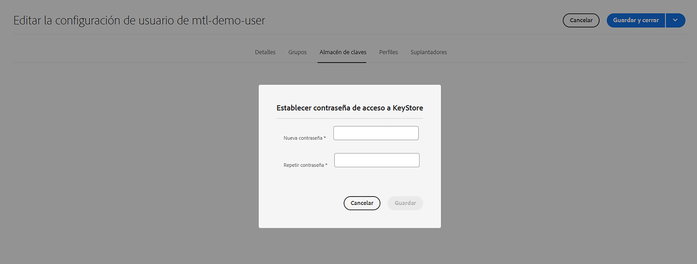
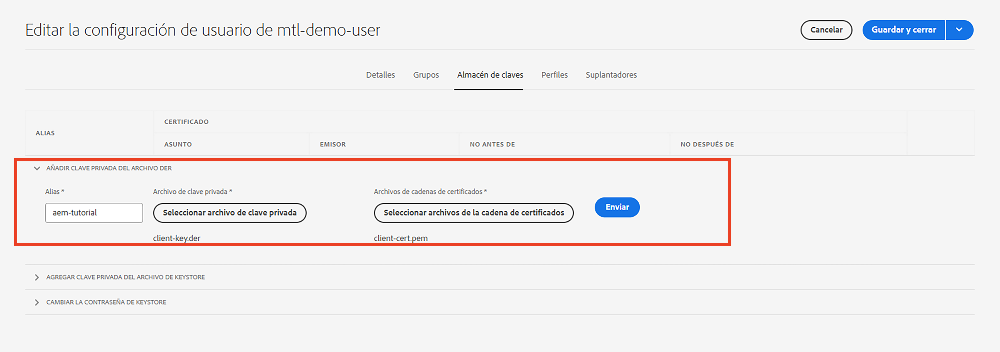
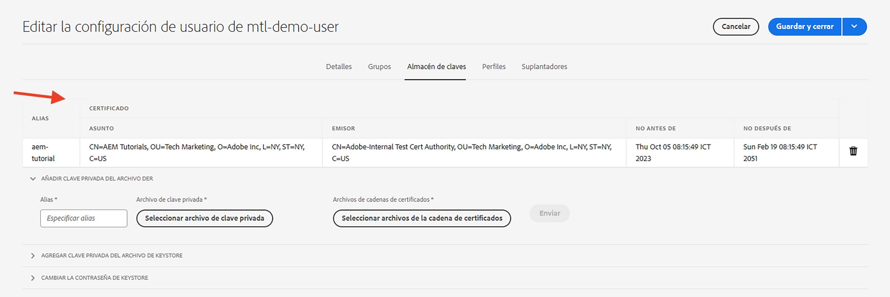

# Autenticación Mutual Transport Layer Security (mTLS) desde AEM

Aprenda a realizar llamadas HTTPS desde AEM a las API web que requieran autenticación Mutual Transport Layer Security (mTLS).

>[!VIDEO](https://video.tv.adobe.com/v/3424855?quality=12&learn=on)

La autenticación mTLS o TLS bidireccional mejora la seguridad del protocolo TLS al requerir que **tanto el cliente como el servidor se autentiquen mutuamente**. Esta autenticación se realiza mediante certificados digitales. Se utiliza comúnmente en escenarios donde la seguridad sólida y la verificación de identidad son críticas.

De forma predeterminada, al intentar establecer una conexión HTTPS con una API web que requiera autenticación mTLS, la conexión falla con el siguiente error:

```
javax.net.ssl.SSLHandshakeException: Received fatal alert: certificate_required
```

Este problema se produce cuando el cliente no presenta un certificado para autenticarse a sí mismo.

Vamos a aprender a llamar correctamente a las API que requieren autenticación mTLS mediante [Apache HttpClient](https://hc.apache.org/httpcomponents-client-4.5.x/index.html?lang=es) y **KeyStore y TrustStore de AEM**.


## HttpClient y carga del material KeyStore de AEM

En un nivel superior, se requieren los siguientes pasos para llamar a una API protegida mTLS desde AEM.

### Generación de certificados de AEM

Solicite el certificado de AEM colaborando con el equipo de seguridad de su organización. El equipo de seguridad proporciona o solicita los detalles relacionados con el certificado, como la clave, la solicitud de firma de certificado (CSR) y, mediante CSR, se emite el certificado.

A efectos de demostración, genere los detalles relacionados con el certificado, como la clave, la solicitud de firma de certificado (CSR). En el siguiente ejemplo, se utiliza una CA autofirmada para emitir el certificado.

- En primer lugar, genere el certificado interno de la entidad de certificación (CA).

  ```shell
  # Create an internal Certification Authority (CA) certificate
  openssl req -new -x509 -days 9999 -keyout internal-ca-key.pem -out internal-ca-cert.pem
  ```

- Genere el certificado de AEM.

  ```shell
  # Generate Key
  openssl genrsa -out client-key.pem
  
  # Generate CSR
  openssl req -new -key client-key.pem -out client-csr.pem
  
  # Generate certificate and sign with internal Certification Authority (CA)
  openssl x509 -req -days 9999 -in client-csr.pem -CA internal-ca-cert.pem -CAkey internal-ca-key.pem -CAcreateserial -out client-cert.pem
  
  # Verify certificate
  openssl verify -CAfile internal-ca-cert.pem client-cert.pem
  ```

- Convierta la clave privada de AEM al formato DER, ya que el almacén de claves de AEM requiere la clave privada en formato DER.

  ```shell
  openssl pkcs8 -topk8 -inform PEM -outform DER -in client-key.pem -out client-key.der -nocrypt
  ```

>[!TIP]
>
>Los certificados de CA firmados automáticamente solo se utilizan para el desarrollo. Para la producción, utilice una entidad emisora de certificados (CA) de confianza para emitir el certificado.


### Intercambio de certificados

Si utiliza una CA autofirmada para el certificado de AEM, como en el caso anterior, envíe el certificado o el certificado de la entidad de certificación (CA) interno al proveedor de la API.

Además, si el proveedor de API utiliza un certificado de CA autofirmado, reciba el certificado o el certificado de la entidad de certificación (CA) interno del proveedor de API.

### Importación de certificados

Para importar el certificado de AEM, siga estos pasos:

1. Inicie sesión en **AEM Author** como **administrador**.

1. Vaya a **AEM Author > Herramientas > Seguridad > Usuarios > Crear o seleccionar un usuario existente**.

   

   A efectos de demostración, se crea un nuevo usuario denominado `mtl-demo-user`.

1. Para abrir **Propiedades de usuario**, haga clic en el nombre de usuario.

1. Haga clic en la pestaña **Almacén de claves** y luego haga clic en el botón **Crear almacén de claves**. A continuación, en el cuadro de diálogo **Establecer contraseña de acceso a KeyStore**, establezca una contraseña para el almacén de claves de este usuario y haga clic en Guardar.

   

1. En la nueva pantalla, en la sección **AGREGAR CLAVE PRIVADA DEL ARCHIVO DER**, siga estos pasos:

   1. Especificar alias

   1. Importe la clave privada de AEM en formato DER, generada anteriormente.

   1. Importe los archivos de la cadena de certificados generados anteriormente.

   1. Haga clic en Enviar

      

1. Compruebe que el certificado se ha importado correctamente.

   

Si el proveedor de API utiliza un certificado de CA autofirmado, importe el certificado recibido en el TrustStore de AEM y siga los pasos desde [aquí](https://experienceleague.adobe.com/docs/experience-manager-learn/foundation/security/call-internal-apis-having-private-certificate.html#httpclient-and-load-aem-truststore-material).

Del mismo modo, si AEM utiliza un certificado de CA autofirmado, solicite al proveedor de API que lo importe.

### Código de invocación de API de mTLS prototípica mediante HttpClient

Actualice el código Java™ como se muestra a continuación. Para usar la anotación `@Reference` para obtener el servicio `KeyStoreService` de AEM, el código de llamada debe ser un componente o servicio OSGi o un modelo Sling (y `@OsgiService` se usa allí).


```java
...

// Get AEM's KeyStoreService reference
@Reference
private com.adobe.granite.keystore.KeyStoreService keyStoreService;

...

// Get AEM KeyStore using KeyStoreService
KeyStore aemKeyStore = getAEMKeyStore(keyStoreService, resourceResolver);

if (aemKeyStore != null) {

    // Create SSL Context
    SSLContextBuilder sslbuilder = new SSLContextBuilder();

    // Load AEM KeyStore material into above SSL Context with keystore password
    // Ideally password should be encrypted and stored in OSGi config
    sslbuilder.loadKeyMaterial(aemKeyStore, "admin".toCharArray());

    // If API provider cert is self-signed, load AEM TrustStore material into above SSL Context
    // Get AEM TrustStore
    KeyStore aemTrustStore = getAEMTrustStore(keyStoreService, resourceResolver);
    sslbuilder.loadTrustMaterial(aemTrustStore, null);

    // Create SSL Connection Socket using above SSL Context
    SSLConnectionSocketFactory sslsf = new SSLConnectionSocketFactory(
            sslbuilder.build(), NoopHostnameVerifier.INSTANCE);

    // Create HttpClientBuilder
    HttpClientBuilder httpClientBuilder = HttpClientBuilder.create();
    httpClientBuilder.setSSLSocketFactory(sslsf);

    // Create HttpClient
    CloseableHttpClient httpClient = httpClientBuilder.build();

    // Invoke API
    closeableHttpResponse = httpClient.execute(new HttpGet(MTLS_API_ENDPOINT));

    // Code that reads response code and body from the 'closeableHttpResponse' object
    ...
} 

/**
 * Returns the AEM KeyStore of a user. In this example we are using the
 * 'mtl-demo-user' user.
 * 
 * @param keyStoreService
 * @param resourceResolver
 * @return AEM KeyStore
 */
private KeyStore getAEMKeyStore(KeyStoreService keyStoreService, ResourceResolver resourceResolver) {

    // get AEM KeyStore of 'mtl-demo-user' user, you can create a user or use an existing one. 
    // Then create keystore and upload key, certificate files.
    KeyStore aemKeyStore = keyStoreService.getKeyStore(resourceResolver, "mtl-demo-user");

    return aemKeyStore;
}

/**
 * 
 * Returns the global AEM TrustStore
 * 
 * @param keyStoreService OOTB OSGi service that makes AEM based KeyStore
 *                         operations easy.
 * @param resourceResolver
 * @return
 */
private KeyStore getAEMTrustStore(KeyStoreService keyStoreService, ResourceResolver resourceResolver) {

    // get AEM TrustStore from the KeyStoreService and ResourceResolver
    KeyStore aemTrustStore = keyStoreService.getTrustStore(resourceResolver);

    return aemTrustStore;
}

...
```

- Inserte el servicio OSGi `com.adobe.granite.keystore.KeyStoreService` de OOTB en su componente OSGi.
- Obtenga el almacén de claves AEM del usuario mediante `KeyStoreService` y `ResourceResolver`. El método `getAEMKeyStore(...)` lo hace.
- Si el proveedor de API utiliza un certificado de CA autofirmado, obtenga el almacén de confianza de AEM global. El método `getAEMTrustStore(...)` lo hace.
- Cree un objeto de `SSLContextBuilder`, consulte la [API de Java™](https://javadoc.io/static/org.apache.httpcomponents/httpcore/4.4.8/index.html?org/apache/http/ssl/SSLContextBuilder.html?lang=es) para obtener más información.
- Cargue el almacén de claves AEM del usuario en `SSLContextBuilder` mediante el método `loadKeyMaterial(final KeyStore keystore,final char[] keyPassword)`.
- La contraseña del almacén de claves es la contraseña que se estableció al crear el almacén de claves; debe almacenarse en la configuración OSGi; consulte [Valores de configuración secretos](https://experienceleague.adobe.com/docs/experience-manager-cloud-service/content/implementing/deploying/configuring-osgi.html?lang=es#secret-configuration-values).

## Evitar cambios en el almacén de claves JVM

Un enfoque convencional para invocar de forma eficaz las API de mTLS con certificados privados implica la modificación del repositorio de claves JVM. Se logra importando los certificados privados mediante el comando [keytool](https://docs.oracle.com/en/java/javase/11/tools/keytool.html?lang=es#GUID-5990A2E4-78E3-47B7-AE75-6D1826259549) de Java™.

Sin embargo, este método no está alineado con las prácticas recomendadas de seguridad y AEM ofrece una opción superior mediante el uso de **Almacenes de claves específicos del usuario y almacén de confianza global** y [KeyStoreService](https://javadoc.io/doc/com.adobe.aem/aem-sdk-api/latest/com/adobe/granite/keystore/KeyStoreService.html?lang=es).

## Paquete de soluciones

El proyecto Node.js de muestra que se muestra en el vídeo se puede descargar desde [aquí](assets/internal-api-call/REST-APIs.zip).

El código de servlet de AEM está disponible en la rama `tutorial/web-api-invocation` del proyecto WKND de Sites; [vea](https://github.com/adobe/aem-guides-wknd/tree/tutorial/web-api-invocation/core/src/main/java/com/adobe/aem/guides/wknd/core/servlets).
