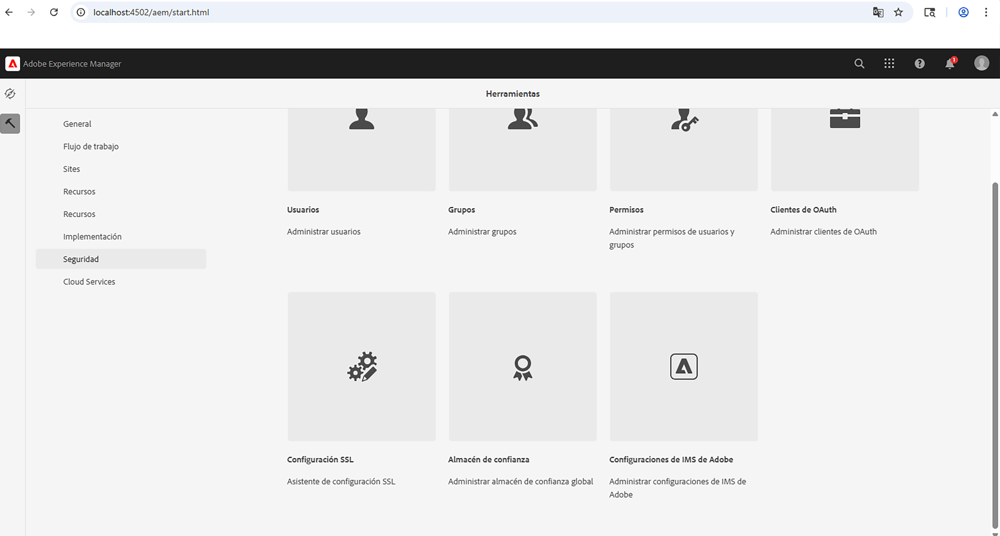
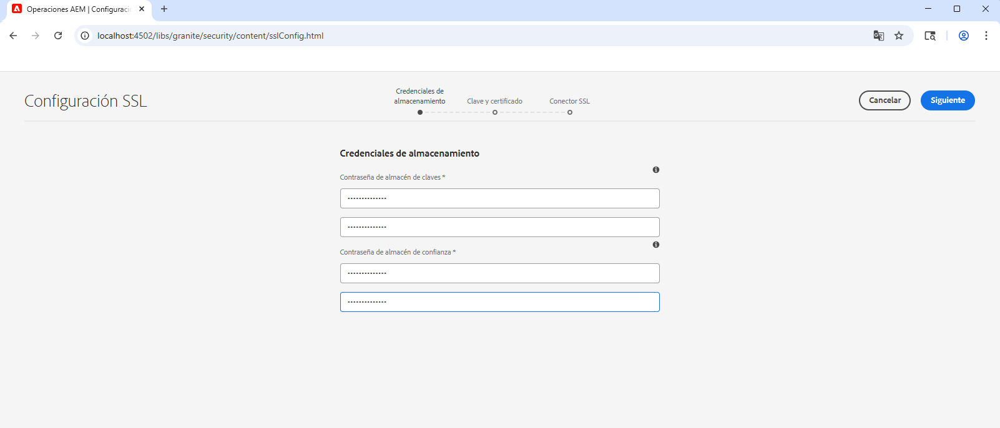
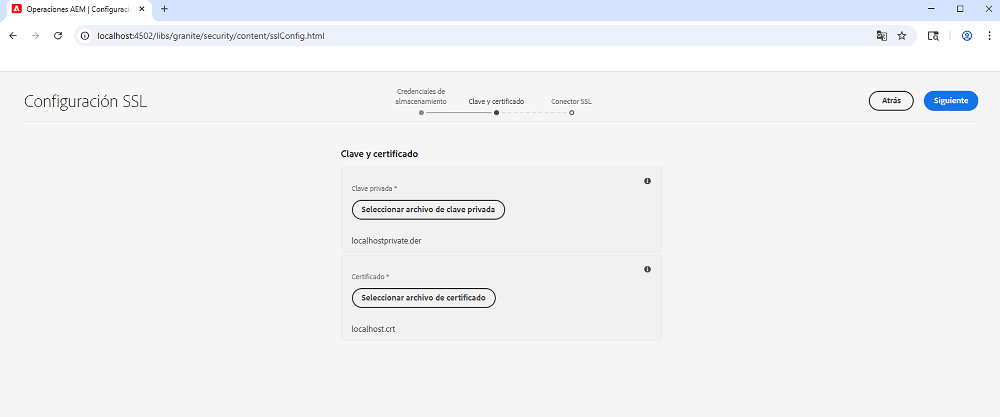
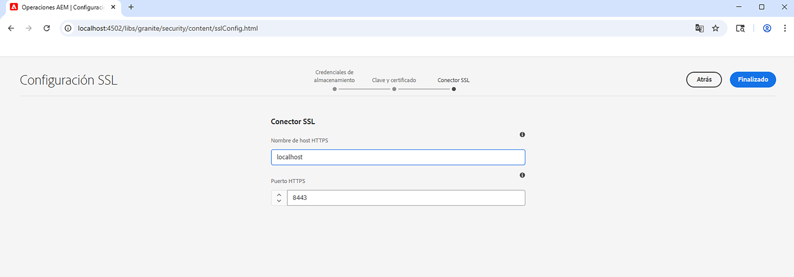
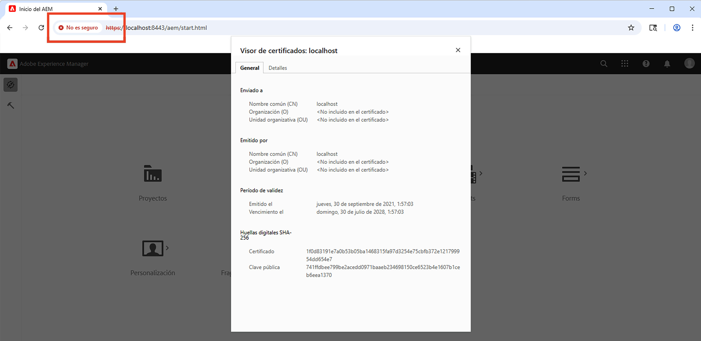

# AEM Uso del Asistente para SSL en la

Aprenda a configurar SSL en Adobe Experience Manager para que se ejecute a través de HTTPS mediante el asistente de SSL integrado.

>[!VIDEO](https://video.tv.adobe.com/v/17993?quality=12&learn=on)


>[!NOTE]
>
>Para entornos administrados, es mejor que el departamento de TI proporcione certificados y claves de confianza para la CA.
>
>Los certificados autofirmados solo se utilizan con fines de desarrollo.

## Uso del Asistente para configuración SSL

Vaya a __AEM Autor de la > Herramientas > Seguridad > Configuración SSL__ y abra el __Asistente de configuración SSL__.



### Crear credenciales de tienda

Para crear un _Almacén de claves_ asociado con el `ssl-service` usuario del sistema y una _Almacén de confianza_, use el __Credenciales de almacenamiento__ paso del asistente.

1. Introduzca la contraseña y confírmela para __Almacén de claves__ asociado con el `ssl-service` usuario del sistema.
1. Introduzca la contraseña y confírmela para el global __Almacén de confianza__. Tenga en cuenta que es un almacén de confianza de todo el sistema y, si ya se ha creado, se ignora la contraseña introducida.

   

### Cargar clave privada y certificado

Para cargar el _clave privada_ y _Certificado SSL_, use el __Clave y certificado__ paso del asistente.

Normalmente, el departamento de TI proporciona el certificado y la clave de confianza de la CA, aunque se puede utilizar un certificado autofirmado para __desarrollo__ y __prueba__ fines.

Para crear o descargar el certificado autofirmado, consulte la [Certificado y clave privada firmados automáticamente](#self-signed-private-key-and-certificate).

1. Cargue el __Clave privada__ en el formato DER (Distinguished Encoding Rules). A diferencia de PEM, los archivos con codificación DER no contienen instrucciones de texto sin formato como `-----BEGIN CERTIFICATE-----`
1. Cargar el asociado __Certificado SSL__ en el `.crt` formato.

   

### Actualización de detalles del conector SSL

Para actualizar el _hostname_ y _puerto_ use el __Conector SSL__ paso del asistente.

1. Actualice o verifique el __Nombre de host HTTPS__ debe coincidir con el valor de `Common Name (CN)` del certificado.
1. Actualice o verifique el __Puerto HTTPS__ valor.

   

### Verificar la configuración SSL

1. Para verificar el SSL, haga clic en el __Ir a URL HTTPS__ botón.
1. Si utiliza un certificado firmado automáticamente, verá lo siguiente `Your connection is not private` error.

   

## Certificado y clave privada firmados automáticamente

El siguiente zip contiene [!DNL DER] y [!DNL CRT] AEM archivos necesarios para configurar SSL localmente y destinados únicamente a fines de desarrollo local.

El [!DNL DER] y [!DNL CERT] Los archivos se proporcionan para su comodidad y se generan siguiendo los pasos descritos en la sección Generar clave privada y certificado firmado automáticamente a continuación.

Si es necesario, la frase de contraseña del certificado es **administrador**.

Este localhost: clave privada y certificado autofirmado.zip (caduca en julio de 2028)

[Descargar el archivo de certificado](assets/use-the-ssl-wizard/certificate.zip)

### Generación de claves privadas y certificados autofirmados

AEM El vídeo anterior muestra la instalación y configuración de SSL en una instancia de autor de mediante certificados firmados automáticamente. Los siguientes comandos utilizan [[!DNL OpenSSL]](https://www.openssl.org/) Puede generar una clave privada y un certificado para utilizarlos en el paso 2 del asistente.

```shell
### Create Private Key
$ openssl genrsa -aes256 -out localhostprivate.key 4096

### Generate Certificate Signing Request using private key
$ openssl req -sha256 -new -key localhostprivate.key -out localhost.csr -subj '/CN=localhost'

### Generate the SSL certificate and sign with the private key, will expire one year from now
$ openssl x509 -req -extfile <(printf "subjectAltName=DNS:localhost") -days 365 -in localhost.csr -signkey localhostprivate.key -out localhost.crt

### Convert Private Key to DER format - SSL wizard requires key to be in DER format
$ openssl pkcs8 -topk8 -inform PEM -outform DER -in localhostprivate.key -out localhostprivate.der -nocrypt
```
