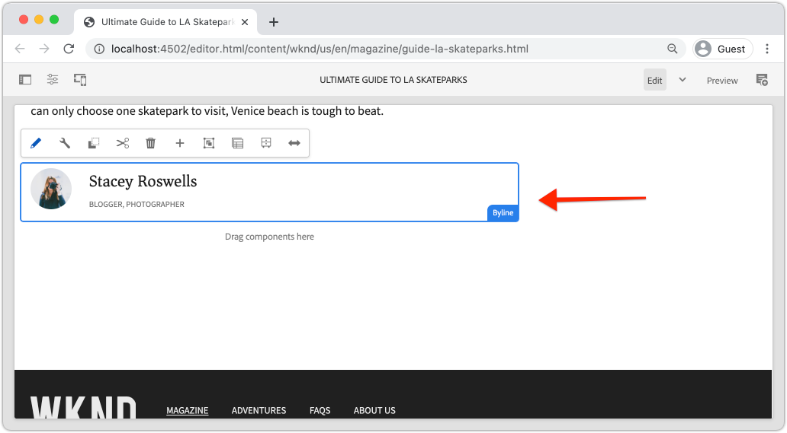

# Componente personalizado {#custom-component}

Este tutorial trata la creación de extremo a extremo de un componente de firma AEM personalizado que muestra el contenido creado en un cuadro de diálogo y explora el desarrollo de un modelo Sling para encapsular la lógica empresarial que rellena el HTL del componente.

## Requisitos previos {#prerequisites}

Revise las herramientas y las instrucciones necesarias para configurar un entorno [de desarrollo](overview.md#local-dev-environment)local.

### Proyecto de inicio

>[!NOTE]
>
> Si ha estado siguiendo en partes anteriores del tutorial, notará que el Proyecto de inicio de este capítulo acelera la implementación. Incluye unas cuantas plantillas más y mucho más contenido. Además, puede explorar el nuevo contenido y otras áreas de la implementación, fuera del desarrollo de componentes personalizados.

Consulte el código de línea base que el tutorial genera:

1. Clona el repositorio de [github.com/adobe/aem-guides-wknd](https://github.com/adobe/aem-guides-wknd) .
1. Extraer la `custom-component/start` rama

   ```shell
   $ git clone git@github.com:adobe/aem-guides-wknd.git ~/code/aem-guides-wknd
   $ cd ~/code/aem-guides-wknd
   $ git checkout custom-component/start
   ```

1. Implemente código base en una instancia de AEM local con sus conocimientos Maven:

   ```shell
   $ cd ~/code/aem-guides-wknd
   $ mvn clean install -PautoInstallSinglePackage
   ```

Siempre puede realizar la vista del código terminado en [GitHub](https://github.com/adobe/aem-guides-wknd/tree/custom-component/solution) o desproteger el código localmente cambiando a la rama `custom-component/solution`.

## Objetivo

1. Comprender cómo crear un componente de AEM personalizado
1. Aprenda a encapsular la lógica empresarial con modelos Sling
1. Comprender cómo utilizar un modelo Sling desde una secuencia de comandos HTL

## Qué va a generar {#byline-component}

>[!VIDEO](https://video.tv.adobe.com/v/30181/?quality=12&learn=on)

En esta parte del tutorial de WKND, se crea un componente de firma que se utilizará para mostrar información de autor sobre el colaborador de un artículo.



*Diseño visual de componentes en línea proporcionado por el equipo de diseño de WKND*

La implementación del componente Firma incluye un cuadro de diálogo que recopila el contenido de la línea y un modelo de línea personalizado que recupera el de la línea:

* Nombre
* Imagen
* Ocupaciones

para que se muestre mediante una secuencia de comandos HTL, que procesa el HTML que el navegador muestra en última instancia.


*Descomposición de componentes de firma*

## Crear componente de firma {#create-byline-component}

En primer lugar, cree la estructura del nodo Componente de firma y defina un cuadro de diálogo. Representa el componente en AEM y define implícitamente el tipo de recurso del componente según su ubicación en el JCR.

El cuadro de diálogo expone la interfaz que pueden proporcionar los autores de contenido. Para esta implementación, el componente de **imagen** del componente principal de WCM AEM se utilizará para gestionar la creación y representación de la imagen de firma, de modo que se establecerá como el componente `sling:resourceSuperType`.

### Crear nodo de componente {#create-component-node}

1. En el módulo **ui.apps** , navegue hasta `/apps/wknd/components/content` y cree un nuevo nodo denominado **byline** de tipo `cq:Component`.

   

1. Añada las siguientes propiedades en el nodo del componente `cq:Component` Firma.

   ```plain
   jcr:title = Byline
   jcr:description = Displays a contributor's byline.
   componentGroup = WKND.Content
   sling:resourceSuperType =  core/wcm/components/image/v2/image
   ```

   

   Lo que resulta en este `.content.xml` XML:

   ```xml
   <?xml version="1.0" encoding="UTF-8"?>
   <jcr:root
       xmlns:sling="https://sling.apache.org/jcr/sling/1.0" xmlns:jcr="https://www.jcp.org/jcr/1.0"
       jcr:primaryType="cq:Component"
       jcr:title="Byline"
       jcr:description="Displays a contributor's byline."
       componentGroup="WKND.Content"
       sling:resourceSuperType="core/wcm/components/image/v2/image"/>
   ```

### Creación del script HTL {#create-the-htl-script}

1. Debajo del `byline` nodo, agregue un nuevo archivo `byline.html`, responsable de la presentación HTML del componente. Es importante asignar un nombre al archivo igual que al `cq:Component` nodo, ya que se convierte en la secuencia de comandos predeterminada que Sling utilizará para representar este tipo de recurso.

1. Añada el siguiente código a la `byline.html`.

   ```xml
   <!--/* byline.html */-->
   <div data-sly-use.placeholderTemplate="core/wcm/components/commons/v1/templates.html">
   </div>
   <sly data-sly-call="${placeholderTemplate.placeholder @ isEmpty=true}"></sly>
   ```

`byline.html` se [volverá a examinar más adelante](#byline-htl), una vez creado el modelo de Sling. El estado actual del archivo HTML permite que el componente se muestre en estado vacío, en el Editor de páginas de AEM Sites cuando se arrastra y se suelta en la página.

### Crear la definición del cuadro de diálogo {#create-the-dialog-definition}

A continuación, defina un cuadro de diálogo para el componente Firma con los campos siguientes:

* **Nombre**: campo de texto que indica el nombre del colaborador.
* **Imagen**: una referencia a la biografía del colaborador.
* **Ocupaciones**: lista de las ocupaciones atribuidas al contribuyente. Las ocupaciones deben ordenarse alfabéticamente en orden ascendente (a a z).

1. Debajo del nodo del `byline` componente, cree un nuevo nodo denominado `cq:dialog` de tipo `nt:unstructured`.
1. Update the `cq:dialog` with the following XML. Es más fácil abrir el archivo `.content.xml` y copiar/pegar el siguiente XML en él.

   ```xml
   <?xml version="1.0" encoding="UTF-8"?>
   <jcr:root xmlns:sling="http://sling.apache.org/jcr/sling/1.0" xmlns:jcr="http://www.jcp.org/jcr/1.0"
           xmlns:nt="http://www.jcp.org/jcr/nt/1.0"
           jcr:primaryType="nt:unstructured"
           jcr:title="Byline"
           sling:resourceType="cq/gui/components/authoring/dialog">
       <content
               jcr:primaryType="nt:unstructured"
               sling:resourceType="granite/ui/components/coral/foundation/container">
           <items jcr:primaryType="nt:unstructured">
               <tabs
                       jcr:primaryType="nt:unstructured"
                       sling:resourceType="granite/ui/components/coral/foundation/tabs"
                       maximized="{Boolean}false">
                   <items jcr:primaryType="nt:unstructured">
                       <asset
                               jcr:primaryType="nt:unstructured"
                               sling:hideResource="{Boolean}false"/>
                       <metadata
                               jcr:primaryType="nt:unstructured"
                               sling:hideResource="{Boolean}true"/>
                       <properties
                               jcr:primaryType="nt:unstructured"
                               jcr:title="Properties"
                               sling:resourceType="granite/ui/components/coral/foundation/container"
                               margin="{Boolean}true">
                           <items jcr:primaryType="nt:unstructured">
                               <columns
                                       jcr:primaryType="nt:unstructured"
                                       sling:resourceType="granite/ui/components/coral/foundation/fixedcolumns"
                                       margin="{Boolean}true">
                                   <items jcr:primaryType="nt:unstructured">
                                       <column
                                               jcr:primaryType="nt:unstructured"
                                               sling:resourceType="granite/ui/components/coral/foundation/container">
                                           <items jcr:primaryType="nt:unstructured">
                                               <name
                                                       jcr:primaryType="nt:unstructured"
                                                       sling:resourceType="granite/ui/components/coral/foundation/form/textfield"
                                                       emptyText="Enter the contributor's name to display."
                                                       fieldDescription="The contributor's name to display."
                                                       fieldLabel="Name"
                                                       name="./name"
                                                       required="{Boolean}true"/>
                                               <occupations
                                                       jcr:primaryType="nt:unstructured"
                                                       sling:resourceType="granite/ui/components/coral/foundation/form/multifield"
                                                       fieldDescription="A list of the contributor's occupations."
                                                       fieldLabel="Occupations"
                                                       required="{Boolean}false">
                                                   <field
                                                           jcr:primaryType="nt:unstructured"
                                                           sling:resourceType="granite/ui/components/coral/foundation/form/textfield"
                                                           emptyText="Enter an occupation"
                                                           name="./occupations"/>
                                               </occupations>
                                           </items>
                                       </column>
                                   </items>
                               </columns>
                           </items>
                       </properties>
                   </items>
               </tabs>
           </items>
       </content>
   </jcr:root>
   ```

   Estas definiciones de nodo utilizan Fusión [de recursos](https://sling.apache.org/documentation/bundles/resource-merger.html) Sling para controlar qué fichas de diálogo se heredan del `sling:resourceSuperType` componente, en este caso el componente **Imagen de los componentes** principales.

   

### Crear el cuadro de diálogo Directiva {#create-the-policy-dialog}

Siguiendo el mismo método que con la creación del cuadro de diálogo, cree un cuadro de diálogo de directiva (anteriormente conocido como cuadro de diálogo de diseño) para ocultar los campos no deseados en la configuración de directiva heredada del componente Imagen de componentes principales.

1. Debajo del `byline` nodo, cree un nuevo nodo `cq:Component` de tipo `cq:design_dialog` `nt:unstructured`.
1. Update the `cq:design_dialog` with the following XML. Es más fácil abrir el archivo `.content.xml` y copiar/pegar el XML siguiente en él.

   ```xml
   <?xml version="1.0" encoding="UTF-8"?>
   <jcr:root xmlns:sling="http://sling.apache.org/jcr/sling/1.0" xmlns:granite="http://www.adobe.com/jcr/granite/1.0" xmlns:cq="http://www.day.com/jcr/cq/1.0" xmlns:jcr="http://www.jcp.org/jcr/1.0" xmlns:nt="http://www.jcp.org/jcr/nt/1.0"
       jcr:primaryType="nt:unstructured"
       jcr:title="Byline"
       sling:resourceType="cq/gui/components/authoring/dialog">
       <content
               jcr:primaryType="nt:unstructured">
           <items jcr:primaryType="nt:unstructured">
               <tabs
                       jcr:primaryType="nt:unstructured">
                   <items jcr:primaryType="nt:unstructured">
                       <properties
                               jcr:primaryType="nt:unstructured">
                           <items jcr:primaryType="nt:unstructured">
                               <content
                                       jcr:primaryType="nt:unstructured">
                                   <items jcr:primaryType="nt:unstructured">
                                       <decorative
                                               jcr:primaryType="nt:unstructured"
                                               sling:hideResource="{Boolean}true"/>
                                       <altValueFromDAM
                                               jcr:primaryType="nt:unstructured"
                                               sling:hideResource="{Boolean}true"/>
                                       <titleValueFromDAM
                                               jcr:primaryType="nt:unstructured"
                                               sling:hideResource="{Boolean}true"/>
                                       <displayCaptionPopup
                                               jcr:primaryType="nt:unstructured"
                                               sling:hideResource="{Boolean}true"/>
                                       <disableUuidTracking
                                               jcr:primaryType="nt:unstructured"
                                               sling:hideResource="{Boolean}true"/>
                                   </items>
                               </content>
                           </items>
                       </properties>
                       <features
                               jcr:primaryType="nt:unstructured">
                           <items jcr:primaryType="nt:unstructured">
                               <content
                                       jcr:primaryType="nt:unstructured">
                                   <items jcr:primaryType="nt:unstructured">
                                       <accordion
                                               jcr:primaryType="nt:unstructured">
                                           <items jcr:primaryType="nt:unstructured">
                                               <orientation
                                                       jcr:primaryType="nt:unstructured"
                                                       sling:hideResource="{Boolean}true"/>
                                               <crop
                                                       jcr:primaryType="nt:unstructured"
                                                       sling:hideResource="{Boolean}true"/>
                                           </items>
                                       </accordion>
                                   </items>
                               </content>
                           </items>
                       </features>
                   </items>
               </tabs>
           </items>
       </content>
   </jcr:root>
   ```

   La base para el cuadro de diálogo **de** directiva anterior se obtuvo del componente [Imagen de componentes](https://github.com/adobe/aem-core-wcm-components/blob/master/content/src/content/jcr_root/apps/core/wcm/components/image/v2/image/_cq_design_dialog/.content.xml)principales.

   Al igual que en la configuración de cuadro de diálogo, la fusión [de recursos de](https://sling.apache.org/documentation/bundles/resource-merger.html) Sling se utiliza para ocultar los campos irrelevantes que se heredan del `sling:resourceSuperType`, como se ve en las definiciones de nodo con `sling:hideResource="{Boolean}true"` propiedad.

### Implementar el código {#deploy-the-code}

1. Implemente la base de código actualizada en una instancia de AEM local utilizando sus conocimientos de Maven:

   ```shell
   $ cd ~/code/aem-guides-wknd
   $ mvn clean install -PautoInstallPackage
   ```

### Add the component to a page {#add-the-component-to-a-page}

Para mantener las cosas simples y centradas en AEM desarrollo de componentes, agregaremos el componente Firma en su estado actual a una página de artículo para verificar que la definición del `cq:Component` nodo se haya implementado y sea correcta, AEM reconoce la nueva definición del componente y el cuadro de diálogo del componente funciona para la creación.

Dado que [hemos agregado el componente Firma al grupo **de componentes** WKND.Content](#create-component-node), a través de la propiedad `/apps/wknd/components/content/byline@componentGroup=WKND.Content` , está disponible automáticamente para cualquier Contenedor **de** diseño cuya **política** permita el grupo de componentes **** WKND.Content, que es el Contenedor de diseño de la página de artículos.

#### Drag and drop the component onto the page {#drag-and-drop-the-component-onto-the-page}

1. **Edite** la página del artículo en **AEM > Sitios > Sitio WKND > Maestro de idioma > Inglés > Revista > Guía definitiva de los parques de patinaje** LA.
1. Desde la barra lateral izquierda, arrastre y suelte un componente **** Firma en la **parte inferior** del Contenedor Presentación de la página de artículos abierta.

   

#### Creación del componente {#author-the-component}

Los autores de AEM configuran y crean componentes a través de los cuadros de diálogo. En este momento, en el desarrollo del componente Firma, se incluyen los diálogos para recopilar los datos, aunque aún no se ha agregado la lógica para procesar el contenido creado.

1. Asegúrese de que la barra lateral **izquierda esté abierta** y visible y de que esté seleccionado el Buscador **de** recursos.

   

1. Seleccione el marcador de posición **del componente** Firma, que a su vez muestra la barra de acciones y toca el icono de la **llave inglesa** para abrir el cuadro de diálogo.

   

1. Con el cuadro de diálogo abierto y la primera ficha (Recurso) activa, abra la barra lateral izquierda y, desde el buscador de recursos, arrastre una imagen a la zona desplegable Imagen. Busque &quot;stacey&quot; para encontrar la imagen biográfica de Stacey Roswells en el paquete de contenido ui.ui de WKND.

   **[stacey-roswells.jpg](assets/custom-component/stacey-roswells.jpg)**

   

1. Después de agregar una imagen, haga clic en la ficha **Propiedades** para introducir el **Nombre** y **Ocupaciones**.

   Al introducir ocupaciones, introdúzcalas en orden alfabético **** inverso para que la lógica empresarial alfabética que implementaremos en el Modelo Sling sea fácilmente evidente.

   Toque el botón **Listo** en la parte inferior derecha para guardar los cambios.

   

1. Después de guardar el cuadro de diálogo, vaya al [CRXDE Lite](http://localhost:4502/crx/de/index.jsp#/content/wknd/language-masters/en/magazine/guide-la-skateparks/jcr:content/root/responsivegrid/responsivegrid/byline) y revise cómo se almacena el contenido del componente en el nodo de contenido del componente de byline, en la página de AEM.

   Busque el nodo de contenido del componente Byline debajo del `jcr:content/root/responsivegrid/responsivegrid` nodo, es decir, `/content/wknd/language-masters/en/magazine/guide-la-skateparks/jcr:content/root/responsivegrid/responsivegrid/byline`.

   Observe que los nombres de propiedad `name`, `occupations`y `fileReference` se almacenan en el nodo **** byline.

   Además, observe que el `sling:resourceType` nodo está configurado en el `wknd/components/content/byline` cual es lo que enlaza este nodo de contenido a la implementación del componente Firma.

   

   */content/wknd/language-masters/es/magazine/guide-la-skateparks/jcr:content/root/responsivegrid/responsivegrid/byline*

## Crear modelo Sling de firma {#create-sling-model}

A continuación, crearemos un modelo Sling para que actúe como modelo de datos y hospede la lógica comercial del componente Byline.

Los modelos de Sling son objetos Java &quot;POJO&quot; (Plain Old Java Objects) impulsados por anotaciones que facilitan la asignación de datos de JCR a variables Java y proporcionan otras variedades cuando se desarrollan en el contexto de AEM.

### Revisar las dependencias de los menúes {#maven-dependency}

El modelo Sling de Byline se basará en varias API de Java proporcionadas por AEM. Estas API están disponibles a través de la `dependencies` lista del archivo POM del `core` módulo.

1. Abra el `pom.xml` archivo debajo de `<src>/aem-guides-wknd/core/pom.xml`.
1. Busque la dependencia para el `uber-jar` en la sección dependencias del archivo pom:

   ```xml
   ...
       <dependency>
           <groupId>com.adobe.aem</groupId>
           <artifactId>uber-jar</artifactId>
           <classifier>apis</classifier>
       </dependency>
   ...
   ```

   El [subar-jar](https://docs.adobe.com/content/help/en/experience-manager-65/developing/devtools/ht-projects-maven.html#experience-manager-api-dependencies) contiene todas las API de Java públicas expuestas por AEM. Observe que no se ha especificado una versión en el `core/pom.xml` archivo. En cambio, la versión se mantiene en el reactor principal ubicado en la raíz del proyecto `aem-guides-wknd/pom.xml`.

1. Buscar la dependencia para `core.wcm.components.core`:

   ```xml
    <!-- Core Component Dependency -->
       <dependency>
           <groupId>com.adobe.cq</groupId>
           <artifactId>core.wcm.components.core</artifactId>
       </dependency>
   ```

   Todas las API de Java públicas expuestas por AEM componentes principales. AEM componentes principales es un proyecto que se mantiene fuera de AEM y, por lo tanto, tiene un ciclo de lanzamiento independiente. Por esta razón es una dependencia que necesita ser incluida por separado y **no está** incluida con el biberón.

   Al igual que el biberón, la versión de esta dependencia se mantiene en el archivo pom del reactor principal ubicado en `aem-guides-wknd/pom.xml`.

   Más adelante en este tutorial se utilizará la clase Imagen de componente principal para mostrar la imagen en el componente Firma. Es necesario contar con la dependencia del componente principal para construir y compilar nuestro modelo Sling.

### Interfaz de firma {#byline-interface}

Cree una interfaz pública de Java para el Firme. `Byline.java` define los métodos públicos necesarios para conducir el script `byline.html` HTL.

1. Dentro del `aem-guides-wknd.core` módulo debajo de `src/main/java,` crear una nueva interfaz de Java con el nombre `Byline.java` haciendo clic con el botón secundario en el `com.adobe.aem.guides.wknd.core.models` paquete > Nuevo > Interfaz ****. Introduzca **Firma** como nombre de interfaz y haga clic en Finalizar.

   

1. Update `Byline.java` with the following methods:

   ```java
   package com.adobe.aem.guides.wknd.core.models;
   
   import java.util.List;
   
   /**
   * Represents the Byline AEM Component for the WKND Site project.
   **/
   public interface Byline {
       /***
       * @return a string to display as the name.
       */
       String getName();
   
       /***
       * Occupations are to be sorted alphabetically in a descending order.
       *
       * @return a list of occupations.
       */
       List<String> getOccupations();
   
       /***
       * @return a boolean if the component has enough content to display.
       */
       boolean isEmpty();
   }
   ```

   Los dos primeros métodos exponen los valores del **nombre** y **ocupaciones** del componente Firma.

   El `isEmpty()` método se utiliza para determinar si el componente tiene contenido para procesar o si está a la espera de configurarse.

   Observe que no hay ningún método para la imagen; [echaremos un vistazo a por qué es más tarde](#tackling-the-image-problem).

### Implementación de firma {#byline-implementation}

`BylineImpl.java` es la implementación del modelo de Sling que implementa la `Byline.java` interfaz definida anteriormente. El código completo de `BylineImpl.java` se encuentra en la parte inferior de esta sección.

1. Dentro del `core` módulo debajo `src/main/java`, cree un nuevo archivo de clase llamado **BylineImpl.java** haciendo clic con el botón secundario en el `com.adobe.aem.guides.wknd.core.models.impl` paquete y seleccionando **Nuevo > Clase**.

   Para el nombre, introduzca **BylineImpl**. Añada la interfaz **Byline** como una interfaz de implementación.

   

1. Abra `BylineImpl.java`. Se rellena automáticamente con todos los métodos definidos en la interfaz `Byline.java`. Añada las anotaciones del modelo de Sling actualizándolas `BylineImpl.java` con las anotaciones de nivel de clase siguientes. Esta `@Model(..)`anotación es lo que convierte la clase en un modelo Sling.

   ```java
   import org.apache.sling.api.SlingHttpServletRequest;
   import org.apache.sling.models.annotations.Model;
   import org.apache.sling.models.annotations.DefaultInjectionStrategy;
   ...
   @Model(
           adaptables = {SlingHttpServletRequest.class},
           adapters = {Byline.class},
           resourceType = {BylineImpl.RESOURCE_TYPE},
           defaultInjectionStrategy = DefaultInjectionStrategy.OPTIONAL
   )
   public class BylineImpl implements Byline {
       protected static final String RESOURCE_TYPE = "wknd/components/content/byline";
       ...
   }
   ```

   Veamos esta anotación y sus parámetros:

   * La `@Model` anotación registra BylineImpl como modelo Sling cuando se implementa en AEM.
   * El `adaptables` parámetro especifica que la solicitud puede adaptar este modelo.
   * El `adapters` parámetro permite que la clase de implementación se registre en la interfaz Byline. Esto permite que la secuencia de comandos HTL llame al Modelo Sling a través de la interfaz (en lugar del impl directamente). [Puede encontrar más detalles sobre los adaptadores aquí](https://sling.apache.org/documentation/bundles/models.html#specifying-an-alternate-adapter-class-since-110).
   * El `resourceType` señala al tipo de recurso de componente Firma (creado anteriormente) y ayuda a resolver el modelo correcto si hay varias implementaciones. [Aquí](https://sling.apache.org/documentation/bundles/models.html#associating-a-model-class-with-a-resource-type-since-130)encontrará más información sobre la asociación de una clase de modelo con un tipo de recurso.

### Implementación de los métodos del modelo Sling {#implementing-the-sling-model-methods}

#### getName() {#implementing-get-name}

El primer método que trataremos es `getName()` que simplemente devuelve el valor almacenado en el nodo de contenido JCR del byline bajo la propiedad `name`.

Para ello, se utiliza la anotación Modelo `@ValueMapValue` Sling para insertar el valor en un campo Java utilizando el ValueMap del recurso de la solicitud.

```java
...
import org.apache.sling.models.annotations.injectorspecific.ValueMapValue;
...
public class BylineImpl implements Byline {
    ...

    @ValueMapValue
    private String name;

    ...
    @Override
    public String getName() {
        return name;
    }
    ...
}
```

Dado que la propiedad JCR comparte el mismo nombre que el campo Java (ambos son &quot;name&quot;), resuelve automáticamente esta asociación e inyecta el valor de la propiedad en el campo Java. `@ValueMapValue`

#### getOccupations() {#implementing-get-occupations}

El siguiente método para implementar es `getOccupations()`. Este método recopila todas las ocupaciones almacenadas en la propiedad JCR `occupations` y devuelve una colección ordenada (alfabéticamente) de ellas.

Con la misma técnica explorada en `getName()` el valor de propiedad se puede insertar en el campo del Modelo de Sling.

Una vez que los valores de la propiedad JCR están disponibles en el Modelo Sling mediante el campo Java insertado `occupations`, la lógica de negocio de ordenación se puede aplicar en el `getOccupations()` método .

```java
import java.util.ArrayList;
import java.util.Collections;
...

public class BylineImpl implements Byline {
    ...
    @ValueMapValue
    private List<String> occupations;
    ...
    public List<String> getOccupations() {
        if (occupations != null) {
            Collections.sort(occupations);
            return new ArrayList<String>(occupations);
        } else {
            return Collections.emptyList();
        }
    }
    ...
}
...
```

#### isEmpty() {#implementing-is-empty}

El último método público es `isEmpty()` el que determina cuándo el componente debe considerarse &quot;suficientemente creado&quot; para representarse.

Para este componente, tenemos requisitos comerciales que indican que los tres campos, nombre, imagen y ocupaciones deben rellenarse *antes* de procesar el componente.

```java
import org.apache.commons.lang3.StringUtils;
...
public class BylineImpl implements Byline {
    ...
    @Override
    public boolean isEmpty() {
        if (StringUtils.isBlank(name)) {
            // Name is missing, but required
            return true;
        } else if (occupations == null || occupations.isEmpty()) {
            // At least one occupation is required
            return true;
        } else if (/* image is not null, logic to be determined */) {
            // A valid image is required
            return true;
        } else {
            // Everything is populated, so this component is not considered empty
            return false;
        }
    }
    ...
}
```

#### Abordar el &quot;problema de la imagen&quot; {#tackling-the-image-problem}

Comprobar el nombre y las condiciones de ocupación son triviales (y Apache Commons Lang3 proporciona la siempre práctica clase [StringUtils](https://commons.apache.org/proper/commons-lang/apidocs/org/apache/commons/lang3/StringUtils.html) ), sin embargo, no está claro cómo se puede validar la **presencia de la Imagen** , ya que el componente de Imagen de componentes principales se utiliza para cubrir la imagen.

Hay dos maneras de enfrentarlo:

1. Compruebe si la propiedad `fileReference` JCR se resuelve en un recurso.
1. Convierta este recurso en un modelo de Sling de imagen de componente principal y asegúrese de que el `getSrc()` método no está vacío.

   Optaremos por el **segundo** enfoque. El primer enfoque es probablemente suficiente, pero en este tutorial se utilizará el último para permitirnos explorar otras características de los modelos Sling.

1. Cree un método privado que obtenga la imagen. Este método se deja en privado porque no necesitamos exponer el objeto Image en el propio HTL y su único uso para conducir `isEmpty().`

   El siguiente método privado para `getImage()`:

   ```java
   import com.adobe.cq.wcm.core.components.models.Image;
   ...
   private Image getImage() {
       Image image = null;
       // Figure out how to populate the image variable!
       return image;
   }
   ```

   Como se ha señalado anteriormente, existen dos métodos más para obtener el modelo **de** imagen Sling:

   El primero utiliza la `@Self` anotación para adaptar automáticamente la solicitud actual al `Image.class`

   ```java
   @Self
   private Image image;
   ```

   El segundo utiliza el servicio OSGi [Apache Sling ModelFactory](https://sling.apache.org/apidocs/sling10/org/apache/sling/models/factory/ModelFactory.html) , que es un servicio muy práctico, y nos ayuda a crear modelos Sling de otros tipos en el código Java.

   Optaremos por el segundo enfoque.

   >[!NOTE]
   >
   >En una implementación del mundo real, es preferible acercarse a &quot;Uno&quot;, utilizando `@Self` ya que es la solución más simple y elegante. En este tutorial vamos a utilizar el segundo enfoque, ya que nos requiere explorar más facetas de los modelos Sling que son extremadamente útiles son componentes más complejos!

   Dado que los modelos Sling son de Java POJO, y no servicios OSGi, las anotaciones de inyección OSGi habituales `@Reference` no se pueden **usar, en cambio los modelos Sling proporcionan una anotación especial** @OSGiService **[](https://sling.apache.org/documentation/bundles/models.html#injector-specific-annotations)** que proporciona una funcionalidad similar.

1. Actualice `BylineImpl.java` para incluir la `OSGiService` anotación para inyectar la `ModelFactory`:

   ```java
   import org.apache.sling.models.factory.ModelFactory;
   import org.apache.sling.models.annotations.injectorspecific.OSGiService;
   ...
   public class BylineImpl implements Byline {
       ...
       @OSGiService
       private ModelFactory modelFactory;
   }
   ```

   Con la `ModelFactory` opción disponible, se puede crear un modelo de Sling de imágenes de componentes principales mediante:

   ```java
   modelFactory.getModelFromWrappedRequest(SlingHttpServletRequest request, Resource resource, java.lang.Class<T> targetClass)
   ```

   Sin embargo, este método requiere tanto una solicitud como un recurso, que aún no están disponibles en el modelo de Sling. Para obtener estas anotaciones, se utilizan más anotaciones del modelo de Sling.

   Para obtener la solicitud actual, se puede utilizar la anotación **[@Self](https://sling.apache.org/documentation/bundles/models.html#injector-specific-annotations)** para inyectar el `adaptable` (que se define en el `@Model(..)` como `SlingHttpServletRequest.class`, en un campo de clase Java.

1. Añada la anotación **@Self** para obtener la solicitud **** SlingHttpServletRequest:

   ```java
   import org.apache.sling.models.annotations.injectorspecific.Self;
   ...
   @Self
   private SlingHttpServletRequest request;
   ```

   Recuerde que usar `@Self Image image` para inyectar el Modelo de selección de imágenes de componentes principales era una opción anterior: la `@Self` anotación intenta inyectar el objeto adaptable (en nuestro caso, una SlingHttpServletRequest) y adaptarse al tipo de campo de anotación. Dado que el modelo de Sling de imágenes de componentes principales se puede adaptar desde objetos SlingHttpServletRequest, funcionaría y es menos código que nuestro enfoque más exploratorio.

   Ahora hemos insertado las variables necesarias para crear una instancia de nuestro modelo de imagen mediante la API ModelFactory. Utilizaremos la anotación **[@PostConstruct](https://sling.apache.org/documentation/bundles/models.html#postconstruct-methods)** de Sling Model para obtener este objeto después de crear las instancias de Sling Model.

   `@PostConstruct` es increíblemente útil y actúa con una capacidad similar a la de un constructor; sin embargo, se invoca después de crear una instancia de la clase y de insertar todos los campos Java anotados. Mientras que otras anotaciones del Modelo de sling anotan campos de clase Java (variables), `@PostConstruct` anotan un método de parámetro void y zero, con un nombre típico `init()` (pero se puede denominar cualquier cosa).

1. Método añada **@PostConstruct** :

   ```java
   import javax.annotation.PostConstruct;
   ...
   public class BylineImpl implements Byline {
       ...
       private Image image;
   
       @PostConstruct
       private void init() {
           image = modelFactory.getModelFromWrappedRequest(request,
                                                           request.getResource(),
                                                           Image.class);
       }
       ...
   }
   ```

   Recuerde que los modelos Sling **NO son** servicios OSGi, por lo que es seguro mantener el estado de la clase. A menudo `@PostConstruct` deriva y configura el estado de la clase del modelo de Sling para su uso posterior, de forma similar a como lo hace un constructor sin formato.

   Tenga en cuenta que si el `@PostConstruct` método emite una excepción, el modelo de Sling no creará una instancia (será nulo).

1. **getImage()** ahora se puede actualizar para devolver simplemente el objeto de imagen.

   ```java
   /**
       * @return the Image Sling Model of this resource, or null if the resource cannot create a valid Image Sling Model.
   */
   private Image getImage() {
       return image;
   }
   ```

1. Volvamos a `isEmpty()` y terminemos la implementación:

   ```java
   @Override
   public boolean isEmpty() {
       ...
       } else if (getImage() == null || StringUtils.isBlank(getImage().getSrc())) {
           // A valid image is required
           return true;
       } else {
       ...
   }
   ```

   Tenga en cuenta que las llamadas múltiples a `getImage()` no son problemáticas, ya que devuelve la variable de `image` clase inicializada y no invoca `modelFactory.getModelFromWrappedRequest(...)` lo cual no es demasiado costoso, pero vale la pena evitar llamar innecesariamente.

1. El final `BylineImpl.java` debería tener el siguiente aspecto:

   ```java
   package com.adobe.aem.guides.wknd.core.models.impl;
   
   import java.util.ArrayList;
   import java.util.Collections;
   import java.util.List;
   
   import javax.annotation.PostConstruct;
   
   import org.apache.commons.lang3.StringUtils;
   import org.apache.sling.api.SlingHttpServletRequest;
   import org.apache.sling.models.annotations.DefaultInjectionStrategy;
   import org.apache.sling.models.annotations.Model;
   import org.apache.sling.models.annotations.injectorspecific.OSGiService;
   import org.apache.sling.models.annotations.injectorspecific.Self;
   import org.apache.sling.models.annotations.injectorspecific.ValueMapValue;
   import org.apache.sling.models.factory.ModelFactory;
   
   import com.adobe.aem.guides.wknd.core.models.Byline;
   import com.adobe.cq.wcm.core.components.models.Image;
   
   @Model(
           adaptables = {SlingHttpServletRequest.class},
           adapters = {Byline.class},
           resourceType = {BylineImpl.RESOURCE_TYPE},
           defaultInjectionStrategy = DefaultInjectionStrategy.OPTIONAL
   )
   public class BylineImpl implements Byline {
       protected static final String RESOURCE_TYPE = "wknd/components/content/byline";
   
       @Self
       private SlingHttpServletRequest request;
   
       @OSGiService
       private ModelFactory modelFactory;
   
       @ValueMapValue
       private String name;
   
       @ValueMapValue
       private List<String> occupations;
   
       private Image image;
   
       @PostConstruct
       private void init() {
           image = modelFactory.getModelFromWrappedRequest(request, request.getResource(), Image.class);
       }
   
       @Override
       public String getName() {
           return name;
       }
   
       @Override
       public List<String> getOccupations() {
           if (occupations != null) {
               Collections.sort(occupations);
               return new ArrayList<String>(occupations);
           } else {
               return Collections.emptyList();
           }
       }
   
       @Override
       public boolean isEmpty() {
           final Image image = getImage();
   
           if (StringUtils.isBlank(name)) {
               // Name is missing, but required
               return true;
           } else if (occupations == null || occupations.isEmpty()) {
               // At least one occupation is required
               return true;
           } else if (image == null || StringUtils.isBlank(image.getSrc())) {
               // A valid image is required
               return true;
           } else {
               // Everything is populated, so this component is not considered empty
               return false;
           }
       }
   
       /**
       * @return the Image Sling Model of this resource, or null if the resource cannot create a valid Image Sling Model.
       */
       private Image getImage() {
           return image;
       }
   }
   ```

## HTL de firma {#byline-htl}

En el `ui.apps` módulo, abra `/apps/wknd/components/content/byline/byline.html` que hemos creado en la configuración anterior del componente AEM.

```html
<div data-sly-use.placeholderTemplate="core/wcm/components/commons/v1/templates.html">
</div>
<sly data-sly-call="${placeholderTemplate.placeholder @ isEmpty=false}"></sly>
```

Analicemos lo que hace este script HTL hasta ahora:

* El `placeholderTemplate` señala al marcador de posición Componentes principales, que se muestra cuando el componente no está completamente configurado. Esto se representa en el Editor de páginas de AEM Sites como un cuadro con el título del componente, tal como se define arriba en la `cq:Component`propiedad `jcr:title` de.

* El `data-sly-call="${placeholderTemplate.placeholder @ isEmpty=false}` carga el `placeholderTemplate` valor definido arriba y pasa un valor booleano (actualmente codificado como `false`) a la plantilla de marcador de posición. Cuando `isEmpty` es true, la plantilla de marcador de posición procesa el cuadro gris, de lo contrario no procesa nada.

### Actualizar HTL de firma

1. Actualice **byline.html** con la siguiente estructura de HTML esquelético:

   ```xml
   <div data-sly-use.placeholderTemplate="core/wcm/components/commons/v1/templates.html"
       class="cmp-byline">
           <div class="cmp-byline__image">
               <!-- Include the Core Components Image Component -->
           </div>
           <h2 class="cmp-byline__name"><!-- Include the name --></h2>
           <p class="cmp-byline__occupations"><!-- Include the occupations --></p>
   </div>
   <sly data-sly-call="${placeholderTemplate.placeholder @ isEmpty=true}"></sly>
   ```

   Tenga en cuenta que las clases CSS siguen la convención [de nomenclatura de](https://getbem.com/naming/)BEM. Aunque el uso de convenciones BEM no es obligatorio, se recomienda utilizar BEM en clases CSS de componentes principales y, por lo general, se obtienen reglas CSS limpias y legibles.

#### Creación de instancias de objetos del modelo de Sling en HTL {#instantiating-sling-model-objects-in-htl}

La instrucción [](https://github.com/adobe/htl-spec/blob/master/SPECIFICATION.md#221-use) Use block se utiliza para crear instancias de objetos del Modelo Sling en la secuencia de comandos HTL y asignarla a una variable HTL.

`data-sly-use.byline="com.adobe.aem.guides.wknd.models.Byline"` utiliza la interfaz Byline (com.adobe.aem.guide.wknd.models.Byline) implementada por BylineImpl y adapta a ella la SlingHttpServletRequest actual, y el resultado se almacena en una variable HTL name byline ( `data-sly-use.<variable-name>`).

1. Actualice el exterior `div` para hacer referencia al modelo de **firma** mediante su interfaz pública:

   ```xml
   <div data-sly-use.byline="com.adobe.aem.guides.wknd.core.models.Byline"
       data-sly-use.placeholderTemplate="core/wcm/components/commons/v1/templates.html"
       class="cmp-byline">
       ...
   </div>
   ```

#### Acceso a los métodos del modelo Sling {#accessing-sling-model-methods}

HTL toma de JSTL y utiliza la misma abreviación de los nombres de métodos de captador de Java.

Por ejemplo, invocar el método del Modelo de desplazamiento en línea (Byline Sling Model) se puede reducir a `getName()` , de manera similar en lugar de `byline.name`, se puede abreviar a `byline.isEmpty``byline.empty`. El uso de nombres de método completos, `byline.getName` o `byline.isEmpty`, también funciona. Tenga en cuenta que nunca `()` se utilizan para invocar métodos en HTL (similar a JSTL).

Los métodos Java que requieren un parámetro **no pueden** usarse en HTL. Esto es por diseño para mantener la lógica en HTL simple.

1. El nombre de firma se puede agregar al componente invocando el `getName()` método en el Modelo de firma de firma o en HTL: `${byline.name}`.

   Actualice la `h2` etiqueta:

   ```xml
   <h2 class="cmp-byline__name">${byline.name}</h2>
   ```

#### Uso de las opciones de Expresión HTL {#using-htl-expression-options}

[Las opciones](https://github.com/adobe/htl-spec/blob/master/SPECIFICATION.md#12-available-expression-options) de Expresiones HTL actúan como modificadores del contenido en HTL y van desde el formato de fecha hasta la traducción en i18n. También se pueden utilizar expresiones para unir listas o conjuntos de valores, lo que es lo que se necesita para mostrar las ocupaciones en un formato delimitado por comas.

Las expresiones se agregan mediante el `@` operador de la expresión HTL.

1. Para unirse a la lista de ocupaciones con &quot;, &quot;, se utiliza el siguiente código:

   ```html
   <p class="cmp-byline__occupations">${byline.occupations @ join=', '}</p>
   ```

#### Visualización condicional del marcador de posición {#conditionally-displaying-the-placeholder}

La mayoría de las secuencias de comandos HTL para componentes AEM utilizan el paradigma **de** marcador de posición para proporcionar una indicación visual a los autores que **indican que un componente se ha creado incorrectamente y no se mostrará en AEM Publish**. La convención para impulsar esta decisión es implementar un método en el modelo Sling del componente, en nuestro caso: `Byline.isEmpty()`.

`isEmpty()` se invoca en el Modelo de desplazamiento en línea y el resultado (o más bien su negativo, a través del `!` operador) se guarda en una variable HTL denominada `hasContent`:

1. Actualice el exterior `div` para guardar una variable HTL denominada `hasContent`:

   ```html
    <div data-sly-use.byline="com.adobe.aem.guides.wknd.core.models.Byline"
         data-sly-use.placeholderTemplate="core/wcm/components/commons/v1/templates.html"
         data-sly-test.hasContent="${!byline.empty}"
         class="cmp-byline">
         ...
   </div>
   ```

   Tenga en cuenta que el uso de `data-sly-test`, el `test` bloque HTL es interesante en el sentido de que ambos establecen una variable HTL Y procesa/no representa el elemento HTML en el que está, en base a si el resultado de la expresión HTL es cierto o no. Si es &quot;true&quot;, el elemento HTML se procesa, de lo contrario no se procesa.

   Esta variable HTL `hasContent` ahora se puede volver a utilizar para mostrar u ocultar condicionalmente el marcador de posición.

1. Actualice la llamada condicional al `placeholderTemplate` en la parte inferior del archivo con lo siguiente:

   ```html
   <sly data-sly-call="${placeholderTemplate.placeholder @ isEmpty=!hasContent}"></sly>
   ```

#### Visualización de la imagen con componentes principales {#using-the-core-components-image}

La secuencia de comandos HTL para `byline.html` ahora está casi completa y solo falta la imagen.

```html
<!--/* current progress of byline.html */-->
<div data-sly-use.byline="com.adobe.aem.guides.wknd.core.models.Byline"
     data-sly-use.placeholderTemplate="core/wcm/components/commons/v1/templates.html"
     data-sly-test.hasContent="${!byline.empty}"
     class="cmp-byline">
    <div class="cmp-byline__image">
        <!-- Include the Core Components Image component -->
    </div>
    <h2 class="cmp-byline__name">${byline.name}</h2>
    <p class="cmp-byline__occupations">${byline.occupations @ join=', '}</p>
</div>
<sly data-sly-call="${placeholderTemplate.placeholder @ isEmpty=!hasContent}"></sly>
```

Ya que utilizamos `sling:resourceSuperType` el componente Imagen de componentes principales para crear la imagen, también podemos utilizar el componente Imagen de componente principal para procesar la imagen.

Para ello, es necesario incluir el recurso de byline actual, pero forzar el tipo de recurso del componente Imagen de componentes principales, utilizando el tipo de recurso `core/wcm/components/image/v2/image`. Este es un patrón potente para la reutilización de componentes. Para esto se utiliza el `data-sly-resource` bloque de HTL.

1. Reemplace el `div` por una clase de `cmp-byline__image` por lo siguiente:

   ```html
   <div class="cmp-byline__image"
       data-sly-resource="${ '.' @ resourceType = 'core/wcm/components/image/v2/image' }"></div>
   ```

   Esto `data-sly-resource`, incluye el recurso actual a través de la ruta relativa `'.'`y fuerza la inclusión del recurso actual (o el recurso de contenido de línea directa) con el tipo de recurso de `core/wcm/components/image/v2/image`.

   El tipo de recurso Componente principal se utiliza directamente, y no a través de un proxy, ya que se trata de un uso en secuencia de comandos y nunca se ha mantenido en el contenido.

2. Se completó `byline.html` a continuación:

   ```html
   <div data-sly-use.byline="com.adobe.aem.guides.wknd.core.models.Byline"
       data-sly-use.placeholderTemplate="core/wcm/components/commons/v1/templates.html"
       data-sly-test.hasContent="${!byline.empty}"
       class="cmp-byline">
       <div class="cmp-byline__image"
            data-sly-resource="${ '.' @ resourceType = 'core/wcm/components/image/v2/image' }">
       </div>
           <h2 class="cmp-byline__name">${byline.name}</h2>
           <p class="cmp-byline__occupations">${byline.occupations @ join=','}</p>
   </div>
   <sly data-sly-call="${placeholderTemplate.placeholder @ isEmpty=!hasContent}"></sly>
   ```

3. Implemente la base de código en una instancia de AEM local. Dado que se han realizado cambios importantes en los archivos POM, realice una compilación completa de Maven a partir del directorio raíz del proyecto.

   >[!WARNING]
   >
   > Tenga en cuenta que el proyecto WKND está configurado de modo que `ui.content` sobrescribirá cualquier cambio en el JCR, por lo que queremos asegurarnos de que solo implementamos el `ui.apps` proyecto para evitar que se borre el componente Byline agregado a la página del artículo anteriormente.

   ```shell
   $ cd ~/code/aem-guides-wknd/ui.apps
   $ mvn -PautoInstallPackage clean install
   ...
   Package imported.
   Package installed in 338ms.
   [INFO] ------------------------------------------------------------------------
   [INFO] BUILD SUCCESS
   [INFO] ------------------------------------------------------------------------
   ```

#### Revisión del componente Firma sin estilo {#reviewing-the-unstyled-byline-component}

1. Después de implementar la actualización, vaya a la página [Ultimate Guide to LA Skateparks ](http://localhost:4502/editor.html/content/wknd/language-masters/en/magazine/guide-la-skateparks.html) , o a cualquier lugar donde haya agregado el componente Byline anteriormente en el capítulo.

1. Ahora aparece la **imagen**, el **nombre** y **las ocupaciones** , y tenemos un componente Byline sin estilo pero en funcionamiento.

   

#### Revisión del registro del modelo Sling {#reviewing-the-sling-model-registration}

La vista [de estado de modelos Sling de la consola](http://localhost:4502/system/console/status-slingmodels) AEM Web muestra todos los modelos Sling registrados en AEM. El modelo de firma puede validarse como instalado y reconocido mediante la revisión de esta lista.

Si **BylineImpl** no se muestra en esta lista, es probable que haya un problema con las anotaciones del modelo de Sling o que el modelo de Sling no se haya agregado al paquete de modelos Sling registrado (com.adobe.aem.guide.wknd.core.models) en el proyecto principal.


*http://localhost:4502/system/console/status-slingmodels*

## Estilos de firma {#byline-styles}

El componente Firma debe tener un estilo que se ajuste al diseño creativo del componente Firma. Esto se logrará mediante el uso de SCSS, que AEM proporciona soporte a través del subproyecto **ui.front** Maven.

Después del estilo, el componente Firma debe adoptar la siguiente estética.


*Diseño de componentes en línea definido por el equipo creativo WKND*

### Añadir un estilo predeterminado

Añada estilos predeterminados para el componente Firma. En el proyecto **ui.frontender** en `/src/main/webpack/components/content`:

1. Cree una nueva carpeta con el nombre `byline`.
1. Cree una nueva carpeta debajo de la `byline` carpeta denominada `scss`.
1. Cree un nuevo archivo debajo de `byline/scss` la carpeta denominada `byline.scss`.
1. Cree una nueva carpeta debajo de la `byline/scss` carpeta denominada `styles`.
1. Cree un nuevo archivo debajo de `byline/scss/styles` la carpeta denominada `default.scss`.

   

1. Inicio rellenando **byline.scss** para incluir el estilo predeterminado:

   ```scss
    /* WKND Byline styles */
   @import 'styles/default';
   ```

1. Añada la CSS de implementaciones de firma (escrita como SCSS) en el `default.scss`:

   ```scss
   .cmp-byline {
       $imageSize: 60px;
   
       .cmp-byline__image {
           float: left;
   
       /* This class targets a Core Component Image CSS class */
       .cmp-image__image {
           width: $imageSize;
           height: $imageSize;
           border-radius: $imageSize / 2;
           object-fit: cover;
           }
       }
   
       .cmp-byline__name {
           font-size: $font-size-large;
           font-family: $font-family-serif;
           padding-top: 0.5rem;
           margin-left: $imageSize + 25px;
           margin-bottom: .25rem;
           margin-top:0rem;
       }
   
       .cmp-byline__occupations {
           margin-left: $imageSize + 25px;
           color: $gray;
           font-size: $font-size-xsmall;
           text-transform: uppercase;
       }
   }
   ```

1. Abra el archivo `main.scss` en el proyecto **ui.front** en `/src/main/webpack/site` y agregue la línea siguiente en la `/* Components */` sección:

   ```scss
   @import '../components/content/byline/scss/byline.scss';
   ```

1. Genere y compile el `ui.frontend` módulo con NPM:

   ```shell
    $ cd ~/code/aem-guides-wknd/ui.frontend
    $ npm run dev
   ```

1. Cree e implemente el `ui.apps` proyecto, que incluirá de forma transitoria el `ui.frontend` proyecto, en una instancia AEM local mediante Maven:

   ```shell
    $ cd ~/code/aem-guides-wknd/ui.apps
    $ mvn clean install -PautoInstallPackage
   ```

   >[!TIP]
   >
   >Es posible que tenga que borrar la caché del navegador para asegurarse de que no se proporciona una CSS antigua y actualizar la página con el componente Firma para obtener el estilo completo.

## Colocación {#putting-it-together}

A continuación, se muestra el aspecto que debería tener el componente Firma con estilo y completamente creado en la página de AEM.


Vea el siguiente vídeo para conocer rápidamente lo que se ha construido en este tutorial.

>[!VIDEO](https://video.tv.adobe.com/v/30174/?quality=12&learn=on)

## Felicitaciones! {#congratulations}

¡Enhorabuena, acaba de crear un componente personalizado desde cero con Adobe Experience Manager!

### Pasos siguientes {#next-steps}

Continúe aprendiendo sobre AEM desarrollo de componentes explorando cómo escribir pruebas JUnit para el código Java de Byline para garantizar que todo se desarrolle correctamente y que la lógica empresarial implementada sea correcta y completa.

* [Escritura de pruebas unitarias o AEM componentes](unit-testing.md)

Vista el código terminado en [GitHub](https://github.com/adobe/aem-guides-wknd) o revise e implemente el código localmente en la llave de Git `custom-component/solution`.

1. Clona el repositorio de [github.com/adobe/aem-guides-wknd](https://github.com/adobe/aem-guides-wknd) .
1. Extraer la `custom-component/solution` rama

## Solución de problemas {#troubleshooting}

### Faltan carpetas de origen

Si no ve `src/main/java` la carpeta de origen en Eclipse, puede agregar las carpetas haciendo clic con el botón derecho en src y agregando carpetas para main y java. Después de agregar las carpetas, verá que aparece el `src/main/java` paquete.

### Paquetes sin resolver


>[!NOTE]
>
> Si tiene importaciones de paquetes sin resolver para algunas de las nuevas dependencias agregadas al proyecto principal, pruebe a actualizar el proyecto maestro amem-guide-wknd, que a su vez actualizará todos los subproyectos. Para ello, haga clic con el botón secundario en **aem-guide-wknd > Maven > Actualizar proyecto**.
