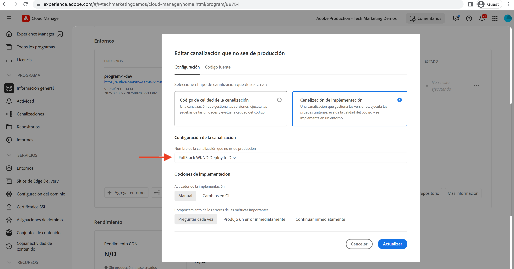
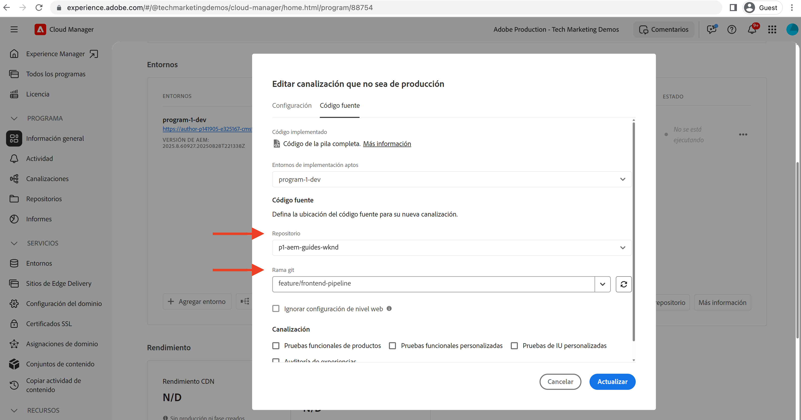
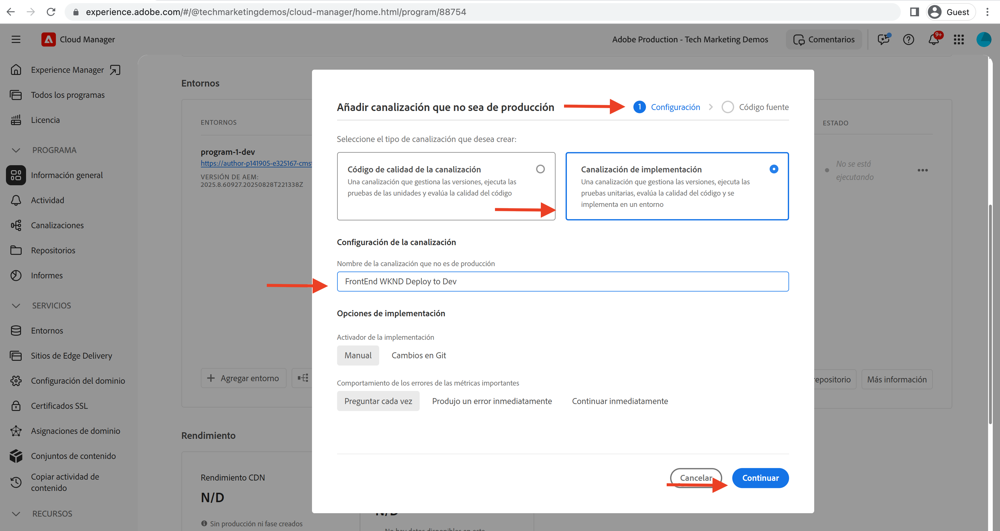
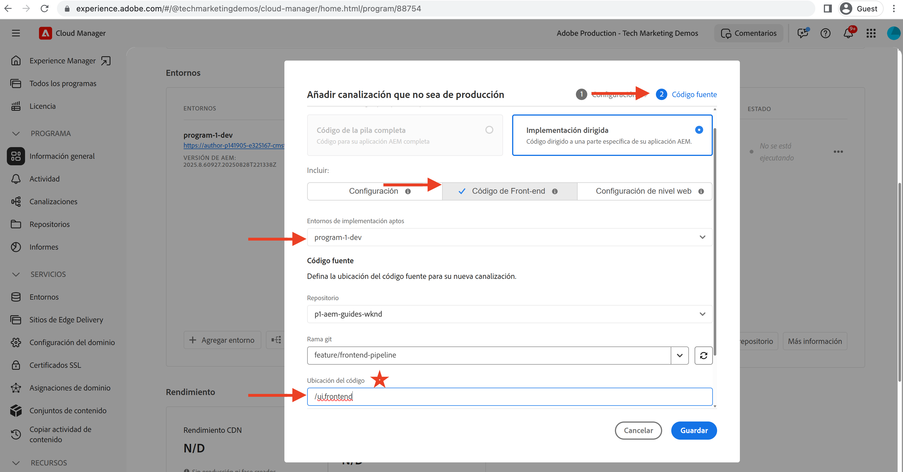
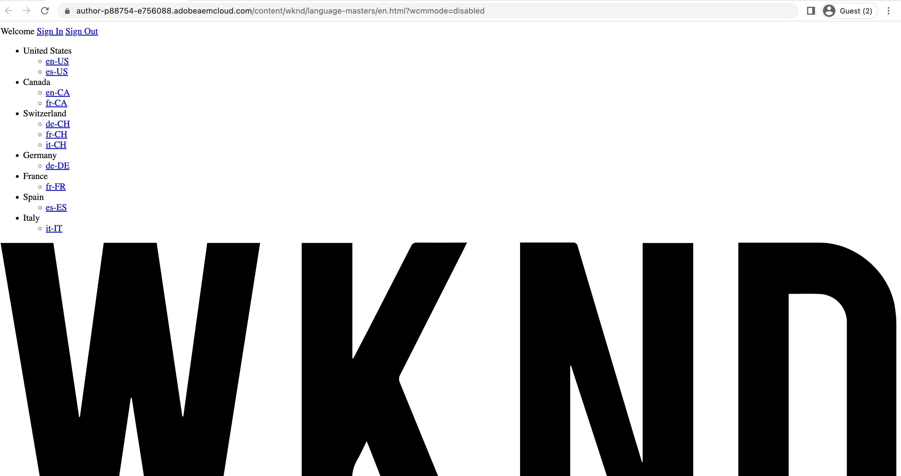

# Implementar mediante la canalización front-end

En este capítulo, creamos y ejecutamos una canalización front-end en Adobe Cloud Manager. Solo genera los archivos a partir de `ui.frontend` y los implementa en la CDN integrada en AEM as a Cloud Service. Por lo tanto, alejándose del  `/etc.clientlibs` entrega de recursos front-end basados en .

## Objetivos {#objectives}

* Cree y ejecute una canalización front-end.
* Compruebe que los recursos del front-end NO se entregan desde `/etc.clientlibs` pero desde un nuevo nombre de host que comience por `https://static-`

## Uso de la canalización front-end

>[!VIDEO](https://video.tv.adobe.com/v/3409420/)

## Requisitos previos {#prerequisites}

Este es un tutorial de varias partes y se da por hecho que los pasos descritos en la sección [Actualizar proyecto de AEM estándar](./update-project.md) se han completado.

Asegúrese de que [privilegios para crear e implementar canalizaciones en Cloud Manager](https://experienceleague.adobe.com/docs/experience-manager-cloud-manager/content/requirements/users-and-roles.html?lang=en#role-definitions) y [acceso a un entorno as a Cloud Service AEM](https://experienceleague.adobe.com/docs/experience-manager-cloud-service/content/implementing/using-cloud-manager/manage-environments.html).

## Cambiar el nombre de la canalización existente

Cambiar el nombre de la canalización existente de __Implementar en desarrollo__ a  __Implementación de WKND de FullStack en Dev__ accediendo a la __Configuración__ pestaña __Nombre de canalización que no es de producción__ campo . Esto es para que sea explícito si una canalización es de pila completa o front-end simplemente mirando su nombre.

También en el __Código fuente__ , asegúrese de que los valores de los campos Repositorio y Rama de Git son correctos y que la rama tiene sus cambios de contrato de canalización front-end.

## Creación de una canalización front-end

Hasta __SOLO__ cree e implemente los recursos front-end desde el `ui.frontend` , realice los siguientes pasos:

1. En la interfaz de usuario de Cloud Manager, desde la __Canalizaciones__ , haga clic en __Agregar__ y, a continuación, seleccione __Agregar canalización que no sea de producción__ (o __Agregar canalización de producción__) en función del entorno as a Cloud Service AEM al que desee implementar.

1. En el __Agregar canalización que no sea de producción__ como parte del __Configuración__ , seleccione __Canalización de implementación__ , asígnele el nombre como __Implementar WKND de FrontEnd en Dev__ y haga clic en __Continuar__

1. Como parte del __Código fuente__ , seleccione __Código front-end__ y seleccione el entorno de __Entornos de implementación aptos__. En el __Código fuente__ compruebe que los valores de los campos Repositorio y Rama Git sean correctos y que la rama tenga sus cambios de contrato de canalización front-end.
Y __más importante__ para el __Ubicación del código__ campo el valor es `/ui.frontend` y finalmente, haga clic en __Guardar__.

## Secuencia de implementación

* Ejecutar por primera vez el nuevo nombre __Implementación de WKND de FullStack en Dev__ para eliminar los archivos clientlib de WKND del repositorio de AEM. Y, lo que es más importante, prepare el AEM para el contrato de canalización front-end añadiendo __Configuración de Sling__ archivos (`SiteConfig`, `HtmlPageItemsConfig`).

>[!WARNING]
>
>Después, la variable __Implementación de WKND de FullStack en Dev__ finalización de la canalización, tendrá un __sin estilo__ Sitio WKND, que puede parecer roto. Planifique una interrupción del servicio o impleméntelo durante horas impares. Se trata de una interrupción única que tiene que planificar durante el cambio inicial, desde el uso de una sola canalización de pila completa hasta la canalización de front-end.

* Finalmente, ejecute el __Implementar WKND de FrontEnd en Dev__ canalización para crear solamente `ui.frontend` e implemente los recursos front-end directamente en la CDN.

>[!IMPORTANT]
>
>Observe que la variable __sin estilo__ El sitio WKND vuelve a la normalidad y esta vez __FrontEnd__ la ejecución de la canalización era mucho más rápida que la canalización de pila completa.

## Verificar cambios de estilo y nuevo paradigma de envío

* Abra cualquier página del sitio WKND y podrá ver el color del texto __Adobe rojo__ y los archivos de recursos front-end (CSS, JS) se entregan desde la CDN. El nombre de host de solicitud de recurso comienza con `https://static-pXX-eYY.p123-e456.adobeaemcloud.com/$HASH_VALUE$/theme/site.css` y, del mismo modo, site.js o cualquier otro recurso estático al que haga referencia en la variable `HtmlPageItemsConfig` archivo.

>[!TIP]
>
>La variable `$HASH_VALUE$` aquí es lo mismo que se ve en la variable __Implementar WKND de FrontEnd en Dev__  del gasoducto __HASH DE CONTENIDO__ campo . AEM recibe una notificación de la URL de CDN del recurso front-end, el valor se almacena en `/conf/wknd/sling:configs/com.adobe.cq.wcm.core.components.config.HtmlPageItemsConfig/jcr:content` under __prefixPath__ propiedad.

## Felicitaciones! {#congratulations}

Felicidades, ha creado, ejecutado y verificado la canalización del front-end que solo genera e implementa el módulo &quot;ui.frontend&quot; del proyecto WKND Sites. Ahora su equipo front-end puede iterar rápidamente en el diseño del sitio y en el comportamiento del front-end, fuera del ciclo de vida completo del proyecto de AEM.

## Pasos siguientes {#next-steps}

En el capítulo siguiente, [Consideraciones](considerations.md), revisará el impacto en el proceso de desarrollo front-end y back-end.
