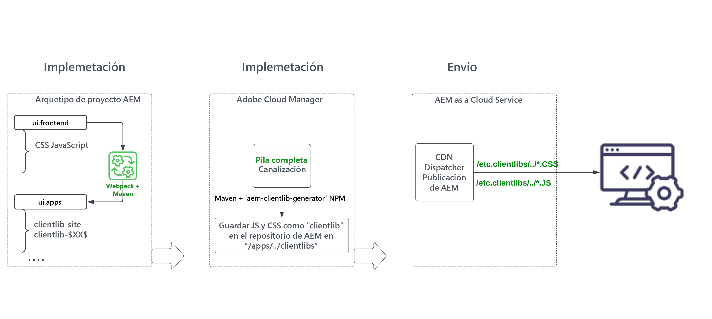

# Revise el módulo &quot;ui.frontend&quot; del proyecto de AEM de pila completa {#aem-full-stack-ui-frontent}

En este capítulo analizamos el desarrollo, la implementación y la entrega de artefactos front-end de un proyecto de AEM de pila completa, centrándonos en el módulo &quot;ui.frontend&quot; del __Proyecto WKND Sites__.


## Objetivos {#objective}

* Comprender la compilación y el flujo de implementación de artefactos front-end en un proyecto AEM de pila completa
* Revise el AEM del proyecto de pila completa `ui.frontend` módulo [webpack](https://webpack.js.org/) configuraciones
* Proceso de generación de AEM biblioteca de cliente (también conocida como clientlibs)

## Flujo de implementación front-end para AEM proyectos de pila completa y Creación rápida de sitios

>[!IMPORTANT]
>
>En este vídeo se explica y muestra el flujo del front-end para ambos **Creación rápida y de pila completa de sitios** proyectos para delinear la sutil diferencia en el modelo de creación, implementación y entrega de recursos front-end.

>[!VIDEO](https://video.tv.adobe.com/v/3409344/)

## Requisitos previos {#prerequisites}


* Clonar el [AEM proyecto WKND Sites](https://github.com/adobe/aem-guides-wknd)
* Se creó e implementó el proyecto WKND Sites AEM clonado para AEM as a Cloud Service.

Consulte el proyecto AEM WKND Site [README.md](https://github.com/adobe/aem-guides-wknd/blob/main/README.md) para obtener más información.

## AEM flujo de artefactos del front-end del proyecto de pila completa {#flow-of-frontend-artifacts}

A continuación se muestra una representación de alto nivel de la variable __desarrollo, implementación y entrega__ flujo de los artefactos front-end en un proyecto de AEM de pila completa.




Durante la fase de desarrollo, los cambios del front-end como el estilo y la renovación de marca se realizan actualizando los archivos CSS y JS del `ui.frontend/src/main/webpack` carpeta. A continuación, durante la hora de creación, la variable [webpack](https://webpack.js.org/) module-bundler y maven plugin convierten estos archivos en clientlibs AEM optimizados en `ui.apps` módulo.

Los cambios del front-end se implementan en AEM entorno as a Cloud Service al ejecutar el [__Pila completa__ canalización en Cloud Manager](https://experienceleague.adobe.com/docs/experience-manager-cloud-service/content/implementing/using-cloud-manager/cicd-pipelines/introduction-ci-cd-pipelines.html).

Los recursos front-end se entregan a los exploradores web a través de rutas de URI que comienzan por `/etc.clientlibs/`, y se almacenan normalmente en la caché de AEM Dispatcher y CDN.


>[!NOTE]
>
> Del mismo modo, en la variable __AEM Recorrido de creación rápida de sitios__, el [cambios front-end](https://experienceleague.adobe.com/docs/experience-manager-cloud-service/content/sites/administering/site-creation/quick-site/customize-theme.html) se implementan en AEM entorno as a Cloud Service ejecutando el __Front-End__ canalización, consulte [Configurar la canalización](https://experienceleague.adobe.com/docs/experience-manager-cloud-service/content/sites/administering/site-creation/quick-site/pipeline-setup.html)

### Revisar configuraciones de webpack en el proyecto WKND Sites {#development-frontend-webpack-clientlib}

* Hay tres __webpack__ Archivos de configuración utilizados para empaquetar los recursos del front-end de los sitios WKND.

   1. `webpack.common` - Contiene el __frecuentes__ configuración para instruir la optimización y agrupación de recursos WKND. La variable __output__ indica a dónde emitir los archivos consolidados (también conocidos como paquetes JavaScript, pero no confundirlos con AEM paquetes OSGi) que crea. El nombre predeterminado está establecido en `clientlib-site/js/[name].bundle.js`.

   ```javascript
       ...
       output: {
               filename: 'clientlib-site/js/[name].bundle.js',
               path: path.resolve(__dirname, 'dist')
           }
       ...    
   ```

   1. `webpack.dev.js` contiene el __desarrollo__ para webpack-dev-serve y señala a la plantilla de HTML que se va a usar. También contiene una configuración proxy para una instancia de AEM que se ejecuta en `localhost:4502`.

   ```javascript
       ...
       devServer: {
           proxy: [{
               context: ['/content', '/etc.clientlibs', '/libs'],
               target: 'http://localhost:4502',
           }],
       ...    
   ```

   1. `webpack.prod.js` contiene el __producción__ y utiliza los complementos para transformar los archivos de desarrollo en paquetes optimizados.

   ```javascript
       ...
       module.exports = merge(common, {
           mode: 'production',
           optimization: {
               minimize: true,
               minimizer: [
                   new TerserPlugin(),
                   new CssMinimizerPlugin({ ...})
           }
       ...    
   ```


* Los recursos agrupados se mueven al `ui.apps` módulo que utiliza [aem-clientlib-generator](https://www.npmjs.com/package/aem-clientlib-generator) usando la configuración administrada en la `clientlib.config.js` archivo.

```javascript
    ...
    const BUILD_DIR = path.join(__dirname, 'dist');
    const CLIENTLIB_DIR = path.join(
    __dirname,
    '..',
    'ui.apps',
    'src',
    'main',
    'content',
    'jcr_root',
    'apps',
    'wknd',
    'clientlibs'
    );
    ...
```

* La variable __frontend-maven-plugin__ from `ui.frontend/pom.xml` organiza el agrupamiento de webpack y la generación de clientlib durante AEM compilación del proyecto.

`$ mvn clean install -PautoInstallSinglePackage`

### Implementación para AEM as a Cloud Service {#deployment-frontend-aemaacs}

La variable [__Pila completa__ canalización](https://experienceleague.adobe.com/docs/experience-manager-cloud-service/content/implementing/using-cloud-manager/cicd-pipelines/introduction-ci-cd-pipelines.html?#full-stack-pipeline) implementa estos cambios en un entorno as a Cloud Service AEM.


### Envío desde AEM as a Cloud Service {#delivery-frontend-aemaacs}

Los recursos front-end implementados mediante la canalización de pila completa se entregan desde el sitio AEM a los exploradores web como `/etc.clientlibs` archivos. Puede verificarlo visitando el [sitio WKND alojado públicamente](https://wknd.site/content/wknd/us/en.html) y viendo el origen de la página web.

```html
    ....
    <link rel="stylesheet" href="/etc.clientlibs/wknd/clientlibs/clientlib-site.lc-181cd4102f7f49aa30eea548a7715c31-lc.min.css" type="text/css">

    ...

    <script async src="/etc.clientlibs/wknd/clientlibs/clientlib-site.lc-d4e7c03fe5c6a405a23b3ca1cc3dcd3d-lc.min.js"></script>
    ....
```

## Felicitaciones! {#congratulations}

Felicitaciones, ha revisado el módulo ui.frontend del proyecto de pila completa

## Pasos siguientes {#next-steps}

En el capítulo siguiente, [Actualizar proyecto para utilizar canalización de front-end](update-project.md), actualizará el proyecto WKND Sites de AEM para habilitarlo para el contrato de canalización front-end.
