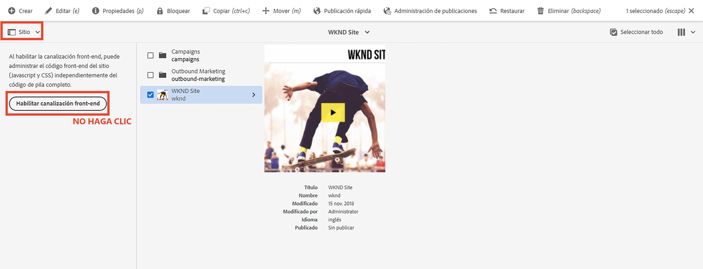

# AEM Actualizar proyecto de de pila completa para utilizar canalización front-end {#update-project-enable-frontend-pipeline}

En este capítulo, realizamos cambios de configuración en __Proyecto de WKND Sites__ para utilizar la canalización front-end para implementar JavaScript y CSS, en lugar de requerir una ejecución de canalización completa. Esto desvincula el ciclo vital de desarrollo e implementación de los artefactos front-end y back-end, lo que permite un proceso de desarrollo más rápido e iterativo en general.

## Objetivos {#objectives}

* Actualizar el proyecto de pila completa para utilizar la canalización front-end

## AEM Información general sobre los cambios de configuración en el proyecto de código de pila completa de la

>[!VIDEO](https://video.tv.adobe.com/v/3409419?quality=12&learn=on)

## Requisitos previos {#prerequisites}

Este es un tutorial de varias partes y se da por hecho que ha revisado la [Módulo &quot;ui.frontend&quot;](./review-uifrontend-module.md).


## AEM Cambios en el proyecto de código de pila completa de la

Hay tres cambios de configuración relacionados con el proyecto y un cambio de estilo que se deben implementar para una ejecución de prueba, por lo que en total hay cuatro cambios específicos en el proyecto WKND para habilitarlo para el contrato de canalización front-end.

1. Retire el `ui.frontend` módulo del ciclo de compilación de pila completa

   * En, la raíz del proyecto WKND Sites `pom.xml` comentar el `<module>ui.frontend</module>` entrada de submódulo.

   ```xml
       ...
       <modules>
       <module>all</module>
       <module>core</module>
       <!--
       <module>ui.frontend</module>
       -->                
       <module>ui.apps</module>
       ...
   ```

   * Y dependencia relacionada con los comentarios del `ui.apps/pom.xml`

   ```xml
       ...
       <!-- ====================================================================== -->
       <!-- D E P E N D E N C I E S                                                -->
       <!-- ====================================================================== -->
           ...
       <!--
           <dependency>
               <groupId>com.adobe.aem.guides</groupId>
               <artifactId>aem-guides-wknd.ui.frontend</artifactId>
               <version>${project.version}</version>
               <type>zip</type>
           </dependency>
       -->    
       ...
   ```

1. Prepare el `ui.frontend` para el contrato de canalización front-end al agregar dos nuevos archivos de configuración de webpack.

   * Copiar el existente `webpack.common.js` as `webpack.theme.common.js`y cambie `output` propiedad y `MiniCssExtractPlugin`, `CopyWebpackPlugin` parámetros de configuración de complemento como se muestra a continuación:

   ```javascript
   ...
   output: {
           filename: 'theme/js/[name].js', 
           path: path.resolve(__dirname, 'dist')
       }
   ...
   
   ...
       new MiniCssExtractPlugin({
               filename: 'theme/[name].css'
           }),
       new CopyWebpackPlugin({
           patterns: [
               { from: path.resolve(__dirname, SOURCE_ROOT + '/resources'), to: './clientlib-site' }
           ]
       })
   ...
   ```

   * Copiar el existente `webpack.prod.js` as `webpack.theme.prod.js`y cambie la `common` ubicación de la variable en el archivo anterior como

   ```javascript
   ...
       const common = require('./webpack.theme.common.js');
   ...
   ```

   >[!NOTE]
   >
   >Los dos cambios de configuración anteriores del &quot;webpack&quot; deben tener nombres de archivo y carpeta de salida diferentes, para que podamos diferenciar fácilmente entre los artefactos clientlib (full-stack) y los generados por el tema (front-end) del front-end de la canalización.
   >
   >Como ha adivinado, los cambios anteriores se pueden omitir para utilizar también las configuraciones de Webpack existentes, pero los cambios siguientes son obligatorios.
   >
   >Depende de usted cómo desee ponerles nombre u organizarlos.


   * En el `package.json` , asegúrese de que la variable  `name` el valor de la propiedad es el mismo que el nombre del sitio de `/conf` nodo. Y bajo el `scripts` propiedad, a `build` secuencia de comandos que indica cómo crear los archivos front-end a partir de este módulo.

   ```javascript
       {
       "name": "wknd",
       "version": "1.0.0",
       ...
   
       "scripts": {
           "build": "webpack --config ./webpack.theme.prod.js"
       }
   
       ...
       }
   ```

1. Prepare el `ui.content` para la canalización front-end al agregar dos configuraciones de Sling.

   * Cree un archivo en `com.adobe.cq.wcm.core.components.config.HtmlPageItemsConfig` - esto incluye todos los archivos front-end que el `ui.frontend` El módulo de se genera en `dist` usando el proceso de generación de webpack.

   ```xml
   ...
       <css
       jcr:primaryType="nt:unstructured"
       element="link"
       location="header">
       <attributes
           jcr:primaryType="nt:unstructured">
           <as
               jcr:primaryType="nt:unstructured"
               name="as"
               value="style"/>
           <href
               jcr:primaryType="nt:unstructured"
               name="href"
               value="/theme/site.css"/>
   ...
   ```

   >[!TIP]
   >
   >    Ver la información completa [HtmlPageItemsConfig](https://github.com/adobe/aem-guides-wknd/blob/feature/frontend-pipeline/ui.content/src/main/content/jcr_root/conf/wknd/_sling_configs/com.adobe.cq.wcm.core.components.config.HtmlPageItemsConfig/.content.xml) en el __AEM Proyecto de sitios WKND de WKND__.


   * Segundo, el `com.adobe.aem.wcm.site.manager.config.SiteConfig` con el `themePackageName` siendo el mismo que el `package.json` y `name` valor de propiedad y `siteTemplatePath` apuntando a un `/libs/wcm/core/site-templates/aem-site-template-stub-2.0.0` valor de ruta auxiliar.

   ```xml
   ...
       <?xml version="1.0" encoding="UTF-8"?>
       <jcr:root xmlns:sling="http://sling.apache.org/jcr/sling/1.0" xmlns:jcr="http://www.jcp.org/jcr/1.0" xmlns:nt="http://www.jcp.org/jcr/nt/1.0"
               jcr:primaryType="nt:unstructured"
               siteTemplatePath="/libs/wcm/core/site-templates/aem-site-template-stub-2.0.0"
               themePackageName="wknd">
       </jcr:root>
   ...
   ```

   >[!TIP]
   >
   >    Consulte, la [SiteConfig](https://github.com/adobe/aem-guides-wknd/blob/feature/frontend-pipeline/ui.content/src/main/content/jcr_root/conf/wknd/_sling_configs/com.adobe.aem.wcm.site.manager.config.SiteConfig/.content.xml) en el __AEM Proyecto de sitios WKND de WKND__.

1. Un tema o un cambio de estilos para implementar mediante la canalización front-end para una ejecución de prueba; estamos cambiando `text-color` al Adobe rojo (o puede elegir el suyo propio) actualizando el `ui.frontend/src/main/webpack/base/sass/_variables.scss`.

   ```css
       $black:     #a40606;
       ...
   ```

Finalmente, inserte estos cambios en el repositorio de Git de Adobe del programa.


>[!AVAILABILITY]
>
> Estos cambios están disponibles en GitHub dentro de [__canalización front-end__](https://github.com/adobe/aem-guides-wknd/tree/feature/frontend-pipeline) rama de la __AEM Proyecto de sitios WKND de WKND__.


## Precaución - _Habilitar canalización front-end_ botón

El [Selector de carril](https://experienceleague.adobe.com/docs/experience-manager-cloud-service/content/sites/authoring/getting-started/basic-handling.html) de [Sitio](https://experienceleague.adobe.com/docs/experience-manager-cloud-service/content/sites/authoring/getting-started/basic-handling.html) muestra la opción **Habilitar canalización front-end** al seleccionar la raíz o la página del sitio. Clic **Habilitar canalización front-end** sobrescribirá el botón anterior **Configuraciones de Sling**, asegúrese de que **no haga clic en** Haga clic en este botón después de implementar los cambios anteriores a través de la ejecución de la canalización de Cloud Manager.



Si se hace clic en él por error, debe volver a ejecutar las canalizaciones para asegurarse de que se restauran el contrato y los cambios de la canalización front-end.

## Enhorabuena. {#congratulations}

¡Enhorabuena! Ha actualizado el proyecto de WKND Sites para habilitarlo para el contrato de canalización front-end.

## Pasos siguientes {#next-steps}

En el capítulo siguiente, [Implementación mediante la canalización front-end](create-frontend-pipeline.md), creará y ejecutará una canalización front-end y verificará cómo __se alejó__ de la entrega de recursos front-end basada en /etc.clientlibs.
