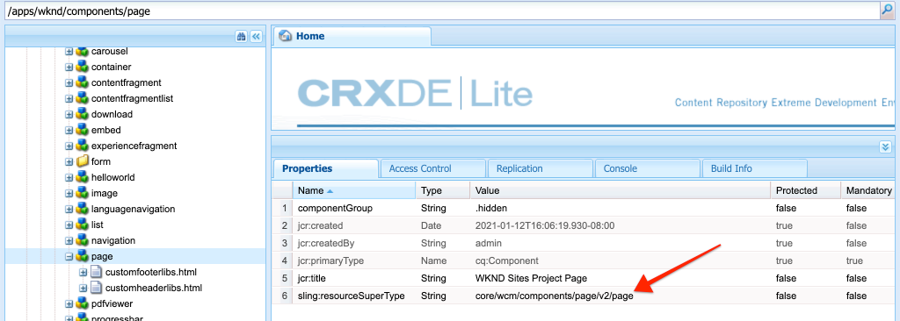

# Páginas y plantillas {#pages-and-template}

En este capítulo analizaremos la relación entre un componente de página base y plantillas editables. Generaremos una plantilla de artículo sin estilo basada en algunas maquetas de [AdobeXD](https://www.adobe.com/products/xd.html). En el proceso de creación de la plantilla, se tratan los componentes principales y las configuraciones de directiva avanzadas de las plantillas editables.

## Requisitos previos {#prerequisites}

Revise las herramientas y las instrucciones necesarias para configurar un [entorno de desarrollo local](overview.md#local-dev-environment).

### Proyecto de inicio

>[!NOTE]
>
> Si ha completado correctamente el capítulo anterior, puede volver a utilizar el proyecto y omitir los pasos para extraer el proyecto de inicio.

Consulte el código de línea base que el tutorial genera:

1. Consulte la rama `tutorial/pages-templates-start` de [GitHub](https://github.com/adobe/aem-guides-wknd)

   ```shell
   $ cd ~/code/aem-guides-wknd
   $ git checkout tutorial/pages-templates-start
   ```

1. Implemente código base en una instancia de AEM local con sus conocimientos Maven:

   ```shell
   $ mvn clean install -PautoInstallSinglePackage
   ```

   >[!NOTE]
   >
   > Si utiliza AEM 6.5 o 6.4, anexe el perfil `classic` a cualquier comando Maven.

   ```shell
   $ mvn clean install -PautoInstallSinglePackage -Pclassic
   ```

Siempre puede realizar la vista del código terminado en [GitHub](https://github.com/adobe/aem-guides-wknd/tree/pages-templates/solution) o extraer el código localmente cambiando a la rama `tutorial/pages-templates-solution`.

## Objetivo

1. Inspect es un diseño de página creado en Adobe XD y asignado a Componentes principales.
1. Conocer los detalles de las plantillas editables y cómo se pueden utilizar las políticas para aplicar el control granular del contenido de la página.
1. Conozca cómo se vinculan las plantillas y las páginas

## Qué va a generar {#what-you-will-build}

En esta parte del tutorial, generará una nueva plantilla de página de artículo que se puede utilizar para crear nuevas páginas de artículos y se alinea con una estructura común. La plantilla de página de artículo se basará en diseños y en un kit de interfaz de usuario creado en AdobeXD. Este capítulo se centra únicamente en la creación de la estructura o esqueleto de la plantilla. No se implementarán estilos, pero la plantilla y las páginas funcionarán.


## Planificación de UI con Adobe XD {#adobexd}

En la mayoría de los casos, la planificación de un nuevo sitio web inicio con maquetas y diseños estáticos. [Adobe ](https://www.adobe.com/products/xd.html) XD es una herramienta de diseño que crea experiencias de usuario. A continuación, inspeccionaremos un kit de IU y las maquetas para ayudarle a planificar la estructura de la plantilla de página de artículos.

>[!VIDEO](https://video.tv.adobe.com/v/30214/?quality=12&learn=on)

**Descargue el archivo [ de diseño de artículos ](https://github.com/adobe/aem-guides-wknd/releases/download/aem-guides-wknd-0.0.2/AEM_UI-kit-WKND-article-design.xd)** WKND.

## Creación de la plantilla de página de artículo

Al crear una página, debe seleccionar una plantilla, que se utilizará como base para crear la página nueva. La plantilla define la estructura de la página resultante, el contenido inicial y los componentes permitidos.

Existen tres áreas principales de [Plantillas editables](https://experienceleague.adobe.com/docs/experience-manager-65/developing/platform/templates/page-templates-editable.html):

1. **Estructura** : define los componentes que forman parte de la plantilla. Los autores de contenido no podrán editarlos.
1. **Contenido**  inicial: define los componentes con los que se realizará el inicio de la plantilla; los autores de contenido pueden editarlos o eliminarlos
1. **Políticas** : define las configuraciones sobre cómo se comportarán los componentes y las opciones que tendrán disponibles los autores.

A continuación, cree una nueva plantilla en AEM que coincida con la estructura de las maquetas. Esto ocurrirá en una instancia local de AEM. Siga los pasos del siguiente vídeo:

>[!VIDEO](https://video.tv.adobe.com/v/330991/?quality=12&learn=on)

Pasos de alto nivel para el vídeo siguiente:

### Configuraciones de estructura

1. Cree una nueva plantilla con el **Tipo de plantilla de página**, denominado **Página del artículo**.
1. Cambie al modo **Estructura**.
1. Añada un componente **Fragmento de experiencias** para que actúe como el **Encabezado** en la parte superior de la plantilla.
   * Configure el componente para que señale a `/content/experience-fragments/wknd/us/en/site/header/master`.
   * Establezca la directiva en **Encabezado de página** y asegúrese de que el **Elemento predeterminado** esté establecido en `header`. El elemento `header`se segmentará con CSS en el siguiente capítulo.
1. Añada un componente **Fragmento de experiencia** para que actúe como **Pie de página** en la parte inferior de la plantilla.
   * Configure el componente para que señale a `/content/experience-fragments/wknd/us/en/site/footer/master`.
   * Establezca la directiva en **Pie de página** y asegúrese de que el **Elemento predeterminado** está establecido en `footer`. El elemento `footer` se segmentará con CSS en el siguiente capítulo.
1. Bloquear el contenedor **main** que se incluyó al crear la plantilla por primera vez.
   * Establezca la directiva en **Página principal** y asegúrese de que el **Elemento predeterminado** esté establecido en `main`. El elemento `main` se segmentará con CSS en el siguiente capítulo.
1. Añada un componente **Imagen** en el contenedor **principal**.
   * Desbloquee el componente **Imagen**.
1. Añada un componente **Breadcrumb** debajo del componente **Image** en el contenedor principal.
   * Cree una nueva directiva para el componente **Ruta de exploración** denominado **Página del artículo - Ruta de exploración**. Establezca el **Nivel de Inicio de navegación** en **4**.
1. Añada un componente **Contenedor** debajo del componente **Ruta de exploración** y dentro del contenedor **principal**. Esto actuará como el **contenedor de contenido** para la plantilla.
   * Desbloquee el contenedor **Content**.
   * Establezca la directiva en **Contenido de página**.
1. Añada otro componente **Contenedor** debajo del **contenedor de contenido**. Esto actuará como el contenedor **Carril lateral** para la plantilla.
   * Desbloquee el contenedor **Carril lateral**.
   * Cree una nueva directiva denominada **Página del artículo - Carril lateral**.
   * Configure los **Componentes permitidos** en **Proyecto de sitios WKND - Contenido** para incluir: **Botón**, **Descargar**, **Imagen**, **Lista**, **Separador**, **Compartir en medios sociales**, **Texto** y **Título**.
1. Actualice la directiva del contenedor Raíz de página. Este es el contenedor exterior de la plantilla. Establezca la directiva en **Raíz de página**.
   * En **Configuración de Contenedor**, establezca el **Diseño** en **Cuadrícula adaptable**.
1. Iniciar el modo de diseño para el **contenedor de contenido**. Arrastre el control de derecha a izquierda y reduzca el contenedor para que tenga 8 columnas de ancho.
1. Iniciar modo de diseño para el **contenedor de carril lateral**. Arrastre el control de derecha a izquierda y reduzca el contenedor para que tenga 4 columnas de ancho. A continuación, arrastre el control izquierdo de izquierda a derecha 1 columna para que el contenedor 3 tenga una anchura y deje un espacio de 1 columna entre el **contenedor de contenido**.
1. Abra el emulador móvil y cambie a un punto de interrupción móvil. Vuelva a activar el modo de diseño y haga que el **contenedor de contenido** y el **contenedor de carril lateral** tengan toda la anchura de la página. Esto apilará los contenedores verticalmente en el punto de interrupción móvil.
1. Actualice la directiva del componente **Texto** en el **contenedor de contenido**.
   * Establezca la directiva en **Texto de contenido**.
   * En **Complementos** > **Estilos de párrafo**, marque **Habilitar estilos de párrafo** y asegúrese de que el **bloque de presupuesto** esté habilitado.

### Configuraciones de contenido inicial

1. Cambie al modo **Contenido inicial**.
1. Añada un componente **Título** al **contenedor de contenido**. Esto actuará como título del artículo. Cuando se deje vacío, automáticamente se mostrará el Título de la página actual.
1. Añada un segundo componente **Título** debajo del primer componente Título.
   * Configure el componente con el texto: &quot;Por autor&quot;. Será un marcador de posición de texto.
   * Establezca el tipo en `H4`.
1. Añada un componente **Texto** debajo del componente **Por autor** Título.
1. Añada un componente **Título** al **Contenedor de carril lateral**.
   * Configure el componente con el texto: &quot;Comparte esta historia&quot;.
   * Establezca el tipo en `H5`.
1. Añada un componente **Compartir en redes sociales** debajo del componente **Compartir este artículo** Título.
1. Añada un componente **Separador** debajo del componente **Compartir en medios sociales**.
1. Añada un componente **Descargar** debajo del componente **Separador**.
1. Añada un componente **Lista** debajo del componente **Descargar**.
1. Actualice las **Propiedades de página inicial** de la plantilla.
   * En **Medios sociales** > **Compartir en medios sociales**, marque **Facebook** y **Pinterest**

### Habilitar la plantilla y agregar una miniatura

1. Para vista de la plantilla en la consola Plantilla, vaya a [http://localhost:4502/libs/wcm/core/content/sites/templates.html/conf/wknd](http://localhost:4502/libs/wcm/core/content/sites/templates.html/conf/wknd)
1. **** Habilite la plantilla Página del artículo.
1. Edite las propiedades de la plantilla Página del artículo y cargue la siguiente miniatura para identificar rápidamente las páginas creadas con la plantilla Página del artículo:

   

## Actualizar el encabezado y el pie de página con fragmentos de experiencia {#experience-fragments}

Una práctica habitual al crear contenido global, como un encabezado o pie de página, es utilizar un [fragmento de experiencia](https://docs.adobe.com/content/help/en/experience-manager-learn/sites/experience-fragments/experience-fragments-feature-video-use.html). Fragmentos de experiencia, permite a los usuarios combinar varios componentes para crear un único componente con referencia. Los fragmentos de experiencia tienen la ventaja de admitir la administración de varios sitios y la [localización](https://experienceleague.adobe.com/docs/experience-manager-core-components/using/components/experience-fragment.html?lang=en#localized-site-structure).

El arquetipo del proyecto AEM generó un encabezado y un pie de página. A continuación, actualice los fragmentos de experiencias para que coincidan con los bocetos. Siga los pasos del siguiente vídeo:

>[!VIDEO](https://video.tv.adobe.com/v/330992/?quality=12&learn=on)

Pasos de alto nivel para el vídeo siguiente:

1. Descargue el paquete de contenido de muestra **[WKND-PagesTemplates-Content-Assets.zip](assets/pages-templates/WKND-PagesTemplates-Content-Assets.zip)**.
1. Cargue e instale el paquete de contenido mediante el Administrador de paquetes en [http://localhost:4502/crx/packmgr/index.jsp](http://localhost:4502/crx/packmgr/index.jsp)
1. Actualice la plantilla Variación web, que es la plantilla utilizada para los fragmentos de experiencia en [http://localhost:4502/editor.html/conf/wknd/settings/wcm/templates/xf-web-variation/structure.html](http://localhost:4502/editor.html/conf/wknd/settings/wcm/templates/xf-web-variation/structure.html)
   * Actualice la directiva del componente **Contenedor** en la plantilla.
   * Establezca la directiva en **XF Root**.
   * En **Componentes permitidos** seleccione el grupo de componentes **Proyecto de sitios WKND - Estructura** para incluir los componentes **Navegación de idioma**, **Navegación** y **Búsqueda rápida**.

### Actualizar fragmento de experiencia de encabezado

1. Abra el fragmento de experiencias que procesa el encabezado en [http://localhost:4502/editor.html/content/experience-fragments/wknd/us/en/site/header/master.html](http://localhost:4502/editor.html/content/experience-fragments/wknd/us/en/site/header/master.html)
1. Configure el **Contenedor** raíz del fragmento. Este es el Contenedor **más externo**.
   * Configure el **Diseño** en **Cuadrícula adaptable**
1. Añada el **logotipo oscuro de WKND** como una imagen en la parte superior del **Contenedor**. El logotipo se incluyó en el paquete instalado en un paso anterior.
   * Modifique el diseño del **logotipo oscuro de WKND** para que tenga **2** columnas de ancho. Arrastre los controladores de derecha a izquierda.
   * Configure el logotipo con **Texto alternativo** de &quot;Logotipo WKND&quot;.
   * Configure el logotipo para **Vincular** a `/content/wknd/us/en` la Página de inicio.
1. Configure el componente **Navegación** que ya está ubicado en la página.
   * Establezca **Excluir niveles raíz** en **1**.
   * Establezca la **Profundidad de estructura de navegación** en **1**.
   * Modifique el diseño del componente **Navegación** para que tenga **8** columnas de ancho. Arrastre los controladores de derecha a izquierda.
1. Elimine el componente **Navegación de idioma**.
1. Modifique el diseño del componente **Buscar** para que tenga **2** columnas de ancho. Arrastre los controladores de derecha a izquierda. Ahora todos los componentes deben alinearse horizontalmente en una sola fila.

### Actualizar fragmento de experiencia de pie de página

1. Abra el fragmento de experiencias que procesa el pie de página en [http://localhost:4502/editor.html/content/experience-fragments/wknd/us/en/site/footer/master.html](http://localhost:4502/editor.html/content/experience-fragments/wknd/us/en/site/footer/master.html)
1. Configure el **Contenedor** raíz del fragmento. Este es el Contenedor **más externo**.
   * Configure el **Diseño** en **Cuadrícula adaptable**
1. Añada el **logotipo de luz WKND** como una imagen en la parte superior del **Contenedor**. El logotipo se incluyó en el paquete instalado en un paso anterior.
   * Modifique el diseño del **logotipo de luz WKND** para que tenga **2** columnas de ancho. Arrastre los controladores de derecha a izquierda.
   * Configure el logotipo con **Texto alternativo** de &quot;Luz del logotipo WKND&quot;.
   * Configure el logotipo para **Vincular** a `/content/wknd/us/en` la Página de inicio.
1. Añada un componente **Navegación** debajo del logotipo. Configure el componente **Navegación**:
   * Establezca **Excluir niveles raíz** en **1**.
   * Desmarque **Recopilar todas las páginas secundarias**.
   * Establezca la **Profundidad de estructura de navegación** en **1**.
   * Modifique el diseño del componente **Navegación** para que tenga **8** columnas de ancho. Arrastre los controladores de derecha a izquierda.

## Crear una página de artículo

A continuación, cree una nueva página con la plantilla Página del artículo. Cree el contenido de la página para que coincida con las maquetas del sitio. Siga los pasos del siguiente vídeo:

>[!VIDEO](https://video.tv.adobe.com/v/330993/?quality=12&learn=on)

Pasos de alto nivel para el vídeo siguiente:

1. Vaya a la consola Sitios en [http://localhost:4502/sites.html/content/wknd/us/en/magazine](http://localhost:4502/sites.html/content/wknd/us/en/magazine).
1. Cree una nueva página debajo de **WKND** > **US** > **EN** > **Revista**.
   * Elija la plantilla **Página del artículo**.
   * En **Properties** establezca **Title** en &quot;Ultimate Guide to LA Skateparks&quot;
   * Configure **Name** como &quot;guide-la-skateparks&quot;
1. Reemplace **By Author** Title por el texto &quot;By Stacey Roswells&quot;.
1. Actualice el componente **Texto** para incluir un párrafo para rellenar el artículo. Puede utilizar el siguiente archivo de texto como copia: [la-skate-parks-copy.txt](assets/pages-templates/la-skateparks-copy.txt).
1. Añada otro componente **Texto**.
   * Actualice el componente para incluir la cotización: &quot;No hay mejor lugar para compartir que Los Ángeles&quot;.
   * Edite el Editor de texto enriquecido en modo de pantalla completa y modifique la cita anterior para utilizar el elemento **Bloque de comillas**.
1. Siga rellenando el cuerpo del artículo para que coincida con las maquetas.
1. Configure el componente **Descargar** para utilizar una versión en PDF del artículo.
   * En **Descargar** > **Propiedades**, haga clic en la casilla de verificación para **Obtener el título del recurso DAM**.
   * Configure **Description** en: &quot;Obtenga la historia completa&quot;.
   * Establezca el **Texto de acción** en: &quot;Descargar PDF&quot;.
1. Configure el componente **Lista**.
   * En **Configuración de Lista** > **Generar Lista usando**, seleccione **Páginas secundarias**.
   * Establezca la **Página principal** en `/content/wknd/us/en/magazine`.
   * En **Configuración del elemento** marque **Elementos del vínculo** y marque **Mostrar fecha**.

## Inspect la estructura de nodos {#node-structure}

En este punto, la página del artículo está claramente sin estilo. Sin embargo, la estructura básica está establecida. A continuación, inspeccione la estructura de nodos de la página del artículo para comprender mejor la función de la plantilla, la página y los componentes.

Utilice la herramienta CRXDE-Lite en una instancia de AEM local para vista de la estructura de nodos subyacente.

1. Abra [CRXDE-Lite](http://localhost:4502/crx/de/index.jsp#/content/wknd/us/en/magazine/guide-la-skateparks/jcr%3Acontent) y utilice la navegación de árbol para desplazarse a `/content/wknd/us/en/magazine/guide-la-skateparks`.

1. Haga clic en el nodo `jcr:content` debajo de la página `la-skateparks` y vista las propiedades:

   

   Observe el valor de `cq:template`, que apunta a `/conf/wknd/settings/wcm/templates/article-page`, la plantilla de página de artículo que hemos creado anteriormente.

   Observe también el valor de `sling:resourceType`, que apunta a `wknd/components/page`. Es el componente de página creado por el arquetipo del proyecto de AEM y es responsable de procesar la página en función de la plantilla.

1. Expanda el nodo `jcr:content` debajo de `/content/wknd/us/en/magazine/guide-la-skateparks/jcr:content` y vista la jerarquía de nodos:

   

   Debería poder asignar cada uno de los nodos de forma flexible a los componentes creados. Consulte si puede identificar los diferentes Contenedores de diseño utilizados inspeccionando los nodos con el prefijo `container`.

1. A continuación, inspeccione el componente de página en `/apps/wknd/components/page`. Vista de las propiedades del componente en CRXDE Lite:

   

   Tenga en cuenta que solo hay 2 secuencias de comandos HTL, `customfooterlibs.html` y `customheaderlibs.html` debajo del componente de página. *Entonces, ¿cómo representa este componente la página?*

   La propiedad `sling:resourceSuperType` apunta a `core/wcm/components/page/v2/page`. Esta propiedad permite que el componente de página de WKND herede **todo** de la funcionalidad del componente de página del componente principal. Este es el primer ejemplo de algo llamado [Patrón de componentes proxy](https://docs.adobe.com/content/help/en/experience-manager-core-components/using/developing/guidelines.html#ProxyComponentPattern). Puede encontrar más información [aquí.](https://docs.adobe.com/content/help/en/experience-manager-core-components/using/developing/guidelines.html).

1. Inspect es otro componente dentro de los componentes WKND, el componente `Breadcrumb` ubicado en: `/apps/wknd/components/breadcrumb`. Observe que se puede encontrar la misma propiedad `sling:resourceSuperType`, pero esta vez señala a `core/wcm/components/breadcrumb/v2/breadcrumb`. Este es otro ejemplo de uso del patrón de componentes proxy para incluir un componente principal. De hecho, todos los componentes de la base de código WKND son proxies de AEM componentes principales (excepto nuestro famoso componente HelloWorld). Se recomienda intentar reutilizar la mayor parte posible de la funcionalidad de los componentes principales *antes de que* escriba código personalizado.

1. A continuación, inspeccione la página de componentes principales en `/libs/core/wcm/components/page/v2/page` mediante CRXDE Lite:

   >[!NOTE]
   >
   > En AEM 6.5/6.4, los componentes principales se encuentran en `/apps/core/wcm/components`. En AEM como Cloud Service, los componentes principales se encuentran en `/libs` y se actualizan automáticamente.

   

   Observe que se incluyen muchas más secuencias de comandos debajo de esta página. La página de componentes principales contiene muchas funciones. Esta funcionalidad se divide en varios scripts para facilitar el mantenimiento y la lectura. Puede rastrear la inclusión de las secuencias de comandos HTL abriendo `page.html` y buscando `data-sly-include`:

   ```html
   <!--/* /libs/core/wcm/components/page/v2/page/page.html */-->
   <!DOCTYPE HTML>
   <html data-sly-use.page="com.adobe.cq.wcm.core.components.models.Page" lang="${page.language}"
       data-sly-use.head="head.html"
       data-sly-use.footer="footer.html"
       data-sly-use.redirect="redirect.html">
       <head data-sly-call="${head.head @ page = page}"></head>
       <body class="${page.cssClassNames}"
           id="${page.id}"
           data-cmp-data-layer-enabled="${page.data ? true : false}">
           <script data-sly-test.dataLayerEnabled="${page.data}">
           window.adobeDataLayer = window.adobeDataLayer || [];
           adobeDataLayer.push({
               page: JSON.parse("${page.data.json @ context='scriptString'}"),
               event:'cmp:show',
               eventInfo: {
                   path: 'page.${page.id @ context="scriptString"}'
               }
           });
           </script>
           <sly data-sly-test.isRedirectPage="${page.redirectTarget && (wcmmode.edit || wcmmode.preview)}"
               data-sly-call="${redirect.redirect @ redirectTarget = page.redirectTarget}"></sly>
           <sly data-sly-test="${!isRedirectPage}">
               <sly data-sly-include="body.skiptomaincontent.html"></sly>
               <sly data-sly-include="body.socialmedia_begin.html"></sly>
               <sly data-sly-include="body.html"></sly>
               <sly data-sly-call="${footer.footer @ page = page}"></sly>
               <sly data-sly-include="body.socialmedia_end.html"></sly>
           </sly>
       </body>
   </html>
   ```

   La otra razón para dividir el HTL en varios scripts es permitir que los componentes proxy anulen los scripts individuales para implementar la lógica empresarial personalizada. Las secuencias de comandos HTL, `customfooterlibs.html` y `customheaderlibs.html`, se crean con el propósito explícito de ser anuladas por la implementación de proyectos.

   Puede obtener más información sobre cómo la plantilla editable influye en la representación de la página de contenido [leyendo este artículo](https://experienceleague.adobe.com/docs/experience-manager-65/developing/platform/templates/page-templates-editable.html).

1. Inspect es el otro componente principal, como la ruta de exploración en `/libs/core/wcm/components/breadcrumb/v2/breadcrumb`. Vista la secuencia de comandos `breadcrumb.html` para comprender cómo se genera finalmente el marcado para el componente de ruta de navegación.

## Guardar configuraciones en el control de código fuente {#configuration-persistence}

En muchos casos, especialmente al principio de un proyecto AEM, es valioso mantener configuraciones, como plantillas y políticas de contenido relacionadas, para el control de código fuente. Esto garantiza que todos los desarrolladores trabajen con el mismo conjunto de contenido y configuraciones y puede garantizar una coherencia adicional entre entornos. Una vez que un proyecto alcanza un cierto nivel de madurez, la práctica de administrar plantillas se puede transferir a un grupo especial de usuarios avanzados.

Por ahora, trataremos las plantillas como otras partes de código y sincronizaremos la **Plantilla de página de artículo** como parte del proyecto. Hasta ahora hemos **insertado** código de nuestro proyecto de AEM a una instancia local de AEM. La **Plantilla de página de artículo** se creó directamente en una instancia local de AEM, por lo que necesitamos **importar** la plantilla en nuestro proyecto AEM. El módulo **ui.content** se incluye en el proyecto de AEM para este propósito específico.

Los siguientes pasos se llevarán a cabo usando el IDE de VSCode usando el complemento [VSCode AEM Sync](https://marketplace.visualstudio.com/items?itemName=yamato-ltd.vscode-aem-sync&amp;ssr=false#overview) pero podría estar utilizando cualquier IDE que haya configurado para **importar** o importar contenido desde una instancia local de AEM.

1. En VSCode, abra el proyecto `aem-guides-wknd`.

1. Expanda el módulo **ui.content** en el explorador de proyectos. Expanda la carpeta `src` y vaya a `/conf/wknd/settings/wcm/templates`.

1. [!UICONTROL Haga clic con el botón derecho ] en la  `templates` carpeta y seleccione  **Importar desde AEM servidor**:

   

   Se debe importar `article-page` y actualizar también las plantillas `page-content`, `xf-web-variation`.

   

1. Repita los pasos para importar contenido pero seleccione la carpeta **políticas** ubicada en `/conf/wknd/settings/wcm/policies`.

   

1. Inspect el archivo `filter.xml` ubicado en `ui.content/src/main/content/META-INF/vault/filter.xml`.

   ```xml
   <!--ui.content filter.xml-->
   <?xml version="1.0" encoding="UTF-8"?>
   <workspaceFilter version="1.0">
       <filter root="/conf/wknd" mode="merge"/>
       <filter root="/content/wknd" mode="merge"/>
       <filter root="/content/dam/wknd" mode="merge"/>
       <filter root="/content/experience-fragments/wknd" mode="merge"/>
   </workspaceFilter>
   ```

   El archivo `filter.xml` es responsable de identificar las rutas de los nodos que se instalarán con el paquete. Observe el `mode="merge"` en cada uno de los filtros que indica que el contenido existente no se modificará, solo se agregará contenido nuevo. Dado que los autores de contenido pueden estar actualizando estas rutas, es importante que una implementación de código **no** sobrescriba el contenido. Consulte la [documentación de FileVault](https://jackrabbit.apache.org/filevault/filter.html) para obtener más información sobre cómo trabajar con elementos de filtro.

   Compare `ui.content/src/main/content/META-INF/vault/filter.xml` y `ui.apps/src/main/content/META-INF/vault/filter.xml` para comprender los diferentes nodos administrados por cada módulo.

   >[!WARNING]
   >
   > A fin de garantizar implementaciones coherentes para el sitio de referencia WKND, algunas ramas del proyecto están configuradas de manera que `ui.content` sobrescriba cualquier cambio en el JCR. Esto se hace por diseño, es decir, para las ramas de soluciones, ya que el código o los estilos se escribirán para políticas específicas.

## Felicitaciones! {#congratulations}

Enhorabuena, acaba de crear una nueva plantilla y página con Adobe Experience Manager Sites.

### Próximos pasos {#next-steps}

En este punto, la página del artículo está claramente sin estilo. Siga el tutorial [Client-Side Libraries and Front-end Workflow](client-side-libraries.md) para conocer las prácticas recomendadas para incluir CSS y Javascript para aplicar estilos globales al sitio e integrar una compilación dedicada del front-end.

Vista el código terminado en [GitHub](https://github.com/adobe/aem-guides-wknd) o revise e implemente el código de forma local en la plataforma Git `tutorial/pages-templates-solution`.

1. Clona el repositorio [github.com/adobe/aem-wknd-guides](https://github.com/adobe/aem-guides-wknd).
1. Compruebe la rama `tutorial/pages-templates-solution`.
