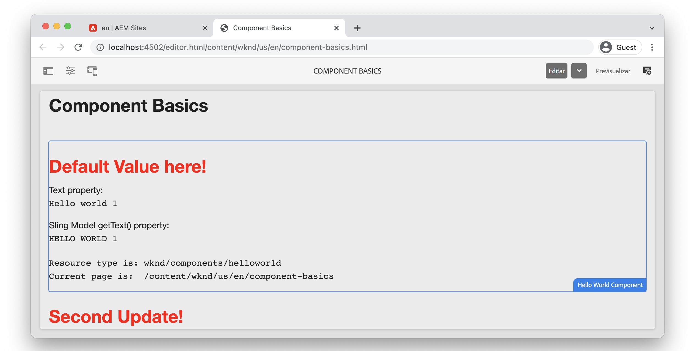

# Conceptos básicos de componentes {#component-basics}

En este capítulo analizaremos la tecnología subyacente de un componente de Adobe Experience Manager (AEM) Sites a través de una sencilla `HelloWorld` ejemplo. Se realizarán pequeñas modificaciones en un componente existente que cubrirá temas como la creación, HTL, modelos Sling y bibliotecas del lado del cliente.

## Requisitos previos {#prerequisites}

Revise las herramientas e instrucciones necesarias para configurar un [entorno de desarrollo local](./overview.md#local-dev-environment).

El IDE utilizado en los vídeos es [Código de Visual Studio](https://code.visualstudio.com/) y [VSCode AEM Sync](https://marketplace.visualstudio.com/items?itemName=yamato-ltd.vscode-aem-sync) plugin.

## Objetivo {#objective}

1. Aprenda la función de las plantillas HTL y los modelos Sling para procesar de forma dinámica el HTML.
1. Comprender cómo se utilizan los cuadros de diálogo para facilitar la creación de contenido.
1. Conozca los conceptos básicos de las bibliotecas del lado del cliente para incluir CSS y JavaScript para admitir un componente.

## Qué va a generar {#what-you-will-build}

En este capítulo realizará varias modificaciones en una `HelloWorld` componente. En el proceso de realizar actualizaciones en la variable `HelloWorld` obtenga información sobre las áreas clave del desarrollo de AEM componente.

## Proyecto de inicio de capítulo {#starter-project}

Este capítulo se basa en un proyecto genérico generado por el [Tipo de archivo del proyecto AEM](https://github.com/adobe/aem-project-archetype). Vea el siguiente vídeo y revise la [requisitos previos](#prerequisites) para empezar!

>[!NOTE]
>
> Si ha completado correctamente el capítulo anterior, puede volver a utilizar el proyecto y omitir los pasos para extraer el proyecto de inicio.

>[!VIDEO](https://video.tv.adobe.com/v/330985/?quality=12&learn=on)

Abra un nuevo terminal de línea de comandos y realice las siguientes acciones.

1. En un directorio vacío, clone el [aem-guides-wknd](https://github.com/adobe/aem-guides-wknd) repositorio:

   ```shell
   $ git clone git@github.com:adobe/aem-guides-wknd.git --branch tutorial/component-basics-start --single-branch
   ```

   >[!NOTE]
   >
   > De forma opcional, puede seguir utilizando el proyecto generado en el capítulo anterior, [Configuración del proyecto](./project-setup.md).

1. Vaya a  `aem-guides-wknd` carpeta.

   ```shell
   $ cd aem-guides-wknd
   ```

1. Cree e implemente el proyecto en una instancia local de AEM con el siguiente comando:

   ```shell
   $ mvn clean install -PautoInstallSinglePackage
   ```

   >[!NOTE]
   >
   > Si utiliza AEM 6.5 o 6.4, añada la variable `classic` perfil a cualquier comando Maven.

   ```shell
   $ mvn clean install -PautoInstallSinglePackage -Pclassic
   ```

1. Importe el proyecto en su IDE preferido siguiendo las instrucciones para configurar un [entorno de desarrollo local](overview.md#local-dev-environment).

## Creación de componentes {#component-authoring}

Los componentes pueden considerarse pequeños componentes modulares de una página web. Para reutilizar componentes, estos deben ser configurables. Esto se logra mediante el cuadro de diálogo de creación. A continuación, crearemos un componente simple e inspeccionaremos cómo se mantienen los valores del cuadro de diálogo en AEM.

>[!VIDEO](https://video.tv.adobe.com/v/330986/?quality=12&learn=on)

A continuación se muestran los pasos de alto nivel realizados en el vídeo anterior.

1. Cree una nueva página con el nombre **Conceptos básicos de componentes** below **Sitio WKND** `>` **US** `>` **en**.
1. Agregue la variable **Componente Hello World** a la página recién creada.
1. Abra el cuadro de diálogo del componente e introduzca texto. Guarde los cambios para ver el mensaje que aparece en la página.
1. Cambie al modo de desarrollador y vea la Ruta de contenido en CRXDE-Lite e inspeccione las propiedades de la instancia de componente.
1. Utilice CRXDE-Lite para ver la variable `cq:dialog` y `helloworld.html` secuencia de comandos ubicada en `/apps/wknd/components/content/helloworld`.

## HTL (lenguaje de plantilla de HTML) y cuadros de diálogo {#htl-dialogs}

Idioma de plantilla del HTML o **[HTL](https://experienceleague.adobe.com/docs/experience-manager-htl/using/getting-started/getting-started.html)** es un lenguaje de plantilla ligero del lado del servidor que utilizan los componentes de AEM para procesar contenido.

**Cuadros de diálogo** defina las configuraciones disponibles que se pueden realizar para un componente.

A continuación, actualizaremos el `HelloWorld` Secuencia de comandos HTL para mostrar un saludo adicional antes del mensaje de texto.

>[!VIDEO](https://video.tv.adobe.com/v/330987/?quality=12&learn=on)

A continuación se muestran los pasos de alto nivel realizados en el vídeo anterior.

1. Cambie al IDE y abra el proyecto a la `ui.apps` módulo.
1. Abra el `helloworld.html` y realice un cambio en el HTML Markup.
1. Utilice las herramientas IDE como [VSCode AEM Sync](https://marketplace.visualstudio.com/items?itemName=yamato-ltd.vscode-aem-sync) para sincronizar el cambio de archivo con la instancia de AEM local.
1. Vuelva al explorador y observe que el procesamiento del componente ha cambiado.
1. Abra el `.content.xml` que define el cuadro de diálogo para la variable `HelloWorld` en:

   ```plain
   <code>/aem-guides-wknd/ui.apps/src/main/content/jcr_root/apps/wknd/components/helloworld/_cq_dialog/.content.xml
   ```

1. Actualizar el cuadro de diálogo para agregar un campo de texto adicional denominado **Título** con un nombre de `./title`:

   ```xml
   <?xml version="1.0" encoding="UTF-8"?>
   <jcr:root xmlns:sling="http://sling.apache.org/jcr/sling/1.0" xmlns:cq="http://www.day.com/jcr/cq/1.0" xmlns:jcr="http://www.jcp.org/jcr/1.0" xmlns:nt="http://www.jcp.org/jcr/nt/1.0"
       jcr:primaryType="nt:unstructured"
       jcr:title="Properties"
       sling:resourceType="cq/gui/components/authoring/dialog">
       <content
           jcr:primaryType="nt:unstructured"
           sling:resourceType="granite/ui/components/coral/foundation/fixedcolumns">
           <items jcr:primaryType="nt:unstructured">
               <column
                   jcr:primaryType="nt:unstructured"
                   sling:resourceType="granite/ui/components/coral/foundation/container">
                   <items jcr:primaryType="nt:unstructured">
                       <title
                           jcr:primaryType="nt:unstructured"
                           sling:resourceType="granite/ui/components/coral/foundation/form/textfield"
                           fieldLabel="Title"
                           name="./title"/>
                       <text
                           jcr:primaryType="nt:unstructured"
                           sling:resourceType="granite/ui/components/coral/foundation/form/textfield"
                           fieldLabel="Text"
                           name="./text"/>
                   </items>
               </column>
           </items>
       </content>
   </jcr:root>
   ```

1. Vuelva a abrir el archivo `helloworld.html`, que representa la secuencia de comandos HTL principal responsable de procesar la variable `HelloWorld` componente, ubicado en:

   ```plain
       <code>/aem-guides-wknd.ui.apps/src/main/content/jcr_root/apps/wknd/components/helloworld/helloworld.html
   ```

1. Actualizar `helloworld.html` para representar el valor de la variable **Saludo** campo de texto como parte de un `H1` etiqueta:

   ```html
   <div class="cmp-helloworld" data-cmp-is="helloworld">
       <h1 class="cmp-helloworld__title">${properties.title}</h1>
       ...
   </div>
   ```

1. Implemente los cambios en una instancia local de AEM con el complemento de desarrollador o con sus habilidades con Maven.

## Modelos Sling {#sling-models}

Los modelos Sling son objetos Java Java &quot;POJO&quot; (objetos Java antiguos comunes) impulsados por anotaciones que facilitan la asignación de datos de JCR a variables Java y proporcionan otras variedades al desarrollar en el contexto de AEM.

A continuación, haremos algunas actualizaciones en la `HelloWorldModel` Modelo de Sling para aplicar cierta lógica empresarial a los valores almacenados en el JCR antes de enviarlos a la página.

>[!VIDEO](https://video.tv.adobe.com/v/330988/?quality=12&learn=on)

1. Abra el archivo . `HelloWorldModel.java`, que es el modelo de Sling utilizado con la variable `HelloWorld` componente.

   ```plain
   <code>/aem-guides-wknd.core/src/main/java/com/adobe/aem/guides/wknd/core/models/HelloWorldModel.java
   ```

1. Añada las siguientes instrucciones de importación:

   ```java
   import org.apache.commons.lang.StringUtils;
   import org.apache.sling.models.annotations.DefaultInjectionStrategy;
   ```

1. Actualice el `@Model` anotación para usar una `DefaultInjectionStrategy`:

   ```java
   @Model(adaptables = Resource.class,
      defaultInjectionStrategy = DefaultInjectionStrategy.OPTIONAL)
      public class HelloWorldModel {
      ...
   ```

1. Añada las siguientes líneas al `HelloWorldModel` para asignar los valores de las propiedades JCR del componente `title` y `text` a variables Java:

   ```java
   ...
   @Model(adaptables = Resource.class,
   defaultInjectionStrategy = DefaultInjectionStrategy.OPTIONAL)
   public class HelloWorldModel {
   
       ...
   
       @ValueMapValue
       private String title;
   
       @ValueMapValue
       private String text;
   
       @PostConstruct
       protected void init() {
           ...
   ```

1. Añada el siguiente método `getTitle()` a `HelloWorldModel` que devuelve el valor de la propiedad denominada `title`. Este método agrega la lógica adicional para devolver un valor de cadena de &quot;Valor predeterminado aquí!&quot; si la propiedad `title` es nulo o está en blanco:

   ```java
   /***
   *
   * @return the value of title, if null or blank returns "Default Value here!"
   */
   public String getTitle() {
       return StringUtils.isNotBlank(title) ? title : "Default Value here!";
   }
   ```

1. Añada el siguiente método `getText()` a `HelloWorldModel` que devuelve el valor de la propiedad denominada `text`. Este método transforma la cadena a todos los caracteres en mayúsculas.

   ```java
       /***
       *
       * @return All caps variation of the text value
       */
   public String getText() {
       return StringUtils.isNotBlank(this.text) ? this.text.toUpperCase() : null;
   }
   ```

1. Cree e implemente el paquete desde el `core` módulo:

   ```shell
   $ cd core
   $ mvn clean install -PautoInstallBundle
   ```

   >[!NOTE]
   >
   > Si utiliza AEM 6.4/6.5, use `mvn clean install -PautoInstallBundle -Pclassic`

1. Actualizar el archivo `helloworld.html` at `aem-guides-wknd.ui.apps/src/main/content/jcr_root/apps/wknd/components/content/helloworld/helloworld.html` para utilizar los métodos recién creados del `HelloWorld` modelo:

   ```html
   <div class="cmp-helloworld" data-cmp-is="helloworld"
   data-sly-use.model="com.adobe.aem.guides.wknd.core.models.HelloWorldModel">
       <h1 class="cmp-helloworld__title">${model.title}</h1>
       <div class="cmp-helloworld__item" data-sly-test="${properties.text}">
           <p class="cmp-helloworld__item-label">Text property:</p>
           <pre class="cmp-helloworld__item-output" data-cmp-hook-helloworld="property">${properties.text}</pre>
       </div>
       <div class="cmp-helloworld__item" data-sly-test="${model.text}">
           <p class="cmp-helloworld__item-label">Sling Model getText() property:</p>
           <pre class="cmp-helloworld__item-output" data-cmp-hook-helloworld="property">${model.text}</pre>
       </div>
       <div class="cmp-helloworld__item"  data-sly-test="${model.message}">
           <p class="cmp-helloworld__item-label">Model message:</p>
           <pre class="cmp-helloworld__item-output"data-cmp-hook-helloworld="model">${model.message}</pre>
       </div>
   </div>
   ```

1. Implemente los cambios en una instancia local de AEM con el complemento para desarrolladores de Eclipse o con sus habilidades con Maven.

## Bibliotecas de cliente {#client-side-libraries}

Las bibliotecas del lado del cliente, clientlibs para abreviar, proporcionan un mecanismo para organizar y administrar los archivos CSS y JavaScript necesarios para una implementación de AEM Sites. Las bibliotecas del lado del cliente son la forma estándar de incluir CSS y JavaScript en una página de AEM.

La variable [ui.frontend](https://experienceleague.adobe.com/docs/experience-manager-core-components/using/developing/archetype/uifrontend.html) es un módulo desacoplado [webpack](https://webpack.js.org/) proyecto que se integra en el proceso de compilación. Esto permite el uso de bibliotecas front-end populares como Sass, LESS y TypeScript. La variable `ui.frontend` se explorará en mayor profundidad en el [Capítulo de bibliotecas del cliente](/help/getting-started-wknd-tutorial-develop/project-archetype/client-side-libraries.md).

A continuación, actualice los estilos CSS para el `HelloWorld` componente.

>[!VIDEO](https://video.tv.adobe.com/v/340750/?quality=12&learn=on)

A continuación se muestran los pasos de alto nivel realizados en el vídeo anterior.

1. Abra una ventana de terminal y vaya a la `ui.frontend` directorio y

1. En el `ui.frontend` ejecute el `npm run watch` comando:

   ```shell
   $ npm run watch
   ```
1. Cambie al IDE y abra el proyecto a la `ui.frontend` módulo.
1. Abra el archivo `ui.frontend/src/main/webpack/components/_helloworld.scss`.
1. Actualice el archivo para mostrar un título rojo:

   ```scss
   .cmp-helloworld {}
   .cmp-helloworld__title {
       color: red;
   }
   ```

1. En el terminal debe ver la actividad que indica que la variable `ui.frontend` está compilando y sincronizando los cambios con la instancia local de AEM.

   ```shell
   Entrypoint site 214 KiB = clientlib-site/site.css 8.45 KiB clientlib-site/site.js 206 KiB
   2022-02-22 17:28:51: webpack 5.69.1 compiled successfully in 119 ms
   change:dist/index.html
   + jcr_root/apps/wknd/clientlibs/clientlib-site/css/site.css
   + jcr_root/apps/wknd/clientlibs/clientlib-site/css
   + jcr_root/apps/wknd/clientlibs/clientlib-site/js/site.js
   + jcr_root/apps/wknd/clientlibs/clientlib-site/js
   + jcr_root/apps/wknd/clientlibs/clientlib-site
   + jcr_root/apps/wknd/clientlibs/clientlib-dependencies/css.txt
   + jcr_root/apps/wknd/clientlibs/clientlib-dependencies/js.txt
   + jcr_root/apps/wknd/clientlibs/clientlib-dependencies
   ```

1. Vuelva al explorador y observe que el color del título ha cambiado.

   

## Felicitaciones! {#congratulations}

¡Enhorabuena, acaba de aprender los conceptos básicos del desarrollo de componentes en Adobe Experience Manager!

### Siguientes pasos {#next-steps}

Familiarícese con las páginas y plantillas de Adobe Experience Manager en el capítulo siguiente [Páginas y plantillas](pages-templates.md). Comprenda cómo se procesan los componentes principales como proxy en el proyecto y aprenda las configuraciones de políticas avanzadas de las plantillas editables para crear una plantilla de página de artículo bien estructurada.

Ver el código terminado en [GitHub](https://github.com/adobe/aem-guides-wknd) o revisar e implementar el código localmente en la rama Git `tutorial/component-basics-solution`.
