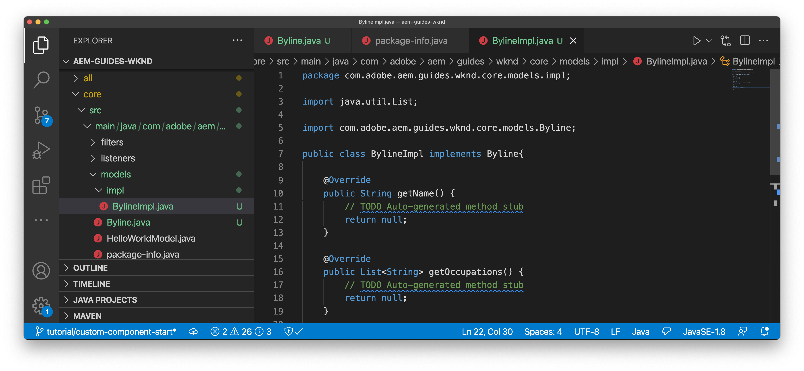

# Componente personalizado {#custom-component}

Este tutorial trata la creación de extremo a extremo de un componente de línea de AEM personalizado que muestra contenido creado en un cuadro de diálogo y explora el desarrollo de un modelo de Sling para encapsular la lógica empresarial que rellena el HTL del componente.

## Requisitos previos {#prerequisites}

Revise las herramientas e instrucciones necesarias para configurar un [entorno de desarrollo local](overview.md#local-dev-environment).

### Proyecto de inicio

>[!NOTE]
>
> Si ha completado correctamente el capítulo anterior, puede volver a utilizar el proyecto y omitir los pasos para extraer el proyecto de inicio.

Consulte el código de línea base sobre el que se basa el tutorial:

1. Consulte la `tutorial/custom-component-start` ramificación desde [GitHub](https://github.com/adobe/aem-guides-wknd)

   ```shell
   $ cd aem-guides-wknd
   $ git checkout tutorial/custom-component-start
   ```

1. Implemente código base en una instancia de AEM local con sus habilidades con Maven:

   ```shell
   $ mvn clean install -PautoInstallSinglePackage
   ```

   >[!NOTE]
   >
   > Si utiliza AEM 6.5 o 6.4, añada la variable `classic` perfil a cualquier comando Maven.

   ```shell
   $ mvn clean install -PautoInstallSinglePackage -Pclassic
   ```

Siempre puede ver el código terminado en [GitHub](https://github.com/adobe/aem-guides-wknd/tree/tutorial/custom-component-solution) o desproteja el código localmente cambiando a la rama `tutorial/custom-component-solution`.

## Objetivo

1. Obtenga información sobre cómo crear un componente de AEM personalizado
1. Aprenda a encapsular la lógica empresarial con modelos Sling
1. Cómo usar un modelo Sling desde un script HTL

## Qué va a generar {#byline-component}

En esta parte del tutorial de WKND, se crea un componente de firma que se utilizará para mostrar información creada sobre el colaborador de un artículo.


*Componente de firma*

La implementación del componente Byline incluye un cuadro de diálogo que recopila el contenido de firma y un modelo de Sling personalizado que recupera el del subtítulo:

* Nombre
* Imagen
* Ocupaciones

## Crear componente de firma {#create-byline-component}

En primer lugar, cree la estructura del nodo Componente de línea de bytes y defina un cuadro de diálogo. Esto representa el componente en AEM y define implícitamente el tipo de recurso del componente por su ubicación en el JCR.

El cuadro de diálogo muestra la interfaz que pueden proporcionar los autores de contenido. Para esta implementación, el componente principal de WCM de AEM **Imagen** se aprovechará para gestionar la creación y renderización de la imagen de Byline, de modo que se establecerá como el de nuestro componente `sling:resourceSuperType`.

### Crear definición de componente {#create-component-definition}

1. En el **ui.apps** , vaya a `/apps/wknd/components` y cree una nueva carpeta con el nombre `byline`.
1. Debajo de la variable `byline` añada una carpeta nueva denominada `.content.xml`

   

1. Rellene el `.content.xml` con lo siguiente:

   ```xml
   <?xml version="1.0" encoding="UTF-8"?>
       <jcr:root xmlns:sling="http://sling.apache.org/jcr/sling/1.0" xmlns:cq="http://www.day.com/jcr/cq/1.0" xmlns:jcr="http://www.jcp.org/jcr/1.0"
       jcr:primaryType="cq:Component"
       jcr:title="Byline"
       jcr:description="Displays a contributor's byline."
       componentGroup="WKND Sites Project - Content"
       sling:resourceSuperType="core/wcm/components/image/v2/image"/>
   ```

   El archivo XML anterior proporciona la definición del componente, incluido el título, la descripción y el grupo. La variable `sling:resourceSuperType` señala a `core/wcm/components/image/v2/image`, que es el [Componente de imagen principal](https://experienceleague.adobe.com/docs/experience-manager-core-components/using/components/image.html?lang=es).

### Creación del script HTL {#create-the-htl-script}

1. Debajo de la variable `byline` carpeta, agregar un nuevo archivo `byline.html`, que es responsable de la presentación del HTML del componente. Es importante nombrar el archivo como la carpeta, ya que se convierte en el script predeterminado que Sling utilizará para procesar este tipo de recurso.

1. Agregue el código siguiente al `byline.html`.

   ```html
   <!--/* byline.html */-->
   <div data-sly-use.placeholderTemplate="core/wcm/components/commons/v1/templates.html">
   </div>
   <sly data-sly-call="${placeholderTemplate.placeholder @ isEmpty=true}"></sly>
   ```

`byline.html` es [revisado más tarde](#byline-htl), una vez creado el modelo de Sling. El estado actual del archivo HTL permite que el componente se muestre en estado vacío en el Editor de páginas de AEM Sites cuando se arrastra y suelta en la página.

### Crear la definición del cuadro de diálogo {#create-the-dialog-definition}

A continuación, defina un cuadro de diálogo para el componente Byline con los campos siguientes:

* **Nombre**: campo de texto que indica el nombre del colaborador.
* **Imagen**: una referencia a la bioimagen del colaborador.
* **Ocupaciones**: una lista de ocupaciones atribuidas al colaborador. Las ocupaciones deben ordenarse alfabéticamente en orden ascendente (a a z).

1. Debajo de la variable `byline` carpeta, cree una nueva carpeta con el nombre `_cq_dialog`.
1. Bajo `byline/_cq_dialog` agregar un nuevo archivo con el nombre `.content.xml`. Esta es la definición XML del cuadro de diálogo. Añada el siguiente XML:

   ```xml
   <?xml version="1.0" encoding="UTF-8"?>
   <jcr:root xmlns:sling="http://sling.apache.org/jcr/sling/1.0" xmlns:cq="http://www.day.com/jcr/cq/1.0" xmlns:jcr="http://www.jcp.org/jcr/1.0" xmlns:nt="http://www.jcp.org/jcr/nt/1.0"
           jcr:primaryType="nt:unstructured"
           jcr:title="Byline"
           sling:resourceType="cq/gui/components/authoring/dialog">
       <content
               jcr:primaryType="nt:unstructured"
               sling:resourceType="granite/ui/components/coral/foundation/container">
           <items jcr:primaryType="nt:unstructured">
               <tabs
                       jcr:primaryType="nt:unstructured"
                       sling:resourceType="granite/ui/components/coral/foundation/tabs"
                       maximized="{Boolean}false">
                   <items jcr:primaryType="nt:unstructured">
                       <asset
                               jcr:primaryType="nt:unstructured"
                               sling:hideResource="{Boolean}false"/>
                       <metadata
                               jcr:primaryType="nt:unstructured"
                               sling:hideResource="{Boolean}true"/>
                       <properties
                               jcr:primaryType="nt:unstructured"
                               jcr:title="Properties"
                               sling:resourceType="granite/ui/components/coral/foundation/container"
                               margin="{Boolean}true">
                           <items jcr:primaryType="nt:unstructured">
                               <columns
                                       jcr:primaryType="nt:unstructured"
                                       sling:resourceType="granite/ui/components/coral/foundation/fixedcolumns"
                                       margin="{Boolean}true">
                                   <items jcr:primaryType="nt:unstructured">
                                       <column
                                               jcr:primaryType="nt:unstructured"
                                               sling:resourceType="granite/ui/components/coral/foundation/container">
                                           <items jcr:primaryType="nt:unstructured">
                                               <name
                                                       jcr:primaryType="nt:unstructured"
                                                       sling:resourceType="granite/ui/components/coral/foundation/form/textfield"
                                                       emptyText="Enter the contributor's name to display."
                                                       fieldDescription="The contributor's name to display."
                                                       fieldLabel="Name"
                                                       name="./name"
                                                       required="{Boolean}true"/>
                                               <occupations
                                                       jcr:primaryType="nt:unstructured"
                                                       sling:resourceType="granite/ui/components/coral/foundation/form/multifield"
                                                       fieldDescription="A list of the contributor's occupations."
                                                       fieldLabel="Occupations"
                                                       required="{Boolean}false">
                                                   <field
                                                           jcr:primaryType="nt:unstructured"
                                                           sling:resourceType="granite/ui/components/coral/foundation/form/textfield"
                                                           emptyText="Enter an occupation"
                                                           name="./occupations"/>
                                               </occupations>
                                           </items>
                                       </column>
                                   </items>
                               </columns>
                           </items>
                       </properties>
                   </items>
               </tabs>
           </items>
       </content>
   </jcr:root>
   ```

   Estas definiciones de nodo de diálogo utilizan la variable [Fusión de recursos de Sling](https://sling.apache.org/documentation/bundles/resource-merger.html) para controlar qué pestañas de diálogo se heredan de la variable `sling:resourceSuperType` en este caso, la función **Componente de imagen de los componentes principales**.

   

### Crear el cuadro de diálogo Política {#create-the-policy-dialog}

Siguiendo el mismo enfoque que con la creación del cuadro de diálogo, cree un cuadro de diálogo de directiva (anteriormente conocido como cuadro de diálogo de diseño) para ocultar los campos no deseados en la configuración de directiva heredada del componente de imagen de los componentes principales.

1. Debajo de la variable `byline` carpeta, cree una nueva carpeta con el nombre `_cq_design_dialog`.
1. Bajo `byline/_cq_design_dialog` crear un nuevo archivo con el nombre `.content.xml`. Actualice el archivo con lo siguiente: con el siguiente XML. Es más fácil abrir el `.content.xml` y copie/pegue el XML siguiente en él.

   ```xml
   <?xml version="1.0" encoding="UTF-8"?>
   <jcr:root xmlns:sling="http://sling.apache.org/jcr/sling/1.0" xmlns:granite="http://www.adobe.com/jcr/granite/1.0" xmlns:cq="http://www.day.com/jcr/cq/1.0" xmlns:jcr="http://www.jcp.org/jcr/1.0" xmlns:nt="http://www.jcp.org/jcr/nt/1.0"
       jcr:primaryType="nt:unstructured"
       jcr:title="Byline"
       sling:resourceType="cq/gui/components/authoring/dialog">
       <content
               jcr:primaryType="nt:unstructured">
           <items jcr:primaryType="nt:unstructured">
               <tabs
                       jcr:primaryType="nt:unstructured">
                   <items jcr:primaryType="nt:unstructured">
                       <properties
                               jcr:primaryType="nt:unstructured">
                           <items jcr:primaryType="nt:unstructured">
                               <content
                                       jcr:primaryType="nt:unstructured">
                                   <items jcr:primaryType="nt:unstructured">
                                       <decorative
                                               jcr:primaryType="nt:unstructured"
                                               sling:hideResource="{Boolean}true"/>
                                       <altValueFromDAM
                                               jcr:primaryType="nt:unstructured"
                                               sling:hideResource="{Boolean}true"/>
                                       <titleValueFromDAM
                                               jcr:primaryType="nt:unstructured"
                                               sling:hideResource="{Boolean}true"/>
                                       <displayCaptionPopup
                                               jcr:primaryType="nt:unstructured"
                                               sling:hideResource="{Boolean}true"/>
                                       <disableUuidTracking
                                               jcr:primaryType="nt:unstructured"
                                               sling:hideResource="{Boolean}true"/>
                                   </items>
                               </content>
                           </items>
                       </properties>
                       <features
                               jcr:primaryType="nt:unstructured">
                           <items jcr:primaryType="nt:unstructured">
                               <content
                                       jcr:primaryType="nt:unstructured">
                                   <items jcr:primaryType="nt:unstructured">
                                       <accordion
                                               jcr:primaryType="nt:unstructured">
                                           <items jcr:primaryType="nt:unstructured">
                                               <orientation
                                                       jcr:primaryType="nt:unstructured"
                                                       sling:hideResource="{Boolean}true"/>
                                               <crop
                                                       jcr:primaryType="nt:unstructured"
                                                       sling:hideResource="{Boolean}true"/>
                                           </items>
                                       </accordion>
                                   </items>
                               </content>
                           </items>
                       </features>
                   </items>
               </tabs>
           </items>
       </content>
   </jcr:root>
   ```

   La base de lo anterior **Cuadro de diálogo Política** El XML se obtuvo de la variable [Componente principal de la imagen](https://github.com/adobe/aem-core-wcm-components/blob/master/content/src/content/jcr_root/apps/core/wcm/components/image/v2/image/_cq_design_dialog/.content.xml).

   Como en la configuración del cuadro de diálogo, [Fusión de recursos de Sling](https://sling.apache.org/documentation/bundles/resource-merger.html) se utiliza para ocultar los campos irrelevantes que se heredan del `sling:resourceSuperType`, tal como lo ven las definiciones de nodos con `sling:hideResource="{Boolean}true"` propiedad.

### Implementación del código {#deploy-the-code}

1. Sincronice los cambios en `ui.apps` con su IDE o con sus habilidades con Maven.

   

## Añadir el componente a una página {#add-the-component-to-a-page}

Para que las cosas sean simples y estén centradas en AEM desarrollo de componentes, agregaremos el componente Byline en su estado actual a una página de artículos para verificar el `cq:Component` la definición del nodo está implementada y es correcta, AEM reconoce la nueva definición del componente y el cuadro de diálogo del componente funciona para la creación.

### Añadir una imagen a AEM Assets

En primer lugar, cargue una toma de encabezado de muestra en AEM Assets para usarla para rellenar la imagen en el componente Byline.

1. Vaya a la carpeta de parques de patinaje LA en AEM Assets: [http://localhost:4502/assets.html/content/dam/wknd/en/magazine/la-skateparks](http://localhost:4502/assets.html/content/dam/wknd/en/magazine/la-skateparks).

1. Suba la foto de la cabeza para  **[stacey-roswells.jpg](assets/custom-component/stacey-roswells.jpg)** a la carpeta .

   

### Creación del componente {#author-the-component}

A continuación, añada el componente Byline a una página de AEM. Debido a que hemos agregado el componente Byline al **Proyecto WKND Sites: contenido** Grupo de componentes, a través de `ui.apps/src/main/content/jcr_root/apps/wknd/components/byline/.content.xml` definición, está disponible automáticamente para cualquier **Contenedor** whose **Política** permite que la variable **Proyecto WKND Sites: contenido** grupo de componentes, que es el contenedor de diseño de la página de artículo.

1. Vaya al artículo de LA Skatepark en: [http://localhost:4502/editor.html/content/wknd/us/en/magazine/guide-la-skateparks.html](http://localhost:4502/editor.html/content/wknd/us/en/magazine/guide-la-skateparks.html)

1. Desde la barra lateral izquierda, arrastre y suelte una **Componente de firma** en **bottom** del contenedor de diseño de la página de artículos abierta.

   

1. Asegúrese de que la variable **la barra lateral izquierda está abierta** y visible, y **Buscador de recursos** está seleccionado.

1. Seleccione el **Marcador de posición de componente de firma**, que a su vez muestra la barra de acciones y toca el botón **llave** para abrir el cuadro de diálogo.

1. Con el cuadro de diálogo abierto y la primera ficha (Activo) activa, abra la barra lateral izquierda y, desde el buscador de recursos, arrastre una imagen a la zona desplegable Imagen. Busque &quot;stacey&quot; para encontrar la imagen biográfica de Stacey Roswells proporcionada en el paquete WKND ui.content.

   

1. Después de agregar una imagen, haga clic en la **Propiedades** para especificar **Nombre** y **Ocupaciones**.

   Al introducir ocupaciones, indíquelas en **alfabético inverso** orden, por lo que la lógica empresarial de alfabetización que implementaremos en el Modelo Sling es fácilmente aparente.

   Toque . **Listo** en la parte inferior derecha para guardar los cambios.

   

   AEM autores configuran y crean componentes a través de los cuadros de diálogo. En este punto del desarrollo del componente Byline, los cuadros de diálogo se incluyen para recopilar los datos, aunque aún no se ha añadido la lógica para procesar el contenido creado. Por lo tanto, solo aparece el marcador de posición.

1. Después de guardar el cuadro de diálogo, vaya a [CRXDE Lite](http://localhost:4502/crx/de/index.jsp#/content/wknd/us/en/magazine/guide-la-skateparks/jcr%3Acontent/root/container/container/byline) y revise cómo se almacena el contenido del componente en el nodo de contenido del componente de firma en la página AEM.

   Busque el nodo de contenido del componente Byline debajo de la página Parques de máscara LA, es decir, `/content/wknd/us/en/magazine/guide-la-skateparks/jcr:content/root/container/container/byline`.

   Observe los nombres de propiedad `name`, `occupations`y `fileReference` se almacenan en la variable **nodo byline**.

   Fíjese también en el `sling:resourceType` del nodo se establece en `wknd/components/content/byline` que es lo que enlaza este nodo de contenido a la implementación del componente Byline.

   

## Crear modelo Sling de firma {#create-sling-model}

A continuación, crearemos un modelo de Sling para que actúe como modelo de datos y albergue la lógica empresarial para el componente Byline.

Los modelos Sling son objetos Java Java &quot;POJO&quot; (objetos Java antiguos comunes) impulsados por anotaciones que facilitan la asignación de datos de JCR a variables Java y proporcionan otras variedades al desarrollar en el contexto de AEM.

### Revisar dependencias de Maven {#maven-dependency}

El modelo Byline Sling se basará en varias API de Java proporcionadas por AEM. Estas API están disponibles a través del `dependencies` en la `core` archivo POM del módulo. El proyecto utilizado para este tutorial se ha creado para AEM as a Cloud Service. Sin embargo, es único, ya que es compatible con versiones anteriores de AEM 6.5/6.4. Por lo tanto, se incluyen las dos dependencias para Cloud Service y AEM 6.x.

1. Abra el `pom.xml` debajo de `<src>/aem-guides-wknd/core/pom.xml`.
1. Busque la dependencia para `aem-sdk-api` - **Solo as a Cloud Service AEM**

   ```xml
   <dependency>
       <groupId>com.adobe.aem</groupId>
       <artifactId>aem-sdk-api</artifactId>
   </dependency>
   ```

   La variable [aem-sdk-api](https://experienceleague.adobe.com/docs/experience-manager-cloud-service/implementing/developing/aem-as-a-cloud-service-sdk.html?lang=en#building-for-the-sdk) contiene todas las API de Java públicas expuestas por AEM. La variable `aem-sdk-api` se utiliza de forma predeterminada al crear este proyecto. La versión se mantiene en el reactor principal pom ubicado en la raíz del proyecto en `aem-guides-wknd/pom.xml`.

1. Busque la dependencia para la variable `uber-jar` - **Solo AEM 6.5/6.4**

   ```xml
   ...
       <dependency>
           <groupId>com.adobe.aem</groupId>
           <artifactId>uber-jar</artifactId>
           <classifier>apis</classifier>
       </dependency>
   ...
   ```

   La variable `uber-jar` solo se incluye cuando la variable `classic` se invoca a `mvn clean install -PautoInstallSinglePackage -Pclassic`. De nuevo, esto es exclusivo de este proyecto. En un proyecto en el mundo real, generado a partir del tipo de archivo del proyecto AEM, escriba el `uber-jar` será el valor predeterminado si la versión de AEM especificada es 6.5 o 6.4.

   La variable [uber-jar](https://experienceleague.adobe.com/docs/experience-manager-65/developing/devtools/ht-projects-maven.html#experience-manager-api-dependencies) contiene todas las API de Java públicas expuestas por AEM 6.x. La versión se mantiene en el reactor principal pom, ubicado en la raíz del proyecto `aem-guides-wknd/pom.xml`.

1. Busque la dependencia para `core.wcm.components.core`:

   ```xml
    <!-- Core Component Dependency -->
       <dependency>
           <groupId>com.adobe.cq</groupId>
           <artifactId>core.wcm.components.core</artifactId>
       </dependency>
   ```

   Estas son todas las API de Java públicas expuestas por AEM componentes principales. AEM componentes principales es un proyecto que se mantiene fuera de AEM y, por lo tanto, tiene un ciclo de versión independiente. Por este motivo, es una dependencia que debe incluirse por separado y es **not** incluido con la variable `uber-jar` o `aem-sdk-api`.

   Al igual que uber-jar, la versión para esta dependencia se mantiene en el archivo pom del reactor primario ubicado en `aem-guides-wknd/pom.xml`.

   Más adelante en este tutorial, utilizaremos la clase de imagen del componente principal para mostrar la imagen en el componente de línea. Es necesario tener la dependencia del componente principal para construir y compilar nuestro modelo Sling.

### Interfaz de firma {#byline-interface}

Cree una interfaz pública de Java para el Byline. `Byline.java` define los métodos públicos necesarios para dirigir la variable `byline.html` Secuencia de comandos HTL.

1. Dentro de `aem-guides-wknd.core` módulo debajo `core/src/main/java/com/adobe/aem/guides/wknd/core/models` crear un nuevo archivo con el nombre `Byline.java`

   

1. Actualizar `Byline.java` con los siguientes métodos:

   ```java
   package com.adobe.aem.guides.wknd.core.models;
   
   import java.util.List;
   
   /**
   * Represents the Byline AEM Component for the WKND Site project.
   **/
   public interface Byline {
       /***
       * @return a string to display as the name.
       */
       String getName();
   
       /***
       * Occupations are to be sorted alphabetically in a descending order.
       *
       * @return a list of occupations.
       */
       List<String> getOccupations();
   
       /***
       * @return a boolean if the component has enough content to display.
       */
       boolean isEmpty();
   }
   ```

   Los dos primeros métodos exponen los valores de la variable **name** y **ocupaciones** para el componente Byline.

   La variable `isEmpty()` se utiliza para determinar si el componente tiene contenido que procesar o si está a la espera de ser configurado.

   Observe que no hay ningún método para la imagen; [echaremos un vistazo a por qué es más tarde](#tackling-the-image-problem).

1. Los paquetes Java que contienen clases públicas de Java, en este caso un modelo de Sling, deben recibir versiones utilizando el  `package-info.java` archivo.

   Desde el paquete Java de la fuente WKND `com.adobe.aem.guides.wknd.core.models` las declaraciones son versiones de `1.0.0`, y agregamos una interfaz y métodos públicos de no separación, la versión debe aumentarse a `1.1.0`. Abra el archivo en `core/src/main/java/com/adobe/aem/guides/wknd/core/models/package-info.java` y actualizar `@Version("1.0.0")` a `@Version("1.1.0")`.

       &quot;
       @Version(&quot;2.1.0&quot;)
       paquete com.adobe.aem.guides.wknd.core.models;
       
       importar org.osgi.anottation.versioning.Version;
       &quot;
   
Siempre que se realicen cambios en los archivos de este paquete, la variable [la versión del paquete debe ajustarse semánticamente](https://semver.org/). Si no, el proyecto Maven [bnd-baseline-maven-plugin](https://github.com/bndtools/bnd/tree/master/maven/bnd-baseline-maven-plugin) detectará una versión de paquete no válida y romperá el compilado. Por suerte, en caso de error, el complemento Maven informa de la versión no válida del paquete Java así como de la versión que debería ser. Actualice el `@Version("...")` declaración en el paquete Java que viola `package-info.java` a la versión recomendada por el complemento para corregir.

### Implementación de firma {#byline-implementation}

`BylineImpl.java` es la implementación del modelo de Sling que implementa el `Byline.java` interfaz definida anteriormente. El código completo de `BylineImpl.java` se encuentra en la parte inferior de esta sección.

1. Cree una nueva carpeta con el nombre `impl` below `core/src/main/java/com/adobe/aem/guides/core/models`.
1. En el `impl` carpeta crear un nuevo archivo `BylineImpl.java`.

   

1. Abra `BylineImpl.java`. Especifique que implementa el `Byline` interfaz. Utilice las funciones de autocompletar del IDE o actualice manualmente el archivo para incluir los métodos necesarios para implementar el `Byline` interfaz:

   ```java
   package com.adobe.aem.guides.wknd.core.models.impl;
   import java.util.List;
   import com.adobe.aem.guides.wknd.core.models.Byline;
   
   public class BylineImpl implements Byline {
   
       @Override
       public String getName() {
           // TODO Auto-generated method stub
           return null;
       }
   
       @Override
       public List<String> getOccupations() {
           // TODO Auto-generated method stub
           return null;
       }
   
       @Override
       public boolean isEmpty() {
           // TODO Auto-generated method stub
           return false;
       }
   }
   ```

1. Añadir anotaciones del modelo de Sling actualizando `BylineImpl.java` con las siguientes anotaciones de nivel de clase. Esta `@Model(..)`anotación es lo que convierte la clase en un modelo de Sling.

   ```java
   import org.apache.sling.api.SlingHttpServletRequest;
   import org.apache.sling.models.annotations.Model;
   import org.apache.sling.models.annotations.DefaultInjectionStrategy;
   ...
   @Model(
           adaptables = {SlingHttpServletRequest.class},
           adapters = {Byline.class},
           resourceType = {BylineImpl.RESOURCE_TYPE},
           defaultInjectionStrategy = DefaultInjectionStrategy.OPTIONAL
   )
   public class BylineImpl implements Byline {
       protected static final String RESOURCE_TYPE = "wknd/components/byline";
       ...
   }
   ```

   Vamos a revisar esta anotación y sus parámetros:

   * La variable `@Model` la anotación registra BylineImpl como modelo de Sling cuando se implementa en AEM.
   * La variable `adaptables` especifica que la solicitud puede adaptar este modelo.
   * La variable `adapters` permite registrar la clase de implementación en la interfaz de Byline. Esto permite que la secuencia de comandos HTL llame al modelo de Sling a través de la interfaz (en lugar del impl directamente). [Puede encontrar más información sobre los adaptadores aquí](https://sling.apache.org/documentation/bundles/models.html#specifying-an-alternate-adapter-class-since-110).
   * La variable `resourceType` apunta al tipo de recurso de componente Byline (creado anteriormente) y ayuda a resolver el modelo correcto si hay varias implementaciones. [Aquí puede encontrar más información sobre cómo asociar una clase de modelo con un tipo de recurso](https://sling.apache.org/documentation/bundles/models.html#associating-a-model-class-with-a-resource-type-since-130).

### Implementación de los métodos del modelo Sling {#implementing-the-sling-model-methods}

#### getName() {#implementing-get-name}

El primer método que abordaremos es `getName()` que simplemente devuelve el valor almacenado en el nodo de contenido JCR de la línea debajo de la propiedad `name`.

Para esto, la variable `@ValueMapValue` La anotación del modelo de Sling se utiliza para insertar el valor en un campo Java mediante el ValueMap del recurso de la solicitud.


```java
import org.apache.sling.models.annotations.injectorspecific.ValueMapValue;

public class BylineImpl implements Byline {
    ...
    @ValueMapValue
    private String name;

    ...
    @Override
    public String getName() {
        return name;
    }
    ...
}
```

Como la propiedad JCR comparte el mismo nombre que el campo Java (ambos son &quot;nombre&quot;), `@ValueMapValue` resuelve automáticamente esta asociación e inyecta el valor de la propiedad en el campo Java .

#### getOccupations() {#implementing-get-occupations}

El siguiente método para implementar es `getOccupations()`. Este método recopila todas las ocupaciones almacenadas en la propiedad JCR `occupations` y devuelven una colección ordenada (alfabéticamente) de ellas.

Uso de la misma técnica explorada en `getName()` el valor de la propiedad se puede insertar en el campo del modelo de Sling.

Una vez que los valores de las propiedades JCR están disponibles en el modelo Sling a través del campo Java insertado `occupations`, la lógica empresarial de clasificación se puede aplicar en la variable `getOccupations()` método.


```java
import java.util.ArrayList;
import java.util.Collections;
  ...

public class BylineImpl implements Byline {
    ...
    @ValueMapValue
    private List<String> occupations;
    ...
    @Override
    public List<String> getOccupations() {
        if (occupations != null) {
            Collections.sort(occupations);
            return new ArrayList<String>(occupations);
        } else {
            return Collections.emptyList();
        }
    }
    ...
}
  ...
```


#### isEmpty() {#implementing-is-empty}

El último método público es `isEmpty()` que determina cuándo el componente debe considerarse &quot;suficientemente creado&quot; para procesarse.

Para este componente, tenemos requisitos empresariales que indican que los tres campos, nombre, imagen y ocupaciones deben rellenarse *before* se puede procesar el componente.


```java
import org.apache.commons.lang3.StringUtils;
  ...
public class BylineImpl implements Byline {
    ...
    @Override
    public boolean isEmpty() {
        if (StringUtils.isBlank(name)) {
            // Name is missing, but required
            return true;
        } else if (occupations == null || occupations.isEmpty()) {
            // At least one occupation is required
            return true;
        } else if (/* image is not null, logic to be determined */) {
            // A valid image is required
            return true;
        } else {
            // Everything is populated, so this component is not considered empty
            return false;
        }
    }
    ...
}
```


#### Abordar el &quot;problema de la imagen&quot; {#tackling-the-image-problem}

La comprobación de las condiciones de nombre y ocupación son triviales (y Apache Commons Lang3 proporciona lo siempre práctico) [StringUtils](https://commons.apache.org/proper/commons-lang/apidocs/org/apache/commons/lang3/StringUtils.html) (clase), sin embargo, no está claro cómo es que la variable **presencia de la imagen** se puede validar ya que el componente Imagen de componentes principales se utiliza para mostrar la imagen.

Hay dos maneras de enfrentarlo:

Compruebe si la variable `fileReference` La propiedad JCR se resuelve en un recurso. *O* Convierta este recurso en un modelo Sling de imagen de componente principal y asegúrese de que `getSrc()` El método no está vacío.

Optaremos por el **segundo** enfoque. Es probable que el primer enfoque sea suficiente, pero en este tutorial el último se utilizará para permitirnos explorar otras características de los modelos Sling.

1. Cree un método privado que obtenga la imagen. Este método se deja en privado porque no necesitamos exponer el objeto de imagen en el propio HTL y su único uso para conducir `isEmpty().`

   Añada el siguiente método privado para `getImage()`:

   ```java
   import com.adobe.cq.wcm.core.components.models.Image;
   ...
   private Image getImage() {
       Image image = null;
       // Figure out how to populate the image variable!
       return image;
   }
   ```

   Como se ha señalado anteriormente, hay dos enfoques más para obtener la variable **Modelo Sling de imagen**:

   El primero usa la variable `@Self` anotación, para adaptar automáticamente la solicitud actual al componente principal `Image.class`

   El segundo usa la variable [Fábrica de modelos Apache Sling](https://sling.apache.org/apidocs/sling10/org/apache/sling/models/factory/ModelFactory.html) El servicio OSGi, que es un servicio muy útil, nos ayuda a crear modelos Sling de otros tipos en código Java.

   Optaremos por el segundo enfoque.

   >[!NOTE]
   >
   >En una implementación del mundo real, enfoque &quot;Uno&quot;, utilizando `@Self` es preferible ya que es la solución más sencilla y elegante. En este tutorial utilizaremos el segundo enfoque, ya que nos requiere explorar más facetas de modelos Sling que son extremadamente útiles son componentes más complejos!

   Dado que los modelos Sling son de Java POJO, y no OSGi Services, las anotaciones de inyección de OSGi habituales `@Reference` **cannot** se utilizará, en lugar de, los modelos Sling proporcionan un **[@OSGiService](https://sling.apache.org/documentation/bundles/models.html#injector-specific-annotations)** anotación que proporciona una funcionalidad similar.

1. Actualizar `BylineImpl.java` para incluir el `OSGiService` anotación para inyectar la variable `ModelFactory`:

   ```java
   import org.apache.sling.models.factory.ModelFactory;
   import org.apache.sling.models.annotations.injectorspecific.OSGiService;
   ...
   public class BylineImpl implements Byline {
       ...
       @OSGiService
       private ModelFactory modelFactory;
   }
   ```

   Con la variable `ModelFactory` está disponible y se puede crear un modelo de Sling de imagen de componente principal utilizando:

   ```java
   modelFactory.getModelFromWrappedRequest(SlingHttpServletRequest request, Resource resource, java.lang.Class<T> targetClass)
   ```

   Sin embargo, este método requiere una solicitud y un recurso, pero aún no están disponibles en el modelo Sling. Para obtener estas, se utilizan más anotaciones del modelo Sling.

   Para obtener la solicitud actual, use **[@Self](https://sling.apache.org/documentation/bundles/models.html#injector-specific-annotations)** la anotación se puede utilizar para inyectar la variable `adaptable` (que se define en la variable `@Model(..)` como `SlingHttpServletRequest.class`, en un campo de clase Java.

1. Agregue la variable **@Self** anotación para obtener la variable **Solicitud SlingHttpServletRequest**:

   ```java
   import org.apache.sling.models.annotations.injectorspecific.Self;
   ...
   @Self
   private SlingHttpServletRequest request;
   ```

   Recuerde, usar `@Self Image image` La inyección del modelo de Sling de imagen del componente principal era una opción anterior: `@Self` la anotación intenta insertar el objeto adaptable (en nuestro caso, un SlingHttpServletRequest) y adaptarse al tipo de campo de anotación. Dado que el modelo Sling de imagen de componente principal se puede adaptar desde los objetos SlingHttpServletRequest , esto habría funcionado y es menos código que nuestro enfoque más exploratorio.

   Ahora hemos insertado las variables necesarias para crear una instancia de nuestro modelo de imagen a través de la API ModelFactory. Usaremos el Modelo Sling **[@PostConstruct](https://sling.apache.org/documentation/bundles/models.html#postconstruct-methods)** anotación para obtener este objeto después de crear instancias del modelo de Sling.

   `@PostConstruct` es increíblemente útil y actúa con una capacidad similar a la de un constructor; sin embargo, se invoca después de crear una instancia de la clase y de insertar todos los campos Java anotados. Mientras que otras anotaciones del modelo de Sling anotan campos de clase Java (variables), `@PostConstruct` anota un método de parámetro void, zero, que normalmente se denomina `init()` (pero se puede ponerle cualquier nombre).

1. Agregar **@PostConstruct** método:

   ```java
   import javax.annotation.PostConstruct;
   ...
   public class BylineImpl implements Byline {
       ...
       private Image image;
   
       @PostConstruct
       private void init() {
           image = modelFactory.getModelFromWrappedRequest(request,
                                                           request.getResource(),
                                                           Image.class);
       }
       ...
   }
   ```

   Recuerde que los modelos Sling son **NOT** OSGi Services, por lo que es seguro mantener el estado de la clase. A menudo `@PostConstruct` deriva y configura el estado de la clase del Modelo Sling para su uso posterior, similar a lo que hace un constructor sin formato.

   Tenga en cuenta que si la variable `@PostConstruct` lanza una excepción, el modelo de Sling no creará una instancia (será nulo).

1. **getImage()** ahora se puede actualizar para devolver simplemente el objeto de imagen.

   ```java
   /**
       * @return the Image Sling Model of this resource, or null if the resource cannot create a valid Image Sling Model.
   */
   private Image getImage() {
       return image;
   }
   ```

1. Volvamos a `isEmpty()` y finalizar la implementación:

   ```java
   @Override
   public boolean isEmpty() {
      final Image componentImage = getImage();
   
       if (StringUtils.isBlank(name)) {
           // Name is missing, but required
           return true;
       } else if (occupations == null || occupations.isEmpty()) {
           // At least one occupation is required
           return true;
       } else if (componentImage == null || StringUtils.isBlank(componentImage.getSrc())) {
           // A valid image is required
           return true;
       } else {
           // Everything is populated, so this component is not considered empty
           return false;
       }
   }
   ```

   Tenga en cuenta varias llamadas a `getImage()` no es problemático ya que devuelve el valor `image` variable de clase y no invoca `modelFactory.getModelFromWrappedRequest(...)` que no es demasiado costoso, pero vale la pena evitar llamar innecesariamente.

1. El final `BylineImpl.java` debería tener el siguiente aspecto:


   ```java
   package com.adobe.aem.guides.wknd.core.models.impl;
   
   import java.util.ArrayList;
   import java.util.Collections;
   import java.util.List;
   import javax.annotation.PostConstruct;
   import org.apache.commons.lang3.StringUtils;
   import org.apache.sling.api.SlingHttpServletRequest;
   import org.apache.sling.models.annotations.DefaultInjectionStrategy;
   import org.apache.sling.models.annotations.Model;
   import org.apache.sling.models.annotations.injectorspecific.OSGiService;
   import org.apache.sling.models.annotations.injectorspecific.Self;
   import org.apache.sling.models.annotations.injectorspecific.ValueMapValue;
   import org.apache.sling.models.factory.ModelFactory;
   import com.adobe.aem.guides.wknd.core.models.Byline;
   import com.adobe.cq.wcm.core.components.models.Image;
   
   @Model(
           adaptables = {SlingHttpServletRequest.class},
           adapters = {Byline.class},
           resourceType = {BylineImpl.RESOURCE_TYPE},
           defaultInjectionStrategy = DefaultInjectionStrategy.OPTIONAL
   )
   public class BylineImpl implements Byline {
       protected static final String RESOURCE_TYPE = "wknd/components/byline";
   
       @Self
       private SlingHttpServletRequest request;
   
       @OSGiService
       private ModelFactory modelFactory;
   
       @ValueMapValue
       private String name;
   
       @ValueMapValue
       private List<String> occupations;
   
       private Image image;
   
       /**
       * @PostConstruct is immediately called after the class has been initialized
       * but BEFORE any of the other public methods. 
       * It is a good method to initialize variables that will be used by methods in the rest of the model
       *
       */
       @PostConstruct
       private void init() {
           // set the image object
           image = modelFactory.getModelFromWrappedRequest(request, request.getResource(), Image.class);
       }
   
       @Override
       public String getName() {
           return name;
       }
   
       @Override
       public List<String> getOccupations() {
           if (occupations != null) {
               Collections.sort(occupations);
               return new ArrayList<String>(occupations);
           } else {
               return Collections.emptyList();
           }
       }
   
       @Override
       public boolean isEmpty() {
           final Image componentImage = getImage();
   
           if (StringUtils.isBlank(name)) {
               // Name is missing, but required
               return true;
           } else if (occupations == null || occupations.isEmpty()) {
               // At least one occupation is required
               return true;
           } else if (componentImage == null || StringUtils.isBlank(componentImage.getSrc())) {
               // A valid image is required
               return true;
           } else {
               // Everything is populated, so this component is not considered empty
               return false;
           }
       }
   
       /**
       * @return the Image Sling Model of this resource, or null if the resource cannot create a valid Image Sling Model.
       */
       private Image getImage() {
           return image;
       }
   }
   ```


## HTL de firma {#byline-htl}

En el `ui.apps` módulo, abrir `/apps/wknd/components/byline/byline.html` hemos creado en la configuración anterior del componente AEM.

```html
<div data-sly-use.placeholderTemplate="core/wcm/components/commons/v1/templates.html">
</div>
<sly data-sly-call="${placeholderTemplate.placeholder @ isEmpty=false}"></sly>
```

Vamos a revisar lo que hace este script HTL hasta ahora:

* La variable `placeholderTemplate` apunta al marcador de posición de los componentes principales, que se muestra cuando el componente no está completamente configurado. Esto se muestra en el Editor de páginas de AEM Sites como un cuadro con el título del componente, tal como se define arriba en la sección `cq:Component`&#39;s  `jcr:title` propiedad.

* La variable `data-sly-call="${placeholderTemplate.placeholder @ isEmpty=false}` carga el `placeholderTemplate` definido anteriormente y pasa a un valor booleano (actualmente codificado como `false`) en la plantilla de marcador de posición. When `isEmpty` es verdadera, la plantilla de marcador de posición representa el cuadro gris, de lo contrario no muestra nada.

### Actualizar HTL de firma

1. Actualizar **byline.html** con la siguiente estructura de HTML esquelético:

   ```html
   <div data-sly-use.placeholderTemplate="core/wcm/components/commons/v1/templates.html"
       class="cmp-byline">
           <div class="cmp-byline__image">
               <!--/* Include the Core Components Image Component */-->
           </div>
           <h2 class="cmp-byline__name"><!--/* Include the name */--></h2>
           <p class="cmp-byline__occupations"><!--/* Include the occupations */--></p>
   </div>
   <sly data-sly-call="${placeholderTemplate.placeholder @ isEmpty=true}"></sly>
   ```

   Tenga en cuenta que las clases CSS siguen la [Convención de nomenclatura de BEM](https://getbem.com/naming/). Aunque el uso de convenciones BEM no es obligatorio, se recomienda utilizar BEM, ya que se utiliza en clases CSS de componentes principales y, por lo general, genera reglas CSS limpias y legibles.

### Creación de instancias de objetos del modelo Sling en HTL {#instantiating-sling-model-objects-in-htl}

La variable [Usar instrucción de bloque](https://github.com/adobe/htl-spec/blob/master/SPECIFICATION.md#221-use) se utiliza para crear instancias de los objetos del Modelo Sling en la secuencia de comandos HTL y asignarla a una variable HTL.

`data-sly-use.byline="com.adobe.aem.guides.wknd.models.Byline"` utiliza la interfaz de Byline (com.adobe.aem.guides.wknd.models.Byline) implementada por BylineImpl y adapta al SlingHttpServletRequest actual, y el resultado se almacena en un subline de nombre de variable HTL ( `data-sly-use.<variable-name>`).

1. Actualizar el exterior `div` para hacer referencia a **Byline** Modelo Sling por su interfaz pública:

   ```xml
   <div data-sly-use.byline="com.adobe.aem.guides.wknd.core.models.Byline"
       data-sly-use.placeholderTemplate="core/wcm/components/commons/v1/templates.html"
       class="cmp-byline">
       ...
   </div>
   ```

### Acceso a los métodos del modelo Sling {#accessing-sling-model-methods}

HTL toma prestado de JSTL y utiliza la misma abreviación de los nombres de los métodos de captador de Java.

Por ejemplo, invocar el modelo de Sling de firma `getName()` se puede abreviar como `byline.name`, de forma similar en lugar de `byline.isEmpty`, esto se puede abreviar como `byline.empty`. Uso de nombres de método completos, `byline.getName` o `byline.isEmpty`, también funciona. Tenga en cuenta que `()` nunca se utilizan para invocar métodos en HTL (similar a JSTL).

Métodos Java que requieren un parámetro **cannot** se utilizará en HTL. Esto es por diseño para mantener la lógica en HTL simple.

1. El nombre de línea se puede agregar al componente invocando la variable `getName()` en el Modelo de Sling de firma o en HTL: `${byline.name}`.

   Actualice el `h2` etiqueta:

   ```xml
   <h2 class="cmp-byline__name">${byline.name}</h2>
   ```

### Uso de opciones de expresión HTL {#using-htl-expression-options}

[Opciones de expresiones HTL](https://github.com/adobe/htl-spec/blob/master/SPECIFICATION.md#12-available-expression-options) actúa como modificador del contenido en HTL y abarca desde el formato de fecha a la traducción en i18n. Las expresiones también se pueden utilizar para unir listas o matrices de valores, que es lo que se necesita para mostrar las ocupaciones en un formato delimitado por comas.

Las expresiones se añaden mediante la variable `@` en la expresión HTL.

1. Para unirse a la lista de ocupaciones con &quot;, &quot;, se utiliza el siguiente código:

   ```html
   <p class="cmp-byline__occupations">${byline.occupations @ join=', '}</p>
   ```

### Visualización condicional del marcador de posición {#conditionally-displaying-the-placeholder}

La mayoría de los scripts HTL para componentes AEM utilizan la variable **paradigma de marcador de posición** para proporcionar una pista visual a los autores **indicar que un componente se ha creado incorrectamente y no se mostrará en AEM Publish**. La convención para dirigir esta decisión es implementar un método en el modelo Sling de respaldo del componente, en nuestro caso: `Byline.isEmpty()`.

`isEmpty()` se invoca en el modelo de Sling de firma y el resultado (o, mejor dicho, su negativo) a través del `!` operador) se guarda en una variable HTL denominada `hasContent`:

1. Actualizar el exterior `div` para guardar una variable HTL denominada `hasContent`:

   ```html
    <div data-sly-use.byline="com.adobe.aem.guides.wknd.core.models.Byline"
         data-sly-use.placeholderTemplate="core/wcm/components/commons/v1/templates.html"
         data-sly-test.hasContent="${!byline.empty}"
         class="cmp-byline">
         ...
   </div>
   ```

   Tenga en cuenta el uso de `data-sly-test`, HTL `test` El bloque es interesante en el sentido de que ambos establecen una variable HTL Y procesa/no representa el elemento HTML en el que está, basado en si el resultado de la expresión HTL es cierto o no. Si es &quot;true&quot;, el elemento HTML se procesa, de lo contrario no se renderiza.

   Esta variable HTL `hasContent` ahora se puede volver a utilizar para mostrar u ocultar el marcador de posición de forma condicional.

1. Actualizar la llamada condicional al `placeholderTemplate` en la parte inferior del archivo con lo siguiente:

   ```html
   <sly data-sly-call="${placeholderTemplate.placeholder @ isEmpty=!hasContent}"></sly>
   ```

### Mostrar la imagen mediante los componentes principales {#using-the-core-components-image}

El script HTL para `byline.html` está casi completo y solo falta la imagen.

Ya que usamos `sling:resourceSuperType` El componente Imagen de componentes principales para proporcionar la creación de la imagen, también se puede utilizar el componente Imagen de componente principal para representar la imagen.

Para ello, es necesario incluir el recurso de línea actual, pero forzar el tipo de recurso del componente Imagen de componentes principales utilizando el tipo de recurso `core/wcm/components/image/v2/image`. Este es un patrón potente para la reutilización de componentes. Para esto, HTL `data-sly-resource` se utiliza.

1. Sustituya el `div` con una clase de `cmp-byline__image` con lo siguiente:

   ```html
   <div class="cmp-byline__image"
       data-sly-resource="${ '.' @ resourceType = 'core/wcm/components/image/v2/image' }"></div>
   ```

   Esta `data-sly-resource`, incluido el recurso actual a través de la ruta relativa `'.'`y fuerza la inclusión del recurso actual (o del recurso de contenido de línea) con el tipo de recurso de `core/wcm/components/image/v2/image`.

   El tipo de recurso Componente principal se utiliza directamente y no a través de un proxy, ya que se trata de un uso en script y nunca persiste en nuestro contenido.

2. Completado `byline.html` abajo:

   ```html
   <!--/* byline.html */-->
   <div data-sly-use.byline="com.adobe.aem.guides.wknd.core.models.Byline" 
       data-sly-use.placeholderTemplate="core/wcm/components/commons/v1/templates.html"
       data-sly-test.hasContent="${!byline.empty}"
       class="cmp-byline">
       <div class="cmp-byline__image"
           data-sly-resource="${ '.' @ resourceType = 'core/wcm/components/image/v2/image' }">
       </div>
       <h2 class="cmp-byline__name">${byline.name}</h2>
       <p class="cmp-byline__occupations">${byline.occupations @ join=', '}</p>
   </div>
   <sly data-sly-call="${placeholderTemplate.placeholder @ isEmpty=!hasContent}"></sly>
   ```

3. Implemente el código base en una instancia de AEM local. Dado que se han realizado cambios en `core` y `ui.apps` es necesario implementar ambos módulos.

   ```shell
   $ cd aem-guides-wknd/ui.apps
   $ mvn clean install -PautoInstallPackage
   ```

   ```shell
   $ cd ../core
   $ mvn clean install -PautoInstallBundle
   ```

   Si se implementa en AEM 6.5/6.4, invoque la variable `classic` perfil:

   ```shell
   $ cd ../core
   $ mvn clean install -PautoInstallBundle -Pclassic
   ```

   >[!CAUTION]
   >
   > También puede crear todo el proyecto desde la raíz con el perfil de Maven `autoInstallSinglePackage` pero esto puede sobrescribir los cambios de contenido en la página. Esto se debe a que la variable `ui.content/src/main/content/META-INF/vault/filter.xml` se ha modificado para que el código de inicio del tutorial sobrescriba de forma limpia el contenido de AEM existente. En un escenario real esto no será un problema.

### Revisión del componente de línea sin estilo {#reviewing-the-unstyled-byline-component}

1. Después de implementar la actualización, vaya a la [Guía definitiva de los parques de patinaje de La ](http://localhost:4502/editor.html/content/wknd/us/en/magazine/guide-la-skateparks.html) o donde haya agregado el componente Byline anteriormente en el capítulo.

1. La variable **image**, **name** y **ocupaciones** ahora aparece y tenemos un componente Byline sin estilo pero en funcionamiento.

   

### Revisión del registro del modelo Sling {#reviewing-the-sling-model-registration}

La variable [Vista de estado de los modelos Sling de la consola web de AEM](http://localhost:4502/system/console/status-slingmodels) muestra todos los modelos Sling registrados en AEM. El modelo Byline Sling se puede validar como instalado y reconocido revisando esta lista.

Si la variable **BylineImpl** no se muestra en esta lista, probablemente haya un problema con las anotaciones del modelo de Sling o el modelo de Sling no se agregó al paquete de modelos Sling registrado (`com.adobe.aem.guides.wknd.core.models`) en el proyecto principal.


*http://localhost:4502/system/console/status-slingmodels*

## Estilos de firma {#byline-styles}

El componente Byline debe diseñarse para que se ajuste al diseño creativo del componente Byline. Esto se logrará mediante el uso de SCSS, que AEM ofrece compatibilidad con **ui.frontend** Subproyecto Maven.

### Agregar un estilo predeterminado

Añada estilos predeterminados para el componente Byline.

1. Vuelva al IDE y a la **ui.frontend** proyecto en `/src/main/webpack/components`:
1. Cree un nuevo archivo con el nombre `_byline.scss`.

   

1. Añada el CSS de implementaciones de firma (escrito como SCSS) en el `_byline.scss`:

   ```scss
   .cmp-byline {
       $imageSize: 60px;
   
       .cmp-byline__image {
           float: left;
   
       /* This class targets a Core Component Image CSS class */
       .cmp-image__image {
           width: $imageSize;
           height: $imageSize;
           border-radius: $imageSize / 2;
           object-fit: cover;
           }
       }
   
       .cmp-byline__name {
           font-size: $font-size-medium;
           font-family: $font-family-serif;
           padding-top: 0.5rem;
           margin-left: $imageSize + 25px;
           margin-bottom: .25rem;
           margin-top:0rem;
       }
   
       .cmp-byline__occupations {
           margin-left: $imageSize + 25px;
           color: $gray;
           font-size: $font-size-xsmall;
           text-transform: uppercase;
       }
   }
   ```
1. Abra un terminal y navegue hasta el `ui.frontend` módulo.
1. Inicie el `watch` procesar con el siguiente comando npm:

   ```shell
   $ cd ui.frontend/
   $ npm run watch
   ```

1. Vuelva al explorador y vaya a la [Artículo de Skate Parks de LA](http://localhost:4502/editor.html/content/wknd/us/en/magazine/guide-la-skateparks.html). Debería ver los estilos actualizados al componente.

   

   >[!TIP]
   >
   > Es posible que tenga que borrar la caché del navegador para asegurarse de que no se sirve el CSS antiguo, y actualizar la página con el componente Byline para obtener el estilo completo.

## Felicitaciones! {#congratulations}

¡Enhorabuena, acaba de crear un componente personalizado desde cero con Adobe Experience Manager!

### Pasos siguientes {#next-steps}

Continúe aprendiendo sobre AEM desarrollo de componentes explorando cómo escribir pruebas JUnit para el código Java de Byline para garantizar que todo se desarrolle correctamente y que la lógica empresarial implementada sea correcta y completa.

* [Pruebas de la unidad de escritura o AEM componentes](unit-testing.md)

Ver el código terminado en [GitHub](https://github.com/adobe/aem-guides-wknd) o revisar e implementar el código localmente en la rama Git `tutorial/custom-component-solution`.

1. Clonar el [github.com/adobe/aem-guides-wknd](https://github.com/adobe/aem-guides-wknd) repositorio.
1. Consulte la `tutorial/custom-component-solution` Rama
