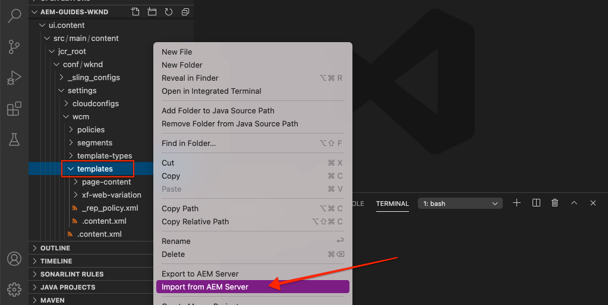

# Páginas y plantillas {#pages-and-template}

En este capítulo analizaremos la relación entre un componente de página base y plantillas editables. Crearemos una plantilla de artículo desdiseñada basada en algunas maquetas de [AdobeXD](https://www.adobe.com/products/xd.html). En el proceso de creación de la plantilla, se tratan los componentes principales y las configuraciones de política avanzadas de las plantillas editables.

## Requisitos previos {#prerequisites}

Revise las herramientas e instrucciones necesarias para configurar un [entorno de desarrollo local](overview.md#local-dev-environment).

### Proyecto de inicio

>[!NOTE]
>
> Si ha completado correctamente el capítulo anterior, puede volver a utilizar el proyecto y omitir los pasos para extraer el proyecto de inicio.

Consulte el código de línea base sobre el que se basa el tutorial:

1. Consulte la `tutorial/pages-templates-start` ramificación desde [GitHub](https://github.com/adobe/aem-guides-wknd)

   ```shell
   $ cd ~/code/aem-guides-wknd
   $ git checkout tutorial/pages-templates-start
   ```

1. Implemente código base en una instancia de AEM local con sus habilidades con Maven:

   ```shell
   $ mvn clean install -PautoInstallSinglePackage
   ```

   >[!NOTE]
   >
   > Si utiliza AEM 6.5 o 6.4, añada la variable `classic` perfil a cualquier comando Maven.

   ```shell
   $ mvn clean install -PautoInstallSinglePackage -Pclassic
   ```

Siempre puede ver el código terminado en [GitHub](https://github.com/adobe/aem-guides-wknd/tree/tutorial/pages-templates-solution) o desproteja el código localmente cambiando a la rama `tutorial/pages-templates-solution`.

## Objetivo

1. Inspect es un diseño de página creado en Adobe XD y asignado a componentes principales.
1. Conozca los detalles de las plantillas editables y cómo se pueden usar las políticas para aplicar el control granular del contenido de la página.
1. Descubra cómo se vinculan las plantillas y las páginas

## Qué va a generar {#what-you-will-build}

En esta parte del tutorial, creará una nueva plantilla de página de artículo que se puede utilizar para crear páginas de artículos nuevas y se ajusta a una estructura común. La plantilla de página de artículos se basa en diseños y en un kit de interfaz de usuario creado en Adobe XD. Este capítulo se centra únicamente en la construcción de la estructura o el esqueleto de la plantilla. No se han implementado estilos, pero la plantilla y las páginas funcionan.


## Planificación de IU con Adobe XD {#adobexd}

En la mayoría de los casos, la planificación de un nuevo sitio web comienza con maquetas y diseños estáticos. [Adobe XD](https://www.adobe.com/products/xd.html) es una herramienta de diseño que crea experiencias de usuario. A continuación, analizaremos un kit de IU y maquetas para ayudar a planificar la estructura de la plantilla de página de artículos.

>[!VIDEO](https://video.tv.adobe.com/v/30214/?quality=12&learn=on)

**Descargue el [Archivo de diseño de artículo WKND](https://github.com/adobe/aem-guides-wknd/releases/download/aem-guides-wknd-0.0.2/AEM_UI-kit-WKND-article-design.xd)**.

>[!NOTE]
>
> Un genérico [AEM Kit de interfaz de usuario de componentes principales también está disponible](https://experienceleague.adobe.com/docs/experience-manager-learn/assets/AEM-CoreComponents-UI-Kit.xd) como punto de partida para proyectos personalizados.

## Crear la plantilla de página de artículo

Al crear una página, debe seleccionar una plantilla, que se utiliza como base para crear la nueva página. La plantilla define la estructura de la página resultante, el contenido inicial y los componentes permitidos.

Hay 3 zonas principales [Plantillas editables](https://experienceleague.adobe.com/docs/experience-manager-65/developing/platform/templates/page-templates-editable.html):

1. **Estructura** : define los componentes que forman parte de la plantilla. Los autores de contenido no pueden editarlos.
1. **Contenido inicial** : define los componentes con los que comienza la plantilla, que los autores de contenido pueden editar o eliminar
1. **Políticas** : define las configuraciones sobre cómo se comportan los componentes y las opciones que tendrán disponibles los autores.

A continuación, cree una nueva plantilla en AEM que coincida con la estructura de las maquetas. Esto ocurre en una instancia local de AEM. Siga los pasos del siguiente vídeo:

>[!VIDEO](https://video.tv.adobe.com/v/330991/?quality=12&learn=on)

Pasos de alto nivel para el vídeo anterior:

### Configuraciones de estructura

1. Cree una nueva plantilla utilizando la variable **Tipo de plantilla de página**, con el nombre **Página de artículos**.
1. Cambiar a **Estructura** en el menú contextual.
1. Agregue un **Fragmento de experiencia** para que actúe como el **Encabezado** en la parte superior de la plantilla.
   * Configure el componente para que apunte a `/content/experience-fragments/wknd/us/en/site/header/master`.
   * Configure la directiva en **Encabezado de página** y asegúrese de que **Elemento predeterminado** está configurado como `header`. La variable `header`se incluye en CSS en el capítulo siguiente.
1. Agregue un **Fragmento de experiencia** para que actúe como el **Pie de página** en la parte inferior de la plantilla.
   * Configure el componente para que apunte a `/content/experience-fragments/wknd/us/en/site/footer/master`.
   * Configure la directiva en **Pie de página** y asegúrese de que **Elemento predeterminado** está configurado como `footer`. La variable `footer` se incluye en CSS en el capítulo siguiente.
1. Bloqueo de la variable **main** contenedor que se incluyó cuando la plantilla se creó inicialmente.
   * Configure la directiva en **Página principal** y asegúrese de que **Elemento predeterminado** está configurado como `main`. La variable `main` se incluye en CSS en el capítulo siguiente.
1. Agregue un **Imagen** al **main** contenedor.
   * Desbloquear **Imagen** componente.
1. Agregue un **Ruta de navegación** debajo del **Imagen** en el contenedor principal.
   * Cree una nueva directiva para la variable **Ruta de navegación** componente denominado **Página de artículos: ruta de navegación**. Configure las variables **Nivel de inicio de navegación** a **4**.
1. Agregue un **Contenedor** debajo del **Ruta de navegación** y dentro del **main** contenedor. Esto actuará como el **Contenedor de contenido** para la plantilla .
   * Desbloquear **Contenido** contenedor.
   * Configure la directiva en **Contenido de la página**.
1. Agregue otro **Contenedor** debajo del **Contenedor de contenido**. Esto actuará como el **Carril lateral** para la plantilla.
   * Desbloquear **Carril lateral** contenedor.
   * Cree una nueva directiva con el nombre **Página de artículos: carril lateral**.
   * Configure las variables **Componentes permitidos** under **Proyecto WKND Sites: contenido** para incluir: **Botón**, **Descargar**, **Imagen**, **Lista**, **Separador**, **Compartir en redes sociales**, **Texto** y **Título**.
1. Actualice la directiva del contenedor raíz de página . Este es el contenedor exterior de la plantilla. Configure la directiva en **Raíz de página**.
   * En **Configuración de contenedor**, establezca la variable **Diseño** a **Cuadrícula interactiva**.
1. Modo de diseño de participación para **Contenedor de contenido**. Arrastre el controlador de derecha a izquierda y reduzca el contenedor para que tenga 8 columnas de ancho.
1. Modo de diseño de participación para **Contenedor de raíl lateral**. Arrastre el controlador de derecha a izquierda y reduzca el contenedor para que tenga 4 columnas de ancho. A continuación, arrastre el controlador izquierdo de izquierda a derecha 1 columna para que el contenedor tenga 3 columnas de ancho y deje un espacio de 1 columna entre las columnas **Contenedor de contenido**.
1. Abra el emulador móvil y cambie a un punto de interrupción móvil. Vuelva a activar el modo de diseño y realice la **Contenedor de contenido** y **Contenedor de raíl lateral** ancho completo de la página. Esto apilará los contenedores verticalmente en el punto de interrupción móvil.
1. Actualizar la directiva de la variable **Texto** en el **Contenedor de contenido**.
   * Configure la directiva en **Texto de contenido**.
   * En **Complementos** > **Estilos de párrafo**, compruebe **Habilitar estilos de párrafo** y asegúrese de que **Bloque de cotización** está activada.

### Configuraciones de contenido inicial

1. Cambie a **Contenido inicial** en el menú contextual.
1. Agregue un **Título** al **Contenedor de contenido**. Actúa como título del artículo. Cuando se deje vacío, se mostrará automáticamente el Título de la página actual.
1. Añadir un segundo **Título** debajo del primer componente Título.
   * Configure el componente con el texto: &quot;Por autor&quot;. Es un marcador de posición de texto.
   * Defina el tipo que desea `H4`.
1. Agregue un **Texto** debajo del **Por autor** Componente Título .
1. Agregue un **Título** al **Contenedor de raíl lateral**.
   * Configure el componente con el texto: &quot;Comparte esta historia&quot;.
   * Defina el tipo que desea `H5`.
1. Agregue un **Compartir en redes sociales** debajo del **Compartir esta historia** Componente Título .
1. Agregue un **Separador** debajo del **Compartir en redes sociales** componente.
1. Agregue un **Descargar** debajo del **Separador** componente.
1. Agregue un **Lista** debajo del **Descargar** componente.
1. Actualice el **Propiedades de la página inicial** para la plantilla .
   * En **Medios sociales** > **Compartir en redes sociales**, compruebe **Facebook** y **Pinterest**

### Habilitar la plantilla y agregar una miniatura

1. Para ver la plantilla en la consola Plantilla , vaya a [http://localhost:4502/libs/wcm/core/content/sites/templates.html/conf/wknd](http://localhost:4502/libs/wcm/core/content/sites/templates.html/conf/wknd)
1. **Habilitar** la plantilla Página del artículo .
1. Edite las propiedades de la plantilla Página del artículo y cargue la siguiente miniatura para identificar rápidamente las páginas creadas mediante la plantilla Página del artículo :

   

## Actualizar el encabezado y el pie de página con fragmentos de experiencias {#experience-fragments}

Una práctica habitual al crear contenido global, como un encabezado o pie de página, es utilizar un [Fragmento de experiencia](https://experienceleague.adobe.com/docs/experience-manager-learn/sites/experience-fragments/experience-fragments-feature-video-use.html). Fragmentos de experiencia, permite a los usuarios combinar varios componentes para crear un único componente que se pueda referenciar. Los fragmentos de experiencias tienen la ventaja de admitir la administración en varios sitios y [localización](https://experienceleague.adobe.com/docs/experience-manager-core-components/using/components/experience-fragment.html?lang=en#localized-site-structure).

El tipo de archivo del proyecto de AEM generó un encabezado y un pie de página. A continuación, actualice los fragmentos de experiencias para que coincidan con las maquetas. Siga los pasos del siguiente vídeo:

>[!VIDEO](https://video.tv.adobe.com/v/330992/?quality=12&learn=on)

Pasos de alto nivel para el vídeo anterior:

1. Descargar el paquete de contenido de ejemplo **[WKND-PagesTemplates-Content-Assets.zip](assets/pages-templates/WKND-PagesTemplates-Content-Assets-1.1.zip)**.
1. Cargue e instale el paquete de contenido mediante el Administrador de paquetes en [http://localhost:4502/crx/packmgr/index.jsp](http://localhost:4502/crx/packmgr/index.jsp)
1. Actualice la plantilla Variación web , que es la plantilla utilizada para los fragmentos de experiencias en [http://localhost:4502/editor.html/conf/wknd/settings/wcm/templates/xf-web-variation/structure.html](http://localhost:4502/editor.html/conf/wknd/settings/wcm/templates/xf-web-variation/structure.html)
   * Actualice la directiva de la **Contenedor** en la plantilla.
   * Configure la directiva en **Raíz XF**.
   * En **Componentes permitidos** seleccione el grupo de componentes **Proyecto de sitios WKND - Estructura** para incluir **Navegación por idiomas**, **Navegación** y **Búsqueda rápida** componentes.

### Actualizar fragmento de experiencia de encabezado

1. Abra el fragmento de experiencia que procesa el encabezado en [http://localhost:4502/editor.html/content/experience-fragments/wknd/us/en/site/header/master.html](http://localhost:4502/editor.html/content/experience-fragments/wknd/us/en/site/header/master.html)
1. Configuración de la raíz **Contenedor** del fragmento. Este es el más externo **Contenedor**.
   * Configure las variables **Diseño** a **Cuadrícula interactiva**
1. Agregue la variable **Logotipo oscuro WKND** como imagen en la parte superior del **Contenedor**. El logotipo se incluyó en el paquete instalado en un paso anterior.
   * Modifique el diseño del **Logotipo oscuro WKND** a **2** columnas anchas. Arrastre los controles de derecha a izquierda.
   * Configuración del logotipo con **Texto alternativo** de &quot;WKND Logo&quot;.
   * Configure el logotipo para **Vínculo** a `/content/wknd/us/en` la página principal.
1. Configure las variables **Navegación** que ya se ha colocado en la página.
   * Configure las variables **Excluir niveles raíz** a **1**.
   * Configure las variables **Profundidad de la estructura de navegación** a **1**.
   * Modifique el diseño del **Navegación** componente que se va a **8** columnas anchas. Arrastre los controles de derecha a izquierda.
1. Elimine el **Navegación por idiomas** componente.
1. Modifique el diseño del **Buscar** componente que se va a **2** columnas anchas. Arrastre los controles de derecha a izquierda. Ahora todos los componentes deben alinearse horizontalmente en una sola fila.

### Actualizar fragmento de experiencia del pie de página

1. Abra el fragmento de experiencia que procesa el pie de página en [http://localhost:4502/editor.html/content/experience-fragments/wknd/us/en/site/footer/master.html](http://localhost:4502/editor.html/content/experience-fragments/wknd/us/en/site/footer/master.html)
1. Configuración de la raíz **Contenedor** del fragmento. Este es el más externo **Contenedor**.
   * Configure las variables **Diseño** a **Cuadrícula interactiva**
1. Agregue la variable **Logotipo de luz WKND** como imagen en la parte superior del **Contenedor**. El logotipo se incluyó en el paquete instalado en un paso anterior.
   * Modifique el diseño del **Logotipo de luz WKND** a **2** columnas anchas. Arrastre los controles de derecha a izquierda.
   * Configuración del logotipo con **Texto alternativo** de &quot;Luz con logotipo WKND&quot;.
   * Configure el logotipo para **Vínculo** a `/content/wknd/us/en` la página principal.
1. Agregue un **Navegación** debajo del logotipo. Configure las variables **Navegación** componente:
   * Configure las variables **Excluir niveles raíz** a **1**.
   * Desmarcar **Recopilar todas las páginas secundarias**.
   * Configure las variables **Profundidad de la estructura de navegación** a **1**.
   * Modifique el diseño del **Navegación** componente que se va a **8** columnas anchas. Arrastre los controles de derecha a izquierda.

## Crear una página de artículo

A continuación, cree una nueva página con la plantilla Página de artículo . Cree el contenido de la página para que coincida con las maquetas del sitio. Siga los pasos del siguiente vídeo:

>[!VIDEO](https://video.tv.adobe.com/v/330993/?quality=12&learn=on)

Pasos de alto nivel para el vídeo anterior:

1. Vaya a la consola Sitios en [http://localhost:4502/sites.html/content/wknd/us/en/magazine](http://localhost:4502/sites.html/content/wknd/us/en/magazine).
1. Cree una nueva página debajo de **WKND** > **US** > **ES** > **Revista**.
   * Elija la **Página de artículos** plantilla.
   * En **Propiedades** configure la variable **Título** a &quot;Ultimate Guide to LA Skateparks&quot;
   * Configure las variables **Nombre** a guide-la-skateparks
1. Reemplazar **Por autor** Título con el texto &quot;Por Stacey Roswells&quot;.
1. Actualice el **Texto** para incluir un párrafo para rellenar el artículo. Puede utilizar el siguiente archivo de texto como copia: [la-skate-parks-copy.txt](assets/pages-templates/la-skateparks-copy.txt).
1. Agregue otro **Texto** componente.
   * Actualice el componente para incluir la cotización: &quot;No hay mejor lugar para compartir que Los Ángeles&quot;.
   * Edite el Editor de texto enriquecido en modo de pantalla completa y modifique la comilla anterior para usar la variable **Bloque de cotización** elemento.
1. Continúe rellenando el cuerpo del artículo para que coincida con las maquetas.
1. Configure las variables **Descargar** para utilizar una versión PDF del artículo.
   * En **Descargar** > **Propiedades**, haga clic en la casilla de verificación para **Obtener el título del recurso DAM**.
   * Configure las variables **Descripción** a: &quot;Obtener la historia completa&quot;.
   * Configure las variables **Texto de la acción** a: &quot;Descargar PDF&quot;.
1. Configure las variables **Lista** componente.
   * En **Configuración de lista** > **Lista de creación que utiliza**, seleccione **Páginas secundarias**.
   * Configure las variables **Página principal** a `/content/wknd/us/en/magazine`.
   * En **Configuración de elementos** check **Vincular elementos** y compruebe **Mostrar fecha**.

## Inspect: estructura de nodos {#node-structure}

En este punto, la página del artículo está claramente desdiseñada. Sin embargo, la estructura básica está establecida. A continuación, inspeccione la estructura de nodos de la página de artículos para comprender mejor la función de la plantilla, la página y los componentes.

Utilice la herramienta CRXDE-Lite en una instancia de AEM local para ver la estructura de nodos subyacente.

1. Apertura [CRXDE-Lite](http://localhost:4502/crx/de/index.jsp#/content/wknd/us/en/magazine/guide-la-skateparks/jcr%3Acontent) y utilice la navegación de árbol para desplazarse a `/content/wknd/us/en/magazine/guide-la-skateparks`.

1. Haga clic en el `jcr:content` nodo debajo de `la-skateparks` y vea las propiedades:

   

   Observe el valor de `cq:template`, que señala a `/conf/wknd/settings/wcm/templates/article-page`, la plantilla de página de artículo que hemos creado anteriormente.

   Observe también el valor de `sling:resourceType`, que señala a `wknd/components/page`. Este es el componente de página creado por el tipo de archivo del proyecto de AEM y es responsable de procesar la página según la plantilla.

1. Expanda el `jcr:content` nodo inferior `/content/wknd/us/en/magazine/guide-la-skateparks/jcr:content` y vea la jerarquía de nodos:

   

   Debe poder asignar de forma flexible cada uno de los nodos a los componentes creados. Compruebe si puede identificar los diferentes contenedores de diseño utilizados al inspeccionar los nodos con el prefijo `container`.

1. A continuación, inspeccione el componente de página en `/apps/wknd/components/page`. Visualice las propiedades del componente en el CRXDE Lite:

   

   Tenga en cuenta que solo hay 2 scripts HTL, `customfooterlibs.html` y `customheaderlibs.html` debajo del componente de página. *Entonces, ¿cómo procesa este componente la página?*

   La variable `sling:resourceSuperType` la propiedad apunta a `core/wcm/components/page/v2/page`. Esta propiedad permite que el componente de página de WKND herede **all** de la funcionalidad del componente de página Componente principal . Este es el primer ejemplo de algo llamado [Patrón de componentes proxy](https://experienceleague.adobe.com/docs/experience-manager-core-components/using/developing/guidelines.html#ProxyComponentPattern). Encontrará más información [here](https://experienceleague.adobe.com/docs/experience-manager-core-components/using/developing/guidelines.html).

1. Inspect otro componente dentro de los componentes WKND, la variable `Breadcrumb` componente ubicado en: `/apps/wknd/components/breadcrumb`. Observe que el mismo `sling:resourceSuperType` se puede encontrar, pero esta vez señala a `core/wcm/components/breadcrumb/v2/breadcrumb`. Este es otro ejemplo del uso del patrón de componentes Proxy para incluir un componente principal. De hecho, todos los componentes de la base de código WKND son proxies de AEM componentes principales (excepto nuestro famoso componente HelloWorld). Se recomienda intentar reutilizar la mayor cantidad posible de funciones de los componentes principales *before* escribir código personalizado.

1. A continuación, revise la página del componente principal en `/libs/core/wcm/components/page/v2/page` uso de CRXDE Lite:

   >[!NOTE]
   >
   > En AEM 6.5/6.4, los componentes principales se encuentran en `/apps/core/wcm/components`. En AEM as a Cloud Service, los componentes principales se encuentran en `/libs` y se actualizan automáticamente.

   

   Observe que se incluyen muchas más secuencias de comandos debajo de esta página. La página Componentes principales contiene muchas funciones. Esta funcionalidad se divide en varios scripts para facilitar el mantenimiento y la lectura. Puede rastrear la inclusión de los scripts HTL abriendo el `page.html` y buscando `data-sly-include`:

   ```html
   <!--/* /libs/core/wcm/components/page/v2/page/page.html */-->
   <!DOCTYPE HTML>
   <html data-sly-use.page="com.adobe.cq.wcm.core.components.models.Page" lang="${page.language}"
       data-sly-use.head="head.html"
       data-sly-use.footer="footer.html"
       data-sly-use.redirect="redirect.html">
       <head data-sly-call="${head.head @ page = page}"></head>
       <body class="${page.cssClassNames}"
           id="${page.id}"
           data-cmp-data-layer-enabled="${page.data ? true : false}">
           <script data-sly-test.dataLayerEnabled="${page.data}">
           window.adobeDataLayer = window.adobeDataLayer || [];
           adobeDataLayer.push({
               page: JSON.parse("${page.data.json @ context='scriptString'}"),
               event:'cmp:show',
               eventInfo: {
                   path: 'page.${page.id @ context="scriptString"}'
               }
           });
           </script>
           <sly data-sly-test.isRedirectPage="${page.redirectTarget && (wcmmode.edit || wcmmode.preview)}"
               data-sly-call="${redirect.redirect @ redirectTarget = page.redirectTarget}"></sly>
           <sly data-sly-test="${!isRedirectPage}">
               <sly data-sly-include="body.skiptomaincontent.html"></sly>
               <sly data-sly-include="body.socialmedia_begin.html"></sly>
               <sly data-sly-include="body.html"></sly>
               <sly data-sly-call="${footer.footer @ page = page}"></sly>
               <sly data-sly-include="body.socialmedia_end.html"></sly>
           </sly>
       </body>
   </html>
   ```

   La otra razón para dividir HTL en varios scripts es permitir que los componentes proxy anulen los scripts individuales para implementar la lógica empresarial personalizada. Los scripts HTL, `customfooterlibs.html` y `customheaderlibs.html`, se crean con el propósito explícito de anularse mediante la implementación de proyectos.

   Puede obtener más información sobre cómo la plantilla editable influye en la renderización de la variable [página de contenido leyendo este artículo](https://experienceleague.adobe.com/docs/experience-manager-65/developing/platform/templates/page-templates-editable.html).

1. Inspect es el otro componente principal, como la ruta de exploración en `/libs/core/wcm/components/breadcrumb/v2/breadcrumb`. Consulte la `breadcrumb.html` secuencia de comandos para comprender cómo se genera finalmente el marcado del componente de ruta de exploración.

## Guardar configuraciones en control de código fuente {#configuration-persistence}

En muchos casos, especialmente al principio de un proyecto AEM, es importante mantener las configuraciones, como las plantillas y las políticas de contenido relacionadas, para el control de código fuente. Esto garantiza que todos los desarrolladores trabajen con el mismo conjunto de contenido y configuraciones, y puede garantizar una coherencia adicional entre entornos. Una vez que un proyecto alcanza un cierto nivel de madurez, la práctica de administrar plantillas se puede transferir a un grupo especial de usuarios avanzados.

Por ahora, trataremos las plantillas como otras partes de código y sincronizaremos el **Plantilla de página de artículo** como parte del proyecto. Hasta ahora tenemos **push** código de nuestro proyecto AEM a una instancia local de AEM. La variable **Plantilla de página de artículo** se creó directamente en una instancia local de AEM, por lo que necesitamos **importar** la plantilla en nuestro proyecto AEM. La variable **ui.content** se incluye en el proyecto AEM para este fin específico.

Los siguientes pasos se llevarán a cabo utilizando el IDE de VSCode utilizando la variable [VSCode AEM Sync](https://marketplace.visualstudio.com/items?itemName=yamato-ltd.vscode-aem-sync&amp;ssr=false#overview) pero podría estar utilizando cualquier IDE que haya configurado para **importar** o importar contenido desde una instancia local de AEM.

1. En el VSCode, abra el `aem-guides-wknd` proyecto.

1. Expanda el **ui.content** en el explorador de proyectos. Expanda el `src` carpeta y vaya a `/conf/wknd/settings/wcm/templates`.

1. [!UICONTROL Clic con el botón derecho] el `templates` carpeta y seleccione **Importar desde AEM servidor**:

   

   La variable `article-page` debe importarse, y `page-content`, `xf-web-variation` las plantillas también deben actualizarse.

   

1. Repita los pasos para importar contenido, pero seleccione la opción **políticas** carpeta ubicada en `/conf/wknd/settings/wcm/policies`.

   

1. Inspect la variable `filter.xml` archivo ubicado en `ui.content/src/main/content/META-INF/vault/filter.xml`.

   ```xml
   <!--ui.content filter.xml-->
   <?xml version="1.0" encoding="UTF-8"?>
   <workspaceFilter version="1.0">
       <filter root="/conf/wknd" mode="merge"/>
       <filter root="/content/wknd" mode="merge"/>
       <filter root="/content/dam/wknd" mode="merge"/>
       <filter root="/content/experience-fragments/wknd" mode="merge"/>
   </workspaceFilter>
   ```

   La variable `filter.xml` es responsable de identificar las rutas de los nodos instalados con el paquete. Observe que `mode="merge"` en cada uno de los filtros que indica que el contenido existente no se modificará, solo se añadirá contenido nuevo. Dado que los autores de contenido pueden estar actualizando estas rutas, es importante que una implementación de código **not** sobrescribir contenido. Consulte la [Documentación de FileVault](https://jackrabbit.apache.org/filevault/filter.html) para obtener más información sobre cómo trabajar con elementos de filtro.

   Comparar `ui.content/src/main/content/META-INF/vault/filter.xml` y `ui.apps/src/main/content/META-INF/vault/filter.xml` para comprender los diferentes nodos administrados por cada módulo.

   >[!WARNING]
   >
   > Para garantizar implementaciones coherentes para el sitio de referencia de WKND, algunas ramas del proyecto están configuradas de modo que `ui.content` sobrescribe cualquier cambio en el JCR. Esto es por diseño, es decir, para las ramas de soluciones, ya que el código o los estilos se escriben para políticas específicas.

## Felicitaciones! {#congratulations}

Felicidades, acaba de crear una nueva plantilla y página con Adobe Experience Manager Sites.

### Siguientes pasos {#next-steps}

En este punto, la página del artículo está claramente desdiseñada. Siga las [Bibliotecas del lado del cliente y flujo de trabajo del front-end](client-side-libraries.md) tutorial para conocer las prácticas recomendadas para incluir CSS y Javascript para aplicar estilos globales al sitio e integrar una versión de front-end dedicada.

Ver el código terminado en [GitHub](https://github.com/adobe/aem-guides-wknd) o revisar e implementar el código localmente en la rama Git `tutorial/pages-templates-solution`.

1. Clonar el [github.com/adobe/aem-wknd-guides](https://github.com/adobe/aem-guides-wknd) repositorio.
1. Consulte la `tutorial/pages-templates-solution` rama.
