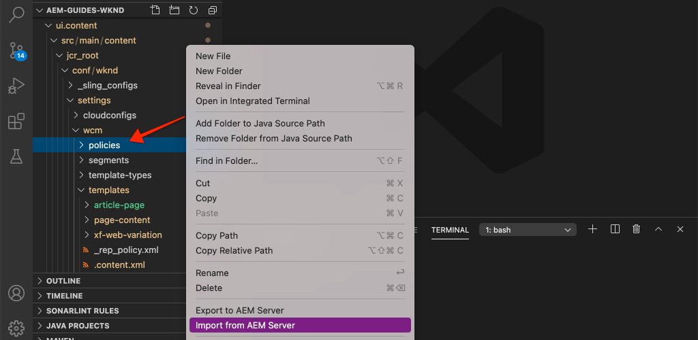

# Páginas y plantillas {#pages-and-template}

En este capítulo analizaremos la relación entre un componente de página base y plantillas editables. Crearemos una plantilla de artículo sin estilo basada en algunas maquetas de [AdobeXD](https://www.adobe.com/products/xd.html). En el proceso de creación de la plantilla, se tratan los componentes principales y las configuraciones de política avanzadas de las plantillas editables.

## Requisitos previos {#prerequisites}

Revise las herramientas e instrucciones necesarias para configurar un [entorno de desarrollo local](overview.md#local-dev-environment).

### Proyecto de inicio

>[!NOTE]
>
> Si ha completado correctamente el capítulo anterior, puede volver a utilizar el proyecto y omitir los pasos para extraer el proyecto de inicio.

Consulte el código de línea base sobre el que se basa el tutorial:

1. Consulte la rama `tutorial/pages-templates-start` de [GitHub](https://github.com/adobe/aem-guides-wknd)

   ```shell
   $ cd ~/code/aem-guides-wknd
   $ git checkout tutorial/pages-templates-start
   ```

1. Implemente código base en una instancia de AEM local con sus habilidades con Maven:

   ```shell
   $ mvn clean install -PautoInstallSinglePackage
   ```

   >[!NOTE]
   >
   > Si utiliza AEM 6.5 o 6.4, anexe el perfil `classic` a cualquier comando Maven.

   ```shell
   $ mvn clean install -PautoInstallSinglePackage -Pclassic
   ```

Siempre puede ver el código terminado en [GitHub](https://github.com/adobe/aem-guides-wknd/tree/pages-templates/solution) o extraer el código localmente cambiando a la rama `tutorial/pages-templates-solution`.

## Objetivo

1. Inspect es un diseño de página creado en Adobe XD y asignado a componentes principales.
1. Conozca los detalles de las plantillas editables y cómo se pueden usar las políticas para aplicar el control granular del contenido de la página.
1. Descubra cómo se vinculan las plantillas y las páginas

## Qué va a generar {#what-you-will-build}

En esta parte del tutorial, creará una nueva plantilla de página de artículo que se puede utilizar para crear páginas de artículos nuevas y se ajusta a una estructura común. La plantilla de página de artículos se basará en diseños y en un kit de interfaz de usuario creado en Adobe XD. Este capítulo se centra únicamente en la construcción de la estructura o el esqueleto de la plantilla. No se implementará ningún estilo, pero la plantilla y las páginas funcionarán.


## Planificación de IU con Adobe XD {#adobexd}

En la mayoría de los casos, la planificación de un nuevo sitio web comienza con maquetas y diseños estáticos. [Adobe ](https://www.adobe.com/products/xd.html) XD es una herramienta de diseño que crea experiencias de usuario. A continuación, analizaremos un kit de IU y maquetas para ayudar a planificar la estructura de la plantilla de página de artículos.

>[!VIDEO](https://video.tv.adobe.com/v/30214/?quality=12&learn=on)

**Descargue el archivo de diseño de artículos  [WKND](https://github.com/adobe/aem-guides-wknd/releases/download/aem-guides-wknd-0.0.2/AEM_UI-kit-WKND-article-design.xd)**.

>[!NOTE]
>
> También hay disponible un [AEM Kit de interfaz de usuario de componentes principales genérico](https://experienceleague.adobe.com/docs/experience-manager-learn/assets/AEM-CoreComponents-UI-Kit.xd) como punto de partida para proyectos personalizados.

## Crear la plantilla de página de artículo

Al crear una página, debe seleccionar una plantilla, que se utilizará como base para crear la página nueva. La plantilla define la estructura de la página resultante, el contenido inicial y los componentes permitidos.

Existen tres áreas principales de [Plantillas editables](https://experienceleague.adobe.com/docs/experience-manager-65/developing/platform/templates/page-templates-editable.html):

1. **Estructura** : define los componentes que forman parte de la plantilla. Los autores de contenido no podrán editarlos.
1. **Contenido inicial** : define los componentes con los que comenzará la plantilla, que los autores de contenido pueden editar o eliminar
1. **Políticas** : define las configuraciones sobre cómo se comportarán los componentes y las opciones que tendrán disponibles los autores.

A continuación, cree una nueva plantilla en AEM que coincida con la estructura de las maquetas. Esto ocurre en una instancia local de AEM. Siga los pasos del siguiente vídeo:

>[!VIDEO](https://video.tv.adobe.com/v/330991/?quality=12&learn=on)

Pasos de alto nivel para el siguiente vídeo:

### Configuraciones de estructura

1. Cree una nueva plantilla con el **Tipo de plantilla de página**, denominado **Página de artículo**.
1. Cambie al modo **Structure**.
1. Agregue un componente **Fragmento de experiencia** para que actúe como **Encabezado** en la parte superior de la plantilla.
   * Configure el componente para que apunte a `/content/experience-fragments/wknd/us/en/site/header/master`.
   * Establezca la directiva en **Encabezado de página** y asegúrese de que **Elemento predeterminado** esté configurado en `header`. El elemento `header`se dirigirá con CSS en el siguiente capítulo.
1. Añada un componente **Fragmento de experiencia** para que actúe como **Pie de página** en la parte inferior de la plantilla.
   * Configure el componente para que apunte a `/content/experience-fragments/wknd/us/en/site/footer/master`.
   * Establezca la directiva en **Pie de página** y asegúrese de que **Elemento predeterminado** esté configurado en `footer`. El elemento `footer` se dirigirá con CSS en el siguiente capítulo.
1. Bloquee el contenedor **main** que se incluyó cuando la plantilla se creó inicialmente.
   * Establezca la directiva en **Página principal** y asegúrese de que **Elemento predeterminado** esté configurado en `main`. El elemento `main` se dirigirá con CSS en el siguiente capítulo.
1. Agregue un componente **Imagen** al contenedor **principal**.
   * Desbloquee el componente **Image**.
1. Añada un componente **Breadcrumb** debajo del componente **Image** en el contenedor principal.
   * Cree una nueva directiva para el componente **Ruta de navegación** denominado **Página de artículos - Ruta de navegación**. Establezca el **Nivel de inicio de navegación** en **4**.
1. Añada un componente **Container** debajo del componente **Breadcrumb** y dentro del contenedor **main**. Esto actuará como el **Contenedor de contenido** para la plantilla.
   * Desbloquee el contenedor **Content**.
   * Establezca la directiva en **Contenido de página**.
1. Agregue otro componente **Contenedor** debajo del **Contenedor de contenido**. Esto actuará como el contenedor de **Carril lateral** para la plantilla.
   * Desbloquee el contenedor **Carril lateral**.
   * Cree una nueva directiva denominada **Página de artículos - Carril lateral**.
   * Configure los **Componentes permitidos** en **Proyecto de sitios WKND - Contenido** para incluir: **Botón**, **Descargar**, **Imagen**, **Lista**, **Separador**, **Uso compartido en medios sociales**, **>Texto** y **Título**.
1. Actualice la directiva del contenedor raíz de página . Este es el contenedor exterior de la plantilla. Establezca la directiva en **Raíz de página**.
   * En **Configuración de contenedor**, establezca el **Diseño** en **Cuadrícula interactiva**.
1. Participación en el modo de diseño del **contenedor de contenido**. Arrastre el controlador de derecha a izquierda y reduzca el contenedor para que tenga 8 columnas de ancho.
1. Modo de diseño de participación para el **contenedor de carril lateral**. Arrastre el controlador de derecha a izquierda y reduzca el contenedor para que tenga 4 columnas de ancho. A continuación, arrastre el controlador izquierdo de izquierda a derecha 1 columna para que el contenedor tenga 3 columnas de ancho y deje un espacio de 1 columna entre el **contenedor de contenido**.
1. Abra el emulador móvil y cambie a un punto de interrupción móvil. Vuelva a activar el modo de diseño y haga que el **contenedor de contenido** y el **contenedor de carril lateral** tengan la anchura completa de la página. Esto apilará los contenedores verticalmente en el punto de interrupción móvil.
1. Actualice la política del componente **Texto** en el **Contenedor de contenido**.
   * Establezca la directiva en **Content text**.
   * En **Plugins** > **Estilos de párrafo**, marque **Habilitar estilos de párrafo** y asegúrese de que el **bloque de presupuesto** esté habilitado.

### Configuraciones de contenido inicial

1. Cambie al modo **Contenido inicial**.
1. Agregue un componente **Título** al **Contenedor de contenido**. Esto actuará como el título del artículo. Cuando se deje vacío, se mostrará automáticamente el Título de la página actual.
1. Añada un segundo componente **Título** debajo del primer componente Título.
   * Configure el componente con el texto: &quot;Por autor&quot;. Será un marcador de posición de texto.
   * Establezca el tipo en `H4`.
1. Añada un componente **Texto** debajo del componente Título **Por autor**.
1. Agregue un componente **Título** al **Contenedor de carril lateral**.
   * Configure el componente con el texto: &quot;Comparte esta historia&quot;.
   * Establezca el tipo en `H5`.
1. Agregue un componente **Uso compartido en medios sociales** debajo del componente Título **Compartir este artículo**.
1. Agregue un componente **Separador** debajo del componente **Uso compartido en medios sociales**.
1. Añada un componente **Download** debajo del componente **Separator**.
1. Añada un componente **List** debajo del componente **Download**.
1. Actualice **Initial Page Properties** para la plantilla.
   * En **Medios sociales** > **Compartir en medios sociales**, marque **Facebook** y **Pinterest**

### Habilitar la plantilla y agregar una miniatura

1. Para ver la plantilla en la consola Plantilla , vaya a [http://localhost:4502/libs/wcm/core/content/sites/templates.html/conf/wknd](http://localhost:4502/libs/wcm/core/content/sites/templates.html/conf/wknd)
1. **** Habilite la plantilla Página del artículo .
1. Edite las propiedades de la plantilla Página del artículo y cargue la siguiente miniatura para identificar rápidamente las páginas creadas mediante la plantilla Página del artículo :

   

## Actualizar el encabezado y el pie de página con fragmentos de experiencias {#experience-fragments}

Una práctica habitual al crear contenido global, como un encabezado o pie de página, es utilizar un [fragmento de experiencia](https://docs.adobe.com/content/help/en/experience-manager-learn/sites/experience-fragments/experience-fragments-feature-video-use.html). Fragmentos de experiencia, permite a los usuarios combinar varios componentes para crear un único componente que se pueda referenciar. Los fragmentos de experiencias tienen la ventaja de admitir la administración de varios sitios y la [localización](https://experienceleague.adobe.com/docs/experience-manager-core-components/using/components/experience-fragment.html?lang=en#localized-site-structure).

El tipo de archivo del proyecto de AEM generó un encabezado y un pie de página. A continuación, actualice los fragmentos de experiencias para que coincidan con las maquetas. Siga los pasos del siguiente vídeo:

>[!VIDEO](https://video.tv.adobe.com/v/330992/?quality=12&learn=on)

Pasos de alto nivel para el siguiente vídeo:

1. Descargue el paquete de contenido de ejemplo **[WKND-PagesTemplates-Content-Assets.zip](assets/pages-templates/WKND-PagesTemplates-Content-Assets.zip)**.
1. Cargue e instale el paquete de contenido mediante el Administrador de paquetes en [http://localhost:4502/crx/packmgr/index.jsp](http://localhost:4502/crx/packmgr/index.jsp)
1. Actualice la plantilla Variación web, que es la plantilla utilizada para los fragmentos de experiencias en [http://localhost:4502/editor.html/conf/wknd/settings/wcm/templates/xf-web-variation/structure.html](http://localhost:4502/editor.html/conf/wknd/settings/wcm/templates/xf-web-variation/structure.html)
   * Actualice la política del componente **Contenedor** en la plantilla.
   * Establezca la directiva en **XF Root**.
   * En **Componentes permitidos** seleccione el grupo de componentes **Proyecto de sitios WKND - Estructura** para incluir componentes de **Navegación de idioma**, **Navegación** y **Búsqueda rápida**.

### Actualizar fragmento de experiencia de encabezado

1. Abra el fragmento de experiencia que procesa el encabezado en [http://localhost:4502/editor.html/content/experience-fragments/wknd/us/en/site/header/master.html](http://localhost:4502/editor.html/content/experience-fragments/wknd/us/en/site/header/master.html)
1. Configure el **Contenedor** raíz del fragmento. Este es el contenedor **más externo**.
   * Establezca el **Diseño** en **Cuadrícula interactiva**
1. Agregue el **logotipo oscuro de WKND** como una imagen en la parte superior del **contenedor**. El logotipo se incluyó en el paquete instalado en un paso anterior.
   * Modifique el diseño del **WKND Dark Logo** para que tenga **2** columnas de ancho. Arrastre los controles de derecha a izquierda.
   * Configure el logotipo con **Texto alternativo** de &quot;Logotipo WKND&quot;.
   * Configure el logotipo como **Link** para `/content/wknd/us/en` la página principal.
1. Configure el componente **Navegación** que ya se ha colocado en la página.
   * Establezca **Excluir niveles raíz** en **1**.
   * Establezca la **Profundidad de la estructura de navegación** en **1**.
   * Modifique el diseño del componente **Navegación** para que tenga **8** columnas de ancho. Arrastre los controles de derecha a izquierda.
1. Elimine el componente **Idioma de navegación**.
1. Modifique el diseño del componente **Buscar** para que tenga **2** columnas de ancho. Arrastre los controles de derecha a izquierda. Ahora todos los componentes deben alinearse horizontalmente en una sola fila.

### Actualizar fragmento de experiencia del pie de página

1. Abra el fragmento de experiencia que muestra el pie de página en [http://localhost:4502/editor.html/content/experience-fragments/wknd/us/en/site/footer/master.html](http://localhost:4502/editor.html/content/experience-fragments/wknd/us/en/site/footer/master.html)
1. Configure el **Contenedor** raíz del fragmento. Este es el contenedor **más externo**.
   * Establezca el **Diseño** en **Cuadrícula interactiva**
1. Añada el **logotipo de la luz WKND** como una imagen en la parte superior del **contenedor**. El logotipo se incluyó en el paquete instalado en un paso anterior.
   * Modifique el diseño del **WKND Light Logo** para que tenga **2** columnas de ancho. Arrastre los controles de derecha a izquierda.
   * Configure el logotipo con **Texto alternativo** de &quot;Luz con logotipo WKND&quot;.
   * Configure el logotipo como **Link** para `/content/wknd/us/en` la página principal.
1. Añada un componente **Navegación** debajo del logotipo. Configure el componente **Navegación**:
   * Establezca **Excluir niveles raíz** en **1**.
   * Desmarque **Collect all child pages**.
   * Establezca la **Profundidad de la estructura de navegación** en **1**.
   * Modifique el diseño del componente **Navegación** para que tenga **8** columnas de ancho. Arrastre los controles de derecha a izquierda.

## Crear una página de artículo

A continuación, cree una nueva página con la plantilla Página de artículo . Cree el contenido de la página para que coincida con las maquetas del sitio. Siga los pasos del siguiente vídeo:

>[!VIDEO](https://video.tv.adobe.com/v/330993/?quality=12&learn=on)

Pasos de alto nivel para el siguiente vídeo:

1. Vaya a la consola Sitios en [http://localhost:4502/sites.html/content/wknd/us/en/magazine](http://localhost:4502/sites.html/content/wknd/us/en/magazine).
1. Cree una nueva página debajo de **WKND** > **US** > **EN** > **Revista**.
   * Elija la plantilla **Página de artículos**.
   * En **Properties** establezca el **Title** como &quot;Ultimate Guide to LA Skateparks&quot;
   * Configure el **Nombre** en &quot;guide-la-skateparks&quot;
1. Reemplace **By Author** Title por el texto &quot;By Stacey Roswells&quot;.
1. Actualice el componente **Texto** para incluir un párrafo para rellenar el artículo. Puede utilizar el siguiente archivo de texto como copia: [la-skate-parks-copy.txt](assets/pages-templates/la-skateparks-copy.txt).
1. Añada otro componente **Texto**.
   * Actualice el componente para incluir la cotización: &quot;No hay mejor lugar para compartir que Los Ángeles&quot;.
   * Edite el Editor de texto enriquecido en modo de pantalla completa y modifique la comilla anterior para utilizar el elemento **Bloque de comillas**.
1. Continúe rellenando el cuerpo del artículo para que coincida con las maquetas.
1. Configure el componente **Descargar** para utilizar una versión PDF del artículo.
   * En **Descargar** > **Propiedades**, haga clic en la casilla de verificación para **Obtener el título del recurso DAM**.
   * Establezca la **Descripción** en: &quot;Obtener la historia completa&quot;.
   * Establezca el **Texto de acción** en: &quot;Descargar PDF&quot;.
1. Configure el componente **List**.
   * En **Configuración de lista** > **Lista de compilación que utiliza**, seleccione **Páginas secundarias**.
   * Establezca la **Página principal** en `/content/wknd/us/en/magazine`.
   * En **Configuración de elementos**, marque **Vincular elementos** y marque **Mostrar fecha**.

## Inspect: estructura de nodos {#node-structure}

En este punto, la página del artículo está claramente desdiseñada. Sin embargo, la estructura básica está establecida. A continuación, inspeccione la estructura de nodos de la página de artículos para comprender mejor la función de la plantilla, la página y los componentes.

Utilice la herramienta CRXDE-Lite en una instancia de AEM local para ver la estructura de nodos subyacente.

1. Abra [CRXDE-Lite](http://localhost:4502/crx/de/index.jsp#/content/wknd/us/en/magazine/guide-la-skateparks/jcr%3Acontent) y utilice la navegación de árbol para desplazarse a `/content/wknd/us/en/magazine/guide-la-skateparks`.

1. Haga clic en el nodo `jcr:content` debajo de la página `la-skateparks` y vea las propiedades:

   

   Observe el valor de `cq:template`, que apunta a `/conf/wknd/settings/wcm/templates/article-page`, la plantilla de página de artículo que creamos anteriormente.

   Fíjese también en el valor de `sling:resourceType`, que apunta a `wknd/components/page`. Este es el componente de página creado por el tipo de archivo del proyecto de AEM y es responsable de procesar la página según la plantilla.

1. Expanda el nodo `jcr:content` debajo de `/content/wknd/us/en/magazine/guide-la-skateparks/jcr:content` y vea la jerarquía de nodos:

   

   Debe poder asignar de forma flexible cada uno de los nodos a los componentes creados. Compruebe si puede identificar los diferentes contenedores de diseño utilizados inspeccionando los nodos con el prefijo `container`.

1. A continuación, inspeccione el componente de página en `/apps/wknd/components/page`. Visualice las propiedades del componente en el CRXDE Lite:

   

   Tenga en cuenta que solo hay 2 scripts HTL, `customfooterlibs.html` y `customheaderlibs.html` debajo del componente de página. *Entonces, ¿cómo procesa este componente la página?*

   La propiedad `sling:resourceSuperType` apunta a `core/wcm/components/page/v2/page`. Esta propiedad permite que el componente de página de WKND herede **todo** de la funcionalidad del componente de página del componente principal. Este es el primer ejemplo de algo llamado [Proxy Component Pattern](https://docs.adobe.com/content/help/en/experience-manager-core-components/using/developing/guidelines.html#ProxyComponentPattern). Puede encontrar más información [aquí.](https://docs.adobe.com/content/help/en/experience-manager-core-components/using/developing/guidelines.html).

1. Inspect es otro componente dentro de los componentes WKND, el componente `Breadcrumb` ubicado en: `/apps/wknd/components/breadcrumb`. Observe que se puede encontrar la misma propiedad `sling:resourceSuperType`, pero esta vez apunta a `core/wcm/components/breadcrumb/v2/breadcrumb`. Este es otro ejemplo del uso del patrón de componentes Proxy para incluir un componente principal. De hecho, todos los componentes de la base de código WKND son proxies de AEM componentes principales (excepto nuestro famoso componente HelloWorld). Se recomienda intentar reutilizar la mayor cantidad posible de funciones de los componentes principales *antes* de escribir código personalizado.

1. A continuación, revise la página del componente principal en `/libs/core/wcm/components/page/v2/page` mediante el CRXDE Lite:

   >[!NOTE]
   >
   > En AEM 6.5/6.4, los componentes principales se encuentran en `/apps/core/wcm/components`. En AEM como Cloud Service, los componentes principales se encuentran en `/libs` y se actualizan automáticamente.

   

   Observe que se incluyen muchas más secuencias de comandos debajo de esta página. La página Componentes principales contiene muchas funciones. Esta funcionalidad se divide en varios scripts para facilitar el mantenimiento y la lectura. Puede rastrear la inclusión de los scripts HTL abriendo `page.html` y buscando `data-sly-include`:

   ```html
   <!--/* /libs/core/wcm/components/page/v2/page/page.html */-->
   <!DOCTYPE HTML>
   <html data-sly-use.page="com.adobe.cq.wcm.core.components.models.Page" lang="${page.language}"
       data-sly-use.head="head.html"
       data-sly-use.footer="footer.html"
       data-sly-use.redirect="redirect.html">
       <head data-sly-call="${head.head @ page = page}"></head>
       <body class="${page.cssClassNames}"
           id="${page.id}"
           data-cmp-data-layer-enabled="${page.data ? true : false}">
           <script data-sly-test.dataLayerEnabled="${page.data}">
           window.adobeDataLayer = window.adobeDataLayer || [];
           adobeDataLayer.push({
               page: JSON.parse("${page.data.json @ context='scriptString'}"),
               event:'cmp:show',
               eventInfo: {
                   path: 'page.${page.id @ context="scriptString"}'
               }
           });
           </script>
           <sly data-sly-test.isRedirectPage="${page.redirectTarget && (wcmmode.edit || wcmmode.preview)}"
               data-sly-call="${redirect.redirect @ redirectTarget = page.redirectTarget}"></sly>
           <sly data-sly-test="${!isRedirectPage}">
               <sly data-sly-include="body.skiptomaincontent.html"></sly>
               <sly data-sly-include="body.socialmedia_begin.html"></sly>
               <sly data-sly-include="body.html"></sly>
               <sly data-sly-call="${footer.footer @ page = page}"></sly>
               <sly data-sly-include="body.socialmedia_end.html"></sly>
           </sly>
       </body>
   </html>
   ```

   La otra razón para dividir HTL en varios scripts es permitir que los componentes proxy anulen los scripts individuales para implementar la lógica empresarial personalizada. Las secuencias de comandos HTL, `customfooterlibs.html` y `customheaderlibs.html`, se crean con el propósito explícito de anularlas mediante la implementación de proyectos.

   Puede obtener más información sobre cómo la plantilla editable influye en la renderización de la página de contenido [leyendo este artículo](https://experienceleague.adobe.com/docs/experience-manager-65/developing/platform/templates/page-templates-editable.html).

1. Inspect es el otro componente principal, como la ruta de exploración en `/libs/core/wcm/components/breadcrumb/v2/breadcrumb`. Vea la secuencia de comandos `breadcrumb.html` para comprender cómo se genera finalmente el marcado para el componente de ruta de exploración.

## Guardar configuraciones en control de código fuente {#configuration-persistence}

En muchos casos, especialmente al principio de un proyecto AEM, es importante mantener las configuraciones, como las plantillas y las políticas de contenido relacionadas, para el control de código fuente. Esto garantiza que todos los desarrolladores trabajen con el mismo conjunto de contenido y configuraciones, y puede garantizar una coherencia adicional entre entornos. Una vez que un proyecto alcanza un cierto nivel de madurez, la práctica de administrar plantillas se puede transferir a un grupo especial de usuarios avanzados.

Por ahora, trataremos las plantillas como otras partes de código y sincronizaremos la **Plantilla de página de artículo** como parte del proyecto. Hasta ahora tenemos **insertado** código de nuestro proyecto AEM a una instancia local de AEM. La **Plantilla de página de artículo** se creó directamente en una instancia local de AEM, por lo que necesitamos **importar** la plantilla en nuestro proyecto AEM. El módulo **ui.content** se incluye en el proyecto de AEM para este fin específico.

Los siguientes pasos se llevarán a cabo utilizando el IDE VSCode utilizando el complemento [VSCode AEM Sync](https://marketplace.visualstudio.com/items?itemName=yamato-ltd.vscode-aem-sync&amp;ssr=false#overview) pero podría estar utilizando cualquier IDE que haya configurado para **importar** o importar contenido desde una instancia local de AEM.

1. En VSCode, abra el proyecto `aem-guides-wknd`.

1. Expanda el módulo **ui.content** en el explorador del proyecto. Expanda la carpeta `src` y vaya a `/conf/wknd/settings/wcm/templates`.

1. [!UICONTROL Haga clic con el botón derecho ] en la  `templates` carpeta y seleccione  **Importar desde AEM servidor**:

   

   Las plantillas `article-page` deben importarse, y las plantillas `page-content`, `xf-web-variation` también deben actualizarse.

   

1. Repita los pasos para importar contenido pero seleccione la carpeta **policy** ubicada en `/conf/wknd/settings/wcm/policies`.

   

1. Inspect: el archivo `filter.xml` ubicado en `ui.content/src/main/content/META-INF/vault/filter.xml`.

   ```xml
   <!--ui.content filter.xml-->
   <?xml version="1.0" encoding="UTF-8"?>
   <workspaceFilter version="1.0">
       <filter root="/conf/wknd" mode="merge"/>
       <filter root="/content/wknd" mode="merge"/>
       <filter root="/content/dam/wknd" mode="merge"/>
       <filter root="/content/experience-fragments/wknd" mode="merge"/>
   </workspaceFilter>
   ```

   El archivo `filter.xml` es responsable de identificar las rutas de los nodos que se instalarán con el paquete. Observe el `mode="merge"` en cada uno de los filtros que indica que el contenido existente no se modificará, solo se agregará contenido nuevo. Dado que los autores de contenido pueden estar actualizando estas rutas, es importante que una implementación de código **no** sobrescriba el contenido. Consulte la [Documentación de FileVault](https://jackrabbit.apache.org/filevault/filter.html) para obtener más información sobre cómo trabajar con elementos de filtro.

   Compare `ui.content/src/main/content/META-INF/vault/filter.xml` y `ui.apps/src/main/content/META-INF/vault/filter.xml` para comprender los diferentes nodos administrados por cada módulo.

   >[!WARNING]
   >
   > Para garantizar implementaciones coherentes para el sitio de referencia de WKND, algunas ramas del proyecto están configuradas de modo que `ui.content` sobrescribirá cualquier cambio en el JCR. Esto es por diseño, es decir, para las ramas de soluciones, ya que el código o los estilos se escribirán para políticas específicas.

## Felicitaciones! {#congratulations}

Felicidades, acaba de crear una nueva plantilla y página con Adobe Experience Manager Sites.

### Pasos siguientes {#next-steps}

En este punto, la página del artículo está claramente desdiseñada. Siga el tutorial [Client-Side Libraries and Front-end Workflow](client-side-libraries.md) para conocer las prácticas recomendadas para incluir CSS y Javascript para aplicar estilos globales al sitio e integrar una versión dedicada del front-end.

Vea el código terminado en [GitHub](https://github.com/adobe/aem-guides-wknd) o revise e implemente el código localmente en la rama `tutorial/pages-templates-solution` de Git.

1. Clona el repositorio [github.com/adobe/aem-wknd-guides](https://github.com/adobe/aem-guides-wknd).
1. Consulte la rama `tutorial/pages-templates-solution`.
