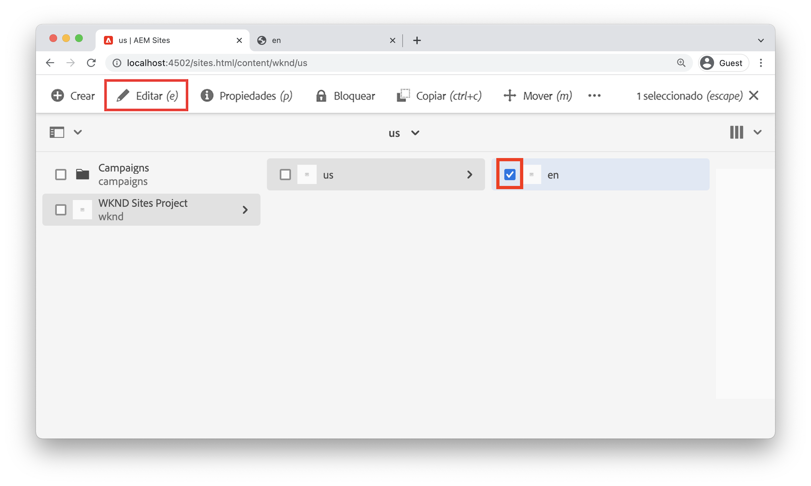
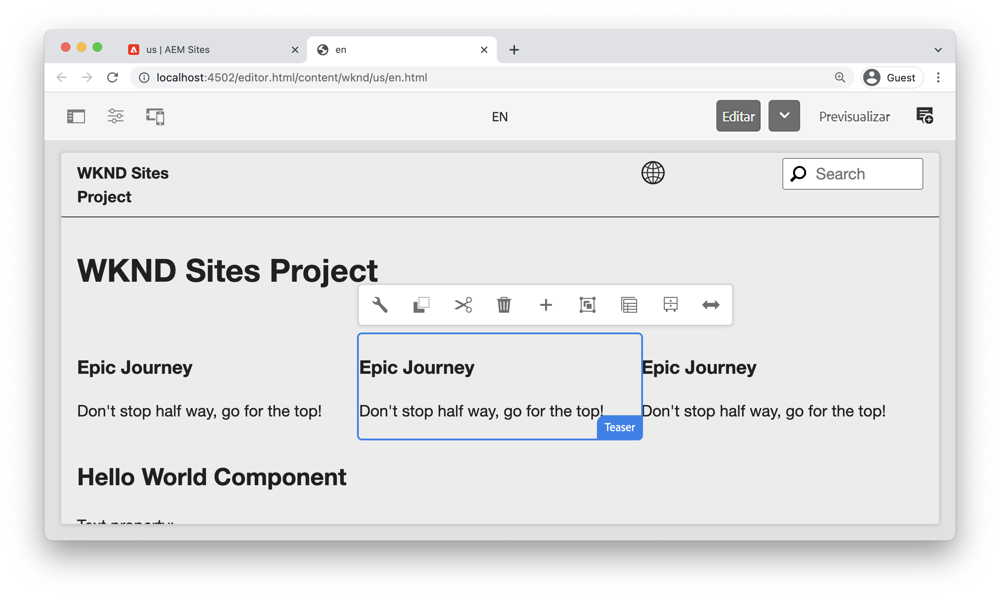
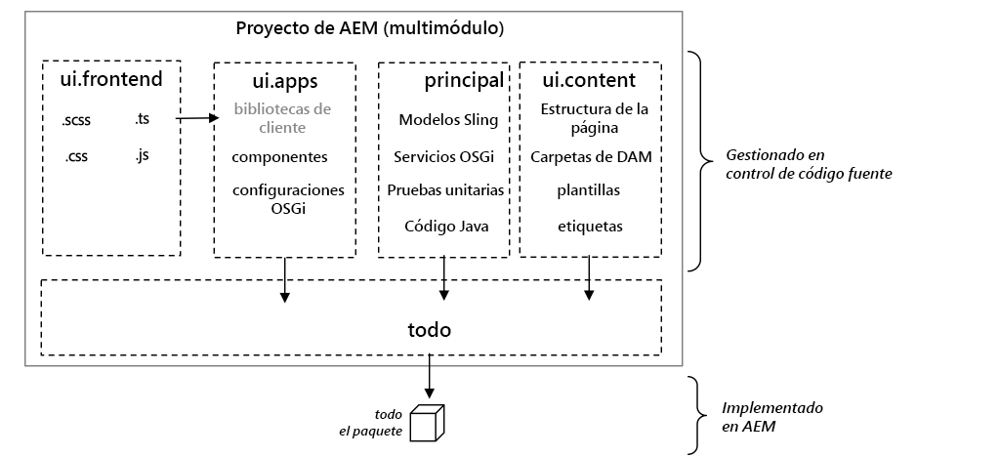
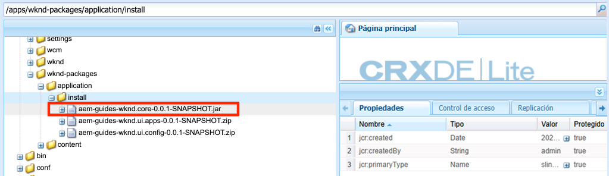
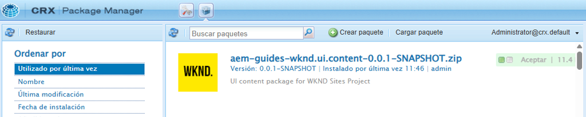

# Configuración del proyecto {#project-setup}

Este tutorial cubre la creación de un proyecto de módulo múltiple de Maven para administrar el código y las configuraciones de un sitio de Adobe Experience Manager.

## Requisitos previos {#prerequisites}

Revise las herramientas y las instrucciones necesarias para configurar un [entorno de desarrollo local](./overview.md#local-dev-environment). Asegúrese de que tiene una nueva instancia de Adobe Experience Manager disponible localmente y de que no se han instalado paquetes de muestra/demostración adicionales (que no sean paquetes de servicio obligatorios).

## Objetivo {#objective}

1. Obtenga información sobre cómo generar un nuevo proyecto de AEM con un arquetipo de Maven.
1. Comprenda los diferentes módulos generados por el tipo de archivo del proyecto de AEM y cómo funcionan juntos.
1. Descubra cómo se incluyen los componentes principales de AEM en un proyecto de AEM.

## Lo que va a generar {#what-build}

>[!VIDEO](https://video.tv.adobe.com/v/35883?quality=12&learn=on&captions=spa)

En este capítulo, se genera un nuevo proyecto de Adobe Experience Manager con el [Arquetipo de proyecto de AEM](https://github.com/adobe/aem-project-archetype). El proyecto de AEM contiene código, contenido y configuraciones completos utilizados para una implementación de Sites. El proyecto generado en este capítulo sirve de base para una implementación del sitio WKND y se basa en capítulos futuros.

**¿Qué es un proyecto Maven?** - [Apache Maven](https://maven.apache.org/) es una herramienta de administración de software para generar proyectos. *Todas las implementaciones de Adobe Experience Manager* utilizan proyectos Maven para generar, administrar e implementar código personalizado sobre AEM.

**¿Qué es un arquetipo de Maven?** - Un [arquetipo de Maven](https://maven.apache.org/archetype/index.html) es una plantilla o patrón para generar nuevos proyectos. El arquetipo de proyecto de AEM ayuda a generar un nuevo proyecto con un área de nombres personalizada e incluir una estructura de proyecto que siga las prácticas recomendadas, lo que acelera en gran medida el desarrollo del proyecto.

## Creación del proyecto {#create}

Hay un par de opciones para crear un proyecto de módulo múltiple de Maven para AEM. Este tutorial utiliza el [tipo de archivo del proyecto Maven AEM **35**](https://github.com/adobe/aem-project-archetype). Cloud Manager también [proporciona un asistente de interfaz de usuario](https://experienceleague.adobe.com/docs/experience-manager-cloud-manager/content/getting-started/project-creation/using-the-wizard.html?lang=es) para iniciar la creación de un proyecto de aplicación de AEM. El proyecto subyacente generado por la interfaz de usuario de Cloud Manager tiene la misma estructura que el uso directo del tipo de archivo.

>[!NOTE]
>
>Este tutorial utiliza la versión **35** del tipo de archivo. Se recomienda usar siempre la **última** versión del tipo de archivo para generar un nuevo proyecto.

La siguiente serie de pasos se realizará utilizando un terminal de línea de comandos basado en UNIX®, pero debe ser similar si utiliza un terminal de Windows.

1. Abra un terminal de línea de comandos. Compruebe que Maven está instalado:

   ```shell
   $ mvn --version
   Apache Maven 3.6.2
   Maven home: /Library/apache-maven-3.6.2
   Java version: 11.0.4, vendor: Oracle Corporation, runtime: /Library/Java/JavaVirtualMachines/jdk-11.0.4.jdk/Contents/Home
   ```

1. Vaya al directorio en el que desee generar el proyecto de AEM. Puede ser cualquier directorio en el que desee mantener el código fuente del proyecto. Por ejemplo, un directorio con el nombre `code` debajo del directorio principal del usuario:

   ```shell
   $ cd ~/code
   ```

1. Pegue lo siguiente en la línea de comandos para [generar el proyecto en modo por lotes](https://maven.apache.org/archetype/maven-archetype-plugin/examples/generate-batch.html):

   ```shell
   mvn -B org.apache.maven.plugins:maven-archetype-plugin:3.2.1:generate \
       -D archetypeGroupId=com.adobe.aem \
       -D archetypeArtifactId=aem-project-archetype \
       -D archetypeVersion=39 \
       -D appTitle="WKND Sites Project" \
       -D appId="wknd" \
       -D groupId="com.adobe.aem.guides" \
       -D artifactId="aem-guides-wknd" \
       -D package="com.adobe.aem.guides.wknd" \
       -D version="0.0.1-SNAPSHOT" \
       -D aemVersion="cloud"
   ```

   >[!NOTE]
   >
   > Para usar AEM 6.5.14+, reemplace `aemVersion="cloud"` por `aemVersion="6.5.14"`.
   >
   > Además, utilice siempre la última versión `archetypeVersion` haciendo referencia a [Arquetipo de proyecto de AEM > Uso](https://github.com/adobe/aem-project-archetype#usage)

   Encontrará una lista completa de las propiedades disponibles para configurar un proyecto [aquí](https://github.com/adobe/aem-project-archetype#available-properties).

1. El tipo de archivo Maven genera la siguiente estructura de carpetas y archivos en el sistema de archivos local:

   ```plain
    ~/code/
       |--- aem-guides-wknd/
           |--- all/
           |--- core/
           |--- ui.apps/
           |--- ui.apps.structure/
           |--- ui.config/
           |--- ui.content/
           |--- ui.frontend/
           |--- ui.tests /
           |--- it.tests/
           |--- dispatcher/
           |--- pom.xml
           |--- README.md
           |--- .gitignore
   ```

## Implementación y compilación del proyecto {#build}

Cree e implemente el código del proyecto en una instancia local de AEM.

1. Asegúrese de que tiene una instancia de autor de AEM que se ejecuta localmente en el puerto **4502**.
1. Desde la línea de comandos, vaya al directorio del proyecto `aem-guides-wknd`.

   ```shell
   $ cd aem-guides-wknd
   ```

1. Ejecute el siguiente comando para generar e implementar todo el proyecto en AEM:

   ```shell
   $ mvn clean install -PautoInstallSinglePackage
   ```

   La compilación tarda aproximadamente un minuto y debe finalizar con el siguiente mensaje:

   ```
   ...
   [INFO] ------------------------------------------------------------------------
   [INFO] Reactor Summary for WKND Sites Project 0.0.1-SNAPSHOT:
   [INFO] 
   [INFO] WKND Sites Project ................................. SUCCESS [  0.113 s]
   [INFO] WKND Sites Project - Core .......................... SUCCESS [  3.136 s]
   [INFO] WKND Sites Project - UI Frontend ................... SUCCESS [  4.461 s]
   [INFO] WKND Sites Project - Repository Structure Package .. SUCCESS [  0.359 s]
   [INFO] WKND Sites Project - UI apps ....................... SUCCESS [  1.732 s]
   [INFO] WKND Sites Project - UI content .................... SUCCESS [  0.956 s]
   [INFO] WKND Sites Project - UI config ..................... SUCCESS [  0.064 s]
   [INFO] WKND Sites Project - All ........................... SUCCESS [  8.229 s]
   [INFO] WKND Sites Project - Integration Tests ............. SUCCESS [  3.329 s]
   [INFO] WKND Sites Project - Dispatcher .................... SUCCESS [  0.027 s]
   [INFO] WKND Sites Project - UI Tests ...................... SUCCESS [  0.032 s]
   [INFO] ------------------------------------------------------------------------
   [INFO] BUILD SUCCESS
   [INFO] ------------------------------------------------------------------------
   [INFO] Total time:  23.189 s
   [INFO] Finished at: 2023-01-10T11:12:23-05:00
   [INFO] ------------------------------------------------------------------------    
   ```

   El perfil de Maven `autoInstallSinglePackage` compila los módulos individuales del proyecto e implementa un paquete único en la instancia de AEM. De manera predeterminada, este paquete se implementa en una instancia de AEM que se ejecuta localmente en el puerto **4502** y con las credenciales de `admin:admin`.

1. Vaya al Administrador de paquetes de la instancia local de AEM: [http://localhost:4502/crx/packmgr/index.jsp](http://localhost:4502/crx/packmgr/index.jsp). Debería ver los paquetes de `aem-guides-wknd.ui.apps`, `aem-guides-wknd.ui.config`, `aem-guides-wknd.ui.content` y `aem-guides-wknd.all`.

1. Vaya a la consola Sitios: [http://localhost:4502/sites.html/content](http://localhost:4502/sites.html/content). El sitio WKND es uno de los sitios. Incluye una estructura de sitio con una jerarquía de EE. UU. y maestros de idiomas. Esta jerarquía del sitio se basa en los valores de `language_country` y `isSingleCountryWebsite` al generar el proyecto mediante el arquetipo.

1. Para abrir la página **US** `>` **English**, seleccione la página y haga clic en el botón **Editar** de la barra de menús:

   

1. El contenido de inicio ya se ha creado y hay varios componentes disponibles para añadirlos a una página. Experimente con estos componentes para hacerse una idea de la funcionalidad. Aprenderá los conceptos básicos de un componente en el capítulo siguiente.

   

   *Contenido de muestra generado por el tipo de archivo*

## Inspeccionar el proyecto {#project-structure}

El proyecto de AEM generado está formado por módulos Maven individuales, cada uno con una función diferente. Este tutorial y la mayoría de los desarrollos se centran en estos módulos:

* [core](https://experienceleague.adobe.com/docs/experience-manager-core-components/using/developing/archetype/core.html?lang=es): código Java, principalmente desarrolladores back-end.
* [ui.frontend](https://experienceleague.adobe.com/docs/experience-manager-core-components/using/developing/archetype/uifrontend.html?lang=es): contiene código fuente para CSS, JavaScript, Sass y TypeScript, principalmente para desarrolladores de front-end.
* [ui.apps](https://experienceleague.adobe.com/docs/experience-manager-core-components/using/developing/archetype/uiapps.html?lang=es): contiene definiciones de componentes y cuadros de diálogo, incrusta CSS compilado y JavaScript como bibliotecas de cliente.
* [ui.content](https://experienceleague.adobe.com/docs/experience-manager-core-components/using/developing/archetype/uicontent.html?lang=es): contiene contenido estructural y configuraciones como plantillas editables, esquemas de metadatos (/content, /conf).

* **all**: se trata de un módulo Maven vacío que combina los módulos anteriores en un único paquete que se puede implementar en un entorno AEM.



Consulte la [Documentación del tipo de archivo del proyecto AEM](https://experienceleague.adobe.com/docs/experience-manager-core-components/using/developing/archetype/overview.html?lang=es) para obtener más información sobre **todos** los módulos Maven.

### Inclusión de componentes principales {#core-components}

[Los componentes principales de AEM](https://experienceleague.adobe.com/docs/experience-manager-core-components/using/introduction.html?lang=es) son un conjunto de componentes estandarizados de administración de contenido web (WCM) para AEM. Estos componentes proporcionan un conjunto de líneas de base de una funcionalidad y están diseñados, personalizados y ampliados para proyectos individuales.

El entorno de AEM as a Cloud Service incluye la versión más reciente de [Componentes principales de AEM](https://experienceleague.adobe.com/docs/experience-manager-core-components/using/introduction.html?lang=es). Por lo tanto, los proyectos generados para AEM as a Cloud Service **no** incluyen una incrustación de componentes principales de AEM.

Para los proyectos generados por AEM 6.5/6.4, el tipo de archivo incrusta automáticamente [Componentes principales de AEM](https://experienceleague.adobe.com/docs/experience-manager-core-components/using/introduction.html?lang=es) en el proyecto. Se recomienda que AEM 6.5/6.4 incruste los componentes principales de AEM para garantizar que se implementa la versión más reciente con el proyecto. Encontrará más información sobre los componentes principales [incluidos en el proyecto aquí](https://experienceleague.adobe.com/docs/experience-manager-core-components/using/developing/archetype/using.html?lang=es#core-components).

## Source Control Management {#source-control}

Siempre es aconsejable utilizar algún tipo de control de código fuente para administrar el código en la aplicación. Este tutorial utiliza Git y GitHub. Existen varios archivos generados por Maven o por el IDE de su elección que el SCM debe ignorar.

Maven crea una carpeta de destino cada vez que crea e instala el paquete de código. La carpeta de destino y el contenido deben excluirse del SCM.

En, el módulo `ui.apps` observa que se han creado muchos archivos `.content.xml`. Estos archivos XML asignan los tipos de nodo y las propiedades del contenido instalado en el JCR. Estos archivos son esenciales y **no se puede** omitir.

El tipo de archivo del proyecto AEM genera un archivo de muestra `.gitignore` que puede utilizarse como punto de partida para los archivos que se pueden omitir de forma segura. El archivo se genera en `<src>/aem-guides-wknd/.gitignore`.

## Enhorabuena. {#congratulations}

¡Felicidades, ha creado su primer proyecto de AEM!

### Siguientes pasos {#next-steps}

Comprenda la tecnología subyacente de un componente de sitios de Adobe Experience Manager (AEM) mediante un ejemplo sencillo de `HelloWorld` con el tutorial [Conceptos básicos del componente](component-basics.md).

## Comandos avanzados de Maven (bonus) {#advanced-maven-commands}

Durante el desarrollo, es posible que esté trabajando con solo uno de los módulos y desee evitar crear todo el proyecto para ahorrar tiempo. También es posible que desee implementar directamente en una instancia de publicación de AEM o quizás en una instancia de AEM que no se ejecute en el puerto 4502.

A continuación, vamos a revisar algunos perfiles y comandos de Maven adicionales que puede utilizar para obtener una mayor flexibilidad durante el desarrollo.

### Módulo principal {#core-module}

El módulo **[core](https://experienceleague.adobe.com/docs/experience-manager-core-components/using/developing/archetype/core.html?lang=es)** contiene todo el código Java™ asociado con el proyecto. La compilación del módulo **core** implementa un paquete OSGi en AEM. Para generar solo este módulo:

1. Vaya a la carpeta `core` (debajo de `aem-guides-wknd`):

   ```shell
   $ cd core/
   ```

1. Ejecute el siguiente comando:

   ```shell
   $ mvn clean install -PautoInstallBundle
   ...
   [INFO] --- sling-maven-plugin:2.4.0:install (install-bundle) @ aem-guides-wknd.core ---
   [INFO] Installing Bundle aem-guides-wknd.core(~/code/aem-guides-wknd/core/target/aem-guides-wknd.core-0.0.1-SNAPSHOT.jar) to http://localhost:4502/system/console via WebConsole
   [INFO] Bundle installed
   [INFO] ------------------------------------------------------------------------
   [INFO] BUILD SUCCESS
   [INFO] ------------------------------------------------------------------------
   [INFO] Total time:  8.558 s
   ```

1. Vaya a [http://localhost:4502/system/console/bundles](http://localhost:4502/system/console/bundles). Esta es la consola web de OSGi y contiene información sobre todos los paquetes instalados en la instancia de AEM.

1. Cambie la columna de ordenación **Id** para ver el paquete WKND instalado y activo.

   

1. Puede ver la ubicación &quot;física&quot; del JAR en [CRXDE-Lite](http://localhost:4502/crx/de/index.jsp#/apps/wknd-packages/application/install/aem-guides-wknd.core-1.0.0-SNAPSHOT.jar):

   

### Módulos Ui.apps y Ui.content {#apps-content-module}

El módulo **[ui.apps](https://experienceleague.adobe.com/docs/experience-manager-core-components/using/developing/archetype/uiapps.html?lang=es)** de maven contiene todo el código de procesamiento necesario para el sitio debajo de `/apps`. Esto incluye CSS/JS que se almacena en un formato de AEM llamado [clientlibs](https://experienceleague.adobe.com/docs/experience-manager-65/developing/introduction/clientlibs.html?lang=es). Esto también incluye [scripts HTL](https://experienceleague.adobe.com/docs/experience-manager-htl/content/overview.html?lang=es) para procesar HTML dinámico. El módulo **ui.apps** se puede considerar como un mapa de la estructura del JCR pero en un formato que se puede almacenar en un sistema de archivos y comprometerse con el control de código fuente. El módulo **ui.apps** solo contiene código.

Para generar solo este módulo:

1. Desde la línea de comandos. Vaya a la carpeta `ui.apps` (debajo de `aem-guides-wknd`):

   ```shell
   $ cd ../ui.apps
   ```

1. Ejecute el siguiente comando:

   ```shell
   $ mvn clean install -PautoInstallPackage
   ...
   Package installed in 70ms.
   [INFO] ------------------------------------------------------------------------
   [INFO] BUILD SUCCESS
   [INFO] ------------------------------------------------------------------------
   [INFO] Total time:  2.987 s
   [INFO] Finished at: 2023-01-10T11:35:28-05:00
   [INFO] ------------------------------------------------------------------------
   ```

1. Vaya a [http://localhost:4502/crx/packmgr/index.jsp](http://localhost:4502/crx/packmgr/index.jsp). Debería ver el paquete `ui.apps` como el primer paquete instalado y debería tener una marca de tiempo más reciente que cualquiera de los demás paquetes.

   

1. Vuelva a la línea de comandos y ejecute el siguiente comando (en la carpeta `ui.apps`):

   ```shell
   $ mvn -PautoInstallPackagePublish clean install
   ...
   [INFO] --- content-package-maven-plugin:1.0.2:install (install-package-publish) @ aem-guides-wknd.ui.apps ---
   [INFO] Installing aem-guides-wknd.ui.apps (/Users/sachinmali/Desktop/code/wknd-tutorial/aem-guides-wknd/ui.apps/target/aem-guides-wknd.ui.apps-0.0.1-SNAPSHOT.zip) to http://localhost:4503/crx/packmgr/service.jsp
   [INFO] I/O exception (java.net.ConnectException) caught when processing request: Connection refused (Connection refused)
   [INFO] Retrying request
   [INFO] I/O exception (java.net.ConnectException) caught when processing request: Connection refused (Connection refused)
   [INFO] Retrying request
   [INFO] I/O exception (java.net.ConnectException) caught when processing request: Connection refused (Connection refused)
   [INFO] Retrying request
   [INFO] ------------------------------------------------------------------------
   [INFO] BUILD FAILURE
   [INFO] ------------------------------------------------------------------------
   [INFO] Total time:  2.812 s
   [INFO] Finished at: 2023-01-10T11:37:28-05:00
   [INFO] ------------------------------------------------------------------------
   [ERROR] Failed to execute goal com.day.jcr.vault:content-package-maven-plugin:1.0.2:install (install-package-publish) on project aem-guides-wknd.ui.apps: Connection refused (Connection refused) -> [Help 1]
   ```

   El perfil `autoInstallPackagePublish` está diseñado para implementar el paquete en un entorno de publicación que se ejecute en el puerto **4503**. Se espera el error anterior si no se encuentra una instancia de AEM que se ejecute en http://localhost:4503.

1. Finalmente, ejecute el siguiente comando para implementar el paquete `ui.apps` en el puerto **4504**:

   ```shell
   $ mvn -PautoInstallPackage clean install -Daem.port=4504
   ...
   [INFO] --- content-package-maven-plugin:1.0.2:install (install-package) @ aem-guides-wknd.ui.apps ---
   [INFO] Installing aem-guides-wknd.ui.apps (/Users/dgordon/code/aem-guides-wknd/ui.apps/target/aem-guides-wknd.ui.apps-0.0.1-SNAPSHOT.zip) to http://localhost:4504/crx/packmgr/service.jsp
   [INFO] I/O exception (java.net.ConnectException) caught when processing request: Connection refused (Connection refused)
   [INFO] Retrying request
   [INFO] I/O exception (java.net.ConnectException) caught when processing request: Connection refused (Connection refused)
   [INFO] Retrying request
   [INFO] I/O exception (java.net.ConnectException) caught when processing request: Connection refused (Connection refused)
   [INFO] Retrying request
   [INFO] ------------------------------------------------------------------------
   [INFO] BUILD FAILURE
   [INFO] --------------------------------------------------------------------
   ```

   De nuevo, se espera que se produzca un error de compilación si no hay ninguna instancia de AEM que se ejecute en el puerto **4504** disponible. El parámetro `aem.port` está definido en el archivo POM en `aem-guides-wknd/pom.xml`.

El módulo **[ui.content](https://experienceleague.adobe.com/docs/experience-manager-core-components/using/developing/archetype/uicontent.html?lang=es)** tiene la misma estructura que el módulo **ui.apps**. La única diferencia es que el módulo **ui.content** contiene lo que se conoce como contenido **mutable**. El contenido **Mutable** hace referencia esencialmente a configuraciones que no son de código, como plantillas, directivas o estructuras de carpetas almacenadas en el control de código fuente **pero** se pueden modificar directamente en una instancia de AEM. Esto se analiza con más detalle en el capítulo sobre páginas y plantillas.

Los mismos comandos Maven usados para compilar el módulo **ui.apps** pueden usarse para compilar el módulo **ui.content**. No dude en repetir los pasos anteriores desde la carpeta **ui.content**.

## Solución de problemas

Si hay algún problema al generar el proyecto mediante el tipo de archivo del proyecto de AEM, consulte la lista de [problemas conocidos](https://github.com/adobe/aem-project-archetype#known-issues) y la lista de [problemas abiertos](https://github.com/adobe/aem-project-archetype/issues).

## ¡Felicitaciones otra vez! {#congratulations-bonus}

Felicitaciones, por revisar el material de la bonificación.

### Siguientes pasos {#next-steps-bonus}

Comprenda la tecnología subyacente de un componente de sitios de Adobe Experience Manager (AEM) mediante un ejemplo sencillo de `HelloWorld` con el tutorial [Conceptos básicos del componente](component-basics.md).
