# Desarrollo con el sistema de estilos {#developing-with-the-style-system}

Aprenda a implementar estilos individuales y a reutilizar componentes principales mediante el sistema de estilos de Experience Manager. Este tutorial trata el desarrollo del sistema de estilos para ampliar los componentes principales con CSS específica de la marca y las configuraciones de políticas avanzadas del Editor de plantillas.

## Requisitos previos {#prerequisites}

Revise las herramientas e instrucciones necesarias para configurar un [entorno de desarrollo local](overview.md#local-dev-environment).

También se recomienda revisar la [Bibliotecas del lado del cliente y flujo de trabajo del front-end](client-side-libraries.md) tutorial para comprender los aspectos básicos de las bibliotecas del lado del cliente y las distintas herramientas front-end integradas en el proyecto de AEM.

### Proyecto de inicio

>[!NOTE]
>
> Si ha completado correctamente el capítulo anterior, puede volver a utilizar el proyecto y omitir los pasos para extraer el proyecto de inicio.

Consulte el código de línea base sobre el que se basa el tutorial:

1. Consulte la `tutorial/style-system-start` ramificación desde [GitHub](https://github.com/adobe/aem-guides-wknd)

   ```shell
   $ cd aem-guides-wknd
   $ git checkout tutorial/style-system-start
   ```

1. Implemente código base en una instancia de AEM local con sus habilidades con Maven:

   ```shell
   $ mvn clean install -PautoInstallSinglePackage
   ```

   >[!NOTE]
   >
   > Si utiliza AEM 6.5 o 6.4, añada la variable `classic` perfil a cualquier comando Maven.

   ```shell
   $ mvn clean install -PautoInstallSinglePackage -Pclassic
   ```

Siempre puede ver el código terminado en [GitHub](https://github.com/adobe/aem-guides-wknd/tree/tutorial/style-system-solution) o desproteja el código localmente cambiando a la rama `tutorial/style-system-solution`.

## Objetivo

1. Aprenda a utilizar el sistema de estilos para aplicar CSS específica de la marca a AEM componentes principales.
1. Obtenga más información sobre la notación BEM y cómo se puede utilizar para aplicar un enfoque cuidadoso a los estilos.
1. Aplique configuraciones de directiva avanzadas con plantillas editables.

## Qué va a generar {#what-you-will-build}

En este capítulo utilizaremos la variable [Función del sistema de estilos](https://experienceleague.adobe.com/docs/experience-manager-learn/sites/page-authoring/style-system-feature-video-use.html) para crear variaciones del **Título** y **Texto** componentes utilizados en la página Artículo .

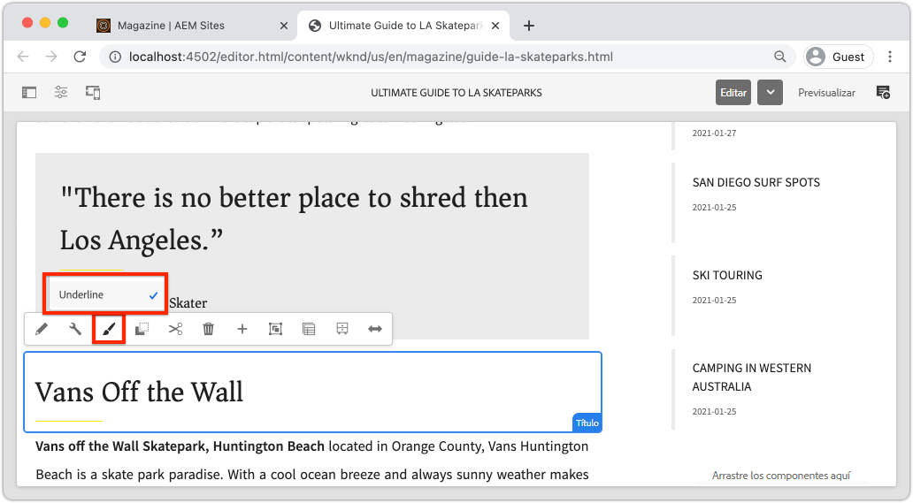

*Estilo de subrayado disponible para usar en el componente de título*

## Fondo {#background}

La variable [Sistema de estilos](https://experienceleague.adobe.com/docs/experience-manager-65/authoring/siteandpage/style-system.html) permite a los desarrolladores y editores de plantillas crear varias variaciones visuales de un componente. A su vez, los autores pueden decidir qué estilo utilizar al componer una página. Aprovecharemos el sistema de estilos en el resto del tutorial para lograr varios estilos únicos, mientras aprovechamos los componentes principales en un enfoque de código bajo.

La idea general del sistema de estilos es que los autores puedan elegir distintos estilos de aspecto de un componente. Los &quot;estilos&quot; están respaldados por clases CSS adicionales que se insertan en el div exterior de un componente. En las bibliotecas de cliente, las reglas CSS se añaden en función de estas clases de estilo para que el componente cambie de aspecto.

Puede encontrar [documentación detallada de Style System aquí](https://experienceleague.adobe.com/docs/experience-manager-cloud-service/sites/authoring/features/style-system.html?lang=es). También hay un bueno [vídeo técnico para comprender el sistema de estilos](https://experienceleague.adobe.com/docs/experience-manager-learn/sites/developing/style-system-technical-video-understand.html).

## Estilo de subrayado: título {#underline-style}

La variable [Componente de título](https://experienceleague.adobe.com/docs/experience-manager-core-components/using/components/title.html) se ha procesado como proxy en el proyecto en `/apps/wknd/components/title` como parte del **ui.apps** módulo. Los estilos predeterminados de los elementos Encabezado (`H1`, `H2`, `H3`...) ya se han implementado en el **ui.frontend** módulo.

La variable [Diseños de artículos WKND](assets/pages-templates/wknd-article-design.xd) contiene un estilo único para el componente Título con un subrayado. En lugar de crear dos componentes o modificar el cuadro de diálogo de componentes, se puede utilizar el sistema de estilos para permitir a los autores añadir un estilo de subrayado.


### Agregar una directiva de título

Añada una nueva política para los componentes Título para permitir que los autores de contenido elijan el estilo Subrayado que se aplicará a componentes específicos. Esto se realiza con el Editor de plantillas en AEM.

1. Vaya a la **Página de artículos** plantilla ubicada en: [http://localhost:4502/editor.html/conf/wknd/settings/wcm/templates/article-page/structure.html](http://localhost:4502/editor.html/conf/wknd/settings/wcm/templates/article-page/structure.html)

1. En **Estructura** en el modo principal **Contenedor de diseño**, seleccione **Política** junto al icono **Título** componente enumerado en *Componentes permitidos*:

   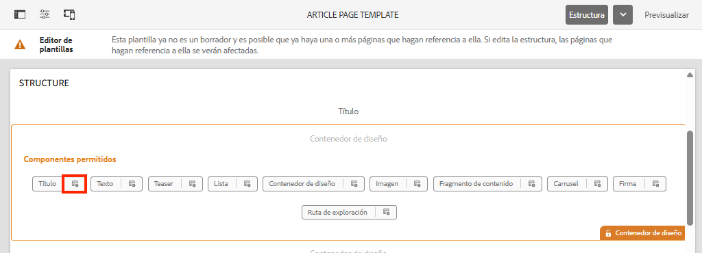

1. Cree una nueva directiva para el componente Título con los siguientes valores:

   *Título de la política **: **Título WKND**

   *Propiedades* > *Pestaña Estilos* > *Agregar un nuevo estilo*

   **Subrayado** : `cmp-title--underline`

   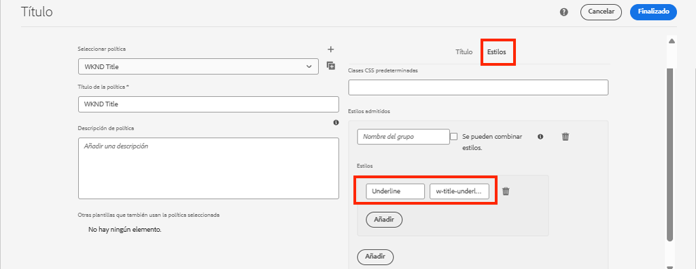

   Haga clic en **Listo** para guardar los cambios en la directiva Título.

   >[!NOTE]
   >
   > El valor `cmp-title--underline` rellena la clase CSS en el div exterior del marcado del HTML del componente.

### Aplicar estilo de subrayado

Como autor, aplique el estilo de subrayado a ciertos componentes del título.

1. Vaya a la **Parques de esquí La** en el editor de AEM Sites en: [http://localhost:4502/editor.html/content/wknd/us/en/magazine/guide-la-skateparks.html](http://localhost:4502/editor.html/content/wknd/us/en/magazine/guide-la-skateparks.html)
1. En **Editar** seleccione un componente Título . Haga clic en el **pincel** y seleccione **Subrayado** estilo:

   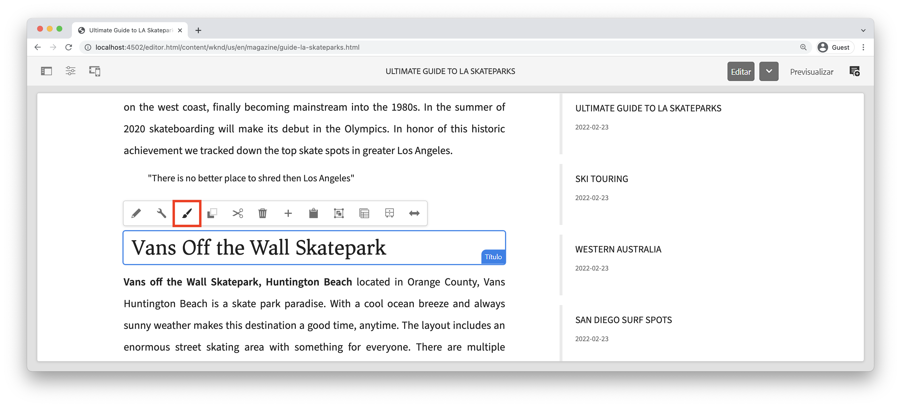

   >[!NOTE]
   >
   > En este momento no se producirá ningún cambio visible como la variable `underline` no se ha implementado. En el siguiente ejercicio se implementa este estilo.

1. Haga clic en el **Información de la página** icono > **Ver tal y como aparece publicado** para inspeccionar la página fuera de AEM editor.
1. Utilice las herramientas para desarrolladores del navegador para verificar que el marcado alrededor del componente Título tenga la clase CSS `cmp-title--underline` aplicado al div exterior.

   

   ```html
   <div class="title cmp-title--underline">
       <div data-cmp-data-layer="{&quot;title-b6450e9cab&quot;:{&quot;@type&quot;:&quot;wknd/components/title&quot;,&quot;repo:modifyDate&quot;:&quot;2022-02-23T17:34:42Z&quot;,&quot;dc:title&quot;:&quot;Vans Off the Wall Skatepark&quot;}}" 
       id="title-b6450e9cab" class="cmp-title">
           <h2 class="cmp-title__text">Vans Off the Wall Skatepark</h2>
       </div>
   </div>
   ```

### Implementar el estilo de subrayado: ui.frontend

A continuación, implemente el estilo Subrayado utilizando la variable **ui.frontend** módulo de nuestro proyecto. Utilizaremos el servidor de desarrollo de webpack que está empaquetado con la variable **ui.frontend** módulo para previsualizar los estilos *before* implementación en una instancia local de AEM.

1. Inicie el `watch` procesar desde dentro de **ui.frontend** módulo:

   ```shell
   $ cd ~/code/aem-guides-wknd/ui.frontend/
   $ npm run watch
   ```

   Esto iniciará un proceso que supervise los cambios en la variable `ui.frontend` y sincronice los cambios en la instancia de AEM.


1. Devuelva el IDE y abra el archivo `_title.scss` ubicado en: `ui.frontend/src/main/webpack/components/_title.scss`.
1. Introduzca una nueva regla dirigida a la variable `cmp-title--underline` Clase :

   ```scss
   /* Default Title Styles */
   .cmp-title {}
   .cmp-title__text {}
   .cmp-title__link {}
   
   /* Add Title Underline Style */
   .cmp-title--underline {
       .cmp-title__text {
           &:after {
           display: block;
               width: 84px;
               padding-top: 8px;
               content: '';
               border-bottom: 2px solid $brand-primary;
           }
       }
   }
   ```

   >[!NOTE]
   >
   >Se considera una práctica recomendada enmarcar siempre los estilos de ámbito al componente de destino. Esto garantiza que los estilos adicionales no afecten a otras áreas de la página.
   >
   >Todos los componentes principales se adhieren a **[Anotación BEM](https://github.com/adobe/aem-core-wcm-components/wiki/css-coding-conventions)**. Se recomienda dirigirse a la clase CSS externa al crear un estilo predeterminado para un componente. Otra práctica recomendada es dirigirse a los nombres de clase especificados por la notación BEM de los componentes principales en lugar de a los elementos de HTML.

1. Vuelva al explorador y a la página AEM. Debería ver el estilo Subrayado añadido:

   

1. En el editor de AEM, debería poder activar y desactivar el **Subrayado** y vea los cambios reflejados visualmente.

## Estilo de bloque de comillas - Texto {#text-component}

A continuación, repita pasos similares para aplicar un estilo único al [Componente de texto](https://experienceleague.adobe.com/docs/experience-manager-core-components/using/components/text.html). El componente Texto se ha procesado como proxy en el proyecto en `/apps/wknd/components/text` como parte del **ui.apps** módulo. Los estilos predeterminados de los elementos de párrafo ya se han implementado en la variable **ui.frontend**.

La variable [Diseños de artículos WKND](assets/pages-templates/wknd-article-design.xd) contiene un estilo único para el componente Texto con un bloque de comillas:


### Agregar una directiva de texto

A continuación, añada una nueva política para los componentes Texto .

1. Vaya a la **Plantilla de página de artículo** ubicado en: [http://localhost:4502/editor.html/conf/wknd/settings/wcm/templates/article-page/structure.html](http://localhost:4502/editor.html/conf/wknd/settings/wcm/templates/article-page/structure.html).

1. En **Estructura** en el modo principal **Contenedor de diseño**, seleccione **Política** junto al icono **Texto** componente enumerado en *Componentes permitidos*:

   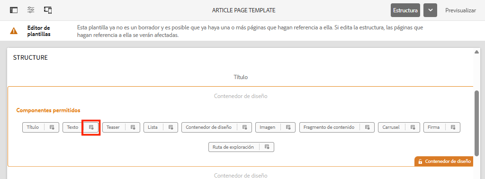

1. Actualice la política del componente Texto con los siguientes valores:

   *Título de la política **: **Texto de contenido**

   *Complementos* > *Estilos de párrafo* > *Habilitar estilos de párrafo*

   *Pestaña Estilos* > *Agregar un nuevo estilo*

   **Bloque de cotización** : `cmp-text--quote`

   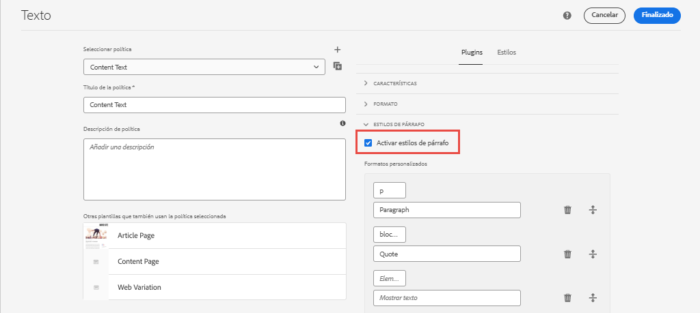

   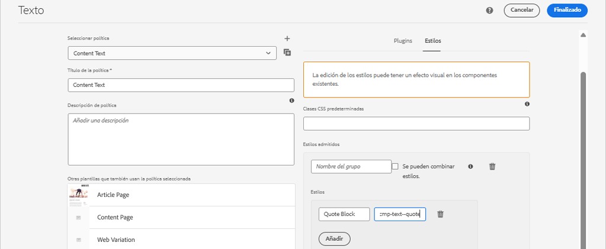

   Haga clic en **Listo** para guardar los cambios en la directiva Texto .

### Aplicar estilo de bloque de cotización

1. Vaya a la **Parques de esquí La** en el editor de AEM Sites en: [http://localhost:4502/editor.html/content/wknd/us/en/magazine/guide-la-skateparks.html](http://localhost:4502/editor.html/content/wknd/us/en/magazine/guide-la-skateparks.html)
1. En **Editar** seleccione un componente Texto . Edite el componente para incluir un elemento de presupuesto:

   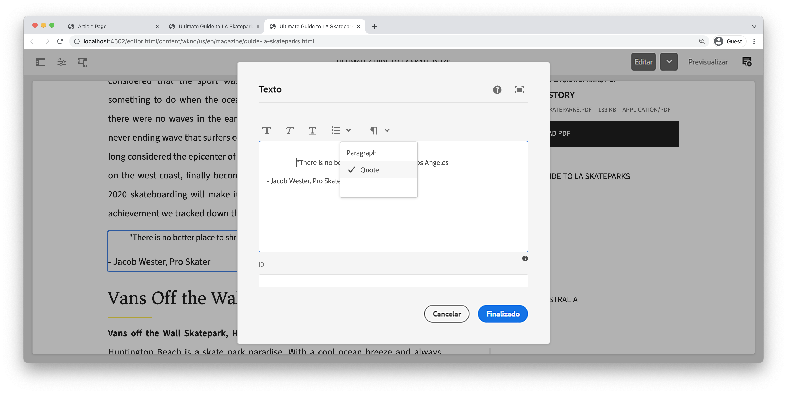

1. Seleccione el componente de texto y haga clic en el botón **pincel** y seleccione **Bloque de cotización** estilo:

   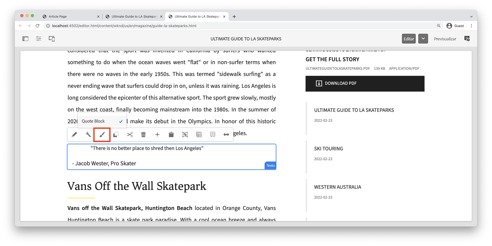

1. Utilice las herramientas para desarrolladores del navegador para inspeccionar el marcado. Debería ver el nombre de la clase `cmp-text--quote` se ha añadido al div externo del componente:

   ```html
   <!-- Quote Block style class added -->
   <div class="text cmp-text--quote">
       <div data-cmp-data-layer="{&quot;text-60910f4b8d&quot;:{&quot;@type&quot;:&quot;wknd/components/text&quot;,&quot;repo:modifyDate&quot;:&quot;2022-02-24T00:55:26Z&quot;,&quot;xdm:text&quot;:&quot;<blockquote>&amp;nbsp; &amp;nbsp; &amp;nbsp;&amp;quot;There is no better place to shred then Los Angeles&amp;quot;</blockquote>\r\n<p>- Jacob Wester, Pro Skater</p>\r\n&quot;}}" id="text-60910f4b8d" class="cmp-text">
           <blockquote>&nbsp; &nbsp; &nbsp;"There is no better place to shred then Los Angeles"</blockquote>
           <p>- Jacob Wester, Pro Skater</p>
       </div>
   </div>
   ```

### Implementar el estilo de bloque de comillas: ui.frontend

A continuación, implementaremos el estilo de Bloque de comillas con la variable **ui.frontend** módulo de nuestro proyecto.

1. Si aún no se está ejecutando, inicie el `watch` procesar desde dentro de **ui.frontend** módulo:

   ```shell
   $ npm run watch
   ```

1. Actualizar el archivo `text.scss` ubicado en: `ui.frontend/src/main/webpack/components/_text.scss`:

   ```css
   /* Default text style */
   .cmp-text {}
   .cmp-text__paragraph {}
   
   /* WKND Text Quote style */
   .cmp-text--quote {
       .cmp-text {
           background-color: $brand-third;
           margin: 1em 0em;
           padding: 1em;
   
           blockquote {
               border: none;
               font-size: $font-size-large;
               font-family: $font-family-serif;
               padding: 14px 14px;
               margin: 0;
               margin-bottom: 0.5em;
   
               &:after {
                   border-bottom: 2px solid $brand-primary; /*yellow border */
                   content: '';
                   display: block;
                   position: relative;
                   top: 0.25em;
                   width: 80px;
               }
           }
           p {
               font-family:  $font-family-serif;
           }
       }
   }
   ```

   >[!CAUTION]
   >
   > En este caso, los elementos de HTML sin procesar se dirigen a los estilos. Esto se debe a que el componente Texto proporciona un Editor de texto enriquecido para los autores de contenido. La creación de estilos directamente contra el contenido de RTE debe hacerse con cuidado y es aún más importante adaptar los estilos.

1. Vuelva al explorador una vez más y debería ver el estilo de bloque Cita añadido:

   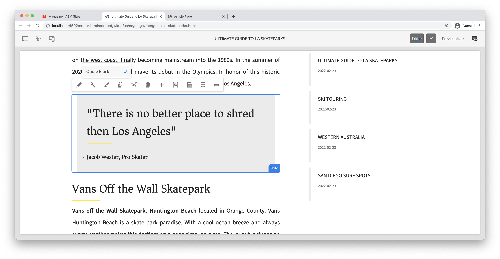

1. Detenga el servidor de desarrollo de webpack.

## Ancho fijo - Contenedor (bono) {#layout-container}

Los componentes de contenedor se han utilizado para crear la estructura básica de la plantilla de página de artículo y proporcionar las zonas de colocación para que los autores de contenido añadan contenido en una página. Los contenedores también pueden aprovechar el sistema de estilos, lo que proporciona a los autores de contenido aún más opciones para diseñar diseños.

La variable **Contenedor principal** de la plantilla Página del artículo contiene los dos contenedores que se pueden crear y tiene una anchura fija.

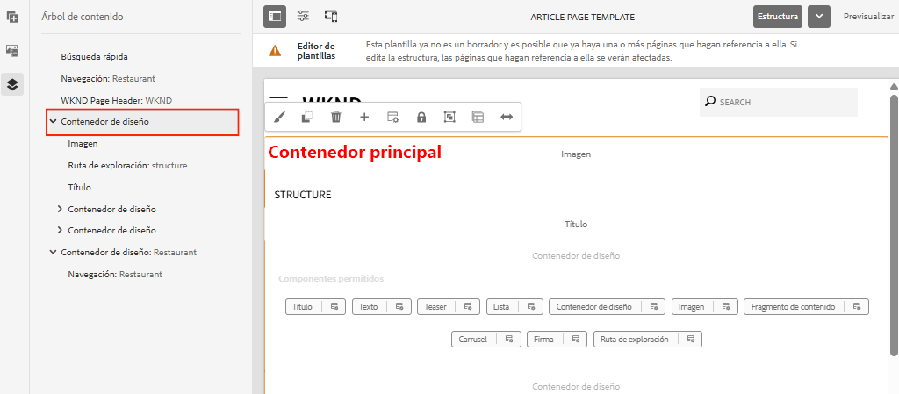

*Contenedor principal en la plantilla de página de artículo*.

La política de **Contenedor principal** establece el elemento predeterminado como `main`:

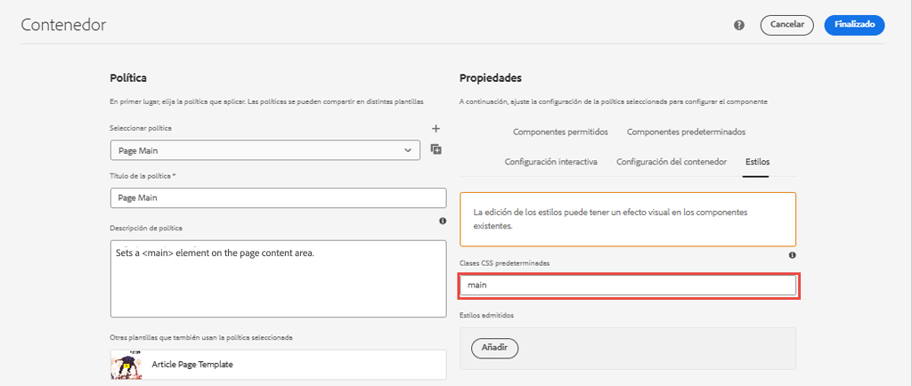

El CSS que crea la variable **Contenedor principal** fijo se configura en la variable **ui.frontend** módulo en `ui.frontend/src/main/webpack/site/styles/container_main.scss` :

```SCSS
main.container {
    padding: .5em 1em;
    max-width: $max-content-width;
    float: unset!important;
    margin: 0 auto!important;
    clear: both!important;
}
```

En lugar de segmentar el `main` elemento HTML, el sistema de estilos se puede usar para crear un **Anchura fija** como parte de la directiva Contenedor. El sistema de estilos podría dar a los usuarios la opción de alternar entre **Anchura fija** y **Anchura fluida** contenedores.

1. **Desafío para una bonificación** - utilizar las lecciones aprendidas de ejercicios anteriores y utilizar el sistema de estilos para implementar un **Anchura fija** y **Anchura fluida** estilos para el componente Contenedor.

## Felicitaciones! {#congratulations}

Felicidades, la página de artículos está casi completamente diseñada y usted ganó experiencia práctica usando el sistema de estilos AEM.

### Siguientes pasos {#next-steps}

Conozca los pasos de principio a fin para crear un [componente AEM personalizado](custom-component.md) que muestra el contenido creado en un cuadro de diálogo y explora el desarrollo de un modelo de Sling para encapsular la lógica empresarial que rellena el HTL del componente.

Ver el código terminado en [GitHub](https://github.com/adobe/aem-guides-wknd) o revisar e implementar el código localmente en la rama Git `tutorial/style-system-solution`.

1. Clonar el [github.com/adobe/aem-wknd-guides](https://github.com/adobe/aem-guides-wknd) repositorio.
1. Consulte la `tutorial/style-system-solution` rama.
