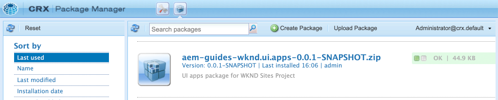

# Configuración del proyecto {#project-setup}

Este tutorial trata la creación de un proyecto de módulo múltiple de Maven para administrar el código y las configuraciones de un sitio de Adobe Experience Manager.

## Requisitos previos {#prerequisites}

Revise las herramientas e instrucciones necesarias para configurar un [entorno de desarrollo local](overview.md#local-dev-environment). Asegúrese de que tiene una nueva instancia de Adobe Experience Manager disponible localmente y de que no se han instalado paquetes de muestra/demostración adicionales (que no sean los Service Packs requeridos).

## Objetivo {#objective}

1. Obtenga información sobre cómo generar un nuevo proyecto de AEM con un tipo de archivo Maven.
1. Comprender los diferentes módulos generados por el tipo de archivo del proyecto AEM y cómo funcionan juntos.
1. Comprender cómo se incluyen AEM componentes principales en un proyecto AEM.

## Qué va a generar {#what-build}

>[!VIDEO](https://video.tv.adobe.com/v/30152/?quality=12&learn=on)

En este capítulo, generará un nuevo proyecto de Adobe Experience Manager con el [AEM tipo de archivo del proyecto](https://github.com/adobe/aem-project-archetype). El proyecto de AEM contiene todo el código, el contenido y las configuraciones utilizadas para una implementación de Sites. El proyecto generado en este capítulo servirá de base para la implementación del sitio WKND y se basará en futuros capítulos.

**¿Qué es un proyecto Maven?** -  [Apache ](https://maven.apache.org/) Mavenis es una herramienta de gestión de software para construir proyectos. *Todas las implementaciones de Adobe Experience* Manager utilizan proyectos de Maven para crear, administrar e implementar código personalizado sobre AEM.

**¿Qué es un arquetipo de Maven?** - Un  [arquetipo ](https://maven.apache.org/archetype/index.html) Maven es una plantilla o patrón para generar nuevos proyectos. El arquetipo de proyecto AEM permite generar un nuevo proyecto con un área de nombres personalizada e incluir una estructura de proyecto que siga las prácticas recomendadas, lo que acelera enormemente nuestro proyecto.

## Crear el proyecto {#create}

Hay un par de opciones para crear un proyecto de Maven Multi-module para AEM. Este tutorial utilizará el tipo de archivo [Maven AEM Project **25**](https://github.com/adobe/aem-project-archetype). Cloud Manager también [proporciona un asistente de IU](https://docs.adobe.com/content/help/en/experience-manager-cloud-manager/using/getting-started/create-an-application-project.html) para iniciar la creación de un proyecto de aplicación AEM. El proyecto subyacente generado por la interfaz de usuario de Cloud Manager resulta en la misma estructura que el uso directo del tipo de archivo.

>[!NOTE]
>
>Este tutorial utiliza la versión **25** del tipo de archivo. Siempre es recomendable utilizar la versión **más reciente** del tipo de archivo para generar un nuevo proyecto.

La siguiente serie de pasos se realizará utilizando un terminal de línea de comandos basado en UNIX, pero debe ser similar si se utiliza un terminal de Windows.

1. Abra un terminal de línea de comandos. Compruebe que Maven está instalado:

   ```shell
   $ mvn --version
   Apache Maven 3.6.2
   Maven home: /Library/apache-maven-3.6.2
   Java version: 11.0.4, vendor: Oracle Corporation, runtime: /Library/Java/JavaVirtualMachines/jdk-11.0.4.jdk/Contents/Home
   ```

1. Compruebe que el perfil **adobe-public** esté activo ejecutando el siguiente comando:

   ```shell
   $ mvn help:effective-settings
       ...
   <activeProfiles>
       <activeProfile>adobe-public</activeProfile>
   </activeProfiles>
   <pluginGroups>
       <pluginGroup>org.apache.maven.plugins</pluginGroup>
       <pluginGroup>org.codehaus.mojo</pluginGroup>
   </pluginGroups>
   </settings>
   [INFO] ------------------------------------------------------------------------
   [INFO] BUILD SUCCESS
   [INFO] ------------------------------------------------------------------------
   [INFO] Total time:  0.856 s
   ```

   Si **no** ve el **adobe-public** esto indica que no se hace referencia al repositorio de Adobe correctamente en su archivo `~/.m2/settings.xml`. Vuelva a los pasos para instalar y configurar Apache Maven en [un entorno de desarrollo local](https://docs.adobe.com/content/help/en/experience-manager-learn/foundation/development/set-up-a-local-aem-development-environment.html#install-apache-maven).

1. Vaya al directorio en el que desee generar el proyecto de AEM. Puede ser cualquier directorio en el que desee mantener el código fuente del proyecto. Por ejemplo, un directorio llamado `code` debajo del directorio raíz del usuario:

   ```shell
   $ cd ~/code
   ```

1. Pegue lo siguiente en la línea de comandos para [generar el proyecto en modo por lotes](https://maven.apache.org/archetype/maven-archetype-plugin/examples/generate-batch.html):

   ```shell
   mvn -B archetype:generate \
       -D archetypeGroupId=com.adobe.aem \
       -D archetypeArtifactId=aem-project-archetype \
       -D archetypeVersion=25 \
       -D appTitle="WKND Sites Project" \
       -D appId="wknd" \
       -D groupId="com.adobe.aem.guides.wknd" \
       -D artifactId="aem-guides-wknd" \
       -D version="0.0.1-SNAPSHOT" \
       -D aemVersion="cloud"
   ```

   >[!NOTE]
   >
   > Si utiliza AEM 6.5.5.0+ o 6.4.8.1+, sustituya `aemVersion="cloud"` por su versión de destino de AEM, por ejemplo `aemVersion="6.5.5"` o `aemVersion="6.4.8.1"`

   Una lista completa de las propiedades disponibles para configurar un proyecto [se puede encontrar aquí](https://github.com/adobe/aem-project-archetype#available-properties).

1. El tipo de archivo Maven del sistema de archivos local genera la siguiente carpeta y estructura de archivos:

   ```plain
    ~/code/
       |--- aem-guides-wknd/
           |--- all/
           |--- core/
           |--- ui.apps/
           |--- ui.apps.structure/
           |--- ui.config/
           |--- ui.content/
           |--- ui.frontend/
           |--- ui.tests /
           |--- it.tests/
           |--- dispatcher/
           |--- analyse/
           |--- pom.xml
           |--- README.md
           |--- .gitignore
   ```

### Actualizar la versión de Project Analyser

>[!CAUTION]
>
> Existe un [problema conocido](https://github.com/adobe/aem-project-archetype/issues/638) en la versión 25 del tipo de archivo que requiere una actualización de la versión de **Project Analyser** en el proyecto generado. Los pasos siguientes son **solo** necesarios para los proyectos generados con `aemVersion="cloud"`.

1. Abra el archivo `aem-guides-wknd/poml.xml` con su editor de texto favorito.
1. Actualice `aemanalyser.version` a **`0.9.2`**:

   ```diff
    <properties>
       ...
   -   <aemanalyser.version>0.0.18</aemanalyser.version>
   +   <aemanalyser.version>0.9.2</aemanalyser.version>
       ...
    </properties>
   ```

## Implementar y crear el proyecto {#build}

Cree e implemente el código de proyecto en una instancia local de AEM.

1. Asegúrese de que tiene una instancia de autor de AEM que se ejecuta localmente en el puerto **4502**.
1. Desde la línea de comandos, vaya al directorio del proyecto `aem-guides-wknd`.

   ```shell
   $ cd aem-guides-wknd
   ```

1. Ejecute el siguiente comando para crear e implementar todo el proyecto para AEM:

   ```shell
   $ mvn clean install -PautoInstallSinglePackage
   ```

   La compilación tardará aproximadamente un minuto y debe terminar con el siguiente mensaje:

   ```
   ...
   [INFO] ------------------------------------------------------------------------
   [INFO] Reactor Summary for aem-guides-wknd 0.0.1-SNAPSHOT:
   [INFO]
   [INFO] aem-guides-wknd .................................... SUCCESS [  0.269 s]
   [INFO] WKND Sites Project - Core .......................... SUCCESS [  8.047 s]
   [INFO] WKND Sites Project - UI Frontend ................... SUCCESS [01:02 min]
   [INFO] WKND Sites Project - Repository Structure Package .. SUCCESS [  1.985 s]
   [INFO] WKND Sites Project - UI apps ....................... SUCCESS [  8.037 s]
   [INFO] WKND Sites Project - UI content .................... SUCCESS [  4.672 s]
   [INFO] WKND Sites Project - UI config ..................... SUCCESS [  0.313 s]
   [INFO] WKND Sites Project - All ........................... SUCCESS [  0.270 s]
   [INFO] WKND Sites Project - Integration Tests ............. SUCCESS [ 15.571 s]
   [INFO] WKND Sites Project - Dispatcher .................... SUCCESS [  0.232 s]
   [INFO] WKND Sites Project - UI Tests ...................... SUCCESS [  0.728 s]
   [INFO] WKND Sites Project - Project Analyser .............. SUCCESS [ 33.398 s]
   [INFO] ------------------------------------------------------------------------
   [INFO] BUILD SUCCESS
   [INFO] ------------------------------------------------------------------------
   [INFO] Total time:  02:18 min
   [INFO] Finished at: 2021-01-31T12:33:56-08:00
   [INFO] ------------------------------------------------------------------------
   ```

   El perfil de Maven `autoInstallSinglePackage` compila los módulos individuales del proyecto e implementa un paquete único en la instancia de AEM. De forma predeterminada, este paquete se implementará en una instancia de AEM que se ejecute localmente en el puerto **4502** y con las credenciales de `admin:admin`.

1. Vaya al Administrador de paquetes en la instancia de AEM local: [http://localhost:4502/crx/packmgr/index.jsp](http://localhost:4502/crx/packmgr/index.jsp). Debería ver los paquetes para `aem-guides-wknd.ui.apps`, `aem-guides-wknd.ui.config`, `aem-guides-wknd.ui.content` y `aem-guides-wknd.all`.

1. Vaya a la consola Sitios : [http://localhost:4502/sites.html/content](http://localhost:4502/sites.html/content). El sitio WKND será uno de los sitios. Incluirá una estructura de sitio con una jerarquía de maestros de idiomas y estadounidenses. Esta jerarquía del sitio se basa en los valores de `language_country` y `isSingleCountryWebsite` al generar el proyecto mediante el tipo de archivo.

1. Abra la página **US** `>` **English** seleccionando la página y haciendo clic en el botón **Edit** en la barra de menús:

   

1. Ya se ha creado contenido de inicio y hay varios componentes disponibles para añadirlos a una página. Experimente con estos componentes para hacerse una idea de la funcionalidad. En el capítulo siguiente aprenderá los conceptos básicos de un componente.

   

   *Contenido de muestra generado por el tipo de archivo*

## Inspect del proyecto {#project-structure}

El proyecto de AEM generado está formado por módulos Maven individuales, cada uno con una función diferente. Este tutorial y la mayoría del desarrollo se centran en estos módulos:

* [core](https://docs.adobe.com/content/help/en/experience-manager-core-components/using/developing/archetype/core.html) : código Java, principalmente desarrolladores de back-end.
* [ui.frontend](https://docs.adobe.com/content/help/en/experience-manager-core-components/using/developing/archetype/uifrontend.html) : contiene código fuente para CSS, JavaScript, Sass, Type Script, principalmente para desarrolladores de front-end.
* [ui.apps](https://docs.adobe.com/content/help/en/experience-manager-core-components/using/developing/archetype/uiapps.html) : contiene definiciones de componentes y cuadros de diálogo, incrusta CSS compilada y JavaScript como bibliotecas de cliente.
* [ui.content](https://docs.adobe.com/content/help/en/experience-manager-core-components/using/developing/archetype/uicontent.html) : contiene contenido estructural y configuraciones como plantillas editables, esquemas de metadatos (/content, /conf).

* **todo** : es un módulo Maven vacío que combina los módulos anteriores en un paquete único que se puede implementar en un entorno AEM.


Consulte la [AEM documentación del tipo de archivo del proyecto](https://docs.adobe.com/content/help/en/experience-manager-core-components/using/developing/archetype/overview.html) para obtener más información sobre **todos** los módulos Maven.

### Inclusión de componentes principales {#core-components}

[AEM ](https://docs.adobe.com/content/help/es-ES/experience-manager-core-components/using/introduction.html) componentes principales son un conjunto de componentes estandarizados de Administración de contenido web (WCM) para AEM. Estos componentes proporcionan un conjunto básico de una funcionalidad y están diseñados para ser diseñados, personalizados y ampliados para proyectos individuales.

AEM entornos como Cloud Service incluyen la última versión de [AEM componentes principales](https://docs.adobe.com/content/help/en/experience-manager-core-components/using/introduction.html). Por lo tanto, los proyectos generados para AEM como Cloud Service **no** incluyen una incrustación de AEM componentes principales.

Para AEM proyectos generados 6.5/6.4, el tipo de archivo incrusta automáticamente [AEM componentes principales](https://docs.adobe.com/content/help/en/experience-manager-core-components/using/introduction.html) en el proyecto. Se recomienda AEM 6.5/6.4 incrustar AEM componentes principales para garantizar que la versión más reciente se implementa con el proyecto. Puede encontrar más información sobre cómo se incluyen los componentes principales [en el proyecto aquí](https://docs.adobe.com/content/help/en/experience-manager-core-components/using/developing/archetype/using.html#core-components).

## Administración de control de origen {#source-control}

Siempre es aconsejable utilizar algún tipo de control de código fuente para administrar el código en la aplicación. Este tutorial utiliza Git y GitHub. Maven y/o el IDE de su elección generan varios archivos que deberían ser ignorados por el SCM.

Maven creará una carpeta de destino cada vez que cree e instale el paquete de código. La carpeta de destino y el contenido deben excluirse de SCM.

Debajo de `ui.apps` observe que se crean muchos archivos `.content.xml`. Estos archivos XML asignan los tipos de nodo y las propiedades del contenido instalado en el JCR. Estos archivos son críticos y deben **no** ignorarse.

El tipo de archivo del proyecto AEM genera un archivo `.gitignore` de muestra que puede utilizarse como punto de partida para el cual se pueden ignorar los archivos de forma segura. El archivo se genera en `<src>/aem-guides-wknd/.gitignore`.

## Felicitaciones! {#congratulations}

Felicidades, acaba de crear su primer proyecto AEM!

### Pasos siguientes {#next-steps}

Comprender la tecnología subyacente de un componente de sitios de Adobe Experience Manager (AEM) mediante un ejemplo sencillo `HelloWorld` con el tutorial [Conceptos básicos de componentes](component-basics.md).

## Comandos Maven Avanzado (Bonus) {#advanced-maven-commands}

Durante el desarrollo, es posible que esté trabajando con uno solo de los módulos y que desee evitar la creación de todo el proyecto para ahorrar tiempo. También es posible que desee implementar directamente en una instancia de AEM Publish o, quizás, en una instancia de AEM que no se ejecute en el puerto 4502.

A continuación, analizaremos algunos perfiles y comandos adicionales de Maven que puede utilizar para la buena flexibilidad durante el desarrollo.

### Módulo principal {#core-module}

El módulo **[core](https://docs.adobe.com/content/help/en/experience-manager-core-components/using/developing/archetype/core.html)** contiene todo el código Java asociado al proyecto. Cuando se crea, implementa un paquete OSGi para AEM. Para crear solo este módulo:

1. Vaya a la carpeta `core` (debajo de `aem-guides-wknd`):

   ```shell
   $ cd core/
   ```

1. Ejecute el siguiente comando:

   ```shell
   $ mvn clean install -PautoInstallBundle
   ...
   [INFO] --- sling-maven-plugin:2.4.0:install (install-bundle) @ aem-guides-wknd.core ---
   [INFO] Installing Bundle aem-guides-wknd.core(~/code/aem-guides-wknd/core/target/aem-guides-wknd.core-0.0.1-SNAPSHOT.jar) to http://localhost:4502/system/console via WebConsole
   [INFO] Bundle installed
   [INFO] ------------------------------------------------------------------------
   [INFO] BUILD SUCCESS
   [INFO] ------------------------------------------------------------------------
   [INFO] Total time:  8.558 s
   ```

1. Vaya a [http://localhost:4502/system/console/bundles](http://localhost:4502/system/console/bundles). Esta es la consola web OSGi y contiene información sobre todos los paquetes instalados en la instancia de AEM.

1. Cambie la columna de ordenación **Id** y debería ver el paquete WKND instalado y activo.

   

1. Puede ver la ubicación &quot;física&quot; del jar en [CRXDE-Lite](http://localhost:4502/crx/de/index.jsp#/apps/wknd-packages/application/install/aem-guides-wknd.core-1.0.0-SNAPSHOT.jar):

   

### Módulos Ui.apps y Ui.content {#apps-content-module}

El módulo **[ui.apps](https://docs.adobe.com/content/help/en/experience-manager-core-components/using/developing/archetype/uiapps.html)** maven contiene todo el código de renderización necesario para el sitio debajo de `/apps`. Esto incluye CSS/JS que se almacenarán en un formato AEM llamado [clientlibs](https://docs.adobe.com/content/help/en/experience-manager-cloud-service/implementing/developing/clientlibs.html). Esto también incluye secuencias de comandos [HTL](https://docs.adobe.com/content/help/es-ES/experience-manager-htl/using/overview.html) para procesar HTML dinámico. Puede considerar el módulo **ui.apps** como un mapa de la estructura en el JCR pero en un formato que se pueda almacenar en un sistema de archivos y comprometerse con el control de código fuente. El módulo **ui.apps** solo contiene código.

Para crear solo este módulo:

1. Desde la línea de comandos. Vaya a la carpeta `ui.apps` (debajo de `aem-guides-wknd`):

   ```shell
   $ cd ../ui.apps
   ```

1. Ejecute el siguiente comando:

   ```shell
   $ mvn clean install -PautoInstallPackage
   ...
   Package installed in 122ms.
   [INFO] ------------------------------------------------------------------------
   [INFO] BUILD SUCCESS
   [INFO] ------------------------------------------------------------------------
   [INFO] Total time:  6.972 s
   [INFO] Finished at: 2019-12-06T14:44:12-08:00
   [INFO] ------------------------------------------------------------------------
   ```

1. Vaya a [http://localhost:4502/crx/packmgr/index.jsp](http://localhost:4502/crx/packmgr/index.jsp). Debería ver el paquete `ui.apps` como el primer paquete instalado y debería tener una marca de tiempo más reciente que cualquiera de los demás paquetes.

   

1. Vuelva a la línea de comandos y ejecute el siguiente comando (en la carpeta `ui.apps` ):

   ```shell
   $ mvn -PautoInstallPackagePublish clean install
   ...
   [INFO] --- content-package-maven-plugin:1.0.2:install (install-package-publish) @ aem-guides-wknd.ui.apps ---
   [INFO] Installing aem-guides-wknd.ui.apps (/Users/dgordon/code/aem-guides-wknd/ui.apps/target/aem-guides-wknd.ui.apps-0.0.1-SNAPSHOT.zip) to http://localhost:4503/crx/packmgr/service.jsp
   [INFO] I/O exception (java.net.ConnectException) caught when processing request: Connection refused (Connection refused)
   [INFO] Retrying request
   [INFO] I/O exception (java.net.ConnectException) caught when processing request: Connection refused (Connection refused)
   [INFO] Retrying request
   [INFO] I/O exception (java.net.ConnectException) caught when processing request: Connection refused (Connection refused)
   [INFO] Retrying request
   [INFO] ------------------------------------------------------------------------
   [INFO] BUILD FAILURE
   [INFO] ------------------------------------------------------------------------
   [INFO] Total time:  6.717 s
   [INFO] Finished at: 2019-12-06T14:51:45-08:00
   [INFO] ------------------------------------------------------------------------
   ```

   El perfil `autoInstallPackagePublish` está diseñado para implementar el paquete en un entorno de publicación que se ejecute en el puerto **4503**. Se espera el error anterior si no se encuentra una instancia de AEM que se ejecute en http://localhost:4503.

1. Finalmente, ejecute el siguiente comando para implementar el paquete `ui.apps` en el puerto **4504**:

   ```shell
   $ mvn -PautoInstallPackage clean install -Daem.port=4504
   ...
   [INFO] --- content-package-maven-plugin:1.0.2:install (install-package) @ aem-guides-wknd.ui.apps ---
   [INFO] Installing aem-guides-wknd.ui.apps (/Users/dgordon/code/aem-guides-wknd/ui.apps/target/aem-guides-wknd.ui.apps-0.0.1-SNAPSHOT.zip) to http://localhost:4504/crx/packmgr/service.jsp
   [INFO] I/O exception (java.net.ConnectException) caught when processing request: Connection refused (Connection refused)
   [INFO] Retrying request
   [INFO] I/O exception (java.net.ConnectException) caught when processing request: Connection refused (Connection refused)
   [INFO] Retrying request
   [INFO] I/O exception (java.net.ConnectException) caught when processing request: Connection refused (Connection refused)
   [INFO] Retrying request
   [INFO] ------------------------------------------------------------------------
   [INFO] BUILD FAILURE
   [INFO] --------------------------------------------------------------------
   ```

   De nuevo, se espera que se produzca un error de compilación si no hay disponible ninguna instancia de AEM que se ejecute en el puerto **4504**. El parámetro `aem.port` se define en el archivo POM en `aem-guides-wknd/pom.xml`.

El módulo **[ui.content](https://docs.adobe.com/content/help/en/experience-manager-core-components/using/developing/archetype/uicontent.htm)** está estructurado de la misma manera que el módulo **ui.apps**. La única diferencia es que el módulo **ui.content** contiene lo que se conoce como contenido **mutable**. **** Mutablecontent se refiere esencialmente a configuraciones que no son de código, como Plantillas, Políticas o estructuras de carpetas que se almacenan en el control de código fuente, pero que se  **** pueden modificar directamente en una instancia de AEM. Esto se explorará con mucho más detalle en el capítulo sobre Páginas y plantillas.

Los mismos comandos Maven utilizados para crear el módulo **ui.apps** se pueden usar para crear el módulo **ui.content**. No dude en repetir los pasos anteriores desde la carpeta **ui.content**.
