# Creación de contenido y publicación de cambios {#author-content-publish}

>[!CAUTION]
>
> Las funciones de creación rápida de sitios que se muestran aquí se lanzarán en el segundo semestre de 2021. La documentación relacionada está disponible con fines de vista previa.

Es importante comprender cómo un usuario actualizará el contenido del sitio web. En este capítulo adoptaremos la imagen de **Autor de contenido** y haremos algunas actualizaciones editoriales del sitio generadas en el capítulo anterior. Al final del capítulo, publicaremos los cambios para comprender cómo se actualiza el sitio en directo.

## Requisitos previos {#prerequisites}

Este es un tutorial en varias partes y se da por hecho que los pasos descritos en el capítulo [Crear un sitio](./create-site.md) se han completado.

## Objetivo {#objective}

1. Comprender los conceptos de **Pages** y **Components** en AEM Sites.
1. Aprenda a actualizar el contenido del sitio web.
1. Obtenga información sobre cómo publicar cambios en el sitio activo.

## Crear una nueva página {#create-page}

Un sitio web suele dividirse en páginas para formar una experiencia de varias páginas. AEM estructura el contenido de la misma manera. A continuación, cree una nueva página para el sitio.

1. Inicie sesión en el servicio AEM **Author** utilizado en el capítulo anterior.
1. En la pantalla Inicio de AEM, haga clic en **Sitios** > **Sitio de WKND** > **Inglés** > **Artículo**
1. En la esquina superior derecha, haga clic en **Crear** > **Página**.

   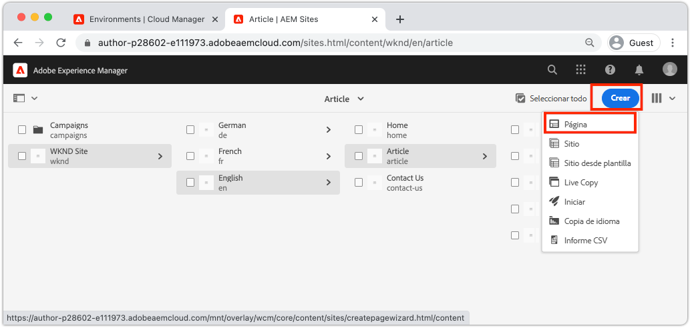

   Esto abrirá el asistente **Crear página**.

1. Seleccione la plantilla **Article Page** y haga clic en **Next**.

   Las páginas de AEM se crean a partir de una plantilla de página. Las plantillas de página se explorarán con buenos detalles en el capítulo [Plantillas de página](page-templates.md).

1. En **Properties** introduzca un **Title** de &quot;Hello World&quot;.
1. Establezca el **Name** en `hello-world` y haga clic en **Crear**.

   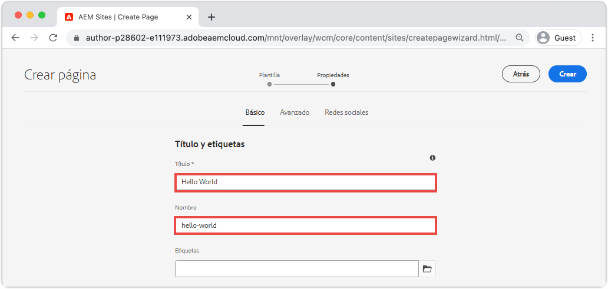

1. En el cuadro de diálogo emergente, haga clic en **Abrir** para abrir la página recién creada.

## Crear un componente {#author-component}

AEM Los componentes se pueden considerar pequeños componentes modulares de una página web. Al dividir la interfaz de usuario en fragmentos lógicos o componentes, resulta mucho más fácil administrarla. Para reutilizar componentes, estos deben ser configurables. Esto se logra mediante el cuadro de diálogo de creación.

AEM proporciona un conjunto de [Componentes principales](https://experienceleague.adobe.com/docs/experience-manager-core-components/using/introduction.html?lang=es) que están listos para su uso en la producción. Los **componentes principales** van desde elementos básicos como [Texto](https://experienceleague.adobe.com/docs/experience-manager-core-components/using/components/text.html) y [Imagen](https://experienceleague.adobe.com/docs/experience-manager-core-components/using/components/image.html) a elementos de interfaz de usuario más complejos como un [Carrusel](https://experienceleague.adobe.com/docs/experience-manager-core-components/using/components/carousel.html).

A continuación, vamos a crear algunos componentes con AEM Editor de páginas.

1. Vaya a la página **Hello World** creada en el ejercicio anterior.
1. Asegúrese de que está en modo **Edit** y, en el carril lateral izquierdo, haga clic en el icono **Components**.

   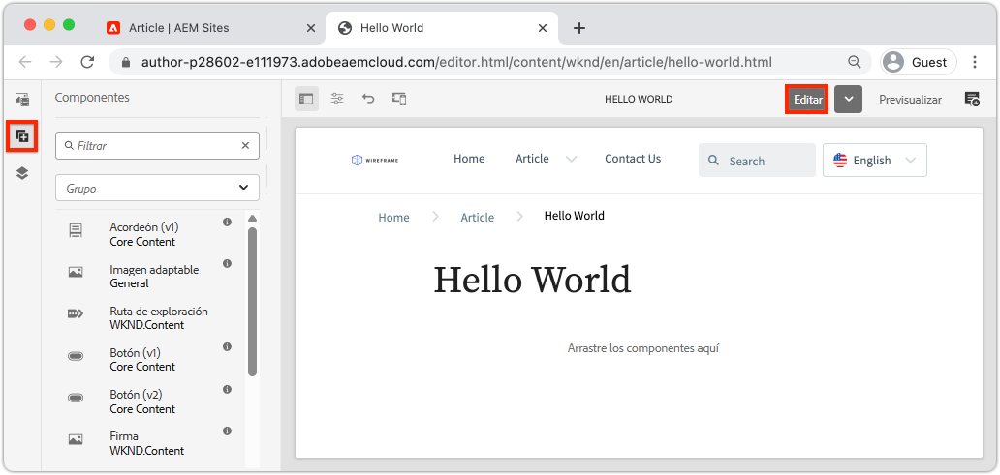

   Se abrirá la biblioteca Componentes y se enumerarán los componentes disponibles que se pueden utilizar en la página.

1. Desplácese hacia abajo y **Arrastre y suelte** un componente **Texto (v2)** en la región editable principal de la página.

   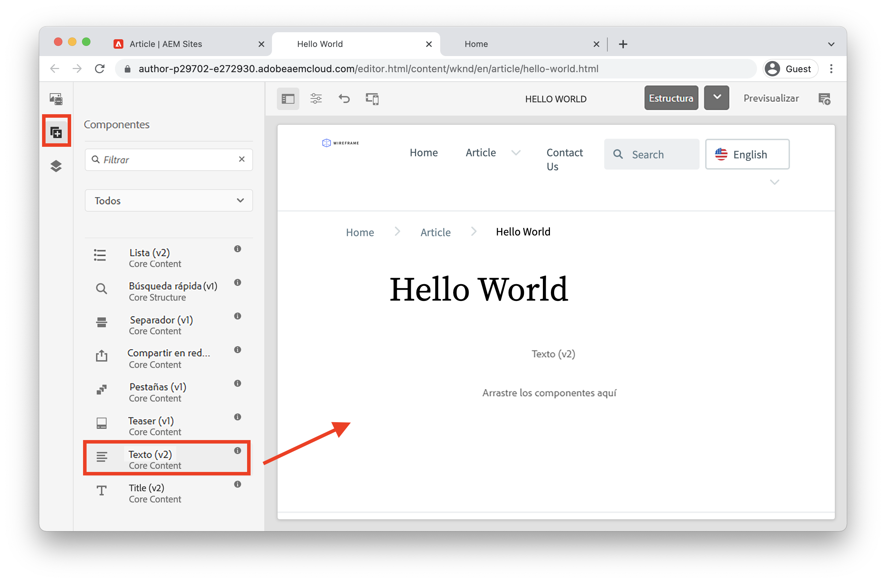

1. Haga clic en el componente **Texto** para resaltarlo y, a continuación, haga clic en el icono **llave inglesa**  para abrir el cuadro de diálogo del componente. Introduzca texto y guarde los cambios en el cuadro de diálogo.

   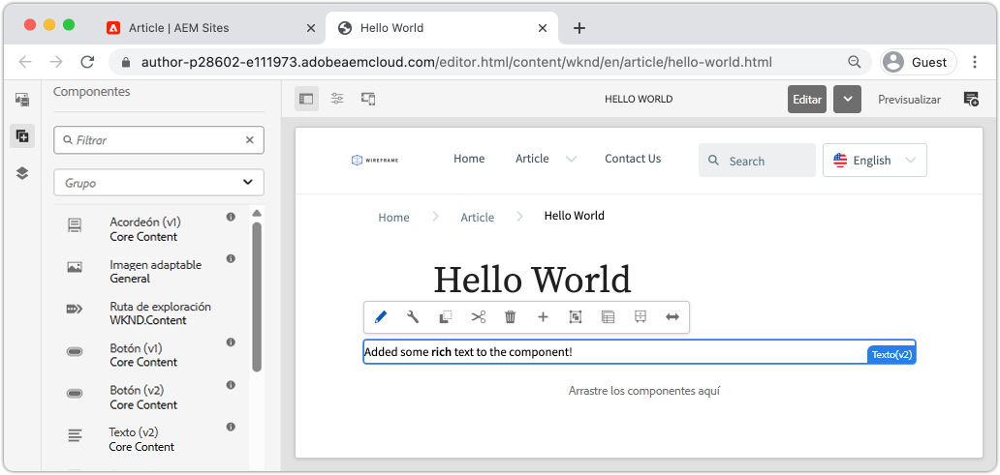

   El componente **Texto** debería mostrar ahora el texto enriquecido en la página.

1. Repita los pasos anteriores, excepto arrastre una instancia del componente **Image(v2)** a la página. Abra el cuadro de diálogo del componente **Image**.

1. En el carril izquierdo, cambie al **Buscador de recursos** haciendo clic en el icono **Recursos** .
1. **Arrastre+** Cargar imagen al cuadro de diálogo del componente y haga clic en  **** Donar para guardar los cambios.

   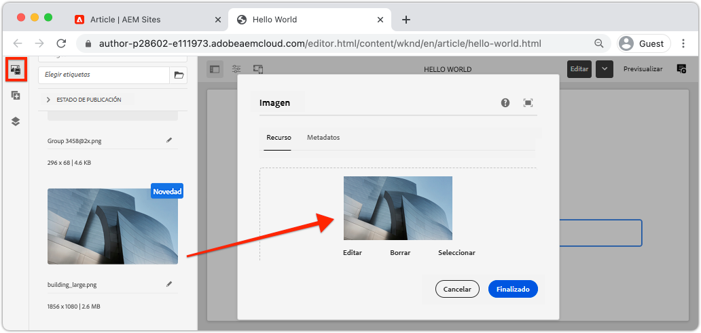

1. Observe que hay componentes en la página, como **Title**, **Navigation**, **Search** que están corregidos. Estas áreas están configuradas como parte de la plantilla de página y no se pueden modificar en una página individual. Esto se explorará más en el próximo capítulo.

Siéntase libre de experimentar con algunos de los otros componentes. La documentación sobre cada [componente principal se puede encontrar aquí](https://experienceleague.adobe.com/docs/experience-manager-core-components/using/introduction.html). Aquí](https://experienceleague.adobe.com/docs/experience-manager-learn/sites/page-authoring/aem-sites-authoring-overview.html) puede encontrar una serie de vídeos detallados sobre [Creación de páginas.

## Publicar actualizaciones {#publish-updates}

AEM entornos se dividen entre un **Author Service** y un **Publish Service**. En este capítulo hemos realizado varias modificaciones en el sitio en el **Servicio de autor**. Para que los visitantes del sitio puedan ver los cambios, debemos publicarlos en el **Servicio de publicación**.

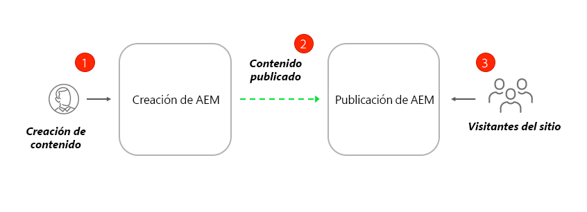

*Flujo de contenido de alto nivel de Autor a Publicación*

**1.** Los autores de contenido actualizan el contenido del sitio. Las actualizaciones se pueden previsualizar, revisar y aprobar para publicarlas.

**2.** Se publicó el contenido. La publicación se puede realizar bajo demanda o programada para una fecha futura.

**3.** Los visitantes del sitio verán los cambios reflejados en el servicio Publicar .

### Publicar los cambios

A continuación, publicemos los cambios.

1. En la pantalla Inicio de AEM, vaya a **Sitios** y seleccione **Sitio de WKND**.
1. Haga clic en **Administrar publicación** en la barra de menú.

   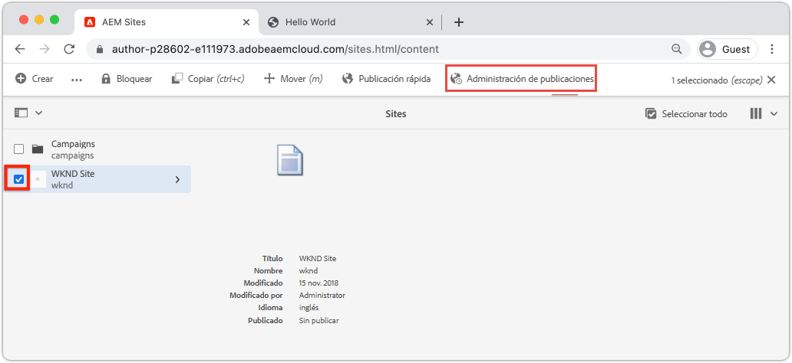

   Dado que este es un sitio completamente nuevo, queremos publicar todas las páginas y podemos usar el asistente Administrar publicación para definir exactamente lo que debe publicarse.

1. En **Opciones**, deje la configuración predeterminada en **Publicar** y programarla para **Ahora**. Haga clic en **Siguiente**. 
1. En **Ámbito**, seleccione **Sitio WKND** y haga clic en **Incluir elementos secundarios**. En el cuadro de diálogo, desmarque todas las casillas. Queremos publicar el sitio completo.

   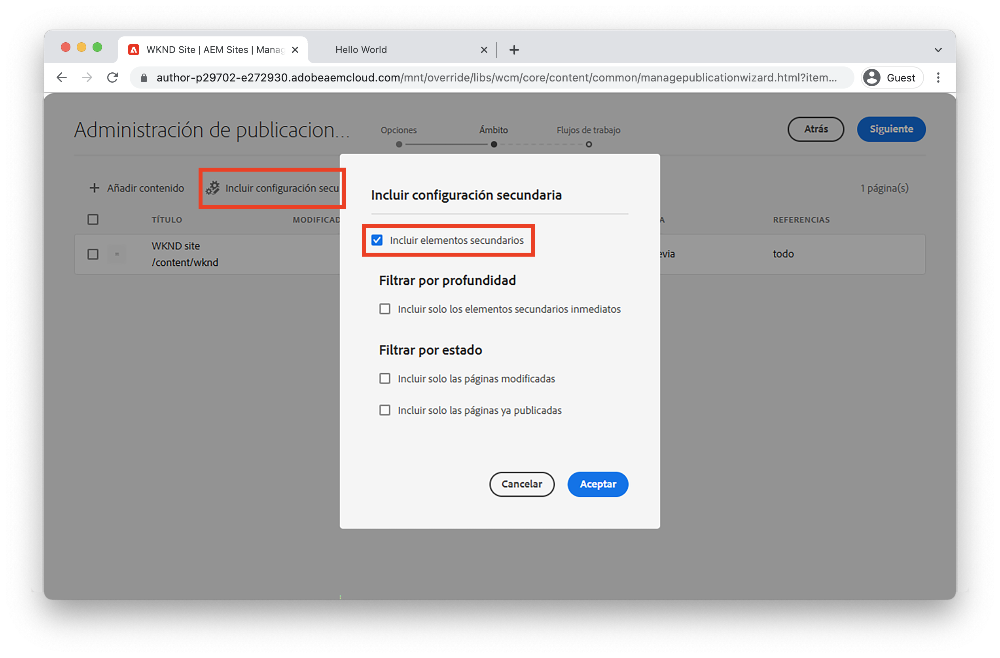

1. Haga clic en el botón **Referencias publicadas**. En el cuadro de diálogo, verifique que todo esté marcado. Esto incluirá la **Plantilla básica AEM sitio** y varias configuraciones generadas por la Plantilla del sitio. Haga clic en **Listo** para actualizar.

   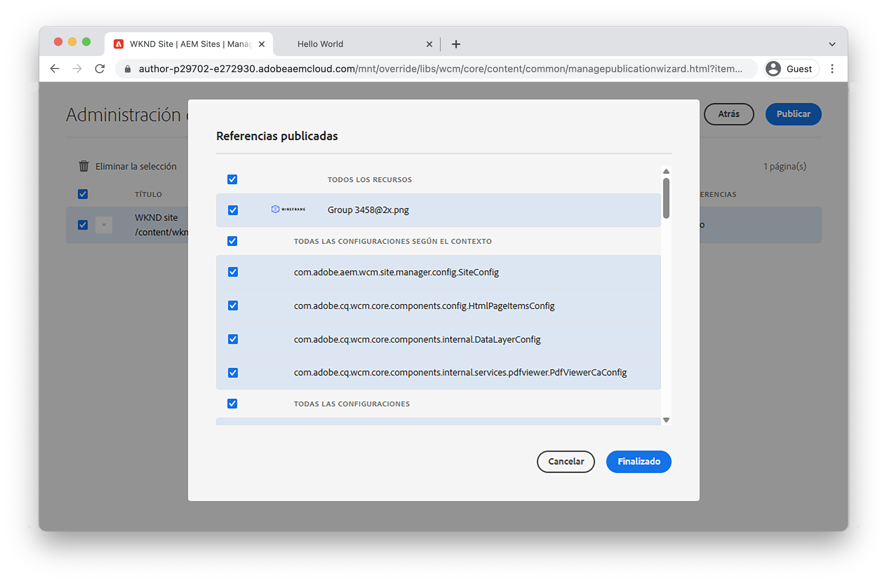

1. Finalmente, haga clic en **Publicar** en la esquina superior derecha para publicar el contenido.

## Ver contenido publicado {#publish}

A continuación, vaya al servicio Publicar para ver los cambios.

1. Una forma sencilla de obtener la URL del servicio de publicación es copiar la URL del autor y reemplazar la palabra `author` por `publish`. Por ejemplo:

   * **URL del autor** - `https://author-pYYYY-eXXXX.adobeaemcloud.com/`
   * **URL de publicación** :  `https://publish-pYYYY-eXXXX.adobeaemcloud.com/`

1. Agregue `/content/wknd.html` a la URL de publicación para que la URL final tenga el aspecto siguiente: `https://publish-pYYYY-eXXXX.adobeaemcloud.com/content/wknd.html`.

   >[!NOTE]
   >
   > Cambie `wknd.html` para que coincida con el nombre del sitio, si proporcionó un nombre único durante la [creación del sitio](create-site.md).

1. Al navegar a la URL de publicación, debería ver el sitio, sin ninguna de las funciones de creación de AEM.

   

1. Con el menú **Navegación** haga clic en **Artículo** > **Hola a mundo** para navegar a la página Hola Mundo creada anteriormente.
1. Vuelva al **AEM Author Service** y realice algunos cambios de contenido adicionales en el Editor de páginas.
1. Publique estos cambios directamente desde el editor de páginas haciendo clic en el icono **Propiedades de página** > **Publicar página**

   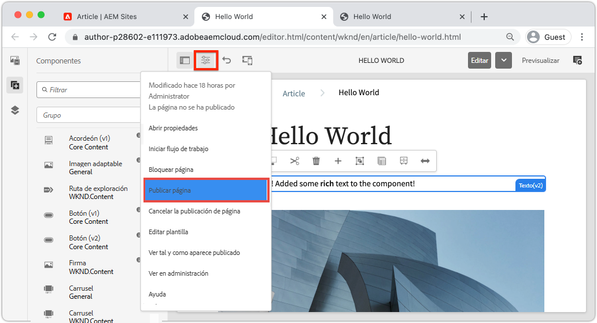

1. Vuelva al **Servicio de publicación de AEM** para ver los cambios. Lo más probable es que **no** vea inmediatamente las actualizaciones. Esto se debe a que el **Servicio de publicación de AEM** incluye [almacenamiento en caché a través de un servidor web Apache y CDN](https://experienceleague.adobe.com/docs/experience-manager-cloud-service/implementing/content-delivery/caching.html). De forma predeterminada, el contenido HTML se almacena en caché durante ~5 minutos.

1. Para evitar la caché con fines de prueba/depuración, simplemente agregue un parámetro de consulta como `?nocache=true`. La dirección URL sería `https://publish-pYYYY-eXXXX.adobeaemcloud.com/content/wknd/en/article/hello-world.html?nocache=true`. Puede encontrar más detalles sobre la estrategia de almacenamiento en caché y las configuraciones disponibles [aquí](https://experienceleague.adobe.com/docs/experience-manager-cloud-service/implementing/content-delivery/overview.html).

1. También puede encontrar la URL del servicio de publicación en Cloud Manager. Vaya al **Programa de Cloud Manager** > **Entornos** > **Entorno**.

   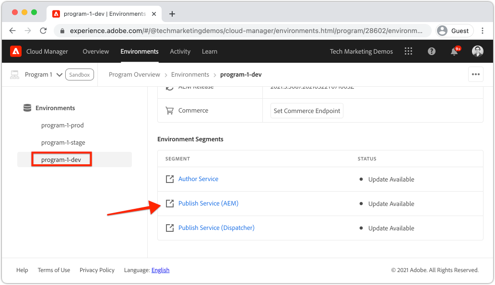

   En **Segmentos de entorno** puede encontrar vínculos a los servicios **Author** y **Publish**.

## Felicitaciones! {#congratulations}

¡Felicidades, acaba de crear y publicar cambios en su Sitio AEM!

### Pasos siguientes {#next-steps}

Obtenga información sobre cómo crear y modificar [Plantillas de página](./page-templates.md). Comprenda la relación entre una plantilla de página y una página. Obtenga información sobre cómo configurar las políticas de una plantilla de página para proporcionar control granular y coherencia de marca para el contenido.  Se creará una plantilla de artículo de revista bien estructurada basada en una maqueta de Adobe XD.
