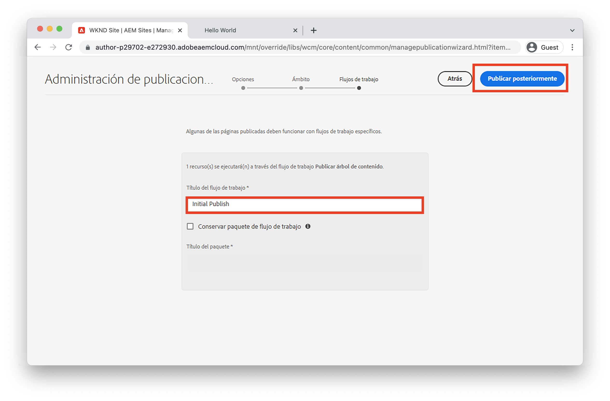

# Introducción a la creación y publicación {#author-content-publish}

Es importante comprender cómo un usuario actualizará el contenido del sitio web. En este capítulo adoptaremos la personalidad de una **Autor de contenido** y haga algunas actualizaciones editoriales del sitio generadas en el capítulo anterior. Al final del capítulo, publicaremos los cambios para comprender cómo se actualiza el sitio en directo.

## Requisitos previos {#prerequisites}

Este es un tutorial de varias partes y se da por hecho que los pasos descritos en la sección [Crear un sitio](./create-site.md) se ha completado el capítulo.

## Objetivo {#objective}

1. Comprender los conceptos de **Páginas** y **Componentes** en AEM Sites.
1. Aprenda a actualizar el contenido del sitio web.
1. Obtenga información sobre cómo publicar cambios en el sitio activo.

## Crear una página nueva {#create-page}

Un sitio web suele dividirse en páginas para formar una experiencia de varias páginas. AEM estructura el contenido de la misma manera. A continuación, cree una nueva página para el sitio.

1. Inicie sesión en la AEM **Autor** Servicio utilizado en el capítulo anterior.
1. En la pantalla Inicio de AEM, haga clic en **Sitios** > **Sitio WKND** > **Inglés** > **Artículo**
1. En la esquina superior derecha, haga clic en **Crear** > **Página**.

   

   Esto abrirá las **Crear página** asistente.

1. Elija la **Página de artículos** plantilla y haga clic en **Siguiente**.

   Las páginas de AEM se crean a partir de una plantilla de página. Las plantillas de página se exploran en detalle en el [Plantillas de página](page-templates.md) capítulo.

1. En **Propiedades** introduzca un **Título** de &quot;Hello World&quot;.
1. Configure las variables **Nombre** a `hello-world` y haga clic en **Crear**.

   

1. En la ventana emergente del cuadro de diálogo, haga clic en **Apertura** para abrir la página recién creada.

## Crear un componente {#author-component}

AEM Los componentes se pueden considerar pequeños componentes modulares de una página web. Al dividir la interfaz de usuario en fragmentos lógicos o componentes, resulta mucho más fácil administrarla. Para reutilizar componentes, estos deben ser configurables. Esto se logra mediante el cuadro de diálogo de creación.

AEM proporciona un conjunto de [Componentes principales](https://experienceleague.adobe.com/docs/experience-manager-core-components/using/introduction.html?lang=es) que están listos para usar en la producción. La variable **Componentes principales** rango desde elementos básicos como [Texto](https://experienceleague.adobe.com/docs/experience-manager-core-components/using/components/text.html) y [Imagen](https://experienceleague.adobe.com/docs/experience-manager-core-components/using/components/image.html) para elementos de interfaz de usuario más complejos como una [Carrusel](https://experienceleague.adobe.com/docs/experience-manager-core-components/using/components/carousel.html).

A continuación, cree algunos componentes con el Editor de páginas AEM.

1. Vaya a la **Hello World** creada en el ejercicio anterior.
1. Asegúrese de que está en **Editar** y en el carril lateral izquierdo, haga clic en el botón **Componentes** icono.

   

   Se abrirá la biblioteca Componentes y se enumerarán los componentes disponibles que se pueden utilizar en la página.

1. Desplácese hacia abajo y **Arrastrar y soltar** a **Texto (v2)** a la región editable principal de la página.

   

1. Haga clic en el **Texto** para resaltar el componente y, a continuación, haga clic en el botón **llave** icono  para abrir el cuadro de diálogo del componente. Introduzca texto y guarde los cambios en el cuadro de diálogo.

   

   La variable **Texto** ahora debe mostrar el texto enriquecido en la página.

1. Repita los pasos anteriores, excepto arrastre una instancia de la función **Imagen(v2)** en la página. Abra el **Imagen** cuadro de diálogo del componente.

1. En el carril izquierdo, cambie a la **Buscador de recursos** haciendo clic en el botón **Recursos** icono .
1. **Arrastrar y soltar** una imagen en el cuadro de diálogo del componente y haga clic en **Listo** para guardar los cambios.

   

1. Observe que hay componentes en la página, como el **Título**, **Navegación**, **Buscar** que están corregidos. Estas áreas están configuradas como parte de la plantilla de página y no se pueden modificar en una página individual. Esto se analiza más en el siguiente capítulo.

Siéntase libre de experimentar con algunos de los otros componentes. Documentación sobre cada [El componente principal se puede encontrar aquí](https://experienceleague.adobe.com/docs/experience-manager-core-components/using/introduction.html). Una serie detallada de vídeos sobre [La creación de páginas se puede encontrar aquí](https://experienceleague.adobe.com/docs/experience-manager-learn/sites/page-authoring/aem-sites-authoring-overview.html).

## Publicar actualizaciones {#publish-updates}

AEM entornos se dividen entre una **Servicio de autor** y **Servicio de publicación**. En este capítulo hemos realizado varias modificaciones en el sitio en la **Servicio de autor**. Para que los visitantes del sitio puedan ver los cambios, debemos publicarlos en la **Servicio de publicación**.

*Flujo de contenido de alto nivel de Autor a Publicación*

**1.** Los autores de contenido actualizan el contenido del sitio. Las actualizaciones se pueden previsualizar, revisar y aprobar para publicarlas.

**2.** Se publicó el contenido. La publicación se puede realizar bajo demanda o programada para una fecha futura.

**3.** Los visitantes del sitio verán los cambios reflejados en el servicio Publicar .

### Publicar los cambios

A continuación, publicemos los cambios.

1. Desde la pantalla Inicio de AEM vaya a **Sitios** y seleccione **Sitio WKND**.
1. Haga clic en el **Administrar publicación** en la barra de menús.

   

   Dado que este es un sitio completamente nuevo, queremos publicar todas las páginas y podemos usar el asistente Administrar publicación para definir exactamente lo que debe publicarse.

1. En **Opciones** deje la configuración predeterminada en **Publicación** y programarlo para **Ahora**. Haga clic en **Siguiente**. 
1. En **Ámbito**, seleccione **Sitio WKND** y haga clic en **Incluir configuración secundaria**. En el cuadro de diálogo, marque **Incluir elementos secundarios**. Anule la selección del resto de las casillas para asegurarse de que se publica todo el sitio.

   

1. Haga clic en el **Referencias publicadas** botón. En el cuadro de diálogo, verifique que todo esté marcado. Esto incluirá la variable **Plantilla de sitio estándar** y varias configuraciones generadas por la plantilla de sitio. Haga clic en **Listo** para actualizar.

   

1. Finalmente, marque la casilla situada junto a **Sitio WKND** y haga clic en **Siguiente** en la esquina superior derecha.
1. En el **Flujos de trabajo** , introduzca un **Título del flujo de trabajo**. Puede ser cualquier texto y puede ser útil como parte de una pista de auditoría más adelante. Introduzca &quot;Initial publish&quot; y haga clic en **Publicación**.

## Ver contenido publicado {#publish}

A continuación, vaya al servicio Publicar para ver los cambios.

1. Una forma sencilla de obtener la URL del servicio de publicación es copiar la URL del autor y reemplazar el `author` word con `publish`. Por ejemplo:

   * **URL del autor** - `https://author-pYYYY-eXXXX.adobeaemcloud.com/`
   * **Publicar URL** - `https://publish-pYYYY-eXXXX.adobeaemcloud.com/`

1. Agregar `/content/wknd.html` a la URL de publicación para que tenga el aspecto siguiente: `https://publish-pYYYY-eXXXX.adobeaemcloud.com/content/wknd.html`.

   >[!NOTE]
   >
   > Cambiar `wknd.html` para que coincida con el nombre del sitio, si ha proporcionado un nombre único durante [creación del sitio](create-site.md).

1. Al navegar a la URL de publicación, debería ver el sitio, sin ninguna de las funciones de creación de AEM.

   

1. Al usar la variable **Navegación** haga clic en el menú **Artículo** > **Hello World** para navegar a la página Hello World creada anteriormente.
1. Vuelva a la **AEM Author Service** y realice algunos cambios adicionales en el contenido en el Editor de páginas.
1. Publique estos cambios directamente desde el editor de páginas haciendo clic en el **Propiedades de página** icono > **Publicar página**

   

1. Vuelva a la **Servicio de AEM Publish** para ver los cambios. Lo más probable es que **not** consulte las actualizaciones inmediatamente. Esto se debe a que la variable **Servicio de AEM Publish** incluye [almacenamiento en caché a través de un servidor web Apache y CDN](https://experienceleague.adobe.com/docs/experience-manager-cloud-service/implementing/content-delivery/caching.html). De forma predeterminada, el contenido del HTML se almacena en caché durante ~5 minutos.

1. Para evitar la caché con fines de prueba/depuración, simplemente agregue un parámetro de consulta como `?nocache=true`. La dirección URL sería como `https://publish-pYYYY-eXXXX.adobeaemcloud.com/content/wknd/en/article/hello-world.html?nocache=true`. Más detalles sobre la estrategia de almacenamiento en caché y las configuraciones disponibles [se puede encontrar aquí](https://experienceleague.adobe.com/docs/experience-manager-cloud-service/implementing/content-delivery/overview.html).

1. También puede encontrar la URL del servicio de publicación en Cloud Manager. Vaya a la **Programa de Cloud Manager** > **Entornos** > **Entorno**.

   

   En **Segmentos de entorno** puede encontrar vínculos a la **Autor** y **Publicación** servicios.

## Felicitaciones! {#congratulations}

¡Felicidades, acaba de crear y publicar cambios en su Sitio AEM!

### Siguientes pasos {#next-steps}

En una implementación real, la planificación de un sitio con maquetas y diseños de interfaz de usuario suele preceder a la creación del sitio. Descubra cómo se pueden usar los kits de IU de Adobe XD para diseñar y acelerar la implementación de Adobe Experience Manager Sites en [Planificación de la interfaz de usuario con Adobe XD](./ui-planning-adobe-xd.md).

¿Quiere seguir explorando las funcionalidades de AEM Sites? Siéntase libre de saltar directamente al capítulo en [Plantillas de página](./page-templates.md) para comprender la relación entre una plantilla de página y una página.

