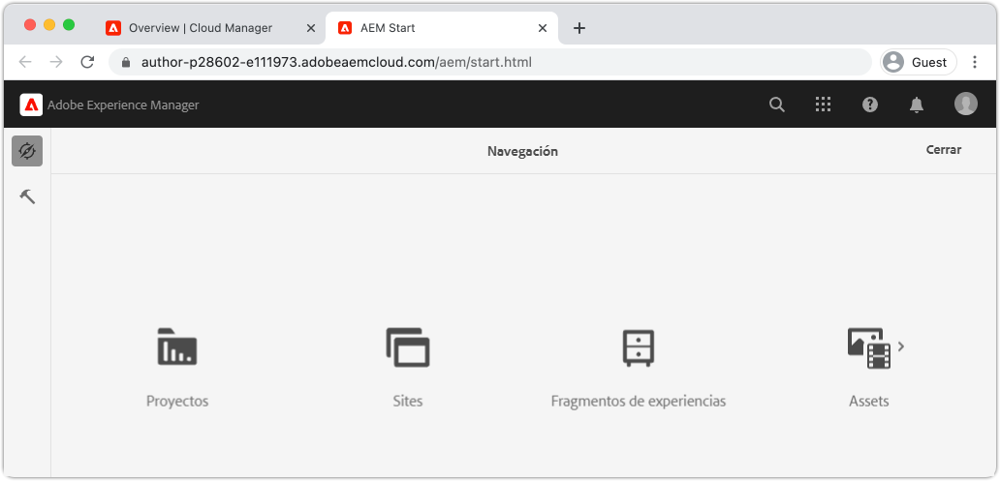
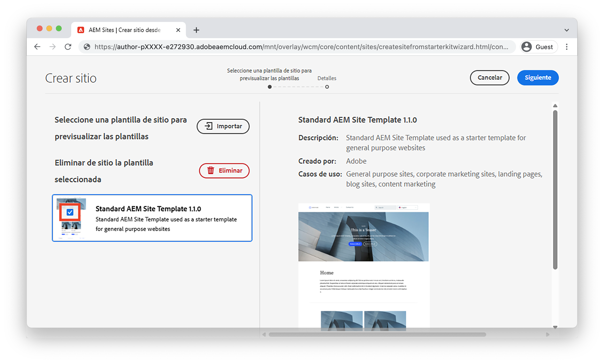
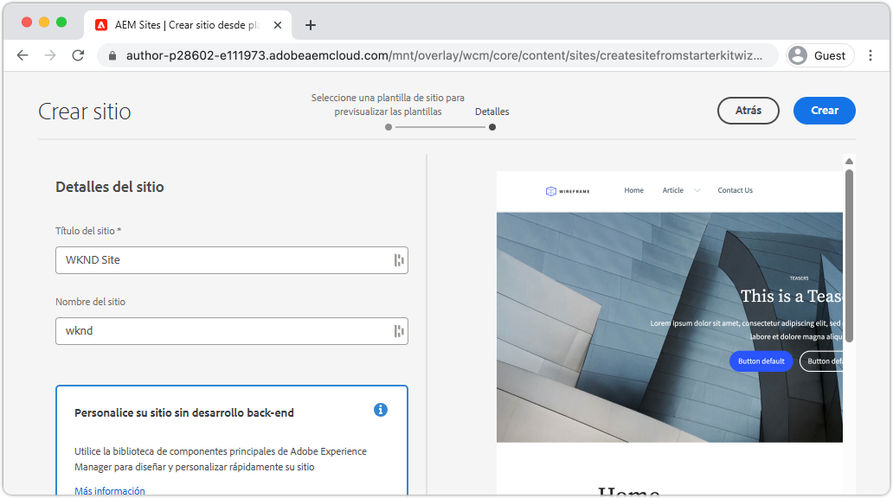
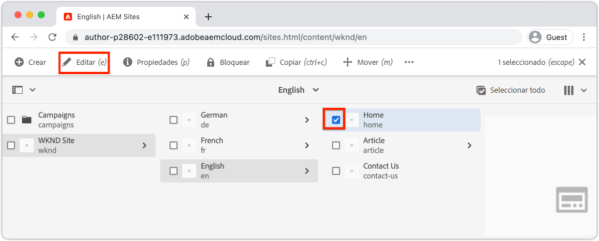
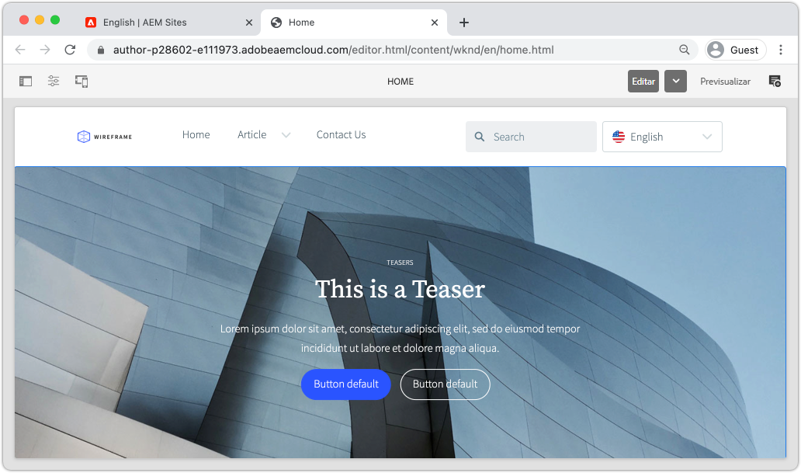

# Crear un sitio {#create-site}

Como parte de la Creación rápida de sitios, utilice el Asistente para la creación de sitios en Adobe Experience Manager, AEM, para generar un nuevo sitio web. La plantilla de sitio estándar proporcionada por el Adobe, se utiliza como punto de partida para el nuevo sitio.

## Requisitos previos {#prerequisites}

Los pasos de este capítulo se llevarán a cabo en un entorno de Adobe Experience Manager as a Cloud Service. Asegúrese de tener acceso administrativo al entorno de AEM. Se recomienda utilizar un [Programa Sandbox](https://experienceleague.adobe.com/docs/experience-manager-cloud-service/onboarding/getting-access/sandbox-programs/introduction-sandbox-programs.html) y [Entorno de desarrollo](https://experienceleague.adobe.com/docs/experience-manager-cloud-service/implementing/using-cloud-manager/manage-environments.html) al completar este tutorial.

Consulte la [documentación de incorporación](https://experienceleague.adobe.com/docs/experience-manager-cloud-service/onboarding/home.html) para obtener más información.

## Objetivo {#objective}

1. Aprenda a utilizar el Asistente para la creación de sitios para generar un nuevo sitio.
1. Comprender la función de las plantillas del sitio.
1. Explorar el sitio de AEM generado.

## Iniciar sesión en Adobe Experience Manager Author {#author}

Como primer paso, inicie sesión en su entorno as a Cloud Service AEM. AEM entornos se dividen entre una **Servicio de autor** y **Servicio de publicación**.

* **Servicio de autor** - donde el contenido del sitio se crea, administra y actualiza. Normalmente, solo los usuarios internos tienen acceso al **Servicio de autor** y está detrás de una pantalla de inicio de sesión.
* **Servicio de publicación** - aloja el sitio web en directo. Este es el servicio que verán los usuarios finales y que suele estar disponible públicamente.

La mayoría del tutorial se realizará utilizando la variable **Servicio de autor**.

1. Vaya a Adobe Experience Cloud [https://experience.adobe.com/](https://experience.adobe.com/). Inicie sesión con su cuenta personal o una cuenta de empresa/escuela.
1. Asegúrese de que la organización correcta esté seleccionada en el menú y haga clic en **Experience Manager**.

   

1. En **Cloud Manager** click **Launch**.
1. Pase el ratón sobre el programa que desee utilizar y haga clic en la **Programa de Cloud Manager** icono.

   

1. En el menú superior, haga clic en **Entornos** para ver los entornos aprovisionados.

1. Busque el entorno que desea utilizar y haga clic en el botón **URL de autor**.

   

   >[!NOTE]
   >
   >Se recomienda utilizar un **Desarrollo** para este tutorial.

1. Se iniciará una nueva pestaña en el AEM **Servicio de autor**. Haga clic en **Iniciar sesión con Adobe** y debe iniciar sesión automáticamente con las mismas credenciales de Experience Cloud.

1. Después de ser redirigido y autenticado, debería ver la pantalla de inicio AEM.

   

>[!NOTE]
>
> ¿Tiene problemas para acceder al Experience Manager? Consulte la [documentación de incorporación](https://experienceleague.adobe.com/docs/experience-manager-cloud-service/onboarding/home.html)

## Descargar la plantilla de sitio básica

Una plantilla de sitio proporciona un punto de partida para un nuevo sitio. Una plantilla de sitio incluye temas básicos, plantillas de página, configuraciones y contenido de muestra. Exactamente lo que se incluye en la plantilla del sitio corresponde al desarrollador. El Adobe proporciona un **Plantilla básica del sitio** para acelerar las nuevas implementaciones.

1. Abra una nueva pestaña del explorador y vaya al proyecto de plantilla de sitio básica en GitHub: [https://github.com/adobe/aem-site-template-standard](https://github.com/adobe/aem-site-template-standard). El proyecto es de código abierto y tiene licencia para ser utilizado por cualquier persona.
1. Haga clic en **Versiones** y vaya a la [última versión](https://github.com/adobe/aem-site-template-standard/releases/última).
1. Expanda el **Recursos** y descargue el archivo zip de la plantilla:

   

   Este archivo zip se utilizará en el siguiente ejercicio.

   >[!NOTE]
   >
   > Este tutorial se escribe con la versión **1.1.0** de la plantilla de sitio básica. Al iniciar un nuevo proyecto para su uso en producción, siempre se recomienda utilizar la versión más reciente.

## Crear un nuevo sitio

A continuación, genere un nuevo sitio utilizando la plantilla de sitio del ejercicio anterior.

1. Vuelva al entorno de AEM. Desde la pantalla Inicio de AEM vaya a **Sitios**.
1. En la esquina superior derecha, haga clic en **Crear** > **Sitio (plantilla)**. Esto abrirá las **Asistente para crear sitio**.
1. En **Seleccionar una plantilla de sitio** haga clic en **Importar** botón.

   Cargue el **.zip** archivo de plantilla descargado del ejercicio anterior.

1. Seleccione el **Plantilla básica AEM sitio** y haga clic en **Siguiente**.

   

1. En **Detalles del sitio** > **Título del sitio** enter `WKND Site`.

   En una implementación real, &quot;WKND Site&quot; sería reemplazado por el nombre de marca de su empresa u organización. En este tutorial, estamos simulando la creación de un sitio para una marca de estilo de vida ficticia &quot;WKND&quot;.

1. En **Nombre del sitio** enter `wknd`.

   

   >[!NOTE]
   >
   > Si utiliza un entorno de AEM compartido, añada un identificador único al **Nombre del sitio**. Por ejemplo `wknd-site-johndoe`. Esto garantizará que varios usuarios puedan completar el mismo tutorial, sin conflictos.

1. Haga clic en **Crear** para generar el sitio. Haga clic en **Listo** en el **Correcto** cuando AEM haya terminado de crear el sitio web.

## Explorar el nuevo sitio

1. Vaya a la consola de AEM Sites, si no está allí.
1. Un nuevo **Sitio WKND** se ha generado. Incluirá una estructura de sitio con una jerarquía multilingüe.
1. Abra el **Inglés** > **Página principal** seleccionando la página y haciendo clic en el botón **Editar** en la barra de menús:

   

1. Ya se ha creado contenido de inicio y hay varios componentes disponibles para añadirlos a una página. Experimente con estos componentes para hacerse una idea de la funcionalidad. En el capítulo siguiente aprenderá los conceptos básicos de un componente.

   

   *Contenido de muestra proporcionado por la plantilla de sitio*

## Felicitaciones! {#congratulations}

¡Felicidades, acaba de crear su primer Sitio AEM!

### Siguientes pasos {#next-steps}

Utilice el editor de páginas de Adobe Experience Manager, AEM, para actualizar el contenido del sitio en la variable [Creación de contenido y publicación](author-content-publish.md) capítulo. Descubra cómo se pueden configurar los componentes atómicos para actualizar contenido. Comprenda la diferencia entre los entornos de AEM Author y Publish y aprenda a publicar actualizaciones en el sitio activo.
