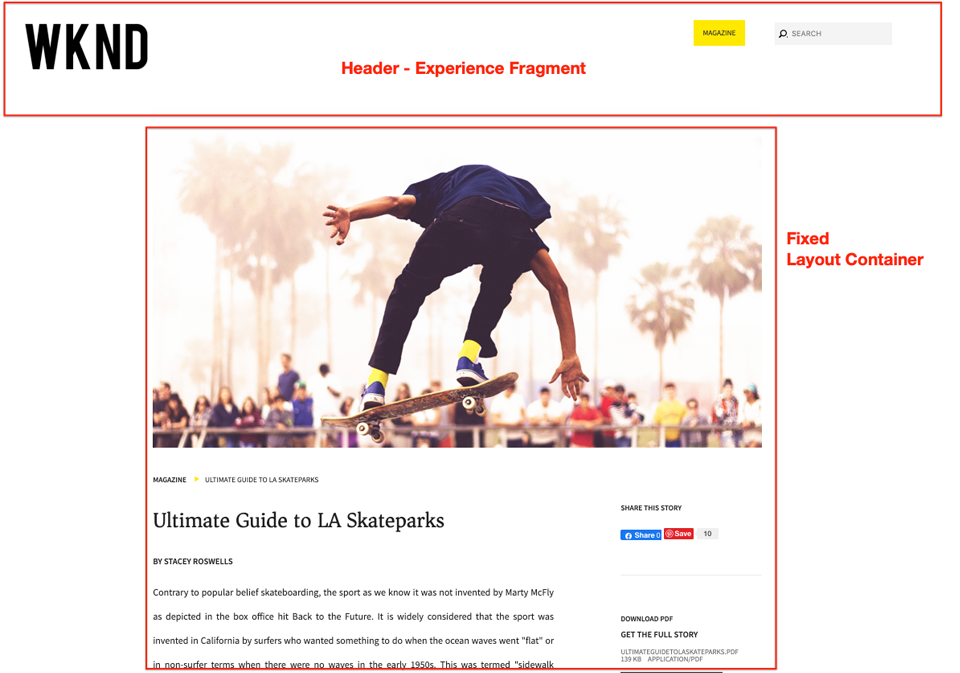

# Desarrollo con el sistema de estilos {#developing-with-the-style-system}

Aprenda a implementar estilos individuales y a reutilizar los componentes principales mediante el sistema de estilos de Experience Manager. Este tutorial trata el desarrollo del sistema de estilos para ampliar los componentes principales con CSS específica de la marca y configuraciones de políticas avanzadas del Editor de plantillas.

## Requisitos previos {#prerequisites}

Revise las herramientas y las instrucciones necesarias para configurar un [entorno de desarrollo local](overview.md#local-dev-environment).

También se recomienda revisar el tutorial [Client-side Libraries and Front-end Workflow](client-side-libraries.md) para comprender los aspectos fundamentales de las bibliotecas del lado del cliente y las distintas herramientas front-end incorporadas en el proyecto de AEM.

### Proyecto de inicio

Consulte el código de línea base que el tutorial genera:

1. Clona el repositorio [github.com/adobe/aem-guides-wknd](https://github.com/adobe/aem-guides-wknd).
1. Consulte la rama `style-system/start`

   ```shell
   $ git clone git@github.com:adobe/aem-guides-wknd.git ~/code/aem-guides-wknd
   $ cd ~/code/aem-guides-wknd
   $ git checkout style-system/start
   ```

1. Implemente código base en una instancia de AEM local con sus conocimientos Maven:

   ```shell
   $ cd ~/code/aem-guides-wknd
   $ mvn clean install -PautoInstallSinglePackage
   ```

Siempre puede realizar la vista del código terminado en [GitHub](https://github.com/adobe/aem-guides-wknd/tree/style-system/solution) o extraer el código localmente cambiando a la rama `style-system/solution`.

## Objetivo

1. Obtenga información sobre cómo utilizar el sistema de estilos para aplicar CSS específica de la marca a AEM componentes principales.
1. Obtenga información sobre la notación BEM y cómo se puede utilizar para aplicar un ámbito a los estilos con cuidado.
1. Aplique configuraciones de directiva avanzadas con plantillas editables.

## Qué va a generar {#what-you-will-build}

En este capítulo utilizaremos la función [Sistema de estilo](https://docs.adobe.com/content/help/en/experience-manager-learn/sites/page-authoring/style-system-feature-video-use.html) para crear varias variaciones de los componentes utilizados en la página Artículo. También utilizaremos el sistema de estilos para crear variaciones para elementos estructurales como Encabezado/Pie de página y Contenedor de diseño.

>[!VIDEO](https://video.tv.adobe.com/v/30386/?quality=12&learn=on)

## Fondo {#background}

El [sistema de estilos](https://docs.adobe.com/content/help/es-ES/experience-manager-65/developing/components/style-system.html) permite a los desarrolladores y editores de plantillas crear varias variaciones visuales de un componente. A su vez, los autores pueden decidir qué estilo utilizar al componer una página. Aprovecharemos el sistema de estilos en el resto del tutorial para lograr varios estilos únicos, mientras aprovechamos los componentes principales en un enfoque de código bajo.

La idea general del sistema de estilos es que los autores puedan elegir distintos estilos de aspecto de un componente. Los &quot;estilos&quot; están respaldados por clases CSS adicionales que se insertan en el div exterior de un componente. En las bibliotecas de cliente, las reglas CSS se agregan en función de estas clases de estilo para que el componente cambie su aspecto.

Puede encontrar [documentación detallada para Style System aquí](https://docs.adobe.com/content/help/en/experience-manager-65/developing/components/style-system.html). También hay un bueno [vídeo técnico para comprender el sistema de estilos](https://docs.adobe.com/content/help/en/experience-manager-learn/sites/developing/style-system-technical-video-understand.html).

## Estilo de componente de título {#title-component}

En este punto, el [Componente de título](https://docs.adobe.com/content/help/en/experience-manager-core-components/using/components/title.html) se procesó como proxy en el proyecto en `/apps/wknd/components/content/title` como parte del módulo **ui.apps**. Los estilos predeterminados de los elementos Heading (`H1`, `H2`, `H3`...) ya se han implementado en el módulo **ui.frontendr** del archivo `_elements.scss` en `ui.frontend/src/main/webpack/base/sass/_elements.scss`.

### Estilo de subrayado

Los [diseños de artículo de WKND](assets/pages-templates/wknd-article-design.xd) contienen un estilo único para el componente Título con un subrayado. En lugar de crear dos componentes o modificar el cuadro de diálogo del componente, se puede utilizar el sistema de estilos para permitir a los autores añadir un estilo de subrayado.


### Inspect Title Component Markup

Como desarrollador front-end, el primer paso para diseñar un componente principal es comprender el marcado generado por el componente.

Como parte del proyecto generado, el arquetipo incorporó el proyecto **Ejemplos de componentes principales**. Para desarrolladores y creadores de contenido, esto contiene una referencia sencilla para comprender todas las funciones disponibles con los componentes principales. Una versión en directo también está [disponible](https://opensource.adobe.com/aem-core-wcm-components/library.html).

1. Abra un navegador nuevo y vista el componente Título:

   Instancia de AEM local: [http://localhost:4502/editor.html/content/core-components-examples/library/title.html](http://localhost:4502/editor.html/content/core-components-examples/library/title.html)

   Ejemplo activo: [https://opensource.adobe.com/aem-core-wcm-components/library/title.html](https://opensource.adobe.com/aem-core-wcm-components/library/title.html)

1. A continuación se muestra el marcado del componente Título:

   ```html
   <div class="cmp-title">
       <h1 class="cmp-title__text">Lorem Ipsum</h1>
   </div>
   ```

   Notación BEM del componente Título:

   ```plain
   BLOCK cmp-title
       ELEMENT cmp-title__text
   ```

1. El sistema de estilos agrega una clase CSS al div exterior que rodea el componente. Por lo tanto, el marcado al que nos dirigiremos se parecerá a lo siguiente:

   ```html
   <div class="STYLE-SYSTEM-CLASS-HERE"> <!-- Custom CSS class - implementation gets to define this -->
       <div class="cmp-title">
           <h1 class="cmp-title__text">Lorem Ipsum</h1>
       </div>
   </div>
   ```

### Implementar el estilo de subrayado - ui.frontender

A continuación, implementaremos el estilo Subrayado mediante el módulo **ui.frontender** de nuestro proyecto. Utilizaremos el servidor de desarrollo de webpack que se incluye con el módulo **ui.front** para previsualización de los estilos *antes de* implementarlos en una instancia local de AEM.

1. Inicio el servidor de desarrollo de webpack ejecutando el siguiente comando desde el módulo **ui.frontender**:

   ```shell
   $ cd ~/code/aem-guides-wknd/ui.frontend/
   $ npm start
   
   > aem-maven-archetype@1.0.0 start code/aem-guides-wknd/ui.frontend
   > webpack-dev-server --open --config ./webpack.dev.js
   ```

   Esto debería abrir un explorador en [http://localhost:8080](http://localhost:8080).

   >[!NOTE]
   >
   > Si las imágenes aparecen dañadas, asegúrese de que el proyecto de inicio se haya implementado en una instancia local de AEM (que se ejecuta en el puerto 4502) y de que el explorador utilizado también haya iniciado sesión en la instancia de AEM local.

   

1. En Eclipse o el IDE de su elección, abra el archivo `index.html` ubicado en: `ui.frontend/src/main/webpack/static/index.html`. Este es el código estático utilizado por el servidor de desarrollo de webpack.
1. En `index.html` busque una instancia del componente Título para agregar el estilo subrayado a la cual buscar en el documento *cmp-title*. Elija el componente Título con el texto *&quot;Vans off the Wall Skatepark&quot;* (línea 218). Añada la clase `cmp-title--underline` al div circundante:

   ```html
    <!-- before -->
    <div class="title aem-GridColumn aem-GridColumn--default--8">
        <div class="cmp-title">
            <h2 class="cmp-title__text">Vans off the Wall Skatepark</h2>
        </div>
    </div>
   ```

   ```html
    <!-- After -->
    <div class="cmp-title--underline title aem-GridColumn aem-GridColumn--default--8">
        <div class="cmp-title">
            <h2 class="cmp-title__text">Vans off the Wall Skatepark</h2>
        </div>
    </div>
   ```

1. Vuelva al explorador y compruebe que la clase adicional se refleja en el marcado.
1. Vuelva al módulo **ui.front** y actualice el archivo `title.scss` ubicado en: `ui.frontend/src/main/webpack/components/content/title/scss/title.scss`:

   ```css
   /* Add Title Underline Style */
   .cmp-title--underline {
   
       .cmp-title {
       }
   
       .cmp-title__text {
           &:after {
           display: block;
               width: 84px;
               padding-top: 8px;
               content: '';
               border-bottom: 2px solid $brand-primary;
           }
       }
   }
   ```

   >[!NOTE]
   >
   >Se considera una práctica recomendada definir siempre los estilos de ámbito estrictamente para el componente destinatario. Esto garantiza que los estilos adicionales no afecten a otras áreas de la página.
   >
   >Todos los componentes principales se adhieren a **[notación de BEM](https://github.com/adobe/aem-core-wcm-components/wiki/css-coding-conventions)**. Se recomienda el destinatario de la clase CSS exterior al crear un estilo predeterminado para un componente. Otra práctica recomendada es utilizar nombres de clase de destinatario especificados por la notación BEM de componentes principales en lugar de elementos HTML.

1. Vuelva al explorador una vez más y debería ver el estilo Subrayado agregado:

   

1. Detenga el servidor de desarrollo de webpack.

### Añadir una directiva de título

A continuación, debemos añadir una nueva directiva para los componentes Título para permitir a los autores de contenido elegir el estilo Subrayado que se aplicará a componentes específicos. Esto se realiza con el Editor de plantillas de AEM.

1. Implemente código base en una instancia de AEM local con sus conocimientos Maven:

   ```shell
   $ cd ~/code/aem-guides-wknd
   $ mvn clean install -PautoInstallSinglePackage
   ```

1. Vaya a la **Plantilla de página de artículo** ubicada en: [http://localhost:4502/editor.html/conf/wknd/settings/wcm/templates/article-page-template/structure.html](http://localhost:4502/editor.html/conf/wknd/settings/wcm/templates/article-page-template/structure.html).

1. En el modo **Estructura**, en el Contenedor principal **Diseño**, seleccione el icono **Política** junto al componente **Título** que se encuentra en *Componentes permitidos*:

   

1. Cree una nueva directiva para el componente Título con los siguientes valores:

   *Título de directiva **:  **Título WKND**

   *Propiedades* > Ficha  *Estilos* >  *Añadir un nuevo estilo*

   **Subrayado** :  `cmp-title--underline`

   

   Haga clic en **Listo** para guardar los cambios en la directiva Título.

   >[!NOTE]
   >
   > El valor `cmp-title--underline` coincide con la clase CSS a la que nos dirigimos anteriormente cuando se desarrolla en el módulo **ui.front**.

### Aplicar estilo de subrayado

Por último, como autor, podemos optar por aplicar el estilo de subrayado a determinados Componentes del título.

1. Vaya al artículo **La Skateparks** del editor de AEM Sites en: [http://localhost:4502/editor.html/content/wknd/us/en/magazine/guide-la-skateparks.html](http://localhost:4502/editor.html/content/wknd/us/en/magazine/guide-la-skateparks.html)
1. En el modo **Editar**, elija un componente Título. Haga clic en el icono **pincel** y seleccione el estilo **Subrayado**:

   

   Como autor, debería poder activar o desactivar el estilo.

1. Haga clic en el icono **Información de página** > **Vista tal como se publicó** para inspeccionar la página fuera de AEM editor.

   

   Utilice las herramientas de desarrollador del explorador para verificar que el marcado alrededor del componente Título tenga la clase CSS `cmp-title--underline` aplicada al div exterior.

## Estilo de componente de texto {#text-component}

A continuación, se repetirán pasos similares para aplicar un estilo único al [Componente de texto](https://docs.adobe.com/content/help/en/experience-manager-core-components/using/components/text.html). El componente Texto se ha procesado como proxy en el proyecto en `/apps/wknd/components/content/text` como parte del módulo **ui.apps**. Los estilos predeterminados de los elementos de párrafo ya se han implementado en el módulo **ui.front** del archivo `_elements.scss` en `ui.frontend/src/main/webpack/base/sass/_elements.scss`.

### Estilo de bloque de cotización

Los [diseños de artículo de WKND](assets/pages-templates/wknd-article-design.xd) contienen un estilo único para el componente Texto con un bloque de comillas:


### Inspect Text Component Markup

Una vez más inspeccionaremos el marcado del componente Texto.

1. Abra un navegador nuevo y vista el componente Texto como parte de la biblioteca de componentes principales:
Instancia de AEM local: [http://localhost:4502/editor.html/content/core-components-examples/library/text.html](http://localhost:4502/editor.html/content/core-components-examples/library/text.html)

   Ejemplo activo: [https://opensource.adobe.com/aem-core-wcm-components/library/text.html](https://opensource.adobe.com/aem-core-wcm-components/library/text.html)

1. A continuación se muestra el marcado del componente Texto:

   ```html
   <div class="cmp-text">
       <p><b>Bold </b>can be used to emphasize a word or phrase, as can <u>underline</u> and <i>italics.&nbsp;</i><sup>Superscript</sup> and <sub>subscript</sub> are useful for mathematical (E = mc<sup>2</sup>) or scientific (h<sub>2</sub>O) expressions. Paragraph styles can provide alternative renderings, such as quote sections:</p>
       <blockquote>"<i>Be yourself; everyone else is already taken"</i></blockquote>
       <b>- Oscar Wilde</b>
   </div>
   ```

   Notación BEM del componente Título:

   ```plain
   BLOCK cmp-text
       ELEMENT
   ```

1. El sistema de estilos agrega una clase CSS al div exterior que rodea el componente. Por lo tanto, el marcado al que nos dirigiremos se parecerá a lo siguiente:

   ```html
   <div class="STYLE-SYSTEM-CLASS-HERE"> <!-- Custom CSS class - implementation gets to define this -->
       <div class="cmp-text">
           <p><b>Bold </b>can be used to emphasize a word or phrase, as can <u>underline</u> and <i>italics.&nbsp;</i><sup>Superscript</sup> and <sub>subscript</sub> are useful for mathematical (E = mc<sup>2</sup>) or scientific (h<sub>2</sub>O) expressions. Paragraph styles can provide alternative renderings, such as quote sections:</p>
           <blockquote>"<i>Be yourself; everyone else is already taken"</i></blockquote>
           <b>- Oscar Wilde</b>
       </div>
   </div>
   ```

### Implementar el estilo de bloque de cotización - ui.frontender

A continuación, implementaremos el estilo de Bloque de cotización usando el módulo **ui.frontender** de nuestro proyecto.

1. Inicio el servidor de desarrollo de webpack ejecutando el siguiente comando desde el módulo **ui.frontender**:

   ```shell
   $ cd ~/code/aem-guides-wknd/ui.frontend/
   $ npm start
   
   > aem-maven-archetype@1.0.0 start code/aem-guides-wknd/ui.frontend
   > webpack-dev-server --open --config ./webpack.dev.js
   ```

1. En Eclipse o el IDE de su elección, abra el archivo `index.html` ubicado en: `ui.frontend/src/main/webpack/static/index.html`. Este es el código estático utilizado por el servidor de desarrollo de webpack.
1. En `index.html` busque una instancia del componente de texto buscando el texto *&quot;Jacob Wester&quot;* (línea 210). Añada la clase `cmp-text--quote` al div circundante:

   ```html
    <!-- before -->
    <div class="text aem-GridColumn aem-GridColumn--default--8">
        <div class="cmp-text">
            <blockquote>"There is no better place to shred then Los Angeles"</blockquote>
            <p>Jacob Wester - Pro Skater</p>
        </div>
    </div>
   ```

   ```html
    <!-- After -->
    <div class="cmp-text--quote text aem-GridColumn aem-GridColumn--default--8">
        <div class="cmp-text">
            <blockquote>"There is no better place to shred then Los Angeles"</blockquote>
            <p>Jacob Wester - Pro Skater</p>
        </div>
    </div>
   ```

1. Vuelva al explorador y compruebe que la clase adicional se refleja en el marcado.
1. Vuelva al módulo **ui.front** y actualice el archivo `text.scss` ubicado en: `ui.frontend/src/main/webpack/components/content/text/scss/text.scss`:

   ```css
   /* WKND Text Quote style */
   
   .cmp-text--quote {
   
       .cmp-text {
           background-color: $brand-third;
           margin: 1em 0em;
           padding: 1em;
   
           blockquote {
               border: none;
               font-size: $font-size-h2;
               font-family: $font-family-serif;
               padding: 14px 14px;
               margin: 0;
               margin-bottom: 0.5em;
   
               &:after {
                   border-bottom: 2px solid $brand-primary; /*yellow border */
                   content: '';
                   display: block;
                   position: relative;
                   top: 0.25em;
                   width: 80px;
               }
           }
   
           p {
               font-size:    $font-size-large;
               font-family:  $font-family-serif;
           }
       }
   }
   ```

   >[!CAUTION]
   >
   > En este caso, los elementos HTML sin procesar se dirigen a los estilos. Esto se debe a que el componente Texto proporciona un editor de texto enriquecido para los autores de contenido. La creación de estilos directamente en contenido RTE debe realizarse con cuidado y es aún más importante definir los estilos con un alcance estricto.

1. Vuelva al explorador una vez más y verá el estilo de bloque Cita agregado:

   

1. Detenga el servidor de desarrollo de webpack.

### Añadir una directiva de texto

A continuación, agregue una nueva directiva para los componentes de Texto.

1. Implemente código base en una instancia de AEM local con sus conocimientos Maven:

   ```shell
   $ cd ~/code/aem-guides-wknd
   $ mvn clean install -PautoInstallSinglePackage
   ```

1. Vaya a la **Plantilla de página de artículo** ubicada en: [http://localhost:4502/editor.html/conf/wknd/settings/wcm/templates/article-page-template/structure.html](http://localhost:4502/editor.html/conf/wknd/settings/wcm/templates/article-page-template/structure.html).

1. En el modo **Estructura**, en el Contenedor principal **Diseño**, seleccione el icono **Política** junto al componente **Texto** que se encuentra en *Componentes permitidos*:

   

1. Cree una nueva directiva para el componente Texto con los siguientes valores:

   *Título de directiva **:  **Texto WKND**

   *Complementos* > Estilos ** de párrafo>  *Activar estilos de párrafo*

   *Ficha*  Estilos >  *Añadir un nuevo estilo*

   **Bloque**  de cotización:  `cmp-text--quote`

   

   

   Haga clic en **Listo** para guardar los cambios en la directiva de texto.

### Aplicar el estilo de bloque de cotización

1. Vaya al artículo **La Skateparks** del editor de AEM Sites en: [http://localhost:4502/editor.html/content/wknd/us/en/magazine/guide-la-skateparks.html](http://localhost:4502/editor.html/content/wknd/us/en/magazine/guide-la-skateparks.html)
1. En el modo **Editar**, elija un componente de texto. Edite el componente para incluir un elemento de comillas:

   

1. Seleccione el componente de texto y haga clic en el icono **pincel** y seleccione el estilo **Bloque de comillas**:

   

   Como autor, debería poder activar o desactivar el estilo.

## Contenedor de diseño {#layout-container}

Los Contenedores de diseño se han utilizado para crear la estructura básica de la plantilla de página de artículo y proporcionar las zonas de colocación para que los autores de contenido añadan contenido a una página. Los Contenedores de diseño también pueden aprovechar el sistema de estilos, proporcionando a los autores de contenido más opciones para diseñar diseños.

Actualmente, se aplica una regla CSS a toda la página que impone un ancho fijo. En su lugar, un método más flexible es crear un estilo **Ancho fijo** que los autores de contenido puedan activar y desactivar.

### Implementar el estilo de ancho fijo: ui.frontent

Vamos a implementar el estilo de ancho fijo en inicios en el módulo **ui.front** de nuestro proyecto.

1. Inicio el servidor de desarrollo de webpack ejecutando el siguiente comando desde el módulo **ui.frontender**:

   ```shell
   $ cd ~/code/aem-guides-wknd/ui.frontend/
   $ npm start
   ```

1. Abra el archivo `index.html` ubicado en: `ui.frontend/src/main/webpack/static/index.html`.
1. Queremos hacer que el cuerpo de nuestra plantilla de página de artículos tenga un ancho fijo, dejando el encabezado y el pie de página libres para expandirse. Por lo tanto, queremos destinatario del segundo `<div class='responsivegrid aem-GridColumn aem-GridColumn--default--12'` (Contenedor de diseño) entre los dos fragmentos de experiencia (línea 136)

   

1. Añada la clase `cmp-layout-container--fixed` a la `div` identificada en el paso anterior.

   ```html
   <!-- Experience Fragment Header -->
   <div class="experiencefragment aem-GridColumn aem-GridColumn--default--12">
       ...
   </div>
   <!-- Main body Layout Container -->
   <div class="responsivegrid cmp-layout-container--fixed aem-GridColumn aem-GridColumn--default--12">
       ...
   </div>
   <!-- Experience Fragment Footer -->
   <div class="experiencefragment aem-GridColumn aem-GridColumn--default--12">
       ...
   </div>
   ```

1. Actualice el archivo `container.scss` ubicado en: `ui.frontend/src/main/webpack/components/content/container/scss/container.scss`:

   ```css
   /* WKND Layout Container - Fixed Width */
   
   .cmp-layout-container--fixed {
       @media (min-width: $screen-medium + 1) {
           display:block;
           max-width:  $max-width !important;
           float: unset !important;
           margin: 0 auto !important;
           padding: 0 $gutter-padding;
           clear: both !important;
       }
   }
   ```

1. Actualice el archivo `_elements.scss` ubicado en: `ui.frontend/src/main/webpack/base/sass/_elements.scss` y cambie la regla `.root` para que tenga un nuevo ancho máximo establecido en la variable `$max-body-width`.

   ```css
    /* Before */
    body {
        ...
   
        .root {
            max-width: $max-width;
            margin: 0 auto;
            padding-top: 12px;
        }
    }
   ```

   ```css
    /* After */
    body {
        ...
   
        .root {
            max-width: $max-body-width;
            margin: 0 auto;
            padding-top: 12px;
        }
    }
   ```

   >[!NOTE]
   >
   > La lista completa de variables y valores se encuentra en: `ui.frontend/src/main/webpack/base/sass/_variables.scss`.

1. Si vuelve al explorador, verá que el contenido principal de la página aparece igual, pero Encabezado y Pie de página se expanden mucho más. Esto se espera.

   

### Actualizar la directiva de Contenedor de diseño

A continuación, agregaremos el estilo Ancho fijo actualizando las directivas de Contenedor Diseño en AEM.

1. Implemente código base en una instancia de AEM local con sus conocimientos Maven:

   ```shell
   $ cd ~/code/aem-guides-wknd
   $ mvn clean install -PautoInstallSinglePackage
   ```

1. Vaya a la **Plantilla de página de artículo** ubicada en: [http://localhost:4502/editor.html/conf/wknd/settings/wcm/templates/article-page-template/structure.html](http://localhost:4502/editor.html/conf/wknd/settings/wcm/templates/article-page-template/structure.html).

1. En el modo **Estructura**, seleccione el **Contenedor de diseño** principal (entre el encabezado y el pie de página del fragmento de experiencia ) y seleccione el icono **Política**.

   

1. Actualice la directiva **predeterminada del sitio WKND** para incluir un estilo adicional para **ancho fijo** con un valor de `cmp-layout-container--fixed`:

   

   Guarde los cambios y haga referencia a la página Plantilla de página de artículo.

1. Vuelva a seleccionar el **Contenedor de diseño principal** (entre el encabezado del fragmento de experiencia y el pie de página). Esta vez debe aparecer el icono **pincel** y puede seleccionar **Ancho fijo** en la lista desplegable de estilos.

   

   Debe poder activar o desactivar los estilos.

1. Vaya al artículo **La Skateparks** del editor de AEM Sites en: [http://localhost:4502/editor.html/content/wknd/us/en/magazine/guide-la-skateparks.html](http://localhost:4502/editor.html/content/wknd/us/en/magazine/guide-la-skateparks.html). Debería ver el contenedor de ancho fijo en acción.

## Encabezado/Pie de página - Fragmento de experiencia {#experience-fragment}

A continuación, agregaremos estilos al encabezado y al pie de página para finalizar la plantilla de página de artículo. Tanto el encabezado como el pie de página se han implementado como un fragmento de experiencia, que es un grupo de componentes dentro de un contenedor. Podemos aplicar una clase CSS única a los componentes de Fragmento de experiencia, al igual que otros componentes de componentes principales con el sistema de estilos.

### Implementar el estilo de encabezado - ui.frontender

Los componentes del componente Encabezado ya están diseñados para coincidir con los [diseños de AdobeXD](assets/pages-templates/wknd-article-design.xd), solo se necesitan algunas pequeñas modificaciones de diseño.

1. Inicio el servidor de desarrollo de webpack ejecutando el siguiente comando desde el módulo **ui.frontender**:

   ```shell
   $ cd ~/code/aem-guides-wknd/ui.frontend/
   $ npm start
   ```

1. Abra el archivo `index.html` ubicado en: `ui.frontend/src/main/webpack/static/index.html`.
1. Busque la **primera** instancia del componente Fragmento de experiencia buscando *class=&quot;experiencefragment* (línea 48).
1. Añada la clase `cmp-experiencefragment--header` a la `div` identificada en el paso anterior.

   ```html
       ...
       <div class="root responsivegrid">
           <div class="aem-Grid aem-Grid--12 aem-Grid--default--12 ">
   
           <!-- add cmp-experiencefragment--header -->
           <div class="experiencefragment cmp-experiencefragment--header aem-GridColumn aem-GridColumn--default--12">
               ...
   ```

1. Abra el archivo `experiencefragment.scss` ubicado en: `ui.frontend/src/main/webpack/components/content/experiencefragment/scss/experiencefragment.scss`. Anexe los siguientes estilos al archivo:

   ```css
   /* Header Style */
   .cmp-experiencefragment--header {
   
       .cmp-experiencefragment {
           max-width: $max-width;
           margin: 0 auto;
       }
   
       /* Logo Image */
       .cmp-image__image {
           max-width: 8rem;
           margin-top: $gutter-padding / 2;
           margin-bottom: $gutter-padding / 2;
       }
   
       @media (max-width: $screen-medium) {
   
           .cmp-experiencefragment {
               padding-top: 1rem;
               padding-bottom: 1rem;
           }
           /* Logo Image */
           .cmp-image__image {
               max-width: 6rem;
               margin-top: .75rem;
           }
       }
   }
   ```

   >[!CAUTION]
   >
   > Estamos tomando un poco de atajo aquí para aplicar estilo al logotipo dentro del encabezado. El logotipo es simplemente un componente de imagen que resulta estar dentro del fragmento de experiencias. Digamos que más tarde, necesitábamos agregar otra imagen al encabezado, no podríamos diferenciar entre las dos. Si es necesario, siempre se puede añadir una clase de &quot;logotipo&quot; al componente Imagen aquí.

1. Vuelva al navegador y vista del servidor de desarrollo de webpack. Debe ver los estilos de encabezado actualizados para que estén más alineados con el resto del contenido. Al reducir el ancho del navegador a una tablet o dispositivo móvil, también debe observar que el tamaño del logotipo es más adecuado.

   

### Implementar el estilo de pie de página - ui.frontender

El pie de página de los [diseños de AdobeXD](assets/pages-templates/wknd-article-design.xd) incluye un fondo negro con texto claro. Tendremos que aplicar estilo al contenido dentro de nuestro pie de página del fragmento de experiencias para reflejarlo.

1. Abra el archivo `index.html` ubicado en: `ui.frontend/src/main/webpack/static/index.html`.

1. Busque la instancia **segundos** del componente Fragmento de experiencia buscando *class=&quot;experiencefragment* (línea 385).

1. Añada la clase `cmp-experiencefragment--footer` a la `div` identificada en el paso anterior.

   ```html
   <!-- add cmp-experiencefragment--footer -->
   <div class="experiencefragment cmp-experiencefragment--footer aem-GridColumn aem-GridColumn--default--12">
   ```

1. Vuelva a abrir el archivo `experiencefragment.scss` ubicado en: `ui.frontend/src/main/webpack/components/content/experiencefragment/scss/experiencefragment.scss`. **** Añada los siguientes estilos al archivo:

   ```css
   /* Footer Style */
   .cmp-experiencefragment--footer {
   
       background-color: $black;
       color: $gray-light;
       margin-top: 5rem;
   
       p {
           font-size: $font-size-small;
       }
   
       .cmp-experiencefragment {
           max-width: $max-width;
           margin: 0 auto;
           padding-bottom: 0rem;
       }
   
       /* Separator */
       .cmp-separator {
           margin-top: 2rem;
           margin-bottom: 2rem;
       }
   
       .cmp-separator__horizontal-rule {
           border: 0;
       }
   
       /* Navigation */
       .cmp-navigation__item-link {
           color: $nav-link-inverse;
           &:hover,
           &:focus {
               background-color: unset;
               text-decoration: underline;
           }
       }
   
       .cmp-navigation__item--level-1.cmp-navigation__item--active .cmp-navigation__item-link {
           background-color: unset;
           color: $gray-lighter;
           text-decoration: underline;
       }
   
   }
   ```

   >[!CAUTION]
   >
   > Nuevamente, vamos a tomar un poco de atajo anulando los estilos predeterminados del componente de navegación desde el CSS del pie de página del fragmento de experiencia. Es poco probable que alguna vez haya varios componentes de navegación dentro del pie de página e igualmente improbable que un autor de contenido desee alternar un estilo de navegación. Se recomienda crear un estilo de pie de página solo para el componente Navegación.

1. Vuelva al explorador y al servidor de desarrollo de webpack. Debe ver los estilos de pie de página actualizados para que coincidan más con los diseños de XD.

   

1. Detenga el servidor de desarrollo de webpack.

### Actualizar directiva de fragmento de experiencia

A continuación, agregaremos los estilos Encabezado y Pie de página actualizando la directiva del componente Fragmento de experiencia en AEM.

1. Implemente código base en una instancia de AEM local con sus conocimientos Maven:

   ```shell
   $ cd ~/code/aem-guides-wknd
   $ mvn clean install -PautoInstallSinglePackage
   ```

1. Vaya a la **Plantilla de página de artículo** ubicada en: [http://localhost:4502/editor.html/conf/wknd/settings/wcm/templates/article-page-template/structure.html](http://localhost:4502/editor.html/conf/wknd/settings/wcm/templates/article-page-template/structure.html).

1. En el modo **Estructura**, seleccione Encabezado **Fragmento de experiencias** y seleccione el icono **Política**.

   

1. Actualice la directiva **Fragmento de experiencia del sitio WKND - Encabezado** para agregar una **Clase CSS predeterminada** con un valor de `cmp-experiencefragment--header`:

   

   Guarde los cambios y debería ver los estilos CSS de encabezado adecuados aplicados.

   >[!NOTE]
   >
   > Dado que no es necesario alternar el estilo de Encabezado más allá de la plantilla, simplemente podemos definirlo como el estilo CSS predeterminado.

1. A continuación, seleccione el **Fragmento de experiencias** y haga clic en su icono **Política** para abrir la configuración de directivas.

1. Actualice la directiva **Fragmento de experiencia del sitio WKND - Pie de página** para agregar una **Clase CSS predeterminada** con un valor de `cmp-experiencefragment--footer`:

   

   Guarde los cambios y verá los estilos CSS de pie de página aplicados.

   

1. Vaya al artículo **La Skateparks** del editor de AEM Sites en: [http://localhost:4502/editor.html/content/wknd/us/en/magazine/guide-la-skateparks.html](http://localhost:4502/editor.html/content/wknd/us/en/magazine/guide-la-skateparks.html). Debe ver el encabezado y el pie de página actualizados aplicados.

## Crítica {#review}

Revise los estilos y las funciones implementados como parte del capítulo.

>[!VIDEO](https://video.tv.adobe.com/v/30378/?quality=12&learn=on)

## Felicitaciones! {#congratulations}

Enhorabuena, la página de artículos está casi completamente diseñada y ha adquirido una experiencia práctica con el sistema de estilo de AEM.

### Próximos pasos {#next-steps}

Conozca los pasos end-to-end para crear un [componente de AEM personalizado](custom-component.md) que muestre el contenido creado en un cuadro de diálogo y explore el desarrollo de un modelo Sling para encapsular la lógica empresarial que rellena el HTL del componente.

Vista el código terminado en [GitHub](https://github.com/adobe/aem-guides-wknd) o revise e implemente el código de forma local en la plataforma Git `style-system/solution`.

1. Clona el repositorio [github.com/adobe/aem-wknd-guides](https://github.com/adobe/aem-guides-wknd).
1. Compruebe la rama `style-system/solution`.
