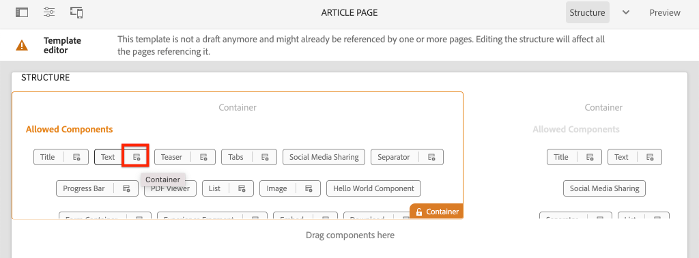
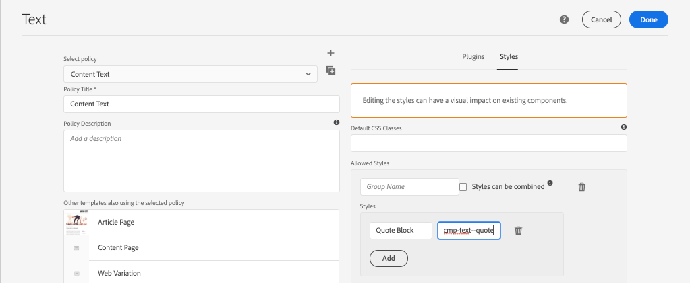

# Desarrollo con el sistema de estilos {#developing-with-the-style-system}

Obtenga información sobre cómo implementar estilos individuales y reutilizar componentes principales mediante el sistema de estilos de Experience Manager. Este tutorial trata el desarrollo del sistema de estilos para ampliar los componentes principales con CSS específica de la marca y las configuraciones de políticas avanzadas del Editor de plantillas.

## Requisitos previos {#prerequisites}

Revise las herramientas e instrucciones necesarias para configurar un [entorno de desarrollo local](overview.md#local-dev-environment).

También se recomienda revisar el tutorial [Client-side Libraries and Front-end Workflow](client-side-libraries.md) para comprender los fundamentos de las bibliotecas del lado del cliente y las distintas herramientas front-end integradas en el proyecto AEM.

### Proyecto de inicio

>[!NOTE]
>
> Si ha completado correctamente el capítulo anterior, puede volver a utilizar el proyecto y omitir los pasos para extraer el proyecto de inicio.

Consulte el código de línea base sobre el que se basa el tutorial:

1. Consulte la rama `tutorial/style-system-start` de [GitHub](https://github.com/adobe/aem-guides-wknd)

   ```shell
   $ cd aem-guides-wknd
   $ git checkout tutorial/style-system-start
   ```

1. Implemente código base en una instancia local de AEM con sus habilidades con Maven:

   ```shell
   $ mvn clean install -PautoInstallSinglePackage
   ```

   >[!NOTE]
   >
   > Si utiliza AEM 6.5 o 6.4, anexe el perfil `classic` a cualquier comando Maven.

   ```shell
   $ mvn clean install -PautoInstallSinglePackage -Pclassic
   ```

Siempre puede ver el código terminado en [GitHub](https://github.com/adobe/aem-guides-wknd/tree/tutorial/style-system-solution) o extraer el código localmente cambiando a la rama `tutorial/style-system-solution`.

## Objetivo

1. Aprenda a utilizar el sistema de estilos para aplicar CSS específica de la marca a los componentes principales de AEM.
1. Obtenga más información sobre la notación BEM y cómo se puede utilizar para aplicar un enfoque cuidadoso a los estilos.
1. Aplique configuraciones de directiva avanzadas con plantillas editables.

## Qué va a generar {#what-you-will-build}

En este capítulo utilizaremos la función [Sistema de estilos](https://docs.adobe.com/content/help/en/experience-manager-learn/sites/page-authoring/style-system-feature-video-use.html) para crear variaciones de los componentes **Título** y **Texto** utilizados en la página Artículo.


*Estilo de subrayado disponible para usar en el componente de título*

## Fondo {#background}

El [Sistema de estilos](https://docs.adobe.com/content/help/es-ES/experience-manager-65/developing/components/style-system.html) permite a los desarrolladores y editores de plantillas crear varias variaciones visuales de un componente. A su vez, los autores pueden decidir qué estilo utilizar al componer una página. Aprovecharemos el sistema de estilos en el resto del tutorial para lograr varios estilos únicos, mientras aprovechamos los componentes principales en un enfoque de código bajo.

La idea general del sistema de estilos es que los autores puedan elegir distintos estilos de aspecto de un componente. Los &quot;estilos&quot; están respaldados por clases CSS adicionales que se insertan en el div exterior de un componente. En las bibliotecas de cliente, las reglas CSS se añaden en función de estas clases de estilo para que el componente cambie de aspecto.

Puede encontrar [documentación detallada para el sistema de estilos aquí](https://experienceleague.adobe.com/docs/experience-manager-cloud-service/sites/authoring/features/style-system.html). También hay un gran [vídeo técnico para comprender el sistema de estilos](https://experienceleague.adobe.com/docs/experience-manager-learn/sites/developing/style-system-technical-video-understand.html).

## Estilo de subrayado: título {#underline-style}

El [Componente de título](https://experienceleague.adobe.com/docs/experience-manager-core-components/using/components/title.html) se ha procesado como proxy en el proyecto en `/apps/wknd/components/title` como parte del módulo **ui.apps**. Los estilos predeterminados de los elementos Heading (`H1`, `H2`, `H3`...) ya se han implementado en el módulo **ui.frontend**.

Los [diseños de artículo de WKND](assets/pages-templates/wknd-article-design.xd) contienen un estilo único para el componente Título con un subrayado. En lugar de crear dos componentes o modificar el cuadro de diálogo de componentes, se puede utilizar el sistema de estilos para permitir a los autores añadir un estilo de subrayado.


### Inspeccionar marcado del título

Como desarrollador de front-end, el primer paso para diseñar un componente principal es comprender el marcado generado por el componente.

1. Abra un explorador nuevo y vea el componente Título en el sitio de la biblioteca de componentes principales de AEM: [https://www.aemcomponents.dev/content/core-components-examples/library/page-authoring/title.html](https://www.aemcomponents.dev/content/core-components-examples/library/page-authoring/title.html)

1. A continuación se muestra el marcado del componente Título :

   ```html
   <div class="cmp-title">
       <h1 class="cmp-title__text">Lorem Ipsum</h1>
   </div>
   ```

   Anotación BEM del componente Título:

   ```plain
   BLOCK cmp-title
       ELEMENT cmp-title__text
   ```

1. El sistema de estilos agrega una clase CSS al div exterior que rodea el componente. Por lo tanto, el marcado al que nos dirigiremos se parecerá a lo siguiente:

   ```html
   <div class="STYLE-SYSTEM-CLASS-HERE"> <!-- Custom CSS class - implementation gets to define this -->
       <div class="cmp-title">
           <h1 class="cmp-title__text">Lorem Ipsum</h1>
       </div>
   </div>
   ```

### Implementar el estilo de subrayado: ui.frontend

A continuación, implemente el estilo Subrayado utilizando el módulo **ui.frontend** de nuestro proyecto. Utilizaremos el servidor de desarrollo de webpack que se incluye con el módulo **ui.frontend** para obtener una vista previa de los estilos *antes de* implementarlos en una instancia local de AEM.

1. Inicie el servidor de desarrollo de webpack ejecutando el siguiente comando desde el módulo **ui.frontend**:

   ```shell
   $ cd ~/code/aem-guides-wknd/ui.frontend/
   $ npm start
   
   > aem-maven-archetype@1.0.0 start code/aem-guides-wknd/ui.frontend
   > webpack-dev-server --open --config ./webpack.dev.js
   ```

   Esto debería abrir un explorador en [http://localhost:8080](http://localhost:8080).

   >[!NOTE]
   >
   > Si las imágenes parecen rotas, asegúrese de que el proyecto de inicio se haya implementado en una instancia local de AEM (que se ejecuta en el puerto 4502) y que el explorador utilizado también haya iniciado sesión en la instancia local de AEM.

   

1. En el IDE, abra el archivo `index.html` ubicado en: `ui.frontend/src/main/webpack/static/index.html`. Este es el marcado estático utilizado por el servidor de desarrollo de webpack.
1. En `index.html` busque una instancia del Componente de título a la que agregar el estilo de subrayado buscando en el documento *cmp-title*. Elija el componente Título con el texto *&quot;Vans off the Wall Skatepark&quot;* (línea 218). Agregue la clase `cmp-title--underline` al div circundante:

   ```diff
   - <div class="title aem-GridColumn--phone--12 aem-GridColumn aem-GridColumn--default--8">
   + <div class="cmp-title--underline title aem-GridColumn--phone--12 aem-GridColumn aem-GridColumn--default--8">
        <div data-cmp-data-layer="{&#34;title-8bea562fa0&#34;:{&#34;@type&#34;:&#34;wknd/components/title&#34;,&#34;repo:modifyDate&#34;:&#34;2021-01-22T18:54:20Z&#34;,&#34;dc:title&#34;:&#34;Vans Off the Wall&#34;}}" id="title-8bea562fa0" class="cmp-title">
            <h2 class="cmp-title__text">Vans Off the Wall</h2>
        </div>
    </div>
   ```

1. Vuelva al explorador y compruebe que la clase adicional se refleja en el marcado.
1. Vuelva al módulo **ui.frontend** y actualice el archivo `title.scss` ubicado en: `ui.frontend/src/main/webpack/components/_title.scss`:

   ```css
   /* Add Title Underline Style */
   .cmp-title--underline {
       .cmp-title__text {
           &:after {
           display: block;
               width: 84px;
               padding-top: 8px;
               content: '';
               border-bottom: 2px solid $brand-primary;
           }
       }
   }
   ```

   >[!NOTE]
   >
   >Se considera una práctica recomendada enmarcar siempre los estilos de ámbito al componente de destino. Esto garantiza que los estilos adicionales no afecten a otras áreas de la página.
   >
   >Todos los componentes principales se adhieren a **[Notación BEM](https://github.com/adobe/aem-core-wcm-components/wiki/css-coding-conventions)**. Se recomienda dirigirse a la clase CSS externa al crear un estilo predeterminado para un componente. Otra práctica recomendada es dirigirse a los nombres de clase especificados por la notación BEM de los componentes principales en lugar de a los elementos HTML.

1. Vuelva al explorador una vez más y debería ver el estilo Subrayado añadido:

   

1. Detenga el servidor de desarrollo de webpack.

### Agregar una directiva de título

A continuación, es necesario añadir una nueva política para los componentes de Título para permitir que los autores de contenido elijan el estilo Subrayado para aplicarlo a componentes específicos. Esto se realiza mediante el Editor de plantillas en AEM.

1. Implemente el código base en una instancia local de AEM con sus habilidades con Maven:

   ```shell
   $ cd ~/code/aem-guides-wknd
   $ mvn clean install -PautoInstallSinglePackage
   ```

1. Vaya a la plantilla **Article Page** ubicada en: [http://localhost:4502/editor.html/conf/wknd/settings/wcm/templates/article-page/structure.html](http://localhost:4502/editor.html/conf/wknd/settings/wcm/templates/article-page/structure.html)

1. En el modo **Structure**, en el **Contenedor de diseño** principal, seleccione el icono **Política** junto al componente **Título** que aparece en *Componentes permitidos*:

   

1. Cree una nueva directiva para el componente Título con los siguientes valores:

   *Título de la política **:  **Título WKND**

   *Propiedades*  > Pestaña  *Estilos*  >  *Agregar un nuevo estilo*

   **Subrayado** :  `cmp-title--underline`

   

   Haga clic en **Listo** para guardar los cambios en la directiva Título.

   >[!NOTE]
   >
   > El valor `cmp-title--underline` coincide con la clase CSS a la que nos dirigimos anteriormente al desarrollar en el módulo **ui.frontend**.

### Aplicar estilo de subrayado

Por último, como autor, podemos elegir aplicar el estilo de subrayado a ciertos componentes del título.

1. Vaya al artículo **La Skateparks** del editor de AEM Sites en: [http://localhost:4502/editor.html/content/wknd/us/en/magazine/guide-la-skateparks.html](http://localhost:4502/editor.html/content/wknd/us/en/magazine/guide-la-skateparks.html)
1. En el modo **Editar**, elija un componente Título. Haga clic en el icono **pincel** y seleccione el estilo **Subrayado**:

   

   Como autor, debería poder activar o desactivar el estilo.

1. Haga clic en el icono **Información de página** > **Ver tal y como aparece publicado** para inspeccionar la página fuera del editor de AEM.

   

   Utilice las herramientas para desarrolladores del navegador para verificar que el marcado alrededor del componente Título tenga la clase CSS `cmp-title--underline` aplicada al div exterior.

## Estilo de bloque de comillas - Texto {#text-component}

A continuación, repita pasos similares para aplicar un estilo único al [Componente de texto](https://experienceleague.adobe.com/docs/experience-manager-core-components/using/components/text.html). El componente Texto se ha procesado como proxy en el proyecto en `/apps/wknd/components/text` como parte del módulo **ui.apps**. Los estilos predeterminados de los elementos de párrafo ya se han implementado en **ui.frontend**.

Los [diseños de artículo WKND](assets/pages-templates/wknd-article-design.xd) contienen un estilo único para el componente Texto con un bloque de comillas:


### Inspeccionar el marcado del componente de texto

Una vez más analizaremos el marcado del componente Texto.

1. Revise el marcado del componente Texto en: [https://www.aemcomponents.dev/content/core-components-examples/library/page-authoring/text.html](https://www.aemcomponents.dev/content/core-components-examples/library/page-authoring/text.html)

1. A continuación se muestra el marcado del componente Texto :

   ```html
   <div class="text">
       <div class="cmp-text" data-cmp-data-layer="{&quot;text-2d9d50c5a7&quot;:{&quot;@type&quot;:&quot;core/wcm/components/text/v2/text&quot;,&quot;repo:modifyDate&quot;:&quot;2019-01-22T11:56:17Z&quot;,&quot;xdm:text&quot;:&quot;<p>Lorem ipsum dolor sit amet, consectetur adipiscing elit, sed do eiusmod tempor incididunt ut labore et dolore magna aliqua. Eu mi bibendum neque egestas congue quisque egestas. Varius morbi enim nunc faucibus a pellentesque. Scelerisque eleifend donec pretium vulputate sapien nec sagittis.</p>\n&quot;}}" id="text-2d9d50c5a7">
           <p>Lorem ipsum dolor sit amet, consectetur adipiscing elit, sed do eiusmod tempor incididunt ut labore et dolore magna aliqua. Eu mi bibendum neque egestas congue quisque egestas. Varius morbi enim nunc faucibus a pellentesque. Scelerisque eleifend donec pretium vulputate sapien nec sagittis.</p>
       </div>
   </div>
   ```

   Anotación BEM del componente de texto:

   ```plain
   BLOCK cmp-text
       ELEMENT
   ```

1. El sistema de estilos agrega una clase CSS al div exterior que rodea el componente. Por lo tanto, el marcado al que nos dirigiremos se parecerá a lo siguiente:

   ```html
   <div class="text STYLE-SYSTEM-CLASS-HERE"> <!-- Custom CSS class - implementation gets to define this -->
       <div class="cmp-text" data-cmp-data-layer="{&quot;text-2d9d50c5a7&quot;:{&quot;@type&quot;:&quot;core/wcm/components/text/v2/text&quot;,&quot;repo:modifyDate&quot;:&quot;2019-01-22T11:56:17Z&quot;,&quot;xdm:text&quot;:&quot;<p>Lorem ipsum dolor sit amet, consectetur adipiscing elit, sed do eiusmod tempor incididunt ut labore et dolore magna aliqua. Eu mi bibendum neque egestas congue quisque egestas. Varius morbi enim nunc faucibus a pellentesque. Scelerisque eleifend donec pretium vulputate sapien nec sagittis.</p>\n&quot;}}" id="text-2d9d50c5a7">
           <p>Lorem ipsum dolor sit amet, consectetur adipiscing elit, sed do eiusmod tempor incididunt ut labore et dolore magna aliqua. Eu mi bibendum neque egestas congue quisque egestas. Varius morbi enim nunc faucibus a pellentesque. Scelerisque eleifend donec pretium vulputate sapien nec sagittis.</p>
       </div>
   </div>
   ```

### Implementar el estilo de bloque de comillas: ui.frontend

A continuación, implementaremos el estilo Bloque de comillas utilizando el módulo **ui.frontend** de nuestro proyecto.

1. Inicie el servidor de desarrollo de webpack ejecutando el siguiente comando desde el módulo **ui.frontend**:

   ```shell
   $ cd ~/code/aem-guides-wknd/ui.frontend/
   $ npm start
   ```

1. En el IDE, abra el archivo `index.html` ubicado en: `ui.frontend/src/main/webpack/static/index.html`.
1. En `index.html` busque una instancia del componente de texto buscando el texto *&quot;Jacob Wester&quot;* (línea 210). Agregue la clase `cmp-text--quote` al div circundante:

   ```diff
   - <div class="text aem-GridColumn--phone--12 aem-GridColumn aem-GridColumn--default--8">
   + <div class="cmp-text--quote text aem-GridColumn--phone--12 aem-GridColumn aem-GridColumn--default--8">
        <div data-cmp-data-layer="{&#34;text-a15f39a83a&#34;:{&#34;@type&#34;:&#34;wknd/components/text&#34;,&#34;repo:modifyDate&#34;:&#34;2021-01-22T00:23:27Z&#34;,&#34;xdm:text&#34;:&#34;&lt;blockquote>&amp;quot;There is no better place to shred then Los Angeles.”&lt;/blockquote>\r\n&lt;p>- Jacob Wester, Pro Skater&lt;/p>\r\n&#34;}}" id="text-a15f39a83a" class="cmp-text">
            <blockquote>&quot;There is no better place to shred then Los Angeles.”</blockquote>
            <p>- Jacob Wester, Pro Skater</p>
        </div>
    </div>
   ```

1. Actualice el archivo `text.scss` ubicado en: `ui.frontend/src/main/webpack/components/_text.scss`:

   ```css
   /* WKND Text Quote style */
   .cmp-text--quote {
       .cmp-text {
           background-color: $brand-third;
           margin: 1em 0em;
           padding: 1em;
   
           blockquote {
               border: none;
               font-size: $font-size-large;
               font-family: $font-family-serif;
               padding: 14px 14px;
               margin: 0;
               margin-bottom: 0.5em;
   
               &:after {
                   border-bottom: 2px solid $brand-primary; /*yellow border */
                   content: '';
                   display: block;
                   position: relative;
                   top: 0.25em;
                   width: 80px;
               }
           }
           p {
               font-family:  $font-family-serif;
           }
       }
   }
   ```

   >[!CAUTION]
   >
   > En este caso, los elementos HTML sin procesar se dirigen a los estilos. Esto se debe a que el componente Texto proporciona un Editor de texto enriquecido para los autores de contenido. La creación de estilos directamente contra el contenido de RTE debe hacerse con cuidado y es aún más importante adaptar los estilos.

1. Vuelva al explorador una vez más y debería ver el estilo de bloque Cita añadido:

   

1. Detenga el servidor de desarrollo de webpack.

### Agregar una directiva de texto

A continuación, añada una nueva política para los componentes Texto .

1. Implemente código base en una instancia local de AEM con sus habilidades con Maven:

   ```shell
   $ cd ~/code/aem-guides-wknd
   $ mvn clean install -PautoInstallSinglePackage
   ```

1. Vaya a la **Plantilla de página de artículo** ubicada en: [http://localhost:4502/editor.html/conf/wknd/settings/wcm/templates/article-page/structure.html](http://localhost:4502/editor.html/conf/wknd/settings/wcm/templates/article-page/structure.html)).

1. En el modo **Structure**, en el **Contenedor de diseño** principal, seleccione el icono **Política** junto al componente **Texto** que aparece en *Componentes permitidos*:

   

1. Actualice la política del componente Texto con los siguientes valores:

   *Título de la política **:  **Texto de contenido**

   *Complementos*  > Estilos  *de párrafo*  >  *Activar estilos de párrafo*

   *Pestaña*  Estilos >  *Agregar un nuevo estilo*

   **Bloque de comillas** :  `cmp-text--quote`

   

   

   Haga clic en **Listo** para guardar los cambios en la directiva de texto.

### Aplicar estilo de bloque de cotización

1. Vaya al artículo **La Skateparks** del editor de AEM Sites en: [http://localhost:4502/editor.html/content/wknd/us/en/magazine/guide-la-skateparks.html](http://localhost:4502/editor.html/content/wknd/us/en/magazine/guide-la-skateparks.html)
1. En el modo **Editar**, elija un componente Texto. Edite el componente para incluir un elemento de presupuesto:

   

1. Seleccione el componente de texto y haga clic en el icono **pincel** y seleccione el estilo **Bloque de comillas**:

   

   Como autor, debería poder activar o desactivar el estilo.

## Ancho fijo: contenedor (bono) {#layout-container}

Los componentes de contenedor se han utilizado para crear la estructura básica de la plantilla de página de artículo y proporcionar las zonas de colocación para que los autores de contenido añadan contenido en una página. Los contenedores también pueden aprovechar el sistema de estilos, lo que proporciona a los autores de contenido aún más opciones para diseñar diseños.

El **Contenedor principal** de la plantilla Página del artículo contiene los dos contenedores que se pueden crear y tiene una anchura fija.


*Contenedor principal en la plantilla de página de artículo*.

La directiva del **Contenedor principal** establece el elemento predeterminado como `main`:


El CSS que hace que el **Contenedor principal** sea fijo se configura en el módulo **ui.frontend** en `ui.frontend/src/main/webpack/site/styles/container_main.scss` :

```SCSS
main.container {
    padding: .5em 1em;
    max-width: $max-content-width;
    float: unset!important;
    margin: 0 auto!important;
    clear: both!important;
}
```

En lugar de segmentar el elemento HTML `main`, se puede usar el sistema de estilos para crear un estilo **Fixed width** como parte de la directiva Contenedor. El sistema de estilos podría dar a los usuarios la opción de alternar entre los contenedores **Fixed width** y **Fluid width**.

1. **Desafío para una bonificación** : utilice las lecciones aprendidas de ejercicios anteriores y utilice el Sistema de estilos para implementar un estilo de  **anchura** fijo  **y** fluido para el componente Contenedor.

## Felicitaciones! {#congratulations}

Felicidades, la página de artículos está casi completamente diseñada y ha obtenido experiencia práctica mediante el sistema de estilos de AEM.

### Pasos siguientes {#next-steps}

Conozca los pasos de principio a fin para crear un [componente personalizado de AEM](custom-component.md) que muestre contenido creado en un cuadro de diálogo y explore el desarrollo de un modelo de Sling para encapsular la lógica empresarial que rellena el HTL del componente.

Vea el código terminado en [GitHub](https://github.com/adobe/aem-guides-wknd) o revise e implemente el código localmente en la rama `tutorial/style-system-solution` de Git.

1. Clona el repositorio [github.com/adobe/aem-wknd-guides](https://github.com/adobe/aem-guides-wknd).
1. Consulte la rama `tutorial/style-system-solution`.
