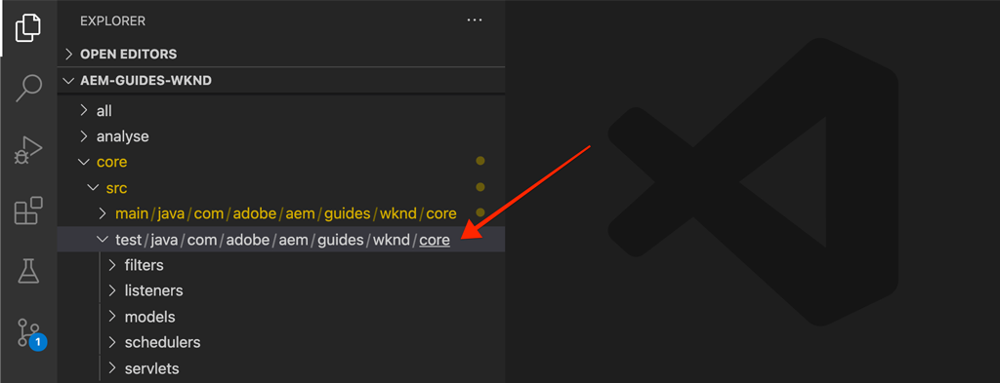

# Prueba de unidad {#unit-testing}

Este tutorial trata la implementación de una prueba unitaria que valida el comportamiento del modelo Sling del componente Byline, creado en el tutorial [Componente personalizado](./custom-component.md).

## Requisitos previos {#prerequisites}

Consulte el código de línea base que el tutorial genera:

1. Clona el repositorio [github.com/adobe/aem-guides-wknd](https://github.com/adobe/aem-guides-wknd).
1. Consulte la rama `unit-testing/start`

```shell
$ git clone git@github.com:adobe/aem-guides-wknd.git ~/code/aem-guides-wknd
$ cd ~/code/aem-guides-wknd
$ git checkout unit-testing/start
```

Siempre puede realizar la vista del código terminado en [GitHub](https://github.com/adobe/aem-guides-wknd/tree/unit-testing/solution) o extraer el código localmente cambiando a la rama `unit-testing/solution`.

## Objetivo

1. Comprender los conceptos básicos de las pruebas unitarias.
1. Obtenga información sobre los marcos y las herramientas que se utilizan habitualmente para probar AEM código.
1. Comprender las opciones para burlarse o simular recursos de AEM al escribir pruebas unitarias.

## Fondo {#unit-testing-background}

En este tutorial, exploraremos cómo escribir [Pruebas unitarias](https://en.wikipedia.org/wiki/Unit_testing) para el [Modelo Sling](https://sling.apache.org/documentation/bundles/models.html) de nuestro componente Byline (creado en [Creación de un componente AEM personalizado](custom-component.md)). Las pruebas unitarias son pruebas de tiempo de compilación escritas en Java que verifican el comportamiento esperado del código Java. Cada prueba unitaria suele ser pequeña y valida la salida de un método (o unidades de trabajo) con los resultados esperados.

Utilizaremos AEM prácticas recomendadas y usaremos:

* [JUnit 5](https://junit.org/junit5/)
* [Módulo de prueba de Mockito](https://site.mockito.org/)
* [wcm.io Test Framework](https://wcm.io/testing/) (que se basa en  [Apache Sling Mocks](https://sling.apache.org/documentation/development/sling-mock.html))

>[!VIDEO](https://video.tv.adobe.com/v/30207/?quality=12&learn=on)

## Pruebas unitarias y Administrador de nube de Adobes {#unit-testing-and-adobe-cloud-manager}

[Adobe Cloud ](https://docs.adobe.com/content/help/es-ES/experience-manager-cloud-manager/using/introduction-to-cloud-manager.html) Manager integra la ejecución de pruebas unitarias y los informes de cobertura de  [código ](https://docs.adobe.com/content/help/en/experience-manager-cloud-manager/using/how-to-use/understand-your-test-results.html#code-quality-testing) en su canalización de CI/CD para ayudar a fomentar y promover las mejores prácticas del código de AEM de pruebas unitarias.

Aunque el código de prueba unitaria es una buena práctica para cualquier base de código, al utilizar Cloud Manager es importante aprovechar las funciones de sistema de informes y pruebas de calidad del código proporcionando pruebas unitarias para que Cloud Manager se ejecute.

## Inspect: las dependencias Maven de prueba {#inspect-the-test-maven-dependencies}

El primer paso es inspeccionar las dependencias de Maven para admitir la escritura y ejecución de las pruebas. Se requieren cuatro dependencias:

1. JUnit5
1. Mockito Test Framework
1. Apache Sling se burla
1. AEM Mocks Test Framework (por io.wcm)

Las dependencias de prueba **JUnit5**, **Mockito** y **AEM Mockito** se agregan automáticamente al proyecto durante la configuración mediante el arquetipo [AEM Maven](project-setup.md).

1. Para vista de estas dependencias, abra el POM del reactor principal en **aem-guides-wknd/pom.xml**, navegue hasta `<dependencies>..</dependencies>` y asegúrese de que se definen las siguientes dependencias:

   ```xml
   <dependencies>
       ...
       <!-- Testing -->
       <dependency>
           <groupId>org.junit</groupId>
           <artifactId>junit-bom</artifactId>
           <version>5.5.2</version>
           <type>pom</type>
           <scope>import</scope>
       </dependency>
       <dependency>
           <groupId>org.slf4j</groupId>
           <artifactId>slf4j-simple</artifactId>
           <version>1.7.25</version>
           <scope>test</scope>
       </dependency>
       <dependency>
           <groupId>org.mockito</groupId>
           <artifactId>mockito-core</artifactId>
           <version>2.25.1</version>
           <scope>test</scope>
       </dependency>
       <dependency>
           <groupId>org.mockito</groupId>
           <artifactId>mockito-junit-jupiter</artifactId>
           <version>2.25.1</version>
           <scope>test</scope>
       </dependency>
       <dependency>
           <groupId>junit-addons</groupId>
           <artifactId>junit-addons</artifactId>
           <version>1.4</version>
           <scope>test</scope>
       </dependency>
       <dependency>
           <groupId>io.wcm</groupId>
           <artifactId>io.wcm.testing.aem-mock.junit5</artifactId>
           <!-- Prefer the latest version of AEM Mock Junit5 dependency -->
           <version>2.5.2</version>
           <scope>test</scope>
       </dependency>
       ...
   </dependencies>
   ```

1. Abra **aem-guides-wknd/core/pom.xml** y vista de que las dependencias de prueba correspondientes están disponibles:

   ```xml
   ...
   <dependency>
       <groupId>org.junit.jupiter</groupId>
       <artifactId>junit-jupiter</artifactId>
       <scope>test</scope>
   </dependency>
   <dependency>
       <groupId>org.mockito</groupId>
       <artifactId>mockito-core</artifactId>
       <scope>test</scope>
   </dependency>
   <dependency>
       <groupId>org.mockito</groupId>
       <artifactId>mockito-junit-jupiter</artifactId>
       <scope>test</scope>
   </dependency>
   <dependency>
       <groupId>junit-addons</groupId>
       <artifactId>junit-addons</artifactId>
   </dependency>
   <dependency>
       <groupId>io.wcm</groupId>
       <artifactId>io.wcm.testing.aem-mock.junit5</artifactId>
   </dependency>
   ...
   ```

   Una carpeta de origen paralela en el proyecto **core** contendrá las pruebas unitarias y los archivos de prueba de soporte. Esta carpeta **test** proporciona la separación de las clases de prueba del código fuente, pero permite que las pruebas actúen como si estuvieran en los mismos paquetes que el código fuente.

## Creación de la prueba JUnit {#creating-the-junit-test}

Las pruebas unitarias suelen asignar 1 a 1 con clases Java. En este capítulo, escribiremos una prueba JUnit para el **BylineImpl.java**, que es el modelo Sling que respalda el componente Byline.



*Ubicación en la que se almacenan las pruebas unitarias.*

1. Podemos hacerlo en Eclipse, haciendo clic con el botón derecho en la clase Java que se va a probar y seleccionando **Nuevo > Otro > Java > JUnit > JUnit Test Case**.

   

1. En la primera pantalla del asistente, valide lo siguiente:

   * El tipo de prueba JUnit es **Nueva prueba JUnit Jupiter** ya que estas son las dependencias JUnit Maven configuradas en nuestro **pom.xml**.
   * El **paquete** es el paquete java de la clase que se está probando (`BylineImpl.java`)
   * La carpeta Source apunta al proyecto **core** (`aem-guides-wknd.core/src/test/java`) que indica a Eclipse dónde se almacenan los archivos de prueba de unidades.
   * El código auxiliar del método `setUp()` se creará manualmente; veremos cómo se usa más tarde.
   * Y la clase bajo prueba es `BylineImpl.java`, ya que ésta es la clase Java que queremos probar.

   

   *Asistente para casos de prueba de JUnit - paso 2*

1. Haga clic en el botón **Siguiente** en la parte inferior del asistente.

   Este paso siguiente ayuda con la generación automática de métodos de prueba. Normalmente, cada método público de la clase Java tiene al menos un método de prueba correspondiente, lo que valida su comportamiento. A menudo, una prueba unitaria tendrá múltiples métodos de prueba probando un único método público, cada uno de los cuales representa un conjunto diferente de entradas o estados.

   En el asistente, seleccione todos los métodos en `BylineImpl`, con la excepción de `init()`, que es un método utilizado internamente por el Modelo Sling (mediante `@PostConstruct`). Comprobaremos el `init()` de manera efectiva probando todos los demás métodos, ya que los demás métodos dependen de que `init()` se ejecute correctamente.

   Se pueden agregar nuevos métodos de prueba en cualquier momento a la clase de prueba JUnit. Esta página del asistente es simplemente para mayor comodidad.

   

   *Asistente para casos de prueba de JUnit (continuación)*

1. Haga clic en el botón Finalizar en la parte inferior del asistente para generar el archivo de prueba JUnit5.
1. Verifique que el archivo de prueba JUnit5 se haya creado en la estructura de paquete correspondiente en **aem-guide-wknd.core** > **/src/test/java** como un archivo denominado `BylineImplTest.java`.

## Revisión de BylineImplTest.java {#reviewing-bylineimpltest-java}

Nuestro archivo de prueba tiene una serie de métodos autogenerados. En este punto, no hay nada AEM específico en este archivo de prueba JUnit.

El primer método es `public void setUp() { .. }`, que se anota con `@BeforeEach`.

La anotación `@BeforeEach` es una anotación JUnit que ordena a la prueba JUnit que se ejecuta ejecutar este método antes de ejecutar cada método de prueba en esta clase.

Los métodos subsiguientes son los propios métodos de prueba y se marcan como tales con la anotación `@Test`. Tenga en cuenta que, de forma predeterminada, todas nuestras pruebas están configuradas para fallar.

Cuando se ejecuta esta clase de prueba JUnit (también conocida como JUnit Test Case), cada método marcado con `@Test` se ejecuta como una prueba que puede superar o fallar.


*`core/src/test/java/com/adobe/aem/guides/wknd/core/models/impl/BylineImplTest.java`*

1. Ejecute el Caso de prueba JUnit haciendo clic con el botón derecho en el nombre de la clase y **Ejecutar como > Prueba JUnit**.

   

   *Haga clic con el botón derecho en BylineImplTests.java > Ejecutar como > Prueba de JUnit*

1. Como se espera, todas las pruebas fallan.

   

   *Vista JUnit en Eclipse > Ventana > Mostrar Vista > Java > JUnit*

## Revisión de BylineImpl.java {#reviewing-bylineimpl-java}

Al escribir pruebas unitarias, existen dos enfoques principales:

* [Desarrollo](https://en.wikipedia.org/wiki/Test-driven_development) impulsado por TDD o pruebas, que implica la escritura de las pruebas unitarias de manera incremental, inmediatamente antes de que se desarrolle la implementación; escriba una prueba, escriba la implementación para que la prueba pase.
* Desarrollo de implementación-primero, que implica desarrollar primero código de trabajo y luego escribir pruebas que validen dicho código.

En este tutorial, se utiliza este último método (ya que ya hemos creado un **BylineImpl.java** en un capítulo anterior). Debido a esto, debemos revisar y entender el comportamiento de sus métodos públicos, pero también algunos de sus detalles de implementación. Esto puede sonar contrario, ya que una buena prueba sólo debería ocuparse de los insumos y los resultados, pero al trabajar en AEM, hay una variedad de consideraciones de implementación que deben entenderse para construir las pruebas en ejecución.

En el contexto de la AEM, la TDD requiere un nivel de experiencia y es mejor que la adopten los desarrolladores AEM que son competentes en AEM desarrollo y pruebas unitarias de AEM código.

>[!VIDEO](https://video.tv.adobe.com/v/30208/?quality=12&learn=on)

## Configuración de AEM contexto de prueba {#setting-up-aem-test-context}

La mayoría del código escrito para AEM se basa en las API de JCR, Sling o AEM, que a su vez requieren que el contexto de una AEM en ejecución se ejecute correctamente.

Dado que las pruebas unitarias se ejecutan en la compilación, fuera del contexto de una instancia de AEM en ejecución, no existe ese recurso. Para facilitar esto, [AEM Mocks](https://wcm.io/testing/aem-mock/usage.html) de wcm.io crea un contexto de simulación que permite que estas API actúen principalmente como si se estuvieran ejecutando en AEM.

1. Cree un contexto AEM mediante **wcm.io&#39;s** `AemContext` en **BylineImplTest.java** agregándolo como una extensión JUnit decorada con `@ExtendWith` al archivo **BylineImplTest.java**. La extensión se ocupa de todas las tareas de inicialización y limpieza necesarias. Cree una variable de clase para `AemContext` que se pueda utilizar para todos los métodos de prueba.

   ```java
   import org.junit.jupiter.api.extension.ExtendWith;
   import io.wcm.testing.mock.aem.junit5.AemContext;
   import io.wcm.testing.mock.aem.junit5.AemContextExtension;
   ...
   
   @ExtendWith(AemContextExtension.class)
   class BylineImplTest {
   
       private final AemContext ctx = new AemContext();
   ```

   Esta variable, `ctx`, expone un contexto AEM de simulación que proporciona una serie de abstracciones AEM y Sling:

   * El modelo Sling de BylineImpl se registrará en este contexto
   * Se crean estructuras de contenido JCR simuladas en este contexto
   * Los servicios OSGi personalizados se pueden registrar en este contexto
   * Proporciona una gran variedad de objetos de simulación y elementos de ayuda requeridos, como objetos SlingHttpServletRequest, una variedad de servicios de simulación de Sling y OSGi AEM como ModelFactory, PageManager, Page, Template, ComponentManager, Component, TagManager, Tag, etc.
      * *Tenga en cuenta que no todos los métodos para estos objetos están implementados.*
   * Y [mucho más](https://wcm.io/testing/aem-mock/usage.html)!

   El objeto **`ctx`** actuará como punto de entrada para la mayor parte de nuestro contexto de simulación.

1. En el método `setUp(..)`, que se ejecuta antes de cada método `@Test`, defina un estado común de prueba de prueba simulada:

   ```java
   @BeforeEach
   public void setUp() throws Exception {
       ctx.addModelsForClasses(BylineImpl.class);
       ctx.load().json("/com/adobe/aem/guides/wknd/core/models/impl/BylineImplTest.json", "/content");
   }
   ```

   * **`addModelsForClasses`** registra el modelo de Sling que se va a probar, en el contexto de AEM de simulación, para que se pueda crear una instancia en los  `@Test` métodos.
   * **`load().json`** carga estructuras de recursos en el contexto de prueba, lo que permite que el código interactúe con estos recursos como si fueran proporcionados por un repositorio real. Las definiciones de recursos del archivo **`BylineImplTest.json`** se cargan en el contexto JCR de prueba en **/content**.
   * **`BylineImplTest.json`** aún no existe, así que creémoslo y definamos las estructuras de recursos JCR necesarias para la prueba.

1. Los archivos JSON que representan las estructuras de recursos ficticios se almacenan en **core/src/test/resources** siguiendo las mismas rutas de paquetes que el archivo de prueba Java JUnit.

   Cree un nuevo archivo JSON en **core/test/resources/com/adobe/aem/guide/wknd/core/models/impl** con el nombre **BylineImplTest.json** con el siguiente contenido:

   ```json
   {
       "byline": {
       "jcr:primaryType": "nt:unstructured",
       "sling:resourceType": "wknd/components/content/byline"
       }
   }
   ```

   

   Este JSON define una definición de recurso simulada para la prueba de unidad de componente Byline. En este punto, el JSON tiene el conjunto mínimo de propiedades necesarias para representar un recurso de contenido de componente Byline, el `jcr:primaryType` y el `sling:resourceType`.

   Una regla general de estas pruebas al trabajar con pruebas unitarias es crear el conjunto mínimo de contenido, contexto y código de prueba necesario para satisfacer cada prueba. Evite la tentación de crear un contexto de burla completo antes de escribir las pruebas, ya que a menudo resulta en artefactos innecesarios.

   Ahora, con la existencia de **BylineImplTest.json**, cuando se ejecuta `ctx.json("/com/adobe/aem/guides/wknd/core/models/impl/BylineImplTest.json", "/content")`, las definiciones de recursos simulados se cargan en el contexto en la ruta **/content.**

## Probando getName() {#testing-get-name}

Ahora que tenemos una configuración básica de contexto de prueba, vamos a escribir nuestra primera prueba para **getName()** de BylineImpl. Esta prueba debe garantizar que el método **getName()** devuelve el nombre de autor correcto almacenado en la propiedad &quot;**name&quot;** del recurso.

1. Actualice el método **testGetName**() en **BylineImplTest.java** de la siguiente manera:

   ```java
   import com.adobe.aem.guides.wknd.core.components.Byline;
   import static org.junit.jupiter.api.Assertions.assertEquals;
   ...
   @Test
   public void testGetName() {
       final String expected = "Jane Doe";
   
       ctx.currentResource("/content/byline");
       Byline byline = ctx.request().adaptTo(Byline.class);
   
       String actual = byline.getName();
   
       assertEquals(expected, actual);
   }
   ```

   * **`String expected`** establece el valor esperado. Lo estableceremos en &quot;**Jane Done**&quot;.
   * **`ctx.currentResource`** establece el contexto del recurso de prueba con el que se evaluará el código, de modo que se establece en  **/content/** bylineas, donde se carga el recurso de contenido de línea de prueba.
   * **`Byline byline`** crea una instancia del Modelo de secuencias de comandos adaptándolo desde el objeto de solicitud de simulación.
   * **`String actual`** invoca el método que estamos probando,  `getName()`en el objeto Byline Sling Model.
   * **`assertEquals`** afirma que el valor esperado coincide con el valor devuelto por el objeto byline Sling Model. Si estos valores no son iguales, la prueba fallará.

1. Ejecutar la prueba... y falla con un `NullPointerException`.

   Tenga en cuenta que esta prueba NO falla porque nunca hemos definido una propiedad `name` en el JSON de prueba, lo que provocará que la prueba falle, pero la ejecución de la prueba no ha llegado a ese punto. Esta prueba falla debido a un `NullPointerException` en el objeto byline mismo.

1. En el video de [Revisión de BylineImpl.java](#reviewing-bylineimpl-java) anterior, analizamos cómo si `@PostConstruct init()` genera una excepción evita que el modelo Sling cree instancias, y eso es lo que está sucediendo aquí.

   ```java
   @PostConstruct
   private void init() {
       image = modelFactory.getModelFromWrappedRequest(request, request.getResource(), Image.class);
   }
   ```

   Resulta que aunque el servicio ModelFactory OSGi se proporciona mediante el `AemContext` (a través del contexto Apache Sling), no todos los métodos se implementan, incluyendo `getModelFromWrappedRequest(...)` que se llama en el método `init()` de BylineImpl. Esto resulta en un [AbstractMethodError](https://docs.oracle.com/javase/8/docs/api/java/lang/AbstractMethodError.html), que en el término provoca que `init()` falle y la adaptación resultante del `ctx.request().adaptTo(Byline.class)` es un objeto nulo.

   Dado que los burlones proporcionados no pueden acomodar nuestro código, debemos implementar el contexto de burla nosotros mismos. Para esto, podemos usar Mockito para crear un objeto ModelFactory falso, que devuelve un objeto Image de broma cuando se invoca `getModelFromWrappedRequest(...)`.

   Ya que para poder crear instancias del Modelo Sling de firma, este contexto de burla debe estar establecido, podemos agregarlo al método `@Before setUp()`. También necesitamos agregar la `MockitoExtension.class` a la anotación `@ExtendWith` por encima de la clase **BylineImplTest**.

   ```java
   package com.adobe.aem.guides.wknd.core.models.impl;
   
   import org.mockito.junit.jupiter.MockitoExtension;
   import org.mockito.Mock;
   
   import com.adobe.aem.guides.wknd.core.models.Byline;
   import com.adobe.cq.wcm.core.components.models.Image;
   
   import io.wcm.testing.mock.aem.junit5.AemContext;
   import io.wcm.testing.mock.aem.junit5.AemContextExtension;
   
   import org.apache.sling.models.factory.ModelFactory;
   import org.junit.jupiter.api.BeforeEach;
   import org.junit.jupiter.api.Test;
   import org.junit.jupiter.api.extension.ExtendWith;
   
   import static org.junit.jupiter.api.Assertions.assertEquals;
   import static org.junit.jupiter.api.Assertions.fail;
   import static org.mockito.Mockito.*;
   import org.apache.sling.api.resource.Resource;
   
   @ExtendWith({ AemContextExtension.class, MockitoExtension.class })
   public class BylineImplTest {
   
       private final AemContext ctx = new AemContext();
   
       @Mock
       private Image image;
   
       @Mock
       private ModelFactory modelFactory;
   
       @BeforeEach
       public void setUp() throws Exception {
           ctx.addModelsForClasses(BylineImpl.class);
   
           ctx.load().json("/com/adobe/aem/guides/wknd/core/models/impl/BylineImplTest.json", "/content");
   
           lenient().when(modelFactory.getModelFromWrappedRequest(eq(ctx.request()), any(Resource.class), eq(Image.class)))
                   .thenReturn(image);
   
           ctx.registerService(ModelFactory.class, modelFactory, org.osgi.framework.Constants.SERVICE_RANKING,
                   Integer.MAX_VALUE);
       }
   
       @Test
       void testGetName() { ...
   }
   ```

   * **`@ExtendWith({AemContextExtension.class, MockitoExtension.class})`** marca la clase Test Case para que se ejecute con la  [extensión ](https://www.javadoc.io/page/org.mockito/mockito-junit-jupiter/latest/org/mockito/junit/jupiter/MockitoExtension.html) Mockito JUnit Jupiter, que permite el uso de las anotaciones @Mock para definir los objetos simulados en el nivel Class.
   * **`@Mock private Image`** crea un objeto de simulación de tipo  `com.adobe.cq.wcm.core.components.models.Image`. Tenga en cuenta que esto se define en el nivel de clase para que, según sea necesario, los métodos `@Test` puedan alterar su comportamiento según sea necesario.
   * **`@Mock private ModelFactory`** crea un objeto de simulación de tipo ModelFactory. Tenga en cuenta que esto es una burla pura de Mockito y no tiene métodos implementados en él. Tenga en cuenta que esto se define en el nivel de clase para que, según sea necesario, los métodos `@Test`puedan alterar su comportamiento según sea necesario.
   * **`when(modelFactory.getModelFromWrappedRequest(..)`** registra el comportamiento de la mofa para cuándo  `getModelFromWrappedRequest(..)` se llama en el objeto ModelFactory de prueba. El resultado definido en `thenReturn (..)` es devolver el objeto de imagen de prueba. Tenga en cuenta que este comportamiento solo se invoca cuando: el primer parámetro es igual al objeto de solicitud de `ctx`, el segundo parámetro es cualquier objeto Resource y el tercer parámetro debe ser la clase Core Components Image. Aceptamos cualquier recurso porque a lo largo de nuestras pruebas estableceremos el `ctx.currentResource(...)` en varios recursos falsos definidos en el **BylineImplTest.json**. Tenga en cuenta que agregamos la estricta **indulent()** porque más adelante desearemos anular este comportamiento de ModelFactory.
   * **`ctx.registerService(..)`.** registra el objeto ModelFactory falso en AemContext, con la clasificación de servicio más alta. Esto es necesario, ya que ModelFactory utilizado en el `init()` de BylineImpl se inyecta mediante el campo `@OSGiService ModelFactory model`. Para que AemContext pueda inyectar **nuestro** objeto de prueba, que gestiona las llamadas a `getModelFromWrappedRequest(..)`, debemos registrarlo como el servicio de mayor clasificación de ese tipo (ModelFactory).

1. Vuelva a ejecutar la prueba y, de nuevo, falla, pero esta vez el mensaje es claro por qué falló.

   

   *error de testGetName() debido a la afirmación*

   Recibimos un **Error de aserción** que significa que la condición de aserción en la prueba falló, y nos dice que el **valor esperado es &quot;Jane Doe&quot;** pero el valor real **es nulo**. Esto tiene sentido porque la propiedad &quot;**name&quot;** no se ha agregado para burlarse de la definición de recursos **/content/byline** en **BylineImplTest.json**, así que vamos a agregarla:

1. Actualice **BylineImplTest.json** para definir `"name": "Jane Doe".`

   ```json
   {
       "byline": {
       "jcr:primaryType": "nt:unstructured",
       "sling:resourceType": "wknd/components/content/byline",
       "name": "Jane Doe"
       }
   }
   ```

1. Vuelva a ejecutar la prueba y **`testGetName()`** ahora pasa!

## Prueba de getOccupations() {#testing-get-occupations}

¡Ok bueno! ¡Nuestra primera prueba ha pasado! Sigamos adelante y probemos `getOccupations()`. Dado que la inicialización del contexto de prueba se realiza en el método `@Before setUp()`, estará disponible para todos los métodos `@Test` en este caso de prueba, incluido `getOccupations()`.

Recuerde que este método debe devolver una lista ordenada alfabéticamente de ocupaciones (descendentes) almacenadas en la propiedad occupations.

1. Actualice **`testGetOccupations()`** de la siguiente manera:

   ```java
   import java.util.List;
   import com.google.common.collect.ImmutableList;
   ...
   @Test
   public void testGetOccupations() {
       List<String> expected = new ImmutableList.Builder<String>()
                               .add("Blogger")
                               .add("Photographer")
                               .add("YouTuber")
                               .build();
   
       ctx.currentResource("/content/byline");
       Byline byline = ctx.request().adaptTo(Byline.class);
   
       List<String> actual = byline.getOccupations();
   
       assertEquals(expected, actual);
   }
   ```

   * **`List<String> expected`** definir el resultado esperado.
   * **`ctx.currentResource`** establece el recurso actual para evaluar el contexto con respecto a la definición de recurso de prueba en /content/byline. Esto garantiza que **BylineImpl.java** se ejecute en el contexto de nuestro recurso de prueba.
   * **`ctx.request().adaptTo(Byline.class)`** crea una instancia del Modelo de secuencias de comandos adaptándolo desde el objeto de solicitud de simulación.
   * **`byline.getOccupations()`** invoca el método que estamos probando,  `getOccupations()`en el objeto Byline Sling Model.
   * **`assertEquals(expected, actual)`** afirma que la lista esperada es la misma que la lista real.

1. Recuerde, al igual que **`getName()`** anterior, el **BylineImplTest.json** no define las ocupaciones, por lo que esta prueba fallará si la ejecutamos, ya que `byline.getOccupations()` devolverá una lista vacía.

   Actualice **BylineImplTest.json** para incluir una lista de ocupaciones y se configurarán en orden no alfabético para garantizar que nuestras pruebas validen que las ocupaciones se ordenen por **`getOccupations()`**.

   ```json
   {
       "byline": {
       "jcr:primaryType": "nt:unstructured",
       "sling:resourceType": "wknd/components/content/byline",
       "name": "Jane Doe",
       "occupations": ["Photographer", "Blogger", "YouTuber"]
       }
   }
   ```

1. Ejecute la prueba, y de nuevo pasamos! ¡Parece que conseguir que funcionen las ocupaciones ordenadas!

   

   *pasadas testGetOccupations()*

## Testing isEmpty() {#testing-is-empty}

Último método para probar **`isEmpty()`**.

La prueba `isEmpty()` es interesante ya que requiere pruebas para una variedad de condiciones. Al revisar el método **BylineImpl.java** `isEmpty()` se deben probar las siguientes condiciones:

* Devuelve true cuando el nombre está vacío
* Devolver verdadero cuando las ocupaciones son nulas o están vacías
* Devuelve true cuando la imagen es nula o no tiene una dirección URL src
* Devuelve false cuando el nombre, las ocupaciones y la imagen (con una URL src) están presentes

Para esto, necesitamos crear nuevos métodos de prueba, cada uno de los cuales prueba una condición específica, así como nuevas estructuras de recursos simulados en `BylineImplTest.json` para impulsar estas pruebas.

Tenga en cuenta que esta comprobación nos permite omitir las pruebas para cuando `getName()`, `getOccupations()` y `getImage()` están vacías, ya que el comportamiento esperado de ese estado se prueba mediante `isEmpty()`.

1. La primera prueba probará la condición de un componente nuevo, que no tiene propiedades definidas.

   Añada una nueva definición de recurso a `BylineImplTest.json`, dándole el nombre semántico &quot;**vacío**&quot;

   ```json
   {
       "byline": {
       "jcr:primaryType": "nt:unstructured",
       "sling:resourceType": "wknd/components/content/byline",
       "name": "Jane Doe",
       "occupations": ["Photographer", "Blogger", "YouTuber"]
       },
       "empty": {
       "jcr:primaryType": "nt:unstructured",
       "sling:resourceType": "wknd/components/content/byline"
       }
   }
   ```

   **`"empty": {...}`** defina una nueva definición de recurso denominada &quot;vacío&quot; que solo tenga un  `jcr:primaryType` y  `sling:resourceType`.

   Recuerde que cargamos `BylineImplTest.json` en `ctx` antes de ejecutar cada método de prueba en `@setUp`, por lo que esta nueva definición de recurso está disponible inmediatamente para nosotros en pruebas en **/content/empty.**

1. Actualice `testIsEmpty()` como se indica a continuación y establezca el recurso actual en la nueva definición de recurso de prueba &quot;**vacío**&quot;.

   ```java
   @Test
   public void testIsEmpty() {
       ctx.currentResource("/content/empty");
       Byline byline = ctx.request().adaptTo(Byline.class);
   
       assertTrue(byline.isEmpty());
   }
   ```

   Ejecute la prueba y asegúrese de que pasa.

1. A continuación, cree un conjunto de métodos para asegurarse de que si alguno de los puntos de datos requeridos (nombre, ocupaciones o imagen) está vacío, `isEmpty()` devuelve verdadero.

   Para cada prueba se utiliza una definición de recurso de prueba discreta, se actualiza **BylineImplTest.json** con las definiciones de recursos adicionales para **sin nombre** y **sin ocupaciones**.

   ```json
   {
       "byline": {
       "jcr:primaryType": "nt:unstructured",
       "sling:resourceType": "wknd/components/content/byline",
       "name": "Jane Doe",
       "occupations": ["Photographer", "Blogger", "YouTuber"]
       },
       "empty": {
       "jcr:primaryType": "nt:unstructured",
       "sling:resourceType": "wknd/components/content/byline"
       },
       "without-name": {
       "jcr:primaryType": "nt:unstructured",
       "sling:resourceType": "wknd/components/content/byline",
       "occupations": "[Photographer, Blogger, YouTuber]"
       },
       "without-occupations": {
       "jcr:primaryType": "nt:unstructured",
       "sling:resourceType": "wknd/components/content/byline",
       "name": "Jane Doe"
       }
   }
   ```

   Cree los siguientes métodos de prueba para probar cada uno de estos estados.

   ```java
   @Test
   public void testIsEmpty() {
       ctx.currentResource("/content/empty");
   
       Byline byline = ctx.request().adaptTo(Byline.class);
   
       assertTrue(byline.isEmpty());
   }
   
   @Test
   public void testIsEmpty_WithoutName() {
       ctx.currentResource("/content/without-name");
   
       Byline byline = ctx.request().adaptTo(Byline.class);
   
       assertTrue(byline.isEmpty());
   }
   
   @Test
   public void testIsEmpty_WithoutOccupations() {
       ctx.currentResource("/content/without-occupations");
   
       Byline byline = ctx.request().adaptTo(Byline.class);
   
       assertTrue(byline.isEmpty());
   }
   
   @Test
   public void testIsEmpty_WithoutImage() {
       ctx.currentResource("/content/byline");
   
       lenient().when(modelFactory.getModelFromWrappedRequest(eq(ctx.request()),
           any(Resource.class),
           eq(Image.class))).thenReturn(null);
   
       Byline byline = ctx.request().adaptTo(Byline.class);
   
       assertTrue(byline.isEmpty());
   }
   
   @Test
   public void testIsEmpty_WithoutImageSrc() {
       ctx.currentResource("/content/byline");
   
       when(image.getSrc()).thenReturn("");
   
       Byline byline = ctx.request().adaptTo(Byline.class);
   
       assertTrue(byline.isEmpty());
   }
   ```

   **`testIsEmpty()`** se compara con la definición de recurso de prueba vacía y afirma que  `isEmpty()` es true.

   **`testIsEmpty_WithoutName()`** se compara con una definición de recurso de prueba que tiene ocupaciones pero no nombre.

   **`testIsEmpty_WithoutOccupations()`** se compara con una definición de recurso de prueba que tiene un nombre pero no ocupaciones.

   **`testIsEmpty_WithoutImage()`** se compara con una definición de recurso ficticia con un nombre y ocupaciones, pero establece la imagen ficticia para que vuelva a ser null. Tenga en cuenta que queremos anular el comportamiento `modelFactory.getModelFromWrappedRequest(..)`definido en `setUp()` para garantizar que el objeto Image devuelto por esta llamada sea nulo. La función de stubs de Mockito es estricta y no quiere código duplicado. Por lo tanto, configuramos la maqueta con la configuración **`lenient`** para observar explícitamente que estamos anulando el comportamiento en el método `setUp()`.

   **`testIsEmpty_WithoutImageSrc()`** se compara con una definición de recurso de prueba con un nombre y ocupaciones, pero establece la imagen de prueba para que devuelva una cadena en blanco cuando  `getSrc()` se invoca.

1. Por último, escriba una prueba para asegurarse de que **isEmpty()** devuelve false cuando el componente está configurado correctamente. Para esta condición, podemos reutilizar **/content/byline** que representa un componente Byline completamente configurado.

   ```java
   @Test
   public void testIsNotEmpty() {
   ctx.currentResource("/content/byline");
   when(image.getSrc()).thenReturn("/content/bio.png");
   
   Byline byline = ctx.request().adaptTo(Byline.class);
   
   assertFalse(byline.isEmpty());
   }
   ```

## Cobertura de código {#code-coverage}

La cobertura del código es la cantidad de código fuente cubierto por las pruebas unitarias. Los IDE modernos proporcionan herramientas que verifican automáticamente qué código fuente se ejecuta durante las pruebas unitarias. Aunque la cobertura del código en sí misma no es un indicador de la calidad del código, resulta útil saber si existen áreas importantes del código fuente que no se han probado con las pruebas unitarias.

1. En el Explorador de proyectos de Eclipse, haga clic con el botón derecho en **BylineImplTest.java** y seleccione **Cobertura como > JUnit Test**

   Asegúrese de abrir la vista Resumen de cobertura (Ventana > Mostrar Vista > Otro > Java > Cobertura).

   Esto ejecutará las pruebas unitarias dentro de este archivo y proporcionará un informe que indique la cobertura del código. El análisis en profundidad de la clase y los métodos proporciona indicaciones más claras sobre qué partes del archivo se prueban y cuáles no.

   

   *Resumen de cobertura de código*

   Eclipse proporciona una rápida vista de la cantidad de cada clase y método que cubre la prueba unitaria. Eclipse incluso simboliza las líneas de código:

   * **Código** Greenis ejecutado por al menos una prueba
   * **** Yellowindica una rama que no ha sido evaluada por ninguna prueba
   * **** Reindica el código que ninguna prueba ejecuta

1. En el informe de cobertura se ha identificado la rama que ejecuta cuando el campo de ocupaciones es nulo y devuelve una lista vacía, nunca se evalúa. Esto se indica mediante las líneas 571 y 86 coloreadas en amarillo, indica una rama del if/else no se ejecuta y la línea 75 en rojo indica que la línea de código nunca se ejecuta.

   

1. Esto se puede remediar agregando una prueba para `getOccupations()` que afirma que se devuelve una lista vacía cuando no hay ningún valor de ocupación en el recurso. Añada el nuevo método de prueba siguiente en **BylineImplTests.java**.

   ```java
   @Test
   public void testGetOccupations_WithoutOccupations() {
       List<String> expected = Collections.emptyList();
   
       ctx.currentResource("/content/empty");
       Byline byline = ctx.request().adaptTo(Byline.class);
   
       List<String> actual = byline.getOccupations();
   
       assertEquals(expected, actual);
   }
   ```

   **`Collections.emptyList();`** establece el valor esperado en una lista vacía.

   **`ctx.currentResource("/content/empty")`** establece el recurso actual en /content/empty, que sabemos que no tiene una propiedad de ocupación definida.

1. Al volver a ejecutar la Cobertura como, se informa que **BylineImpl.java** tiene ahora una cobertura del 100%; sin embargo, todavía hay una rama que no se evalúa en isEmpty() que nuevamente tiene que ver con las ocupaciones. En este caso, se está evaluando la ocupación == null, pero la variable occupations.isEmpty() no lo está porque no hay ninguna definición de recurso de prueba que establezca `"occupations": []`.

   

   *Cobertura con testGetOccupations_WithoutOccupations()*

1. Esto se puede resolver fácilmente creando otro método de prueba que se utiliza como definición de recurso de prueba que establece las ocupaciones en la matriz vacía.

   Añada una nueva definición de recurso de prueba a **BylineImplTest.json** que sea una copia de **&quot;without-occupations&quot;** y agregue una propiedad de ocupación establecida a la matriz vacía y asígnele el nombre **&quot;without-occupations-empty-array&quot;**.

   ```json
   "without-occupations-empty-array": {
      "jcr:primaryType": "nt:unstructured",
      "sling:resourceType": "wknd/components/content/byline",
      "name": "Jane Doe",
      "occupations": []
    }
   ```

   Cree un nuevo método **@Test** en `BylineImplTest.java` que utilice este nuevo recurso falso, aserciones `isEmpty()` devuelve true.

   ```java
   @Test
   public void testIsEmpty_WithEmptyArrayOfOccupations() {
       ctx.currentResource("/content/without-occupations-empty-array");
   
       Byline byline = ctx.request().adaptTo(Byline.class);
   
       assertTrue(byline.isEmpty());
   }
   ```

   

   *Cobertura con testIsEmpty_WithEmptyArrayOfOccupations()*

1. Con esta última adición, `BylineImpl.java` disfruta de una cobertura de código del 100% con todas sus rutas condicionales evaluadas.

   Las pruebas validan el comportamiento esperado de `BylineImpl` sin depender de un conjunto mínimo de detalles de implementación.

## Ejecutando pruebas unitarias como parte de la compilación {#running-unit-tests-as-part-of-the-build}

Las pruebas unitarias se ejecutan para pasar como parte de la compilación mecanizada. Esto garantiza que todas las pruebas pasen correctamente antes de que se implemente una aplicación. La ejecución de los objetivos Maven, como el paquete o la instalación, se invoca automáticamente y requiere la aprobación de todas las pruebas unitarias del proyecto.

```shell
$ mvn package
```


```shell
$ mvn package
```

Del mismo modo, si cambiamos un método de prueba para que falle, la compilación falla e informa sobre qué prueba falló y por qué.


## Revise el código {#review-the-code}

Vista el código terminado en [GitHub](https://github.com/adobe/aem-guides-wknd) o revise e implemente el código de forma local en la plataforma Git `unit-testing/solution`.
