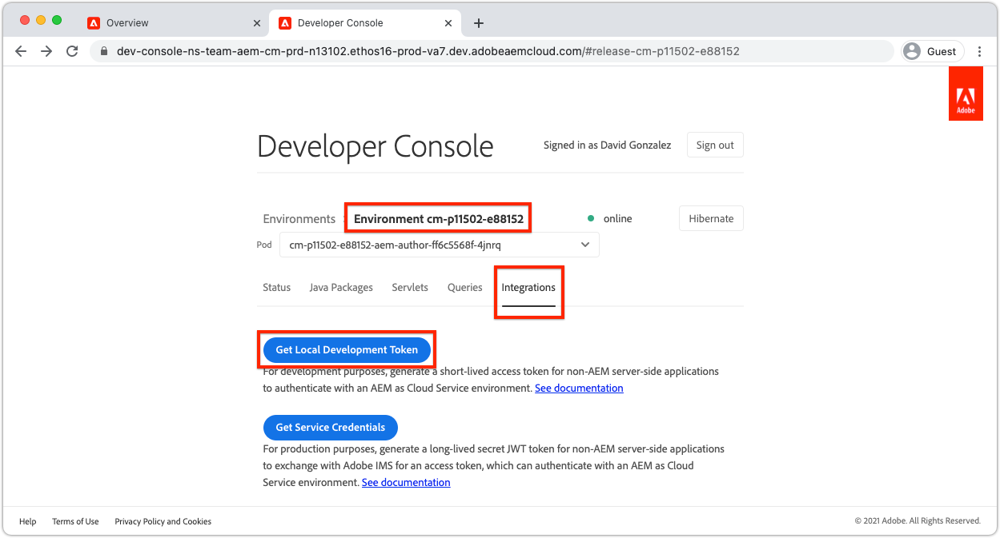

# Token de acceso de desarrollo local

Los desarrolladores que construyen integraciones que requieren acceso programático a AEM como Cloud Service necesitan una forma sencilla y rápida de obtener tokenes de acceso temporales para AEM a fin de facilitar las actividades locales de desarrollo. Para satisfacer esta necesidad, AEM Developer Console permite a los desarrolladores generar tokenes de acceso temporales que se pueden utilizar para acceder a AEM mediante programación.

>[!VIDEO](https://video.tv.adobe.com/v/330477/?quality=12&learn=on)

## Generar un Token de acceso de desarrollo local


El Token de acceso de desarrollo local proporciona acceso a los servicios de AEM Author y Publish como el usuario que generó el token, junto con sus permisos. A pesar de que se trata de un token de desarrollo, no comparta este token ni almacene en el control de código fuente.

1. En [Adobe Admin Console](https://adminconsole.adobe.com/) asegúrese de que usted, el programador, es miembro de:
   + __Cloud Manager: Perfil del producto__ DeveloperIMS (otorga acceso a AEM Developer Console)
   + El Perfil de producto __Administradores de AEM__ o __Usuarios de AEM__ IMS para el servicio del entorno de AEM con el que se integrará el token de acceso
   + Los AEM de Simulador para pruebas como entornos de Cloud Service solo requieren la membresía en el Perfil de producto __AEM Administradores__ o __Usuarios de AEM__
1. Inicie sesión en [Administrador de Adobe Cloud](https://my.cloudmanager.adobe.com)
1. Abra el Programa que contiene el AEM como entorno de Cloud Service con el que se integrará
1. Toque la __elipsis__ al lado del entorno en la sección __Entornos__ y seleccione __Consola de programador__
1. Puntee en la ficha __Integraciones__
1. Toque el botón __Obtener token de desarrollo local__
1. Toque el __botón de descarga__ en la esquina superior izquierda para descargar el archivo JSON que contiene el valor `accessToken` y guarde el archivo JSON en una ubicación segura en el equipo de desarrollo.
   + Este es su token de acceso de desarrollador de 24 horas al AEM como entorno de Cloud Service.



## Se ha utilizado el Token de acceso de desarrollo local{#use-local-development-access-token}


1. Descargue el Token de acceso de desarrollo local temporal de AEM Developer Console
   + El Token de acceso de desarrollo local caduca cada 24 horas, por lo que los desarrolladores tendrán que descargar nuevos tokenes de acceso diariamente
1. Se está desarrollando una aplicación externa que interactúa programáticamente con AEM como Cloud Service
1. La aplicación externa se lee en el Token de acceso de Desarrollo Local
1. La aplicación externa construye solicitudes HTTP para AEM como Cloud Service, agregando el Token de acceso de desarrollo local como token de portador al encabezado de autorización de las solicitudes HTTP
1. AEM como Cloud Service recibe la solicitud HTTP, la autentica y realiza el trabajo solicitado por la solicitud HTTP y devuelve una respuesta HTTP a la aplicación externa

### La aplicación externa de muestra

Crearemos una sencilla aplicación JavaScript externa para ilustrar cómo acceder mediante programación a AEM como Cloud Service a través de HTTPS mediante el token de acceso de programadores local. Esto ilustra cómo _cualquier aplicación o sistema_ que se ejecute fuera de AEM, independientemente del entorno o idioma, puede utilizar el token de acceso para autenticarse mediante programación y acceder a AEM como Cloud Service. En la [siguiente sección](./service-credentials.md) actualizaremos este código de aplicación para admitir el método de generación de un token para uso de producción.

Esta aplicación de ejemplo se ejecuta desde la línea de comandos y actualiza AEM metadatos de recursos mediante las API HTTP de AEM Assets mediante el siguiente flujo:

1. Lee los parámetros de la línea de comandos (`getCommandLineParams()`)
1. Obtiene el token de acceso utilizado para autenticarse para AEM como Cloud Service (`getAccessToken(...)`)
1. Lista todos los recursos de una carpeta de recursos AEM especificada en los parámetros de la línea de comandos (`listAssetsByFolder(...)`)
1. Actualizar los metadatos de los recursos enumerados con valores especificados en parámetros de línea de comandos (`updateMetadata(...)`)

El elemento clave para autenticarse mediante programación con AEM mediante el token de acceso es agregar un encabezado de solicitud HTTP de autorización a todas las solicitudes HTTP realizadas a AEM, en el siguiente formato:

+ `Authorization: Bearer ACCESS_TOKEN`

## Ejecución de la aplicación externa

1. Asegúrese de que [Node.js](/help/cloud-service/local-development-environment/development-tools.md?lang=en#node-js) está instalado en el equipo de desarrollo local, que se utilizará para ejecutar la aplicación externa
1. Descargue y descomprima la [aplicación externa de muestra](./assets/aem-guides_token-authentication-external-application.zip)
1. Desde la línea de comandos, en la carpeta de este proyecto, ejecute `npm install`
1. Copie el [Token de acceso de desarrollo local](#download-local-development-access-token) descargado en un archivo denominado `local_development_token.json` en la raíz del proyecto
   + Pero recuerden, ¡nunca envíen credenciales a Git!
1. Abra `index.js` y revise el código de la aplicación externa y los comentarios.

   ```javascript
   const fetch = require('node-fetch');
   const fs = require('fs');
   const auth = require('@adobe/jwt-auth');
   
   // The root context of the Assets HTTP API
   const ASSETS_HTTP_API = '/api/assets';
   
   // Command line parameters
   let params = { };
   
   /**
   * Application entry point function
   */
   (async () => {
       console.log('Example usage: node index.js aem=https://author-p1234-e5678.adobeaemcloud.com propertyName=metadata/dc:rights "propertyValue=WKND Limited Use" folder=/wknd/en/adventures/napa-wine-tasting file=credentials-file.json' );
   
       // Parse the command line parameters
       params = getCommandLineParams();
   
       // Set the access token to be used in the HTTP requests to be local development access token
       params.accessToken = await getAccessToken(params.developerConsoleCredentials);
   
       // Get a list of all the assets in the specified assets folder
       let assets = await listAssetsByFolder(params.folder);
   
       // For each asset, update it's metadata
       await assets.forEach(asset => updateMetadata(asset, { 
           [params.propertyName]: params.propertyValue 
       }));
   })();
   
   /**
   * Returns a list of Assets HTTP API asset URLs that reference the assets in the specified folder.
   * 
   * https://experienceleague.adobe.com/docs/experience-manager-cloud-service/assets/admin/mac-api-assets.html?lang=en#retrieve-a-folder-listing
   * 
   * @param {*} folder the Assets HTTP API folder path (less the /content/dam path prefix)
   */
   async function listAssetsByFolder(folder) {
       return fetch(`${params.aem}${ASSETS_HTTP_API}${folder}.json`, {
               method: 'get',
               headers: { 
                   'Content-Type': 'application/json',
                   'Authorization': 'Bearer ' + params.accessToken // Provide the AEM access token in the Authorization header
               },
           })
           .then(res => {
               console.log(`${res.status} - ${res.statusText} @ ${params.aem}${ASSETS_HTTP_API}${folder}.json`);
   
               // If success, return the JSON listing assets, otherwise return empty results
               return res.status === 200 ? res.json() : { entities: [] };
           })
           .then(json => { 
               // Returns a list of all URIs for each non-content fragment asset in the folder
               return json.entities
                   .filter((entity) => entity['class'].indexOf('asset/asset') === -1 && !entity.properties.contentFragment)
                   .map(asset => asset.links.find(link => link.rel.find(r => r === 'self')).href);
           });
   }
   
   /**
   * Update the metadata of an asset in AEM
   * 
   * https://experienceleague.adobe.com/docs/experience-manager-cloud-service/assets/admin/mac-api-assets.html?lang=en#update-asset-metadata
   * 
   * @param {*} asset the Assets HTTP API asset URL to update
   * @param {*} metadata the metadata to update the asset with
   */
   async function updateMetadata(asset, metadata) {        
       await fetch(`${asset}`, {
               method: 'put',
               headers: { 
                   'Content-Type': 'application/json',
                   'Authorization': 'Bearer ' + params.accessToken // Provide the AEM access token in the Authorization header
               },
               body: JSON.stringify({
                   class: 'asset',
                   properties: metadata
               })
           })
           .then(res => { 
               console.log(`${res.status} - ${res.statusText} @ ${asset}`);
           });
   }
   
   /**
   * Parse and return the command line parameters. Expected params are:
   * 
   * - aem = The AEM as a Cloud Service hostname to connect to.
   *              Example: https://author-p12345-e67890.adobeaemcloud.com
   * - folder = The asset folder to update assets in. Note that the Assets HTTP API do NOT use the JCR `/content/dam` path prefix.
   *              Example: '/wknd/en/adventures/napa-wine-tasting'
   * - propertyName = The asset property name to update. Note this is relative to the [dam:Asset]/jcr:content node of the asset.
   *              Example: metadata/dc:rights
   * - propertyValue = The value to update the asset property (specified by propertyName) with.
   *              Example: "WKND Free Use"
   * - file = The path to the JSON file that contains the credentials downloaded from AEM Developer Console
   *              Example: local_development_token_cm_p1234-e5678.json 
   */
   function getCommandLineParams() {
       let parameters = {};
   
       // Parse the command line params, splitting on the = delimiter
       for (let i = 2; i < process.argv.length; i++) {
           let key = process.argv[i].split('=')[0];
           let value = process.argv[i].split('=')[1];
   
           parameters[key] = value;
       };
   
       // Read in the credentials from the provided JSON file
       if (parameters.file) {
           parameters.developerConsoleCredentials = JSON.parse(fs.readFileSync(parameters.file));
       }
   
       console.log(parameters);
   
       return parameters;
   }
   
   async function getAccessToken(developerConsoleCredentials) {s
       if (developerConsoleCredentials.accessToken) {
           // This is a Local Development access token
           return developerConsoleCredentials.accessToken;
       } 
   }
   ```

   Revise las invocaciones `fetch(..)` en `listAssetsByFolder(...)` y `updateMetadata(...)`, y observe `headers` definir el encabezado de solicitud HTTP `Authorization` con un valor de `Bearer ACCESS_TOKEN`. Así es como la solicitud HTTP procedente de la aplicación externa se autentica para AEM como Cloud Service.

   ```javascript
   ...
   return fetch(`${params.aem}${ASSETS_HTTP_API}${folder}.json`, {
               method: 'get',
               headers: { 
                   'Content-Type': 'application/json',
                   'Authorization': 'Bearer ' + params.accessToken // Provide the AEM access token in the Authorization header
               },
   })...
   ```

   Cualquier solicitud HTTP para AEM como Cloud Service debe establecer el token de acceso del portador en el encabezado Autorización. Recuerde, cada AEM como entorno Cloud Service requiere de su propio token de acceso. El token de acceso del desarrollo no funcionará en la etapa o en la producción, el de la etapa no funcionará en el desarrollo o la producción, y el de la producción no funcionará en el desarrollo o en la etapa!

1. Mediante la línea de comandos, desde la raíz del proyecto ejecute la aplicación, pasando los siguientes parámetros:

   ```shell
   $ node index.js \
       aem=https://author-p1234-e5678.adobeaemcloud.com \
       folder=/wknd/en/adventures/napa-wine-tasting \
       propertyName=metadata/dc:rights \
       propertyValue="WKND Limited Use" \
       file=local_development_token.json
   ```

   Se pasan los siguientes parámetros:

   + `aem`:: Esquema y nombre de host del AEM como entorno de Cloud Service con el que interactuará la aplicación (por ejemplo,  `https://author-p1234-e5678.adobeaemcloud.com`).
   + `folder`:: La ruta de la carpeta de recursos cuyos recursos se actualizarán con el  `propertyValue`; NO agregue el  `/content/dam` prefijo (por ejemplo:  `/wknd/en/adventures/napa-wine-tasting`)
   + `propertyName`:: El nombre de propiedad del recurso que se va a actualizar, relativo a  `[dam:Asset]/jcr:content` (por ejemplo,  `metadata/dc:rights`).
   + `propertyValue`:: El valor que se va a definir  `propertyName` en; los valores con espacios deben encapsularse con  `"` (p. ej.  `"WKND Limited Use"`)
   + `file`:: Ruta de acceso relativa al archivo JSON descargado desde AEM consola de desarrollador.

   Ejecución correcta del resultado de la aplicación para cada recurso actualizado:

   ```shell
   200 - OK @ https://author-p1234-e5678.adobeaemcloud.com/api/assets/wknd/en/adventures/napa-wine-tasting.json
   200 - OK @ https://author-p1234-e5678.adobeaemcloud.com/api/assets/wknd/en/adventures/napa-wine-tasting/AdobeStock_277654931.jpg.json
   200 - OK @ https://author-p1234-e5678.adobeaemcloud.com/api/assets/wknd/en/adventures/napa-wine-tasting/AdobeStock_239751461.jpg.json
   200 - OK @ https://author-p1234-e5678.adobeaemcloud.com/api/assets/wknd/en/adventures/napa-wine-tasting/AdobeStock_280313729.jpg.json
   200 - OK @ https://author-p1234-e5678.adobeaemcloud.com/api/assets/wknd/en/adventures/napa-wine-tasting/AdobeStock_286664352.jpg.json
   ```

### Verificar la actualización de metadatos en AEM

Verifique que los metadatos se hayan actualizado iniciando sesión en el AEM como entorno de Cloud Service (asegúrese de que se accede al mismo host pasado al parámetro de línea de comandos `aem`).

1. Inicie sesión en el AEM como entorno de Cloud Service con el que interactuó la aplicación externa (utilice el mismo host proporcionado en el parámetro de línea de comandos `aem`)
1. Vaya a __Assets__ > __Files__
1. Desplácese hasta la carpeta de recursos especificada por el parámetro de línea de comandos `folder`, por ejemplo __WKND__ > __Inglés__ > __Aventuras__ > __Dasado de vino de Napa__
1. Abra las __Propiedades__ de cualquier recurso (que no sea fragmento de contenido) de la carpeta
1. Puntee en la ficha __Avanzado__
1. Revise el valor de la propiedad actualizada, por ejemplo __Copyright__, que se asigna a la propiedad `metadata/dc:rights` JCR actualizada, que refleja el valor proporcionado en el parámetro `propertyValue`, por ejemplo __Uso limitado de WKND__


## Pasos siguientes

Ahora que hemos accedido mediante programación a AEM como Cloud Service mediante el token de desarrollo local, necesitamos actualizar la aplicación para que gestione mediante Credenciales de servicio, de modo que esta aplicación se pueda utilizar en un contexto de producción.

+ [Cómo utilizar las credenciales de servicio](./service-credentials.md)
