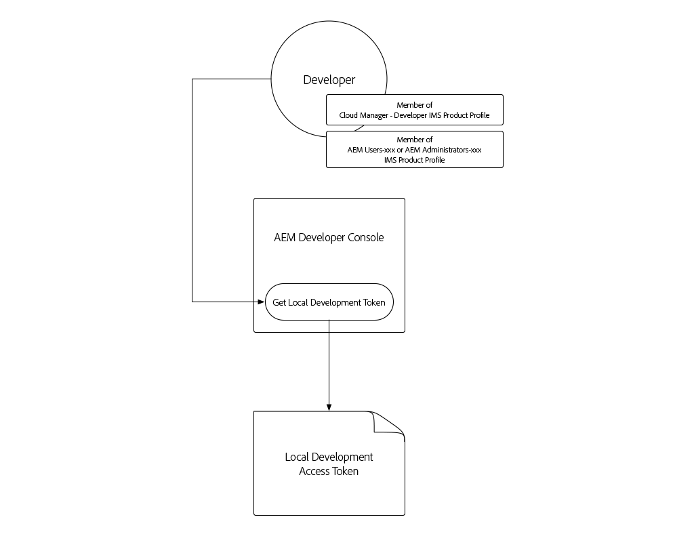
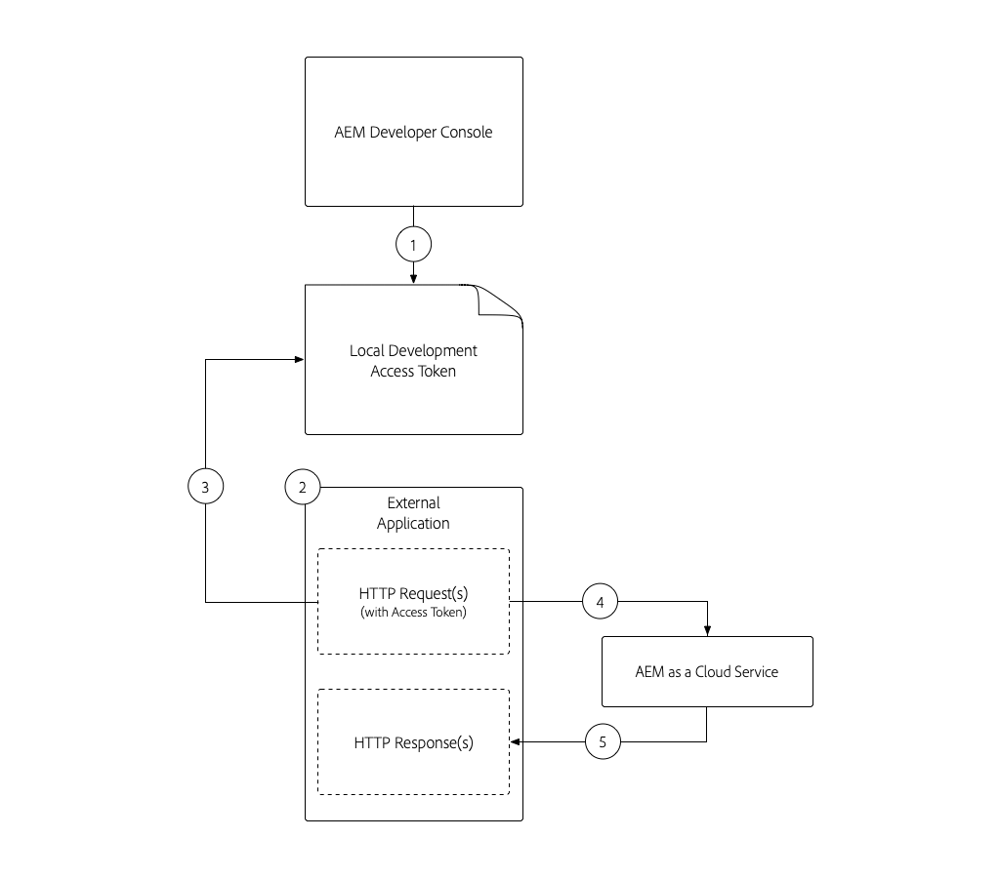

# Token de acceso de desarrollo local

Los desarrolladores que crean integraciones que requieren acceso mediante programación a AEM as a Cloud Service necesitan una forma sencilla y rápida de obtener tokens de acceso temporales para AEM para facilitar las actividades de desarrollo local. Para satisfacer esta necesidad, AEM Developer Console permite a los desarrolladores generar automáticamente tokens de acceso temporales que se pueden utilizar para acceder mediante programación a AEM.

>[!VIDEO](https://video.tv.adobe.com/v/330477/?quality=12&learn=on)

## Generar un token de acceso de desarrollo local



El token de acceso de desarrollo local proporciona acceso a los servicios de AEM Author y Publish como el usuario que generó el token, junto con sus permisos. A pesar de que se trata de un token de desarrollo, no comparta este token ni lo almacene en el control de código fuente.

1. En [Adobe Admin Console](https://adminconsole.adobe.com/) asegúrese de que usted, el desarrollador, es miembro de:
   + __Cloud Manager:__ DeveloperIMS Product Profile (otorga acceso a AEM Developer Console)
   + El __perfil de producto de los administradores de AEM__ o __usuarios de AEM__ IMS para el servicio del entorno de AEM que el token de acceso integrará con
   + Los entornos de Sandbox AEM as a Cloud Service solo requieren la pertenencia al __Perfil de producto de los__ administradores de AEM o __usuarios de AEM__
1. Inicie sesión en [Adobe Cloud Manager](https://my.cloudmanager.adobe.com)
1. Abra el programa que contiene el entorno de AEM as a Cloud Service con el que se integrará
1. Pulse la __elipsis__ situada junto al entorno en la sección __Entornos__ y seleccione __Developer Console__
1. Pulse en la pestaña __Integrations__
1. Toque el botón __Obtener token de desarrollo local__
1. Pulse el __botón de descarga__ en la esquina superior izquierda para descargar el archivo JSON que contiene el valor `accessToken` y guarde el archivo JSON en una ubicación segura en el equipo de desarrollo.
   + Este es su token de acceso de desarrollador de 24 horas al entorno de AEM as a Cloud Service.


## Se ha utilizado el token de acceso de desarrollo local{#use-local-development-access-token}



1. Descargue el token de acceso de desarrollo local temporal desde AEM Developer Console
   + El token de acceso de desarrollo local caduca cada 24 horas, por lo que los desarrolladores deberán descargar los nuevos tokens de acceso diariamente
1. Se está desarrollando una aplicación externa que interactúa mediante programación con AEM as a Cloud Service
1. La aplicación externa se lee en el token de acceso de desarrollo local
1. La aplicación externa crea solicitudes HTTP para AEM as a Cloud Service, agregando el token de acceso de desarrollo local como un token de portador al encabezado de autorización de las solicitudes HTTP
1. AEM as a Cloud Service recibe la solicitud HTTP, la autentica y realiza el trabajo solicitado por la solicitud HTTP y devuelve una respuesta HTTP a la aplicación externa

### La aplicación externa de ejemplo

Crearemos una sencilla aplicación JavaScript externa para ilustrar cómo acceder mediante programación a AEM as a Cloud Service a través de HTTPS mediante el token de acceso de desarrollador local. Esto ilustra cómo _cualquier aplicación o sistema_ que se ejecute fuera de AEM, independientemente del marco o idioma, puede utilizar el token de acceso para autenticarse mediante programación en AEM as a Cloud Service y acceder a él. En la [siguiente sección](./service-credentials.md) actualizaremos este código de aplicación para admitir el método de generación de un token para uso de producción.

Esta aplicación de ejemplo se ejecuta desde la línea de comandos y actualiza los metadatos de AEM Assets mediante las API HTTP de AEM Assets, utilizando el siguiente flujo:

1. Lee los parámetros de la línea de comandos (`getCommandLineParams()`)
1. Obtiene el token de acceso utilizado para autenticarse en AEM as a Cloud Service (`getAccessToken(...)`)
1. Enumera todos los recursos de una carpeta de recursos de AEM especificada en un parámetro de línea de comandos (`listAssetsByFolder(...)`)
1. Actualizar los metadatos de los recursos incluidos con los valores especificados en los parámetros de la línea de comandos (`updateMetadata(...)`)

El elemento clave para autenticarse mediante programación en AEM mediante el token de acceso es añadir un encabezado de solicitud HTTP de autorización a todas las solicitudes HTTP realizadas a AEM, en el siguiente formato:

+ `Authorization: Bearer ACCESS_TOKEN`

## Ejecución de la aplicación externa

1. Asegúrese de que [Node.js](/help/cloud-service/local-development-environment/development-tools.md?lang=en#node-js) está instalado en el equipo de desarrollo local, que se utilizará para ejecutar la aplicación externa
1. Descargue y descomprima la [aplicación externa de ejemplo](./assets/aem-guides_token-authentication-external-application.zip)
1. Desde la línea de comandos, en la carpeta de este proyecto, ejecute `npm install`
1. Copie el [descargado el token de acceso de desarrollo local](#download-local-development-access-token) a un archivo denominado `local_development_token.json` en la raíz del proyecto
   + Pero recuerden, ¡nunca comprometan ninguna credencial a Git!
1. Abra `index.js` y revise el código y los comentarios de la aplicación externa.

   ```javascript
   const fetch = require('node-fetch');
   const fs = require('fs');
   const auth = require('@adobe/jwt-auth');
   
   // The root context of the Assets HTTP API
   const ASSETS_HTTP_API = '/api/assets';
   
   // Command line parameters
   let params = { };
   
   /**
   * Application entry point function
   */
   (async () => {
       console.log('Example usage: node index.js aem=https://author-p1234-e5678.adobeaemcloud.com propertyName=metadata/dc:rights "propertyValue=WKND Limited Use" folder=/wknd/en/adventures/napa-wine-tasting file=credentials-file.json' );
   
       // Parse the command line parameters
       params = getCommandLineParams();
   
       // Set the access token to be used in the HTTP requests to be local development access token
       params.accessToken = await getAccessToken(params.developerConsoleCredentials);
   
       // Get a list of all the assets in the specified assets folder
       let assets = await listAssetsByFolder(params.folder);
   
       // For each asset, update it's metadata
       await assets.forEach(asset => updateMetadata(asset, { 
           [params.propertyName]: params.propertyValue 
       }));
   })();
   
   /**
   * Returns a list of Assets HTTP API asset URLs that reference the assets in the specified folder.
   * 
   * https://experienceleague.adobe.com/docs/experience-manager-cloud-service/assets/admin/mac-api-assets.html?lang=en#retrieve-a-folder-listing
   * 
   * @param {*} folder the Assets HTTP API folder path (less the /content/dam path prefix)
   */
   async function listAssetsByFolder(folder) {
       return fetch(`${params.aem}${ASSETS_HTTP_API}${folder}.json`, {
               method: 'get',
               headers: { 
                   'Content-Type': 'application/json',
                   'Authorization': 'Bearer ' + params.accessToken // Provide the AEM access token in the Authorization header
               },
           })
           .then(res => {
               console.log(`${res.status} - ${res.statusText} @ ${params.aem}${ASSETS_HTTP_API}${folder}.json`);
   
               // If success, return the JSON listing assets, otherwise return empty results
               return res.status === 200 ? res.json() : { entities: [] };
           })
           .then(json => { 
               // Returns a list of all URIs for each non-content fragment asset in the folder
               return json.entities
                   .filter((entity) => entity['class'].indexOf('asset/asset') === -1 && !entity.properties.contentFragment)
                   .map(asset => asset.links.find(link => link.rel.find(r => r === 'self')).href);
           });
   }
   
   /**
   * Update the metadata of an asset in AEM
   * 
   * https://experienceleague.adobe.com/docs/experience-manager-cloud-service/assets/admin/mac-api-assets.html?lang=en#update-asset-metadata
   * 
   * @param {*} asset the Assets HTTP API asset URL to update
   * @param {*} metadata the metadata to update the asset with
   */
   async function updateMetadata(asset, metadata) {        
       await fetch(`${asset}`, {
               method: 'put',
               headers: { 
                   'Content-Type': 'application/json',
                   'Authorization': 'Bearer ' + params.accessToken // Provide the AEM access token in the Authorization header
               },
               body: JSON.stringify({
                   class: 'asset',
                   properties: metadata
               })
           })
           .then(res => { 
               console.log(`${res.status} - ${res.statusText} @ ${asset}`);
           });
   }
   
   /**
   * Parse and return the command line parameters. Expected params are:
   * 
   * - aem = The AEM as a Cloud Service hostname to connect to.
   *              Example: https://author-p12345-e67890.adobeaemcloud.com
   * - folder = The asset folder to update assets in. Note that the Assets HTTP API do NOT use the JCR `/content/dam` path prefix.
   *              Example: '/wknd/en/adventures/napa-wine-tasting'
   * - propertyName = The asset property name to update. Note this is relative to the [dam:Asset]/jcr:content node of the asset.
   *              Example: metadata/dc:rights
   * - propertyValue = The value to update the asset property (specified by propertyName) with.
   *              Example: "WKND Free Use"
   * - file = The path to the JSON file that contains the credentials downloaded from AEM Developer Console
   *              Example: local_development_token_cm_p1234-e5678.json 
   */
   function getCommandLineParams() {
       let parameters = {};
   
       // Parse the command line params, splitting on the = delimiter
       for (let i = 2; i < process.argv.length; i++) {
           let key = process.argv[i].split('=')[0];
           let value = process.argv[i].split('=')[1];
   
           parameters[key] = value;
       };
   
       // Read in the credentials from the provided JSON file
       if (parameters.file) {
           parameters.developerConsoleCredentials = JSON.parse(fs.readFileSync(parameters.file));
       }
   
       console.log(parameters);
   
       return parameters;
   }
   
   async function getAccessToken(developerConsoleCredentials) {s
       if (developerConsoleCredentials.accessToken) {
           // This is a Local Development access token
           return developerConsoleCredentials.accessToken;
       } 
   }
   ```

   Revise las invocaciones `fetch(..)` en `listAssetsByFolder(...)` y `updateMetadata(...)`, y observe que `headers` define el encabezado de la solicitud HTTP `Authorization` con un valor de `Bearer ACCESS_TOKEN`. Así es como la solicitud HTTP procedente de la aplicación externa se autentica en AEM as a Cloud Service.

   ```javascript
   ...
   return fetch(`${params.aem}${ASSETS_HTTP_API}${folder}.json`, {
               method: 'get',
               headers: { 
                   'Content-Type': 'application/json',
                   'Authorization': 'Bearer ' + params.accessToken // Provide the AEM access token in the Authorization header
               },
   })...
   ```

   Cualquier solicitud HTTP a AEM as a Cloud Service debe establecer el token de acceso del portador en el encabezado Autorización. Recuerde que cada entorno de AEM as a Cloud Service requiere su propio token de acceso. El token de acceso de desarrollo no funcionará en fase o producción, el de fase no funcionará en desarrollo o producción y el de producción no funcionará en fase de desarrollo o fase.

1. Mediante la línea de comandos, desde la raíz del proyecto ejecute la aplicación, pasando los siguientes parámetros:

   ```shell
   $ node index.js \
       aem=https://author-p1234-e5678.adobeaemcloud.com \
       folder=/wknd/en/adventures/napa-wine-tasting \
       propertyName=metadata/dc:rights \
       propertyValue="WKND Limited Use" \
       file=local_development_token.json
   ```

   Se pasan los siguientes parámetros:

   + `aem`: El esquema y el nombre de host del entorno de AEM as a Cloud Service con el que interactuará la aplicación (por ejemplo,  `https://author-p1234-e5678.adobeaemcloud.com`).
   + `folder`: La ruta de la carpeta de recursos cuyos recursos se actualizarán con  `propertyValue`; NO agregue el  `/content/dam` prefijo (por ejemplo,  `/wknd/en/adventures/napa-wine-tasting`)
   + `propertyName`: El nombre de la propiedad del recurso que se va a actualizar, en relación con  `[dam:Asset]/jcr:content` (por ejemplo,  `metadata/dc:rights`).
   + `propertyValue`: El valor que se va a establecer  `propertyName` en; los valores con espacios deben encapsularse con  `"` (por ejemplo,  `"WKND Limited Use"`)
   + `file`: La ruta de archivo relativa al archivo JSON descargado de AEM Developer Console.

   Ejecución correcta del resultado de la aplicación para cada recurso actualizado:

   ```shell
   200 - OK @ https://author-p1234-e5678.adobeaemcloud.com/api/assets/wknd/en/adventures/napa-wine-tasting.json
   200 - OK @ https://author-p1234-e5678.adobeaemcloud.com/api/assets/wknd/en/adventures/napa-wine-tasting/AdobeStock_277654931.jpg.json
   200 - OK @ https://author-p1234-e5678.adobeaemcloud.com/api/assets/wknd/en/adventures/napa-wine-tasting/AdobeStock_239751461.jpg.json
   200 - OK @ https://author-p1234-e5678.adobeaemcloud.com/api/assets/wknd/en/adventures/napa-wine-tasting/AdobeStock_280313729.jpg.json
   200 - OK @ https://author-p1234-e5678.adobeaemcloud.com/api/assets/wknd/en/adventures/napa-wine-tasting/AdobeStock_286664352.jpg.json
   ```

### Verificar la actualización de metadatos en AEM

Compruebe que los metadatos se hayan actualizado iniciando sesión en el entorno de AEM as a Cloud Service (asegúrese de que se accede al mismo host pasado al parámetro de línea de comandos `aem`).

1. Inicie sesión en el entorno de AEM as a Cloud Service con el que interactuó la aplicación externa (utilice el mismo host proporcionado en el parámetro de línea de comandos `aem`)
1. Vaya a __Assets__ > __Files__
1. Desplácese por la carpeta de recursos especificada por el parámetro de línea de comandos `folder`, por ejemplo __WKND__ > __English__ > __Adventures__ > __Ayunar el vino de Napa__
1. Abra __Properties__ para cualquier recurso (que no sea de fragmento de contenido) de la carpeta
1. Pulse la pestaña __Advanced__
1. Revise el valor de la propiedad actualizada, por ejemplo __Copyright__ que está asignado a la propiedad `metadata/dc:rights` JCR actualizada, que refleja el valor proporcionado en el parámetro `propertyValue`, por ejemplo __WKND Limited Use__


## Pasos siguientes

Ahora que hemos accedido mediante programación a AEM as a Cloud Service mediante el token de desarrollo local, debemos actualizar la aplicación para que se gestione mediante las credenciales de servicio, de modo que esta aplicación se pueda utilizar en un contexto de producción.

+ [Cómo utilizar las credenciales del servicio](./service-credentials.md)
