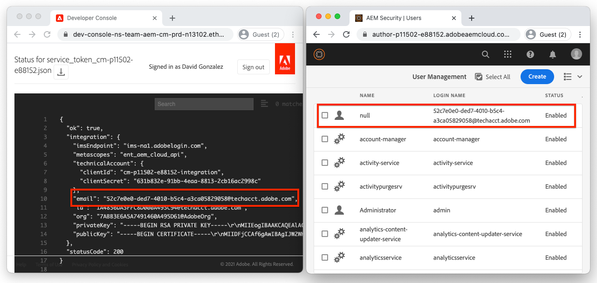

# Credenciales de servicio

Las integraciones con Adobe Experience Manager (AEM) as a Cloud Service deben poder autenticarse de forma segura en el servicio de AEM. Developer Console de AEM concede acceso a las credenciales de servicio, que se utilizan para facilitar que las aplicaciones, los sistemas y los servicios externos interactúen mediante programación con los servicios de AEM Author o Publish a través de HTTP.

AEM se integra con otros productos de Adobe mediante [S2S OAuth administrado mediante Adobe Developer Console](https://experienceleague.adobe.com/en/docs/experience-manager-cloud-service/content/security/setting-up-ims-integrations-for-aem-as-a-cloud-service). Para integraciones personalizadas con cuentas de servicio, las credenciales de JWT se utilizan y administran en AEM Developer Console.

>[!VIDEO](https://video.tv.adobe.com/v/330519?quality=12&learn=on)

Las credenciales del servicio pueden aparecer similares a [Tokens de acceso de desarrollo local](./local-development-access-token.md), pero difieren en varias formas clave:

+ Las credenciales del servicio están asociadas a cuentas técnicas. Se pueden activar varias credenciales de servicio para una cuenta técnica.
+ Las credenciales del servicio son _no_ tokens de acceso, sino credenciales que se usan para _obtener_ tokens de acceso.
+ Las credenciales del servicio son más permanentes (sus certificados caducan cada 365 días) y no cambian a menos que se revoquen, mientras que los tokens de acceso de desarrollo local caducan a diario.
+ Las credenciales de servicio de un entorno de AEM as a Cloud Service se asignan a un único usuario de cuenta técnica de AEM, mientras que los tokens de acceso de desarrollo local se autentican como el usuario de AEM que generó el token de acceso.
+ Un entorno de AEM as a Cloud Service puede tener hasta diez cuentas técnicas, cada una con sus propias credenciales de servicio, cada una de las cuales se asigna a un usuario de AEM de cuenta técnica discreta.

Tanto las credenciales del servicio como los tokens de acceso que generan, así como los tokens de acceso de desarrollo local, deben mantenerse en secreto. Como los tres se pueden utilizar para obtener acceso a su entorno de AEM as a Cloud Service respectivo.

## Generar credenciales de servicio

La generación de credenciales del servicio se divide en dos pasos:

1. Una creación de cuenta técnica única por parte de un administrador de organización de IMS de Adobe
1. La descarga y el uso de las credenciales de servicio JSON de la cuenta técnica

### Crear una cuenta técnica

Las credenciales del servicio, a diferencia de los tokens de acceso de desarrollo local, requieren que un administrador de IMS de organización de Adobe cree una cuenta técnica para poder descargarlas. Se deben crear cuentas técnicas discretas para cada cliente que requiera acceso programático a AEM.


Las cuentas técnicas se crean una vez, pero las claves privadas que se utilizan para administrar las credenciales de servicio asociadas con la cuenta técnica se pueden administrar a lo largo del tiempo. Por ejemplo, se deben generar nuevas credenciales de clave privada/servicio antes de la caducidad de la clave privada actual para permitir el acceso ininterrumpido de un usuario de las credenciales de servicio.

1. Asegúrese de haber iniciado sesión como:

   + __Administrador del sistema de la organización IMS de Adobe__
   + Miembro del perfil de producto __Administradores de AEM__ IMS en __Autor de AEM__

1. Inicie sesión en [Adobe Cloud Manager](https://my.cloudmanager.adobe.com)
1. Abra el programa que contiene el entorno de AEM as a Cloud Service para integrar y configurar las credenciales de servicio de
1. Pulse los puntos suspensivos junto al entorno en la sección __Entornos__ y seleccione __Developer Console__
1. Pulse en la ficha __Integraciones__
1. Pulse la pestaña __Cuentas técnicas__
1. Pulse __Crear nueva cuenta técnica__ botón
1. Las credenciales de servicio de la cuenta técnica se inicializan y se muestran como JSON


Una vez inicializadas las credenciales de servicio del entorno de AEM as a Cloud Service, otros desarrolladores de AEM de su organización de IMS de Adobe pueden descargarlas.

### Descargar credenciales del servicio


La descarga de las credenciales del servicio sigue los pasos similares a los de la inicialización.

1. Asegúrese de haber iniciado sesión como:

   + __Administrador de organización de Adobe IMS__
   + Miembro del perfil de producto __Administradores de AEM__ IMS en __Autor de AEM__

1. Inicie sesión en [Adobe Cloud Manager](https://my.cloudmanager.adobe.com)
1. Abra el programa que contiene el entorno de AEM as a Cloud Service con el que desea integrarse
1. Pulse los puntos suspensivos junto al entorno en la sección __Entornos__ y seleccione __Developer Console__
1. Pulse en la ficha __Integraciones__
1. Pulse la pestaña __Cuentas técnicas__
1. Expanda __Cuenta técnica__ para usar
1. Expanda la __clave privada__ cuyas credenciales de servicio se descargarán y compruebe que el estado es __Activo__
1. Pulse __...__ > __Ver__ asociado con la __clave privada__, que muestra el JSON de credenciales de servicio
1. Pulse el botón de descarga en la esquina superior izquierda para descargar el archivo JSON que contiene el valor de credenciales de servicio y guarde el archivo en una ubicación segura

## Instalar las credenciales del servicio

Las credenciales del servicio proporcionan los detalles necesarios para generar un JWT, que se intercambia por un token de acceso utilizado para autenticarse con AEM as a Cloud Service. Las credenciales del servicio deben almacenarse en una ubicación segura a la que puedan acceder las aplicaciones, los sistemas o los servicios externos que la utilizan para acceder a AEM. El modo y el lugar en que se administran las credenciales del servicio son únicos para cada cliente.

Para simplificar, este tutorial pasa las credenciales de servicio en a través de la línea de comandos. Sin embargo, trabaje con su equipo de seguridad de TI para comprender cómo almacenar y acceder a estas credenciales de acuerdo con las directrices de seguridad de su organización.

1. Copie [descargó las credenciales de servicio JSON](#download-service-credentials) en un archivo de nombre `service_token.json` en la raíz del proyecto

   + Recuerde, ¡nunca confirme _ninguna credencial_ a Git!

## Usar credenciales de servicio

Las credenciales del servicio, un objeto JSON completamente formado, no son las mismas que el JWT ni el token de acceso. En su lugar, las credenciales del servicio (que contienen una clave privada) se utilizan para generar un JWT, que se intercambia con las API de IMS de Adobe por un token de acceso.


1. Descargue las credenciales del servicio de AEM Developer Console en una ubicación segura
1. La aplicación externa debe interactuar mediante programación con el entorno de AEM as a Cloud Service
1. La aplicación externa lee las credenciales del servicio desde una ubicación segura
1. La aplicación externa utiliza la información de las credenciales del servicio para construir un token JWT
1. El token JWT se envía a Adobe IMS a cambio de un token de acceso
1. Adobe IMS devuelve un token de acceso que puede utilizarse para acceder a AEM as a Cloud Service

   + Los tokens de acceso no pueden cambiar una hora de caducidad.

1. La aplicación externa realiza solicitudes HTTP a AEM as a Cloud Service y agrega el token de acceso como token de portador al encabezado de autorización de las solicitudes HTTP
1. AEM as a Cloud Service recibe la solicitud HTTP, autentica la solicitud, realiza el trabajo solicitado por la solicitud HTTP y devuelve una respuesta HTTP de nuevo a la aplicación externa

### Actualizaciones de la aplicación externa

Para acceder a AEM as a Cloud Service mediante las credenciales del servicio, la aplicación externa debe actualizarse de tres formas:

1. Leer en las credenciales del servicio

   + Para simplificar, las credenciales del servicio se leen desde el archivo JSON descargado; sin embargo, en situaciones de uso real, las credenciales del servicio deben almacenarse de forma segura de acuerdo con las directrices de seguridad de su organización

1. Generar un JWT a partir de las credenciales de servicio
1. Intercambio del JWT por un token de acceso

   + Cuando hay credenciales de servicio, la aplicación externa utiliza este token de acceso en lugar del token de acceso de desarrollo local al acceder a AEM as a Cloud Service

En este tutorial, se utiliza el módulo npm de `@adobe/jwt-auth` de Adobe para: (1) generar el JWT a partir de las credenciales del servicio y (2) cambiarlo por un token de acceso, en una sola llamada de función. Si la aplicación no está basada en JavaScript, puede desarrollar código personalizado en el idioma que elija que cree el JWT a partir de las credenciales del servicio e intercambiarlo por un token de acceso con Adobe IMS.

## Leer las credenciales del servicio

Revise `getCommandLineParams()` para ver cómo se lee el archivo JSON de credenciales de servicio utilizando el mismo código utilizado para leer en el JSON del token de acceso de desarrollo local.

```javascript
function getCommandLineParams() {
    ...

    // Read in the credentials from the provided JSON file
    // Since both the Local Development Access Token and Service Credentials files are JSON, this same approach can be re-used
    if (parameters.file) {
        parameters.developerConsoleCredentials = JSON.parse(fs.readFileSync(parameters.file));
    }

    ...
    return parameters;
}
```

## Creación de un JWT e intercambio de un token de acceso

Una vez leídas las credenciales del servicio, se utilizan para generar un JWT que luego se intercambia con las API de Adobe IMS por un token de acceso. Este token de acceso se puede utilizar para acceder a AEM as a Cloud Service.

Esta aplicación de ejemplo está basada en Node.js, por lo que es mejor utilizar el módulo [@adobe/jwt-auth](https://www.npmjs.com/package/@adobe/jwt-auth) npm para facilitar la generación (1) de JWT y el intercambio (20) con Adobe IMS. Si su aplicación se desarrolla con otro lenguaje, revise [los ejemplos de código apropiados](https://developer.adobe.com/developer-console/docs/guides/authentication/JWT/samples) sobre cómo construir la solicitud HTTP a Adobe IMS utilizando otros lenguajes de programación.

1. Actualice `getAccessToken(..)` para inspeccionar el contenido del archivo JSON y determinar si representa un token de acceso de desarrollo local o credenciales de servicio. Esto se puede lograr fácilmente comprobando la existencia de la propiedad `.accessToken`, que solo existe para el token de acceso de desarrollo local JSON.

   Si se proporcionan credenciales de servicio, la aplicación genera un JWT e lo intercambia con Adobe IMS por un token de acceso. Utilice la función [ de ](https://www.npmjs.com/package/@adobe/jwt-auth)@adobe/jwt-auth`auth(...)` que genera un JWT y lo intercambia por un token de acceso en una sola llamada de función. Los parámetros del método `auth(..)` son un objeto [JSON compuesto de información específica](https://www.npmjs.com/package/@adobe/jwt-auth#config-object) disponible del JSON de credenciales de servicio, tal como se describe a continuación en el código.

   ```javascript
    async function getAccessToken(developerConsoleCredentials) {
   
        if (developerConsoleCredentials.accessToken) {
            // This is a Local Development access token
            return developerConsoleCredentials.accessToken;
        } else {
            // This is the Service Credentials JSON object that must be exchanged with Adobe IMS for an access token
            let serviceCredentials = developerConsoleCredentials.integration;
   
            // Use the @adobe/jwt-auth library to pass the service credentials generated a JWT and exchange that with Adobe IMS for an access token.
            // If other programming languages are used, please see these code samples: https://www.adobe.io/authentication/auth-methods.html#!AdobeDocs/adobeio-auth/master/JWT/samples/samples.md
            let { access_token } = await auth({
                clientId: serviceCredentials.technicalAccount.clientId, // Client Id
                technicalAccountId: serviceCredentials.id,              // Technical Account Id
                orgId: serviceCredentials.org,                          // Adobe IMS Org Id
                clientSecret: serviceCredentials.technicalAccount.clientSecret, // Client Secret
                privateKey: serviceCredentials.privateKey,              // Private Key to sign the JWT
                metaScopes: serviceCredentials.metascopes.split(','),   // Meta Scopes defining level of access the access token should provide
                ims: `https://${serviceCredentials.imsEndpoint}`,       // IMS endpoint used to obtain the access token from
            });
   
            return access_token;
        }
    }
   ```

   Ahora, según el archivo JSON (el token de acceso de desarrollo local JSON o el JSON de credenciales de servicio) que se pase a través de ese parámetro de línea de comandos `file`, la aplicación derivará un token de acceso.

   Recuerde que, mientras que las credenciales de servicio caducan cada 365 días, el JWT y el token de acceso correspondiente caducan con frecuencia y deben actualizarse antes de que caduquen. Esto se puede hacer usando un `refresh_token` [proporcionado por Adobe IMS](https://www.adobe.io/authentication/auth-methods.html#!AdobeDocs/adobeio-auth/master/OAuth/OAuth.md#access-tokens).

1. Con estos cambios, el JSON de credenciales de servicio se descargó del Developer Console de AEM y, para simplificar, se guardó como `service_token.json` en la misma carpeta que este `index.js`. Ahora, vamos a ejecutar la aplicación reemplazando el parámetro de línea de comandos `file` por `service_token.json` y actualizando `propertyValue` a un nuevo valor para que los efectos sean evidentes en AEM.

   ```shell
   $ node index.js \
       aem=https://author-p1234-e5678.adobeaemcloud.com \
       folder=/wknd-shared/en/adventures/napa-wine-tasting \
       propertyName=metadata/dc:rights \
       propertyValue="WKND Restricted Use" \
       file=service_token.json
   ```

   La salida al terminal tiene el siguiente aspecto:

   ```shell
   200 - OK @ https://author-p1234-e5678.adobeaemcloud.com/api/assets/wknd-shared/en/adventures/napa-wine-tasting.json
   403 - Forbidden @ https://author-p1234-e5678.adobeaemcloud.com/api/assets/wknd-shared/en/adventures/napa-wine-tasting/AdobeStock_277654931.jpg.json
   403 - Forbidden @ https://author-p1234-e5678.adobeaemcloud.com/api/assets/wknd-shared/en/adventures/napa-wine-tasting/AdobeStock_239751461.jpg.json
   403 - Forbidden @ https://author-p1234-e5678.adobeaemcloud.com/api/assets/wknd-shared/en/adventures/napa-wine-tasting/AdobeStock_280313729.jpg.json
   403 - Forbidden @ https://author-p1234-e5678.adobeaemcloud.com/api/assets/wknd-shared/en/adventures/napa-wine-tasting/AdobeStock_286664352.jpg.json
   ```

   Las líneas __403 - Prohibido__ indican errores en las llamadas de la API HTTP a AEM as a Cloud Service. Estos errores 403 prohibidos se producen al intentar actualizar los metadatos de los recursos.

   El motivo es que el token de acceso derivado de las credenciales de servicio autentica la solicitud a AEM mediante un usuario de AEM de cuenta técnica creado automáticamente que, de forma predeterminada, solo tiene acceso de lectura. Para proporcionar a la aplicación acceso de escritura a AEM, el usuario de AEM de la cuenta técnica asociado con el token de acceso debe tener permiso en AEM.

## Configuración del acceso en AEM

El token de acceso derivado de las credenciales del servicio usa un usuario de AEM de la cuenta técnica que es miembro del grupo de usuarios de AEM __Colaboradores__.



Una vez que el usuario de AEM de la cuenta técnica existe en AEM (después de la primera solicitud HTTP con el token de acceso), los permisos de este usuario de AEM se pueden administrar igual que otros usuarios de AEM.

1. En primer lugar, busque el nombre de inicio de sesión de AEM de la cuenta técnica abriendo el JSON de credenciales de servicio descargado de AEM Developer Console y busque el valor `integration.email`, que debería ser similar a: `12345678-abcd-9000-efgh-0987654321c@techacct.adobe.com`.
1. Inicie sesión en el servicio de creación del entorno de AEM correspondiente como administrador de AEM
1. Vaya a __Herramientas__ > __Seguridad__ > __Usuarios__
1. Busque el usuario de AEM con el __Nombre de inicio de sesión__ identificado en el paso 1 y abra sus __Propiedades__
1. Vaya a la pestaña __Grupos__ y agregue el grupo __Usuarios de DAM__ (que tiene acceso de escritura a los recursos)

   + [Consulte la lista de grupos de usuarios proporcionados por AEM](https://experienceleague.adobe.com/docs/experience-manager-65/administering/security/security.html#built-in-users-and-groups) a los que agregar el usuario del servicio para obtener los permisos óptimos. Si ningún grupo de usuarios proporcionado por AEM es suficiente, cree el suyo propio y agregue los permisos adecuados.

1. Pulse __Guardar y cerrar__

Con la cuenta técnica permitida en AEM para tener permisos de escritura en los recursos, vuelva a ejecutar la aplicación:

```shell
$ node index.js \
    aem=https://author-p1234-e5678.adobeaemcloud.com \
    folder=/wknd-shared/en/adventures/napa-wine-tasting \
    propertyName=metadata/dc:rights \
    propertyValue="WKND Restricted Use" \
    file=service_token.json
```

La salida al terminal tiene el siguiente aspecto:

```
200 - OK @ https://author-p1234-e5678.adobeaemcloud.com/api/assets/wknd-shared/en/adventures/napa-wine-tasting.json
200 - OK @ https://author-p1234-e5678.adobeaemcloud.com/api/assets/wknd-shared/en/adventures/napa-wine-tasting/AdobeStock_277654931.jpg.json
200 - OK @ https://author-p1234-e5678.adobeaemcloud.com/api/assets/wknd-shared/en/adventures/napa-wine-tasting/AdobeStock_286664352.jpg.json
200 - OK @ https://author-p1234-e5678.adobeaemcloud.com/api/assets/wknd-shared/en/adventures/napa-wine-tasting/AdobeStock_239751461.jpg.json
200 - OK @ https://author-p1234-e5678.adobeaemcloud.com/api/assets/wknd-shared/en/adventures/napa-wine-tasting/AdobeStock_280313729.jpg.json
```

## Verifique los cambios

1. Inicie sesión en el entorno de AEM as a Cloud Service que se ha actualizado (utilizando el mismo nombre de host proporcionado en el parámetro de línea de comandos `aem`)
1. Vaya a __Assets__ > __Archivos__
1. Navegue por la carpeta de recursos especificada por el parámetro de línea de comandos `folder`, por ejemplo __WKND__ > __Inglés__ > __Aventuras__ > __Cata de vinos de Napa__
1. Abra __Properties__ para cualquier recurso de la carpeta
1. Vaya a la pestaña __Avanzado__
1. Revise el valor de la propiedad actualizada, por ejemplo __Copyright__, que está asignado a la propiedad JCR `metadata/dc:rights` actualizada, que ahora refleja el valor proporcionado en el parámetro `propertyValue`, por ejemplo __Uso restringido WKND__


## Enhorabuena.

Ahora que hemos accedido mediante programación a AEM as a Cloud Service utilizando un token de acceso de desarrollo local y un token de acceso de servicio a servicio listo para la producción.
