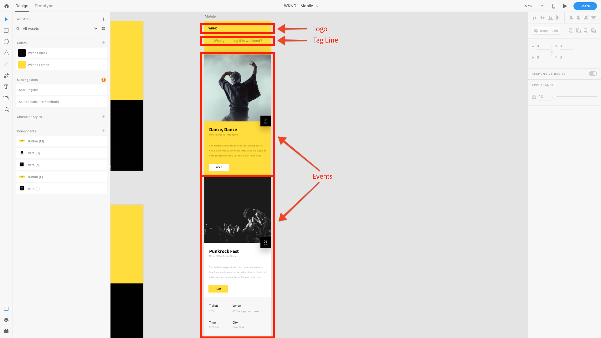

# Capítulo 4 - Definición de plantillas de servicios de contenido

El capítulo 4 del tutorial AEM Headless cubre el papel de AEM plantillas editables en el contexto de AEM Content Services. Las plantillas editables se utilizan para definir la estructura de contenido JSON AEM Content Services expone a los clientes mediante la composición de Content Services habilitada AEM Componentes.

## Funciones de las plantillas en AEM Content Services

AEM Las plantillas editables se utilizan para definir los puntos finales HTTP a los que se accederá para exponer el contenido de Evento como JSON.

Tradicionalmente, las plantillas editables AEM se utilizan para definir páginas Web, aunque este uso es simplemente una convención. Las plantillas editables se pueden utilizar para componer **cualquier** conjunto de contenido; cómo se accede al contenido: como HTML en un navegador, como JSON consumido por JavaScript (AEM SPA Editor) o una aplicación móvil es una función de cómo se solicita esa página.

En AEM Content Services, las plantillas editables se utilizan para definir cómo se exponen los datos JSON.

Para la aplicación [!DNL WKND Mobile], crearemos una única plantilla editable que se utilizará para dirigir un único extremo de API. Aunque este ejemplo es sencillo de ilustrar los conceptos de AEM sin encabezado, puede crear varias páginas (o extremos) cada una de las cuales exponga distintos conjuntos de contenido para crear una API más compleja y mejor organizada.

## Explicación del punto final de la API

Para comprender cómo componer nuestro punto final de API y comprender qué contenido debe exponerse a nuestra aplicación [!DNL WKND Mobile], permítanos volver a examinar el diseño.

Como podemos ver, tenemos tres conjuntos lógicos de contenido para proporcionar a la aplicación móvil.

1. El **logotipo**
2. La **Línea de etiquetas**
3. La lista de **Eventos**

Para ello, podemos asignar estos requisitos a Componentes AEM (y en nuestro caso, AEM Componentes principales de WCM) para exponer el contenido necesario como JSON.

1. El **logotipo** se mostrará mediante un **componente de imagen**
2. La **Línea de etiquetas** se mostrará a través de un **componente de texto**
3. La lista de **Eventos** se mostrará a través de un **componente de Lista de fragmento de contenido** que, a su vez, hace referencia a un conjunto de fragmentos de contenido de Evento.

>[!NOTE]
>
>Para admitir la exportación JSON de AEM Content Service de Páginas y Componentes, las Páginas y Componentes deben **derivarse de AEM componentes principales de WCM**.
>
>[AEM componentes principales de WCM ](https://github.com/Adobe-Marketing-Cloud/aem-core-wcm-components) tienen funcionalidad integrada para admitir un esquema JSON normalizado de páginas y componentes exportados. Todos los componentes de WKND Mobile utilizados en este tutorial (Lista de página, imagen, texto y fragmento de contenido) se derivan de AEM componentes principales de WCM.

## Definición de la plantilla de API de Eventos

1. Vaya a **[!UICONTROL Herramientas] > [!UICONTROL General] > [!UICONTROL Plantillas] >[!DNL WKND Mobile]**.

1. Cree la plantilla **[!DNL Events API]**:

   1. Toque **[!UICONTROL Crear]** en la barra de acciones superior
   1. Seleccione la plantilla **[!DNL WKND Mobile - Empty Page]**
   1. Toque **[!UICONTROL Siguiente]** en la barra de acciones superior
   1. Escriba **[!DNL Events API]** en el campo [!UICONTROL Título de plantilla]
   1. Toque **[!UICONTROL Crear]** en la barra de acciones superior
   1. Toque **[!UICONTROL Abrir]** para abrir la nueva plantilla y editarla

1. Primero, permitimos que los tres componentes AEM identificados modelen el contenido editando la [!UICONTROL directiva] del Contenedor de diseño] raíz. [!UICONTROL  Asegúrese de que el modo **[!UICONTROL Estructura]** está activo, seleccione **[!DNL Layout Container \[Root\]]** y toque el botón **[!UICONTROL Política]**.
1. En **[!UICONTROL Propiedades] > [!UICONTROL Componentes permitidos]** busque **[!DNL WKND Mobile]**. Permita los siguientes componentes del grupo de componentes [!DNL WKND Mobile] para que se puedan utilizar en la página API [!DNL Events].

   * **[!DNL WKND Mobile > Image]**

      * El logotipo de la aplicación
   * **[!DNL WKND Mobile > Text]**

      * El texto introductorio de la aplicación
   * **[!DNL WKND Mobile > Content Fragment List]**

      * La lista de categorías de Evento disponible para su visualización en la aplicación

1. Toque la marca de verificación **[!UICONTROL Listo]** en la esquina superior derecha cuando haya terminado.
1. **** Actualice la ventana del navegador para ver la lista de  [!UICONTROL componentes ] permitidos recientemente en el carril izquierdo.
1. Desde el buscador Componentes en el carril izquierdo, arrastre los siguientes componentes de AEM:
   1. **[!DNL Image]** para el logotipo
   2. **[!DNL Text]** para la línea de etiquetas
   3. **[!DNL Content Fragment List]** para los eventos
1. **Para cada uno de los componentes** anteriores, selecciónelos y pulse el botón de  **** desbloqueo.
1. Sin embargo, asegúrese de que el **contenedor de diseño** esté **bloqueado** para evitar que se agreguen otros componentes o que estos tres componentes se eliminen.
1. Toque **[!UICONTROL Información de página] > [!UICONTROL Vista en Administración]** para volver a la lista de plantillas [!DNL WKND Mobile]. Seleccione la plantilla **[!DNL Events API]** recién creada y toque **[!UICONTROL Habilitar]** en la barra de acciones superior.

>[!VIDEO](https://video.tv.adobe.com/v/28342/?quality=12&learn=on)

>[!NOTE]
>
> Observe que los componentes utilizados para mostrar el contenido se agregan a la plantilla y se bloquean. Esto permite a los autores editar los componentes predefinidos, pero no agregar o quitar componentes de forma arbitraria, ya que el cambio de la propia API podría romper las suposiciones en la estructura JSON y dañar las aplicaciones consumidoras. Todas las API deben ser estables.

## Pasos siguientes

Opcionalmente, instale el paquete de contenido [com.adobe.aem.guide.wknd-mobile.content.chapter-4.zip](https://github.com/adobe/aem-guides-wknd-mobile/releases/latest) en AEM Author mediante [Administrador de paquetes de AEM](http://localhost:4502/crx/packmgr/index.jsp). Este paquete contiene las configuraciones y el contenido que se describen en este y en los capítulos anteriores del tutorial.

* [Capítulo 5 - Creación de páginas de servicios de contenido](./chapter-5.md)
