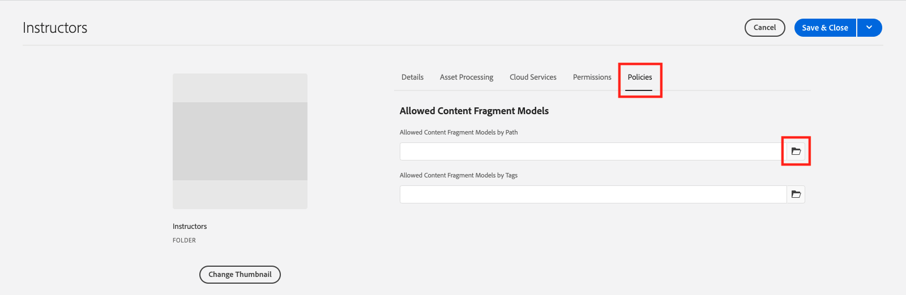

# Crear fragmentos de contenido

En el [capítulo anterior](/help/headless-tutorial/graphql/advanced-graphql/create-content-fragment-models.md), ha creado cinco modelos de fragmento de contenido: persona, equipo, ubicación, dirección e información de contacto. Este capítulo le guiará por los pasos para crear fragmentos de contenido basados en esos modelos. También explora cómo crear directivas de carpeta para limitar qué modelos de fragmentos de contenido se pueden utilizar en la carpeta.

## Requisitos previos {#prerequisites}

Este documento forma parte de un tutorial de varias partes. Asegúrese de que las [capítulo anterior](create-content-fragment-models.md) se ha completado antes de continuar con este capítulo.

## Objetivos {#objectives}

En este capítulo, aprenderá a:

* Crear carpetas y establecer límites mediante directivas de carpetas
* Cree referencias de fragmento directamente desde el editor de fragmentos de contenido
* Uso de tipos de datos Tab, Date y JSON Object
* Inserte referencias de contenido y fragmentos en el editor de texto multilínea
* Añadir varias referencias de fragmento
* Anidar fragmentos de contenido

## Instalación de contenido de muestra {#sample-content}

AEM Instale un paquete de que contenga varias carpetas e imágenes de muestra utilizadas para acelerar el tutorial.

1. Descargar [Advanced-GraphQL-Tutorial-Starter-Package-1.1.zip](/help/headless-tutorial/graphql/advanced-graphql/assets/tutorial-files/Advanced-GraphQL-Tutorial-Starter-Package-1.1.zip)
1. AEM En, navegue hasta **Herramientas** > **Implementación** > **Paquetes** para acceder a **Administrador de paquetes**.
1. Cargue e instale el paquete (archivo zip) descargado en el paso anterior.

   

## Crear carpetas y establecer límites mediante directivas de carpetas

AEM En la página principal de la, seleccione **Assets** > **Archivos** > **WKND compartido** > **Inglés**. Aquí puede ver las distintas categorías de fragmentos de contenido, incluidas Aventuras y Colaboradores.

### Crear carpetas {#create-folders}

Vaya a **Aventuras** carpeta. Puede ver que ya se han creado carpetas para Equipos y ubicaciones para almacenar fragmentos de contenido de Equipos y ubicaciones.

Cree una carpeta para los fragmentos de contenido de los instructores basada en el modelo de fragmento de contenido de la persona.

1. En la página Aventuras, seleccione **Crear** > **Carpeta** en la esquina superior derecha.

   

1. En el modal Crear carpeta que aparece, introduzca &quot;Instructores&quot; en la **Título** field. Observe la &#39;s&#39; al final. Los títulos de las carpetas que contienen muchos fragmentos deben ser plural. Seleccione **Crear**.

   

   Ahora ha creado una carpeta para almacenar los instructores de aventura.

### Establecer límites mediante directivas de carpeta

AEM le permite definir permisos y directivas para las carpetas de fragmentos de contenido. Con los permisos, puede conceder acceso a determinadas carpetas solo a determinados usuarios (autores) o grupos de autores. Mediante directivas de carpeta, puede limitar lo que los autores de modelos de fragmentos de contenido pueden utilizar en esas carpetas. En este ejemplo, limitemos una carpeta a los modelos Person e Contact Info. Para configurar una directiva de carpeta:

1. Seleccione el **Instructores** carpeta que ha creado y, a continuación, seleccione **Propiedades** en la barra de navegación superior.

   

1. Seleccione el **Políticas** y, a continuación, deseleccione **Heredado de /content/dam/wknd-shared**. En el **Modelos de fragmento de contenido permitidos por ruta** , seleccione el icono de carpeta.

   

1. En el cuadro de diálogo Seleccionar ruta que se abre, siga la ruta **conf** > **WKND compartido**. El modelo de fragmento de contenido de persona, creado en el capítulo anterior, contiene una referencia al modelo de fragmento de contenido de información de contacto. Los modelos de persona e información de contacto deben estar permitidos en la carpeta Instructores para crear un fragmento de contenido de instructor. Seleccionar **Persona** y **Información de contacto** y luego pulse **Seleccionar** para cerrar el cuadro de diálogo.

   

1. Seleccionar **Guardar y cerrar** y seleccione **OK** en el cuadro de diálogo de éxito que aparece.

1. Ahora ha configurado una directiva de carpeta para la carpeta Instructores. Vaya a **Instructores** carpeta y seleccione **Crear** > **Fragmento de contenido**. Los únicos modelos que ahora puede seleccionar son **Persona** y **Información de contacto**.

   

## Crear fragmentos de contenido para instructores

Vaya a **Instructores** carpeta. A partir de aquí, vamos a crear una carpeta anidada para almacenar la información de contacto de los instructores.

Siga los pasos descritos en la sección sobre [creación de carpetas](#create-folders) para crear una carpeta denominada &quot;Información de contacto&quot;. La carpeta anidada hereda las directivas de carpeta de la carpeta principal. No dude en configurar directivas más específicas para que la carpeta recién creada solo permita utilizar el modelo Información de contacto.

### Crear un fragmento de contenido de instructor

Vamos a crear cuatro personas que se puedan añadir a un equipo de instructores de aventura.

1. Desde la carpeta Instructores, cree un fragmento de contenido basado en el modelo de fragmento de contenido de persona y asígnele el título &quot;Jacob Wester&quot;.

   El fragmento de contenido recién creado tiene el siguiente aspecto:

   

1. Introduzca el siguiente contenido en los campos:

   * **Nombre completo**: Jacob Wester
   * **Biografía**: Jacob Wester ha sido un instructor de senderismo durante diez años y ha amado cada minuto de ella! Jacob es un buscador de aventuras con un talento para la escalada en roca y el mochilero. Jacob es el ganador de las competiciones de escalada, incluyendo la competición de escalada de la Batalla de la Bahía. Jacob vive actualmente en California.
   * **Nivel de experiencia del instructor**: experto
   * **Aptitudes**: Escalada en roca, Surf, Mochileros
   * **Detalles del administrador**: Jacob Wester ha estado coordinando aventuras de mochilero durante tres años.

1. En el **Imagen de perfil** , añada una referencia de contenido a una imagen. Navegar a **WKND compartido** > **Inglés** > **Colaboradores** > **jacob_wester.jpg** para crear una ruta a la imagen.

### Crear una referencia de fragmento desde el editor de fragmentos de contenido {#fragment-reference-from-editor}

AEM le permite crear una referencia de fragmento directamente desde el editor de fragmentos de contenido. Vamos a crear una referencia a la información de contacto de Jacob.

1. Seleccionar **Fragmento de contenido nuevo** debajo de la **Información de contacto** field.

   

1. Se abre el modal Nuevo fragmento de contenido. En la pestaña Seleccionar destino, siga la ruta **Aventuras** > **Instructores** y seleccione la casilla de verificación situada junto a **Información de contacto** carpeta. Seleccionar **Siguiente** para continuar a la pestaña Propiedades.

   

1. En la pestaña Propiedades, introduzca &quot;Jacob Wester Contact Info&quot; en la **Título** field. Seleccionar **Crear** y luego pulse **Abrir** en el cuadro de diálogo de éxito que aparece.

   

   Aparecen nuevos campos que le permiten editar el fragmento de contenido de información de contacto.

   

1. Introduzca el siguiente contenido en los campos:

   * **Teléfono**: 209-888-0000
   * **Correo electrónico**: jwester@wknd.com

   Cuando termine, seleccione **Guardar**. Ahora ha creado un fragmento de contenido de información de contacto.

1. Para volver al fragmento de contenido de instructor, seleccione **Jacob Wester** en la esquina superior izquierda del editor.

   

   El **Información de contacto** ahora contiene la ruta al fragmento de información de contacto al que se hace referencia. Es una referencia de fragmento anidada. El fragmento de contenido del instructor terminado tiene este aspecto:

   

1. Seleccionar **Guardar y cerrar** para guardar el fragmento de contenido. Ahora tiene un nuevo fragmento de contenido de instructor.

### Creación de fragmentos adicionales

Siga el mismo proceso que se describe en la [sección anterior](#fragment-reference-from-editor) para crear tres fragmentos de contenido de instructores más y tres fragmentos de contenido de información de contacto para estos instructores. Añada el siguiente contenido en los fragmentos de Instructores:

**Stacey Roswells**

| Campos | Valores |
| --- | --- |
| Título del fragmento de contenido | Stacey Roswells |
| Nombre completo | Stacey Roswells |
| Información de contacto | /content/dam/wknd-shared/en/adventures/instructors/contact-info/stacey-roswells-contact-info |
| Imagen de perfil | /content/dam/wknd-shared/en/contributors/stacey-roswells.jpg |
| Biografía | Stacey Roswells es una exitosa escaladora de rocas y aventurera alpina. Nacida en Baltimore, Maryland, Stacey es la menor de seis hijos. El padre de Stacey era teniente coronel de la Armada de los Estados Unidos y su madre era instructora de danza moderna. La familia de Stacey se mudaba con frecuencia con las tareas del padre, y tomaba las primeras fotos cuando su padre estaba destinado en Tailandia. Aquí es también donde Stacey aprendió a escalar. |
| Nivel de experiencia del instructor | Avanzado  |
| Habilidades | Escalada en roca | Esquí | Mochilero |

**Kumar Selvaraj**

| Campos | Valores |
| --- | --- |
| Título del fragmento de contenido | Kumar Selvaraj |
| Nombre completo | Kumar Selvaraj |
| Información de contacto | /content/dam/wknd-shared/en/adventures/instructors/contact-info/kumar-selvaraj-contact-info |
| Imagen de perfil | /content/dam/wknd-shared/en/contributors/kumar-selvaraj.jpg |
| Biografía | Kumar Selvaraj es un experimentado instructor profesional certificado AMGA cuyo objetivo principal es ayudar a los estudiantes a mejorar sus habilidades de escalada y senderismo. |
| Nivel de experiencia del instructor | Avanzado  |
| Habilidades | Escalada en roca | Mochilero |

**Ayo Ogunseinde**

| Campos | Valores |
| --- | --- |
| Título del fragmento de contenido | Ayo Ogunseinde |
| Nombre completo | Ayo Ogunseinde |
| Información de contacto | /content/dam/wknd-shared/en/adventures/instructors/contact-info/ayo-ogunseinde-contact-info |
| Imagen de perfil | /content/dam/wknd-shared/en/contributors/ayo-ogunseinde-237739.jpg |
| Biografía | Ayo Ogunseinde es un escalador profesional e instructor de mochileros que vive en Fresno, California Central. El objetivo de Ayo es guiar a los excursionistas en sus aventuras más épicas del parque nacional. |
| Nivel de experiencia del instructor | Avanzado  |
| Habilidades | Escalada en roca | Ciclismo | Mochilero |

Deje el **Información adicional** campo vacío.

Agregue la siguiente información en los fragmentos de Información de contacto:

| Título del fragmento de contenido | Teléfono | Correo electrónico |
| ------- | -------- | -------- |
| Stacey Roswells Información de contacto | 209-888-0011 | sroswells@wknd.com |
| Kumar Selvaraj Información de contacto | 209-888-0002 | kselvaraj@wknd.com |
| Información de contacto de Ayo Ogunseinde | 209-888-0304 | aogunseinde@wknd.com |

Ya está listo para crear un equipo.

## Crear fragmentos de contenido para ubicaciones

Vaya a **Ubicaciones** carpeta. Aquí puede ver dos carpetas anidadas que ya se han creado: Yosemite National Park y Yosemite Valley Lodge.


Ignora la carpeta Yosemite Valley Lodge por ahora. Volvemos más adelante en esta sección cuando creamos una ubicación que actúa como base principal para nuestro equipo de instructores.

Vaya a **Parque Nacional de Yosemite** carpeta. Actualmente, solo contiene una foto del Parque Nacional Yosemite. Vamos a crear un fragmento de contenido utilizando el Modelo de fragmento de contenido de ubicación y ponerle el título &quot;Parque nacional Yosemite&quot;.

### Marcadores de pestaña

AEM le permite usar marcadores de posición de pestañas para agrupar diferentes tipos de contenido y facilitar la lectura y administración de los fragmentos de contenido. En el capítulo anterior, agregó marcadores de posición de tabulación al modelo Ubicación. Como resultado, el fragmento de contenido de ubicación ahora tiene dos secciones de pestañas: **Detalles de ubicación** y **Dirección de ubicación**.


El **Detalles de ubicación** contiene la pestaña **Nombre**, **Descripción**, **Información de contacto**, **Imagen de ubicación**, y **Tiempo por temporada** campos, mientras que la variable **Dirección de ubicación** contiene una referencia a un fragmento de contenido de dirección. Las pestañas dejan claro qué tipos de contenido se deben rellenar, por lo que la creación de contenido es más fácil de administrar.

### Tipo de datos de objeto JSON

El **Tiempo por temporada** es un tipo de datos de objeto JSON, lo que significa que acepta datos en formato JSON. Este tipo de datos es flexible y se puede utilizar para cualquier dato que desee incluir en el contenido.

Puede ver la descripción del campo que se creó en el capítulo anterior pasando el puntero sobre el icono de información a la derecha del campo.


En este caso, tenemos que proporcionar el tiempo promedio para la ubicación. Introduzca los datos siguientes:

```json
{
    "summer": "81 / 89°F",
    "fall": "56 / 83°F",
    "winter": "46 / 51°F",
    "spring": "57 / 71°F"
}
```

El **Tiempo por temporada** ahora debería tener un aspecto similar al siguiente:


### Añadir contenido

Añadamos el resto del contenido al fragmento de contenido de ubicación para consultar la información con GraphQL en el capítulo siguiente.

1. En el **Detalles de ubicación** pestaña, introduzca la siguiente información en los campos:

   * **Nombre**: Parque Nacional de Yosemite
   * **Descripción**: El Parque Nacional de Yosemite se encuentra en las montañas de Sierra Nevada, en California. Es famosa por sus hermosas cascadas, secuoyas gigantes y vistas icónicas de El Capitán y los acantilados de Media Cúpula. Caminar y acampar son las mejores formas de experimentar Yosemite. Numerosos senderos ofrecen infinitas oportunidades para la aventura y la exploración.

1. Desde el **Información de contacto** , cree un fragmento de contenido basado en el modelo Contact Info y denomínelo &quot;Información de contacto del Parque Nacional Yosemite&quot;. Siga el mismo proceso que se describe en la sección anterior sobre [creación de una referencia de fragmento desde el editor](#fragment-reference-from-editor) e introduzca los siguientes datos en los campos:

   * **Teléfono**: 209-999-0000
   * **Correo electrónico**: yosemite@wknd.com

1. Desde el **Imagen de ubicación** , busque **Aventuras** > **Ubicaciones** > **Parque Nacional de Yosemite** > **yosemite-national-park.jpeg** para crear una ruta a la imagen.

   Recuerde, en el capítulo anterior configuró la validación de imágenes, por lo que las dimensiones de la imagen de ubicación deben ser inferiores a 2560 x 1800 y su tamaño de archivo debe ser inferior a 3 MB.

1. Con toda la información añadida, la variable **Detalles de ubicación** ahora tiene este aspecto:

   

1. Vaya a **Dirección de ubicación** pestaña. Desde el **Dirección** , cree un fragmento de contenido titulado &quot;Dirección del parque nacional de Yosemite&quot; utilizando el modelo de fragmento de contenido de dirección que creó en el capítulo anterior. Siga el mismo proceso que se describe en la sección sobre [creación de una referencia de fragmento desde el editor](#fragment-reference-from-editor) e introduzca los siguientes datos en los campos:

   * **Dirección física**: 9010 Curry Village Drive
   * **Ciudad**: Valle de Yosemite
   * **Estado**: CA
   * **Código postal**: 95389
   * **País**: Estados Unidos

1. El completado **Dirección de ubicación** La pestaña del fragmento del Parque Nacional Yosemite tiene este aspecto:

   

1. Seleccione **Guardar y cerrar**.

### Crear un fragmento más

1. Vaya a **Yosemite Valley Lodge** carpeta. Cree un fragmento de contenido con el modelo de fragmento de contenido de ubicación y asígnele el título &quot;Yosemite Valley Lodge&quot;.

1. En el **Detalles de ubicación** pestaña, introduzca la siguiente información en los campos:

   * **Nombre** Hoteles en Yosemite Valley Lodge
   * **Descripción**: Yosemite Valley Lodge es un centro para reuniones de grupos y todo tipo de actividades, como compras, restaurantes, pesca, senderismo y mucho más.

1. Desde el **Información de contacto** , cree un fragmento de contenido basado en el modelo Información de contacto y denomínelo &quot;Información de contacto de Yosemite Valley Lodge&quot;. Siga el mismo proceso que se describe en la sección sobre [creación de una referencia de fragmento desde el editor](#fragment-reference-from-editor) e introduzca los siguientes datos en los campos del nuevo fragmento de contenido:

   * **Teléfono**: 209-992-0000
   * **Correo electrónico**: yosemitelodge@wknd.com

   Guarde el fragmento de contenido recién creado.

1. Vaya de nuevo a **Yosemite Valley Lodge** y vaya a la **Dirección de ubicación** pestaña. Desde el **Dirección** , cree un fragmento de contenido titulado &quot;Dirección de alojamiento de Yosemite Valley&quot; utilizando el modelo de fragmento de contenido de dirección que creó en el capítulo anterior. Siga el mismo proceso que se describe en la sección sobre [creación de una referencia de fragmento desde el editor](#fragment-reference-from-editor) e introduzca los siguientes datos en los campos:

   * **Dirección física**: 9006 Yosemite Lodge Drive
   * **Ciudad**: Parque Nacional de Yosemite
   * **Estado**: CA
   * **Código postal**: 95389
   * **País**: Estados Unidos

   Guarde el fragmento de contenido recién creado.

1. Vaya de nuevo a **Yosemite Valley Lodge**, luego seleccione **Guardar y cerrar**. El **Yosemite Valley Lodge** Esta carpeta ahora contiene tres fragmentos de contenido: Yosemite Valley Lodge, Yosemite Valley Lodge Contact Info y Yosemite Valley Lodge Address.

   

## Crear un fragmento de contenido de equipo

Examen de carpetas a **Equipos** > **Equipo de Yosemite**. Puede ver que la carpeta Equipo de Yosemite actualmente solo contiene el logotipo del equipo.


Vamos a crear un fragmento de contenido utilizando el Modelo de fragmento de contenido de equipo y ponerle el título &quot;Equipo de Yosemite&quot;.

### Referencias de contenido y fragmentos en el editor de texto multilínea

AEM le permite añadir contenido y referencias de fragmento directamente en el editor de texto multilínea y recuperarlas más tarde mediante consultas de GraphQL. Añadamos referencias de contenido y de fragmentos al **Descripción** field.

1. En primer lugar, agregue el siguiente texto al **Descripción** Campo: &quot;El equipo de aventureros profesionales e instructores de senderismo que trabajan en el Parque Nacional Yosemite&quot;.

1. Para añadir una referencia de contenido, seleccione la **Insertar recurso** en la barra de herramientas del editor de texto multilínea.

   

1. En el modal que aparece, seleccione **team-yosemite-logo.png** y pulse **Seleccionar**.

   

   La referencia de contenido ahora se agrega al **Descripción** field.

Recuerde que en el capítulo anterior permitió que se agregaran referencias de fragmento a **Descripción** field. Vamos a añadir uno aquí.

1. Seleccione el **Insertar fragmento de contenido** en la barra de herramientas del editor de texto multilínea.

   

1. Navegar a **WKND compartido** > **Inglés** > **Aventuras** > **Ubicaciones** > **Yosemite Valley Lodge** > **Yosemite Valley Lodge**. Prensa **Seleccionar** para insertar el fragmento de contenido.

   

   El **Descripción** ahora tiene el siguiente aspecto:

   

Ahora ha agregado las referencias de contenido y fragmento directamente al editor de texto multilínea.

### Tipo de datos de fecha y hora

Veamos el tipo de datos Fecha y hora. Seleccione el **Calendario** en el lado derecho de la ventana **Fecha de fundación del equipo** para abrir la vista de calendario.


Las fechas pasadas o futuras se pueden establecer utilizando las flechas hacia delante y hacia atrás a ambos lados del mes. Digamos que el equipo de Yosemite fue fundado el 24 de mayo de 2016, así que fijaremos la fecha para entonces.

### Añadir varias referencias de fragmento

Añadamos Instructores a la referencia de fragmento de miembros del equipo.

1. Seleccionar **Añadir** en el **Miembros del equipo** field.

   

1. En el nuevo campo que aparece, seleccione el icono de carpeta para abrir el modal Select Path. Examine las carpetas para **WKND compartido** > **Inglés** > **Aventuras** > **Instructores**, luego seleccione la casilla de verificación situada junto a **jacob occidental**. Prensa **Seleccionar** para guardar la ruta.

   

1. Seleccione el **Añadir** botón tres veces más. Utilice los nuevos campos para añadir los tres instructores restantes al equipo. El **Miembros del equipo** ahora tiene este aspecto:

   

1. Seleccionar **Guardar y cerrar** para guardar el fragmento de contenido de equipo.

### Añadir referencias de fragmento a un fragmento de contenido de aventura

Por último, vamos a añadir los fragmentos de contenido recién creados a una aventura.

1. Vaya a **Aventuras** > **Mochilero Yosemite** y abra el fragmento de contenido de mochilero Yosemite. En la parte inferior del formulario, puede ver los tres campos que ha creado en el capítulo anterior: **Ubicación**, **Equipo del instructor**, y **Administrador**.

1. Añada la referencia de fragmento en la variable **Ubicación** field. La ruta de ubicación debe hacer referencia al fragmento de contenido del Parque Nacional Yosemite que ha creado: `/content/dam/wknd-shared/en/adventures/locations/yosemite-national-park/yosemite-national-park`.

1. Añada la referencia de fragmento en la variable **Equipo del instructor** field. La ruta del equipo debe hacer referencia al fragmento de contenido de Yosemite Team que ha creado: `/content/dam/wknd-shared/en/adventures/teams/yosemite-team/yosemite-team`. Es una referencia de fragmento anidada. El fragmento de contenido de equipo contiene una referencia al modelo de persona que hace referencia a los modelos de dirección e información de contacto. Por lo tanto, tiene fragmentos de contenido anidados tres niveles por debajo.

1. Añada la referencia de fragmento en la variable **Administrador** field. Digamos que Jacob Wester es administrador de la aventura de mochileros de Yosemite. La ruta debe llevar al fragmento de contenido Jacob Wester y aparecer de la siguiente manera: `/content/dam/wknd-shared/en/adventures/instructors/jacob-wester`.

1. Ahora ha agregado tres referencias de fragmento a un fragmento de contenido de aventura. Los campos tienen este aspecto:

   

1. Seleccionar **Guardar y cerrar** para guardar el contenido.

## Enhorabuena.

Felicitaciones. Ahora ha creado fragmentos de contenido basados en los modelos de fragmentos de contenido avanzados creados en el capítulo anterior. También ha creado una directiva de carpeta para limitar qué modelos de fragmentos de contenido se pueden seleccionar dentro de una carpeta.

## Pasos siguientes

En el [capítulo siguiente](/help/headless-tutorial/graphql/advanced-graphql/explore-graphql-api.md)Además, aprenderá a enviar consultas de GraphQL avanzadas mediante el entorno de desarrollo integrado (IDE) de GraphiQL. Estas consultas nos permiten ver los datos creados en este capítulo y, finalmente, añadir estas consultas a la aplicación WKND.
