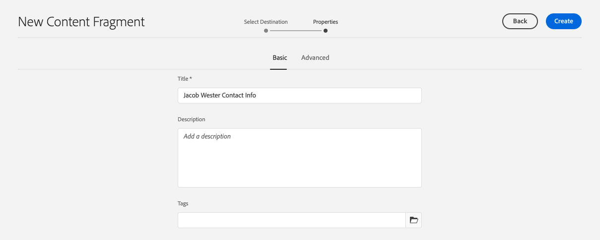
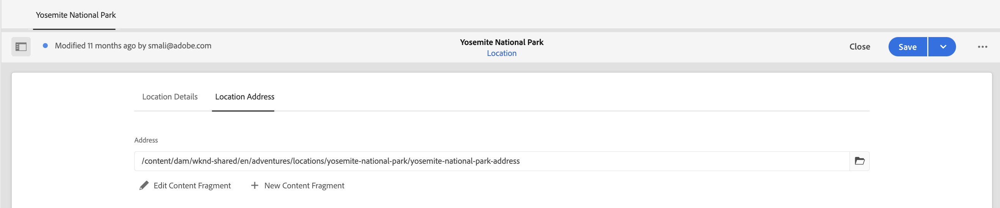

# Creación de fragmentos de contenido

En el [capítulo anterior](/help/headless-tutorial/graphql/advanced-graphql/create-content-fragment-models.md), ha creado cinco modelos de fragmento de contenido: Persona, equipo, ubicación, dirección e información de contacto. Este capítulo le guía por los pasos para crear fragmentos de contenido basados en esos modelos. También explora cómo crear directivas de carpeta para limitar qué modelos de fragmento de contenido se pueden usar en la carpeta.

## Requisitos previos {#prerequisites}

Este documento forma parte de un tutorial en varias partes. Asegúrese de que los capítulos anteriores se hayan completado antes de continuar con este capítulo.

## Objetivos {#objectives}

En este capítulo, aprenda a:

* Crear carpetas y establecer límites mediante directivas de carpetas
* Creación de referencias de fragmento directamente desde el editor de fragmentos de contenido
* Usar los tipos de datos Tabulación, Fecha y Objeto JSON
* Inserción de contenido y referencias de fragmento en el editor de texto multilínea
* Agregar varias referencias de fragmento
* Anidar fragmentos de contenido

## Instalar contenido de ejemplo {#sample-content}

Instale un paquete de AEM que contenga varias carpetas e imágenes de ejemplo utilizadas para acelerar el tutorial.

1. Descargar [Advanced-GraphQL-Tutorial-Starter-Package-1.0.zip](/help/headless-tutorial/graphql/advanced-graphql/assets/tutorial-files/Advanced-GraphQL-Tutorial-Starter-Package-1.0.zip)
1. En AEM, vaya a **Herramientas** > **Implementación** > **Paquetes** para acceder a **Administrador de paquetes**.
1. Cargue e instale el paquete (archivo zip) descargado en el paso anterior.

   

## Crear carpetas y establecer límites mediante directivas de carpetas

En la página de inicio de AEM, seleccione **Recursos** > **Archivos** > **Sitio WKND** > **Inglés**. Aquí puede ver las distintas categorías de fragmentos de contenido, incluidas las aventuras y los colaboradores que se exploraron en el pasado [tutorial de GraphQL de varios pasos](../multi-step/overview.md).

### Crear carpetas {#create-folders}

Vaya a **Aventuras** carpeta. Puede ver que ya se han creado carpetas para equipos y ubicaciones para almacenar los fragmentos de contenido de equipos y ubicaciones.

Cree una carpeta para los fragmentos de contenido de instructores basados en el modelo de fragmento de contenido de persona.

1. En la página Aventuras , seleccione **Crear** > **Carpeta** en la esquina superior derecha.

   

1. En el modal Crear carpeta que aparece, introduzca &quot;Instructores&quot; en la **Título** campo . Observe las &quot;s&quot; al final. Los títulos de las carpetas que contienen muchos fragmentos deben ser plurales. Seleccione **Crear**.

   

   Ahora ha creado una carpeta para almacenar instructores de aventura.

### Establecer límites mediante directivas de carpeta

AEM permite definir permisos y directivas para carpetas de fragmento de contenido. Mediante los permisos, solo se puede conceder acceso a determinadas carpetas a ciertos usuarios (autores) o grupos de autores. Mediante políticas de carpeta, puede limitar qué pueden utilizar los autores de modelos de fragmento de contenido en esas carpetas. En este ejemplo, limitemos una carpeta a los modelos de Información de persona y contacto. Para configurar una directiva de carpeta:

1. Seleccione el **Instructores** carpeta que ha creado y, a continuación, seleccione **Propiedades** en la barra de navegación superior.

   

1. Seleccione el **Políticas** y, a continuación, deseleccione **Heredado de /content/dam/wknd**. En el **Modelos de fragmento de contenido permitidos por ruta** , seleccione el icono de carpeta .

   

1. En el cuadro de diálogo Seleccionar ruta que se abre, siga la ruta **conf** > **Sitio WKND**. El modelo de fragmento de contenido de persona, creado en el capítulo anterior, contiene una referencia al modelo de fragmento de contenido de información de contacto. Los modelos Persona y Información de contacto deben estar permitidos en la carpeta Instructores para crear un fragmento de contenido del instructor. Select **Persona** y **Información de contacto** y, a continuación, pulse **Select** para cerrar el cuadro de diálogo.

   

1. Select **Guardar y cerrar** y seleccione **OK** en el cuadro de diálogo de éxito que aparece.

1. Ahora ha configurado una directiva de carpeta para la carpeta Instructors . Vaya a **Instructores** carpeta y seleccione **Crear** > **Fragmento de contenido**. Los únicos modelos que ahora puede seleccionar son **Persona** y **Información de contacto**.

   

## Creación de fragmentos de contenido para instructores

Vaya a **Instructores** carpeta. A partir de aquí, vamos a crear una carpeta anidada para almacenar la información de contacto de los instructores.

Siga los pasos descritos en la sección sobre [crear carpetas](#create-folders) para crear una carpeta titulada &quot;Información de contacto&quot;. Tenga en cuenta que la carpeta anidada hereda las directivas de carpeta de la carpeta principal. Siéntase libre de configurar directivas más específicas, por lo que la carpeta recién creada solo permite utilizar el modelo de información de contacto.

### Crear un fragmento de contenido del instructor

Vamos a crear cuatro personas que se puedan añadir a un equipo de instructores de aventura. Vuelva a utilizar las imágenes y los nombres de los fragmentos de contenido de los colaboradores creados en el anterior [tutorial de GraphQL de varios pasos](../multi-step/author-content-fragments.md). Aunque en el tutorial anterior se describía cómo crear fragmentos de contenido básicos, este tutorial se centra en funciones más avanzadas.

1. Desde la carpeta Instructores, cree un nuevo fragmento de contenido basado en el modelo de fragmento de contenido personal y asígnele el título &quot;Jacob Wester&quot;.

   El fragmento de contenido recién creado tiene el siguiente aspecto:

   

1. Introduzca el siguiente contenido en los campos:

   * **Nombre completo**: Jacob Wester
   * **Biografía**: Jacob Wester ha sido instructor de senderismo durante diez años y ha amado cada minuto. Es un buscador de aventuras con talento para escalar y mojar. Jacob es el ganador de las competencias de escalada, incluyendo la competencia de rotura de la Batalla de la Bahía. Actualmente vive en California.
   * **Nivel de experiencia del instructor**: Experto
   * **Habilidades**: Escalada de rocas, surf, mochilero
   * **Detalles del administrador**: Jacob Wester ha estado coordinando aventuras de mochilero durante 3 años.

1. En el **Imagen del perfil** , añada una referencia de contenido a una imagen. Vaya a **Sitio WKND** > **Inglés** > **Colaboradores** > **jacob_wester.jpg** para crear una ruta a la imagen.

### Crear una nueva referencia de fragmento desde el editor de fragmentos de contenido {#fragment-reference-from-editor}

AEM le permite crear una referencia de fragmento directamente desde el editor de fragmentos de contenido. Creemos una referencia a la información de contacto de Jacob.

1. Select **Nuevo fragmento de contenido** debajo de **Información de contacto** campo .

   

1. Se abre el modal Nuevo fragmento de contenido . En la ficha Seleccionar destino , siga la ruta **Aventuras** > **Instructores** y seleccione la casilla que hay junto a la **Información de contacto** carpeta. Select **Siguiente** para continuar con la pestaña Propiedades .

   

1. En la pestaña Propiedades , introduzca &quot;Información de contacto de Jacob Wester&quot; en la **Título** campo . Select **Crear** y, a continuación, pulse **Apertura** en el cuadro de diálogo de éxito que aparece.

   

   Aparecen nuevos campos que le permiten editar el fragmento de contenido de Información de contacto .

   

1. Introduzca el siguiente contenido en los campos:

   * **Teléfono**: 209-888-0000
   * **Correo electrónico**: jwester@wknd.com

   Cuando termine, seleccione **Guardar**. Ahora ha creado un nuevo fragmento de contenido de información de contacto.

1. Para volver al fragmento de contenido del instructor, seleccione **Jacob Wester** en la esquina superior izquierda del editor.

   

   La variable **Información de contacto** ahora contiene la ruta al fragmento de información de contacto al que se hace referencia. Se trata de una referencia de fragmento anidada. El fragmento de contenido del instructor terminado tiene este aspecto:

   

1. Select **Guardar y cerrar** para guardar el fragmento de contenido. Ahora tiene un nuevo fragmento de contenido del instructor.

### Crear fragmentos adicionales

Siga el mismo proceso que se describe en la [sección anterior](#fragment-reference-from-editor) para crear tres fragmentos de contenido de instructores más y tres fragmentos de contenido de información de contacto para estos instructores. Añada el siguiente contenido en los fragmentos Instructores :

**Stacey Roswells**

| Fields | Valores |
| --- | --- |
| Título del fragmento de contenido | Stacey Roswells |
| Nombre completo | Stacey Roswells |
| Información de contacto | /content/dam/wknd/en/adventures/instructors/contact-info/stacey-roswells-contact-info |
| Imagen del perfil | /content/dam/wknd/en/contributors/stacey-roswells.jpg |
| Biografía | Stacey Roswells es un consumado escalador rocoso y aventurero alpino. Nacido en Baltimore, Maryland, Stacey es el menor de seis niños. Su padre era un teniente coronel de la Marina de los Estados Unidos y su madre era una profesora de danza moderna. Su familia se mudó con frecuencia con las tareas de su padre, y ella tomó sus primeras fotos cuando estaba destinado en Tailandia. Aquí es donde Stacey aprendió a escalar. |
| Nivel de experiencia del instructor | Avanzado  |
| Habilidades | Escalada de rocas | Esquí | Empaquetado |

**Kumar Selvaraj**

| Campos | Valores |
| --- | --- |
| Título del fragmento de contenido | Kumar Selvaraj |
| Nombre completo | Kumar Selvaraj |
| Información de contacto | /content/dam/wknd/en/adventures/instructors/contact-info/kumar-selvaraj-contact-info |
| Imagen del perfil | /content/dam/wknd/en/contributors/Kumar_Selvaraj.JPG |
| Biografía | Kumar Selvaraj es un experimentado instructor profesional certificado por AMGA cuyo objetivo principal es ayudar a los estudiantes a mejorar sus habilidades de escalada y senderismo. |
| Nivel de experiencia del instructor | Avanzado  |
| Habilidades | Escalada de rocas | Empaquetado |

**Ayo Ogunseinde**

| Campos | Valores |
| --- | --- |
| Título del fragmento de contenido | Ayo Ogunseinde |
| Nombre completo | Ayo Ogunseinde |
| Información de contacto | /content/dam/wknd/en/adventures/instructors/contact-info/ayo-ogunseinde-contact-info |
| Imagen del perfil | /content/dam/wknd/en/contributors/ayo-ogunseinde-237739.jpg |
| Biografía | Ayo Ogunseinde es un profesor profesional de escalada y mochilero que vive en Fresno, California Central. Su objetivo es guiar a los excursionistas en sus más épicas aventuras en el parque nacional. |
| Nivel de experiencia del instructor | Avanzado  |
| Habilidades | Escalada de rocas | Ciclismo | Empaquetado |

Deje el **Información adicional** campo vacío.

Agregue la siguiente información en los fragmentos Información de contacto :

| Título del fragmento de contenido | Teléfono | Correo electrónico |
| ------- | -------- | -------- |
| Información de contacto de Stacey Roswells | 209-888-0011 | sroswells@wknd.com |
| Información de contacto de Kumar Selvaraj | 209-888-0002 | kselvaraj@wknd.com |
| Información de contacto de Ayo Ogunseinde | 209-888-0304 | aogunseinde@wknd.com |

Ya está listo para crear un Equipo!

## Creación de fragmentos de contenido para ubicaciones

Vaya a **Ubicaciones** carpeta. Aquí puede ver dos carpetas anidadas que ya se han creado: Parque Nacional Yosemite y Lodge Valle Yosemite.


Ignore por ahora la carpeta Yosemite Valley Lodge. Volveremos a él más adelante en esta sección cuando creemos una nueva ubicación que actuará como base de nuestro equipo de instructores.

Vaya a **Parque Nacional Yosemite** carpeta. Actualmente, sólo contiene una foto del Parque Nacional Yosemite. Vamos a crear un nuevo fragmento de contenido usando el Modelo de fragmento de contenido de ubicación y llamarlo &quot;Parque Nacional Yosemite&quot;.

### Marcadores de posición de tabulación

AEM le permite utilizar marcadores de posición de pestañas para agrupar diferentes tipos de contenido y facilitar la lectura y administración de los fragmentos de contenido. En el capítulo anterior, se agregaron marcadores de posición de tabulación al modelo Ubicación. Como resultado, el fragmento de contenido de ubicación ahora tiene dos secciones de ficha: **Detalles de ubicación** y **Dirección de ubicación**.


La variable **Detalles de ubicación** contiene el **Nombre**, **Descripción**, **Información de contacto**, **Imagen de ubicación** y **Tiempo por temporada** mientras que la variable **Dirección de ubicación** contiene una referencia a un fragmento de contenido de dirección. Las pestañas dejan claro qué tipos de contenido se deben rellenar, por lo que la creación de contenido es más fácil de administrar.

### Tipo de datos de objeto JSON

La variable **Tiempo por temporada** field es un tipo de datos de objeto JSON, lo que significa que acepta datos en formato JSON. Este tipo de datos es flexible y se puede utilizar para cualquier dato que desee incluir en el contenido.

Puede ver la descripción del campo que se creó en el capítulo anterior pasando el cursor sobre el icono de información a la derecha del campo.


En este caso, necesitamos proporcionar el tiempo promedio para el lugar. Introduzca los siguientes datos:

```json
{
    "summer": "81 / 89°F",
    "fall": "56 / 83°F",
    "winter": "46 / 51°F",
    "spring": "57 / 71°F"
}
```

La variable **Tiempo por temporada** ahora debe tener este aspecto:


### Añadir contenido

Añadamos el resto del contenido al fragmento de contenido de ubicación para consultar la información con GraphQL en el capítulo siguiente.

1. En el **Detalles de ubicación** , introduzca la siguiente información en los campos:

   * **Nombre**: Parque Nacional Yosemite
   * **Descripción**: El Parque Nacional Yosemite se encuentra en las montañas de Sierra Nevada, en California. Es famosa por sus hermosas cascadas, sus secuoya gigantes y sus icónicas vistas a los acantilados de El Capitan y Half Dome. Senderismo y acampada son las mejores formas de experimentar Yosemite. Numerosos senderos ofrecen infinitas oportunidades de aventura y exploración.

1. En el **Información de contacto** , cree un nuevo fragmento de contenido basado en el modelo Contact Info y titule &quot;Yosemite National Park Contact Info&quot;. Siga el mismo proceso que se describe en la sección anterior de [creación de una nueva referencia de fragmento desde el editor](#fragment-reference-from-editor) e introduzca los datos siguientes en los campos:

   * **Teléfono**: 209-999-0000
   * **Correo electrónico**: yosemite@wknd.com

1. En el **Imagen de ubicación** , vaya a **Aventuras** > **Ubicaciones** > **Parque Nacional Yosemite** > **yosemite-national-park.jpeg** para crear una ruta a la imagen.

   Recuerde que en el capítulo anterior configuró la validación de imagen, por lo que las dimensiones de la imagen de ubicación deben ser inferiores a 2560 x 1800 y su tamaño de archivo debe ser inferior a 3 MB.

1. Con toda la información agregada, la variable **Detalles de ubicación** ahora tiene este aspecto:

   

1. Vaya a **Dirección de ubicación** pestaña . En el **Dirección** , cree un nuevo fragmento de contenido titulado &quot;Dirección del parque nacional Yosemite&quot; utilizando el modelo de fragmento de contenido de la dirección que creó en el capítulo anterior. Siga el mismo proceso que se describe en la sección de [creación de una nueva referencia de fragmento desde el editor](#fragment-reference-from-editor) e introduzca los datos siguientes en los campos:

   * **Dirección**: 9010 Curry Village Drive
   * **Ciudad**: Yosemite Valley
   * **Estado**: CA
   * **Código postal**: 95389
   * **País**: Estados Unidos

1. El **Dirección de ubicación** la pestaña del fragmento del Parque Nacional Yosemite tiene este aspecto:

   

1. Seleccione **Guardar y cerrar**.

### Crear un fragmento adicional

1. Vaya a **Yosemite Valley Lodge** carpeta. Cree un nuevo fragmento de contenido usando el Modelo de fragmento de contenido de ubicación y titule &quot;Lodge Yosemite Valley&quot;.

1. En el **Detalles de ubicación** , introduzca la siguiente información en los campos:

   * **Nombre**: Yosemite Valley Lodge
   * **Descripción**: Yosemite Valley Lodge es un centro de reuniones grupales y todo tipo de actividades, como compras, restaurantes, pesca, caminatas y muchas más.

1. En el **Información de contacto** , cree un nuevo fragmento de contenido basado en el modelo de información de contacto y agréguelo &quot;Información de contacto de yosemite Valley Lodge&quot;. Siga el mismo proceso que se describe en la sección de [creación de una nueva referencia de fragmento desde el editor](#fragment-reference-from-editor) e introduzca los siguientes datos en los campos del nuevo fragmento de contenido:

   * **Teléfono**: 209-992-0000
   * **Correo electrónico**: yosemitelodge@wknd.com

   Guarde el fragmento de contenido recién creado.

1. Retroceder a **Yosemite Valley Lodge** y vaya a **Dirección de ubicación** pestaña . En el **Dirección** , cree un nuevo fragmento de contenido titulado &quot;Dirección de Lodge Yosemite Valley&quot; utilizando el Modelo de fragmento de contenido de direcciones que creó en el capítulo anterior. Siga el mismo proceso que se describe en la sección de [creación de una nueva referencia de fragmento desde el editor](#fragment-reference-from-editor) e introduzca los datos siguientes en los campos:

   * **Dirección**: 9006 Yosemite Lodge Drive
   * **Ciudad**: Parque Nacional Yosemite
   * **Estado**: CA
   * **Código postal**: 95389
   * **País**: Estados Unidos

   Guarde el fragmento de contenido recién creado.

1. Retroceder a **Yosemite Valley Lodge** y, a continuación, seleccione **Guardar y cerrar**. La variable **Yosemite Valley Lodge** La carpeta ahora contiene tres fragmentos de contenido: Yosemite Valley Lodge, Yosemite Valley Lodge Contact Info y Yosemite Valley Lodge Address.

   

## Crear un fragmento de contenido de equipo

Examinar carpetas para **Equipos** > **Yosemite Team**. Puede ver que la carpeta Yosemite Team actualmente solo contiene el logotipo del equipo.


Vamos a crear un nuevo fragmento de contenido usando el Modelo de fragmento de contenido del equipo y llamarlo &quot;Yosemite Team&quot;.

### Referencias de contenido y fragmento en el editor de texto multilínea

AEM permite añadir contenido y referencias de fragmento directamente al editor de texto multilínea y recuperarlas posteriormente mediante consultas de GraphQL. Añadamos referencias de contenido y de fragmento al **Descripción** campo .

1. En primer lugar, agregue el siguiente texto a la **Descripción** campo: &quot;El equipo de aventureros profesionales e instructores de senderismo que trabajan en el Parque Nacional Yosemite&quot;.

1. Para añadir una referencia de contenido, seleccione la opción **Insertar recurso** en la barra de herramientas del editor de texto multilínea.

   

1. En el modal que aparece, seleccione **team-yosemite-logo.png** y presione **Select**.

   

   La referencia de contenido ahora se agrega al **Descripción** campo .

Recuerde que en el capítulo anterior ha permitido que las referencias de fragmento se agreguen al **Descripción** campo . Añadamos uno aquí.

1. Seleccione el **Insertar fragmento de contenido** en la barra de herramientas del editor de texto multilínea.

   

1. Vaya a **Sitio WKND** > **Inglés** > **Aventuras** > **Ubicaciones** > **Yosemite Valley Lodge** > **Yosemite Valley Lodge**. Press **Select** para insertar el fragmento de contenido.

   

   La variable **Descripción** ahora tiene el siguiente aspecto:

   

Ahora ha añadido el contenido y las referencias de fragmento directamente al editor de texto multilínea.

### Tipo de datos de fecha y hora

Veamos el tipo de datos Fecha y Hora. Seleccione el **Calendario** a la derecha del **Fecha de base del equipo** para abrir la vista de calendario.


Las fechas pasadas o futuras se pueden configurar utilizando las flechas hacia delante y hacia atrás en cualquier lado del mes. Digamos que el equipo Yosemite fue fundado el 24 de mayo del 2016, así que fijaremos la fecha para entonces.

### Agregar varias referencias de fragmento

Añadamos la referencia de fragmento Instructores a los integrantes del equipo.

1. Select **Agregar** en el **Miembros del equipo** campo .

   

1. En el nuevo campo que aparece, seleccione el icono de carpeta para abrir el modal Seleccionar ruta. Vaya a las carpetas para **Sitio WKND** > **Inglés** > **Aventuras** > **Instructores** y, a continuación, seleccione la casilla situada junto a **jacob-wester**. Press **Select** para guardar la ruta.

   

1. Seleccione el **Agregar** tres veces más. Utilice los campos nuevos para añadir los tres Instructores restantes al equipo. La variable **Miembros del equipo** ahora tiene este aspecto:

   

1. Select **Guardar y cerrar** para guardar el fragmento de contenido del equipo.

### Añadir referencias de fragmento a un fragmento de contenido de aventura

Finalmente, vamos a agregar nuestros fragmentos de contenido recién creados a una aventura.

1. Vaya a **Aventuras** > **Mochila yosemite** y abra el fragmento de contenido de embalaje de yosemite. En la parte inferior del formulario, puede ver los tres campos que ha creado en el capítulo anterior: **Ubicación**, **Equipo de instructores** y **Administrador**.

1. Agregue la referencia de fragmento en la **Ubicación** campo . La ruta Ubicación debe hacer referencia al fragmento de contenido del Parque Nacional Yosemite que ha creado: `/content/dam/wknd/en/adventures/locations/yosemite-national-park/yosemite-national-park`.

1. Agregue la referencia de fragmento en la **Equipo de instructores** campo . La ruta del equipo debe hacer referencia al fragmento de contenido del equipo Yosemite que ha creado: `/content/dam/wknd/en/adventures/teams/yosemite-team/yosemite-team`. Se trata de una referencia de fragmento anidada. El fragmento de contenido de equipo contiene una referencia al modelo Persona que hace referencia a los modelos Información de contacto y Dirección. Por lo tanto, tiene fragmentos de contenido anidados en tres niveles.

1. Agregue la referencia de fragmento en la **Administrador** campo . Digamos que Jacob Wester es un Administrador de la Aventura Yosemite Backpacketet. La ruta debe conducir al fragmento de contenido de Jacob Wester y aparecer de la siguiente manera: `/content/dam/wknd/en/adventures/instructors/jacob-wester`.

1. Ahora ha añadido tres referencias de fragmento a un fragmento de contenido de aventura. Los campos tienen este aspecto:

   

1. Select **Guardar y cerrar** para guardar el contenido.

## Felicitaciones!

Felicitaciones! Ahora ha creado fragmentos de contenido basados en los modelos de fragmento de contenido avanzados creados en el capítulo anterior. También ha creado una directiva de carpeta para limitar qué modelos de fragmento de contenido se pueden seleccionar dentro de una carpeta.

## Pasos siguientes

En el [capítulo siguiente](/help/headless-tutorial/graphql/advanced-graphql/explore-graphql-api.md), aprenderá a enviar consultas avanzadas de GraphQL mediante el Entorno de desarrollo integrado (IDE) de GraphiQL. Estas consultas nos permiten ver los datos creados en este capítulo y, finalmente, añadir estas consultas a la aplicación WKND.

Aunque es opcional para este tutorial, asegúrese de publicar todo el contenido en situaciones de producción en el mundo real. Encontrará más información sobre los entornos Autor y Publicación en la [serie de vídeos sin periféricos](/help/headless-tutorial/graphql/video-series/author-publish-architecture.md)
