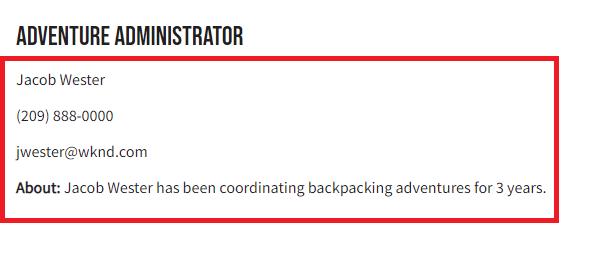

# Integración de aplicaciones de cliente

En el capítulo anterior, se crearon y actualizaron consultas persistentes utilizando solicitudes de PUT y POST HTTP.

Este capítulo le explica los pasos para integrar esas consultas persistentes con la aplicación WKND mediante solicitudes de GET HTTP en cinco componentes de React:

* Lugar de residencia
* Dirección
* Instructores
* Administrador
* Equipo

## Requisitos previos {#prerequisites}

Este documento forma parte de un tutorial en varias partes. Asegúrese de que los capítulos anteriores se hayan completado antes de continuar con este capítulo. Finalización del [tutorial básico](/help/headless-tutorial/graphql/multi-step/overview.md) se recomienda.

_Las capturas de pantalla IDE de este capítulo provienen de [Código de Visual Studio](https://code.visualstudio.com/)_

### Capítulo 1-4 Paquete de soluciones (opcional) {#solution-package}

Hay disponible un paquete de soluciones para instalar que completa los pasos de la interfaz de usuario de AEM para los capítulos 1-4. Este paquete es **no se necesita** si se han completado los capítulos anteriores.

1. Descargar [Advanced-GraphQL-Tutorial-Solution-Package-1.1.zip](/help/headless-tutorial/graphql/advanced-graphql/assets/tutorial-files/Advanced-GraphQL-Tutorial-Solution-Package-1.1.zip).
1. En AEM, vaya a **Herramientas** > **Implementación** > **Paquetes** para acceder a **Administrador de paquetes**.
1. Cargue e instale el paquete (archivo zip) descargado en el paso anterior.

## Objetivos {#objectives}

En este tutorial, aprenderá a integrar las solicitudes de consultas persistentes en la aplicación WKND GraphQl React de muestra utilizando el JavaScript sin encabezado de AEM [SDK](https://github.com/adobe/aem-headless-client-js).

## Instale y ejecute la aplicación cliente de ejemplo {#install-client-app}

Para acelerar el tutorial, se proporciona una aplicación React JS de inicio.

>[!NOTE]
> 
> Las siguientes instrucciones son para conectar la aplicación React a un **Autor** entorno en AEM as a Cloud Service mediante un [token de acceso de desarrollo local](/help/headless-tutorial/authentication/local-development-access-token.md). También es posible conectar la aplicación a un [instancia de autor local mediante el SDK de AEMaaCS](/help/headless-tutorial/graphql/quick-setup/local-sdk.md) mediante autenticación básica.

1. Descargar **[aem-guides-wknd-headless-start-tutorial.zip](/help/headless-tutorial/graphql/advanced-graphql/assets/tutorial-files/aem-guides-wknd-headless-start-tutorial.zip)**.
1. Descomprima el archivo y abra el proyecto en su IDE.
1. Obtenga una [token de desarrollo local](/help/headless-tutorial/authentication/local-development-access-token.md) para su entorno de AEM de destino.
1. En el proyecto, abra el archivo . `.env.development`.
   1. Establezca `REACT_APP_DEV_TOKEN` igual a la variable `accessToken` del token de desarrollo local. (No todo el archivo JSON)
   1. Establezca `REACT_APP_HOST_URI` a la url de su AEM **Autor** entorno.

   
1. Abra un nuevo terminal y vaya a la carpeta del proyecto. Ejecute los siguientes comandos:

   ```shell
   $ npm install
   $ npm start
   ```

1. Un explorador nuevo debe abrirse en `http://localhost:3000/aem-guides-wknd-pwa`.
1. Toque **Camping** > **Mochila yosemite** para ver los detalles de la aventura de Yosemite Backpackaging.

   

1. Abra las herramientas para desarrolladores del explorador e inspeccione las `XHR` solicitud

   

   Debería ver un `POST` al extremo de GraphQL. Visualización del `Payload`, puede ver la consulta completa de GraphQL que se envió. En las siguientes secciones, la aplicación se actualiza para su uso **persisted** consultas.


## Introducción

En el tutorial básico, se utiliza una consulta GraphQl parametrizada para solicitar un solo fragmento de contenido y procesar los detalles de la aventura. A continuación, actualice la variable `adventureDetailQuery` para incluir nuevos campos y utilizar consultas persistentes creadas en el capítulo anterior.

Se crean cinco componentes:

| Componente React | Lugar de residencia |
|-------|------|
| Administrador | `src/components/Administrator.js` |
| Equipo | `src/components/Team.js` |
| Lugar de residencia | `src/components/Location.js` |
| Instructores | `src/components/Instructors.js` |
| Dirección | `src/components/Address.js` |

## Actualizar el vínculo useGraphQL

Un [Vínculo React Effect](https://reactjs.org/docs/hooks-overview.html#effect-hook) se creó para detectar cambios en la `query`, y al cambiar realizan una solicitud de POST HTTP al extremo AEM GraphQL y devuelven la respuesta JSON a la aplicación.

Crear un nuevo vínculo para usar **persisted** consultas. A continuación, la aplicación puede realizar solicitudes de GET HTTP para obtener más información de Aventura. La variable `runPersistedQuery` del [AEM SDK de cliente sin encabezado](https://github.com/adobe/aem-headless-client-js) se utiliza para facilitar la ejecución de una consulta persistente.

1. Abra el archivo `src/api/useGraphQL.js`
1. Añada un nuevo gancho para `useGraphQLPersisted`:

   ```javascript
   /**
   * Custom React Hook to perform a GraphQL query to a persisted query endpoint
   * @param persistedPath - the short path to the persisted query
   * @param fragmentPathParam - optional parameters object that can be passed in for parameterized persistent queries
   */
   export function useGraphQLPersisted(persistedPath, fragmentPathVariable) {
       let [data, setData] = useState(null);
       let [errors, setErrors] = useState(null);
   
       useEffect(() => {
           let queryVariables = {};
   
           // we pass in a primitive fragmentPathVariable (String) and then construct the object {fragmentPath: fragmentPathParam} to pass as query params to the persisted query
           // It is simpler to pass a primitive into a React hooks, as comparing the state of a dependent object can be difficult. see https://reactjs.org/docs/hooks-faq.html#can-i-skip-an-effect-on-updates
           if(fragmentPathVariable) {
               queryVariables = {fragmentPath: fragmentPathVariable};
           }
   
           // execute a persisted query using the given path and pass in variables (if needed)
           sdk.runPersistedQuery(persistedPath, queryVariables)
               .then(({ data, errors }) => {
               if (errors) setErrors(mapErrors(errors));
               if (data) setData(data);
           })
           .catch((error) => {
           setErrors(error);
           });
   }, [persistedPath, fragmentPathVariable]);
   
   return { data, errors }
   }
   ```
1. Guarde los cambios en el archivo.

## Actualizar componente Detalles de aventura

El archivo `src/api/queries.js` contiene las consultas de GraphQL utilizadas para impulsar la aplicación `adventureDetailQuery` devuelve detalles de una aventura individual utilizando la solicitud estándar de POST GraphQL. A continuación, actualice la variable `AdventureDetail` para utilizar el componente persistente `wknd/all-adventure-details` consulta.

1. Abrir `src/screens/AdventureDetail.js`.
1. En primer lugar, comente la siguiente línea:

   ```javascript
   export default function AdventureDetail() {
   
       ...
   
       //const { data, errors } = useGraphQL(adventureDetailQuery(adventureFragmentPath));
   ```

   Lo anterior utiliza el POST estándar de GraphQL para recuperar detalles de aventura basados en un `adventureFragmentPath`

1. Para usar la variable `useGraphQLPersisted` vínculo, agregue la línea siguiente:

   ```javascript
   export default function AdventureDetail() {
   
      //const { data, errors } = useGraphQL(adventureDetailQuery(adventureFragmentPath));
       const {data, errors} = useGraphQLPersisted("wknd/all-adventure-details", adventureFragmentPath);
   ```

   Observe la ruta `wknd/all-adventure-details` es la ruta a la consulta persistente creada en el capítulo anterior.

   >[!CAUTION]
   >
   > Para que la consulta actualizada funcione la variable `wknd/all-adventure-details` debe persistir en el entorno de AEM de destino. Revise los pasos indicados en [Consultas persistentes de GraphQL](/help/headless-tutorial/graphql/advanced-graphql/graphql-persisted-queries.md#cache-control-all-adventures) o instale el [AEM paquete de soluciones](/help/headless-tutorial/graphql/advanced-graphql/assets/tutorial-files/Advanced-GraphQL-Tutorial-Solution-Package-1.1.zip)

1. Vuelva a la aplicación que se ejecuta en el explorador y utilice las herramientas para desarrolladores del explorador para inspeccionar la solicitud después de navegar a un **Detalles de aventura** página.

   

   ```
   http://localhost:3000/graphql/execute.json/wknd/all-adventure-details;fragmentPath=/content/dam/wknd/en/adventures/yosemite-backpacking/yosemite-backpacking
   ```

   Ahora debería ver un `GET` solicitud que utiliza la consulta persistente en `wknd/all-adventure-details`.

1. Vaya a otros detalles de la aventura y observe que `GET` se realiza pero con diferentes rutas de fragmento. La aplicación debería seguir funcionando como antes.

Consulte `AdventureDetail.js` en el [aem-guides-wknd-headless-solution-tutorial.zip](/help/headless-tutorial/graphql/advanced-graphql/assets/tutorial-files/aem-guides-wknd-headless-solution-tutorial.zip) para ver un ejemplo completo del componente actualizado.

A continuación, cree la variable **Ubicación**, **Administrador** y **Instructores** componentes para procesar datos de ubicación. La variable **Dirección** se hace referencia al componente dentro de la variable **Equipo** componente.

## Desarrollo del componente Ubicación

1. En el `AdventureDetail.js` , agregue una referencia al `<Location>` componente que pasa los datos de ubicación desde el `adventure` objeto de datos:

   ```javascript
   export default function AdventureDetail() {
       ...
   
       return (
           ...
   
           <Location data={adventure.location} />
   ```

1. Revise el archivo en `src/components/Location.js`. La variable `Location` representa los datos de dónde reunirse, información de contacto, información sobre el tiempo y una imagen de ubicación de la **Ubicación** Modelo de fragmento de contenido. Como mínimo, la variable `Location` espera un `address` objeto que se va a pasar.
1. Consulte `Location.js` en el [aem-guides-wknd-headless-solution-tutorial.zip](/help/headless-tutorial/graphql/advanced-graphql/assets/tutorial-files/aem-guides-wknd-headless-solution-tutorial.zip) para ver un ejemplo completo del componente actualizado.

Una vez realizadas las actualizaciones, la página de detalles representada debería tener el aspecto siguiente:


## Desarrollo del componente Equipo

1. En el `AdventureDetail.js` , agregue una referencia al `<Team>` (debajo de la `<Location>` componente) pasando el `instructorTeam` datos de `adventure` objeto de datos:

   ```javascript
   <Location data={adventure.location} />
   <Team data={adventure.instructorTeam} />
   ```

1. Revise el archivo en `src/components/Team.js`. La variable `Team` el componente procesa datos sobre la fecha de fundación, la imagen y la descripción del equipo desde la variable **Equipo** Fragmento de contenido.

1. En `Team.js` nota la inclusión de la variable `Address` componente.

   ```javascript
   export default function Team({data}) {
       ...
       {teamPath && <Address _path={teamPath}/>}
   ```

   Aquí se pasa una ruta al equipo actual al `Address` , que a su vez ejecuta una consulta para obtener la dirección en función del equipo.

1. Consulte `Team.js` en el [aem-guides-wknd-headless-solution-tutorial.zip](/help/headless-tutorial/graphql/advanced-graphql/assets/tutorial-files/aem-guides-wknd-headless-solution-tutorial.zip) para ver un ejemplo completo del componente.

Una vez que la consulta esté integrada, debería tener el siguiente aspecto:


## Desarrollo del componente Dirección

1. Revise el archivo en `src/components/Address.js`. La variable `Address` el componente procesa la información de dirección como la dirección de la calle, la ciudad, el estado, el código postal y el país de la variable **Dirección** Fragmento de contenido y teléfono y correo electrónico desde la variable **Información de contacto** referencia de fragmento.
1. La variable `Address` es similar al `AdventureDetails` en que realiza una llamada persistente para recuperar datos en función de una ruta. La diferencia es que utiliza `/wknd/team-location-by-location-path` para realizar la solicitud.
1. Consulte `Address.js` en el [aem-guides-wknd-headless-solution-tutorial.zip](/help/headless-tutorial/graphql/advanced-graphql/assets/tutorial-files/aem-guides-wknd-headless-solution-tutorial.zip) para ver un ejemplo completo del componente.

## Desarrollo del componente Administrador

1. En el `AdventureDetail.js` , agregue una referencia al `<Adminstrator>` (debajo de la `<Team>` componente) pasando el `administrator` datos de `adventure` objeto de datos:

   ```javascript
   <Location data={adventure.location} />
   <Team data={adventure.instructorTeam} />
   <Administrator data={adventure.administrator} /> 
   ```

1. Revise el archivo en `src/components/Administrator.js`. La variable `Administrator` el componente procesa detalles, como su nombre completo, de la variable **Administrador** Fragmento de contenido y procesar teléfono y correo electrónico desde la variable **Información de contacto** referencia de fragmento.
1. Consulte `Administrator.js` en [aem-guides-wknd-headless-solution-tutorial.zip](/help/headless-tutorial/graphql/advanced-graphql/assets/tutorial-files/aem-guides-wknd-headless-solution-tutorial.zip) para ver un ejemplo completo del componente.

Después de crear el componente Administrador, está listo para procesar la aplicación. El resultado debe coincidir con la siguiente imagen:



## Desarrollo del componente Instructores

1. En el `AdventureDetail.js` , agregue una referencia al `<Instructors>` (debajo de la `<Administrator>` componente) pasando el `instructorTeam` datos de `adventure` objeto de datos:

   ```javascript
   <Location data={adventure.location} />
   <Team data={adventure.instructorTeam}/>
   <Administrator data={adventure.administrator} />             
   <Instructors data={adventure.instructorTeam} />
   ```

1. Revise el archivo en `src/components/Instructors.js`. La variable `Instructors` procesa datos sobre cada uno de los integrantes del equipo, incluidos el nombre completo, la biografía, la imagen, el número de teléfono, el nivel de experiencia y las habilidades. El componente se repite sobre una matriz para mostrar cada miembro.
1. Consulte `Instructors.js` en [aem-guides-wknd-headless-solution-tutorial.zip](/help/headless-tutorial/graphql/advanced-graphql/assets/tutorial-files/aem-guides-wknd-headless-solution-tutorial.zip) para ver un ejemplo completo del componente.

Una vez que procese la aplicación, el resultado debe coincidir con la imagen siguiente:


## Aplicación WKND de muestra finalizada

La aplicación finalizada debería tener este aspecto:


### Aplicación cliente final

Se puede descargar y utilizar la versión final de la aplicación:
**[aem-guides-wknd-headless-solution-tutorial.zip](/help/headless-tutorial/graphql/advanced-graphql/assets/tutorial-files/aem-guides-wknd-headless-solution-tutorial.zip)**

## Felicitaciones

Felicitaciones! Ya ha completado la integración y la implementación de las consultas persistentes en la aplicación WKND de muestra.
