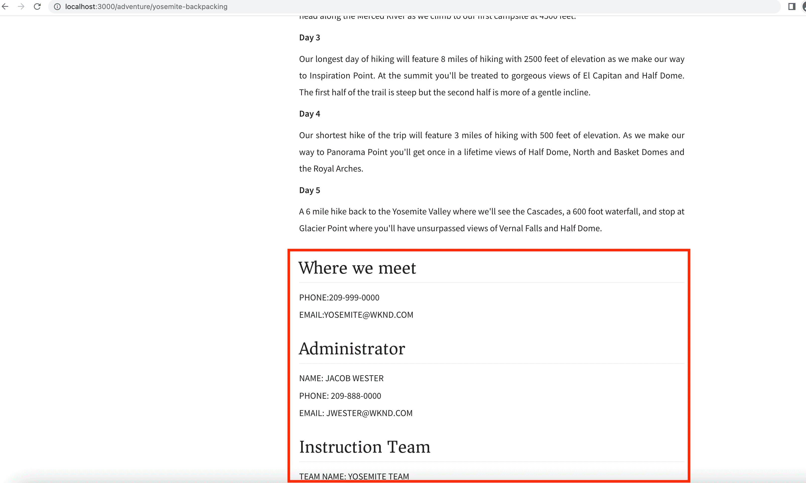

# Integración de aplicaciones cliente

En el capítulo anterior, creó y actualizó consultas persistentes mediante el Explorador de GraphiQL.

En este capítulo se explican los pasos para integrar las consultas persistentes con la aplicación cliente WKND (también conocida como aplicación WKND) mediante solicitudes de GET HTTP dentro de consultas existentes **Reaccionar componentes**. AEM También ofrece un desafío opcional para aplicar sus aprendizajes sin encabezado de la, experiencia en codificación para mejorar la aplicación del cliente WKND.

## Requisitos previos {#prerequisites}

Este documento forma parte de un tutorial de varias partes. Asegúrese de que los capítulos anteriores se hayan completado antes de continuar con este capítulo. AEM La aplicación cliente de WKND se conecta a servicio de publicación, por lo que es importante que **AEM publicó lo siguiente en el servicio de publicación de la**.

* Configuraciones de proyecto
* Extremos de GraphQL
* Modelos de fragmento de contenido
* Fragmentos de contenido creados
* Consultas persistentes de GraphQL

El _Las capturas de pantalla IDE de este capítulo provienen de [Código de Visual Studio](https://code.visualstudio.com/)_

### Capítulo 1-4 Paquete de soluciones (opcional) {#solution-package}

AEM Hay disponible un paquete de soluciones para instalar que completa los pasos de la interfaz de usuario de la interfaz de usuario de la aplicación para los capítulos 1 a 4. Este paquete es **no se necesita** si se han completado los capítulos anteriores.

1. Descargar [Advanced-GraphQL-Tutorial-Solution-Package-1.2.zip](/help/headless-tutorial/graphql/advanced-graphql/assets/tutorial-files/Advanced-GraphQL-Tutorial-Solution-Package-1.2.zip).
1. AEM En, navegue hasta **Herramientas** > **Implementación** > **Paquetes** para acceder a **Administrador de paquetes**.
1. Cargue e instale el paquete (archivo zip) descargado en el paso anterior.
1. AEM Replicar el paquete en el servicio Publicación de la

## Objetivos {#objectives}

En este tutorial, aprenderá a integrar las solicitudes de consultas persistentes en la aplicación WKND GraphQL React de ejemplo mediante [AEM Cliente sin encabezado para JavaScript](https://github.com/adobe/aem-headless-client-js).

## Clonar y ejecutar la aplicación cliente de ejemplo {#clone-client-app}

Para acelerar el tutorial, se proporciona una aplicación React JS de inicio.

1. Clonar el [adobe/aem-guides-wknd-graphql](https://github.com/adobe/aem-guides-wknd-graphql) repositorio:

   ```shell
   $ git clone git@github.com:adobe/aem-guides-wknd-graphql.git
   ```

1. Edite el `aem-guides-wknd-graphql/advanced-tutorial/.env.development` archivo y establecer `REACT_APP_HOST_URI` AEM para apuntar al servicio de publicación de target de la aplicación.

   Actualice el método de autenticación si se conecta a una instancia de autor.

   ```plain
   # Server namespace
   REACT_APP_HOST_URI=https://publish-pxx-eyy.adobeaemcloud.com
   
   #AUTH (Choose one method)
   # Authentication methods: 'service-token', 'dev-token', 'basic' or leave blank to use no authentication
   REACT_APP_AUTH_METHOD=
   
   # For Bearer auth, use DEV token (dev-token) from Cloud console
   REACT_APP_DEV_TOKEN=
   
   # For Service toke auth, provide path to service token file (download file from Cloud console)
   REACT_APP_SERVICE_TOKEN=auth/service-token.json
   
   # For Basic auth, use AEM ['user','pass'] pair (eg for Local AEM Author instance)
   REACT_APP_BASIC_AUTH_USER=
   REACT_APP_BASIC_AUTH_PASS=
   ```

   


   >[!NOTE]
   > 
   > Las instrucciones anteriores son conectar la aplicación React al **AEM Servicio de publicación de**, sin embargo, para conectarse a **AEM Servicio de autor de** AEM obtenga un token de desarrollo local para su entorno as a Cloud Service de target.
   >
   > También es posible conectar la aplicación a un [Instancia de autor local que utiliza el SDK de AEMaaCS](/help/headless-tutorial/graphql/quick-setup/local-sdk.md) usando autenticación básica.


1. Abra un terminal y ejecute los comandos:

   ```shell
   $ cd aem-guides-wknd-graphql/advanced-tutorial
   $ npm install
   $ npm start
   ```

1. Se debe cargar una nueva ventana del explorador en [http://localhost:3000](http://localhost:3000)


1. Tocar **Acampada** > **Mochilero Yosemite** para ver los detalles de la aventura de mochilero Yosemite.

   

1. Abra las herramientas para desarrolladores del explorador e inspeccione `XHR` solicitud

   

   Debería ver `GET` solicitudes al extremo de GraphQL con el nombre de configuración del proyecto (`wknd-shared`), nombre de consulta persistente (`adventure-by-slug`), nombre de variable (`slug`), valor (`yosemite-backpacking`) y codificaciones de caracteres especiales.

>[!IMPORTANT]
>
>    Si se está preguntando por qué se realiza la solicitud de API de GraphQL en contra del `http://localhost:3000` AEM y NO contra el dominio del servicio de publicación de la, revise [Bajo el capó](../multi-step/graphql-and-react-app.md#under-the-hood) en Tutorial básico.


## Revisar el código

En el [AEM Tutorial básico: Creación de una aplicación de React que utilice API de GraphQL de la](https://experienceleague.adobe.com/docs/experience-manager-learn/getting-started-with-aem-headless/graphql/multi-step/graphql-and-react-app.html#review-the-aemheadless-object) hemos revisado y mejorado algunos archivos clave para obtener experiencia práctica. Antes de mejorar la aplicación WKND, revise los archivos clave.

* [Revise el objeto AEMHeadless](https://experienceleague.adobe.com/docs/experience-manager-learn/getting-started-with-aem-headless/graphql/multi-step/graphql-and-react-app.html#review-the-aemheadless-object)

* [AEM Implemente para ejecutar consultas persistentes de GraphQL de la](https://experienceleague.adobe.com/docs/experience-manager-learn/getting-started-with-aem-headless/graphql/multi-step/graphql-and-react-app.html#implement-to-run-aem-graphql-persisted-queries)

### Revisar `Adventures` Componente React

La vista principal de la aplicación WKND React es la lista de todas las aventuras y puede filtrarlas según el tipo de actividad, como _Camping, Ciclismo_. Esta vista es representada por el `Adventures` componente. A continuación se muestran los principales detalles de implementación:

* El `src/components/Adventures.js` llamadas `useAllAdventures(adventureActivity)` gancho y aquí `adventureActivity` el argumento es el tipo de actividad.

* El `useAllAdventures(adventureActivity)` El vínculo se define en la variable `src/api/usePersistedQueries.js` archivo. Basado en `adventureActivity` , determina a qué consulta persistente llamar. Si no es un valor nulo, llama a `wknd-shared/adventures-by-activity`, si no, obtiene todas las aventuras disponibles `wknd-shared/adventures-all`.

* El gancho utiliza el principal `fetchPersistedQuery(..)` que delega la ejecución de la consulta a `AEMHeadless` mediante `aemHeadlessClient.js`.

* AEM El vínculo también solo devuelve los datos relevantes de la respuesta de GraphQL de la en `response.data?.adventureList?.items`, lo que permite `Adventures` Los componentes de la vista React no son agnósticos de las estructuras JSON principales.

* Una vez ejecutada correctamente la consulta, el `AdventureListItem(..)` función de procesamiento de `Adventures.js` añade un elemento HTML para mostrar el _Imagen, duración del viaje, precio y título_ información.

### Revisar `AdventureDetail` Componente React

El `AdventureDetail` El componente React procesa los detalles de la aventura. A continuación se muestran los principales detalles de implementación:

* El `src/components/AdventureDetail.js` llamadas `useAdventureBySlug(slug)` gancho y aquí `slug` El argumento es un parámetro de consulta.

* Como en el caso anterior, el `useAdventureBySlug(slug)` El vínculo se define en la variable `src/api/usePersistedQueries.js` archivo. Llama a `wknd-shared/adventure-by-slug` consulta persistente delegando a `AEMHeadless` mediante `aemHeadlessClient.js`.

* Una vez ejecutada correctamente la consulta, el `AdventureDetailRender(..)` función de procesamiento de `AdventureDetail.js` agrega un elemento HTML para mostrar los detalles de la aventura.


## Mejore el código

### Uso `adventure-details-by-slug` consulta persistente

En el capítulo anterior, creamos el `adventure-details-by-slug` consulta persistente, proporciona información de Aventura adicional como _ubicación, instructorTeam y administrador_. Vamos a reemplazar `adventure-by-slug` con `adventure-details-by-slug` consulta persistente para procesar esta información adicional.

1. Abra `src/api/usePersistedQueries.js`.

1. Busque la función `useAdventureBySlug()` y actualizar consulta como

```javascript
 ...

 // Call the AEM GraphQL persisted query named "wknd-shared/adventure-details-by-slug" with parameters
 response = await fetchPersistedQuery(
 "wknd-shared/adventure-details-by-slug",
 queryParameters
 );

 ...
```

### Mostrar información adicional

1. Para mostrar información adicional sobre la aventura, abra `src/components/AdventureDetail.js`

1. Busque la función `AdventureDetailRender(..)` y actualizar función de retorno como

   ```javascript
   ...
   
   return (<>
       <h1 className="adventure-detail-title">{title}</h1>
       <div className="adventure-detail-info">
   
           <LocationInfo {...location} />
   
           ...
   
           <Location {...location} />
   
           <Administrator {...administrator} />
   
           <InstructorTeam {...instructorTeam} />
   
       </div>
   </>); 
   
   ...
   ```

1. Defina también las funciones de procesamiento correspondientes:

   **LocationInfo**

   ```javascript
   function LocationInfo({name}) {
   
       if (!name) {
           return null;
       }
   
       return (
           <>
               <div className="adventure-detail-info-label">Location</div>
               <div className="adventure-detail-info-description">{name}</div>
           </>
       );
   
   }
   ```

   **Ubicación**

   ```javascript
   function Location({ contactInfo }) {
   
       if (!contactInfo) {
           return null;
       }
   
       return (
           <>
               <div className='adventure-detail-location'>
                   <h2>Where we meet</h2>
                   <hr />
                   <div className="adventure-detail-addtional-info">Phone:{contactInfo.phone}</div>
                   <div className="adventure-detail-addtional-info">Email:{contactInfo.email}</div>
               </div>
           </>);
   }
   ```

   **InstructorTeam**

   ```javascript
   function InstructorTeam({ _metadata }) {
   
       if (!_metadata) {
           return null;
       }
   
       return (
           <>
               <div className='adventure-detail-team'>
                   <h2>Instruction Team</h2>
                   <hr />
                   <div className="adventure-detail-addtional-info">Team Name: {_metadata.stringMetadata[0].value}</div>
               </div>
           </>);
   }
   ```

   **Administrador**

   ```javascript
   function Administrator({ fullName, contactInfo }) {
   
       if (!fullName || !contactInfo) {
           return null;
       }
   
       return (
           <>
               <div className='adventure-detail-administrator'>
                   <h2>Administrator</h2>
                   <hr />
                   <div className="adventure-detail-addtional-info">Name: {fullName}</div>
                   <div className="adventure-detail-addtional-info">Phone: {contactInfo.phone}</div>
                   <div className="adventure-detail-addtional-info">Email: {contactInfo.email}</div>
               </div>
           </>);
   }
   ```

### Definir estilos nuevos

1. Abrir `src/components/AdventureDetail.scss` y agregue las siguientes definiciones de clase

   ```CSS
   .adventure-detail-administrator,
   .adventure-detail-team,
   .adventure-detail-location {
   margin-top: 1em;
   width: 100%;
   float: right;
   }
   
   .adventure-detail-addtional-info {
   padding: 10px 0px 5px 0px;
   text-transform: uppercase;
   }
   ```

>[!TIP]
>
>Los archivos actualizados están disponibles en **AEM Guías de viaje de WKND - GraphQL** proyecto, consulte [Tutorial avanzado](https://github.com/adobe/aem-guides-wknd-graphql/tree/main/advanced-tutorial) sección.


Después de completar las mejoras anteriores, la aplicación WKND se ve así y las herramientas para desarrolladores del explorador muestran `adventure-details-by-slug` llamada de consulta persistente.



## Reto de mejora (opcional)

La vista principal de la aplicación WKND React le permite filtrar estas aventuras en función de tipos de actividades como _Camping, Ciclismo_. Sin embargo, el equipo empresarial de WKND quiere tener un extra _Ubicación_ capacidad de filtrado basada en. Los requisitos son

* En la vista principal de la aplicación WKND, en la esquina superior izquierda o derecha, añada _Ubicación_ icono de filtrado.
* Clic _Ubicación_ el icono de filtrado debe mostrar una lista de ubicaciones.
* Al hacer clic en una opción de ubicación de la lista, solo se deben mostrar las aventuras coincidentes.
* Si solo hay una aventura que coincida, se muestra la vista Detalles de la aventura.

## Felicitaciones

Felicitaciones. Ahora ha completado la integración y la implementación de las consultas persistentes en la aplicación WKND de ejemplo.
