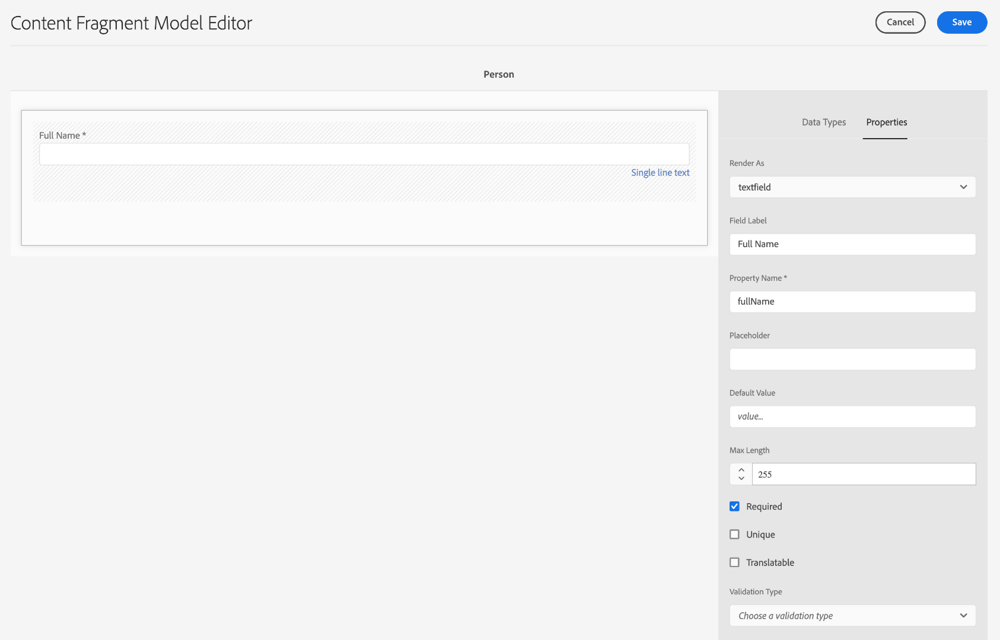
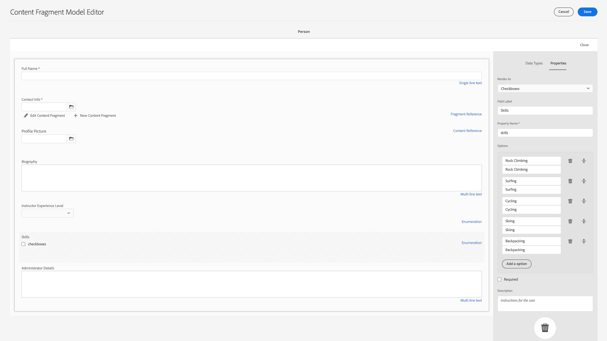

# Crear modelos de fragmento de contenido {#create-content-fragment-models}

En este capítulo se explican los pasos para crear cinco modelos de fragmento de contenido:

* **Información de contacto**
* **Dirección**
* **Person**
* **Ubicación**
* **Equipo**

Los modelos de fragmentos de contenido permiten definir relaciones entre tipos de contenido y mantener relaciones como esquemas. Utilice referencias de fragmento anidadas, varios tipos de datos de contenido y el tipo de ficha para la organización de contenido visual. Tipos de datos más avanzados, como marcadores de posición de pestañas, referencias de fragmento, objetos JSON y el tipo de datos de fecha y hora.

Este capítulo también explica cómo mejorar las reglas de validación de referencias de contenido como imágenes.

## Requisitos previos {#prerequisites}

Este es un tutorial avanzado. Antes de continuar con este capítulo, asegúrese de haber completado la [configuración rápida](../quick-setup/cloud-service.md). Asegúrese de leer también el capítulo anterior de la descripción general para obtener más información sobre la configuración del tutorial avanzado.

## Objetivos {#objectives}

* Crear modelos de fragmento de contenido.
* Agregue marcadores de posición de ficha, fecha y hora, objetos JSON, referencias de fragmento y referencias de contenido a los modelos.
* Agregue la validación a las referencias de contenido.

## Información general del modelo de fragmento de contenido {#content-fragment-model-overview}

El siguiente vídeo proporciona una breve introducción a los modelos de fragmento de contenido y cómo se utilizan en este tutorial.

>[!VIDEO](https://video.tv.adobe.com/v/340037/?quality=12&learn=on)

## Crear modelos de fragmento de contenido {#create-models}

Vamos a crear algunos modelos de fragmento de contenido para la aplicación WKND. Si necesita una introducción básica para crear modelos de fragmento de contenido, consulte el capítulo correspondiente en la [tutorial básico](../multi-step/content-fragment-models.md).

1. Vaya a **Herramientas** > **Recursos** > **Modelos de fragmento de contenido**.

   

2. Select **Sitio WKND** para ver la lista de modelos de fragmento de contenido existentes para el sitio.

### Modelo de información de contacto {#contact-info-model}

A continuación, cree un modelo que contenga la información de contacto de una persona o ubicación.

1. Select **Crear** en la esquina superior derecha.

2. Asigne al modelo un título &quot;Información de contacto&quot; y, a continuación, seleccione **Crear**. En el modal de éxito que aparece, seleccione **Apertura** para editar el modelo recién creado.

3. Para empezar, arrastre un **Texto de una sola línea** en el modelo. Denle un **Etiqueta de campo** de &quot;Teléfono&quot; en el **Propiedades** pestaña . El nombre de la propiedad se rellena automáticamente como `phone`. Seleccione la casilla de verificación para que el campo **Requerido**.

4. Vaya a la **Tipos de datos** y, a continuación, agregue otra **Texto de una sola línea** debajo del campo &quot;Teléfono&quot;. Denle un **Etiqueta de campo** de &quot;Correo electrónico&quot; y también establézcalo en **Requerido**.

Adobe Experience Manager incluye algunos métodos de validación integrados. Estos métodos de validación le permiten agregar reglas de control a campos específicos en los modelos de fragmento de contenido. En este caso, vamos a añadir una regla de validación para garantizar que los usuarios solo puedan introducir direcciones de correo electrónico válidas al rellenar este campo. En el **Tipo de validación** menú desplegable, seleccione **Correo electrónico**.

El modelo de fragmento de contenido completado debería tener este aspecto:

Una vez finalizado, seleccione **Guardar** para confirmar los cambios y cerrar el Editor del modelo de fragmento de contenido.

### Modelo de dirección {#address-model}

A continuación, cree un modelo para una dirección.

1. En el **Sitio WKND**, seleccione **Crear** desde la esquina superior derecha.

2. Introduzca un título para &quot;Dirección&quot; y, a continuación, seleccione **Crear**.

   i. En el modal de éxito que aparece, seleccione **Apertura** para editar el modelo recién creado.

3. Arrastre y suelte una **Texto de una sola línea** en el modelo y asígnele un **Etiqueta de campo** de &quot;Dirección de la calle&quot;. A continuación, el nombre de la propiedad se rellena como `streetAddress`. Seleccione el **Requerido** casilla de verificación.

4. Repita los pasos anteriores y agregue cuatro campos más de &quot;Texto de una sola línea&quot; al modelo. Utilice las etiquetas siguientes:

   * Ciudad
   * Estado
   * Código postal
   * País

5. Select **Guardar** para guardar los cambios en el modelo Address.

   El modelo de fragmento &quot;Dirección&quot; completado debería tener este aspecto:
   

### Modelo de persona {#person-model}

A continuación, cree un modelo que contenga información sobre una persona.

1. En la esquina superior derecha, seleccione **Crear**.

2. Asigne al modelo un título de &quot;Persona&quot; y, a continuación, seleccione **Crear**. En el modal de éxito que aparece, seleccione **Apertura** para editar el modelo recién creado.

3. Para empezar, arrastre un **Texto de una sola línea** en el modelo. Denle un **Etiqueta de campo** de &quot;Nombre completo&quot;. El nombre de la propiedad se rellena automáticamente como `fullName`. Seleccione la casilla de verificación para que el campo **Requerido**.

   

4. Los modelos de fragmento de contenido se pueden consultar en otros modelos. Vaya a la **Tipos de datos** a continuación, arrastre y suelte la **Referencia de fragmento** y asígnele la etiqueta &quot;Información de contacto&quot;.

5. En el **Propiedades** en la **Modelos de fragmento de contenido permitidos** , seleccione el icono de carpeta y, a continuación, elija la **Información de contacto** modelo de fragmento creado anteriormente.

6. Agregue un **Referencia de contenido** y asígnele un **Etiqueta de campo** de &quot;Imagen de perfil&quot;. Seleccione el icono de carpeta en **Ruta raíz** para abrir el modal de selección de rutas. Seleccione una ruta raíz **contenido** > **Recursos** y, a continuación, seleccione la casilla de verificación **Sitio WKND**. Utilice la variable **Select** en la parte superior derecha para guardar la ruta. La ruta de texto final debe ser `/content/dam/wknd`.

   

7. En **Aceptar solo los tipos de contenido especificados**, seleccione &quot;Imagen&quot;.

   

8. Para limitar el tamaño y las dimensiones del archivo de imagen, veamos algunas opciones de validación del campo de referencia de contenido.

   En **Aceptar solo el tamaño de archivo especificado**, seleccione &quot;Menor o igual que&quot; y a continuación aparecerán campos adicionales.
   

9. Para **Max**, introduzca &quot;5&quot; y para **Seleccionar unidad**, seleccione &quot;Megabytes (MB)&quot;. Esta validación solo permite seleccionar imágenes que tengan el tamaño especificado.

10. En **Aceptar solo el ancho de imagen especificado**, seleccione &quot;Ancho máximo&quot;. En el **Máx. (píxeles)** que aparece, escriba &quot;500&quot;. Seleccione las mismas opciones para **Aceptar solo una altura de imagen especificada**.

    Estas validaciones garantizan que las imágenes añadidas no superen los valores especificados. Las reglas de validación deben tener este aspecto:
    

11. Agregue un **Texto de varias líneas** y asígnele un **Etiqueta de campo** de &quot;Biografía&quot;. Deje el **Tipo predeterminado** como opción predeterminada &quot;Texto enriquecido&quot;.

    

12. Vaya a la **Tipos de datos** y, a continuación, arrastre una **Enumeración** debajo de &quot;Imagen de perfil&quot;. En lugar del valor predeterminado **Representar como** , seleccione **Lista desplegable**. Introduzca una selección de opciones de nivel de experiencia del instructor, como Experto, Avanzado e Intermedio.

13. A continuación, arrastre otro **Enumeración** en &quot;Nivel de experiencia del instructor&quot; y seleccione &quot;casillas de verificación&quot; en **Representar como** . Introduce diferentes habilidades, como escalada de rock, surf, ciclismo, esquí y moto acuática. La etiqueta de opción y el valor de opción deben coincidir como se muestra a continuación:

    

14. Por último, cree una etiqueta de campo &quot;Detalles del administrador&quot; utilizando una **Texto multilínea** campo .

Select **Guardar** para confirmar los cambios y cerrar el Editor del modelo de fragmento de contenido.

### Modelo de ubicación {#location-model}

El siguiente modelo de fragmento de contenido describe una ubicación física. Este modelo utiliza marcadores de posición de tabulación. Los marcadores de posición de pestañas ayudan a organizar los tipos de datos en el editor de modelos y el contenido en el editor de fragmentos, respectivamente, mediante la categorización del contenido. Cada marcador de posición crea una ficha, similar a una ficha de un navegador de Internet, en el editor de fragmentos de contenido. El modelo Ubicación debe tener dos pestañas: Detalles de ubicación y dirección de ubicación.

1. Como anteriormente, seleccione **Crear** para crear otro modelo de fragmento de contenido. Para el Título del modelo, introduzca &quot;Ubicación&quot;. Select **Crear** seguido de **Apertura** en el modal de éxito que aparece.

2. Agregue un **Marcador de posición de tabulación** al modelo y etiquete &quot;Detalles de ubicación&quot;.

3. Arrastre y suelte una **Texto de una sola línea** y etiquete &quot;Nombre&quot;. Debajo de esta etiqueta de campo, añada un **texto multilínea** y etiquete &quot;Descripción&quot;.

4. A continuación, agregue una **Referencia de fragmento** y etiquete &quot;Información de contacto&quot;. En la ficha propiedades, en **Modelos de fragmento de contenido permitidos**, seleccione **Icono de carpeta** y elija el modelo de fragmento &quot;Información de contacto&quot; creado anteriormente.

5. Agregue un **Referencia de contenido** en &quot;Información de contacto&quot;. Etiquetarla como &quot;Imagen de ubicación&quot;. La variable **Ruta raíz** debe `/content/dam/wknd.` En **Aceptar solo los tipos de contenido especificados**, seleccione &quot;Imagen&quot;.

6. Añadamos también un **Objeto JSON** en la imagen de ubicación. Como este tipo de datos es flexible, se puede utilizar para mostrar cualquier dato que desee incluir en el contenido. En este caso, el objeto JSON se utiliza para mostrar información sobre el tiempo. Etiqueta el objeto JSON &quot;Tiempo por temporada&quot;. En el **Propiedades** , agregue **Descripción** por lo tanto, el usuario tiene claro qué datos deben introducirse aquí: &quot;Datos JSON sobre la ubicación del evento por temporada (primavera, verano, otoño, invierno).&quot;

   

7. Para crear la ficha Dirección, agregue una **Marcador de posición de tabulación** al modelo y etiquete &quot;Dirección de ubicación&quot;.

8. Arrastre y suelte una **Referencia de fragmento** y, en la pestaña propiedades, en **Modelos de fragmento de contenido permitidos**, seleccione **Dirección** modelo.

9. Select **Guardar** para confirmar los cambios y cerrar el Editor del modelo de fragmento de contenido. El modelo de ubicación completo debe aparecer de la siguiente manera:

   

### Modelo de equipo {#team-model}

Finalmente, cree un modelo que describa un equipo de personas.

1. En el **Sitio WKND** página, seleccione **Crear** para crear otro modelo de fragmento de contenido. Para el Título del modelo, escriba &quot;Equipo&quot;. Como anteriormente, seleccione **Crear** seguido de **Apertura** en el modal de éxito que aparece.

2. Agregue un **Texto de varias líneas** al formulario. En **Etiqueta de campo**, escriba &quot;Descripción&quot;.

3. Agregue un **Fecha y hora** al modelo y etiquete &quot;Fecha de fundación del equipo&quot;. En este caso, mantenga el valor predeterminado **Tipo** está configurada en &quot;Fecha&quot;, pero tenga en cuenta que también es posible utilizar &quot;Fecha y hora&quot; o &quot;Hora&quot;.

   

4. Vaya a la **Tipos de datos** pestaña . Debajo de la &quot;Fecha de base del equipo&quot;, agregue una **Referencia de fragmento**. En el **Representar como** , seleccione &quot;multifield&quot;. Para **Etiqueta de campo**, escriba &quot;Miembros del equipo&quot;. Este campo se vincula al modelo Persona creado anteriormente. Dado que el tipo de datos es un campo múltiple, se pueden agregar varios fragmentos de persona, lo que permite crear un equipo de personas.

   

5. En **Modelos de fragmento de contenido permitidos**, utilice el icono de carpeta para abrir el modal Seleccionar ruta y, a continuación, seleccione la opción **Persona** modelo. Utilice la variable **Select** para guardar la ruta.

   

6. Select **Guardar** para confirmar los cambios y cerrar el Editor del modelo de fragmento de contenido.

## Agregar referencias de fragmento al modelo de aventura {#fragment-references}

De forma similar a como el modelo Team tiene una referencia de fragmento al modelo Person, se debe hacer referencia a los modelos Team y Location desde el modelo Adventure para mostrar estos nuevos modelos en la aplicación WKND.

1. En el **Sitio WKND** seleccione **Aventura** modelo y, a continuación, seleccione **Editar** desde la barra de navegación superior.

   

2. En la parte inferior del formulario, debajo de &quot;Qué traer&quot;, añada una **Referencia de fragmento** campo . Escriba un **Etiqueta de campo** de &quot;Ubicación&quot;. En **Modelos de fragmento de contenido permitidos**, seleccione **Ubicación** modelo.

   

3. Añadir una más **Referencia de fragmento** y etiquete &quot;Equipo instructor&quot;. En **Modelos de fragmento de contenido permitidos**, seleccione **Equipo** modelo.

   

4. Agregue otro **Referencia de fragmento** y etiquete &quot;Administrator&quot;.

   

5. Select **Guardar** para confirmar los cambios y cerrar el Editor del modelo de fragmento de contenido.

## Prácticas recomendadas   {#best-practices}

Existen algunas prácticas recomendadas relacionadas con la creación de modelos de fragmento de contenido:

* Cree modelos que se asignen a componentes de experiencia de usuario. Por ejemplo, la aplicación WKND tiene modelos de fragmento de contenido para aventuras, artículos y ubicación. También puede agregar encabezados, promociones o exenciones de responsabilidad. Cada uno de estos ejemplos crea un componente de experiencia de usuario específico.

* Cree tantos modelos como sea posible. Limitar el número de modelos le permite maximizar la reutilización y simplificar la administración de contenido.

* Anide los modelos de fragmento de contenido tan profundamente como sea necesario pero solo cuando sea necesario. Recuerde que el anidado se realiza con referencias de fragmento o referencias de contenido. Considere un máximo de cinco niveles de anidación.

## Felicitaciones! {#congratulations}

Felicitaciones! Ahora ha añadido fichas, utilizado los tipos de datos de fecha y hora y de objeto JSON, y ha aprendido más sobre referencias de fragmento y contenido. También ha añadido reglas de validación de referencia de contenido.

## Siguientes pasos {#next-steps}

El siguiente capítulo de esta serie abarcará [creación de fragmentos de contenido](/help/headless-tutorial/graphql/advanced-graphql/author-content-fragments.md) de los modelos que ha creado en este capítulo. Obtenga información sobre cómo utilizar los tipos de datos introducidos en este capítulo y cree directivas de carpeta para limitar los modelos de fragmento de contenido que se pueden crear en una carpeta de recursos.

Aunque es opcional para este tutorial, asegúrese de publicar todo el contenido en situaciones de producción en el mundo real. Para obtener una revisión de los entornos Autor y Publicación en AEM, consulte la
[AEM serie de vídeo sin encabezado y GraphQL](/help/headless-tutorial/graphql/video-series/author-publish-architecture.md).
