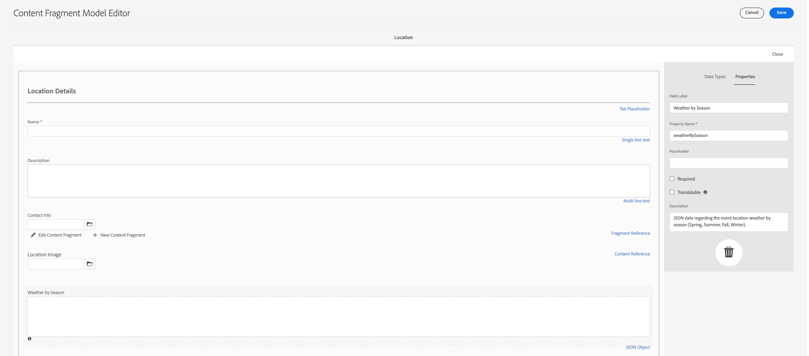
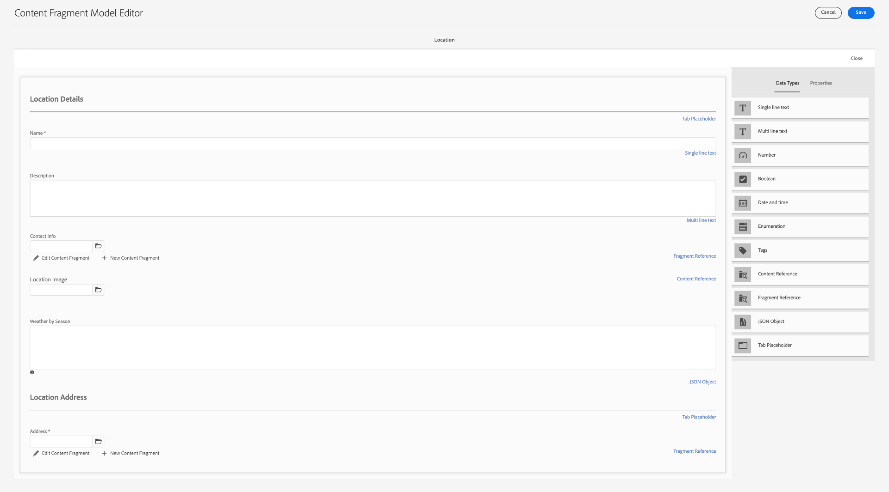
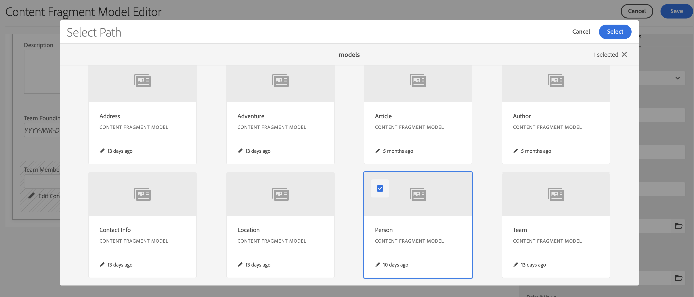

# Crear los modelos de fragmentos de contenido {#create-content-fragment-models}

Este capítulo explica los pasos para crear cinco modelos de fragmentos de contenido:

* **Información de contacto**
* **Dirección**
* **Persona**
* **Ubicación**
* **Equipo**

Los modelos de fragmento de contenido permiten definir relaciones entre tipos de contenido y mantener relaciones como esquemas. Utilice referencias de fragmento anidadas, varios tipos de datos de contenido y el tipo de pestaña para la organización de contenido visual. Tipos de datos más avanzados como marcadores de posición de pestañas, referencias de fragmento, objetos JSON y el tipo de datos de fecha y hora.

Este capítulo también explica cómo mejorar las reglas de validación para referencias de contenido como imágenes.

## Requisitos previos {#prerequisites}

Este es un tutorial avanzado. Antes de continuar con este capítulo, asegúrese de haber completado la [configuración rápida](../quick-setup/cloud-service.md). Asegúrese de haber leído también el anterior [descripción general](../overview.md) para obtener más información sobre la configuración del tutorial avanzado.

## Objetivos {#objectives}

* Crear modelos de fragmentos de contenido.
* Agregue marcadores de posición de pestaña, fecha y hora, objetos JSON, referencias de fragmento y referencias de contenido a los modelos.
* Agregar validación a referencias de contenido.

## Información general del modelo de fragmento de contenido {#content-fragment-model-overview}

El siguiente vídeo proporciona una breve introducción a los modelos de fragmentos de contenido y a cómo se utilizan en este tutorial.

>[!VIDEO](https://video.tv.adobe.com/v/340037?quality=12&learn=on)

## Crear los modelos de fragmentos de contenido {#create-models}

Vamos a crear algunos modelos de fragmentos de contenido para la aplicación WKND. Si necesita una introducción básica a la creación de modelos de fragmentos de contenido, consulte el capítulo correspondiente en la [tutorial básico](../multi-step/content-fragment-models.md).

1. Vaya a **Herramientas** > **General**  >**Modelos de fragmento de contenido**.

   

1. Seleccionar **WKND compartido** para ver la lista de modelos de fragmentos de contenido existentes para el sitio.

### Modelo de información de contacto {#contact-info-model}

A continuación, cree un modelo que contenga la información de contacto de una persona o ubicación.

1. Seleccionar **Crear** en la esquina superior derecha.

1. Asigne al modelo un título &quot;Información de contacto&quot; y, a continuación, seleccione **Crear**. En el modal de éxito que aparece, seleccione **Abrir** para editar el modelo recién creado.

1. Para empezar, arrastre un **Texto de línea única** en el modelo. Dale una. **Etiqueta de campo** de &quot;Teléfono&quot; en **Propiedades** pestaña. El nombre de la propiedad se rellena automáticamente como `phone`. Seleccione la casilla de verificación para crear el campo **Requerido**.

1. Vaya a **Tipos de datos** y, a continuación, agregue otra **Texto de línea única** debajo del campo &quot;Teléfono&quot;. Dale una. **Etiqueta de campo** de &quot;Correo electrónico&quot; y configúrelo también en **Requerido**.

Adobe Experience Manager incluye algunos métodos de validación. Estos métodos de validación le permiten agregar reglas de gobernanza a campos específicos en los modelos de fragmentos de contenido. En este caso, vamos a agregar una regla de validación para garantizar que los usuarios solo puedan introducir direcciones de correo electrónico válidas al rellenar este campo. En el **Tipo de validación** menú desplegable, seleccione **Correo electrónico**.

El modelo de fragmento de contenido completado debe tener este aspecto:

Una vez finalizado, seleccione **Guardar** para confirmar los cambios y cerrar el Editor del modelo de fragmentos de contenido.

### Modelo de dirección {#address-model}

A continuación, cree un modelo para una dirección.

1. Desde el **WKND compartido**, seleccione **Crear** desde la esquina superior derecha.

1. Escriba un título de &quot;Dirección&quot; y seleccione **Crear**. En el modal de éxito que aparece, seleccione **Abrir** para editar el modelo recién creado.

1. Arrastrar y soltar una **Texto de línea única** Campo en el modelo y asígnele un **Etiqueta de campo** de &quot;Dirección&quot;. El nombre de la propiedad se rellena como `streetAddress`. Seleccione el **Requerido** casilla de verificación

1. Repita los pasos anteriores y agregue cuatro campos más de &quot;Texto de una sola línea&quot; al modelo. Utilice las siguientes etiquetas:

   * Ciudad
   * Estado
   * Código ZIP
   * País

1. Seleccionar **Guardar** para guardar los cambios en el modelo Dirección.

   El modelo de fragmento &quot;Dirección&quot; completado debe tener este aspecto:
   

### Modelo de persona {#person-model}

A continuación, cree un modelo que contenga información sobre una persona.

1. En la esquina superior derecha, seleccione **Crear**.

1. Asigne al modelo un título de &quot;Persona&quot; y, a continuación, seleccione **Crear**. En el modal de éxito que aparece, seleccione **Abrir** para editar el modelo recién creado.

1. Para empezar, arrastre un **Texto de línea única** en el modelo. Dale una. **Etiqueta de campo** de &quot;Nombre completo&quot;. El nombre de la propiedad se rellena automáticamente como `fullName`. Seleccione la casilla de verificación para crear el campo **Requerido**.

   

1. Se puede hacer referencia a los modelos de fragmentos de contenido en otros modelos. Vaya a **Tipos de datos** , luego arrastre y suelte la pestaña **Referencia a fragmento** y asígnele la etiqueta &quot;Información de contacto&quot;.

1. En el **Propiedades** , en la pestaña **Modelos permitidos de fragmento de contenido** , seleccione el icono de carpeta y, a continuación, elija el campo **Información de contacto** modelo de fragmento creado anteriormente.

1. Añadir un **Referencia de contenido** y dale un **Etiqueta de campo** de &quot;Imagen del perfil&quot;. Seleccione el icono de la carpeta en **Ruta raíz** para abrir el modal de selección de ruta. Seleccione una ruta de acceso raíz seleccionando **content** > **Assets**, seleccionando la casilla de verificación de **WKND compartido**. Utilice el **Seleccionar** en la parte superior derecha para guardar la ruta. La ruta de texto final debe ser `/content/dam/wknd-shared`.

   

1. En **Aceptar solo los tipos de contenido especificados**, seleccione &quot;Imagen&quot;.

   

1. Para limitar el tamaño y las dimensiones del archivo de imagen, veamos algunas opciones de validación para el campo de referencia de contenido.

   En **Aceptar solo el tamaño de archivo especificado**, seleccione &quot;Menor o igual que&quot; y a continuación aparecen campos adicionales.
   

1. Para **Max**, introduzca &quot;5&quot; y, para **Seleccionar unidad**, seleccione &quot;Megabytes (MB)&quot;. Esta validación solo permite elegir imágenes con el tamaño especificado.

1. En **Aceptar solo el ancho de imagen especificado**, seleccione &quot;Ancho máximo&quot;. En el **Máx. (píxeles)** que aparece, introduzca &quot;10000&quot;. Seleccione las mismas opciones para **Aceptar solo una altura de imagen especificada**.

   Estas validaciones garantizan que las imágenes añadidas no superen los valores especificados. Las reglas de validación deberían tener este aspecto:

   

1. Añadir un **Texto de varias líneas** y dale un **Etiqueta de campo** de &quot;Biografía&quot;. Deje el **Tipo predeterminado** como la opción predeterminada &quot;Texto enriquecido&quot;.

   

1. Vaya a **Tipos de datos** , y arrastre una **Enumeración** campo debajo de &quot;Biografía&quot;. En lugar del valor predeterminado **Procesar como** , seleccione **Desplegable** y dale un **Etiqueta de campo** de Nivel de experiencia del instructor. Introduzca una selección de opciones de nivel de experiencia del instructor, como _Experto, avanzado, intermedio_.

1. A continuación, arrastre otro **Enumeración** en &quot;Nivel de experiencia del instructor&quot; y elija &quot;casillas de verificación&quot; en la **Procesar como** opción. Dale una. **Etiqueta de campo** de &quot;Aptitudes&quot;. Introduzca diferentes habilidades, como escalada en roca, surf, ciclismo, esquí y mochilero. La etiqueta de opción y el valor de opción deben coincidir de la siguiente manera:

   

1. Por último, cree una etiqueta de campo &quot;Detalles del administrador&quot; con un **Texto de varias líneas** field.

Seleccionar **Guardar** para confirmar los cambios y cerrar el Editor del modelo de fragmentos de contenido.

### Modelo de ubicación {#location-model}

El siguiente modelo de fragmento de contenido describe una ubicación física. Este modelo utiliza marcadores de posición de tabulación. Los marcadores de posición de pestañas ayudan a organizar los tipos de datos en el editor de modelos y el contenido en el editor de fragmentos respectivamente, mediante la categorización del contenido. Cada marcador de posición crea una pestaña, similar a una pestaña de un explorador de Internet, en el editor de fragmentos de contenido. El modelo Ubicación debe tener dos pestañas: Detalles de ubicación y Dirección de ubicación.

1. Como en el caso anterior, seleccione **Crear** para crear otro modelo de fragmento de contenido. Para el Título del modelo, introduzca &quot;Ubicación&quot;. Seleccionar **Crear** seguido de **Abrir** en el modal de éxito que aparece.

1. Añadir un **Marcador de ficha** al modelo y etiquete &quot;Detalles de ubicación&quot;.

1. Arrastre y suelte una **Texto de línea única** y etiquete &quot;Nombre&quot;. Debajo de esta etiqueta de campo, añada un **texto multilínea** y etiquete &quot;Descripción&quot;.

1. A continuación, añada un **Referencia a fragmento** y etiquete &quot;Información de contacto&quot;. En la pestaña Propiedades, en **Modelos permitidos de fragmento de contenido**, seleccione la **Icono de carpeta** y elija el modelo de fragmento &quot;Información de contacto&quot; creado anteriormente.

1. Añadir un **Referencia de contenido** en &quot;Información de contacto&quot;. Lámela &quot;Imagen de ubicación&quot;. El **Ruta raíz** debería ser `/content/dam/wknd-shared.` En **Aceptar solo los tipos de contenido especificados**, seleccione &quot;Imagen&quot;.

1. Vamos a añadir también una **Objeto JSON** en la &quot;Imagen de ubicación&quot;. Como este tipo de datos es flexible, se puede utilizar para mostrar cualquier dato que desee incluir en el contenido. En este caso, el objeto JSON se utiliza para mostrar información sobre el tiempo. Etiquete el objeto JSON &quot;Tiempo por temporada&quot;. En el **Propiedades** pestaña, añada una **Descripción** Por lo tanto, el usuario tiene claro qué datos deben introducirse aquí: &quot;Datos JSON con respecto a la ubicación del evento y el clima por temporada (primavera, verano, otoño, invierno)&quot;.

   

1. Para crear la pestaña Dirección de ubicación, agregue una **Marcador de ficha** al modelo y etiquete &quot;Dirección de ubicación&quot;.

1. Arrastrar y soltar una **Referencia a fragmento** y en la pestaña Propiedades, etiquete como &quot;Dirección&quot; y debajo de **Modelos permitidos de fragmento de contenido**, seleccione la **Dirección** modelo.

1. Seleccionar **Guardar** para confirmar los cambios y cerrar el Editor del modelo de fragmentos de contenido. El modelo de ubicación completado debe aparecer de la siguiente manera:

   

### Modelo de equipo {#team-model}

Finalmente, cree un modelo que describa un equipo de personas.

1. Desde el **WKND compartido** página, seleccione **Crear** para crear otro modelo de fragmento de contenido. En Título de modelo, escriba &quot;Equipo&quot;. Como en el caso anterior, seleccione **Crear** seguido de **Abrir** en el modal de éxito que aparece.

1. Añadir un **Texto de varias líneas** al formulario. En **Etiqueta de campo**, introduzca &quot;Description&quot;.

1. Añadir un **Fecha y hora** al modelo y etiquete &quot;Fecha de fundación del equipo&quot;. En este caso, mantenga el valor predeterminado **Tipo** se configura como &quot;Fecha&quot;, pero tenga en cuenta que también es posible utilizar &quot;Fecha y hora&quot; u &quot;Hora&quot;.

   

1. Vaya a **Tipos de datos** pestaña. Debajo de &quot;Fecha de fundación del equipo&quot;, añada un **Referencia a fragmento**. En el **Procesar como** , seleccione &quot;multicampo&quot;. Para **Etiqueta de campo**, introduzca &quot;Miembros del equipo&quot;. Este campo vincula a la _Persona_ modelo creado anteriormente. Dado que el tipo de datos es de varios campos, se pueden añadir varios fragmentos de persona, lo que permite crear un equipo de personas.

   

1. En **Modelos permitidos de fragmento de contenido**, utilice el icono de carpeta para abrir el modal Select Path y, a continuación, seleccione la **Persona** modelo. Utilice el **Seleccionar** para guardar la ruta.

   

1. Seleccionar **Guardar** para confirmar los cambios y cerrar el Editor del modelo de fragmentos de contenido.

## Añadir referencias de fragmento al modelo de aventura {#fragment-references}

De forma similar a como el modelo de equipo tiene una referencia de fragmento al modelo de persona, se debe hacer referencia a los modelos de equipo y ubicación desde el modelo de aventura para mostrar estos nuevos modelos en la aplicación WKND.

1. Desde el **WKND compartido** , seleccione la **Aventura** modelo, luego seleccione **Editar** desde la barra de navegación superior.

   

1. En la parte inferior del formulario, debajo de Qué llevar, agregue un **Referencia a fragmento** field. Introduzca una **Etiqueta de campo** de &quot;Ubicación&quot;. En **Modelos permitidos de fragmento de contenido**, seleccione la **Ubicación** modelo.

   

1. Agregar uno más **Referencia a fragmento** y etiquete &quot;Equipo del instructor&quot;. En **Modelos permitidos de fragmento de contenido**, seleccione la **Equipo** modelo.

   

1. Añadir otro **Referencia a fragmento** y etiquete &quot;Administrator&quot;.

   

1. Seleccionar **Guardar** para confirmar los cambios y cerrar el Editor del modelo de fragmentos de contenido.

## Prácticas recomendadas {#best-practices}

Existen algunas prácticas recomendadas relacionadas con la creación de modelos de fragmentos de contenido:

* Cree modelos que se asignen a componentes de UX. Por ejemplo, la aplicación WKND tiene modelos de fragmentos de contenido para aventuras, artículos y ubicaciones. También puede agregar encabezados, promociones o exenciones de responsabilidad legal. Cada uno de estos ejemplos constituye un componente de experiencia de usuario específico.

* Cree el menor número posible de modelos. Limitar el número de modelos le permite maximizar la reutilización y simplificar la administración de contenido.

* Anide los modelos de fragmentos de contenido lo más profundamente posible, pero solo según sea necesario. Recuerde que el anidamiento se realiza con referencias de fragmento o referencias de contenido. Considere un máximo de cinco niveles de anidación.

## Enhorabuena. {#congratulations}

Felicitaciones. Ahora ha agregado pestañas, utilizado los tipos de datos de objeto JSON y fecha y hora, y ha aprendido más acerca de las referencias de fragmentos y contenido. También ha agregado reglas de validación de referencia de contenido.

## Pasos siguientes {#next-steps}

El siguiente capítulo de esta serie abarcará [creación de fragmentos de contenido](/help/headless-tutorial/graphql/advanced-graphql/author-content-fragments.md) de los modelos creados en este capítulo. Aprenda a utilizar los tipos de datos introducidos en este capítulo y a crear políticas de carpeta para limitar qué modelos de fragmentos de contenido se pueden crear en una carpeta de recursos.

Aunque es opcional para este tutorial, asegúrese de publicar todo el contenido en situaciones de producción reales. AEM Para obtener una revisión de los entornos de creación y publicación de los entornos de publicación en la, consulte la
[AEM Serie de vídeos sin encabezado y GraphQL](/help/headless-tutorial/graphql/video-series/author-publish-architecture.md).
