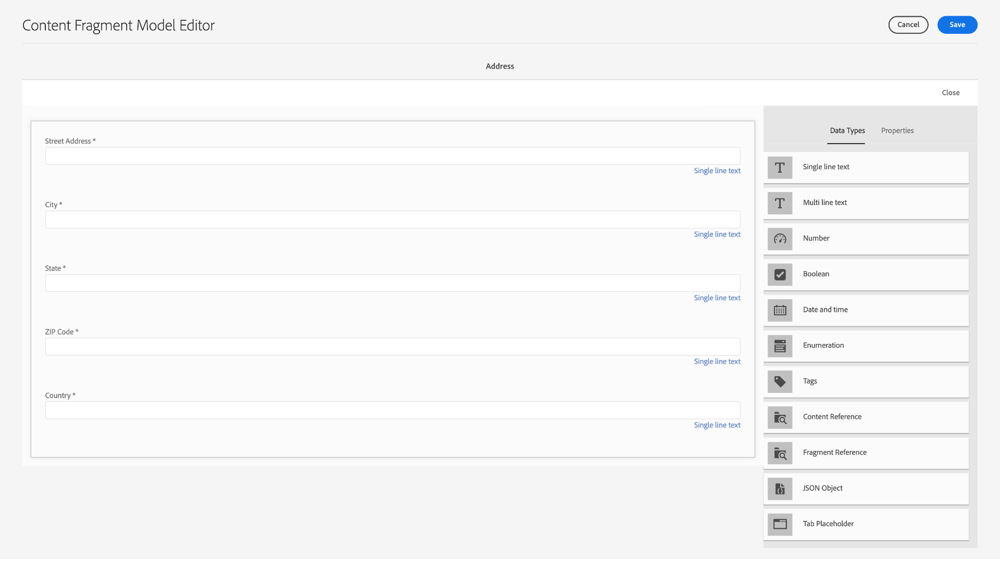
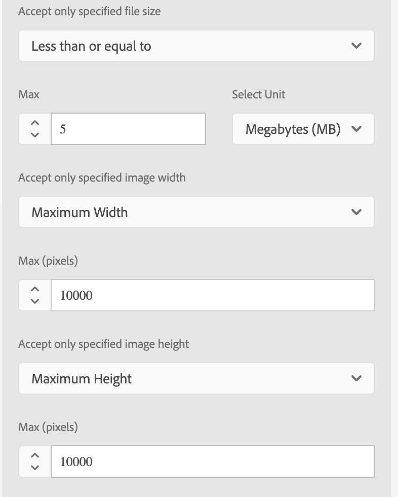

# Crear los modelos de fragmentos de contenido {#create-content-fragment-models}

Este capítulo explica los pasos para crear cinco modelos de fragmentos de contenido:

* **Información de contacto**
* **Dirección**
* **Persona**
* **Ubicación**
* **Equipo**

Los modelos de fragmento de contenido permiten definir relaciones entre tipos de contenido y mantener relaciones como esquemas. Utilice referencias de fragmento anidadas, varios tipos de datos de contenido y el tipo de pestaña para la organización de contenido visual. Tipos de datos más avanzados como marcadores de posición de pestañas, referencias de fragmento, objetos JSON y el tipo de datos de fecha y hora.

Este capítulo también explica cómo mejorar las reglas de validación para referencias de contenido como imágenes.

## Requisitos previos {#prerequisites}

Este es un tutorial avanzado. Antes de continuar con este capítulo, asegúrese de completar la [configuración rápida](../quick-setup/cloud-service.md). Asegúrese de leer también el capítulo [descripción general](../overview.md) anterior para obtener más información sobre la configuración del tutorial avanzado.

## Objetivos {#objectives}

* Crear modelos de fragmentos de contenido.
* Agregue marcadores de posición de pestaña, fecha y hora, objetos JSON, referencias de fragmento y referencias de contenido a los modelos.
* Agregar validación a referencias de contenido.

## Información general del modelo de fragmento de contenido {#content-fragment-model-overview}

El siguiente vídeo proporciona una breve introducción a los modelos de fragmentos de contenido y a cómo se utilizan en este tutorial.

>[!VIDEO](https://video.tv.adobe.com/v/340037?quality=12&learn=on)

## Crear los modelos de fragmentos de contenido {#create-models}

Vamos a crear algunos modelos de fragmentos de contenido para la aplicación WKND. Si necesita una introducción básica para crear modelos de fragmentos de contenido, consulte el capítulo correspondiente en el [tutorial básico](../multi-step/content-fragment-models.md).

1. Vaya a **Herramientas** > **General**  >**Modelos de fragmento de contenido**.

   

1. Seleccione **WKND compartido** para ver la lista de modelos de fragmentos de contenido existentes para el sitio.

### Modelo de información de contacto {#contact-info-model}

A continuación, cree un modelo que contenga la información de contacto de una persona o ubicación.

1. Seleccione **Crear** en la esquina superior derecha.

1. Asigne al modelo el título &quot;Información de contacto&quot; y, a continuación, seleccione **Crear**. En el modal de éxito que aparece, selecciona **Abrir** para editar el modelo recién creado.

1. Comience arrastrando un campo **Texto de una sola línea** al modelo. Asígnele una **Etiqueta de campo** de &quot;Teléfono&quot; en la ficha **Propiedades**. El nombre de propiedad se completa automáticamente como `phone`. Seleccione la casilla de verificación para hacer que el campo **sea obligatorio**.

1. Vaya a la pestaña **Tipos de datos** y luego agregue otro campo de **Texto de una sola línea** debajo del campo &quot;Teléfono&quot;. Asígnele una **etiqueta de campo** de &quot;correo electrónico&quot; y configúrela también como **obligatorio**.

Adobe Experience Manager incluye algunos métodos de validación. Estos métodos de validación le permiten agregar reglas de gobernanza a campos específicos en los modelos de fragmentos de contenido. En este caso, vamos a agregar una regla de validación para garantizar que los usuarios solo puedan introducir direcciones de correo electrónico válidas al rellenar este campo. En el menú desplegable **Tipo de validación**, seleccione **Correo electrónico**.

El modelo de fragmento de contenido completado debe tener este aspecto:

Una vez finalizado, seleccione **Guardar** para confirmar los cambios y cerrar el Editor del modelo de fragmentos de contenido.

### Modelo de dirección {#address-model}

A continuación, cree un modelo para una dirección.

1. En **WKND compartido**, seleccione **Crear** en la esquina superior derecha.

1. Escriba el título &quot;Dirección&quot; y seleccione **Crear**. En el modal de éxito que aparece, selecciona **Abrir** para editar el modelo recién creado.

1. Arrastre y suelte un campo de **Texto de una sola línea** en el modelo y asígnele una **Etiqueta de campo** de &quot;Dirección&quot;. El nombre de propiedad se rellena como `streetAddress`. Seleccione la casilla de verificación **Requerido**.

1. Repita los pasos anteriores y agregue cuatro campos más de &quot;Texto de una sola línea&quot; al modelo. Utilice las siguientes etiquetas:

   * Ciudad
   * Estado
   * Código ZIP
   * País

1. Seleccione **Guardar** para guardar los cambios en el modelo de direcciones.

   El modelo de fragmento &quot;Dirección&quot; completado debe tener este aspecto:
   

### Modelo de persona {#person-model}

A continuación, cree un modelo que contenga información sobre una persona.

1. En la esquina superior derecha, seleccione **Crear**.

1. Asigne al modelo el título &quot;Persona&quot; y, a continuación, seleccione **Crear**. En el modal de éxito que aparece, selecciona **Abrir** para editar el modelo recién creado.

1. Comience arrastrando un campo **Texto de una sola línea** al modelo. Asígnele una **etiqueta de campo** con el nombre completo. El nombre de propiedad se completa automáticamente como `fullName`. Seleccione la casilla de verificación para hacer que el campo **sea obligatorio**.

   

1. Se puede hacer referencia a los modelos de fragmentos de contenido en otros modelos. Vaya a la pestaña **Tipos de datos**, luego arrastre y suelte el campo **Referencia de fragmento** y asígnele una etiqueta de &quot;Información de contacto&quot;.

1. En la ficha **Propiedades**, en el campo **Modelos de fragmento de contenido permitidos**, seleccione el icono de carpeta y, a continuación, elija el modelo de fragmento **Información de contacto** creado anteriormente.

1. Agregue un campo **Referencia de contenido** y asígnele una **Etiqueta de campo** de &quot;Imagen de perfil&quot;. Seleccione el icono de carpeta bajo **Ruta raíz** para abrir el modal de selección de ruta. Seleccione una ruta raíz seleccionando **contenido** > **Assets** y, a continuación, la casilla de verificación de **WKND compartido**. Utilice el botón **Seleccionar** de la parte superior derecha para guardar la ruta. La ruta de acceso de texto final debe ser `/content/dam/wknd-shared`.

   

1. En **Aceptar solo los tipos de contenido especificados**, seleccione &quot;Imagen&quot;.

   

1. Para limitar el tamaño y las dimensiones del archivo de imagen, veamos algunas opciones de validación para el campo de referencia de contenido.

   En **Aceptar solo el tamaño de archivo especificado**, seleccione &quot;Menor o igual que&quot; y a continuación aparecerán campos adicionales.
   

1. Para **Max**, escriba &quot;5&quot; y para **Seleccionar unidad**, seleccione &quot;Megabytes (MB)&quot;. Esta validación solo permite elegir imágenes con el tamaño especificado.

1. En **Aceptar solo el ancho de imagen especificado**, seleccione &quot;Ancho máximo&quot;. En el campo **Máximo (píxeles)** que aparece, escriba &quot;10000&quot;. Seleccione las mismas opciones para **Aceptar solo una altura de imagen especificada**.

   Estas validaciones garantizan que las imágenes añadidas no superen los valores especificados. Las reglas de validación deberían tener este aspecto:

   

1. Agregue un campo **Texto multilínea** y asígnele una **Etiqueta de campo** de &quot;Biografía&quot;. Deje el menú desplegable **Tipo predeterminado** como la opción predeterminada &quot;Texto enriquecido&quot;.

   

1. Vaya a la pestaña **Tipos de datos** y, a continuación, arrastre un campo **Enumeración** debajo de &quot;Biografía&quot;. En lugar de la opción predeterminada **Procesar como**, seleccione **Lista desplegable** y asígnele una **Etiqueta de campo** de &quot;Nivel de experiencia del instructor&quot;. Escriba una selección de opciones de nivel de experiencia del instructor, como _Experto, Avanzado e Intermedio_.

1. A continuación, arrastre otro campo **Enumeration** en &quot;Nivel de experiencia del instructor&quot; y elija &quot;casillas de verificación&quot; en la opción **Procesar como**. Asigne una **etiqueta de campo** de &quot;aptitudes&quot;. Introduzca diferentes habilidades, como escalada en roca, surf, ciclismo, esquí y mochilero. La etiqueta de opción y el valor de opción deben coincidir de la siguiente manera:

   

1. Por último, cree una etiqueta de campo &quot;Detalles del administrador&quot; usando un campo **Texto multilínea**.

Seleccione **Guardar** para confirmar los cambios y cerrar el Editor del modelo de fragmentos de contenido.

### Modelo de ubicación {#location-model}

El siguiente modelo de fragmento de contenido describe una ubicación física. Este modelo utiliza marcadores de posición de tabulación. Los marcadores de posición de pestañas ayudan a organizar los tipos de datos en el editor de modelos y el contenido en el editor de fragmentos respectivamente, mediante la categorización del contenido. Cada marcador de posición crea una pestaña, similar a una pestaña de un explorador de Internet, en el editor de fragmentos de contenido. El modelo Ubicación debe tener dos pestañas: Detalles de ubicación y Dirección de ubicación.

1. Como se mencionó anteriormente, seleccione **Crear** para crear otro modelo de fragmento de contenido. Para el Título del modelo, introduzca &quot;Ubicación&quot;. Seleccione **Crear** seguido de **Abrir** en el modal de éxito que aparece.

1. Agregue un campo **Marcador de posición de ficha** al modelo y etiquete &quot;Detalles de ubicación&quot;.

1. Arrastre y suelte un **Texto de una sola línea** y etiquételo como &quot;Nombre&quot;. Debajo de esta etiqueta de campo, agregue un campo **texto multilínea** y etiquételo como &quot;Descripción&quot;.

1. A continuación, agregue un campo **Referencia de fragmento** y etiquete &quot;Información de contacto&quot;. En la pestaña Propiedades, en **Modelos de fragmentos de contenido permitidos**, seleccione el **Icono de carpeta** y elija el modelo de fragmento &quot;Información de contacto&quot; creado anteriormente.

1. Agregue un campo **Referencia de contenido** en &quot;Información de contacto&quot;. Lámela &quot;Imagen de ubicación&quot;. La **Ruta raíz** debe ser `/content/dam/wknd-shared.` En **Aceptar solo los tipos de contenido especificados**, seleccione &quot;Imagen&quot;.

1. Vamos a agregar también un campo **Objeto JSON** debajo de &quot;Imagen de ubicación&quot;. Como este tipo de datos es flexible, se puede utilizar para mostrar cualquier dato que desee incluir en el contenido. En este caso, el objeto JSON se utiliza para mostrar información sobre el tiempo. Etiquete el objeto JSON &quot;Tiempo por temporada&quot;. En la ficha **Propiedades**, agregue una **Descripción** para que el usuario tenga claro qué datos se deben introducir aquí: &quot;Datos JSON con respecto a la ubicación del evento y el tiempo por temporada (primavera, verano, otoño, invierno)&quot;.

   

1. Para crear la ficha Dirección de ubicación, agregue un campo **Marcador de pestaña** al modelo y etiquete &quot;Dirección de ubicación&quot;.

1. Arrastre y suelte un campo **Referencia de fragmento** y, en la pestaña Propiedades, etiquete como &quot;Dirección&quot; y en **Modelos de fragmento de contenido permitidos**, seleccione el modelo **Dirección**.

1. Seleccione **Guardar** para confirmar los cambios y cerrar el Editor del modelo de fragmentos de contenido. El modelo de ubicación completado debe aparecer de la siguiente manera:

   

### Modelo de equipo {#team-model}

Finalmente, cree un modelo que describa un equipo de personas.

1. En la página **WKND compartido**, seleccione **Crear** para crear otro modelo de fragmento de contenido. En Título de modelo, escriba &quot;Equipo&quot;. Como se mencionó anteriormente, seleccione **Crear** seguido de **Abrir** en el modal de éxito que aparece.

1. Agregue un campo **Texto multilínea** al formulario. En **Etiqueta de campo**, escriba &quot;Descripción&quot;.

1. Agregue un campo **Fecha y hora** al modelo y etiquete &quot;Fecha de fundación del equipo&quot;. En este caso, mantenga el valor predeterminado **Type** establecido en &quot;Date&quot;, pero tenga en cuenta que también es posible usar &quot;Date &amp; Time&quot; u &quot;Time&quot;.

   

1. Vaya a la pestaña **Tipos de datos**. Debajo de la &quot;Fecha de fundación del equipo&quot;, agregue una **Referencia de fragmento**. En el menú desplegable **Procesar como**, seleccione &quot;multicampo&quot;. Para **Etiqueta de campo**, escriba &quot;Miembros del equipo&quot;. Este campo está vinculado al modelo _Persona_ creado anteriormente. Dado que el tipo de datos es de varios campos, se pueden añadir varios fragmentos de persona, lo que permite crear un equipo de personas.

   

1. En **Modelos de fragmento de contenido permitidos**, use el icono de carpeta para abrir el modal Seleccionar ruta y, a continuación, seleccione el modelo **Persona**. Utilice el botón **Seleccionar** para guardar la ruta.

   

1. Seleccione **Guardar** para confirmar los cambios y cerrar el Editor del modelo de fragmentos de contenido.

## Añadir referencias de fragmento al modelo de aventura {#fragment-references}

De forma similar a como el modelo de equipo tiene una referencia de fragmento al modelo de persona, se debe hacer referencia a los modelos de equipo y ubicación desde el modelo de aventura para mostrar estos nuevos modelos en la aplicación WKND.

1. En la página **WKND Shared**, selecciona el modelo **Aventura** y, a continuación, selecciona **Editar** en la barra de navegación superior.

   

1. En la parte inferior del formulario, debajo de &quot;Qué llevar&quot;, agregue el campo **Referencia a fragmento**. Escriba una **Etiqueta de campo** de &quot;Ubicación&quot;. En **Modelos de fragmentos de contenido permitidos**, seleccione el modelo **Ubicación**.

   

1. Agregue uno o más campos **Referencia de fragmento** y etiquete &quot;Equipo del instructor&quot;. En **Modelos de fragmentos de contenido permitidos**, seleccione el modelo **Equipo**.

   

1. Agregue otro campo **Referencia de fragmento** y etiquete &quot;Administrador&quot;.

   

1. Seleccione **Guardar** para confirmar los cambios y cerrar el Editor del modelo de fragmentos de contenido.

## Prácticas recomendadas {#best-practices}

Existen algunas prácticas recomendadas relacionadas con la creación de modelos de fragmentos de contenido:

* Cree modelos que se asignen a componentes de UX. Por ejemplo, la aplicación WKND tiene modelos de fragmentos de contenido para aventuras, artículos y ubicaciones. También puede agregar encabezados, promociones o exenciones de responsabilidad legal. Cada uno de estos ejemplos constituye un componente de experiencia de usuario específico.

* Cree el menor número posible de modelos. Limitar el número de modelos le permite maximizar la reutilización y simplificar la administración de contenido.

* Anide los modelos de fragmentos de contenido lo más profundamente posible, pero solo según sea necesario. Recuerde que el anidamiento se realiza con referencias de fragmento o referencias de contenido. Considere un máximo de cinco niveles de anidación.

## Enhorabuena. {#congratulations}

¡Enhorabuena! Ahora ha agregado pestañas, utilizado los tipos de datos de objeto JSON y fecha y hora, y ha aprendido más acerca de las referencias de fragmentos y contenido. También ha agregado reglas de validación de referencia de contenido.

## Siguientes pasos {#next-steps}

El siguiente capítulo de esta serie abarcará [la creación de fragmentos de contenido](/help/headless-tutorial/graphql/advanced-graphql/author-content-fragments.md) a partir de los modelos que creó en este capítulo. Aprenda a utilizar los tipos de datos introducidos en este capítulo y a crear políticas de carpeta para limitar qué modelos de fragmentos de contenido se pueden crear en una carpeta de recursos.

Aunque es opcional para este tutorial, asegúrese de publicar todo el contenido en situaciones de producción reales. Para obtener una revisión de los entornos de creación y publicación de AEM, consulte la
[Serie de vídeos de AEM sin encabezado y GraphQL](/help/headless-tutorial/graphql/video-series/author-publish-architecture.md).
