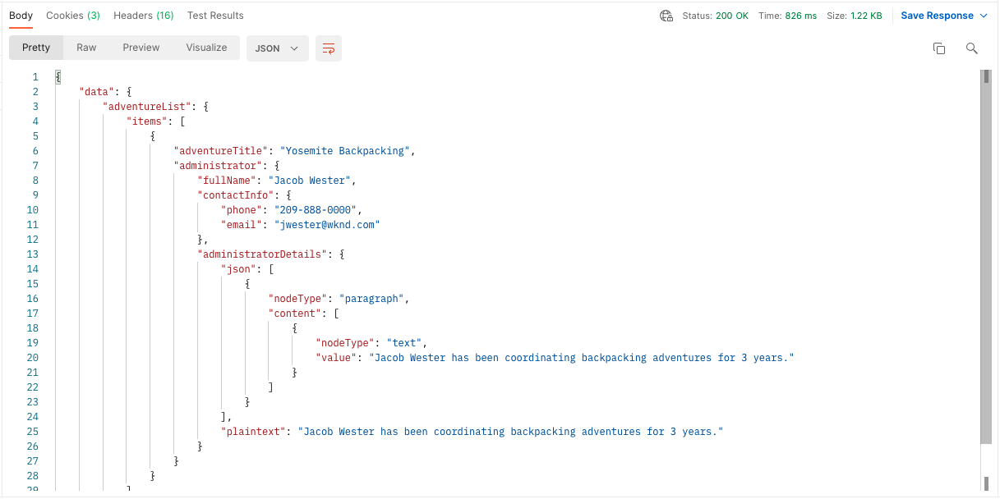
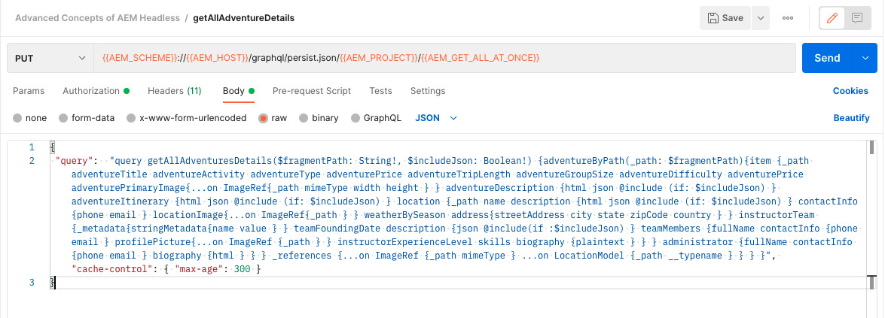

# Consultas persistentes de GraphQL

Las consultas persistentes son consultas que se almacenan en el servidor de Adobe Experience Manager (AEM). Los clientes pueden enviar una solicitud de GET HTTP con el nombre de la consulta para ejecutarla. El beneficio de este enfoque es la accesibilidad. Aunque las consultas de GraphQL del lado del cliente también se pueden ejecutar mediante solicitudes de POST HTTP, que no se pueden almacenar en caché, las consultas persistentes se pueden almacenar en caché mediante cachés HTTP o una CDN, lo que mejora el rendimiento. Las consultas persistentes le permiten simplificar sus solicitudes y mejorar la seguridad, ya que las consultas están encapsuladas en el servidor y el administrador de AEM tiene control total sobre ellas. Se recomienda utilizar consultas persistentes al trabajar con la API de AEM GraphQL.

En el capítulo anterior, ha explorado algunas consultas avanzadas de GraphQL para recopilar datos para la aplicación WKND. En este capítulo, persistirá en estas consultas para AEM, actualizarlas y aprender a utilizar el control de caché en consultas persistentes.

## Requisitos previos {#prerequisites}

Este documento forma parte de un tutorial en varias partes. Asegúrese de que los capítulos anteriores se hayan completado antes de continuar con este capítulo.

Este tutorial utiliza [Postman](https://www.postman.com/) para ejecutar solicitudes HTTP. Asegúrese de haber iniciado sesión con el servicio antes de iniciar este capítulo. Este tutorial también requiere conocimientos prácticos de la aplicación Postman, como la configuración de una colección, la creación de variables y la realización de solicitudes. Consulte la documentación de Postman en [creación de solicitudes](https://learning.postman.com/docs/sending-requests/requests/) y [envío de la primera solicitud](https://learning.postman.com/docs/getting-started/sending-the-first-request/) para obtener más información sobre cómo realizar solicitudes de API en la aplicación.

En este capítulo, las consultas exploradas en el capítulo anterior se mantienen en AEM. Puede descargar un archivo de texto con estas consultas estándar de GraphQL [here](assets/graphql-persisted-queries/advanced-concepts-aem-headless-graphql-queries.txt) para una referencia sencilla.

## Objetivos {#objectives}

En este capítulo, aprenda a:

* Mantener consultas de GraphQL con parámetros
* Actualizar consultas persistentes
* Usar parámetros de control de caché con consultas persistentes

## Resumen de consultas persistentes

Este vídeo ofrece información general sobre cómo mantener las consultas de GraphQL, actualizarlas y utilizar el control de caché.

>[!VIDEO](https://video.tv.adobe.com/v/340036/?quality=12&learn=on)

## Habilitar consultas persistentes

En primer lugar, asegúrese de que las consultas persistentes estén habilitadas para el proyecto del sitio WKND en la instancia de AEM.

1. Vaya a **Herramientas** > **General** > **Explorador de configuración**.

1. Select **Sitio WKND** y, a continuación, seleccione **Propiedades** en la barra de navegación superior para abrir las propiedades de configuración.

   

   En la página Propiedades de configuración, debería ver que la variable **Consultas persistentes de GraphQL** está habilitado.

   

## Importar colección Postman

Para facilitar el seguimiento del tutorial, se proporciona una colección Postman. Alternativamente, las herramientas de línea de comandos como `curl` se puede usar.

1. Descargar e instalar [Postman](https://www.postman.com/)
1. Descargue el [AdvancedConceptsofAEMHeadless.postman_collection.json](/help/headless-tutorial/graphql/advanced-graphql/assets/tutorial-files/AdvancedConceptsofAEMHeadless.postman_collection.json)
1. Abra la aplicación Postman.
1. Select **Archivo** > **Importar** > **Cargar archivo** y elija `AdvancedConceptsofAEMHeadless.postman_collection.json` para importar la colección.

   

### Autenticación

Se requiere autenticación para enviar consultas en una instancia de autor AEM. Este tutorial se basa en el entorno as a Cloud Service AEM y utiliza la autenticación del portador con un token de desarrollo. Para configurar la autenticación para la colección Postman, siga los siguientes pasos:

1. Para obtener un token de desarrollo, vaya a Cloud Developer Console y abra la **Integraciones** y seleccione **Obtener token de desarrollo local**.

   

1. En la colección Postman, vaya a la **Autenticación** y seleccione **Token del portador** en el **Tipo** menú desplegable.

   

1. Introduzca el token de desarrollo en el **Token** campo . Puede pasar el token a través de una variable, tal como se explica en la siguiente sección.

   

### Variables {#variables}

Puede pasar valores como tokens de autenticación y componentes URI a través de variables dentro de la colección Postman para simplificar el proceso. Para este tutorial, siga los siguientes pasos para crear variables:

1. Vaya a la **Variables** dentro de la colección Postman y cree las siguientes variables:

   | Variable | Value |
   | --- | --- |
   | `AEM_SCHEME` | `https` |
   | `AEM_AUTH_TOKEN` | (Su token de desarrollo) |
   | `AEM_HOST` | (El nombre de host de la instancia de AEM) |
   | `AEM_PROJECT` | `wknd` |

1. También puede agregar variables para cada consulta persistente que desee crear. Para este tutorial, mantenga las siguientes consultas: `getAdventureAdministratorDetailsByAdministratorName`, `getTeamByAdventurePath`, `getLocationDetailsByLocationPath`, `getTeamMembersByAdventurePath`, `getLocationPathByAdventurePath`y `getTeamLocationByLocationPath`.

   Cree las siguientes variables:

   * `AEM_GET_ADVENTURE_ADMINISTRATOR_DETAILS_BY_ADMINISTRATOR_NAME` : `adventure-administrator-details-by-administrator-name`
   * `AEM_GET_ADVENTURE_ADMINISTRATOR_DETAILS_BY_ADMINISTRATOR_NAME` : `adventure-administrator-details-by-administrator-name`
   * `AEM_GET_TEAM_LOCATION_BY_LOCATION_PATH` : `team-location-by-location-path`
   * `AEM_GET_TEAM_MEMBERS_BY_ADVENTURE_PATH` : `team-members-by-adventure-path`
   * `AEM_GET_LOCATION_DETAILS_BY_LOCATION_PATH` : `location-details-by-location-path`
   * `AEM_GET_LOCATION_PATH_BY_ADVENTURE_PATH` : `location-path-by-adventure-path`
   * `AEM_GET_TEAM_BY_ADVENTURE_PATH` : `team-by-adventure-path`

   Una vez finalizada, la variable **Variables** en la colección Postman debe tener un aspecto similar al siguiente:

   

## Mantener consultas de GraphQL con parámetros

En el [AEM serie de vídeo sin encabezado y GraphQL](../video-series/graphql-persisted-queries.md), ha aprendido a crear consultas de GraphQL persistentes. En esta sección, mantengamos y ejecutemos una consulta de GraphQL con un parámetro .

### Crear una consulta persistente {#create-persisted-query}

Para este ejemplo, conservemos el `getAdventureAdministratorDetailsByAdministratorName` consulta creada en el capítulo anterior.

>[!NOTE]
>
>El método del PUT HTTP se utiliza para crear una consulta persistente y el método del POST HTTP para actualizarla.

1. En primer lugar, agregue una nueva solicitud dentro de la colección Postman. Seleccione el método del PUT HTTP para crear una consulta persistente y utilice el siguiente URI de solicitud:

   ```plaintext
   {{AEM_SCHEME}}://{{AEM_HOST}}/graphql/persist.json/{{AEM_PROJECT}}/{{AEM_GET_ADVENTURE_ADMINISTRATOR_DETAILS_BY_ADMINISTRATOR_NAME}}
   ```

   Tenga en cuenta que el URI utiliza la variable `/graphql/persist.json` acción.

1. Pegue el `getAdventureAdministratorDetailsByAdministratorName` Consulta de GraphQL en el cuerpo de la solicitud. Tenga en cuenta que es la consulta GraphQL estándar con una variable `name` que requiere un `String`.

   

1. Ejecute la solicitud. Debe recibir la siguiente respuesta:

   

   Ha creado correctamente una consulta persistente denominada `adventure-administrator-details-by-administrator-name`.

### Ejecutar una consulta persistente

Vamos a ejecutar la consulta persistente que ha creado.

1. Cree una nueva solicitud de GET dentro de la colección Postman mediante el siguiente URI de solicitud:

   ```plaintext
   {{AEM_SCHEME}}://{{AEM_HOST}}/graphql/execute.json/{{AEM_PROJECT}}/{{AEM_GET_ADVENTURE_ADMINISTRATOR_DETAILS_BY_ADMINISTRATOR_NAME}}
   ```

   Tenga en cuenta que el URI de solicitud ahora incluye la variable `execute.json` acción.

   Si ejecuta esta solicitud tal cual, se genera un error porque la consulta requiere una variable `name`. Debe pasar esta variable como parámetro a la URI de solicitud.

   

1. A continuación, recupere un administrador con el nombre de Jacob Wester. Los parámetros de las consultas de GraphQL persistentes deben separarse de los componentes de URI anteriores por `;` y se codifican antes de pasarlas al URI de solicitud. En la consola del explorador, ejecute el siguiente comando:

   ```js
   encodeURIComponent(";name=Jacob Wester")
   ```

   

1. Copie el resultado de la consola y péguelo al final del URI de solicitud en Postman. Debe tener el siguiente URI de solicitud:

   ```plaintext
   {{AEM_SCHEME}}://{{AEM_HOST}}/graphql/execute.json/{{AEM_PROJECT}}/{{AEM_GET_ADVENTURE_ADMINISTRATOR_DETAILS_BY_ADMINISTRATOR_NAME}}%3Bname%3DJacob%20Wester
   ```

1. Ejecute la solicitud de GET. Debe recibir la siguiente respuesta:

   

Ahora ha creado y ejecutado una consulta de GraphQL persistente con un parámetro .

Puede seguir los pasos descritos anteriormente para mantener el resto de las consultas de GraphQL desde el [archivo de texto](assets/graphql-persisted-queries/advanced-concepts-aem-headless-graphql-queries.txt) con las variables que ha creado en la variable [inicio de este capítulo](#variables).

El [Colección Postman](/help/headless-tutorial/graphql/advanced-graphql/assets/tutorial-files/AdvancedConceptsofAEMHeadless.postman_collection.json) también está disponible para su descarga e importación.

## Actualizar consultas persistentes

Mientras que las consultas persistentes se crean mediante una solicitud de PUT, debe utilizar una solicitud de POST para actualizar una consulta persistente existente. Para este tutorial, vamos a actualizar la consulta persistente denominada `adventure-administrator-details-by-administrator-name` que ha creado en el [sección anterior](#create-persisted-query).

1. Duplique la pestaña que utilizó para la solicitud del PUT en la sección anterior. En la copia, cambie el método HTTP a POST.

1. En la consulta de GraphQL, vamos a eliminar la variable `plaintext` desde el `administratorDetails` campo .

   

1. Ejecute la solicitud. Debe obtener la siguiente respuesta:

   

Ya ha actualizado la variable `adventure-administrator-details-by-administrator-name` consulta persistente. Es importante actualizar siempre las consultas de GraphQL en AEM si se realizan cambios.

## Pasar parámetros de control de caché en consultas persistentes {#cache-control-all-adventures}

La API de AEM GraphQL permite añadir parámetros de control de caché a las consultas para mejorar el rendimiento.

Utilice la variable `getAllAdventureDetails` consulta creada en el capítulo anterior. La respuesta de consulta es grande y resulta útil controlar su `age` en la caché.

Esta consulta persistente se utiliza más adelante para actualizar la variable [aplicación cliente](/help/headless-tutorial/graphql/advanced-graphql/client-application-integration.md).

1. En la colección Postman, cree una nueva variable:

   ```plaintext
   AEM_GET_ALL_AT_ONCE: all-adventure-details
   ```

1. Cree una nueva solicitud de PUT para mantener esta consulta.

1. En el **Cuerpo** de la solicitud, seleccione **raw** tipo de datos.

   

1. Para utilizar el control de caché en una consulta, debe envolver la consulta en una estructura JSON y añadir parámetros de control de caché al final. Copie y pegue la siguiente consulta en el cuerpo de la solicitud:

   ```json
   {
   "query": " query getAllAdventureDetails($fragmentPath: String!) { adventureByPath(_path: $fragmentPath){ item { _path adventureTitle adventureActivity adventureType adventurePrice adventureTripLength adventureGroupSize adventureDifficulty adventurePrice adventurePrimaryImage{ ...on ImageRef{ _path mimeType width height } } adventureDescription { html json } adventureItinerary { html json } location { _path name description { html json } contactInfo{ phone email } locationImage{ ...on ImageRef{ _path } } weatherBySeason address{ streetAddress city state zipCode country } } instructorTeam { _metadata{ stringMetadata{ name value } } teamFoundingDate description { json } teamMembers { fullName contactInfo { phone email } profilePicture{ ...on ImageRef { _path } } instructorExperienceLevel skills biography { html } } } administrator { fullName contactInfo { phone email } biography { html } } } _references { ...on ImageRef { _path mimeType } ...on LocationModel { _path __typename } } } }", 
   "cache-control": { "max-age": 300 }
   }
   ```

   >[!CAUTION]
   >
   >La consulta ajustada no debe contener saltos de línea.

   La solicitud debería tener el siguiente aspecto:

   

1. Ejecute la solicitud. Debe obtener la respuesta que indica que la variable `all-adventure-details` la consulta persistente se creó correctamente.

   

## Felicitaciones!

Felicitaciones! Ahora ha aprendido a mantener consultas de GraphQL con parámetros, actualizar consultas persistentes y usar parámetros de control de caché con consultas persistentes.

## Pasos siguientes

En el [capítulo siguiente](/help/headless-tutorial/graphql/advanced-graphql/client-application-integration.md), implementará las solicitudes para consultas persistentes en la aplicación WKND.

Aunque es opcional para este tutorial, asegúrese de publicar todo el contenido en situaciones de producción en el mundo real. Para obtener una revisión de los entornos Autor y Publicación en AEM, consulte la [AEM serie de vídeo sin encabezado y GraphQL](../video-series/author-publish-architecture.md).