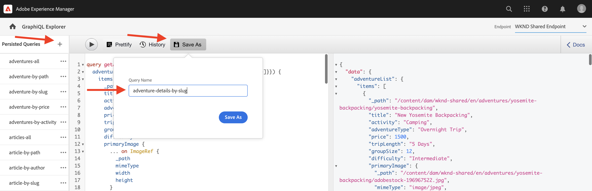
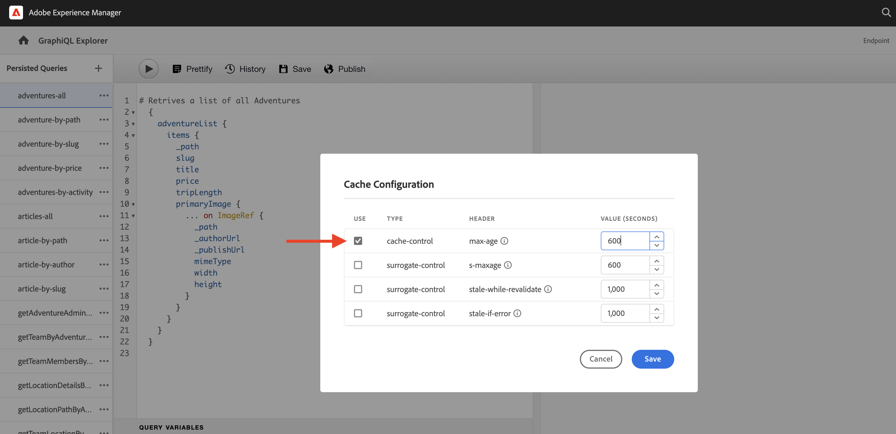

# Consultas persistentes de GraphQL

Las consultas persistentes son consultas que se almacenan en el servidor de Adobe Experience Manager AEM (). Los clientes pueden enviar una solicitud HTTP con el nombre de la GET para ejecutarla. El beneficio de este enfoque es la accesibilidad. Aunque las consultas GraphQL del lado del cliente también se pueden ejecutar mediante solicitudes de POST HTTP, que no se pueden almacenar en caché, las consultas persistentes se pueden almacenar en caché mediante cachés HTTP o una CDN, lo que mejora el rendimiento. AEM Las consultas persistentes le permiten simplificar las solicitudes y mejorar la seguridad, ya que las consultas se encapsulan en el servidor y el administrador tiene un control total sobre ellas. Lo es **prácticas recomendadas y muy recomendadas** AEM para utilizar consultas persistentes al trabajar con la API de GraphQL de.

En el capítulo anterior, ha explorado algunas consultas avanzadas de GraphQL para recopilar datos para la aplicación WKND. AEM En este capítulo, persistirá en las consultas para que se utilicen y aprenderá a utilizar el control de caché en las consultas persistentes.

## Requisitos previos {#prerequisites}

Este documento forma parte de un tutorial de varias partes. Asegúrese de que las [capítulo anterior](explore-graphql-api.md) se ha completado antes de continuar con este capítulo.

## Objetivos {#objectives}

En este capítulo, aprenderá a:

* Persistir consultas de GraphQL con parámetros
* Usar parámetros de control de caché con consultas persistentes

## Revisar _Consultas persistentes de GraphQL_ ajuste de configuración

Vamos a revisar eso _Consultas persistentes de GraphQL_ AEM están habilitados para el proyecto WKND Site en la instancia de la.

1. Vaya a **Herramientas** > **General** > **Explorador de configuración**.

1. Seleccionar **WKND compartido**, luego seleccione **Propiedades** en la barra de navegación superior para abrir las propiedades de configuración. En la página Propiedades de configuración, debería ver que la variable **Consultas persistentes de GraphQL** el permiso está activado.

   

## Persistir consultas de GraphQL mediante la herramienta Explorador de GraphiQL integrada

En esta sección, vamos a mantener la consulta de GraphQL que se utiliza posteriormente en la aplicación cliente para recuperar y procesar los datos del fragmento de contenido de aventura.

1. Introduzca la siguiente consulta en el Explorador de GraphiQL:

   ```graphql
   query getAdventureDetailsBySlug($slug: String!) {
   adventureList(filter: {slug: {_expressions: [{value: $slug}]}}) {
       items {
       _path
       title
       activity
       adventureType
       price
       tripLength
       groupSize
       difficulty
       primaryImage {
           ... on ImageRef {
           _path
           mimeType
           width
           height
           }
       }
       description {
           html
           json
       }
       itinerary {
           html
           json
       }
       location {
           _path
           name
           description {
           html
           json
           }
           contactInfo {
           phone
           email
           }
           locationImage {
           ... on ImageRef {
               _path
           }
           }
           weatherBySeason
           address {
           streetAddress
           city
           state
           zipCode
           country
           }
       }
       instructorTeam {
           _metadata {
           stringMetadata {
               name
               value
           }
           }
           teamFoundingDate
           description {
           json
           }
           teamMembers {
           fullName
           contactInfo {
               phone
               email
           }
           profilePicture {
               ... on ImageRef {
               _path
               }
           }
           instructorExperienceLevel
           skills
           biography {
               html
           }
           }
       }
       administrator {
           fullName
           contactInfo {
           phone
           email
           }
           biography {
           html
           }
       }
       }
       _references {
       ... on ImageRef {
           _path
           mimeType
       }
       ... on LocationModel {
           _path
           __typename
       }
       }
   }
   }
   ```

   Compruebe que la consulta funciona antes de guardarla.

1. A continuación, pulse Guardar como e introduzca `adventure-details-by-slug` como el Nombre de la consulta.

   

## Ejecución de consultas persistentes con variables mediante la codificación de caracteres especiales

Comprendamos cómo las consultas persistentes con variables se ejecutan en la aplicación del lado del cliente codificando los caracteres especiales.

Para ejecutar una consulta persistente, la aplicación cliente realiza una solicitud de GET utilizando la siguiente sintaxis:

```
GET <AEM_HOST>/graphql/execute.json/<Project-Config-Name>/<Persisted-Query-Name>
```

Para ejecutar una consulta persistente _con una variable_, la sintaxis anterior cambia a:

```
GET <AEM_HOST>/graphql/execute.json/<Project-Config-Name>/<Persisted-Query-Name>;variable1=value1;variable2=value2
```

Los caracteres especiales como punto y coma (;), signo igual (=), barras diagonales (/) y espacio deben convertirse para utilizar la codificación UTF-8 correspondiente.

Ejecutando el `getAllAdventureDetailsBySlug` consulta desde el terminal de línea de comandos, revisamos estos conceptos en acción.

1. Abra el Explorador de GraphiQL y haga clic en **elipses** (...) junto a la consulta persistente `getAllAdventureDetailsBySlug`, luego haga clic en **Copiar URL**. Pegue la URL copiada en un panel de texto y tenga el siguiente aspecto:

   ```code
       http://<AEM_HOST>/graphql/execute.json/wknd-shared/getAllAdventureDetailsBySlug;slug=
   ```

1. Añadir `yosemite-backpacking` como valor variable

   ```code
       http://<AEM_HOST>/graphql/execute.json/wknd-shared/getAllAdventureDetailsBySlug;slug=yosemite-backpacking
   ```

1. Codifique los caracteres especiales punto y coma (;) y signo igual (=)

   ```code
       http://<AEM_HOST>/graphql/execute.json/wknd-shared/getAllAdventureDetailsBySlug%3Bslug%3Dyosemite-backpacking
   ```

1. Abra un terminal de línea de comandos y use [Curl](https://curl.se/) ejecutar la consulta

   ```shell
   $ curl -X GET http://<AEM_HOST>/graphql/execute.json/wknd-shared/getAllAdventureDetailsBySlug%3Bslug%3Dyosemite-backpacking
   ```

>[!TIP]
>
>    AEM Si se ejecuta la consulta anterior en el entorno de autor de la, debe enviar las credenciales. Consulte [Token de acceso de desarrollo local](https://experienceleague.adobe.com/docs/experience-manager-learn/getting-started-with-aem-headless/authentication/local-development-access-token.html) para la demostración de la misma y [AEM Llamar a la API de](https://experienceleague.adobe.com/docs/experience-manager-cloud-service/content/implementing/developing/generating-access-tokens-for-server-side-apis.html#calling-the-aem-api) para obtener más información.

Además, revise [Ejecución de una consulta persistente](https://experienceleague.adobe.com/docs/experience-manager-cloud-service/content/headless/graphql-api/persisted-queries.html#execute-persisted-query), [Uso de variables de consulta](https://experienceleague.adobe.com/docs/experience-manager-cloud-service/content/headless/graphql-api/persisted-queries.html#query-variables), y [Codificación de la URL de consulta para su uso en una aplicación](https://experienceleague.adobe.com/docs/experience-manager-cloud-service/content/headless/graphql-api/persisted-queries.html#encoding-query-url) para conocer la ejecución de consultas persistentes por aplicaciones cliente.

## Actualizar parámetros de control de caché en consultas persistentes {#cache-control-all-adventures}

AEM La API de GraphQL le permite actualizar los parámetros predeterminados de control de caché a sus consultas para mejorar el rendimiento. Los valores predeterminados de control de caché son:

* 60 segundos es el TTL predeterminado (máximo=60) para el cliente (por ejemplo, un explorador)

* 7200 segundos es el TTL predeterminado (s-maxage=7200) para Dispatcher y CDN; también conocido como cachés compartidas

Utilice el `adventures-all` consulta para actualizar los parámetros de control de caché. La respuesta a la consulta es grande y resulta útil controlar su `age` en la caché. Esta consulta persistente se utiliza más adelante para actualizar el [aplicación cliente](/help/headless-tutorial/graphql/advanced-graphql/client-application-integration.md).

1. Abra el Explorador de GraphiQL y haga clic en **elipses** (...) junto a la consulta persistente y haga clic en **Encabezados** para abrir **Configuración de caché** modal.

   


1. En el **Configuración de caché** modal, actualice el `max-age` valor de encabezado a `600 `segundos (10 minutos) y haga clic en **Guardar**

   


Revisar [Almacenamiento en caché de consultas persistentes](https://experienceleague.adobe.com/docs/experience-manager-cloud-service/content/headless/graphql-api/persisted-queries.html#caching-persisted-queries) para obtener más información sobre los parámetros predeterminados de control de caché.


## Enhorabuena.

Felicitaciones. Ahora ha aprendido a hacer que persistan las consultas de GraphQL con parámetros, a actualizar las consultas persistentes y a utilizar parámetros de control de caché con consultas persistentes.

## Pasos siguientes

En el [capítulo siguiente](/help/headless-tutorial/graphql/advanced-graphql/client-application-integration.md), implementará las solicitudes de consultas persistentes en la aplicación WKND.
