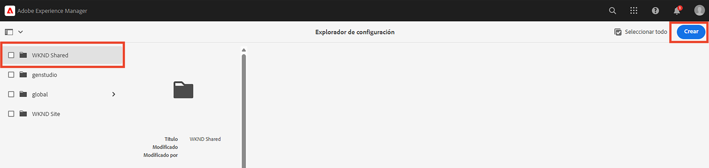
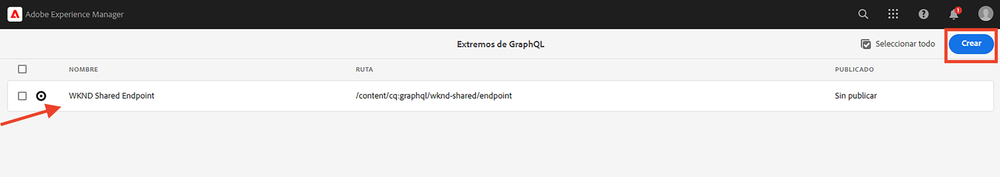

# Conceptos avanzados de AEM sin encabezado

Este tutorial completo continúa el [tutorial básico](../multi-step/overview.md) que cubría los aspectos básicos de Adobe Experience Manager (AEM) sin encabezado y GraphQL. El tutorial avanzado ilustra aspectos detallados del trabajo con modelos de fragmentos de contenido, fragmentos de contenido y las consultas persistentes de GraphQL en AEM, incluido el uso de consultas persistentes de GraphQL en una aplicación de cliente.

## Requisitos previos

Complete la [configuración rápida de AEM as a Cloud Service](../quick-setup/cloud-service.md) para configurar su entorno de AEM as a Cloud Service.

Se recomienda completar el [tutorial básico](../multi-step/overview.md) y el de [series de vídeos](../video-series/modeling-basics.md) antes de continuar con este tutorial avanzado. Aunque puede completar el tutorial utilizando un entorno local de AEM, este tutorial solo cubre el flujo de trabajo de AEM as a Cloud Service.

>[!CAUTION]
>
>Si no tiene acceso al entorno de AEM as a Cloud Service, puede completar la configuración rápida de [AEM sin encabezado mediante el SDK local](https://experienceleague.adobe.com/docs/experience-manager-learn/getting-started-with-aem-headless/graphql/quick-setup/local-sdk.html?lang=es). Sin embargo, es importante tener en cuenta que algunas páginas de la IU del producto son diferentes, como la de navegación por fragmentos de contenido.

## Objetivos

Este tutorial abarca los siguientes temas:

* Creación de modelos de fragmentos de contenido con reglas de validación y tipos de datos más avanzados, como marcadores de posición de pestañas, referencias de fragmento anidados, objetos JSON y tipos de datos como fecha y hora.
* Creación de fragmentos de contenido mientras trabaja con las referencias de fragmentos anidados en contenido y configuración de directivas de carpeta para el control de creación de fragmentos de contenido.
* Explora las funcionalidades de la API de GraphQL en AEM mediante consultas de GraphQL con variables y directivas.
* Mantener las consultas de GraphQL con parámetros en AEM y aprender a utilizar los parámetros de control de caché con consultas persistentes.
* Integrar las solicitudes de consultas persistentes de ejemplo en aplicación WKND GraphQL React con el SDK de JavaScript de AEM sin encabezado.

## Información general sobre los conceptos avanzados de AEM sin encabezado

El siguiente vídeo proporciona información general de alto nivel sobre los conceptos que se tratan en este tutorial. El tutorial incluye la definición de modelos de fragmentos de contenido con tipos de datos más avanzados, el anidamiento de fragmentos de contenido y consultas persistentes de GraphQL en AEM.

>[!VIDEO](https://video.tv.adobe.com/v/3446130?quality=12&learn=on&captions=spa)

>[!CAUTION]
>
>En el minuto 2:25 de este vídeo se murstra cómo instalar el editor de consultas de GraphiQL a través del Administrador de paquetes para explorar consultas de GraphQL. Sin embargo, en las versiones más recientes de AEM as a Cloud Service se proporciona un **explorador de GraphiQL** integrado, por lo que no se requiere la instalación del paquete. Consulte [Uso del IDE de GraphQL](https://experienceleague.adobe.com/docs/experience-manager-cloud-service/content/headless/graphql-api/graphiql-ide.html?lang=es) para obtener más información.

## Configuración del proyecto

El proyecto WKND de Sites tiene todas las configuraciones necesarias para iniciar el tutorial después de completar la [configuración rápida](../quick-setup/cloud-service.md). En esta sección solo se destacan algunos pasos importantes que puede seguir al crear su propio proyecto de AEM sin encabezado.

### Revisar la configuración existente

El primer paso para iniciar cualquier nuevo proyecto en AEM es crear su configuración, como un espacio de trabajo y crear los puntos finales de la API de GraphQL. Para revisar o crear una configuración, vaya a **Herramientas** > **General** > **Explorador de configuración**.

Observe que la configuración del sitio `WKND Shared` ya se ha creado para el tutorial. Para crear una configuración para su propio proyecto, seleccione **Crear** en la esquina superior derecha y complete el formulario en el modal Crear configuración que aparece.

### Revisar puntos finales de la API de GraphQL

A continuación, configure los puntos finales de la API a los que enviar las consultas de GraphQL. Para revisar los puntos finales existentes o crear uno, vaya a **Herramientas** > **General** > **GraphQL**.

Observe que `WKND Shared Endpoint` ya se ha creado. Para crear un punto final para su proyecto, seleccione **Crear** en la esquina superior derecha y siga el flujo de trabajo.

>[!NOTE]
>
> Después de guardar el punto final, verá un modal sobre la visita a la consola de seguridad, que le permite ajustar la configuración de seguridad si desea configurar el acceso al punto final. Sin embargo, los permisos de seguridad están fuera del ámbito de este tutorial. Para obtener más información, consulte la [documentación de AEM](https://experienceleague.adobe.com/docs/experience-manager-65/administering/security/security.html?lang=es).

### Revisar la estructura de contenido de WKND y la carpeta raíz del idioma

Una estructura de contenido bien definida es clave para el éxito de la implementación de AEM sin encabezado. Resulta útil para la escalabilidad, la facilidad de uso y la administración de permisos del contenido.

Una carpeta raíz de idioma es una carpeta con un código de idioma ISO como su nombre, como EN o FR. El sistema de administración de traducciones de AEM utiliza estas carpetas para definir el idioma principal del contenido y los idiomas para la traducción de contenido.

Vaya a **Navegación** > **Recursos** > **Archivos**.

Vaya a la carpeta **Compartida WKND**. Observe la carpeta con el título &quot;English&quot; y el nombre &quot;EN&quot;. Esta carpeta es la carpeta raíz de idioma del proyecto del sitio WKND.

Para su propio proyecto, cree una carpeta raíz de idioma dentro de la configuración. Consulte la sección sobre [creación de carpetas](/help/headless-tutorial/graphql/advanced-graphql/author-content-fragments.md#create-folders) para obtener más información.

### Asignar una configuración a la carpeta anidada

Finalmente, debe asignar la configuración del proyecto a la carpeta raíz del idioma. Esta asignación permite la creación de fragmentos de contenido basados en los modelos de fragmentos de contenido definidos en la configuración del proyecto.

Para asignar la carpeta raíz de idioma a la configuración, selecciónela y, a continuación, elija **Propiedades** en la barra de navegación superior.

A continuación, vaya a la pestaña **Cloud Services** y seleccione el icono de la carpeta en el campo **Configuración de nube**.

En el modal que aparece, seleccione la configuración creada anteriormente para asignarle la carpeta raíz del idioma.

### Prácticas recomendadas

Las siguientes son las prácticas recomendadas al crear su propio proyecto en AEM:

* La jerarquía de carpetas debe modelarse teniendo en cuenta la localización y la traducción. En otras palabras, las carpetas de idioma deben anidarse dentro de las carpetas de configuración, lo que permite traducir fácilmente el contenido dentro de esas carpetas de configuración.
* La jerarquía de carpetas debe mantenerse plana y directa. Evite mover o cambiar el nombre de carpetas y fragmentos más adelante, especialmente después de publicar para uso activo, ya que cambia las rutas que pueden afectar a las referencias de fragmento y a las consultas de GraphQL.

## Paquetes de inicio y solución

Hay dos **paquetes** de AEM disponibles y se pueden instalar mediante [Administrador de paquetes](/help/headless-tutorial/graphql/advanced-graphql/author-content-fragments.md#sample-content)

* [Advanced-GraphQL-Tutorial-Starter-Package-1.1.zip](/help/headless-tutorial/graphql/advanced-graphql/assets/tutorial-files/Advanced-GraphQL-Tutorial-Starter-Package-1.1.zip) se usa más adelante en el tutorial y contiene carpetas e imágenes de ejemplo.
* [Advanced-GraphQL-Tutorial-Solution-Package-1.2.zip](/help/headless-tutorial/graphql/advanced-graphql/assets/tutorial-files/Advanced-GraphQL-Tutorial-Solution-Package-1.2.zip) contiene la solución finalizada para los capítulos 1-4, incluidos los nuevos modelos de fragmentos de contenido, los fragmentos de contenido y las consultas de GraphQL persistentes. Útil para aquellos que desean saltar directamente al capítulo [Integración de aplicaciones cliente](/help/headless-tutorial/graphql/advanced-graphql/client-application-integration.md).

El proyecto [React App - Tutorial avanzado - WKND Adventures](https://github.com/adobe/aem-guides-wknd-graphql/blob/main/advanced-tutorial/README.md) está disponible para revisar y explorar la aplicación de ejemplo. Esta aplicación de ejemplo recupera el contenido de AEM invocando las consultas de GraphQL persistentes y lo renderiza en una experiencia envolvente.

## Introducción

Para empezar con este tutorial avanzado, siga estos pasos:

1. Configure un entorno de desarrollo con [AEM as a Cloud Service](../quick-setup/cloud-service.md).
1. Inicie el capítulo del tutorial en [Crear modelos de fragmentos de contenido](/help/headless-tutorial/graphql/advanced-graphql/create-content-fragment-models.md).
