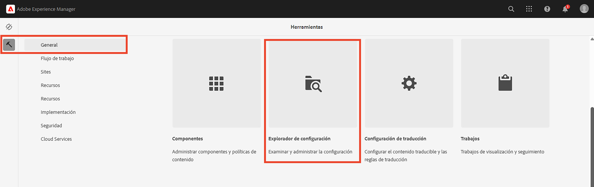
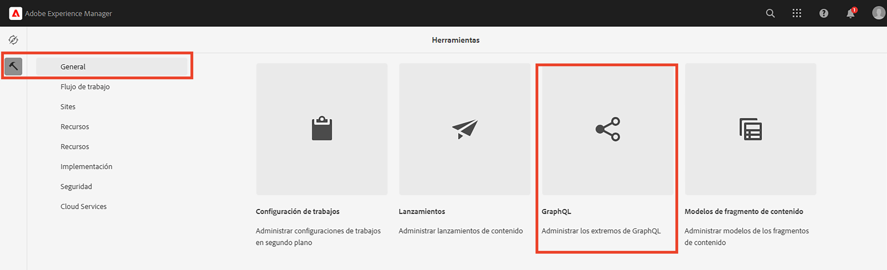
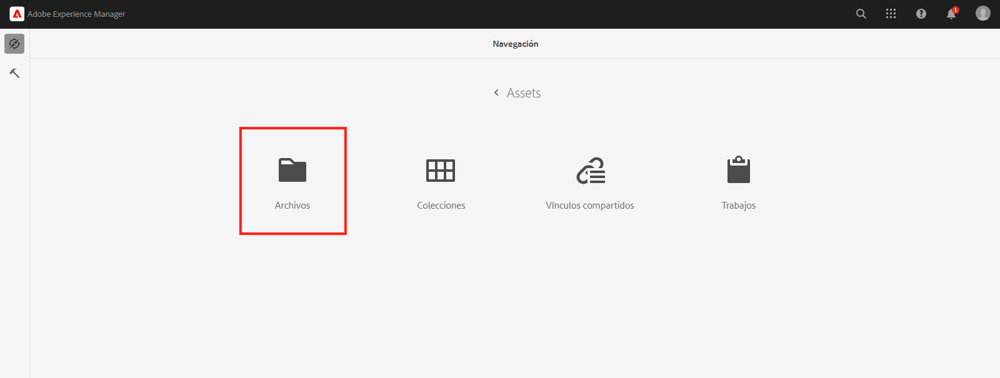
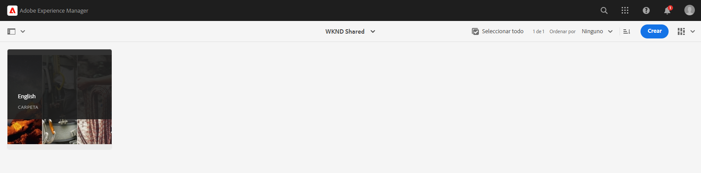
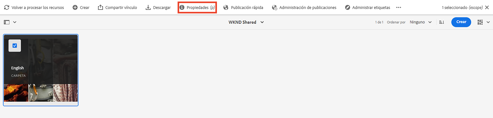
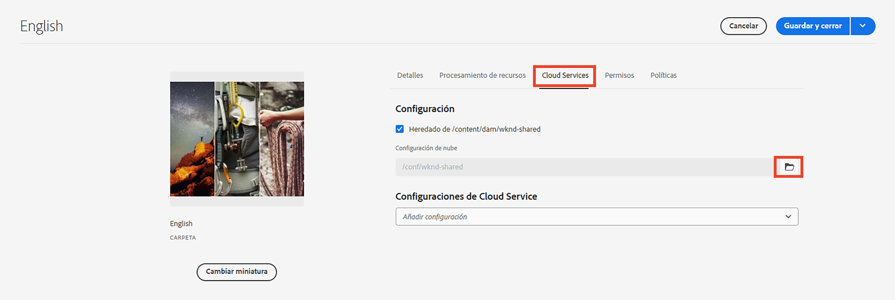

# Conceptos avanzados de AEM sin cabeza

Este tutorial completo continúa con el [tutorial básico](../multi-step/overview.md) que cubrían los fundamentos de Adobe Experience Manager (AEM) Headless y GraphQL. El tutorial avanzado ilustra aspectos detallados del trabajo con modelos de fragmento de contenido, fragmentos de contenido y la API de GraphQL de AEM, incluido el uso de AEM GraphQL en una aplicación cliente.

## Requisitos previos

Complete el [configuración rápida para AEM as a Cloud Service](../quick-setup/cloud-service.md) para configurar su entorno.

Se recomienda completar la anterior [tutorial básico](../multi-step/overview.md) y [serie de vídeos](../video-series/modeling-basics.md) tutoriales antes de continuar con este tutorial avanzado. Aunque puede completar el tutorial utilizando un entorno de AEM local, este tutorial solo cubre el flujo de trabajo de AEM as a Cloud Service.

## Objetivos

Este tutorial trata los siguientes temas:

* Cree modelos de fragmento de contenido mediante reglas de validación y tipos de datos más avanzados, como marcadores de posición de pestañas, referencias de fragmento anidadas, objetos JSON y tipos de datos de fecha y hora.
* Cree fragmentos de contenido mientras trabaja con contenido anidado y referencias de fragmento, y configure políticas de carpeta para la administración de la creación de fragmentos de contenido.
* Explore AEM capacidades de la API de GraphQL mediante consultas de GraphQL con variables y directivas.
* Mantenga las consultas de GraphQL con parámetros en AEM y aprenda a utilizar parámetros de control de caché con consultas persistentes.
* Integre solicitudes de consultas persistentes en la aplicación WKND GraphQL React de muestra mediante el SDK de JavaScript sin encabezado de AEM.

## Conceptos avanzados de AEM información general sin encabezado

El siguiente vídeo proporciona información general de alto nivel sobre los conceptos que se tratan en este tutorial. El tutorial incluye la definición de modelos de fragmento de contenido con tipos de datos más avanzados, la anidación de fragmentos de contenido y la persistencia de consultas de GraphQL en AEM.

>[!VIDEO](https://video.tv.adobe.com/v/340035/?quality=12&learn=on)

## Configuración del proyecto

El proyecto WKND Site tiene todas las configuraciones necesarias, por lo que puede iniciar el tutorial justo después de completar la [configuración rápida](../quick-setup/cloud-service.md). En esta sección solo se destacan algunos pasos importantes que puede utilizar al crear su propio proyecto sin encabezado de AEM.

### Crear una configuración

El primer paso para iniciar cualquier proyecto nuevo en AEM es crear su configuración, como espacio de trabajo y crear extremos de API de GraphQL. Para ver o crear una configuración, vaya a **Herramientas** > **General** > **Explorador de configuración**.

Observe que la configuración del sitio WKND ya se ha creado para el tutorial. Para crear una configuración para su propio proyecto, seleccione **Crear** en la esquina superior derecha y complete el formulario en el modal Crear configuración que aparece.

### Creación de extremos de API de GraphQL

A continuación, debe configurar los extremos de la API para enviar consultas de GraphQL a . Para revisar los puntos finales existentes o crear uno, vaya a **Herramientas** > **Recursos** > **GraphQL**.

Observe que los extremos global y WKND ya se han creado. Para crear un punto final para el proyecto, seleccione **Crear** en la esquina superior derecha y siga el flujo de trabajo.

>[!NOTE]
>
> Después de guardar el punto final, verá un modal sobre la visita a la Consola de seguridad, que le permite ajustar la configuración de seguridad si desea configurar el acceso al punto final. Sin embargo, los propios permisos de seguridad están fuera del ámbito de este tutorial. Para obtener más información, consulte [AEM documentación](https://experienceleague.adobe.com/docs/experience-manager-64/administering/security/security.html).

### Crear una carpeta raíz de idioma para el proyecto

Una carpeta raíz de idioma es una carpeta con un código de idioma ISO como su nombre, como EN o FR. El sistema de administración de AEM traducción utiliza estas carpetas para definir el idioma principal del contenido y los idiomas para la traducción del contenido.

Vaya a **Navegación** > **Recursos** > **Archivos**.

Vaya a **Sitio WKND** carpeta. Observe la carpeta con el título &quot;Inglés&quot; y el nombre &quot;EN&quot;. Esta carpeta es la carpeta raíz del idioma para el proyecto WKND Site.

Para su propio proyecto, cree una carpeta raíz de idioma dentro de la configuración. Consulte la sección sobre [crear carpetas](/help/headless-tutorial/graphql/advanced-graphql/author-content-fragments.md#create-folders) para obtener más información.

### Asignar una configuración a la carpeta anidada

Finalmente, debe asignar la configuración del proyecto a la carpeta raíz del idioma. Esta asignación permite la creación de fragmentos de contenido basados en modelos de fragmento de contenido definidos en la configuración del proyecto.

Para asignar la carpeta raíz del idioma a la configuración, seleccione la carpeta y, a continuación, seleccione **Propiedades** en la barra de navegación superior.

A continuación, vaya a la **Cloud Services** y seleccione el icono de carpeta en la pestaña **Configuración de nube** campo .

En el modal que aparece, seleccione la configuración creada anteriormente para asignarle la carpeta raíz del idioma.

### Prácticas recomendadas

A continuación se indican las prácticas recomendadas al crear su propio proyecto en AEM:

* La jerarquía de carpetas debe modelarse teniendo en cuenta la localización y la traducción. En otras palabras, las carpetas de idioma deben estar anidadas dentro de las carpetas de configuración, lo que permite una fácil traducción del contenido dentro de esas carpetas de configuración.
* La jerarquía de carpetas debe mantenerse plana y sencilla. Evite mover o cambiar el nombre de carpetas y fragmentos más adelante, especialmente después de publicar para uso activo, ya que cambia las rutas que pueden afectar a las referencias de fragmento y a las consultas de GraphQL.

## Paquetes de inicio y solución

Dos AEM **paquetes** están disponibles y pueden instalarse mediante [Administrador de paquetes](/help/headless-tutorial/graphql/advanced-graphql/author-content-fragments.md#sample-content)

* [Advanced-GraphQL-Tutorial-Starter-Package-1.0.zip](/help/headless-tutorial/graphql/advanced-graphql/assets/tutorial-files/Advanced-GraphQL-Tutorial-Starter-Package-1.0.zip) se utiliza más adelante en el tutorial y contiene imágenes y carpetas de ejemplo.
* [Advanced-GraphQL-Tutorial-Solution-Package-1.1.zip](/help/headless-tutorial/graphql/advanced-graphql/assets/tutorial-files/Advanced-GraphQL-Tutorial-Solution-Package-1.1.zip) contiene la solución terminada para los capítulos 1 a 4, incluidos los nuevos modelos de fragmento de contenido, fragmentos de contenido y consultas de GraphQL persistentes. Útil para aquellos que quieran saltarse directamente en la [Integración de aplicaciones de cliente](/help/headless-tutorial/graphql/advanced-graphql/client-application-integration.md) capítulo.

Hay dos proyectos de React JS disponibles para experimentar con consultas [desde una aplicación cliente sin periféricos](/help/headless-tutorial/graphql/advanced-graphql/client-application-integration.md).

* [aem-guides-wknd-headless-start-tutorial.zip](/help/headless-tutorial/graphql/advanced-graphql/assets/tutorial-files/aem-guides-wknd-headless-start-tutorial.zip) - aplicación cliente de inicio que se completa en [Capítulo 5 - Integración de aplicaciones cliente](/help/headless-tutorial/graphql/advanced-graphql/client-application-integration.md).
* [aem-guides-wknd-headless-solution-tutorial.zip](/help/headless-tutorial/graphql/advanced-graphql/assets/tutorial-files/aem-guides-wknd-headless-solution-tutorial.zip) - aplicación cliente finalizada que utiliza **persisted** consultas.

## Introducción

Para comenzar con este tutorial avanzado, siga estos pasos:

1. Configuración de un entorno de desarrollo mediante [AEM as a Cloud Service](../quick-setup/cloud-service.md).
1. Inicie el capítulo del tutorial en [creación de modelos de fragmento de contenido](/help/headless-tutorial/graphql/advanced-graphql/create-content-fragment-models.md).
