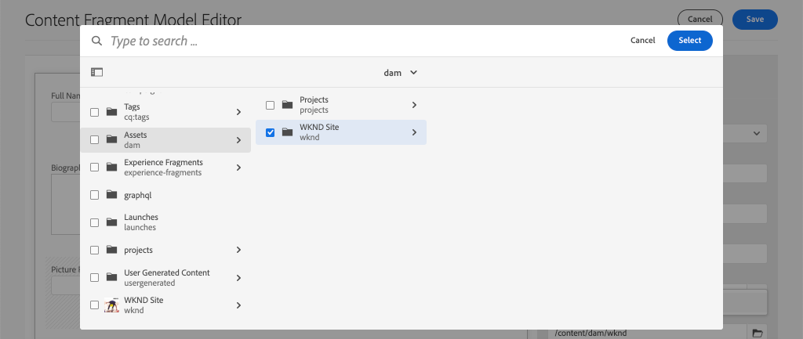

# Definición de modelos de fragmento de contenido {#content-fragment-models}

En este capítulo, aprenda a modelar contenido y a crear un esquema con **Modelos de fragmento de contenido**. Revisará los modelos existentes y creará un nuevo modelo. También aprenderá los diferentes tipos de datos que se pueden utilizar para definir un esquema como parte del modelo.

En este capítulo creará un nuevo modelo para un **colaborador**, que es el modelo de datos para los usuarios que crean contenido de revista y aventura como parte de la marca WKND.

## Requisitos previos {#prerequisites}

Este es un tutorial en varias partes y se da por hecho que se han completado los pasos descritos en [Quick Setup](./setup.md).

## Objetivos {#objectives}

* Cree un nuevo modelo de fragmento de contenido.
* Identifique los tipos de datos disponibles y las opciones de validación para crear modelos.
* Comprenda cómo define el modelo de fragmento de contenido **tanto** el esquema de datos como la plantilla de creación para un fragmento de contenido.

## Información general del modelo de fragmento de contenido {#overview}

>[!VIDEO](https://video.tv.adobe.com/v/22452/?quality=12&learn=on)

El vídeo anterior ofrece información general de alto nivel sobre el trabajo con los modelos de fragmento de contenido.

>[!CAUTION]
>
> El vídeo anterior muestra la creación del modelo **Contributor** con el nombre `Contributors`. Al realizar los pasos en su propio entorno, asegúrese de que el título utiliza el formulario singular: `Contributor` sin **s**. El nombre del Modelo de fragmento de contenido impulsa las llamadas a la API de GraphQL que se realizarán más adelante en el tutorial.

## Inspeccionar el modelo de fragmento de contenido de aventura

En el capítulo anterior, se editaron varios fragmentos de contenido de aventuras y se mostraban en una aplicación externa. Inspeccionemos el Modelo de fragmento de contenido de aventura para comprender el esquema de datos subyacente de estos fragmentos.

1. En el menú **Inicio de AEM** vaya a **Herramientas** > **Recursos** > **Modelos de fragmento de contenido**.

   

1. Vaya a la carpeta **WKND Site** y pase el ratón sobre el Modelo de fragmento de contenido **Adventure** y haga clic en el icono **Edit** (lápiz) para abrir el modelo.

   

1. Se abre el **Editor del modelo de fragmento de contenido**. Observe que los campos definen el modelo de aventura incluyen diferentes **Tipos de datos** como **Texto de una sola línea**, **Texto de varias líneas**, **Enumeración** y **Referencia de contenido**.

1. La columna derecha del editor enumera los **Tipos de datos** disponibles que definen los campos de formulario utilizados para crear fragmentos de contenido.

1. Seleccione el campo **Title** en el panel principal. En la columna derecha, haga clic en la pestaña **Properties**:

   

   Observe que el campo **Nombre de propiedad** está configurado en `adventureTitle`. Define el nombre de la propiedad que se conserva en AEM. El **Nombre de propiedad** también define el nombre **key** de esta propiedad como parte del esquema de datos. Esta **clave** se utilizará cuando los datos del fragmento de contenido se expongan mediante las API de GraphQL.

   >[!CAUTION]
   >
   > La modificación del **Nombre de propiedad** de un campo **después de** que los fragmentos de contenido se deriven del modelo tiene efectos descendentes. Ya no se hará referencia a los valores de campo de los fragmentos existentes y el esquema de datos expuesto por GraphQL cambiará, lo que afectará a las aplicaciones existentes.

1. Desplácese hacia abajo en la pestaña **Properties** y vea la lista desplegable **Validation Type**.

   

   Las validaciones de formulario predeterminadas están disponibles para **E-mail** y **URL**. También es posible definir una validación **Custom** mediante una expresión regular.

1. Haga clic en **Cancelar** para cerrar el Editor del modelo de fragmento de contenido.

## Creación de un modelo de colaborador

A continuación, cree un nuevo modelo para un **colaborador**, que es el modelo de datos para los usuarios que crean contenido de revista y aventura como parte de la marca WKND.

1. Haga clic en **Crear** en la esquina superior derecha para que aparezca el asistente **Crear modelo**.
1. Para **Título del modelo**, introduzca: **Colaborador** y haga clic en **Crear**

   

   Haga clic en **Abrir** para abrir el modelo recién creado.

1. Arrastre y suelte un elemento **Texto de una sola línea** en el panel principal. Introduzca las siguientes propiedades en la pestaña **Properties**:

   * **Etiqueta** de campo:  **Nombre completo**
   * **Nombre de propiedad**: `fullName`
   * Compruebe **Requerido**

   

1. Haga clic en la pestaña **Tipos de datos** y arrastre y suelte un campo **Texto multilínea** debajo del campo **Nombre completo**. Introduzca las siguientes propiedades:

   * **Etiqueta** de campo:  **Biografía**
   * **Nombre de propiedad**: `biographyText`
   * **Tipo** predeterminado:  **Texto enriquecido**

1. Haga clic en la pestaña **Tipos de datos** y arrastre y suelte un campo **Content Reference**. Introduzca las siguientes propiedades:

   * **Etiqueta** de campo:  **Referencia de imagen**
   * **Nombre de propiedad**: `pictureReference`
   * **Ruta de acceso raíz**: `/content/dam/wknd`

   Al configurar la **Ruta raíz** puede hacer clic en el icono **carpeta** para que aparezca un modal y seleccione la ruta. Esto restringirá las carpetas que los autores pueden utilizar para rellenar la ruta.

   

1. Agregue una validación a la **Referencia de imagen** para que solo se puedan usar tipos de contenido de **Imágenes** para rellenar el campo.

   

1. Haga clic en la pestaña **Tipos de datos** y arrastre y suelte un tipo de datos **Enumeration** debajo del campo **Picture Reference**. Introduzca las siguientes propiedades:

   * **Etiqueta** de campo:  **Ocupación**
   * **Nombre de propiedad**: `occupation`

1. Agregue varias **Opciones** utilizando el botón **Agregar una opción**. Utilice el mismo valor para **Option Label** y **Option Value**:

   **Artista**,  **Influenciador**,  **fotógrafo**,  **viajero**,  **escritor**,  **YouTuber**

   

1. El modelo **Contributor** final debe tener un aspecto similar al siguiente:

   

1. Haga clic en **Guardar** para guardar los cambios.

## Activación del modelo de colaborador

Los modelos de fragmento de contenido deben estar **habilitados** antes de que los autores de contenido puedan utilizarlos. Es posible **Deshabilitar** un modelo de fragmento de contenido, prohibiendo así que los autores lo utilicen. Recuerde que modificar el **Nombre de propiedad** de un campo en el modelo cambia el esquema de datos subyacente y puede tener efectos descendentes significativos en los fragmentos existentes y las aplicaciones externas. Se recomienda planificar cuidadosamente la convención de nomenclatura utilizada para el **Nombre de propiedad** de los campos antes de habilitar el modelo de fragmento de contenido para los usuarios.

1. Asegúrese de que el modelo **Contributor** esté actualmente en estado **Enabled**.

   

   Es posible alternar el estado de un modelo de fragmento de contenido pasando el cursor sobre la tarjeta y haciendo clic en el icono **Deshabilitar** / **Habilitar**.

## Felicitaciones! {#congratulations}

¡Enhorabuena, acaba de crear su primer modelo de fragmento de contenido!

## Pasos siguientes {#next-steps}

En el capítulo siguiente, [Creación de modelos de fragmento de contenido](author-content-fragments.md), creará y editará un nuevo fragmento de contenido basado en un modelo de fragmento de contenido. También aprenderá a crear variaciones de fragmentos de contenido.