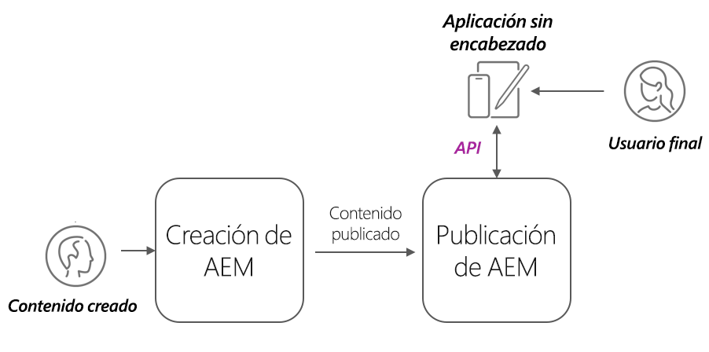

# AEM implementaciones sin encabezado

AEM implementaciones de cliente sin encabezado adoptan muchas formas; SPA alojadas en AEM, SPA externa, sitio web, aplicación móvil o incluso proceso de servidor a servidor.

Según el cliente y cómo se implemente, AEM implementaciones sin encabezado tienen diferentes consideraciones.

## arquitectura de servicio AEM

Antes de explorar las consideraciones de implementación, es imperativo comprender AEM arquitectura lógica y la separación y las funciones de los niveles de servicio de AEM as a Cloud Service. AEM as a Cloud Service consta de dos servicios lógicos:

+ __Autor de AEM__ es el servicio en el que los equipos crean, colaboran y publican fragmentos de contenido (y otros recursos).
+ __AEM Publish__ es el servicio que se publicó en los fragmentos de contenido (y otros recursos) y que se replica para el consumo general.
+ __Vista previa de AEM__ es el servicio que imita el comportamiento de AEM Publish, pero que tiene contenido publicado para fines de vista previa o revisión. AEM Vista previa está diseñada para audiencias internas y no para la entrega general de contenido. El uso de AEM Vista previa es opcional, en función del flujo de trabajo deseado.

Arquitectura de implementación típica AEM as a Cloud Service sin encabezado

AEM clientes sin encabezado que operan con capacidad de producción normalmente interactúan con AEM Publish, que contiene el contenido aprobado y publicado. Los clientes que interactúan con AEM Author deben tener especial cuidado, ya que AEM Author es seguro de forma predeterminada, y requiere autorización para todas las solicitudes, y también puede contener trabajo en curso o contenido no aprobado.

## Implementaciones de cliente sin encabezado

    <!-- Single-page App (SPA) -->
    

       

           

               <figure class="image is-16by9">
                   
               </figure>
           

           

               

                   
<a href="./spa.md" title="Aplicación de una sola página (SPA)">Aplicación de una sola página (SPA)</a>

                   
Obtenga información sobre las consideraciones de implementación para aplicaciones de una sola página (SPA).

                   <a href="./spa.md" class="spectrum-Button spectrum-Button--outline spectrum-Button--primary spectrum-Button--sizeM">
                       Más información
                   </a>
               

           

       

    

<!-- Web component/JS -->

   

       

           <figure class="image is-16by9">
               
           </figure>
       

       

           

               
<a href="./web-component.md" title="Componente web/JS">Componente web/JS</a>

               
Obtenga información sobre las consideraciones de implementación para componentes web y consumidores JavaScript sin encabezado basados en explorador.

               <a href="./web-component.md" class="spectrum-Button spectrum-Button--outline spectrum-Button--primary spectrum-Button--sizeM">
                   Más información
               </a>
           

       

   

<!-- Mobile apps -->

   

       

           <figure class="image is-16by9">
               
           </figure>
       

       

           

               
<a href="./mobile.md" title="Aplicaciones móviles">Aplicación móvil</a>

               
Obtenga información sobre las consideraciones de implementación para aplicaciones móviles.

               <a href="./mobile.md" class="spectrum-Button spectrum-Button--outline spectrum-Button--primary spectrum-Button--sizeM">
                   Más información
               </a>
           

       

   

<!-- Server-to-server apps -->

   

       

           <figure class="image is-16by9">
               
           </figure>
       

       

           

               
<a href="./server-to-server.md" title="Aplicaciones de servidor a servidor">Aplicación de servidor a servidor</a>

               
Obtenga información sobre las consideraciones de implementación para aplicaciones de servidor a servidor

               <a href="./server-to-server.md" class="spectrum-Button spectrum-Button--outline spectrum-Button--primary spectrum-Button--sizeM">
                   Más información
               </a>
           

       

   

