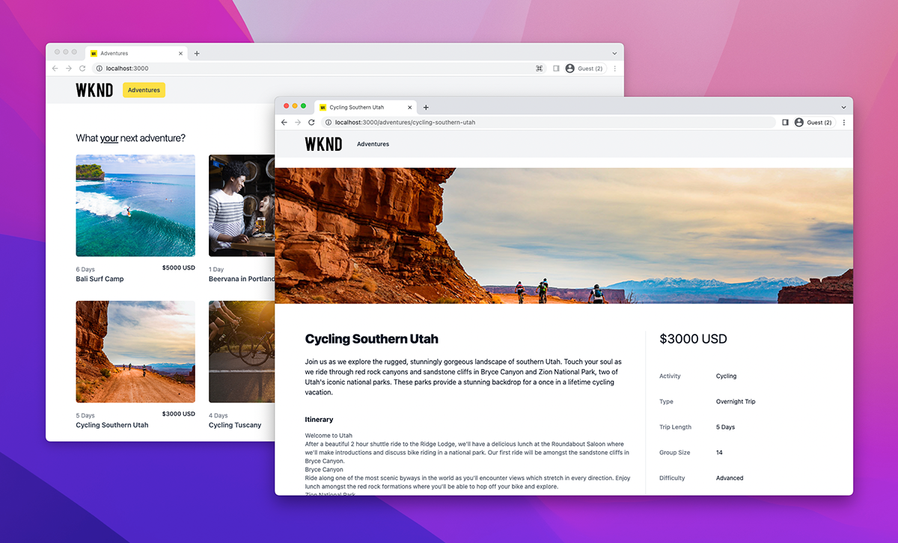

# AEM SPA Implementaciones de Headless

AEM SPA Las implementaciones de aplicación de una sola página () sin encabezado implican aplicaciones basadas en JavaScript AEM creadas con marcos de trabajo como React o Vue, que consumen contenido e interactúan con él de manera sin encabezado, y lo hacen de manera sin encabezado.

SPA AEM SPA La implementación de un que interactúe de manera sin encabezado implica alojar el y hacer que sea accesible a través de un explorador web.

## SPA Host de la

SPA Un recurso está formado por una colección de recursos web nativos: **HTML, CSS y JavaScript**. Estos recursos se generan durante el proceso _build_ (por ejemplo, `npm run build`) y se implementan en un host para que los consuman los usuarios finales.

Hay varias opciones de **alojamiento** según los requisitos de su organización:

1. **Proveedores de nube** como **Azure** o **AWS**.

2. **Alojamiento local** en un **centro de datos** corporativo

3. **Plataformas de alojamiento front-end** como **AWS Amplify**, **Azure App Service**, **Netlify**, **Heroku**, **Vercel**, etc.

## Configuraciones de implementación

SPA AEM SPA AEM La consideración principal al alojar una que interactúa con sin encabezado es si se accede a la a través de un dominio (o host) de la aplicación o en un dominio diferente.  SPA El motivo es que las aplicaciones web se ejecutan en exploradores web y, por lo tanto, están sujetas a las políticas de seguridad de los exploradores web.

### Dominio compartido

SPA AEM Un dominio compartido de y cuando ambos son acceso para usuarios finales del mismo dominio. Por ejemplo:

+ AEM Se tiene acceso a la a través de: `https://wknd.site/`
+ SPA Se accede a la a través de `https://wknd.site/spa`

AEM SPA SPA AEM AEM Dado que se accede a las dos, la y la, desde el mismo dominio, los exploradores web permiten al usuario realizar XHR en puntos finales sin encabezado sin necesidad de CORS y permiten el uso compartido de cookies HTTP (como, por ejemplo, el uso compartido de cookies `login-token`), lo que permite a los exploradores web crear puntos finales sin encabezado, sin necesidad de usar CORS. El uso compartido de estas cookies se realiza de forma conjunta con los navegadores web, lo que permite el uso compartido de cookies HTTP (como, por ejemplo, el uso compartido de cookies de , de la).

SPA AEM SPA AEM Depende de usted cómo se enrute el tráfico de la y la en el dominio compartido: CDN con varios orígenes, servidor HTTP con proxy inverso, alojamiento de la directamente en el dominio compartido, etc.

SPA AEM A continuación, se indican las configuraciones de implementación necesarias para implementaciones de producción de la, cuando se hospedan en el mismo dominio que las implementaciones de.

| SPA se conecta a | AEM Author | Publicación de AEM | AEM Previsualización de |
|---------------------------------------------------:|:----------:|:-----------:|:-----------:|
| [Filtros de Dispatcher](./configurations/dispatcher-filters.md) | ✘ | ✔ | ✔ |
| Uso compartido de recursos de origen cruzado (CORS) | ✘ | ✘ | ✘ |
| AEM anfitriones de | ✘ | ✘ | ✘ |

### Dominios diferentes

SPA AEM Un y un dominio tienen dominios diferentes cuando los usuarios finales de un dominio diferente acceden a ellos. Por ejemplo:

+ AEM Se tiene acceso a la a través de: `https://wknd.site/`
+ SPA Se accede a la a través de `https://wknd-app.site/`

AEM SPA AEM Dado que se accede a los recursos de origen cruzado (CORS) [y a los dominios, los exploradores web aplican directivas de seguridad tales como el acceso compartido de recursos de origen cruzado (CORS)](./configurations/cors.md), y evitan el uso compartido de cookies HTTP (como el uso compartido de cookies `login-token` por parte de los navegadores web).

SPA AEM A continuación, se indican las configuraciones de implementación necesarias para implementaciones de producción de la, cuando se aloja en un dominio diferente al de la ubicación de la aplicación.

| SPA se conecta a | AEM Author | Publicación de AEM | AEM Previsualización de |
|---------------------------------------------------:|:----------:|:-----------:|:-----------:|
| [Filtros de Dispatcher](./configurations/dispatcher-filters.md) | ✘ | ✔ | ✔ |
| [Uso compartido de recursos de origen cruzado (CORS)](./configurations/cors.md) | ✔ | ✔ | ✔ |
| AEM [hosts de la](./configurations/aem-hosts.md) | ✔ | ✔ | ✔ |

#### SPA Implementación de ejemplo en dominios diferentes

SPA SPA AEM En este ejemplo, el se implementa en un dominio de Netlify (`https://main--sparkly-marzipan-b20bf8.netlify.app/`) y el consume las API de GraphQL AEM de los dominios de Publish (`https://publish-p65804-e666805.adobeaemcloud.com`) de la. Las siguientes capturas de pantalla resaltan el requisito CORS.

1. SPA AEM El se sirve desde un dominio de Netlify, pero realiza una llamada XHR a las API de GraphQL de la en un dominio diferente. AEM Esta solicitud entre sitios requiere que [CORS](./configurations/cors.md) se configure en el sitio para permitir que la solicitud del dominio de Netlify acceda a su contenido.

   SPA SPA AEM  de los hosts de y

2. AEM Al inspeccionar la solicitud XHR a la API de GraphQL AEM de la, está presente `Access-Control-Allow-Origin`, lo que indica al explorador web que la solicitud de este dominio de Netlify se permite para acceder a su contenido.

   AEM Si falta el elemento [CORS](./configurations/cors.md) o no incluye el dominio Netlify, el explorador web no responderá a la solicitud XHR e informará de un error CORS.

   AEM 

## Ejemplo de aplicación de una sola página

El Adobe proporciona un ejemplo de aplicación de una sola página codificada en React.

<!-- React app -->

   

       

           <figure class="image is-16by9">
               
           </figure>
       

       

           

               
<a href="../example-apps/react-app.md" title="Aplicación React">Aplicación React</a>

               
AEM Aplicación de ejemplo de una sola página, escrita en React, que consume contenido de las API de GraphQL sin encabezado, sin encabezado, que se utilizan para la creación de contenido.

               <a href="../example-apps/react-app.md" class="spectrum-Button spectrum-Button--outline spectrum-Button--primary spectrum-Button--sizeM">
                   Ver ejemplo
               </a>
           

       

   

<!-- Next.js app -->

   

       

           <figure class="image is-16by9">
               
           </figure>
       

       

           

               
<a href="../example-apps/next-js.md" title="Aplicación Next.js">Aplicación Next.js</a>

               
AEM Aplicación de ejemplo de una sola página, escrita en Next.js, que consume contenido de las API de GraphQL sin encabezado de la aplicación de la interfaz de usuario sin encabezado.

               <a href="../example-apps/next-js.md" class="spectrum-Button spectrum-Button--outline spectrum-Button--primary spectrum-Button--sizeM">
                   Ver ejemplo
               </a>
           

       

   

