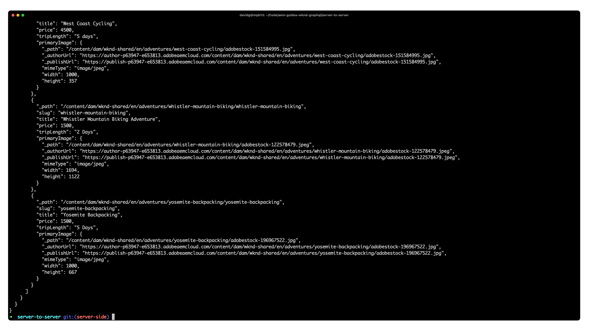

# Aplicación Node.js de servidor a servidor

Las aplicaciones de ejemplo son una buena manera de explorar las capacidades sin objetivos de Adobe Experience Manager (AEM). Esta aplicación servidor a servidor muestra cómo consultar contenido mediante las API de GraphQL AEM mediante consultas persistentes e imprimirlo en terminal.



Consulte la [código fuente en GitHub](https://github.com/adobe/aem-guides-wknd-graphql/tree/main/server-to-server-app)

## Requisitos previos {#prerequisites}

Las siguientes herramientas deben instalarse localmente:

+ [Node.js v10+](https://nodejs.org/en/)
+ [npm 6+](https://www.npmjs.com/)
+ [Git](https://git-scm.com/)

## AEM requisitos

La aplicación Node.js funciona con las siguientes opciones de implementación AEM. Todas las implementaciones requieren la variable [Sitio WKND v2.0.0+](https://github.com/adobe/aem-guides-wknd/releases/latest) para instalar.

+ [AEM as a Cloud Service](https://experienceleague.adobe.com/docs/experience-manager-cloud-service/content/implementing/deploying/overview.html)
+ Opcionalmente, [credenciales del servicio](https://experienceleague.adobe.com/docs/experience-manager-cloud-service/content/implementing/developing/generating-access-tokens-for-server-side-apis.html) si autoriza solicitudes (por ejemplo, conectándose al servicio AEM Author).

Esta aplicación Node.js puede conectarse a AEM Author o AEM Publish en función de los parámetros de la línea de comandos.

## Utilización

1. Clonar el `adobe/aem-guides-wknd-graphql` repositorio:

   ```shell
   $ git clone git@github.com:adobe/aem-guides-wknd-graphql.git
   ```

1. Abra un terminal y ejecute los comandos:

   ```shell
   $ cd aem-guides-wknd-graphql/server-to-server-app
   $ npm install
   ```

1. La aplicación se puede ejecutar mediante el comando :

   ```
   $ node index.js <AEM_HOST> <OPTIONAL_SERVICE_CONFIG_FILE_PATH>
   ```

   Por ejemplo, para ejecutar la aplicación con AEM Publish sin autorización:

   ```shell
   $ node index.js https://publish-p123-e789.adobeaemcloud.com
   ```

   Para ejecutar la aplicación contra AEM Author con autorización:

   ```shell
   $ node index.js https://author-p123-e456.adobeaemcloud.com ./service-config.json
   ```

1. Una lista JSON de las aventuras del sitio de referencia WKND debe imprimirse en el terminal.

## El código

A continuación se muestra un resumen de cómo se crea la aplicación Node.js de servidor a servidor, cómo se conecta a AEM sin encabezado para recuperar contenido mediante consultas persistentes de GraphQL y cómo se presentan esos datos. El código completo se puede encontrar en [GitHub](https://github.com/adobe/aem-guides-wknd-graphql/tree/main/server-to-server-app).

El caso de uso común para aplicaciones sin encabezado de servidor a servidor AEM es sincronizar los datos de fragmento de contenido de AEM a otros sistemas, sin embargo, esta aplicación es intencionalmente sencilla e imprime los resultados JSON de la consulta persistente.

### Consultas persistentes

Siguiendo AEM prácticas recomendadas sin encabezado, la aplicación utiliza AEM consultas persistentes de GraphQL para consultar datos de aventura. La aplicación utiliza dos consultas persistentes:

+ `wknd/adventures-all` consulta persistente, que devuelve todas las aventuras en AEM con un conjunto abreviado de propiedades. Esta consulta persistente impulsa la lista de aventuras de la vista inicial.

```
# Retrieves a list of all adventures
{
    adventureList {
        items {
            _path
            slug
            title
            price
            tripLength
            primaryImage {
                ... on ImageRef {
                _path
                mimeType
                width
                height
                }
            }
        }
    }
}
```

### Crear AEM cliente sin encabezado

```javascript
const { AEMHeadless, getToken } = require('@adobe/aem-headless-client-nodejs');

async function run() { 

    // Parse the AEM host, and optional service credentials from the command line arguments
    const args = process.argv.slice(2);
    const aemHost = args.length > 0 ? args[0] : null;                // Example: https://author-p123-e456.adobeaemcloud.com
    const serviceCredentialsFile = args.length > 1 ? args[1] : null; // Example: ./service-config.json

    // If service credentials are provided via command line argument,
    // use `getToken(..)` to exchange them with Adobe IMS for an AEM access token 
    let accessToken;
    if (serviceCredentialsFile) {
        accessToken = (await getToken(serviceCredentialsFile)).accessToken;
    }

    // Instantiate withe AEM Headless client to query AEM GraphQL APIs
    // The endpoint is left blank since only persisted queries should be used to query AEM's GraphQL APIs
    const aemHeadlessClient = new AEMHeadless({
        serviceURL: aemHost,
        endpoint: '',           // Avoid non-persisted queries
        auth: accessToken       // accessToken only set if the 2nd command line parameter is set
    })
    ...
}
```


### Ejecutar consulta persistente de GraphQL

AEM las consultas persistentes se ejecutan a través de GET HTTP y, por lo tanto, la variable [AEM cliente sin encabezado para Node.js](https://github.com/adobe/aem-headless-client-nodejs) se usa para [ejecutar las consultas de GraphQL persistentes](https://github.com/adobe/aem-headless-client-nodejs#within-asyncawait) contra AEM y recupera el contenido de aventura.

La consulta persistente se invoca llamando a `aemHeadlessClient.runPersistedQuery(...)`y pasando el nombre de consulta de GraphQL persistente. Una vez que GraphQL devuelva los datos, pásela a la variable simplificada `doSomethingWithDataFromAEM(..)` , que imprime los resultados, pero normalmente enviaría los datos a otro sistema, o generaría algunos resultados basados en los datos recuperados.

```js
// index.js

async function run() { 
    ...
    try {
        // Retrieve the data from AEM GraphQL APIs
        data = await aemHeadlessClient.runPersistedQuery('wknd-shared/adventures-all')
        
        // Do something with the data from AEM. 
        // A common use case is sending the data to another system.
        await doSomethingWithDataFromAEM(data);
    } catch (e) {
        console.error(e.toJSON())
    }
}
```
