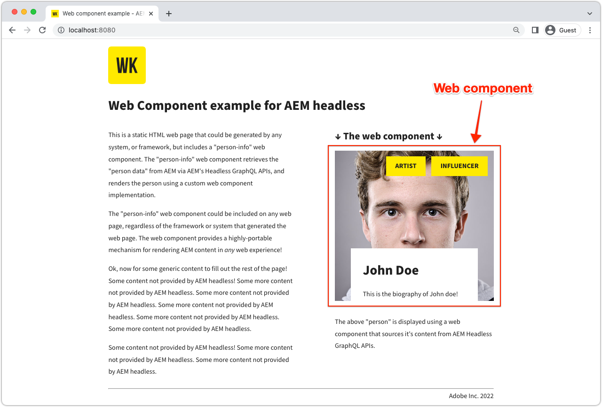

# Componente web

Las aplicaciones de ejemplo son una buena manera de explorar las capacidades sin encabezado de Adobe Experience Manager AEM (). AEM Esta aplicación de componente web muestra cómo realizar consultas en el contenido utilizando API de GraphQL de la aplicación, utilizando consultas persistentes y representando una parte de la interfaz de usuario, todo ello realizado utilizando código JavaScript puro.



Ver el [código fuente en GitHub](https://github.com/adobe/aem-guides-wknd-graphql/tree/main/web-component)

## Requisitos previos {#prerequisites}

Las siguientes herramientas deben instalarse localmente:

+ [Node.js v18](https://nodejs.org/en/)
+ [Git](https://git-scm.com/)

## AEM requisitos de

AEM El componente web funciona con las siguientes opciones de implementación de.

+ [AEM as a Cloud Service](https://experienceleague.adobe.com/docs/experience-manager-cloud-service/content/implementing/deploying/overview.html?lang=es)
+ Configuración local mediante [el SDK de AEM Cloud Service](https://experienceleague.adobe.com/docs/experience-manager-learn/cloud-service/local-development-environment-set-up/overview.html?lang=es)
   + Requiere [JDK 11](https://experience.adobe.com/#/downloads/content/software-distribution/en/general.html?1_group.propertyvalues.property=.%2Fjcr%3Acontent%2Fmetadata%2Fdc%3AsoftwareType&amp;1_group.propertyvalues.operation=equals&amp;1_group.propertyvalues.0_values=software-type%3Atooling&amp;fulltext=Oracle%7E+JDK%7E+11%7E&amp;orderby=%40jcr%3Acontent%2Fjcr%3AlastModified&amp;orderby.sort=desc&amp;layout=list&amp;p.offset=0&amp;p.limit=14) AEM AEM (si se conecta al SDK local de la versión 6.5 o del SDK de la)

Esta aplicación de ejemplo se basa en [basic-tutorial-solution.content.zip](../multi-step/assets/explore-graphql-api/basic-tutorial-solution.content.zip) que se va a instalar y los necesarios [configuraciones de implementación](../deployment/web-component.md) están en su lugar.


>[!IMPORTANT]
>
>El componente web está diseñado para conectarse a un __AEM Publicación de__ AEM , sin embargo, puede obtener contenido de Autor de la fuente si se proporciona autenticación en la interfaz de usuario del componente web. [`person.js`](https://github.com/adobe/aem-guides-wknd-graphql/blob/main/web-component/src/person.js#L11) archivo.

## Utilización

1. Clonar el `adobe/aem-guides-wknd-graphql` repositorio:

   ```shell
   $ git clone git@github.com:adobe/aem-guides-wknd-graphql.git
   ```

1. Vaya a `web-component` subdirectorio.

   ```shell
   $ cd aem-guides-wknd-graphql/web-component
   ```

1. Edite el `.../src/person.js` AEM para incluir los detalles de conexión de la:

   En el `aemHeadlessService` objeto, actualice el `aemHost` AEM para que apunte a su servicio Publicación de la.

   ```plain
   # AEM Server namespace
   aemHost=https://publish-p123-e456.adobeaemcloud.com
   
   # AEM GraphQL API and Persisted Query Details
   graphqlAPIEndpoint=graphql/execute.json
   projectName=my-project
   persistedQueryName=person-by-name
   queryParamName=name
   ```

   AEM Si se conecta a un servicio de autor de la, en la variable `aemCredentials` AEM , proporcione las credenciales de usuario de la aplicación local.

   ```plain
   # For Basic auth, use AEM ['user','pass'] pair (for example, when connecting to local AEM Author instance)
   username=admin
   password=admin
   ```

1. Abra un terminal y ejecute los comandos desde `aem-guides-wknd-graphql/web-component`:

   ```shell
   $ npm install
   $ npm start
   ```

1. Una nueva ventana del explorador abre la página del HTML estático que incrusta el componente web en [http://localhost:8080](http://localhost:8080).
1. El _Información de persona_ El componente web se muestra en la página web.

## El código

AEM A continuación se muestra un resumen de cómo se crea el componente web, cómo se conecta a las consultas sin encabezado para recuperar contenido mediante consultas persistentes de GraphQL y cómo se presentan esos datos. El código completo se encuentra en [GitHub](https://github.com/adobe/aem-guides-wknd-graphql/tree/main/web-component).

### Etiqueta de HTML de componente web

Un componente web reutilizable (también conocido como elemento personalizado) `<person-info>` se añade a `../src/assets/aem-headless.html` página del HTML. Admite `host` y `query-param-value` atributos para controlar el comportamiento del componente. El `host` anulaciones de valor del atributo `aemHost` valor de `aemHeadlessService` objeto en `person.js`, y `query-param-value` se utiliza para seleccionar la persona que se va a procesar.

```html
    <person-info 
        host="https://publish-p123-e456.adobeaemcloud.com"
        query-param-value="John Doe">
    </person-info>
```

### Implementación de componentes web

El `person.js` define la funcionalidad del componente web y, a continuación, se muestran los aspectos destacados de la misma.

#### Implementación del elemento PersonInfo

El `<person-info>` el objeto class del elemento personalizado define la funcionalidad mediante el uso del `connectedCallback()` métodos de ciclo de vida, adjuntar una raíz central, recuperar consultas persistentes de GraphQL y manipular DOM para crear la estructura DOM central interna del elemento personalizado.

```javascript
// Create a Class for our Custom Element (person-info)
class PersonInfo extends HTMLElement {

    constructor() {
        ...
        // Create a shadow root
        const shadowRoot = this.attachShadow({ mode: "open" });
        ...
    }

    ...

    // lifecycle callback :: When custom element is appended to document
    connectedCallback() {
        ...
        // Fetch GraphQL persisted query
        this.fetchPersonByNamePersistedQuery(headlessAPIURL, queryParamValue).then(
            ({ data, err }) => {
                if (err) {
                    console.log("Error while fetching data");
                } else if (data?.personList?.items.length === 1) {
                    // DOM manipulation
                    this.renderPersonInfoViaTemplate(data.personList.items[0], host);
                } else {
                    console.log(`Cannot find person with name: ${queryParamValue}`);
                }
            }
        );
    }

    ...

    //Fetch API makes HTTP GET to AEM GraphQL persisted query
    async fetchPersonByNamePersistedQuery(headlessAPIURL, queryParamValue) {
        ...
        const response = await fetch(
            `${headlessAPIURL}/${aemHeadlessService.persistedQueryName}${encodedParam}`,
            fetchOptions
        );
        ...
    }

    // DOM manipulation to create the custom element's internal shadow DOM structure
    renderPersonInfoViaTemplate(person, host){
        ...
        const personTemplateElement = document.getElementById('person-template');
        const templateContent = personTemplateElement.content;
        const personImgElement = templateContent.querySelector('.person_image');
        personImgElement.setAttribute('src',
            host + (person.profilePicture._dynamicUrl || person.profilePicture._path));
        personImgElement.setAttribute('alt', person.fullName);
        ...
        this.shadowRoot.appendChild(templateContent.cloneNode(true));
    }
}
```

#### Registre el `<person-info>` elemento

```javascript
    // Define the person-info element
    customElements.define("person-info", PersonInfo);
```

### Uso compartido de recursos de origen cruzado (CORS)

AEM AEM Este componente web se basa en una configuración CORS basada en el que se ejecuta en el entorno de destino de la aplicación y supone que la página host se ejecuta en `http://localhost:8080` AEM en el modo de desarrollo y a continuación se muestra una configuración OSGi de CORS de ejemplo para el servicio local de creación de.

Consulte las [configuraciones de implementación](../deployment/web-component.md) AEM para el servicio respectivo de la.
