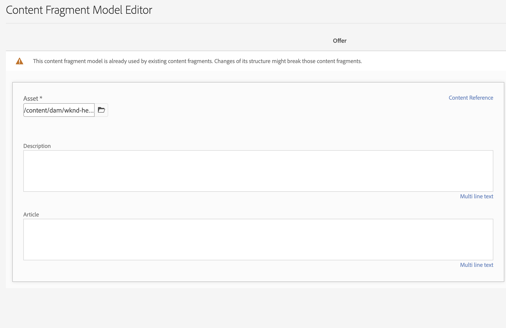

# Modelado de contenido

Le damos la bienvenida al capítulo del tutorial sobre fragmentos de contenido y puntos finales de GraphQL en Adobe Experience Manager (AEM). Explicaremos el uso de los fragmentos de contenido, la creación de modelos de fragmentos y el uso de puntos de conexión de GraphQL en AEM.

Los fragmentos de contenido ofrecen un enfoque estructurado para administrar el contenido en varios canales, lo que proporciona flexibilidad y reutilización. Al habilitar los fragmentos de contenido en AEM, se puede crear contenido modular, mejorar la coherencia y la adaptabilidad.

En primer lugar, le guiaremos a través de la activación de los fragmentos de contenido en AEM, que cubren las configuraciones y ajustes necesarios para una integración perfecta.

A continuación, se explica la creación de modelos de fragmento, que definen la estructura y los atributos. Aprenda a diseñar modelos alineados con los requisitos de contenido y a administrarlos de forma eficaz.

A continuación, se mostrará la creación de fragmentos de contenido a partir de los modelos, con instrucciones paso a paso para la creación y publicación.

Además, exploraremos la definición de puntos finales de AEM GraphQL. GraphQL recupera datos de AEM de forma eficaz y configuraremos los puntos de conexión para exponer los datos deseados. Las consultas persistentes optimizarán el rendimiento y el almacenamiento en caché.

A lo largo del tutorial, proporcionaremos explicaciones, ejemplos de código y sugerencias prácticas. Al final, tendrá las habilidades para habilitar fragmentos de contenido, crear modelos de fragmentos, generar fragmentos y definir puntos finales y consultas persistentes de AEM GraphQL. ¡Vamos a empezar!

## Configuración según el contexto

1. Vaya a __Herramientas > Explorador de configuración__ para crear una configuración para la experiencia sin encabezado.

   

   Proporcione un __título__ y __nombre__, y compruebe __Consultas persistentes de GraphQL__ y __Modelos de fragmentos de contenido__.


## Modelos de fragmento de contenido

1. Vaya a __Herramientas > Modelos de fragmento de contenido__ y seleccione la carpeta con el nombre de la configuración creada en el paso 1.

   

1. Dentro de la carpeta, seleccione __Crear__ y asigne un nombre al modelo __Teaser__. Agregue los siguientes tipos de datos al modelo __Teaser__.

   | Tipo de datos | Nombre | Requerido | Opciones |
   |----------|------|----------|---------|
   | Referencia de contenido | Recurso | sí | Si lo desea, añada una imagen predeterminada. Ejemplo: /content/dam/wknd-headless/assets/AdobeStock_307513975.mp4 |
   | Texto de línea única | Título | sí |
   | Texto de línea única | Pre-Title | no |
   | Texto multilínea | Descripción | no | Asegúrese de que el tipo predeterminado sea texto enriquecido |
   | Lista desglosada | Estilo | sí | Procesar como menú desplegable. Las opciones son Hero -> Hero y Destacado -> destacado |

   

1. Dentro de la carpeta, cree un segundo modelo llamado __Oferta__. Haga clic en Crear y asigne al modelo el nombre &quot;Oferta&quot; y añada los siguientes tipos de datos:

   | Tipo de datos | Nombre | Requerido | Opciones |
   |----------|------|----------|---------|
   | Referencia de contenido | Recurso | sí | Agregar imagen predeterminada. Ejemplo: `/content/dam/wknd-headless/assets/AdobeStock_238607111.jpeg` |
   | Texto multilínea | Descripción | no |  |
   | Texto multilínea | Artículo | no |  |

   

1. Dentro de la carpeta, cree un tercer modelo denominado __Lista de imágenes__. Haga clic en Crear y asigne al modelo el nombre &quot;Lista de imágenes&quot; y añada los siguientes tipos de datos:

   | Tipo de datos | Nombre | Requerido | Opciones |
   |----------|------|----------|---------|
   | Referencia al fragmento | Elementos de la lista | sí | Procesar como campo múltiple. El modelo de fragmento de contenido permitido es Oferta. |

   

## Fragmentos de contenido

1. Ahora, vaya a Assets y cree una carpeta para el nuevo sitio. Haga clic en crear y asigne un nombre a la carpeta.

   

1. Una vez creada la carpeta, selecciónela y abra sus __Propiedades__.
1. En la ficha __Configuraciones en la nube__ de la carpeta, seleccione la configuración [creada anteriormente](#enable-content-fragments-and-graphql).

   

   Haga clic en la carpeta nueva y cree un teaser. Haga clic en __Crear__ y en __Fragmento de contenido__ y seleccione el modelo __Teaser__. Asigne un nombre al modelo __Hero__ y haga clic en __Crear__.

   | Nombre | Notas |
   |----------|------|
   | Recurso | Deje como valor predeterminado o elija un recurso diferente (vídeo o imagen) |
   | Título | `Explore. Discover. Live.` |
   | Pre-Title | `Join use for your next adventure.` |
   | Descripción | Dejar en blanco |
   | Estilo | `Hero` |

   

## Extremos de GraphQL

1. Vaya a __Herramientas > GraphQL__

   

1. Haga clic en __Crear__, asigne un nombre al nuevo extremo y elija la configuración recién creada.

   

## Consultas persistentes de GraphQL

1. Vamos a probar el nuevo punto final. Vaya a __Herramientas > Editor de consultas de GraphQL__ y elija el punto final en la lista desplegable de la parte superior derecha de la ventana.

1. En el editor de consultas, cree algunas consultas diferentes.


   ```graphql
   {
       teaserList {
           items {
           title
           }
       }
   }
   ```

   Debe obtener una lista que contenga el fragmento único creado [arriba](#create-content).

   Para este ejercicio, cree una consulta completa que utilice la aplicación sin encabezado de AEM. Cree una consulta que devuelva un solo teaser por ruta. En el editor de consultas, introduzca la siguiente consulta:

   ```graphql
   query TeaserByPath($path: String!) {
   component: teaserByPath(_path: $path) {
       item {
       __typename
       _path
       _metadata {
           stringMetadata {
           name
           value
           }
       }
       title
       preTitle
       style
       asset {
           ... on MultimediaRef {
           __typename
           _authorUrl
           _publishUrl
           format
           }
           ... on ImageRef {
           __typename
           _authorUrl
           _publishUrl
           mimeType
           width
           height
           }
       }
       description {
           html
           plaintext
       }
       }
   }
   }
   ```

   En la entrada __variables de consulta__ de la parte inferior, escriba:

   ```json
   {
       "path": "/content/dam/pure-headless/hero"
   }
   ```

   >[!NOTE]
   >
   > Es posible que necesite ajustar la variable de consulta `path` en función de los nombres de carpeta y fragmento.


   Ejecute la consulta para recibir los resultados del fragmento de contenido creado anteriormente.

1. Haga clic en __Guardar__ para mantener (guardar) la consulta y asigne un nombre a la consulta __teaser__. Esto nos permite hacer referencia a la consulta por su nombre en la aplicación.

## Pasos siguientes

¡Enhorabuena! Ha configurado correctamente AEM as a Cloud Service para permitir la creación de fragmentos de contenido y extremos de GraphQL. También ha creado un modelo de fragmento de contenido y un fragmento de contenido, y ha definido un punto final de GraphQL y una consulta persistente. Ya está listo para pasar al siguiente capítulo del tutorial, donde aprenderá a crear una aplicación React de AEM sin encabezado que consuma los fragmentos de contenido y el extremo de GraphQL que ha creado en este capítulo.

[Capítulo siguiente: API de AEM sin encabezado y React](./2-aem-headless-apis-and-react.md)
