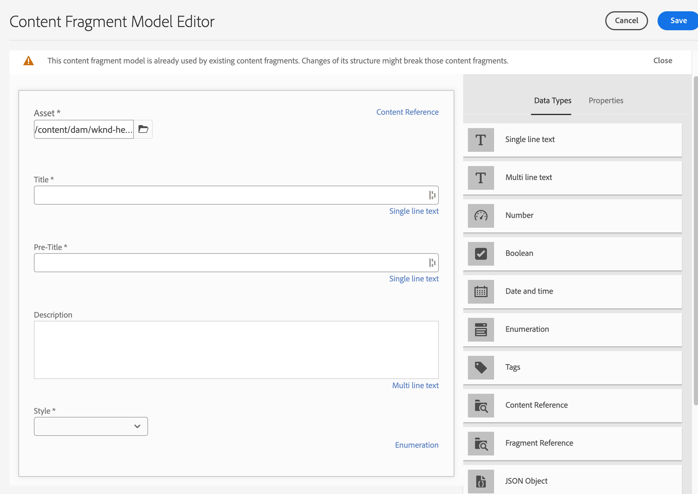

# Modelado de contenido

Le damos la bienvenida al capítulo del tutorial sobre fragmentos de contenido y extremos de GraphQL en Adobe Experience Manager (AEM). Trataremos de aprovechar los fragmentos de contenido, crear modelos de fragmento y usar extremos de GraphQL en AEM.

Los fragmentos de contenido ofrecen un enfoque estructurado para administrar el contenido en todos los canales, lo que proporciona flexibilidad y reutilización. Habilitar los fragmentos de contenido en AEM permite la creación de contenido modular, lo que mejora la coherencia y la adaptabilidad.

En primer lugar, le guiaremos a través de la activación de fragmentos de contenido en AEM, que abarcan las configuraciones y configuraciones necesarias para una integración sin problemas.

A continuación, trataremos la creación de modelos de fragmento, que definen estructura y atributos. Aprenda a diseñar modelos alineados con sus necesidades de contenido y a administrarlos de forma eficaz.

A continuación, demostraremos la creación de fragmentos de contenido a partir de los modelos, proporcionando directrices paso a paso sobre la creación y publicación.

Además, analizaremos la definición de AEM extremos de GraphQL. GraphQL recupera datos de forma eficaz desde AEM y configuramos y configuramos los extremos para exponer los datos deseados. Las consultas persistentes optimizarán el rendimiento y el almacenamiento en caché.

A lo largo del tutorial, proporcionaremos explicaciones, ejemplos de código y sugerencias prácticas. Al final, tendrá las habilidades para habilitar los fragmentos de contenido, crear modelos de fragmento, generar fragmentos y definir AEM extremos de GraphQL y consultas persistentes. ¡Empecemos!

## Configuración según el contexto

1. Vaya a __Herramientas > Explorador de configuración__ para crear una configuración para la experiencia sin encabezado.

   

   Proporcione un __title__ y __name__ y compruebe __Consultas persistentes de GraphQL__ y __Modelos de fragmento de contenido__.


## Modelos de fragmento de contenido

1. Vaya a __Herramientas > Modelos de fragmento de contenido__ y seleccione la carpeta con el nombre de la configuración creada en el paso 1.

   

1. Dentro de la carpeta, seleccione __Crear__ y asigne un nombre al modelo __Teaser__. Agregue los siguientes tipos de datos a la __Teaser__ modelo.

   | Tipo de datos | Nombre | Requerido | Opciones |
   |----------|------|----------|---------|
   | Referencia de contenido | Recurso | sí | Añada una imagen predeterminada si lo desea. Ejemplo: /content/dam/wknd-headless/assets/AdobeStock_307513975.mp4 |
   | Texto de línea única | Título | sí |
   | Texto de línea única | Título previo | no |
   | Texto multilínea | Descripción | no | Asegúrese de que el tipo predeterminado sea texto enriquecido |
   | Lista desglosada | Estilo | sí | Representar como menú desplegable. Las opciones son Hero -> Héroe y Destacado -> Destacado |

   

1. Dentro de la carpeta, cree un segundo modelo denominado __Oferta__. Haga clic en crear y asigne al modelo el nombre &quot;Oferta&quot; y añada los siguientes tipos de datos:

   | Tipo de datos | Nombre | Requerido | Opciones |
   |----------|------|----------|---------|
   | Referencia de contenido | Recurso | sí | Añada la imagen predeterminada. Ejemplo: `/content/dam/wknd-headless/assets/AdobeStock_238607111.jpeg` |
   | Texto multilínea | Descripción | no |  |
   | Texto multilínea | Artículo | no |  |

   

1. Dentro de la carpeta, cree un tercer modelo denominado __Lista de imágenes__. Haga clic en crear y asigne al modelo el nombre &quot;Lista de imágenes&quot; y añada los siguientes tipos de datos:

   | Tipo de datos | Nombre | Requerido | Opciones |
   |----------|------|----------|---------|
   | Referencia al fragmento | Elementos de la lista | sí | Representar como campo múltiple. El modelo de fragmento de contenido permitido es Oferta. |

   

## Fragmentos de contenido

1. Ahora, vaya a Recursos y cree una carpeta para el nuevo sitio. Haga clic en crear y asigne un nombre a la carpeta.

   

1. Una vez creada la carpeta, selecciónela y ábrala __Propiedades__.
1. En la carpeta __Configuraciones de nube__ , seleccione la configuración [creado anteriormente](#enable-content-fragments-and-graphql).

   

   Haga clic en la nueva carpeta y cree un teaser. Haga clic en __Crear__ y __Fragmento de contenido__ y seleccione __Teaser__ modelo. Asigne un nombre al modelo __Hero__ y haga clic en __Crear__.

   | Nombre | Notas |
   |----------|------|
   | Recurso | Deje como valor predeterminado o elija un recurso diferente (vídeo o imagen) |
   | Título | `Explore. Discover. Live.` |
   | Título previo | `Join use for your next adventure.` |
   | Descripción | Dejar en blanco |
   | Estilo | `Hero` |

   

## Extremos de GraphQL

1. Vaya a __Herramientas > GraphQL__

   

1. Haga clic en __Crear__ y asigne un nombre al nuevo punto final y elija la configuración recién creada.

   

## Consultas persistentes de GraphQL

1. Vamos a probar el nuevo punto final. Vaya a __Herramientas > GraphQL Query Editor__ y elija nuestro punto final para la lista desplegable en la parte superior derecha de la ventana.

1. En el editor de consultas, cree algunas consultas diferentes.


   ```graphql
   {
       teaserList {
           items {
           title
           }
       }
   }
   ```

   Debe obtener una lista que contenga el fragmento único creado [above](#create-content).

   Para este ejercicio, cree una consulta completa que utilice la aplicación AEM sin encabezado. Cree una consulta que devuelva un solo teaser por ruta. En el editor de consultas, introduzca la siguiente consulta:

   ```graphql
   query TeaserByPath($path: String!) {
   component: teaserByPath(_path: $path) {
       item {
       __typename
       _path
       _metadata {
           stringMetadata {
           name
           value
           }
       }
       title
       preTitle
       style
       asset {
           ... on MultimediaRef {
           __typename
           _authorUrl
           _publishUrl
           format
           }
           ... on ImageRef {
           __typename
           _authorUrl
           _publishUrl
           mimeType
           width
           height
           }
       }
       description {
           html
           plaintext
       }
       }
   }
   }
   ```

   En el __variables de consulta__ en la parte inferior, escriba:

   ```json
   {
       "path": "/content/dam/pure-headless/hero"
   }
   ```

   >[!NOTE]
   >
   > Es posible que necesite ajustar la variable de consulta `path` se basa en los nombres de carpeta y de fragmento.


   Ejecute la consulta para recibir los resultados del fragmento de contenido creado anteriormente.

1. Haga clic en __Guardar__  para mantener (guardar) la consulta y asignarle un nombre __teaser__. Esto nos permite hacer referencia a la consulta por su nombre en la aplicación.

## Pasos siguientes

Felicitaciones. Ha configurado correctamente AEM as a Cloud Service para permitir la creación de fragmentos de contenido y extremos de GraphQL. También ha creado un modelo de fragmento de contenido y un fragmento de contenido, y ha definido un extremo de GraphQL y una consulta persistente. Ya está listo para pasar al siguiente capítulo del tutorial, en el que aprenderá a crear una aplicación React sin encabezado de AEM que consuma los fragmentos de contenido y el punto final de GraphQL que ha creado en este capítulo.

[Capítulo siguiente: AEM API sin encabezado y React](./2-aem-headless-apis-and-react.md)