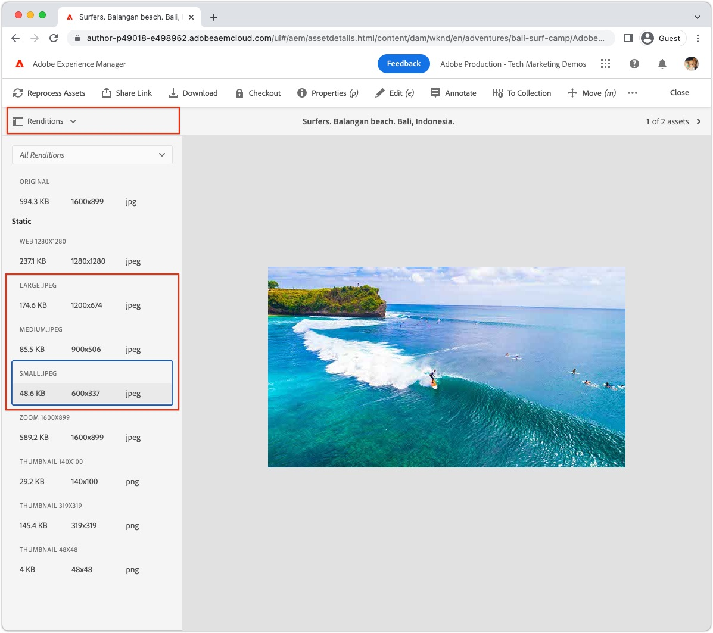

# Imágenes con AEM sin encabezado {#images-with-aem-headless}

Las imágenes son un aspecto crítico de [desarrollo de experiencias ricas, atractivas AEM sin objetivos](https://experienceleague.adobe.com/docs/experience-manager-learn/getting-started-with-aem-headless/graphql/multi-step/overview.html?lang=es). AEM sin encabezado admite la administración de recursos de imagen y su entrega optimizado.

Los fragmentos de contenido utilizados en AEM modelado de contenido sin encabezado suelen hacer referencia a recursos de imagen que se van a mostrar en la experiencia sin encabezado. AEM las consultas de GraphQL se pueden escribir para proporcionar direcciones URL a imágenes en función de desde dónde se hace referencia a la imagen.

La variable `ImageRef` El tipo tiene tres opciones de URL para las referencias de contenido:

+ `_path` es la ruta a la que se hace referencia en AEM y no incluye un origen AEM (nombre de host)
+ `_authorUrl` es la dirección URL completa del recurso de imagen en AEM Author
   + [Autor de AEM](https://experienceleague.adobe.com/docs/experience-manager-learn/cloud-service/underlying-technology/introduction-author-publish.html) se puede utilizar para obtener una vista previa de la aplicación sin encabezado.
+ `_publishUrl` es la dirección URL completa del recurso de imagen en AEM Publish
   + [AEM Publish](https://experienceleague.adobe.com/docs/experience-manager-learn/cloud-service/underlying-technology/introduction-author-publish.html) es normalmente desde donde la implementación de producción de la aplicación sin periféricos muestra imágenes.

La mejor forma de utilizar los campos es según los siguientes criterios:

| Campos ImageRef | Aplicación web del cliente ofrecida desde AEM | La aplicación de cliente consulta al autor de AEM | La aplicación del cliente consulta AEM Publish |
|--------------------|:------------------------------:|:-----------------------------:|:------------------------------:|
| `_path` | š | ✓ (La aplicación debe especificar el host en la dirección URL) | ✓ (La aplicación debe especificar el host en la dirección URL) |
| `_authorUrl` | ü | š | ü |
| `_publishUrl` | ü | ü | š |

Uso de `_authorUrl` y `_publishUrl` debe coincidir con el extremo de AEM GraphQL que se está utilizando para generar la respuesta de GraphQL.

>[!CONTEXTUALHELP]
>id="aemcloud_learn_headless_graphql_images"
>title="Uso de imágenes"
>abstract="Descubra cómo AEM Headless admite la administración de recursos de imagen y su entrega optimizado."

## Modelo de fragmento de contenido

Asegúrese de que el campo Fragmento de contenido que contiene la referencia de imagen sea del __referencia de contenido__ tipo de datos.

Los tipos de campo se revisan en el [Modelo de fragmento de contenido](https://experienceleague.adobe.com/docs/experience-manager-cloud-service/content/assets/content-fragments/content-fragments-models.html), seleccionando el campo e inspeccionando el __Propiedades__ a la derecha.


## Consulta persistente de GraphQL

En la consulta de GraphQL, devuelva el campo como `ImageRef` y solicite los campos correspondientes `_path`, `_authorUrl`o `_publishUrl` requerida por su aplicación. Por ejemplo, para consultar una aventura en la [Proyecto de demostración de referencia WKND](https://experienceleague.adobe.com/docs/experience-manager-cloud-service/content/onboarding/demo-add-on/create-site.html) e incluyendo la URL de imagen para las referencias de recurso de imagen en su `primaryImage` , se puede realizar con una nueva consulta persistente `wknd-shared/adventure-image-by-path` definido como:

```graphql
query ($path: String!) {
  adventureByPath(_path: $path) {
    item {
      title,
      primaryImage {
        ... on ImageRef {
          _path
          _authorUrl
          _publishUrl
        }
      }
    }
  }
}
```

La variable `$path` se usa en la variable `_path` requiere la ruta completa al fragmento de contenido (por ejemplo `/content/dam/wknd-shared/en/adventures/bali-surf-camp/bali-surf-camp`).

## Respuesta de GraphQL

La respuesta JSON resultante contiene los campos solicitados que contienen las direcciones URL de los recursos de imagen.

```json
{
  "data": {
    "adventureByPath": {
      "item": {
        "adventurePrimaryImage": {
          "_path": "/content/dam/wknd-shared/en/adventures/bali-surf-camp/adobestock-175749320.jpg",
          "_authorUrl": "https://author-p123-e456.adobeaemcloud.com/content/dam/wknd-shared/en/adventures/bali-surf-camp/adobestock-175749320.jpg",
          "_publishUrl": "https://publish-p123-e789.adobeaemcloud.com/content/dam/wknd-shared/en/adventures/bali-surf-camp/adobestock-175749320.jpg"
        }
      }
    }
  }
}
```

Para cargar la imagen a la que se hace referencia en la aplicación, utilice el campo correspondiente. `_path`, `_authorUrl`o `_publishUrl` del `adventurePrimaryImage` como URL de origen de la imagen.

Los dominios de la variable `_authorUrl` y `_publishUrl` se definen automáticamente mediante AEM as a Cloud Service mediante la variable [Externalizador](https://experienceleague.adobe.com/docs/experience-manager-cloud-service/content/implementing/developer-tools/externalizer.html).

En React, la visualización de la imagen desde AEM Publish tiene el siguiente aspecto:

```html

```

## Representaciones de imágenes

Compatibilidad con recursos de imagen personalizables [representaciones](../../../assets/authoring/renditions.md), que son representaciones alternativas del recurso original. Las representaciones personalizadas pueden ayudar en la optimización de una experiencia sin objetivos. En lugar de solicitar el recurso de imagen original, que suele ser un archivo grande de alta resolución, la aplicación sin encabezado puede solicitar representaciones optimizadas.

### Crear representaciones

Los administradores de AEM Assets definen las representaciones personalizadas mediante Perfiles de procesamiento. A continuación, los perfiles de procesamiento se pueden aplicar a árboles de carpetas o recursos específicos directamente para generar las representaciones de esos recursos.

#### Perfiles de procesamiento

Las especificaciones de representación de recursos se definen en [Perfiles de procesamiento](../../../assets/configuring//processing-profiles.md) por administradores de AEM Assets.

Cree o actualice un perfil de procesamiento y agregue definiciones de representación para los tamaños de imagen necesarios para la aplicación sin encabezado. A las representaciones se les puede asignar cualquier nombre, pero se les debe asignar un nombre semántico.


En este ejemplo se crean tres representaciones:

| Nombre de representación | Extensión | Anchura máxima |
|----------------|:---------:|----------:|
| grande | jpeg | 1200px |
| Media | jpeg | 900px |
| pequeño | jpeg | 600px |

Los atributos que se señalan en la tabla anterior son importantes:

+ __Nombre de representación__ se utiliza para solicitar la representación.
+ __Extensión__ es la extensión utilizada para solicitar la variable __nombre de representación__.
+ __Anchura máxima__ se utiliza para informar al desarrollador de qué variante de representación debe utilizarse en función de su uso en la aplicación sin encabezado.

Las definiciones de representación dependen de las necesidades de su aplicación sin encabezado, por lo que asegúrese de definir el conjunto de representación óptimo para su caso de uso y se les asigna un nombre semántico con respecto a cómo se utilizan.

#### Volver a procesar recursos{#reprocess-assets}

Con el perfil de procesamiento creado (o actualizado), reprocese los recursos para generar las nuevas representaciones definidas en el perfil de procesamiento. Las nuevas representaciones no existirán hasta que los recursos se procesen con el perfil de procesamiento.

+ Preferentemente, [se ha asignado el perfil de procesamiento a una carpeta](../../../assets/configuring//processing-profiles.md) por lo tanto, cualquier nuevo recurso cargado en dicha carpeta, genera automáticamente las representaciones. Los activos existentes deben volver a procesarse con el método específico que se describe a continuación.

+ O bien, según sea necesario, seleccionando una carpeta o un recurso, seleccionando __Volver a procesar recursos__ y seleccionando el nuevo nombre del perfil de procesamiento.

   

#### Revisar representaciones

Las representaciones pueden ser validadas por [apertura de la vista de representaciones de un recurso](../../../assets/authoring/renditions.md)y seleccionando las nuevas representaciones para la vista previa en el carril de representaciones. Si faltan las representaciones, [asegúrese de que los recursos se procesan mediante el perfil de procesamiento](#reprocess-assets).



#### Publicar recursos

Asegúrese de que los recursos con las nuevas representaciones son [(re)publicado](../../../assets/sharing/publish.md) por lo tanto, se puede acceder a las nuevas representaciones en AEM Publish.

### Acceso a representaciones

Para acceder a las representaciones directamente, añada la variable __nombres de representación__ y __extensiones de representación__ se define en el perfil de procesamiento como la URL del recurso.

| URL de recurso | Subruta de representaciones | Nombre de representación | Extensión de representación |  | URL de representación |
|-----------|:------------------:|:--------------:|--------------------:|:--:|---|
| https://publish-p123-e789.adobeaemcloud.com/content/dam/example.jpeg | /_jcr_content/renditions/ | grande | .jpeg | → | https://publish-p123-e789.adobeaemcloud.com/content/dam/example.jpeg/_jcr_content/renditions/large.jpeg |
| https://publish-p123-e789.adobeaemcloud.com/content/dam/example.jpeg | /_jcr_content/renditions/ | Media | .jpeg | → | https://publish-p123-e789.adobeaemcloud.com/content/dam/example.jpeg/_jcr_content/renditions/medium.jpeg |
| https://publish-p123-e789.adobeaemcloud.com/content/dam/example.jpeg | /_jcr_content/renditions/ | pequeño | .jpeg | → | https://publish-p123-e789.adobeaemcloud.com/content/dam/example.jpeg/_jcr_content/renditions/small.jpeg |

{style=&quot;table-layout:auto&quot;}

### Consulta de GraphQL{#renditions-graphl-query}

AEM GraphQL requiere sintaxis adicional para solicitar representaciones de imágenes. En su lugar [las imágenes son consultadas](#images-graphql-query) de la forma habitual, y la representación deseada se especifica en el código. Es importante para [asegúrese de que los recursos de imagen utilizados por la aplicación sin encabezado tengan las representaciones con el mismo nombre](#reprocess-assets).

### Ejemplo de reacción

Vamos a crear una aplicación React simple que muestre tres representaciones, pequeñas, medianas y grandes, de un único recurso de imagen.


#### Crear componente de imagen{#react-example-image-component}

Cree un componente React que procese las imágenes. Este componente acepta cuatro propiedades:

+ `assetUrl`: La URL del recurso de imagen proporcionada a través de la respuesta de la consulta de GraphQL.
+ `renditionName`: Nombre de la representación que se va a cargar.
+ `renditionExtension`: Extensión de la representación que se va a cargar.
+ `alt`: Texto alternativo de la imagen; ¡la accesibilidad es importante!

Este componente construye el [URL de representación con el formato descrito en __Acceso a representaciones__](#access-renditions). Un `onError` está configurado para mostrar el recurso original en el caso de que falte la representación.

Este ejemplo utiliza la dirección URL del recurso original como alternativa en la `onError` , en el evento, falta una representación.

```javascript
// src/Image.js

export default function Image({ assetUrl, renditionName, renditionExtension, alt }) {
  // Construct the rendition Url in the format:
  //   <ASSET URL>/_jcr_content/renditions<RENDITION NAME>.<RENDITION EXTENSION>
  const renditionUrl = `${assetUrl}/_jcr_content/renditions/${renditionName}.${renditionExtension}`;

  // Load the original image asset in the event the named rendition is missing
  const handleOnError = (e) => { e.target.src = assetUrl; }

  return (
    <>
      
    </>
  );
}
```

#### Defina el `App.js`{#app-js}

Esta sencilla `App.js` consulta AEM de una imagen de aventura y, a continuación, muestre las tres representaciones de esa imagen: pequeño, mediano y grande.

La consulta con AEM se realiza en el vínculo React personalizado [useAdventureByPath que utiliza el SDK AEM sin encabezado](./aem-headless-sdk.md#graphql-persisted-queries).

Los resultados de la consulta y los parámetros de representación específicos se pasan al [Componente React de imagen](#react-example-image-component).

```javascript
// src/App.js

import "./App.css";
import { useAdventureByPath } from './api/persistedQueries'
import Image from "./Image";

function App() {

  // Get data from AEM using GraphQL persisted query as defined above 
  // The details of defining a React useEffect hook are explored in How to > AEM Headless SDK
  let { data, error } = useAdventureByPath("/content/dam/wknd-shared/en/adventures/bali-surf-camp/bali-surf-camp");

  // Wait for GraphQL to provide data
  if (!data) { return <></> }

  return (
    <div className="app">
      
      <h2>Small rendition</h2>
      {/* Render the small rendition for the Adventure Primary Image */}
      <Image
        assetUrl={data.adventureByPath.item.primaryImage._publishUrl}
        renditionName="small"
        renditionExtension="jpeg"
        alt={data.adventureByPath.item.title}
      />

      <hr />

      <h2>Medium rendition</h2>
      {/* Render the medium rendition for the Adventure Primary Image */}
      <Image
        assetUrl={data.adventureByPath.item.primaryImage._publishUrl}
        renditionName="medium"
        renditionExtension="jpeg"
        alt={data.adventureByPath.item.title}
      />

      <hr />

      <h2>Large rendition</h2>
      {/* Render the large rendition for the Adventure Primary Image */}
      <Image
        assetUrl={data.adventureByPath.item.primaryImage._publishUrl}
        renditionName="large"
        renditionExtension="jpeg"
        alt={data.adventureByPath.item.title}
      />
    </div>
  );
}

export default App;
```
