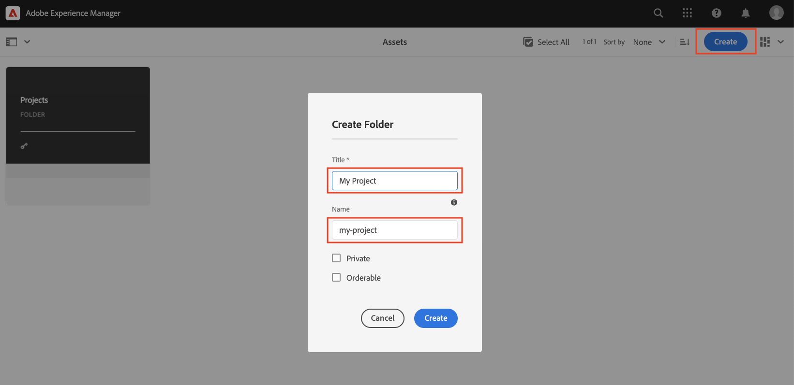

# Creación de fragmentos de contenido {#authoring-content-fragments}

En este capítulo creará y editará un nuevo fragmento de contenido basado en la variable [Modelo de fragmento de contenido definido recientemente](./content-fragment-models.md). También aprenderá a crear variaciones de fragmentos de contenido.

## Requisitos previos {#prerequisites}

Este es un tutorial de varias partes y se da por hecho que los pasos descritos en la sección [Definición de modelos de fragmento de contenido](./content-fragment-models.md) se han completado.

## Objetivos {#objectives}

* Creación de un fragmento de contenido basado en un modelo de fragmento de contenido
* Creación de una variación de fragmento de contenido

## Crear una carpeta de recursos

Los fragmentos de contenido se almacenan en carpetas de AEM Assets. Para crear fragmentos de contenido a partir de los modelos creados en el capítulo anterior, se debe crear una carpeta para almacenarlos. Se requiere una configuración en la carpeta para permitir la creación de fragmentos de modelos específicos.

1. Desde la pantalla Inicio de AEM vaya a **Recursos** > **Archivos**.

   

1. Toque **Crear** en la esquina y pulse **Carpeta**. En el cuadro de diálogo resultante, introduzca:

   * Título*: **Mi proyecto**
   * Nombre: **my-project**

   

1. Seleccione el **My Folder** carpeta y toque **Propiedades**.

   

1. Toque . **Cloud Services** pestaña . En **Configuración de nube** utilice el buscador de rutas para seleccionar la variable **Mi proyecto** configuración. El valor debe ser `/conf/my-project`.

   

   Al establecer esta propiedad, se habilitarán los fragmentos de contenido que se crearán con los modelos creados en el capítulo anterior.

1. Toque . **Políticas** pestaña . En **Modelos de fragmento de contenido permitidos** utilice el buscador de rutas para seleccionar la variable **Persona** y **Equipo** modelo creado anteriormente.

   

   Estas directivas las hereda automáticamente cualquier subcarpeta y se pueden sobrescribir. Tenga en cuenta que también puede permitir modelos mediante etiquetas o habilitar modelos desde otras configuraciones de proyecto. Este mecanismo proporciona una manera poderosa de administrar la jerarquía de contenido.

1. Toque **Guardar y cerrar** para guardar los cambios en las propiedades de la carpeta.

1. Vaya dentro de la **Mi proyecto** carpeta.

1. Cree otra carpeta con los siguientes valores:

   * Título*: **Inglés**
   * Nombre: **en**

   Una práctica recomendada es configurar proyectos para la compatibilidad multilingüe. Consulte [la siguiente página de documentos para obtener más información](https://experienceleague.adobe.com/docs/experience-manager-cloud-service/content/assets/admin/translate-assets.html).

## Crear un fragmento de contenido {#create-content-fragment}

A continuación, se crean varios fragmentos de contenido en función de la variable **Equipo** y **Persona** modelos.

1. En la pantalla de inicio de AEM, pulse **Fragmentos de contenido** para abrir la interfaz de usuario de fragmentos de contenido.

   

1. En el carril izquierdo, expanda **Mi proyecto** y toque **Inglés**.
1. Toque **Crear** para que aparezca el **Nuevo fragmento de contenido** e introduzca los siguientes valores:

   * Lugar de residencia: `/content/dam/my-project/en`
   * Modelo de fragmento de contenido: **Persona**
   * Título: **John Doe**
   * Nombre: `john-doe`

   
1. Toque **Crear**.
1. Repita los pasos anteriores para crear un nuevo fragmento que represente **Alison Smith**:

   * Lugar de residencia: `/content/dam/my-project/en`
   * Modelo de fragmento de contenido: **Persona**
   * Título: **Alison Smith**
   * Nombre: `alison-smith`

   Toque **Crear** para crear el nuevo fragmento de persona.

1. A continuación, repita los pasos para crear una nueva **Equipo** representación de fragmentos **Team Alpha**:

   * Lugar de residencia: `/content/dam/my-project/en`
   * Modelo de fragmento de contenido: **Equipo**
   * Título: **Team Alpha**
   * Nombre: `team-alpha`

   Toque **Crear** para crear el nuevo fragmento de equipo.

1. Ahora debe haber tres fragmentos de contenido debajo de **Mi proyecto** > **Inglés**:

   

## Editar fragmentos de contenido de persona {#edit-person-content-fragments}

A continuación, rellene los fragmentos recién creados con datos.

1. Pulse la casilla de verificación situada junto a **John Doe** y toque **Apertura**.

   

1. El Editor de fragmentos de contenido contiene un formulario basado en el modelo de fragmento de contenido. Complete los distintos campos para añadir contenido a la **John Doe** fragmento. Para Imagen de perfil, cargue su propia imagen en AEM Assets.

   

1. Toque **Guardar y cerrar** para guardar los cambios en el fragmento John Doe.
1. Vuelva a la interfaz de usuario del fragmento de contenido y abra el **Alison Smith** para editar.
1. Repita los pasos anteriores para rellenar la variable **Alison Smith** fragmento con contenido.

## Editar fragmento de contenido del equipo {#edit-team-content-fragment}

1. Abra el **Team Alpha** Fragmento de contenido mediante la interfaz de usuario del fragmento de contenido.
1. Rellene los campos para **Título**, **Nombre corto** y **Descripción**.
1. Seleccione el **John Doe** y **Alison Smith** Fragmentos de contenido para rellenar la variable **Miembros del equipo** campo:

   

   >[!NOTE]
   >
   >También puede crear nuevos fragmentos de contenido en línea utilizando la variable **Nuevo fragmento de contenido** botón.

1. Toque **Guardar y cerrar** para guardar los cambios en el fragmento Team Alpha.

## Publicar fragmentos de contenido

Tras revisión y verificación, publique el `Content Fragments`

1. En la pantalla de inicio de AEM, pulse **Fragmentos de contenido** para abrir la interfaz de usuario de fragmentos de contenido.

1. En el carril izquierdo, expanda **Mi proyecto** y toque **Inglés**.

1. Pulse la casilla de verificación situada junto a los fragmentos de contenido y pulse **Publicación**

   

## Felicitaciones! {#congratulations}

Felicidades, acaba de crear varios fragmentos de contenido y crear una variación.

## Siguientes pasos {#next-steps}

En el capítulo siguiente, [Explorar las API de GraphQL](explore-graphql-api.md), explorará AEM API de GraphQL mediante la herramienta integrada GrapiQL. Descubra cómo AEM genera automáticamente un esquema de GraphQL basado en un modelo de fragmento de contenido. Experimentará la construcción de consultas básicas mediante la sintaxis de GraphQL.

## Documentación relacionada

* [Administrar fragmentos de contenido](https://experienceleague.adobe.com/docs/experience-manager-cloud-service/content/assets/content-fragments/content-fragments-managing.html)
* [Variaciones: Crear contenido de fragmentos](https://experienceleague.adobe.com/docs/experience-manager-cloud-service/content/assets/content-fragments/content-fragments-variations.html)
