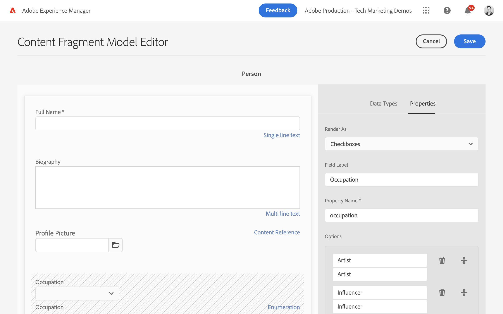
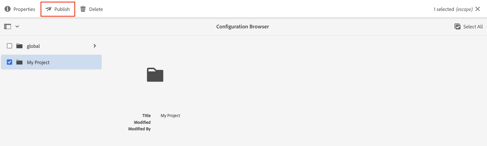

# Definición de modelos de fragmento de contenido {#content-fragment-models}

En este capítulo, aprenda a modelar contenido y a crear un esquema con **Modelos de fragmento de contenido**. Aprenderá los diferentes tipos de datos que se pueden usar para definir un esquema como parte del modelo.

En este capítulo se crean dos modelos simples: **Equipo** y **Persona**. La variable **Equipo** el modelo de datos tiene nombre, nombre corto y descripción, y hace referencia a la variable **Persona** modelo de datos, que tiene nombre completo, detalles de biografía, imagen de perfil y lista de ocupaciones.

También puede crear su propio modelo siguiendo los pasos básicos y modificar los pasos respectivos, como las consultas de GraphQL y el código de la aplicación React , o simplemente seguir los pasos descritos en estos capítulos.

## Requisitos previos {#prerequisites}

Este es un tutorial de varias partes y se da por hecho que se ha configurado un [AEM entorno de creación está disponible](./overview.md#prerequisites)

## Objetivos {#objectives}

* Cree un nuevo modelo de fragmento de contenido.
* Identifique los tipos de datos disponibles y las opciones de validación para crear modelos.
* Definición del modelo de fragmento de contenido **both** el esquema de datos y la plantilla de creación para un fragmento de contenido.

## Crear una nueva configuración de proyecto

Una configuración de proyecto contiene todos los modelos de fragmento de contenido asociados a un proyecto en particular y proporciona un medio para organizar los modelos. Se debe crear al menos un proyecto **before** crear nuevo modelo de fragmento de contenido.

1. Inicie sesión en el AEM **Autor** entorno (p. ej. `https://author-pYYYY-eXXXX.adobeaemcloud.com/`)
1. En la pantalla Inicio de AEM, vaya a **Herramientas** > **General** > **Explorador de configuración**.

   
1. Haga clic en **Crear**.
1. En el cuadro de diálogo resultante, introduzca:

   * Título*: **Mi proyecto**
   * Nombre*: **my-project** (prefiera usar todas las minúsculas utilizando guiones para separar palabras. Esta cadena influye en el extremo único de GraphQL con el que las aplicaciones cliente realizarán solicitudes).
   * Marque **Modelos de fragmento de contenido**
   * Marque **Consultas persistentes de GraphQL**

   

## Crear modelos de fragmento de contenido

A continuación, cree dos modelos para un **Equipo** y **Persona**.

### Creación del modelo de persona

Cree un nuevo modelo para un **Persona**, que es el modelo de datos que representa a una persona que forma parte de un equipo.

1. En la pantalla Inicio de AEM, vaya a **Herramientas** > **General** > **Modelos de fragmento de contenido**.

   

1. Vaya a **Mi proyecto** carpeta.
1. Toque **Crear** en la esquina superior derecha para que aparezca la variable **Crear modelo** asistente.
1. Para **Título de modelo** introduzca: **Persona** y toque **Crear**.

   Toque **Apertura** en el cuadro de diálogo resultante, para abrir el modelo recién creado.

1. Arrastre y suelte una **Texto de una sola línea** en el panel principal. Introduzca las siguientes propiedades en el **Propiedades** pestaña:

   * **Etiqueta de campo**: **Nombre completo**
   * **Nombre de propiedad**: `fullName`
   * Marque **Requerido**

   

   La variable **Nombre de propiedad** define el nombre de la propiedad que se mantiene en AEM. La variable **Nombre de propiedad** también define el **key** nombre para esta propiedad como parte del esquema de datos. Esta **key** se utiliza cuando los datos del fragmento de contenido se exponen mediante las API de GraphQL.

1. Toque . **Tipos de datos** y arrastre y suelte una **Texto de varias líneas** debajo del **Nombre completo** campo . Introduzca las siguientes propiedades:

   * **Etiqueta de campo**: **Biografía**
   * **Nombre de propiedad**: `biographyText`
   * **Tipo predeterminado**: **Texto enriquecido**

1. Haga clic en el **Tipos de datos** y arrastre y suelte una **Referencia de contenido** campo . Introduzca las siguientes propiedades:

   * **Etiqueta de campo**: **Imagen del perfil**
   * **Nombre de propiedad**: `profilePicture`
   * **Ruta de acceso raíz**: `/content/dam`

   Al configurar la variable **Ruta raíz** puede hacer clic en el botón **carpeta** para que aparezca un modal y seleccione la ruta. Esto restringirá las carpetas que los autores pueden utilizar para rellenar la ruta. `/content/dam` es la raíz en la que se almacenan todos los recursos AEM (imágenes, vídeos, otros fragmentos de contenido).

1. Agregue una validación al **Referencia de imagen** para que solo los tipos de contenido **Imágenes** se puede utilizar para rellenar el campo .

   

1. Haga clic en el **Tipos de datos** y arrastre y suelte una **Enumeración**  tipo de datos debajo de **Referencia de imagen** campo . Introduzca las siguientes propiedades:

   * **Representar como**: **Casillas de verificación**
   * **Etiqueta de campo**: **Ocupación**
   * **Nombre de propiedad**: `occupation`

1. Agregue varias **Opciones** usando la variable **Agregar una opción** botón. Use el mismo valor para **Etiqueta de opción** y **Valor de opción**:

   **Artista**, **Influenciador**, **Fotógrafo**, **Viajero**, **Escritor**, **YouTuber**

1. El final **Persona** debería tener el siguiente aspecto:

   

1. Haga clic en **Guardar** para guardar los cambios.

### Creación del modelo de equipo

Cree un nuevo modelo para un **Equipo**, que es el modelo de datos para un equipo de personas. El modelo de equipo hará referencia al modelo de persona para representar a los miembros del equipo.

1. En el **Mi proyecto** carpeta, toque **Crear** en la esquina superior derecha para que aparezca la variable **Crear modelo** asistente.
1. Para **Título de modelo** introduzca: **Equipo** y toque **Crear**.

   Toque **Apertura** en el cuadro de diálogo resultante, para abrir el modelo recién creado.

1. Arrastre y suelte una **Texto de una sola línea** en el panel principal. Introduzca las siguientes propiedades en el **Propiedades** pestaña:

   * **Etiqueta de campo**: **Título**
   * **Nombre de propiedad**: `title`
   * Marque **Requerido**

1. Toque . **Tipos de datos** y arrastre y suelte una **Texto de una sola línea** en el panel principal. Introduzca las siguientes propiedades en el **Propiedades** pestaña:

   * **Etiqueta de campo**: **Nombre corto**
   * **Nombre de propiedad**: `shortName`
   * Marque **Requerido**
   * Marque **Único**
   * En **Tipo de validación** > elija **Personalizado**
   * En **Regímenes de validación personalizados** > introduzca `^[a-z0-9\-_]{5,40}$` : esto garantizará que solo se puedan introducir valores alfanuméricos en minúsculas y guiones entre 5 y 40 caracteres.

   La variable `shortName` nos proporcionará una forma de consultar a un equipo individual en función de una ruta abreviada. La variable **Único** garantiza que el valor siempre será único por fragmento de contenido de este modelo.

1. Toque . **Tipos de datos** y arrastre y suelte una **Texto de varias líneas** debajo del **Nombre corto** campo . Introduzca las siguientes propiedades:

   * **Etiqueta de campo**: **Descripción**
   * **Nombre de propiedad**: `description`
   * **Tipo predeterminado**: **Texto enriquecido**

1. Haga clic en el **Tipos de datos** y arrastre y suelte una **Referencia de fragmento** campo . Introduzca las siguientes propiedades:

   * **Representar como**: **Campo múltiple**
   * **Etiqueta de campo**: **Miembros del equipo**
   * **Nombre de propiedad**: `teamMembers`
   * **Modelos de fragmento de contenido permitidos**: Utilice el icono de carpeta para seleccionar la variable **Persona** modelo.

1. El final **Equipo** debería tener el siguiente aspecto:

   

1. Haga clic en **Guardar** para guardar los cambios.

1. Ahora debería tener dos modelos para trabajar:

   

## Publicar configuración de proyecto y modelos de fragmento de contenido

Tras revisión y verificación, publique el `Project Configuration` &amp; `Content Fragment Model`

1. En la pantalla Inicio de AEM, vaya a **Herramientas** > **General** > **Explorador de configuración**.

1. Pulse la casilla de verificación situada junto a **Mi proyecto** y toque **Publicación**

   

1. En la pantalla Inicio de AEM, vaya a **Herramientas** > **General** > **Modelos de fragmento de contenido**.

1. Vaya a **Mi proyecto** carpeta.

1. Toque **Persona** y **Equipo** modelos y toque **Publicación**

   

## Felicitaciones! {#congratulations}

¡Enhorabuena, acaba de crear sus primeros modelos de fragmento de contenido!

## Siguientes pasos {#next-steps}

En el capítulo siguiente, [Creación de modelos de fragmento de contenido](author-content-fragments.md), creará y editará un nuevo fragmento de contenido basado en un modelo de fragmento de contenido. También aprenderá a crear variaciones de fragmentos de contenido.

## Documentación relacionada

* [Modelos de fragmentos de contenido](https://experienceleague.adobe.com/docs/experience-manager-cloud-service/content/assets/content-fragments/content-fragments-models.html)

