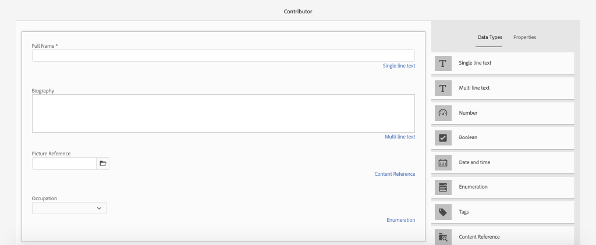

# Definición de modelos de fragmento de contenido {#content-fragment-models}

En este capítulo, aprenda a modelar contenido y a crear un esquema con **Modelos de fragmento de contenido**. Revisará los modelos existentes y creará un nuevo modelo. También aprenderá los diferentes tipos de datos que se pueden utilizar para definir un esquema como parte del modelo.

En este capítulo creará un nuevo modelo para un **Colaborador**, que es el modelo de datos para los usuarios que crean revistas y contenido de aventura como parte de la marca WKND.

## Requisitos previos {#prerequisites}

Este es un tutorial de varias partes y se da por hecho que los pasos descritos en la sección [Configuración rápida](../quick-setup/local-sdk.md) se han completado.

## Objetivos {#objectives}

* Cree un nuevo modelo de fragmento de contenido.
* Identifique los tipos de datos disponibles y las opciones de validación para crear modelos.
* Definición del modelo de fragmento de contenido **both** el esquema de datos y la plantilla de creación para un fragmento de contenido.

## Información general del modelo de fragmento de contenido {#overview}

>[!VIDEO](https://video.tv.adobe.com/v/22452/?quality=12&learn=on)

El vídeo anterior ofrece información general de alto nivel sobre el trabajo con los modelos de fragmento de contenido.

>[!CAUTION]
>
> El vídeo anterior muestra la creación de la variable **Colaborador** modelo con el nombre `Contributors`. Al realizar los pasos en su propio entorno, asegúrese de que el título utiliza el formulario singular: `Contributor` sin el **s**. El nombre del Modelo de fragmento de contenido impulsa las llamadas a la API de GraphQL que se realizarán más adelante en el tutorial.

## Inspect: el modelo de fragmento de contenido de aventura

En el capítulo anterior, se editaron varios fragmentos de contenido de aventuras y se mostraban en una aplicación externa. Inspeccionemos el Modelo de fragmento de contenido de aventura para comprender el esquema de datos subyacente de estos fragmentos.

1. En el **Inicio de AEM** vaya a **Herramientas** > **Recursos** > **Modelos de fragmento de contenido**.

   

1. Vaya a **Sitio WKND** y pase el ratón sobre la carpeta **Aventura** Modelo de fragmento de contenido y haga clic en el botón **Editar** para abrir el modelo.

   

1. Esto abre el **Editor del modelo de fragmento de contenido**. Observe que los campos definen el modelo Adventure incluyen diferentes **Tipos de datos** like **Texto de una sola línea**, **Texto de varias líneas**, **Enumeración** y **Referencia de contenido**.

1. La columna derecha del editor enumera las **Tipos de datos** que definen los campos de formulario utilizados para la creación de fragmentos de contenido.

1. Seleccione el **Título** en el panel principal. En la columna derecha, haga clic en el botón **Propiedades** pestaña:

   

   Observe el **Nombre de propiedad** el campo está definido como `adventureTitle`. Define el nombre de la propiedad que se mantiene en AEM. La variable **Nombre de propiedad** también define el **key** nombre para esta propiedad como parte del esquema de datos. Esta **key** se utilizará cuando los datos del fragmento de contenido se expongan mediante las API de GraphQL.

   >[!CAUTION]
   >
   > Modificación de la variable **Nombre de propiedad** de un campo **after** Los fragmentos de contenido se derivan del modelo, tiene efectos descendentes. Ya no se hará referencia a los valores de campo de los fragmentos existentes y el esquema de datos expuesto por GraphQL cambiará, lo que afectará a las aplicaciones existentes.

1. Desplácese hacia abajo en la **Propiedades** y vea la **Tipo de validación** lista desplegable.

   

   Las validaciones de formulario predeterminadas están disponibles para **Correo electrónico** y **URL**. También es posible definir un **Personalizado** validación mediante una expresión regular.

1. Haga clic en **Cancelar** para cerrar el Editor del modelo de fragmento de contenido.

## Creación de un modelo de colaborador

A continuación, cree un nuevo modelo para un **Colaborador**, que es el modelo de datos para los usuarios que crean revistas y contenido de aventura como parte de la marca WKND.

1. Haga clic en **Crear** en la esquina superior derecha para que aparezca la variable **Crear modelo** asistente.
1. Para **Título de modelo** introduzca: **Colaborador** y haga clic en **Crear**

   

   Haga clic en **Apertura** para abrir el modelo recién creado.

1. Arrastre y suelte una **Texto de una sola línea** en el panel principal. Introduzca las siguientes propiedades en el **Propiedades** pestaña:

   * **Etiqueta de campo**: **Nombre completo**
   * **Nombre de propiedad**: `fullName`
   * Marque **Requerido**

   

1. Haga clic en el **Tipos de datos** y arrastre y suelte una **Texto de varias líneas** debajo del **Nombre completo** campo . Introduzca las siguientes propiedades:

   * **Etiqueta de campo**: **Biografía**
   * **Nombre de propiedad**: `biographyText`
   * **Tipo predeterminado**: **Texto enriquecido**

1. Haga clic en el **Tipos de datos** y arrastre y suelte una **Referencia de contenido** campo . Introduzca las siguientes propiedades:

   * **Etiqueta de campo**: **Referencia de imagen**
   * **Nombre de propiedad**: `pictureReference`
   * **Ruta de acceso raíz**: `/content/dam/wknd`

   Al configurar la variable **Ruta raíz** puede hacer clic en el botón **carpeta** para que aparezca un modal y seleccione la ruta. Esto restringirá las carpetas que los autores pueden utilizar para rellenar la ruta.

   

1. Agregue una validación al **Referencia de imagen** para que solo los tipos de contenido **Imágenes** se puede utilizar para rellenar el campo .

   

1. Haga clic en el **Tipos de datos** y arrastre y suelte una **Enumeración**  tipo de datos debajo de **Referencia de imagen** campo . Introduzca las siguientes propiedades:

   * **Etiqueta de campo**: **Ocupación**
   * **Nombre de propiedad**: `occupation`

1. Agregue varias **Opciones** usando la variable **Agregar una opción** botón. Use el mismo valor para **Etiqueta de opción** y **Valor de opción**:

   **Artista**, **Influenciador**, **Fotógrafo**, **Viajero**, **Escritor**, **YouTuber**

   

1. El final **Colaborador** debería tener el siguiente aspecto:

   

1. Haga clic en **Guardar** para guardar los cambios.

## Activación del modelo de colaborador

Los modelos de fragmento de contenido deben ser **Habilitado** antes de que los autores de contenido puedan usarlo. Es posible **Deshabilitar** un modelo de fragmento de contenido, prohibiendo así a los autores utilizarlo. Recuerde que la modificación del **Nombre de propiedad** de un campo en el modelo cambia el esquema de datos subyacente y puede tener efectos descendentes significativos en los fragmentos existentes y las aplicaciones externas. Se recomienda planificar cuidadosamente la convención de nomenclatura utilizada para la variable **Nombre de propiedad** de los campos antes de activar el modelo de fragmento de contenido para los usuarios.

1. Asegúrese de que la variable **Colaborador** el modelo está actualmente en un **Habilitado** estado.

   

   Es posible alternar el estado de un modelo de fragmento de contenido pasando el puntero sobre la tarjeta y haciendo clic en el botón **Deshabilitar** / **Habilitar** icono.

## Felicitaciones! {#congratulations}

¡Enhorabuena, acaba de crear su primer modelo de fragmento de contenido!

## Siguientes pasos {#next-steps}

En el capítulo siguiente, [Creación de modelos de fragmento de contenido](author-content-fragments.md), creará y editará un nuevo fragmento de contenido basado en un modelo de fragmento de contenido. También aprenderá a crear variaciones de fragmentos de contenido.
