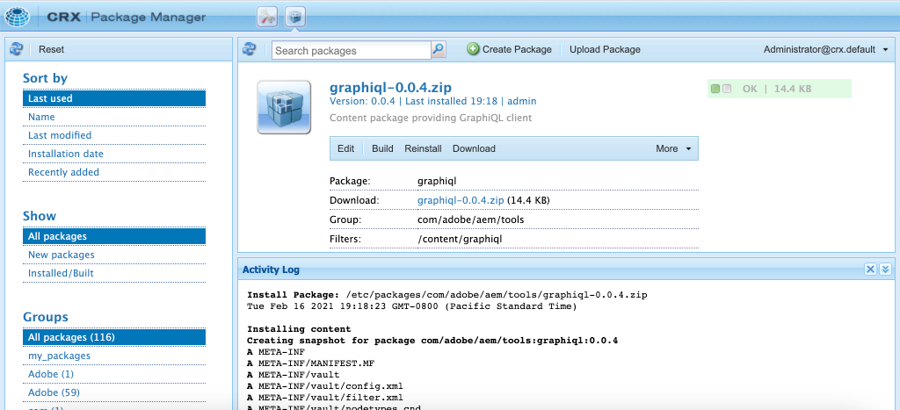

# Explorar las API de GraphQL {#explore-graphql-apis}

La API de GraphQL de AEM proporciona un potente lenguaje de consulta para exponer los datos de fragmentos de contenido a aplicaciones descendentes. Los modelos de fragmento de contenido definen el esquema de datos que utilizan los fragmentos de contenido. Siempre que se crea o actualiza un modelo de fragmento de contenido, el esquema se traduce y se añade al &quot;gráfico&quot; que constituye la API de GraphQL.

En este capítulo, exploraremos algunas consultas comunes de GraphQL para recopilar contenido mediante un IDE llamado [GraphiQL](https://github.com/graphql/graphiql). El IDE de GraphiQL le permite probar y refinar rápidamente las consultas y los datos devueltos. GraphiQL también proporciona fácil acceso a la documentación, lo que facilita la comprensión de los métodos disponibles.

## Requisitos previos {#prerequisites}

Este es un tutorial de varias partes y se da por hecho que los pasos descritos en la sección [Creación de fragmentos de contenido](./author-content-fragments.md) se han completado.

## Objetivos {#objectives}

* Aprenda a utilizar la herramienta GraphiQL para construir una consulta utilizando la sintaxis GraphQL.
* Obtenga información sobre cómo consultar una lista de fragmentos de contenido y un solo fragmento de contenido.
* Obtenga información sobre cómo filtrar y solicitar atributos de datos específicos.
* Aprenda a unir una consulta de varios modelos de fragmento de contenido
* Obtenga información sobre cómo mantener la consulta de GraphQL.

## Habilitación del punto de conexión de GraphQL {#enable-graphql-endpoint}

Se necesita configurar un extremo de GraphQL para habilitar las consultas de API de GraphQL para los fragmentos de contenido.

1. Desde la pantalla Inicio de AEM vaya a **Herramientas** > **General** > **GraphQL**.

   

1. Toque **Crear** en la esquina superior derecha. En el cuadro de diálogo, introduzca los siguientes valores:

   * Nombre*: **My Project Endpoint**.
   * Utilice el esquema GraphQL proporcionado por ... *: **Mi proyecto**

   

   Toque **Crear** para guardar el extremo.

   Los extremos de GraphQL creados en función de una configuración de proyecto solo habilitarán consultas con modelos que pertenezcan a ese proyecto. En este caso, las únicas consultas con la variable **Persona** y **Equipo** se pueden usar modelos.

   >[!NOTE]
   >
   > También se puede crear un punto final global para habilitar consultas con modelos en varias configuraciones. Debe usarse con precaución, ya que puede abrir el entorno a vulnerabilidades de seguridad adicionales y agregar complejidad general a la administración de AEM.

1. Ahora debería ver un extremo de GraphQL habilitado en su entorno.

   

## Uso del IDE de GraphiQL

La variable [Herramienta GraphiQL](https://experienceleague.adobe.com/docs/experience-manager-cloud-service/content/headless/graphql-api/graphiql-ide.html) permite a los desarrolladores crear y probar consultas con contenido del entorno de AEM actual. La herramienta GraphiQL también permite a los usuarios **persist** o guardar consultas para utilizarlas en aplicaciones cliente en una configuración de producción.

A continuación, explore la potencia de AEM API de GraphQL mediante el IDE integrado de GraphiQL.

1. Desde la pantalla Inicio de AEM vaya a **Herramientas** > **General** > **Editor de consultas de GraphQL**.

   

   >[!NOTE]
   >
   > Para versiones anteriores de AEM, es posible que GraphiQL IDE no esté integrado. Se puede instalar manualmente después de estos [instrucciones](#install-graphiql).

1. En la esquina superior derecha, asegúrese de que la variable **Punto final** está configurado como **My Project Endpoint**.

   

Esto abarcará todas las consultas a los modelos creados en la variable **Mi proyecto** proyecto.

### Consultar una lista de fragmentos de contenido {#query-list-cf}

Un requisito habitual es consultar varios fragmentos de contenido.

1. Pegue la siguiente consulta en el panel principal (reemplace la lista de comentarios):

   ```graphql
   query allTeams {
     teamList {
       items {
         _path
         title
       }
     }
   } 
   ```

1. Pulse el botón **Play** en el menú superior para ejecutar la consulta. Debería ver los resultados de los fragmentos de contenido del capítulo anterior:

   

1. Coloque el cursor debajo de la variable `title` texto e introduzca **CTRL+Espacio** a sugerencias de código de déclencheur. Agregar `shortname` y `description` a la consulta.

   

1. Vuelva a ejecutar la consulta presionando el botón **Play** y debería ver los resultados que incluyen las propiedades adicionales de `shortname` y `description`.

   

   La variable `shortname` es una propiedad sencilla y `description` es un campo de texto multilínea y la API de GraphQL nos permite elegir una variedad de formatos para los resultados como `html`, `markdown`, `json` o `plaintext`.

### Consulta de fragmentos anidados

A continuación, experimente con consultas para recuperar fragmentos anidados, recuerde que la variable **Equipo** el modelo hace referencia a la variable **Persona** modelo.

1. Actualice la consulta para incluir el `teamMembers` propiedad. Recuerde que se trata de un **Referencia de fragmento** al Modelo de persona. Se pueden devolver propiedades del modelo Persona :

   ```graphql
   query allTeams {
       teamList {
           items {
               _path
               title
               shortName
               description {
                   plaintext
               }
               teamMembers {
                   fullName
                   occupation
               }
           }
       }
   }
   ```

   Respuesta JSON:

   ```json
   {
       "data": {
           "teamList": {
           "items": [
               {
               "_path": "/content/dam/my-project/en/team-alpha",
               "title": "Team Alpha",
               "shortName": "team-alpha",
               "description": {
                   "plaintext": "This is a description of Team Alpha!"
               },
               "teamMembers": [
                   {
                   "fullName": "John Doe",
                   "occupation": [
                       "Artist",
                       "Influencer"
                   ]
                   },
                   {
                   "fullName": "Alison Smith",
                   "occupation": [
                       "Photographer"
                   ]
                   }
                 ]
           }
           ]
           }
       }
   }
   ```

   La capacidad de realizar consultas con fragmentos anidados es una ventaja de la API AEM GraphQL. En este ejemplo sencillo, el anidado tiene solo dos niveles de profundidad. Sin embargo, es posible anidar fragmentos aún más. Por ejemplo, si había un **Dirección** modelo asociado a un **Persona** sería posible devolver datos de los tres modelos en una sola consulta.

### Filtrar una lista de fragmentos de contenido {#filter-list-cf}

A continuación, veamos cómo es posible filtrar los resultados por un subconjunto de fragmentos de contenido basado en un valor de propiedad.

1. Introduzca la siguiente consulta en la interfaz de usuario de GraphiQL:

   ```graphql
   query personByName($name:String!){
     personList(
       filter:{
         fullName:{
           _expressions:[{
             value:$name
             _operator:EQUALS
           }]
         }
       }
     ){
       items{
         _path
         fullName
         occupation
       }
     }
   }  
   ```

   La consulta anterior realiza una búsqueda con todos los fragmentos de persona del sistema. El filtro añadido al principio de la consulta realizará una comparación en la variable `name` y la cadena variable `$name`.

1. En el **Variables de consulta** introduzca lo siguiente:

   ```json
   {"name": "John Doe"}
   ```

1. Ejecute la consulta, se espera que solo **Personas** devuelve el valor &quot;John Doe&quot;.

   

   Hay muchas otras opciones para filtrar y crear consultas complejas; consulte [Aprender a utilizar GraphQL con AEM: contenido de muestra y consultas](https://experienceleague.adobe.com/docs/experience-manager-cloud-service/assets/admin/content-fragments-graphql-samples.html?lang=es).

1. Mejorar la consulta anterior para recuperar la imagen del perfil

   ```graphql
   query personByName($name:String!){
     personList(
       filter:{
         fullName:{
           _expressions:[{
             value:$name
             _operator:EQUALS
           }]
         }
       }
     ){
       items{  
         _path
         fullName
         occupation
         profilePicture{
           ... on ImageRef{
             _path
             _authorUrl
             _publishUrl
             height
             width
   
           }
         }
       }
     }
   } 
   ```

   La variable `profilePicture` es una referencia de contenido y se espera que sea una imagen, por lo tanto integrada `ImageRef` se utiliza. Esto nos permite solicitar datos adicionales sobre la imagen que es referencia, como el `width` y `height`.

### Consultar un solo fragmento de contenido {#query-single-cf}

También es posible consultar directamente un solo fragmento de contenido. El contenido de AEM se almacena de forma jerárquica y el identificador único de un fragmento se basa en la ruta del fragmento.

1. Introduzca la siguiente consulta en el editor de GraphiQL:

   ```graphql
   query personByPath($path: String!) {
       personByPath(_path: $path) {
           item {
           fullName
           occupation
           }
       }
   }
   ```

1. Introduzca lo siguiente para el **Variables de consulta**:

   ```json
   {"path": "/content/dam/my-project/en/alison-smith"}
   ```

1. Ejecute la consulta y observe que se devuelve el resultado único.

## Conservar consultas {#persist-queries}

Una vez que un desarrollador esté satisfecho con la consulta y los datos devueltos, el siguiente paso es almacenar o mantener la consulta para AEM. [Consultas persistentes](https://experienceleague.adobe.com/docs/experience-manager-cloud-service/content/headless/graphql-api/persisted-queries.html) es el mecanismo preferido para exponer la API de GraphQL a aplicaciones cliente. Una vez que se ha mantenido una consulta, esta se puede solicitar utilizando una solicitud de GET y almacenar en caché en las capas de Dispatcher y CDN. El rendimiento de las consultas persistentes es mucho mejor. Además de las ventajas de rendimiento, las consultas persistentes garantizan que los datos adicionales no se expongan accidentalmente a las aplicaciones del cliente. Más detalles sobre [Las consultas persistentes se pueden encontrar aquí](https://experienceleague.adobe.com/docs/experience-manager-cloud-service/content/headless/graphql-api/persisted-queries.html).

A continuación, persiste dos consultas simples, que se utilizan en el capítulo siguiente.

1. En el IDE de GraphiQL, introduzca la siguiente consulta:

   ```graphql
   query allTeams {
       teamList {
           items {
               _path
               title
               shortName
               description {
                   plaintext
               }
               teamMembers {
                   fullName
                   occupation
               }
           }
       }
   }
   ```

   Compruebe que la consulta funcione.

1. Siguiente toque **Guardar como** y escriba `all-teams` como el **Nombre de consulta**.

   La consulta debería mostrarse en **Consultas persistentes** en el carril izquierdo.

   
1. A continuación, pulse las elipses **...** junto a la consulta persistente y pulse **Copiar URL** para copiar la ruta en el portapapeles.

   

1. Abra una nueva pestaña y pegue la ruta copiada en el explorador:

   ```plain
   https://$YOUR-AEMasCS-INSTANCEID$.adobeaemcloud.com/graphql/execute.json/my-project/all-teams
   ```

   Debería ser similar a la ruta anterior. Debería ver los resultados JSON de la consulta devuelta.

   Desglosar la dirección URL:

   | Nombre | Descripción |
   | ---------|---------- |
   | `/graphql/execute.json` | Punto final de consulta persistente |
   | `/my-project` | Configuración del proyecto para `/conf/my-project` |
   | `/all-teams` | Nombre de la consulta persistente |

1. Vuelva al IDE de GraphiQL y utilice el botón más **+** para continuar con la NUEVA consulta

   ```graphql
   query personByName($name: String!) {
     personList(
       filter: {
         fullName:{
           _expressions: [{
             value: $name
             _operator:EQUALS
           }]
         }
       }){
       items {
         _path
         fullName
         occupation
         biographyText {
           json
         }
         profilePicture {
           ... on ImageRef {
             _path
             _authorUrl
             _publishUrl
             width
             height
           }
         }
       }
     }
   }
   ```

1. Guarde la consulta como: **person-by-name**.
1. Debe tener 2 consultas persistentes guardadas:

   


## Publicar extremo de GraphQL y consultas persistentes

Tras revisión y verificación, publique el `GraphQL Endpoint` &amp; `Persisted Queries`

1. Desde la pantalla Inicio de AEM vaya a **Herramientas** > **General** > **GraphQL**.

1. Pulse la casilla de verificación situada junto a **My Project Endpoint** y toque **Publicación**

   

1. Desde la pantalla Inicio de AEM vaya a **Herramientas** > **General** > **Editor de consultas de GraphQL**

1. Toque . *todos los equipos* en el panel Consultas persistentes y pulse **Publicación**

   

1. Repita el paso anterior para `person-by-name` query

## Archivos de solución {#solution-files}

Descargue el contenido, los modelos y las consultas persistentes creados en los tres últimos capítulos: [tutorial-solution-content.zip](assets/explore-graphql-api/tutorial-solution-content.zip)

## Recursos adicionales

Para ver muchos más ejemplos de consultas de GraphQL, consulte: [Aprender a utilizar GraphQL con AEM: contenido de muestra y consultas](https://experienceleague.adobe.com/docs/experience-manager-cloud-service/assets/admin/content-fragments-graphql-samples.html).

## Felicitaciones! {#congratulations}

¡Felicidades, acaba de crear y ejecutar varias consultas de GraphQL!

## Siguientes pasos {#next-steps}

En el capítulo siguiente, [Generar aplicación React](./graphql-and-react-app.md), explorará cómo una aplicación externa puede consultar AEM extremos de GraphQL y aprovechar estas dos consultas persistentes. También se le introducirá en la gestión de errores básica.

## Instalación de la herramienta GraphiQL (opcional) {#install-graphiql}

Para algunas versiones de AEM la herramienta GraphiQL IDE debe instalarse manualmente. Siga las instrucciones siguientes para instalar manualmente:

1. Vaya a **[Portal de distribución de software](https://experience.adobe.com/#/downloads/content/software-distribution/es-es/aemcloud.html)** > **AEM as a Cloud Service**.
1. Busque “GraphiQL” (asegúrese de incluir la **i** de **GraphiQL**.
1. Descargue el último **Paquete de contenido de GraphiQL v.x.x.x**

   

   El archivo zip es un paquete AEM que se puede instalar directamente.

1. En el menú **Inicio de AEM** vaya a **Herramientas** > **Implementación** > **Paquetes**.
1. Haga clic en **Cargar paquete** y elija el paquete descargado en el paso anterior. Haga clic en **Instalar** para instalar el paquete.

   
