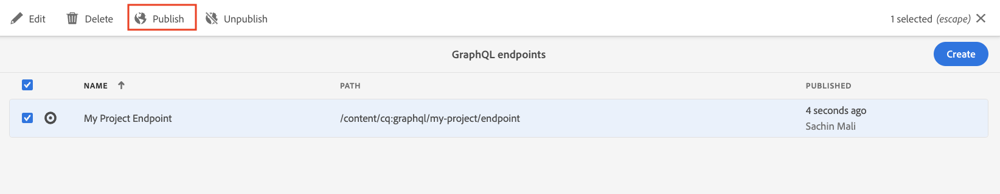

# Explorar las API de GraphQL {#explore-graphql-apis}

La API de GraphQL AEM de proporciona un potente lenguaje de consulta para exponer los datos de los fragmentos de contenido a aplicaciones de flujo descendente. Los modelos de fragmento de contenido definen el esquema de datos que utilizan los fragmentos de contenido. Siempre que se crea o actualiza un modelo de fragmento de contenido, el esquema se traduce y se agrega al &quot;gráfico&quot; que conforma la API de GraphQL.

En este capítulo, vamos a explorar algunas consultas comunes de GraphQL para recopilar contenido mediante un IDE denominado [GraphiQL](https://github.com/graphql/graphiql). El IDE de GraphiQL permite probar y refinar rápidamente las consultas y los datos devueltos. También facilita el acceso a la documentación, lo que facilita la comprensión de los métodos disponibles.

## Requisitos previos {#prerequisites}

Este es un tutorial de varias partes y se da por hecho que los pasos descritos en la sección [Creación de fragmentos de contenido](./author-content-fragments.md) se han completado.

## Objetivos {#objectives}

* Aprenda a utilizar la herramienta GraphiQL para construir una consulta con sintaxis de GraphQL.
* Obtenga información sobre cómo consultar una lista de fragmentos de contenido y un solo fragmento de contenido.
* Obtenga información sobre cómo filtrar y solicitar atributos de datos específicos.
* Obtenga información sobre cómo unirse a una consulta de varios modelos de fragmentos de contenido
* Obtenga información sobre cómo mantener la consulta de GraphQL.

## Habilitación del punto de conexión de GraphQL {#enable-graphql-endpoint}

Se debe configurar un punto de conexión de GraphQL para habilitar las consultas de API de GraphQL para los fragmentos de contenido.

1. AEM En la pantalla Inicio de la, vaya a **Herramientas** > **General** > **GraphQL**.

   

1. Tocar **Crear** en la esquina superior derecha, en el cuadro de diálogo resultante, introduzca los siguientes valores:

   * Nombre*: **Mi extremo del proyecto**.
   * Usar esquema de GraphQL proporcionado por ... *: **Mi proyecto**

   

   Tocar **Crear** para guardar el extremo.

   Los extremos de GraphQL creados en función de una configuración de proyecto solo permiten consultas con modelos que pertenecen a ese proyecto. En este caso, la única consulta contra la variable **Persona** y **Equipo** se pueden utilizar modelos de.

   >[!NOTE]
   >
   > También se puede crear un punto de conexión global para habilitar consultas de modelos en varias configuraciones. AEM Esto debe utilizarse con precaución, ya que puede abrir el entorno a vulnerabilidades de seguridad adicionales y aumentar la complejidad general de la administración de los recursos de la.

1. Ahora debería ver un extremo de GraphQL habilitado en su entorno.

   

## Uso del IDE de GraphiQL

El [GraphiQL](https://experienceleague.adobe.com/docs/experience-manager-cloud-service/content/headless/graphql-api/graphiql-ide.html) AEM Esta herramienta permite a los desarrolladores crear y probar consultas de contenido en el entorno actual de la. La herramienta GraphiQL también permite a los usuarios **persistir o guardar** consultas que deben utilizar las aplicaciones cliente en una configuración de producción.

AEM A continuación, explore la potencia de la API de GraphQL mediante el uso del IDE integrado de GraphiQL.

1. AEM En la pantalla Inicio de la, vaya a **Herramientas** > **General** > **Editor de consultas de GraphQL**.

   

   >[!NOTE]
   >
   > AEM En, es posible que las versiones anteriores del IDE de GraphiQL no estén integradas. Se puede instalar manualmente siguiendo estos pasos [instrucciones](#install-graphiql).

1. En la esquina superior derecha, asegúrese de que el Extremo está configurado como **Mi extremo del proyecto**.

   

Esto ampliará todas las consultas a modelos creados en la **Mi proyecto** proyecto.

### Consulta de una lista de fragmentos de contenido {#query-list-cf}

Un requisito común es consultar varios fragmentos de contenido.

1. Pegue la siguiente consulta en el panel principal (reemplazando la lista de comentarios):

   ```graphql
   query allTeams {
     teamList {
       items {
         _path
         title
       }
     }
   } 
   ```

1. Pulse el botón **Reproducir** en el menú superior para ejecutar la consulta. Debería ver los resultados de los fragmentos de contenido del capítulo anterior:

   

1. Coloque el cursor debajo de `title` texto y escriba **CTRL + Espacio** para obtener sugerencias de código de déclencheur. Añadir `shortname` y `description` a la consulta.

   

1. Vuelva a ejecutar la consulta presionando la tecla **Reproducir** y debería ver que los resultados incluyen las propiedades adicionales de `shortname` y `description`.

   

   El `shortname` es una propiedad simple y `description` es un campo de texto multilínea y la API de GraphQL nos permite elegir varios formatos para los resultados, como `html`, `markdown`, `json`, o `plaintext`.

### Consulta de fragmentos anidados

A continuación, para experimentar con la consulta mediante la recuperación de fragmentos anidados, recuerde que la variable **Equipo** El modelo hace referencia a **Persona** modelo.

1. Actualice la consulta para incluir el `teamMembers` propiedad. Recuerde que se trata de un **Referencia a fragmento** al modelo de persona. Se pueden devolver las propiedades del modelo Person:

   ```graphql
   query allTeams {
       teamList {
           items {
               _path
               title
               shortName
               description {
                   plaintext
               }
               teamMembers {
                   fullName
                   occupation
               }
           }
       }
   }
   ```

   Respuesta JSON:

   ```json
   {
       "data": {
           "teamList": {
           "items": [
               {
               "_path": "/content/dam/my-project/en/team-alpha",
               "title": "Team Alpha",
               "shortName": "team-alpha",
               "description": {
                   "plaintext": "This is a description of Team Alpha!"
               },
               "teamMembers": [
                   {
                   "fullName": "John Doe",
                   "occupation": [
                       "Artist",
                       "Influencer"
                   ]
                   },
                   {
                   "fullName": "Alison Smith",
                   "occupation": [
                       "Photographer"
                   ]
                   }
                 ]
           }
           ]
           }
       }
   }
   ```

   AEM La capacidad de realizar consultas con fragmentos anidados es una práctica funcionalidad de la API de GraphQL de. En este ejemplo sencillo, el anidamiento tiene solo dos niveles de profundidad. Sin embargo, es posible anidar fragmentos aún más. Por ejemplo, si había un **Dirección** modelo asociado a un **Persona** sería posible devolver datos de los tres modelos en una sola consulta.

### Filtrado de una lista de fragmentos de contenido {#filter-list-cf}

A continuación, veamos cómo es posible filtrar los resultados a un subconjunto de fragmentos de contenido en función de un valor de propiedad.

1. Introduzca la siguiente consulta en la interfaz de usuario de GraphiQL:

   ```graphql
   query personByName($name:String!){
     personList(
       filter:{
         fullName:{
           _expressions:[{
             value:$name
             _operator:EQUALS
           }]
         }
       }
     ){
       items{
         _path
         fullName
         occupation
       }
     }
   }  
   ```

   La consulta anterior realiza una búsqueda de todos los fragmentos de persona en el sistema. El filtro añadido al principio de la consulta realiza una comparación en el `name` y la cadena de variable `$name`.

1. En el **Variables de consulta** introduzca lo siguiente:

   ```json
   {"name": "John Doe"}
   ```

1. Ejecute la consulta, se espera que solo **Personas** El fragmento de contenido se devuelve con un valor de `John Doe`.

   

   Existen muchas otras opciones para filtrar y crear consultas complejas. Consulte [Aprender a utilizar GraphQL AEM con el contenido de muestra: contenido y consultas de muestra](https://experienceleague.adobe.com/docs/experience-manager-cloud-service/content/headless/graphql-api/sample-queries.html).

1. Mejore la consulta anterior para recuperar la imagen del perfil

   ```graphql
   query personByName($name:String!){
     personList(
       filter:{
         fullName:{
           _expressions:[{
             value:$name
             _operator:EQUALS
           }]
         }
       }
     ){
       items{  
         _path
         fullName
         occupation
         profilePicture{
           ... on ImageRef{
             _path
             _authorUrl
             _publishUrl
             height
             width
   
           }
         }
       }
     }
   } 
   ```

   El `profilePicture` es una referencia de contenido y se espera que sea una imagen, por lo tanto integrada `ImageRef` se utiliza el objeto. Esto nos permite solicitar datos adicionales sobre la imagen a la que se hace referencia, como la `width` y `height`.

### Consultar un solo fragmento de contenido {#query-single-cf}

También es posible consultar directamente un solo fragmento de contenido. AEM El contenido de los fragmentos se almacena de manera jerárquica y el identificador único de un fragmento se basa en la ruta del fragmento.

1. Introduzca la siguiente consulta en el editor de GraphiQL:

   ```graphql
   query personByPath($path: String!) {
       personByPath(_path: $path) {
           item {
           fullName
           occupation
           }
       }
   }
   ```

1. Introduzca lo siguiente para **Variables de consulta**:

   ```json
   {"path": "/content/dam/my-project/en/alison-smith"}
   ```

1. Ejecute la consulta y observe que se devuelve el único resultado.

## Persistir consultas {#persist-queries}

AEM Una vez que el desarrollador esté satisfecho con la consulta y los datos de resultados devueltos por la consulta, el siguiente paso es almacenar o mantener la consulta en la que se va a realizar el. El [Consultas persistentes](https://experienceleague.adobe.com/docs/experience-manager-cloud-service/content/headless/graphql-api/persisted-queries.html) son el mecanismo preferido para exponer la API de GraphQL a las aplicaciones cliente. Una vez que una consulta ha persistido, se puede solicitar mediante una solicitud de GET y se puede almacenar en caché en las capas de Dispatcher y CDN. El rendimiento de las consultas persistentes es mucho mejor. Además de las ventajas de rendimiento, las consultas persistentes garantizan que los datos adicionales no se expongan accidentalmente a las aplicaciones cliente. Más detalles acerca de [Puede encontrar consultas persistentes aquí](https://experienceleague.adobe.com/docs/experience-manager-cloud-service/content/headless/graphql-api/persisted-queries.html).

A continuación, mantenga dos consultas simples, que se utilizan en el capítulo siguiente.

1. Introduzca la siguiente consulta en el IDE de GraphiQL:

   ```graphql
   query allTeams {
       teamList {
           items {
               _path
               title
               shortName
               description {
                   plaintext
               }
               teamMembers {
                   fullName
                   occupation
               }
           }
       }
   }
   ```

   Compruebe que la consulta funciona.

1. Siguiente toque **Guardar como** y escriba `all-teams` como el **Nombre de consulta**.

   La consulta debe mostrarse en **Consultas persistentes** en el carril izquierdo.

   
1. A continuación, pulse los puntos suspensivos **...** junto a la consulta persistente y pulse **Copiar URL** para copiar la ruta en el portapapeles.

   

1. Abra una pestaña nueva y pegue la ruta copiada en el explorador:

   ```plain
   https://$YOUR-AEMasCS-INSTANCEID$.adobeaemcloud.com/graphql/execute.json/my-project/all-teams
   ```

   Debe ser similar a la ruta anterior. Debe ver que se devuelven los resultados JSON de la consulta.

   Desglose de la dirección URL anterior:

   | Nombre | Descripción |
   | ---------|---------- |
   | `/graphql/execute.json` | Punto final de consulta persistente |
   | `/my-project` | Configuración del proyecto para `/conf/my-project` |
   | `/all-teams` | Nombre de la consulta persistente |

1. Vuelva al IDE de GraphiQL y utilice el botón &quot;+&quot; **+** para mantener la nueva consulta

   ```graphql
   query personByName($name: String!) {
     personList(
       filter: {
         fullName:{
           _expressions: [{
             value: $name
             _operator:EQUALS
           }]
         }
       }){
       items {
         _path
         fullName
         occupation
         biographyText {
           json
         }
         profilePicture {
           ... on ImageRef {
             _path
             _authorUrl
             _publishUrl
             width
             height
           }
         }
       }
     }
   }
   ```

1. Guarde la consulta como: `person-by-name`.
1. Debe tener dos consultas persistentes guardadas:

   


## Publicar extremo y consultas persistentes de GraphQL

Tras la revisión y verificación, publique el `GraphQL Endpoint` &amp; `Persisted Queries`

1. AEM En la pantalla Inicio de la, vaya a **Herramientas** > **General** > **GraphQL**.

1. Pulse la casilla que hay junto a **Mi extremo del proyecto** y pulse **Publish**

   

1. AEM En la pantalla Inicio de la, vaya a **Herramientas** > **General** > **Editor de consultas de GraphQL**

1. Pulse el botón **todos los equipos** consulte en el panel Consultas persistentes y pulse **Publish**

   

1. Repita el paso anterior para `person-by-name` query

## Archivos de solución {#solution-files}

Descargue el contenido, los modelos y las consultas persistentes creadas en los últimos tres capítulos: [basic-tutorial-solution.content.zip](assets/explore-graphql-api/basic-tutorial-solution.content.zip)

## Recursos adicionales

Obtenga más información acerca de las consultas de GraphQL en [Aprender a utilizar GraphQL AEM con el contenido de muestra: contenido y consultas de muestra](https://experienceleague.adobe.com/docs/experience-manager-cloud-service/content/headless/graphql-api/sample-queries.html).

## Enhorabuena. {#congratulations}

¡Felicidades, ha creado y ejecutado varias consultas de GraphQL!

## Pasos siguientes {#next-steps}

En el capítulo siguiente, [Generar aplicación de React](./graphql-and-react-app.md)AEM Sin embargo, puede explorar cómo una aplicación externa puede consultar puntos de conexión de GraphQL y utilizar estas dos consultas persistentes. También se le presentarán algunas funciones básicas de gestión de errores durante la ejecución de consultas de GraphQL.

## Instalación de la herramienta GraphiQL (opcional) {#install-graphiql}

AEM En, algunas versiones de la herramienta IDE de GraphiQL (6.X.X) que deben instalarse manualmente, utilice la versión de [instrucciones desde aquí](../how-to/install-graphiql-aem-6-5.md).

